# 在 Python 中处理时间序列数据的必备技巧集合

> 原文：<https://towardsdatascience.com/a-collection-of-must-know-techniques-for-working-with-time-series-data-in-python-7c01d199b184>

## 如何轻松操作和可视化日期时间格式的时间序列数据


xsIJciJN 的插图来自[illustrtac](https://en.ac-illust.com/clip-art/1891396)

起初，处理时间序列数据可能会令人生畏。时间序列值不是您需要考虑的唯一信息。时间戳还包含信息，尤其是关于值之间关系的信息。

> 时间戳还包含信息，尤其是关于值之间关系的信息。

与常见的数据类型相比，时间戳有一些独特的特征。虽然乍一看它们像一个字符串，但它们也有数字方面。

本文将为您提供以下处理时间序列数据的必备技巧:

**如何处理日期时间格式**
∘ [读取日期时间格式](#bc83)
∘ [将字符串转换为日期时间格式](#8fa5)
∘ [将 Unix 时间转换为日期时间格式](#768c)
∘ [创建日期范围](#02a0)
∘ [更改日期时间格式](#6dbf)
**如何合成并分解日期时间**
∘ [分解日期时间](#850c)
∘ 填充缺失值
∘ [用常数值填充缺失值](#2ac8)
∘ [用最后一个值填充缺失值](#9bbc)
∘ [用线性插值填充缺失值](#976f)
**如何对时间序列执行运算**
∘ [获取最小值和最大值](#6f87)
∘ [求差](#c224)
∘ [累积](#c3c8) [两个时间戳之间的时间差](#c3c8)
**如何过滤时间序列**
∘ [过滤特定时间戳上的时间序列](#0ad5)
∘ [过滤时间范围上的时间序列](#4c8c)
**如何对时间序列进行重采样**
∘ [下采样](#2bf9)
∘ [上采样](#7efb)
**绘制时间线
∘ [设置时间序列的 x 轴限值](#f323)
∘ [设置时间序列的 x 轴刻度](#1f87)**

对于本文，我们将使用一个最小的虚构数据集。它有三列:`date`、`cat_feature`和`num_feature`。

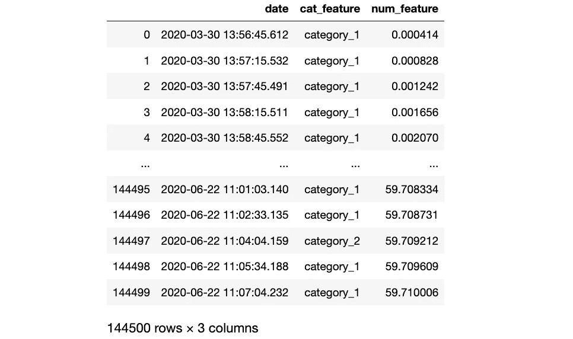

虚构的最小时间序列数据集作为 pandas DataFrame 加载(图片由作者提供)

# 如何处理日期时间格式

时间序列数据的基本部分是时间戳。如果这些时间戳采用 [Datetime](https://docs.python.org/3/library/datetime.html#datetime.datetime) 格式，您可以应用各种操作，我们将在本节中讨论。

## 读取日期时间格式

默认情况下，当从 CSV 文件中读取时，pandas 将时间戳列作为字符串读入 DataFrame。要将时间戳列作为 [datetime](https://docs.python.org/3/library/datetime.html#datetime.datetime) 对象(数据类型为`datetime64[ns]`)直接读取，可以使用`parse_date`参数，如下所示。

```
import pandas as pddf = pd.read_csv("example.csv", 
                 **parse_dates = ["date"]**) 
```


虚构的最小时间序列数据集作为 pandas DataFrame 加载(图片由作者提供)

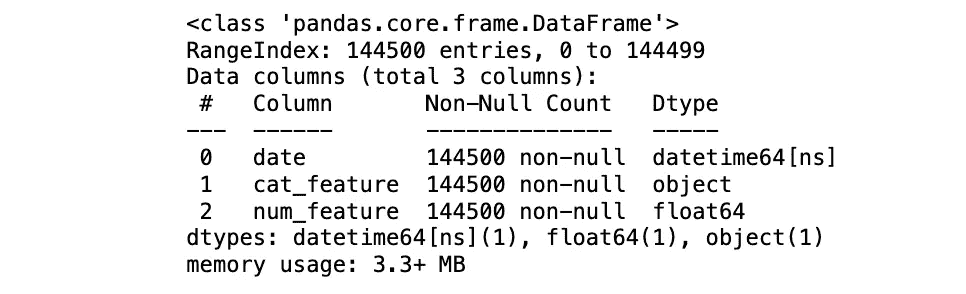

时间戳的数据类型为 datetime64[ns](图片由作者提供)

## 将字符串转换为日期时间

要将字符串转换成`datetime64[ns]`格式，可以使用`[.to_datetime()](https://pandas.pydata.org/docs/reference/api/pandas.to_datetime.html)`方法。如果在导入过程中不能使用`parse_dates`参数，这很方便。可以查一下相关的`[strftime](https://strftime.org/)` 格式。

```
# By default the date column is imported as string
df = pd.read_csv("example.csv")# Convert to datetime data type
df["date"] = pd.to_datetime(df["date"], 
                            **format = "%Y-%m-%d %H:%M:%S.%f"**)
```


虚构的最小时间序列数据集作为 pandas DataFrame 加载(图片由作者提供)

## 将 Unix 时间转换为日期时间格式

如果您的时间戳列是 Unix 时间，那么您可以通过使用`unit`参数，使用`[.to_datetime()](https://pandas.pydata.org/docs/reference/api/pandas.to_datetime.html)`方法将其转换为人类可读的格式。

```
# Convert from unix
df["date"] = pd.to_datetime(df["date_unix"], 
                                 **unit = "s"**)# Convert to unix
df["date_unix"] = df["date"]**.view('int64')**
```

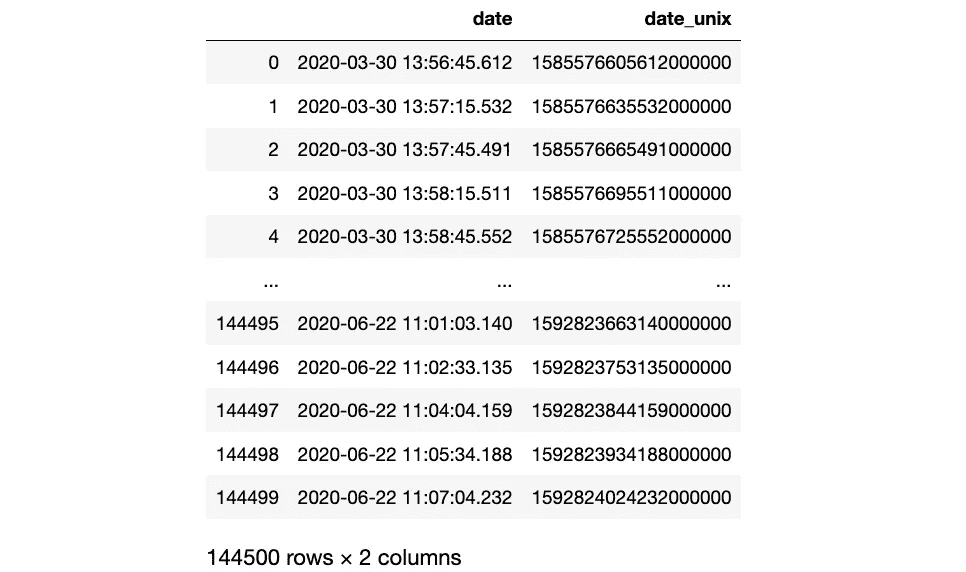

时间戳转换为 unix(图片由作者提供)

## 创建日期范围

如果要创建一个日期范围，有两种选择:

*   用开始日期和结束日期定义日期范围
*   用开始日期、频率(例如，每天、每月等)定义日期范围。)，以及周期数。

```
df["date"] = pd.date_range(start = "2022-01-01", 
                           end = "2022-12-31")df["date"] = pd.date_range(start = "2022-01-01", 
                           periods = 365, 
                           freq = "D")
```

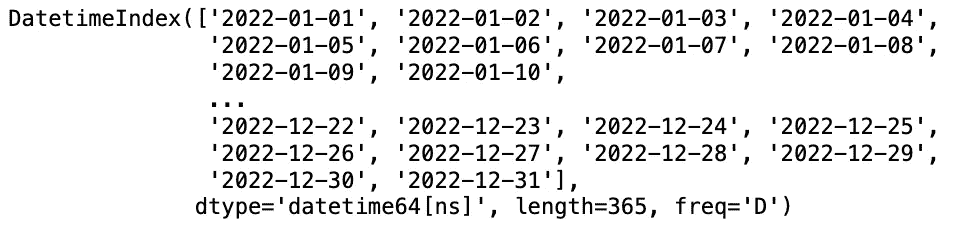

熊猫系列的一系列日期(图片由作者提供)

## 更改日期时间格式

要更改时间戳格式，您可以使用`[.strftime()](https://docs.python.org/3/library/datetime.html#strftime-strptime-behavior)`方法。

```
# Example: Change "2022-01-01" to "January 1, 2022"
df["date"] = df["date"].dt.strftime("%b %d, %Y")
```

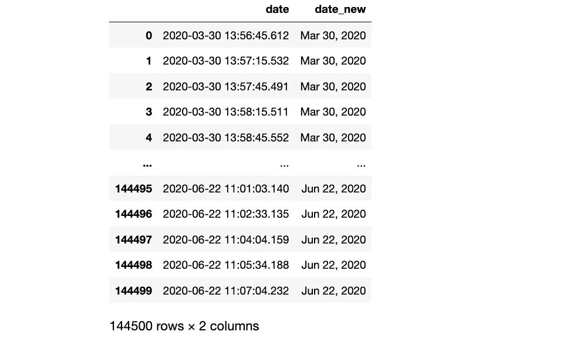

用 strftime 更改了 datetime 格式(图片由作者提供)

# 如何合成和分解日期时间

时间戳由许多东西组成，比如日期或时间，或者更细粒度的东西，比如小时或分钟。这一节将讨论如何将日间数据类型分解成它的组成部分，以及如何从包含时间戳组成部分的不同列组成一个[日期时间](https://docs.python.org/3/library/datetime.html#datetime.datetime)数据类型。

## 分解日期时间

当您有日期和时间戳时，您可以将它们分解成它们的组成部分，如下所示。

```
# Splitting date and time
df["dates"] = df["date"].dt.date
df["times"] = df["date"].dt.time
```

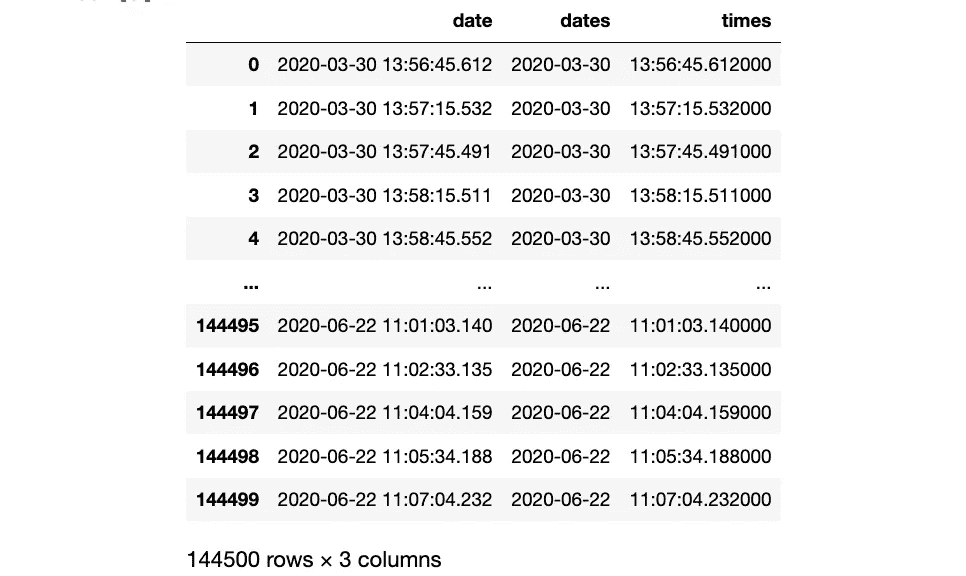

时间戳分解为日期和时间(图片由作者提供)

您还可以将它分解成更小的组件，如下所示。您可以在 [pandas DatetimeIndex 文档](https://pandas.pydata.org/pandas-docs/stable/reference/api/pandas.DatetimeIndex.html)中找到更多可能的组件。

```
# Creating datetimeindex features
df["year"] = df["date"].dt.year
df["month"] = df["date"].dt.month
df["day"] = df["date"].dt.day
# etc.
```

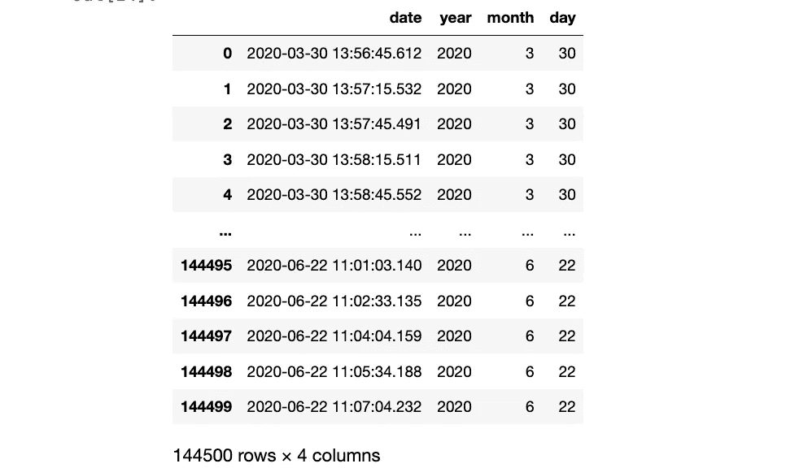

时间戳分解为年、月和日(图片由作者提供)

## 将多个列组合成一个日期时间

如果您想从年、月和日等组成部分组装一个日期列，也可以使用`[.to_datetime()](https://pandas.pydata.org/docs/reference/api/pandas.to_datetime.html)`方法。

```
df["date"] = pd.to_datetime(df[["year", "month", "day"]])
```

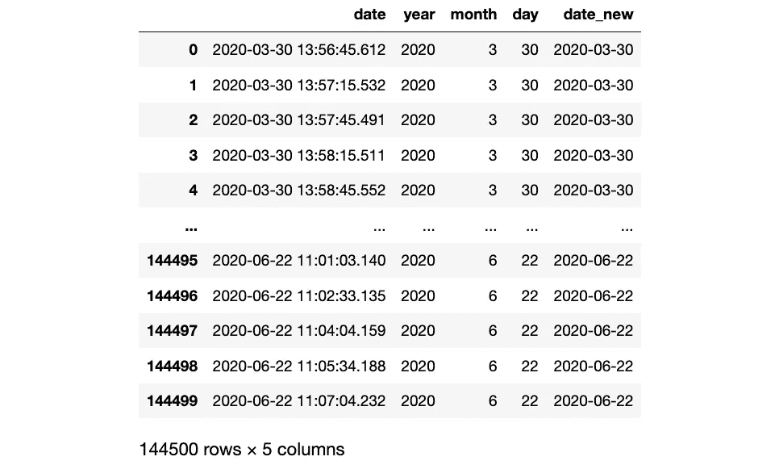

将多个列组合成一个日期时间(图片由作者提供)

# 如何填充缺失值

无论是处理数值、分类还是时间序列数据，填充缺失值都是一项挑战。本节将探讨三种方法来填充时间序列数据中的缺失值。

## 用常数值填充缺失值

一种方法是使用`.fillna()`方法用常量值填充缺失值。通常，这样的常数值可以是时间序列的平均值或异常值，如-1 或 999。然而，用常数值填充缺失值通常是不够的。

```
df["num_feature"] = df["num_feature"].fillna(0)
```

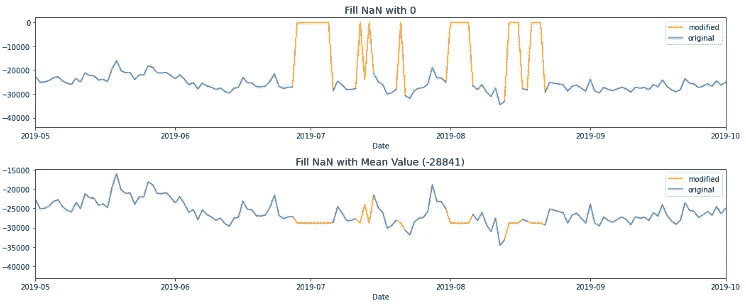

用常数值填充缺失值(图片由作者通过 [Kaggle](https://www.kaggle.com/code/iamleonie/intro-to-time-series-forecasting#Data-Preprocessing) 提供)

## 用最后一个值填充缺失值

另一种方法是使用`.ffill()`方法用最后一个可用的值来填充缺失的值。

```
df["num_feature"] = df["num_feature"].ffill()
```

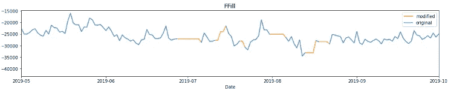

用最后一个值填充缺失值(图片由作者通过 [Kaggle](https://www.kaggle.com/code/iamleonie/intro-to-time-series-forecasting#Data-Preprocessing) 提供)

## 用线性插值填充缺失值

处理缺失值的一个好方法通常是用`.interpolate()`方法对缺失值进行线性插值。

```
df["num_feature"] = df["num_feature"].interpolate()
```

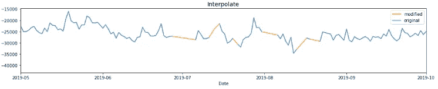

用线性插值填充缺失值(图片由作者通过 [Kaggle](https://www.kaggle.com/code/iamleonie/intro-to-time-series-forecasting#Data-Preprocessing) 提供)

# 如何对时间序列执行操作

您可以对时间序列数据执行各种操作，这将在本节中讨论。

## 获取最小值和最大值

在许多情况下，了解时间序列的开始或结束日期会很有帮助。

```
df["date"].min()
df["date"].max()
```

## 区别

差分是指取时间序列中两个连续值的差。为此，您可以使用`.diff()`方法。

```
df["num_feature_diff"] = df["num_feature"].diff()
```

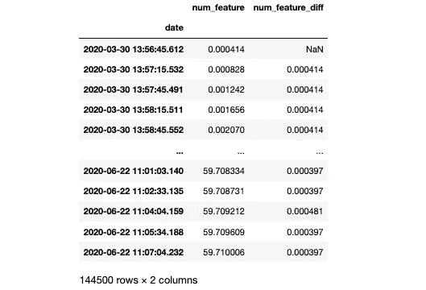

时间序列数据的差异(图片由作者提供)

## 累积

与差分相反的是用`.cumsum()`方法累加时间序列的值。

```
df["num_feature_cumsum"] = df["num_feature"].cumsum()
```

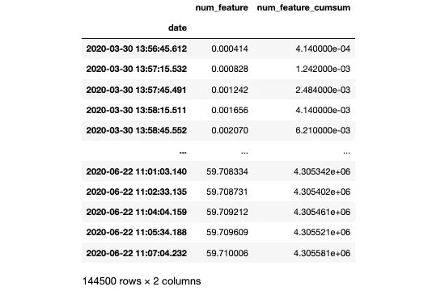

时间序列数据的累积(图片由作者提供)

## 获取滚动平均值

有时你需要时间序列的滚动平均值。您可以使用`.rolling()`方法，它接受一个在滚动窗口中要考虑的值的数量的参数。在下面的例子中，我们取三个值的平均值。所以前两行是空的，第三行是前三行的平均值。

```
df["num_feature_mean"] = df["num_feature"].rolling(3).mean()
```

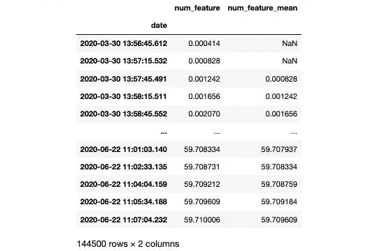

时间序列数据的滚动平均值(图片由作者提供)

## 计算两个时间戳之间的时间差

有时候你需要计算两个时间戳之间的时间差。例如，如果您可能需要计算特定日期的时差。

```
df["time_since_start"] = df["date"] - df["date"].min()
```

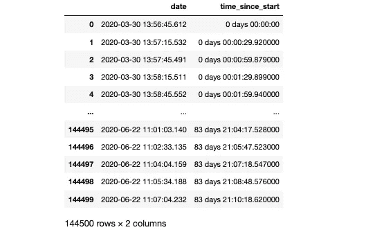

时间戳和第一个时间戳的时间差(图片由作者提供)

或者想知道时间戳是否是等距离分布的。

```
df["timestamp_difference"] = df["date"].diff()
```

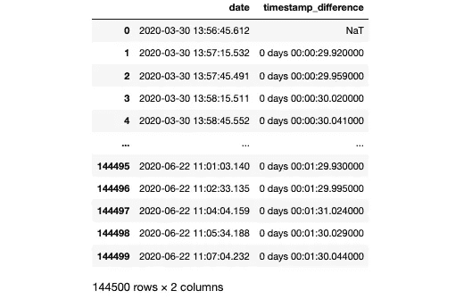

时间戳之间的时间差(图片由作者提供)

# 如何过滤时间序列

处理时间序列数据时，您可能需要在特定时间对其进行过滤。要过滤时序数据，**必须将日期列设置为索引**。一旦有了时间戳索引，就可以在特定的日期甚至特定的时间范围内填写。

```
df = df.set_index(["date"])
```

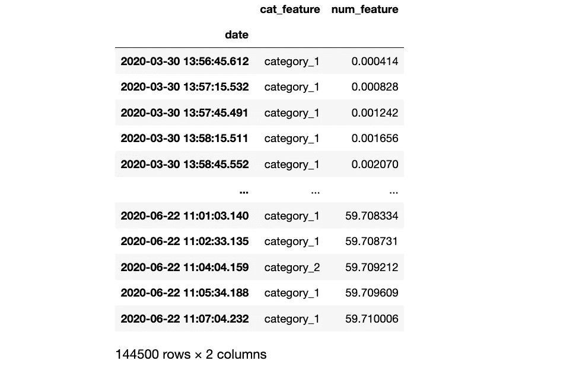

以时间戳为索引的时间序列数据的数据框架(图片由作者提供)

## 根据特定时间戳过滤时间序列

当您将时间戳设置为熊猫数据帧的索引时，您可以使用`loc`轻松过滤特定的时间戳。

```
df.loc["2020-03-30"]
```

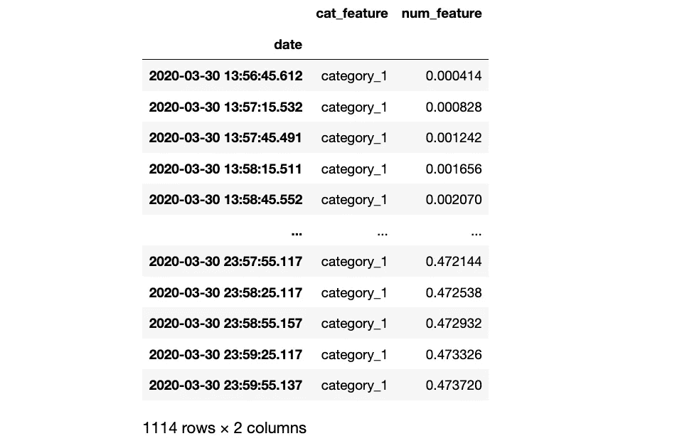

过滤的某一日期的 tme 系列(图片由作者提供)

## 按时间范围过滤时间序列

与上面过滤特定时间戳的例子类似，当时间戳被设置为 pandas 数据帧的索引时，您也可以使用`loc`过滤时间范围。

```
df.loc["2020-04-10":"2020-04-15"]
```

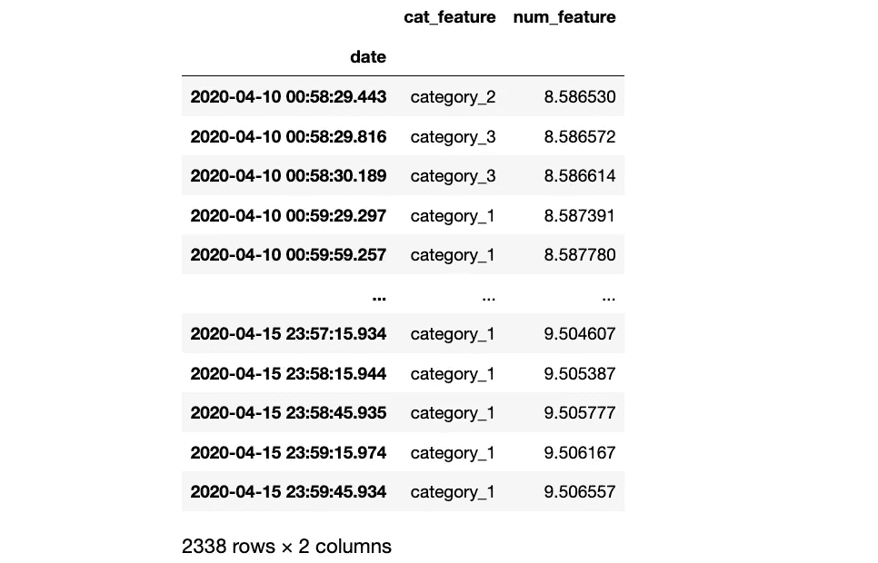

在某一日期范围内过滤的 tme 系列(图片由作者提供)

# 如何对时间序列进行重采样

重采样可以提供数据的附加信息。有两种类型的重采样:

## 向下采样

下采样是指降低采样频率(例如，从几秒到几个月)。可以用`.resample()`的方法。

```
upsampled = df.resample("M")["num_feature"].mean()
```

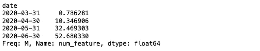

每月重新采样(缩减采样)值系列(图片由作者提供)

## 上采样

上采样是指增加采样频率(例如，从几个月到几天)。同样，你可以使用`.resample()`方法。

```
upsampled.resample("D").interpolate(method = "linear")
```

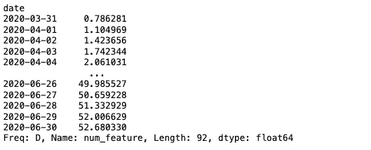

一系列每日重采样(上采样)值(图片由作者提供)

# 如何绘制时间序列

本节将讨论如何使用 Matplotlib 和 Seaborn 可视化数字和分类时间序列数据。除了`pyplot`模块，我们将使用`dates`模块探索不同的可视化技术。

```
import matplotlib.pyplot as plt
import matplotlib.dates as mdates
import seaborn as sns
```

为了直观显示时间序列的时间顺序，图中的 x 轴通常表示时间，y 轴表示值。

## 绘制一段时间内的数字数据

大多数时间序列数据是数字的，例如温度或股票价格数据。要可视化数字时间序列数据，可以使用折线图。

```
sns.lineplot(data = df, 
             x = "date", 
             y = "num_feature")
```

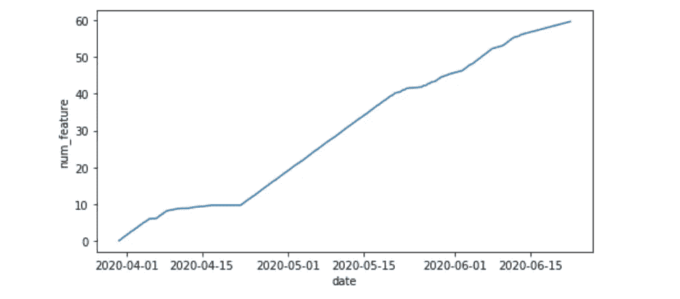

数字时间序列数据的折线图(图片由作者提供)

## 绘制一段时间内的分类数据

有时时间序列数据可以是分类的，例如，跟踪不同事件的发生。

在绘制数据之前，您可以对分类列进行标签编码，例如，通过使用 [LabelEncoder](https://scikit-learn.org/stable/modules/generated/sklearn.preprocessing.LabelEncoder.html) 或简单的字典，如下所示。

```
# Label encode the categorical column
enum_dict = {}
for i, cat in enumerate(df.cat_feature.unique()):
    enum_dict[cat] = idf["cat_feature_enum] = df["cat_feature"].replace(enum_dict)
```

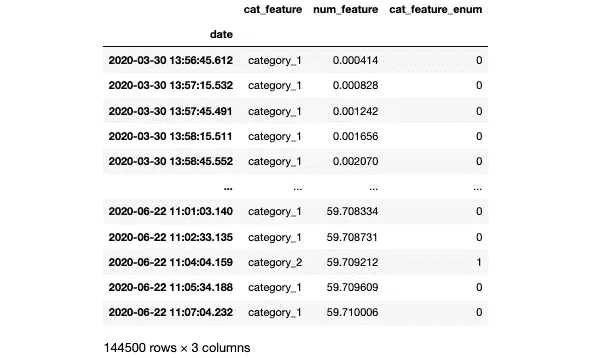

将编码特征“cat_feature”标注为“cat_feature_enum”(图片由作者提供)

要可视化分类时间序列数据，可以使用散点图。

```
fig, ax = plt.subplots(figsize=(8, 4))sns.scatterplot(data = df,
                x = "date", 
                y = "cat_feature_enum", 
                hue = "cat_feature",
                marker = '.',
                linewidth = 0,
                )ax.set_yticks(np.arange(0, (len(df.cat_feature.unique()) + 1), 1))
ax.set_yticklabels(df.cat_feature.unique())
ax.get_legend().remove() # remove legend - it's not necessary hereplt.show()
```

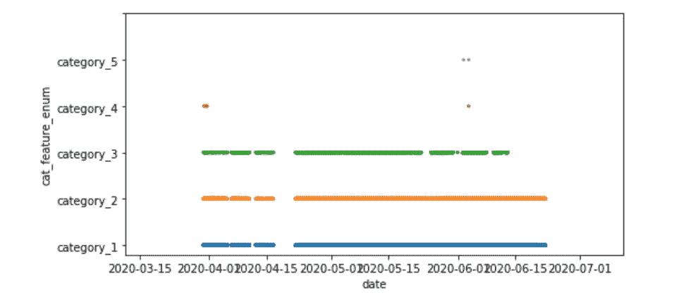

带有散点图的分类时间序列数据的事件图(图片由作者提供)

也可以试试 [Matplotlib 的 eventplot 演示](https://matplotlib.org/stable/gallery/lines_bars_and_markers/eventplot_demo.html)。

## 绘制时间表

为了绘制时间线，我们将使用上一节的标签编码分类值和`vlines`。

```
fig, ax = plt.subplots(figsize=(8, 4))ax.vlines(df["date"], 0, df["cat_feature_enum"])plt.show()
```

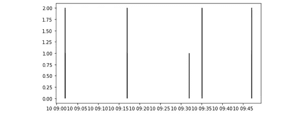

带有 vlines 的分类时间序列数据的时间线图(图片由作者提供)

## 设置时间序列的 X 轴限制

当您想要设置时间序列图的 x 轴界限时，范围必须是`datetime64[ns]`数据类型。

例如，您可以使用时间序列的最小和最大时间戳:

```
ax.set_xlim([df.date.min(), df.date.max()])
```

或者您可以指定一个自定义范围，如下所示:

```
ax.set_xlim(np.array(["2020-04-01", "2020-04-30"],
                      dtype="datetime64"))
```

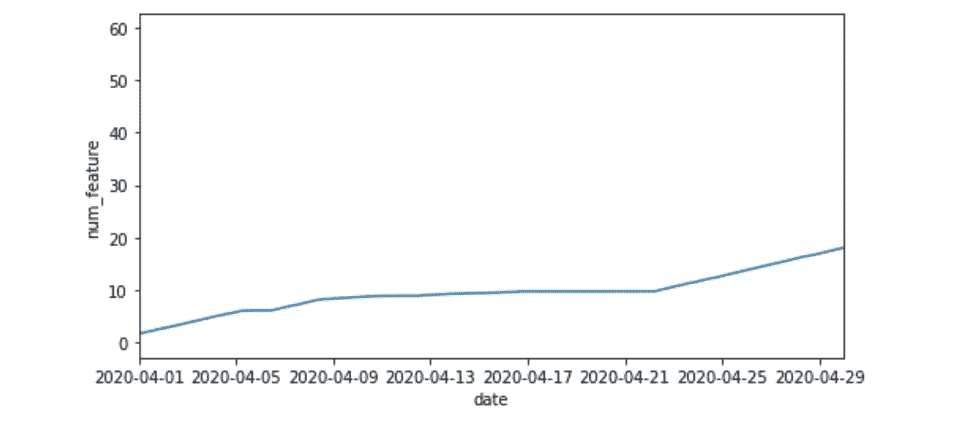

调整后的 x 轴范围(图片由作者提供)

## 设置时间序列的 X 刻度

为了提高数据可视化的可读性，您可以在特定的时间间隔(例如，每周、每月、每年等)添加主要和次要 x 刻度。)

```
ax.xaxis.set_major_locator(mdates.MonthLocator())
ax.xaxis.set_major_formatter(mdates.DateFormatter("%b %d"));
ax.xaxis.set_minor_locator(mdates.DayLocator())
```

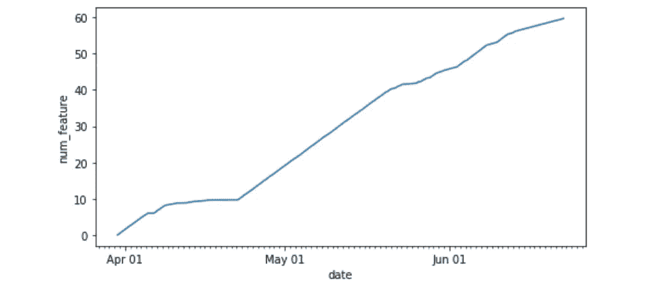

自定义 x 轴刻度(图片由作者提供)

# 结论

当您不熟悉[日期时间](https://docs.python.org/3/library/datetime.html#datetime.datetime)数据类型时，开始处理时间序列数据可能会很有挑战性。如您所见，[日期时间](https://docs.python.org/3/library/datetime.html#datetime.datetime)数据类型有许多实用的内置方法，可以轻松操作时间序列数据。本文讨论了从操作时间序列值的时间戳和有价值的操作到可视化时间序列数据的所有内容。

# 喜欢这个故事吗？

*以下是我其他时间序列分析和预测文章的合集:*


莉奥妮·莫尼加蒂

## 时间序列分析和预测

[View list](https://medium.com/@iamleonie/list/time-series-analysis-and-forecasting-ff223343e5b3?source=post_page-----7c01d199b184--------------------------------)6 stories

*如果你想把我的新故事直接发到你的收件箱，请务必订阅*<https://medium.com/subscribe/@iamleonie>**！**

**成为媒介会员，阅读更多来自我和其他作家的故事。报名时可以使用我的* [*推荐链接*](https://medium.com/@iamleonie/membership) *支持我。我将收取佣金，不需要你额外付费。**

*<https://medium.com/@iamleonie/membership>  

*在* [*Twitter 上找我*](https://twitter.com/helloiamleonie)*[*LinkedIn*](https://www.linkedin.com/in/804250ab/)*和*[*Kaggle*](https://www.kaggle.com/iamleonie)*！***