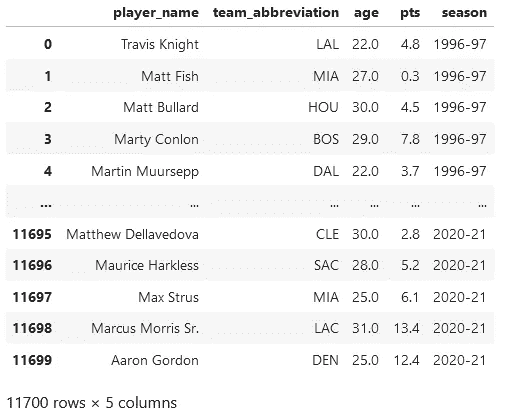
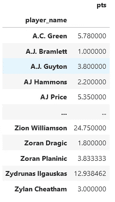
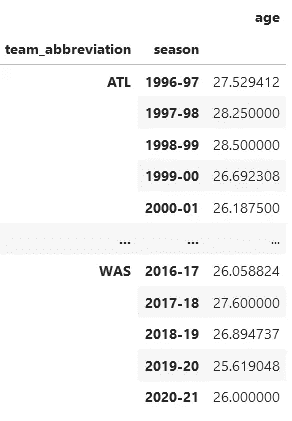
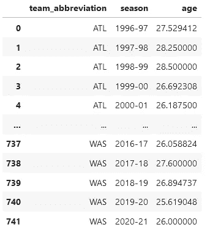
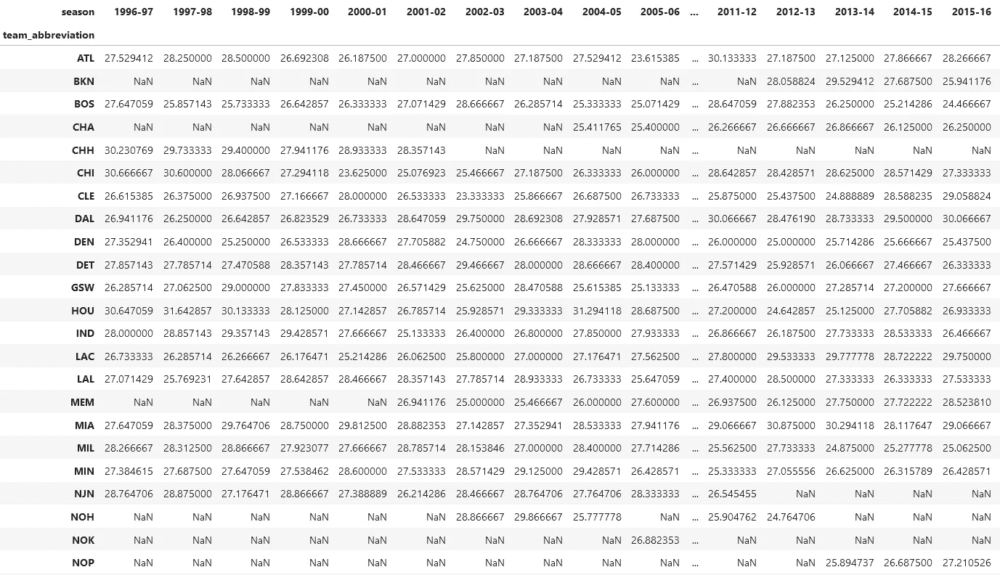

# Python 熊猫模块中 GroupBy 和 Pivot 的比较

> 原文：<https://towardsdatascience.com/a-comparison-of-groupby-and-pivot-in-pythons-pandas-module-527909e78d6b>

## 有时，有多种方法来显示来自数据的相同见解。


照片由[卢克·切瑟](https://unsplash.com/@lukechesser?utm_source=medium&utm_medium=referral)在 [Unsplash](https://unsplash.com?utm_source=medium&utm_medium=referral) 上拍摄

数据科学家的主要工作之一是向观众展示来自数据的关键见解。在这样做的时候，数据科学家必须考虑两件重要的事情:1) *应该传达什么样的关于数据的主要思想，以及 2) *应该如何*分析并最终展示它们。*

有许多工具用于清理、处理、分析和显示数据。在本文中，我将重点介绍 Pandas，这是 Python 中一个流行的模块，包含各种不同的数据分析工具。

通过 Pandas 显示数据的一个关键方法是计算复杂数据点集合的汇总统计数据。下面，我将比较在相同数据上完成这项任务的两种不同方法:1)使用分组和聚合，2)使用数据透视表。

## 数据和目标

对于这个任务，我们将使用下面的数据集[1]，称为`nba_full`。它包含了从 1996-97 赛季开始的许多不同赛季中各种 NBA 球员的信息。



图片作者。

原始数据集还有几列，但是我已经提取出了对我们最重要的几列:`player_name`、`team_abbreviation`、`age`、`pts`和`season`。

我们的目标是重新格式化这些数据，以有意义地显示下面的汇总统计:**NBA 球队每个赛季的平均球员年龄**。例如，假设有人问“2019-20 赛季洛杉矶湖人队的平均球员年龄是多少？”我们应该能够很容易地从重新格式化的数据中读出这个问题的答案。

让我们来看两种可能的方法。

## 使用 GroupBy 聚合

作为快速复习，Pandas 中的分组和聚合通常是通过使用`groupby`函数按特定列对值进行分组，然后使用相应的`agg`函数从不同的列中聚合值。

让我们先看一个更简单的例子，然后再从上面讨论我们的目标，因为这有点高级。假设我们运行下面一行代码:

```
nba_full.groupby('player_name')[['pts']].agg('mean')
```



作者图片

这个代码显示了数据中每个球员在所有赛季中的平均得分。这里有几个要点来一步一步地解释代码的作用:

*   按列`'player_name'`分组指定该列为我们的索引。然后，所有值将被聚合到由该列中的唯一值指定的组中。
*   我们选择列`'pts'`作为我们想要计算聚合值的列，因为默认情况下[Pandas 将聚合所有其他列](/pandass-groupby-function-is-a-powerful-tool-but-can-mislead-your-audience-if-you-re-not-careful-c4491055a98e)。我们选择带双括号的列，以便 Pandas 返回 DataFrame 而不是 Series。
*   我们调用`.agg('mean')`来指定对于每个独特的球员，我们想要计算他们在表格中出现的所有不同时间的平均分数(对应于他们在 NBA 打球的所有不同赛季)。我们可以使用许多其他内置函数(如`max`或`count`)，如果我们愿意，我们也可以使用用户定义的函数。

现在，我们准备着手我们的主要任务。回想一下我们的目标:我们想要 NBA 球队每个赛季的平均球员年龄。如果你仔细阅读，你会发现我们实际上想要计算数据中两个列的汇总统计数据:球队和赛季。为了完成这个任务，我们将需要在对`groupby`的调用中指定我们是按照这两个列进行分组的。

让我们看一下代码和输出，然后我们将一步一步地分解它:

```
nba_full.groupby(['team_abbreviation', 'season'])[['age']].agg('mean')
```



图片作者。

代码的一些要点:

*   我们按两列分组，这给了我们一个多索引的数据框架。
*   代码的剩余部分类似于我们的第一个例子:我们提取出感兴趣的列`'age'`进行聚合，然后我们指定聚合函数`'mean'`。
*   解释代码的方式如下:对于每个独特的球队和赛季组合，计算列`'player_age'`的平均值。例如，包含**`ATL`和`1996-97`的每一行都被识别，并且这些行中的所有年龄被平均以产生我们上面看到的最后的第一行。对其他组合重复该过程，以产生剩余的行。**

**作为最后的美学注释，我建议在结尾处重新设置索引，以使输出更具可读性:**

```
nba_full.groupby(['team_abbreviation', 'season'])[['age']].agg('mean').reset_index()
```

****

**图片作者。**

**现在你知道了！这就是我们如何使用分组和聚合来实现我们的初始目标。接下来，我们将考虑如何使用数据透视表来完成同样的任务。**

## **使用数据透视表**

**在 Pandas 中，数据透视表在技术上仍然是一个数据框架，但它通常指的是以某种方式格式化的表。具体来说，数据透视表重新排列数据，使一列的值成为行标签，第二列的值成为列标签，第三列的值为每个组合进行聚合。**

**这是一个有点复杂的句子，所以让我们把它应用到我们的目标。在我们的例子中，我们可以像下面这样做:**

*   **让独特的 NBA 球队成为行标**
*   **使独特的季节成为列标签**
*   **使用`'mean'`函数合计每个组合的年龄。**

**听起来熟悉吗？这正是我们用上面的`groupby`完成的，但是格式略有不同。让我们来看看完成这项任务的代码:**

```
nba_full.pivot_table(index='team_abbreviation', columns='season', values='age', aggfunc='mean')
```

****

**图片作者。**

**任务完成！现在，我们可以查看表中每个条目对应的行和列，以确定它对应的球队和赛季组合。以下是关于代码如何工作的一些要点:**

*   **`'index'`指定我们想要哪个列的唯一标签作为输出数据帧的索引(或行标签)。**
*   **`'columns'`指定我们想要哪个列的唯一值作为输出数据帧的列标签。**
*   **`'values'`指定包含我们要聚合的值的列。**
*   **`'aggfunc'`指定我们想要使用的聚合函数。**

**这样，我们看到我们遇到了另一种表示相同数据的方法。**

## **为什么重要？**

**那么，使用一种技术比使用另一种技术有什么不同吗？从严格的定量角度来看，人们可能会认为这并不重要——最终，两个输出表显示的是相同的数据。**

**然而，[好的数据科学不仅仅是数字。](https://medium.com/mlearning-ai/human-centered-data-science-what-is-it-and-why-is-it-the-way-forward-e44e749fe4c9)展示数据时，重要的是要考虑什么样的展示能最大限度地让观众理解。**

**没有一种“更好”的技术——这取决于具体情况。例如，许多人可能通常更喜欢`pivot_table`显示，因为他们发现匹配行和列来查找聚合值更自然。然而，当您的数据有许多唯一的标签时，数据透视表会变得混乱。即使在上面的例子中，我也只能显示输出数据帧的一部分(右边还有更多列)，因为它太大了，无法完全粘贴。相比之下，`groupby`显示在每个单独的行中具有较少的信息，并且导致较少的信息负载。对于较小的数据集，透视显示可能更有用，因为它(可以说)更符合聚合数据的逻辑显示。**

**最重要的是探索多种演示，并确保最终的决策优先考虑最终将使用、解释或查看这些数据的人的利益。如果你能做到这一点，那么你正在成为一名优秀的数据科学家的路上。**

**下次见，伙计们！**

****想擅长 Python？** [**获取独家，免费获取我简单易懂的指南**](https://witty-speaker-6901.ck.page/0977670a91) **。想在介质上无限阅读故事？用我下面的推荐链接注册！****

**[](https://murtaza5152-ali.medium.com/?source=entity_driven_subscription-607fa603b7ce---------------------------------------)  

## 参考

[1][https://www.kaggle.com/justinas/nba-players-data](https://www.kaggle.com/justinas/nba-players-data)**