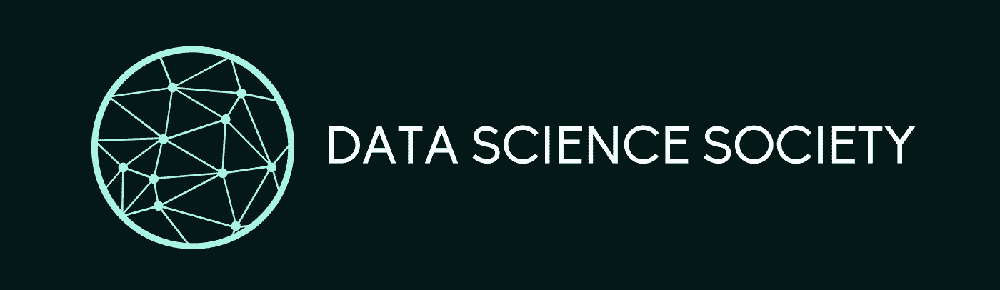

# 面向初学者的完整数据科学课程

> 原文：<https://towardsdatascience.com/a-complete-data-science-curriculum-for-beginners-825a39915b54>

## UCL 数据科学协会:Python 介绍，数据科学家工具包，使用 Python 的数据科学

作者图片

今年，UCL 数据科学协会旨在创建一个完整的数据科学课程，旨在帮助其他学生踏上数据科学之旅。为此，我们在前几年工作的基础上创建了一系列研讨会，涵盖数据科学家旅程的三个主要领域。

*   **Python 简介**:一系列四个研讨会，涵盖 Python 中使用的基本符号和结构，以便能够理解后面研讨会中使用的编码。
*   **数据科学家工具包**:一系列五个研讨会，涵盖 Numpy、Matplotlib 和 Pandas 的任何数据科学家工具包中的三个关键库，以及 Git、GitHub 和 SQL 的关键工具。
*   **使用 Python 的数据科学**:一系列九个研讨会，涵盖了机器学习模型的四个主要类别:回归、分类、聚类和通过应用于不同数据集和示例的几种最常用算法进行降维。

这样做的目的是涵盖任何数据科学家在他们的旅程中需要的所有基础知识，而不会太快进入太多细节。下面，您将看到每个研讨会上介绍的所有工具和方法的描述，包括它们的用途、优点和缺点，这些都是您在数据科学之旅中需要了解的。这包括全年创建的涵盖每个主题概述的所有媒体文章的链接，每个文章都有到完整研讨会和问题单的进一步链接。

我们希望这能够在您未来的数据科学之旅中为您提供帮助！

## Python 简介

对于任何数据科学初学者来说，您需要能够回答的第一个问题是您将选择哪种语言？虽然有一些选项，包括 Python 和 R，但我们从 Python 开始，因为它的适用性和可用性超越了数据科学，并且有广泛的库可用于支持任何数据科学工作流。在此过程中，我们通过向您介绍 Python 基础、序列、逻辑和面向对象编程等概念，涵盖了任何人都需要能够在 Python 中继续从事数据科学及其他职业的主要基础知识。这为在后面的研讨会中理解代码的作用以及如何找到解决您可能遇到的编码挑战的方法打下了基础。

**Python 基础知识**

任何学习 Python 的人的第一个任务是设置您的环境，然后学习 Python 代码代表什么。在本次研讨会中，我们将介绍如何通过 Anaconda 设置您的编程环境，讨论什么是 Jupyter 笔记本，并涵盖 Python 中变量、数据类型和基本操作的基础知识。这将帮助您理解如何阅读 Python 代码，以及如何开始与您自己的代码进行交互。

</ucl-data-science-society-python-fundamentals-3fb30ec020fa>  

**Python 序列**

Python 有各种内置序列，可用于存储多个数据点，而不是在您的环境中创建许多变量。尽早了解这些序列中的每一个能做什么或不能做什么变得很重要，这样您就知道将来如何存储您的数据。至此，我们涵盖了 Python 中列表、元组、集合和字典的主要功能，它们是您在数据科学之旅中将会遇到的主要序列/数据结构。

</ucl-data-science-society-python-sequences-e3ffa67604a0>  

**Python 逻辑**

当涉及到构建更高级的程序时，理解 Python 中的逻辑是如何工作的就成为了关键。这包括创建在满足给定条件时运行的代码，或者在不满足给定条件时运行替代代码，在 Python 中执行重复操作，以及定义可在代码中重复使用的代码片段。为此，我们在本次研讨会中介绍了条件语句、逻辑语句(if、else 和 elif)、循环(for 和 while)和函数，您可以看到它们如何单独工作，也可以一起工作来编写更复杂的代码。

</ucl-data-science-society-python-logic-3eb847362a97>  

**Python 面向对象编程**

虽然在 Jupyter 笔记本中工作时，大多数数据科学工作流倾向于使用过程化编程，但了解面向对象编程的优势和用例是非常有用的。这是一种编程范例，它构建代码，以便将数据的特征和行为捆绑到一个结构中，并且通常形成您在编程过程中会遇到的大多数库的基础。这意味着，理解这种形式的代码是如何构造的，对于能够与您在数据科学之旅中将接触到的许多库进行交互非常重要。

</ucl-data-science-society-object-oriented-programming-d69cb7a7b0be>  

## 数据科学家的工具包

一旦你掌握了 Python 的基础知识，你就可以创建基本的程序了，那么学习一些你每天都会用到的工具就变得很重要了。这些工具是其他人已经创建的库和软件，因此您不必重新发明轮子，这将使您的代码更容易阅读和理解。作为数据科学家，您将经常遇到的三个主要库包括 Numpy、Pandas 和 Matplotlib，在您的数据科学之旅中，您也将经常使用 GitHub 和 SQL 工具。

**Numpy**

Numpy 非常注重数学功能，是一个基础库，支持其他 Python 包中的许多方法和函数。这意味着它是一个基础包，理解起来非常有用。在这方面，我们涵盖了 Numpy 数组的基础知识、软件包中的数学运算以及如何与随机数功能交互。

</ucl-data-science-society-introduction-to-numpy-7d962d63f47d>  

**熊猫**

你经常会遇到的第二个基本包装是熊猫。这是一个广泛用于数据科学和分析任务的包，构建在 Numpy 包之上。它是数据科学工作流中最受欢迎的数据争论包之一，并与数据科学工作流中使用的许多其他库(如 SciKit Learn)集成良好。在本次研讨会中，我们将介绍如何创建熊猫系列和熊猫数据框架，如何从该数据结构中访问信息，以及当数据在该结构中时我们可以执行哪些操作。

</ucl-data-science-society-pandas-8ad28c2b22e5>  

**Matplotlib**

对于任何数据科学家来说，能够将数据可视化是一项关键技能，能够将您的结果和发现传达给技术和非技术受众。虽然在 Python 中有许多不同的包可以使用，但您遇到的最主要的包之一是 Matplotlib，这是一个很好的开始。在本次研讨会中，我们将介绍如何构建一个基本图，在同一图表上绘制多组信息，然后跨多个轴绘制信息。

</an-introduction-to-plotting-with-matplotlib-in-python-6d983b9ba081>  

**Git 和 Github**

除了 Python 中构成数据科学家工具包一部分的库之外，还有许多其他软件和工具在数据科学工作流中非常有用。任何数据科学家都应该熟悉的主要工具之一应该是作为版本控制手段的 Git 和 GitHub。这确保您以受控的方式对结果进行版本控制，而不是将其命名为 draft1、draft2、draft3 等。然后它可以连接到 GitHub，这样你就可以把这些版本存储在除了你的桌面之外的地方，并且允许你和你的团队从世界上任何地方访问这些版本，只要他们有互联网连接。在本次研讨会中，我们将介绍创建本地 Git 存储库、提交对该存储库的更改，然后将其链接到 GitHub 的基础知识。

</git-and-github-basics-for-data-scientists-b9fd96f8a02a>  

**SQL**

我们的数据科学家工具包中的最后一个工具是 SQL。SQL 代表结构化查询语言，是在关系数据库管理系统中处理数据库时使用最广泛的编程语言之一。它用于执行各种不同的操作，例如选择数据、查询数据、分组数据以及从 Python 环境之外的数据中提取汇总度量。这样做的好处是可以处理大量的数据，尤其是当这些数据保存在一个集中管理的系统上时。在本次研讨会中，我们将介绍如何在您自己的机器上设置一个 SQL 实例，然后使用它来操作数据集，包括选择数据、搜索条件、汇总统计数据和分组数据。

</an-introduction-to-sql-for-data-scientists-e3bb539decdf>  

## 使用 Python 的数据科学

一旦您知道并理解如何在数据科学工作流中使用 Python 及其密钥库以及其他关键软件，您就可以继续学习和理解可以使用的每种机器学习算法。为此，机器学习任务之间有两个主要区别，这些任务可以分成四个整体的机器学习组。

第一次分裂是在有监督和无监督的机器学习任务之间。其中第一个意味着我们有一个明确的目标，我们希望朝着这个目标努力，例如检测糖尿病或癌症，模拟房价或模拟 NBA 球员的位置。这通常使用回归或分类机器学习方法来完成，目的是尽可能接近定义的目标。

第二个意思是我们没有一个明确的目标，但我们仍然想要一个结果，比如根据购物习惯对消费者进行分组，或者在一组结果中识别行为。这些任务通常是通过聚类或降维方法来完成的，这些方法旨在识别相似数据点的组或减少维度的数量，以可视化数据或输入到另一个机器学习算法中。

## 回归

第一组是机器学习中的回归。这是一种对两个或更多数量(如房价和房屋特征或建筑特征的能效)之间的依赖性或关系进行建模的方法。这种方法的目的是找到这些关系的强度和方向，以便根据现有数据对未知结果进行建模，或者理解两个变量之间的关系。

**线性回归**

在这种情况下，您遇到的第一种方法是线性回归法，它以线性方式模拟变量之间的关系。这种方法的目的是使用最小二乘法缩小实际值和预测值之间的距离，并允许您提取显示它们与目标变量之间关系的强度和方向的参数。在本次研讨会中，我们将介绍如何通过 scikit learn 实现基本回归，以及由谁来实现和解释多元线性回归方程。

</linear-regression-in-python-for-data-scientists-16caef003012>  

**逻辑回归**

回归的第二个常用方法是逻辑回归。线性回归通常应用于连续变量预测(在给定范围内可以取无限个值的预测)，而逻辑回归可以应用于预测分类输出(在给定范围内包含有限个数的点或类别的预测)。这种方法的主要目的是预测一个数据点属于哪个类别或观察值，而不是一个确切的值，例如在患者是否患有糖尿病的情况下？因此，这属于回归范畴，但也是一种使用回归的分类方法。在研讨会中，我们将介绍如何实施和评估一个基本的逻辑回归来模拟糖尿病的发病率。

</introduction-to-logistic-regression-predicting-diabetes-bc3a88f1e60e>  

**高级回归**

除了线性回归和逻辑回归之外，还有各种其他回归方法，理解这些方法通常很有用。这可以包括 Lasso 和 Ridge Regression，它们建立在基本线性回归方法的基础上，通过引入正则化来尝试和避免过度拟合的问题，或者决策树和随机森林的机器学习方法，它们能够对变量之间的非线性关系进行建模。这些方法既有优点也有缺点，因为这些方法通常能够更好地模拟变量之间的关系，但这可能以增加所需的计算资源或降低可解释性为代价。

</an-introduction-lasso-and-ridge-regression-using-scitkit-learn-d3427700679c>  </non-linear-regression-with-decision-trees-and-random-forest-afae406df27d>  

## 分类

回归之后，另一个常见的监督机器学习任务是分类。这样做的目的不是对特定值建模，而是基于我们已知的目标数据集对数据点属于哪个组或类进行建模。这可以包括建模患者是否患有糖尿病，患者是否患有癌症，用户是否会重新订阅，或者基于他们的统计数据对 NBA 球员的位置进行建模。有许多方法属于这一范畴，其中许多方法也可用于分类，但三种常见的方法包括:决策树分类、随机森林分类和支持向量机分类。

**决策树分类**

决策树遵循一种类似树的结构(因此得名),这种结构类似于你可能在小学或高中时制作的一些决策树。该方法能够通过使用决策来执行分类，以达到关于数据点属于哪个结果的预测。具体来说，它的工作原理是根据不同的属性分割数据集，同时尝试减少给定的选择标准。在本次研讨会中，我们将介绍如何实现一个基本的决策树，如何可视化这是如何执行的，以及如何评估模型的性能。

</how-to-implement-and-evaluate-decision-tree-classifiers-from-scikit-learn-36ef7f037a78>  

**随机森林分类**

随机森林分类器是一种利用决策树分类器算法的集成方法，但不是创建单个决策树，而是创建多个决策树。这样做时，它利用了数据和要素的随机采样来确保模型不会过度拟合，从而产生更好的预测。这遵循了群体的表现优于个人表现的逻辑。如果你能够实现一个决策树，通常最好是实现这个方法，尽管这样会增加计算资源。本课程包括随机森林的基本实现以及如何评估结果。

<https://python.plainenglish.io/a-practical-introduction-to-random-forest-classifiers-from-scikit-learn-536e305d8d87>  

**支持向量机分类**

除了决策树和随机森林，虽然有许多其他分类方法可以使用，但支持向量机是经常遇到的一种方法。它通过试图在数据中找到一个界限来区分我们试图定义的两个或更多不同的类别，从而实现分类。在这样做时，该模型可用于预测，通过找到点可能位于边界的哪一侧，从而找到该点可能属于哪个组。该算法的有用之处在于，边界可以采取多种不同的形式，无论是线性的、非线性的还是由用户定义的。在本次研讨会中，我们将介绍模型的基本实现以及如何可视化结果。

</a-practical-introduction-to-support-vector-machines-from-scikit-learn-6e678cf1f228>  

## 使聚集

聚类是机器学习的无监督分支的一部分，这意味着我们没有像回归或分类任务那样的明确目标。这些算法的目标是能够识别具有相似特征的不同对象组，例如购物者、电影或商店。这使得决策者能够关注这些群体，看看他们如何能够更好地为他们服务，例如留住客户或激励他们花更多的钱。为此，两种常见的聚类算法包括 k-means 聚类和层次聚类。

**K-均值聚类**

K-means 聚类是最常用的聚类算法之一。它首先定义要创建的组的目标数量，然后算法根据点和组之间的不同距离度量来定义目标数量。在本次研讨会中，我们将介绍如何实现 Kmeans 聚类算法，如何选择最佳的聚类数，以及如何评估结果。

</a-practical-introduction-to-kmeans-clustering-using-scikit-learn-fd9cff95144b>  

**层次聚类**

分层聚类的工作原理是根据用于分隔不同组的距离度量在层次结构中创建这些组。这种算法的独特之处在于，您可以根据选择的距离来确定不同组如何相互适应或相互分离的层次结构。这意味着我们在执行算法之前不需要知道聚类的数量，尽管这可能会增加时间复杂度。在本次研讨会中，我们将讨论如何实施和评估该算法。

</a-practical-introduction-to-hierarchical-clustering-from-scikit-learn-ffaf8ee2670c>  

## **降维**

最后，我们有降维，这也是(在大多数情况下)无监督机器学习算法的标题下。这种方法的主要目的是减少数据集中的要素数量，从而减少模型所需的资源，或者在执行任何分析之前帮助可视化数据。这是通过减少数据集中属性或变量的数量，同时尽可能多地保留原始数据集中的变化来实现的。这是一个预处理步骤，意味着它通常在我们创建或训练任何模型之前执行。在流形学习的线性代数中有两种主要的形式，在工作坊中我们从前者引入主成分分析，从后者引入 t 分布随机邻居嵌入。

</dimensionality-reduction-with-pca-and-t-sne-in-python-c80c680221d>  

## 结论

本课程旨在为个人提供一个数据科学的起点，介绍每一种库、软件和技术，其中涵盖了实现的所有基础知识以及它们是如何工作的，而不涉及太多的细节。这将为任何新的数据科学家提供一个平台，让他们可以探索他们更感兴趣的主题，无论是更多的回归、分类、聚类和维度方法，还是对我们已经介绍的每个模型进行更深入的研究。我们祝您在数据科学之旅中好运！

如果您想从我们的社交网站获得更多信息，请随时关注我们的社交网站:

https://www.facebook.com/ucldata

insta gram:【https://www.instagram.com/ucl.datasci/ 

领英:【https://www.linkedin.com/company/ucldata/ 

如果你想了解 UCL 数据科学协会和其他优秀作者的最新信息，请使用我下面的推荐代码注册 medium。

<https://philip-wilkinson.medium.com/membership> 