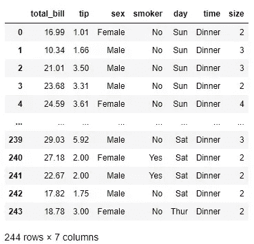
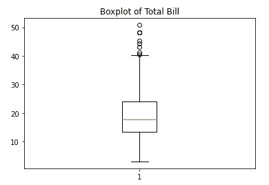
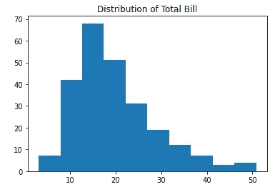
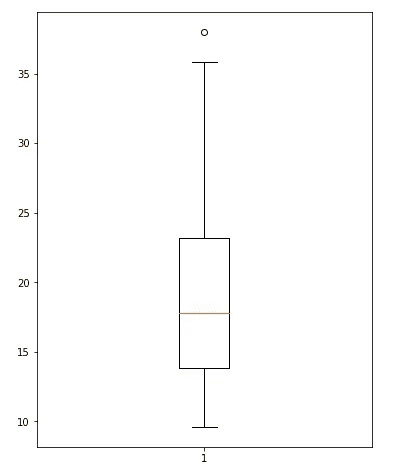
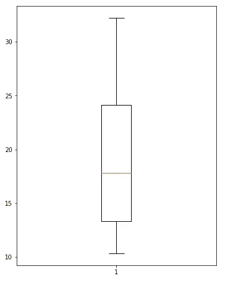

# 检测和处理异常值的完整指南

> 原文：<https://towardsdatascience.com/a-complete-guide-for-detecting-and-dealing-with-outliers-bad26b1e92b6>


威尔·梅尔斯在 [Unsplash](https://unsplash.com?utm_source=medium&utm_medium=referral) 上拍照

## 6 种检测异常值的方法和 4 种处理异常值的方法

离群值可能是数据分析或机器学习中的一个大问题。只有少数异常值可以完全改变机器学习算法的性能或完全破坏可视化。因此，检测异常值并小心处理它们是很重要的。

## 检测异常值

检测异常值一点也不困难。您可以使用以下方法检测异常值:

1.  箱线图
2.  柱状图
3.  平均值和标准偏差
4.  IQR(四分位数间距)
5.  z 分数
6.  百分位

在我深入异常值的检测之前，我想介绍一下我将在今天的教程中使用的数据。我们将使用可以从 seaborn 库加载的“tips”数据集:

```
import pandas as pd
import numpy as np
import matplotlib.pyplot as plt
import seaborn as snsdf = sns.load_dataset("tips")
df
```



作者图片

我们将主要关注总账单列。

## 异常值的检测

有很多不同的方法来检测异常值。有些是非常简单的可视化，它只告诉你数据中是否有异常值。有些是非常具体的计算，告诉你离群值的确切数据。

> **箱线图**

默认情况下，箱线图显示异常值。这是 total_bill 部分的箱线图:

```
plt.boxplot(df['total_bill'])
plt.title("Boxplot of Total Bill")
```



作者图片

上端的一些点离得有点远。你可以认为他们是离群值。它没有给出异常值的确切点，但它表明在这一列数据中有异常值。

> **直方图**

查看分布还可以告诉您数据中是否有异常值:

```
plt.hist(df['total_bill'])
plt.title("Distribution of Total Bill")
plt.show()
```



作者图片

该分布还显示数据是偏斜的，在右侧有异常值。

> 从这一点，我们将执行一些特定的计算，找出确切的点是离群值。

> **均值和标准差法**

在这种方法中，我们将使用平均值、标准差和指定因子来找出异常值。

首先，我将把“总账单”列保存为数据:

```
data = df.total_bill
```

这里我们将使用系数 3。高于平均值的三个标准差和低于平均值的三个标准差将被视为异常值。首先，获取数据的平均值和标准差:

```
mean = np.mean(data)
std = np.std(data)
```

现在，找出高于平均值三个标准差的数据:

```
outlier_upper = [i for i in data if i > mean+3*std]
outlier_upper
```

输出:

```
[48.27, 48.17, 50.81, 48.33]
```

这里我们找出低于平均值三个标准差的数据:

```
outlier_lower = [i for i in data if i < mean-3*std]
outlier_lower
```

输出:

```
[]
```

如你所见，我们在上端有一些异常值，但在下端，在这个方法中没有异常值。

> 这里我用了 3 std。但是如果你愿意，你可以使用任何其他数字的因子。通常使用系数 2、3 或 4。请随意使用 2 或 4 并检查异常值。

> **四分位间距**

在这种方法中，我们需要计算第一个四分位数和第三个四分位数，以获得四分位数间距(IQR)。然后我们将第一个分位数减去 1.5 倍 IQR 作为下限，第三个四分位数加上 1.5 倍 IQR 作为数据的上限。

```
data1 = sorted(data)
q1 = np.percentile(data1, 25)
q3 = np.percentile(data1, 75)
IQR = q3-q1
lower = q1-(1.5*IQR)
upper = q3 + (1.5*IQR)
```

如果一个值低于下限而高于上限，它将被视为异常值。

```
outliers = [i for i in data1 if i > upper or i < lower]
```

输出:

```
[40.55, 41.19, 43.11, 44.3, 45.35, 48.17, 48.27, 48.33, 50.81]
```

这些是该方法中的异常值。

> **Z 分数**

只需固定一个 z 得分阈值，如果 z 得分大于该阈值，则数据为异常值。

```
thres = 2.5
mean = np.mean(data)
std = np.std(data)outliers = [i for i in data if (i-mean)/std > thres]
outliers
```

输出:

```
[48.27, 44.3, 48.17, 50.81, 45.35, 43.11, 48.33]
```

> **百分位数计算**

你可以简单地确定上限和下限的百分比。在本例中，我们将下限视为第 10 个百分位数，上限视为第 90 个百分位数。

```
fifth_perc = np.percentile(data, 5)
nintyfifth_perc = np.percentile(data, 95)outliers = [i for i in data1 if i > nintyfifth_perc or i < fifth_perc]
outliers
```

输出:

```
​[3.07,
 5.75,
 7.25,
 7.25,
 7.51,
 7.56,
 7.74,
 8.35,
 8.51,
 8.52,
 8.58,
 8.77,
 9.55,
 38.07,
 38.73,
 39.42,
 40.17,
 40.55,
 41.19,
 43.11,
 44.3,
 45.35,
 48.17,
 48.27,
 48.33,
 50.81]
```

这些是异常值。

这些都是我今天想分享的检测异常值的方法。现在让我们看看如何处理异常值:

## 处理异常值

> 移除异常值

这是一种常见的方式。有时候，从数据中删除异常值是很容易的。

在这里，我将删除从最后一个百分点计算中检测到的异常值:

```
no_outliers = [i for i in data if i not in outliers]
```

让我们用无异常值数据做一个箱线图:



作者图片

你可以看到离群值消失了。

> **基于百分位数的地板和封顶**

在最后一种异常值检测方法中，计算第五和第九十五百分位来找出异常值。您也可以使用这些百分点来处理异常值。

低于第五百分位的数据可以用第五百分位代替，高于第九十五百分位的数据可以用第九十五百分位值代替。

```
data_fixed = np.where(data < tenth_perc, tenth_perc, data)
data_fixed = np.where(data_fixed > nineteeth_perc, nineteeth_perc, data_fixed)
```

让我们用新的数据再次查看箱线图

```
plt.figure(figsize = (6, 8))
plt.boxplot(data_fixed)
```



作者图片

不再有离群值。

> 扔掉

宁滨的数据和分类将完全避免离群值。相反，它将使数据分类。

```
df['total_bill'] = pd.cut(df['total_bill'], bins = [0, 10, 20, 30, 40, 55], labels = ['Very Low', 'Low', 'Average', 'High', 'Very High'])
df['total_bill']
```

输出:

```
0          Low
1          Low
2      Average
3      Average
4      Average
        ...   
239    Average
240    Average
241    Average
242        Low
243        Low
Name: total_bill, Length: 244, dtype: category
Categories (5, object): ['Very Low' < 'Low' < 'Average' < 'High' < 'Very High']
```

total_bill 列不再是连续变量。现在它是一个分类变量。

> **考虑空值**

处理异常值的另一种方法是将它们视为空值，并使用填充空值的技术来填充它们。在这里，您可以找到处理空值的提示:

[](/6-tips-for-dealing-with-null-values-e16d1d1a1b33)  

## 结论

本文将重点介绍检测异常值的方法和处理异常值的技巧。我希望这有所帮助。如果你发现任何其他更有用的方法，请在评论区分享。

## 更多阅读

[](https://pub.towardsai.net/data-analysis-91a38207c92b)  [](/details-of-violinplot-and-relplot-in-seaborn-30c63de23a15)  [](/simple-explanation-on-how-decision-tree-algorithm-makes-decisions-34f56be344e9)  [](/regression-in-tensorflow-using-both-sequential-and-function-apis-314e74b537ca)  [](/20-very-commonly-used-functions-of-pyspark-rdd-90b8271c25b2)  [](/animated-and-racing-bar-plots-tutorial-7967a45c4753) 