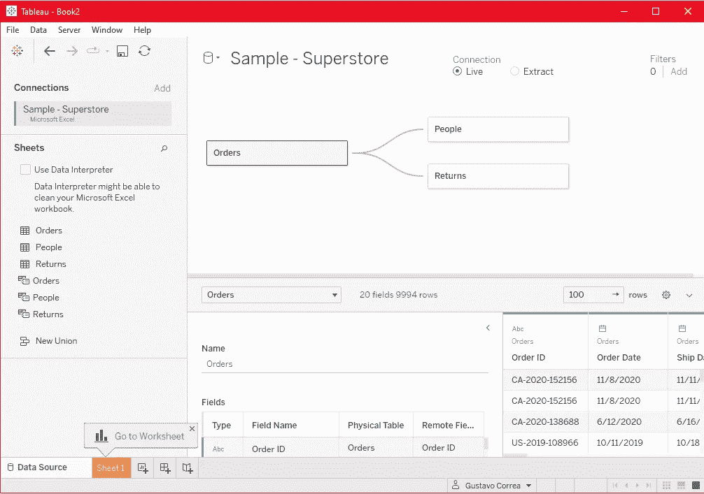
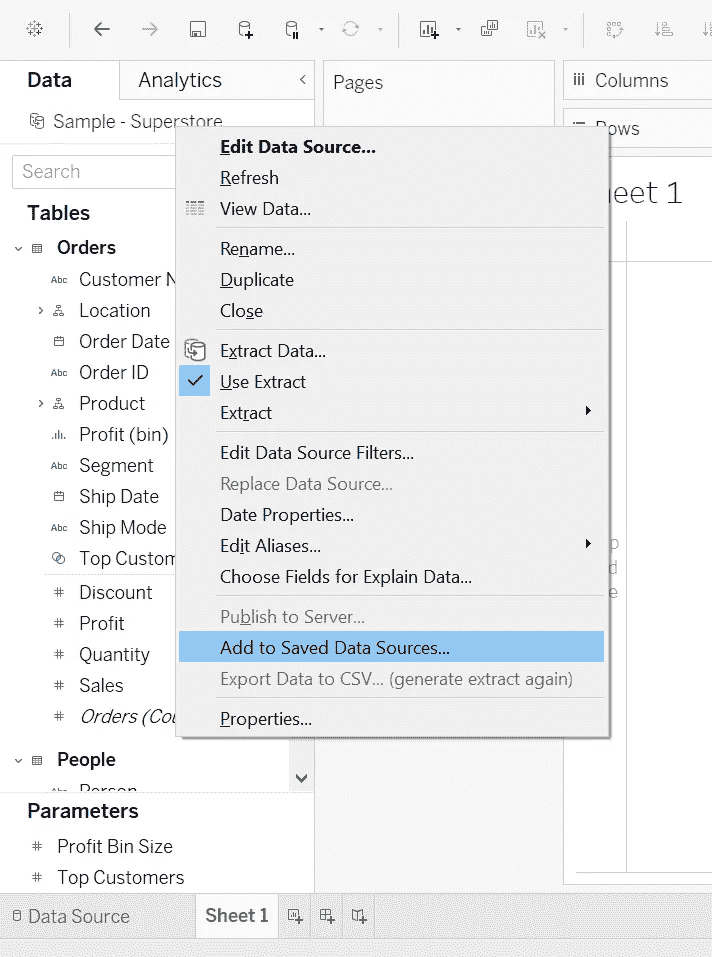
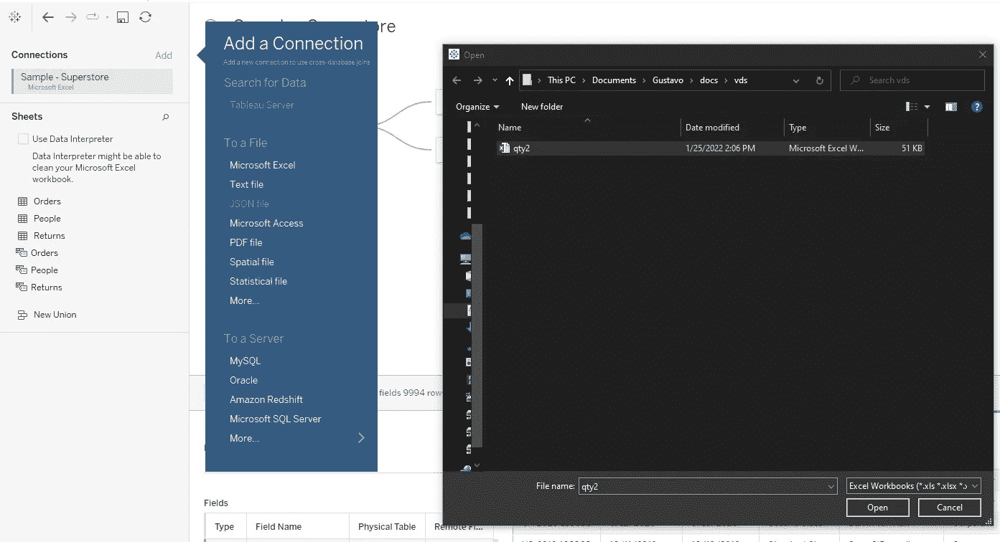
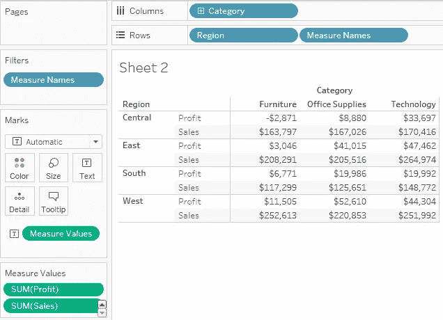
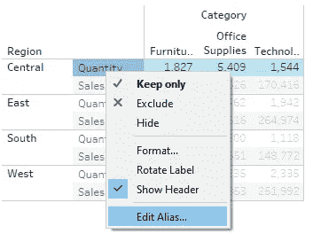
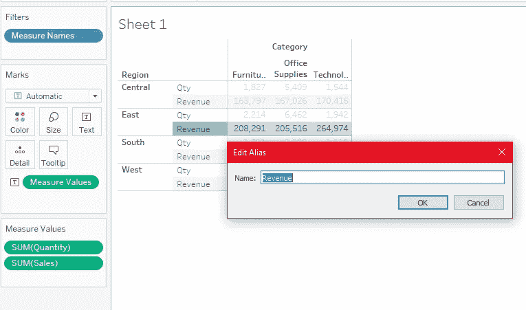
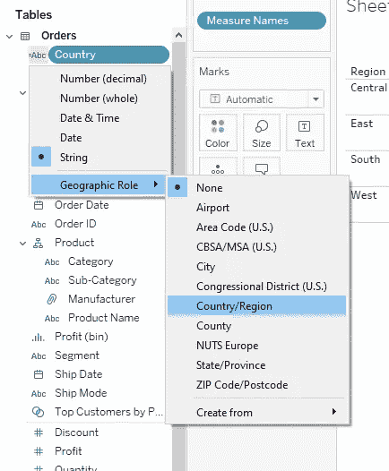
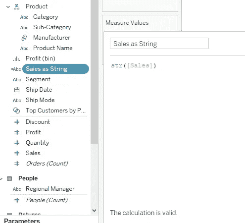
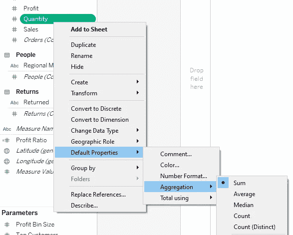

# 成为 Tableau 桌面专家认证的完整指南

> 原文：<https://towardsdatascience.com/a-complete-guide-to-becoming-a-tableau-desktop-specialist-certified-56f1e39777d1>

## 第 1/4 部分:连接和准备数据

Tableau 桌面专家考试指南的第 1 部分(图片由作者提供)

# 考 Tableau 桌面专员认证值得吗？

你最近有没有搜索过数据分析相关领域的工作岗位？如果你这样做了，你会意识到 Tableau 是市场上领先的 BI 工具。与以往任何时候相比，公司正在从 Excel 中的静态表格和爆炸式饼图转向更强大的报告和仪表板。不要误解我，我非常欣赏 Excel 及其功能，但 Tableau 让您的分析和报告更上一层楼。作为 Tableau 桌面专家认证，你可以向世界展示你是这份工作的最佳人选。甚至有一个[目录](https://www.credly.com/organizations/tableau/directory),你可以搜索赚钱的人，看到每一个被认证的人。如果你点击[这里](https://www.credly.com/organizations/tableau/directory)，进入“搜索目录”框，搜索古斯塔沃·英夫，点击“收入者”，你会在那里找到我。

认证徽章(由[画面](https://www.tableau.com/learn/certification/desktop-specialist)

考试费用是 100 美元。这项投资非常便宜，当你考虑到 Tableau 是世界上领先的 BI 工具之一，并且你用它获得的技能对任何进行数据分析的公司都有吸引力时，你就会知道 Tableau 桌面专家认证是完全值得的。

话虽如此，我们开始工作吧！

在这篇文章中，我们将讨论组成考试准备的四个领域中的第一个。请记住，这些域是由 Tableau 自己建立的。在下面找到每个领域的链接，它们在考试中的份额，以及安排考试的链接。

*   **域 1:连接到&准备数据(25%)**
*   领域 2:探索和分析数据(35%)[进行中]
*   领域 3:分享见解(25%)[进行中]
*   领域 4:理解 Tableau 概念(15%)[进行中]
*   [安排考试](https://www.tableau.com/learn/certification/desktop-specialist)

在第一部分中，我们将逐步详细介绍以下概念:

1.  创建与数据源的实时连接
2.  创建和管理数据模型
3.  管理数据属性

# 1.创建和保存数据连接

## **创建到数据源的实时连接**

连接到数据集后，在“数据源”选项卡中，可以选择实时连接或数据提取。

创建与数据源的实时连接(图片由作者提供)

## **解释使用实时连接和提取之间的区别**

一个**实时连接**是 Tableau 的一个强大功能，它允许你实时更新数据。使用实时连接的缺点是大量数据的低性能。如果您正在工作的场景不要求实时更新，您可以避免实时连接并提高速度。向数据源添加筛选器可以最大限度地减少大型数据集的问题。

一种**提取物**提供优化的性能。它是加载到内存中的数据的快照。它允许您为大量数据构建和处理复杂的可视化和计算。你可以处理几千兆字节，甚至不会注意到任何滞后。提取的缺点是需要刷新数据源来更新数据。这可能需要一些时间。

## **创建摘录**

当选择通过提取连接到数据时，将要求您在本地保存 Tableau 数据提取文件。您可以向提取中添加过滤器以提高性能。点击“编辑”，“添加”，选择你想过滤的字段，然后点击“确定”。

创建摘录并应用过滤器以提高性能(视频由作者提供)。

## **将元数据属性保存在. TDS 中**

元数据是一组数据，用于描述关于另一组数据的信息。在. tds 文件中保存元数据属性意味着保存数据集的结构，包括:

*   默认聚合
*   计算字段
*   自定义集
*   数据仓

保存元数据导出(按作者分类的图像)

节约。当您处理遵循相同结构的几个数据集时，tds 文件非常有用。例如，如果您为不同公司的项目工作，并且您经常从 Yahoo Finances 中提取他们的财务报表，则数据字段将总是非常相似。您可以构建用于所有这些不同公司的计算字段、默认聚合和集合。您可能需要在某些地方进行调整，以适应特定的独特性，但是大部分工作都可以重用。

通过转到工作表上的数据面板，右键单击感兴趣的数据集，然后单击“添加到保存的数据源”，可以保存元数据属性。现在只要选择目的地。

## 创建使用多个连接的数据源

您可以轻松地将多个连接组合成一个数据源，以便在项目中使用不同的数据集。仍然在“数据源”选项卡中，单击标题“连接”旁边的“添加”,选择连接类型，然后选择数据。

创建具有多个连接的数据源(图片由作者提供)。

# 2.创建和管理数据模型

## 向数据源添加关系

当您想要合并多个数据源而不需要创建连接时，关系非常方便。当您处理已发布的数据源时(它不允许连接)，或者如果您只需要项目特定部分的连接时，就会出现这种情况。毕竟，关系基本上是两个数据源之间的左连接(稍后将详细介绍连接)。利用关系的坏处是它会限制你的能力。例如，它不允许您使用辅助数据源中的组或 LOD 表达式。你可以在这里找到更多关于关系的局限性[的细节。](https://help.tableau.com/current/pro/desktop/en-us/multipleconnections_troubleshooting.htm#:~:text=Data%20blending%20has%20some%20limitations,have%20to%20be%20calculated%20individually.)

要创建这些关系，首先，您需要连接到至少两个具有相似字段作为键的数据源。在工作表中，转到“数据”，“编辑混合关系”，然后选择用于合并这些数据源的字段。辅助数据源中的字段旁边会出现红色的小键。您可以选中或取消选中它们，将它们用作不同工作表中的键。当您有不同粒度级别的视觉效果，并且每个视觉效果的关系都不同时，这非常有用。您只需选中或取消选中每个表单中的必要字段。在下面的视频里看到。

如何融合数据源(视频由作者提供)。

## 添加联接和联合

联接和联合在概念上非常类似于关系，但是您是在“数据源”选项卡中完成的，并且您将使用联接的结果创建一个新的数据源。这意味着你不会有任何限制，因为你有关系。

**连接**通过关键字段连接两个数据集。输出是每个数据集中所有其他列的关键字段。 **Unions** 连接具有相同列的两个数据集，并通过这些列简单地将一个数据集堆叠在另一个数据集之上。看看下面的视频，看看奇迹是如何发生的。我们将把原始数据源与一个包含两个工作表的新连接进行合并。第一个表将连接原始数据，第二个表将合并第一个表。

在数据源中应用连接和联合(视频由作者提供)。

# 3.管理数据属性

## 重命名数据字段

重命名数据字段非常简单。在任何工作表中，右键单击要重命名的字段，然后单击“重命名”。

现在，重命名字段和编辑别名是有区别的。这时，我需要向您简要解释一下什么是**措施**。Tableau 在数据窗格中自动创建两个字段:度量名称和度量值。它们允许你用多种方法构建视觉效果。

**测量值**包含数据的所有测量(绿卡)，而**测量名称**包含所有这些测量的名称。请参见下面的示例:

使用度量名称和值允许您显示多个度量(按作者排序的图像)

上面的例子显示了我们如何使用这些卡片来显示多个度量。我们将在本系列的域 4 中更详细地讨论度量。现在来说说“编辑别名”。

## 为数据值分配别名

别名是度量名称中度量的“名称”。因此您可以更改度量值的显示方式，而不是更改字段的名称。在可视化中右键单击测量名称**，选择“编辑别名…”。请参见下面的示例:**

为度量分配别名(按作者排序的图像)。

看看下面会是什么样子，注意字段的名称还是一样的。您只是在可视化中为该度量创建一个别名。

编辑度量的别名(按作者排序的图像)。

## 为数据字段分配地理角色

这就是你如何告诉 Tableau 一个字段有一个地理角色(它是一个国家，地区，城市，邮政编码等。).要让它工作，您可以单击数据窗格中字段名称左侧的图标，并选择“地理角色”选项之一。当你这样做时，Tableau 将能够使用该字段构建地图。请参见下图:

为字段分配地理角色(按作者排列的图片)。

## 更改数据字段的数据类型(数字、日期、字符串、布尔值等)。)

基本上有两种方法可以改变字段的数据类型。您只需单击“数据”窗格中字段名称左侧的图标，然后选择适当的数据类型，或者您可以创建一个新的计算字段来更改其中的数据类型。单击数据窗格右上角的菜单并选择“新计算字段”，然后查看下图，并注意新字段的图标显示为“ABC”，而原来的[Sales]显示为“#”(数字):

创建新的计算字段以更改字段的数据类型(作者图片)。

## 更改数据字段的默认属性

这是应该让更多分析师知道的特性之一，因为它非常有用，而且节省时间。数据中的每个字段都将以默认属性被接收到 Tableau 中，包括以下内容:

**尺寸**

*   颜色
*   形状
*   分类

**措施**

*   颜色
*   数字格式
*   聚合
*   总使用量

当您将字段拖动到可视区域时，将使用默认属性。例如，要避免更改颜色或数字格式，只需更改默认属性即可。您可以通过右键单击数据窗格中的字段，转到默认属性，然后选择要进行的更改来实现这一点。

更改 Tableau 中字段的默认属性(图片由作者提供)。

这就是第一个域(连接和准备数据)。如果你有任何问题，请在下面的评论中提出。此外，在参加考试并成为 Tableau 桌面专家之前，一定要做好所有 4 个领域的准备。你将准备好钉它！

干杯！