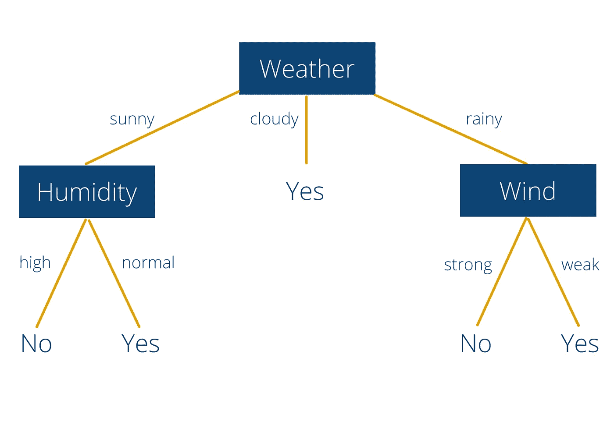
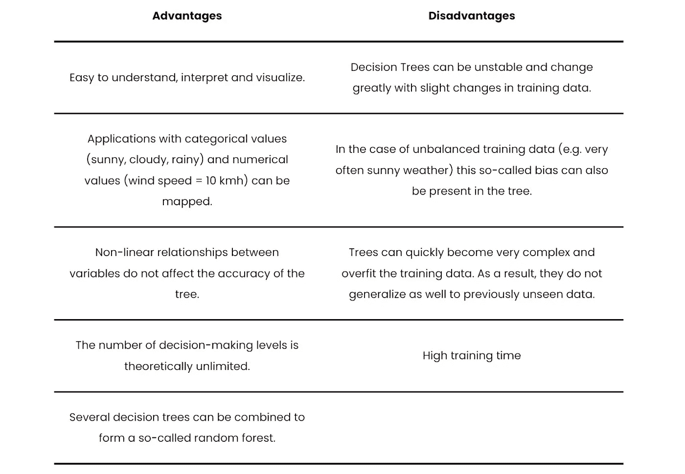
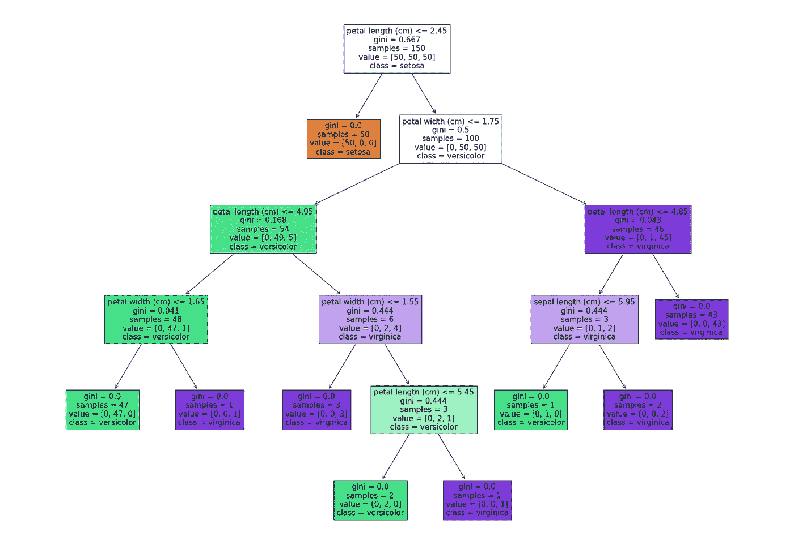

# 决策树完全指南

> 原文：<https://towardsdatascience.com/a-complete-guide-to-decision-trees-ac8656a0b4bb>

## 学习关于决策树的所有知识，包括 Python 示例

西蒙·威尔克斯在 [Unsplash](https://unsplash.com/s/photos/tree?utm_source=unsplash&utm_medium=referral&utm_content=creditCopyText) 上的照片

决策树是一种机器学习算法，其名称来自其树状结构，用于表示多个决策阶段和可能的响应路径。决策树为分类任务或回归分析提供了良好的结果。

# 我们用决策树做什么？

借助于树形结构，不仅可以将不同的决策层可视化，还可以将它们按一定的顺序排列。对于单个数据点，可以进行预测，例如，通过得出目标值以及分支中的观察值进行分类。

决策树用于根据目标变量进行分类或回归。如果树的最后一个值可以映射到一个连续的尺度上，我们称之为回归树。另一方面，如果目标变量属于一个类别，我们称之为分类树。

由于这种简单的结构，这种类型的决策非常受欢迎，并广泛应用于各种领域:

*   **业务管理**:不透明的成本结构可以借助树状结构来说明，并清楚地表明哪些决策需要多少成本。
*   **医学**:决策树有助于患者发现自己是否应该寻求医疗帮助。
*   **机器学习和人工智能**:在这个领域，决策树被用来学习分类或回归任务，然后做出预测。

# 决策树的结构

树基本上由三个主要部分组成:根、分支和节点。为了更好地理解这些组成部分，让我们仔细看看一个示例树，它可以帮助我们决定今天是否在户外锻炼。

决策树示例|作者照片

顶层节点“天气”就是所谓的根节点，作为决策的依据。决策树总是只有一个根节点，因此所有决策的入口点都是相同的。在这个节点上挂着所谓的具有决策可能性的分支。在我们的情况下，天气可以是多云、晴天或雨天。其中两个分支(“晴天”和“雨天”)挂着所谓的节点。此时，必须做出新的决定。只有分支“多云”直接导致一个结果(叶)。所以从我们的树上，我们已经可以读到，当天气多云时，我们应该总是去户外运动。

另一方面，在晴天或雨天，我们必须考虑第二个因素，这取决于我们的天气结果。对于节点“湿度”，我们可以在“高”和“正常”之间选择。如果湿度高，我们最终会得到“不”叶子。因此，在阳光充足、湿度较高的天气里，不宜在户外运动。

如果天气下雨，我们就在决策树的另一个分支。那么我们就要在“风”这个节点做出决定了。这里的决策选项是“强”或“弱”。还是那句话，我们可以读两条规则:如果下雨但风力较弱，我们可以在外面做运动。另一方面，如果下雨并伴有大风，我们应该呆在家里。

这个非常简单的例子当然可以进一步扩展和完善。例如，对于节点“湿度”和“风”，可以考虑用具体的规则(强风=风速> 10 公里/小时)来代替主观的决策选项，或者将分支细分得更细。

# 所谓的修剪是什么？

在现实世界的用例中，决策树会很快变得复杂和混乱，因为在大多数情况下，需要两个以上的决策才能得到一个结果。为了防止这种情况，经过训练的决策树经常被修剪。

**减少错误剪枝**是一种自下而上的算法，从叶子开始，逐渐向根发展。这包括取出整个决策树，并省去包括决策的一个节点。然后，进行比较以查看截断树的预测精度是否已经恶化。如果不是这种情况，树被这个节点缩短，决策树的复杂度降低。

除了在训练之后缩短树的可能性之外，还有在训练之前或期间保持低复杂度的方法。一个流行的算法是所谓的**提前停止规则**。在训练期间，在每个创建的节点之后，决定是否在该点继续该树，即它是否是决策节点，或者它是否是结果节点。在许多情况下，所谓的基尼系数被用作一个标准。

简而言之，它表达了如果标签被简单地随机分配，即基于在该节点的分布，标签将在该节点被不正确地设置的概率。这个比率越小，我们就越有可能在这一点上对树进行修剪，而不必担心模型准确性的巨大损失。

# 决策树的优点和缺点

简单易懂的结构使决策树成为许多用例中的流行选择。但是，在使用该模型之前，应该权衡以下优点和缺点。

决策树的优点和缺点|作者照片

# 决策树是随机森林的一部分

随机森林是由个体决策树组成的[监督](https://databasecamp.de/en/ml/supervised-learning-models)机器学习算法。这种类型的模型被称为集合模型，因为独立模型的“集合”被用于计算结果。在实践中，这种算法用于各种分类任务或回归分析。其优点是通常较短的培训时间和程序的可追溯性。

[随机森林](/introduction-to-random-forest-algorithm-fed4b8c8e848)由大量这些决策树组成，它们作为一个所谓的整体一起工作。每个单独的决策树做出预测，例如分类结果，并且森林使用大多数决策树支持的结果作为整个集合的预测。为什么多个决策树比单个决策树好得多？

随机森林之所以奏效，是因为所谓的[的多数人](https://de.wikipedia.org/wiki/Die_Weisheit_der_Vielen)的智慧原则。它说，许多决策树的决策优于一个独特的树的结果。这是一个适用于各种用例的原则，并在 fair 上首次得到认可。

在 20 世纪，在集市上出售牛是很常见的，必须确定它们的重量。1906 年，这样的一头牛被展示给 800 个不同的人，让他们猜这头牛的重量。最终，八百个人猜测的中值距离最终重量只有 1 %左右。没有一个估计与实际结果如此接近，这意味着个人的总和比任何其他人都有更好的估计。

这一发现可以转化为其他领域，如随机森林，这意味着几个决策树及其聚合预测优于单个树。

随机森林的结构|作者照片

然而，这是有一个先决条件的。决策不能与[相关](https://databasecamp.de/en/statistics/correlation-and-causation)，否则单个树的错误不会被另一个树补偿。让我们回到我们公平的例子。

如果所有的参与者都没有达成任何形式的一致，也就是说他们是不相关的，那么权重的中值估计将会比单一的猜测要好。否则，几个人的估计会影响其他人，而这不会产生多数人的智慧。

# 用 Python 训练决策树

[skic it-Learn](https://scikit-learn.org/stable/index.html)[Python](https://databasecamp.de/en/python-coding)模块提供了数据分析所需的各种工具，包括决策树。其中，它基于 Numpy 已知的数据格式。为了用 Python 创建决策树，我们使用了来自[文档](https://scikit-learn.org/stable/modules/tree.html)的模块和相应的例子。

所谓的[虹膜数据集](https://archive.ics.uci.edu/ml/datasets/iris)是用于创建分类算法的流行训练数据集。这是一个生物学的例子，涉及到所谓的鸢尾属植物的分类。关于每朵花的长度和宽度的花瓣和所谓的萼片是可用的。基于这四条信息，然后就可以知道这种特定的花是三种虹膜类型中的哪一种。

在 Skicit-Learn 的帮助下，只需几行代码就可以训练出一个决策树:

因此，我们可以通过定义输入变量 X 和要预测的类 Y 来相对容易地训练决策树，并根据它们来训练决策树。利用函数“predict_proba”和具体值，可以进行分类:

因此，根据我们的决策树，具有虚构值的这朵花属于第一类。这个属叫做“刚毛鸢尾”。

# 如何解读决策树？

在 MatplotLib 的帮助下，可以画出训练好的决策树。

我们数据的最佳决策树共有五个决策级别:

决策树虹膜数据集示例|作者照片

对于这个树的简单解释，我们感兴趣的是第一行和最后一行的值。树是从上到下读的。这意味着，在第一个决策层，我们检查花瓣的长度是否小于或等于 2.45 厘米。条件总是被公式化，使得在左分支中只有“真”，在右分支中只有“假”。

所以，如果一朵混凝土花有一个小于或等于 2.45 厘米的花瓣，我们在左边的分支(橙色瓷砖中)，这也是一片结果叶。因此我们知道，在这种情况下，花属于“Setosa”类。

另一方面，如果花瓣更长，我们沿着正确的分支前进，并面临另一个决定，即花瓣是否有 1.75 厘米的最大宽度。我们遍历树，直到得到一个提供分类信息的结果表。

# 这是你应该带走的东西

*   决策树是另一种机器学习算法，主要用于分类或回归。
*   树由起点、所谓的根、代表决策可能性的分支和具有决策级别的节点组成。
*   为了降低树的复杂性和大小，我们应用所谓的修剪方法来减少节点的数量。
*   决策树非常适合生动地表现决策，并使其可以解释。
*   然而，在训练时，为了获得有意义的模型，必须注意许多细节。

*如果你喜欢我的作品，请在这里订阅***或者查看我的网站* [*数据大本营*](http://www.databasecamp.de/en/homepage) *！还有，medium 允许你每月免费阅读* ***3 篇*** *。如果你希望有****无限制的*** *访问我的文章和数以千计的精彩文章，请不要犹豫，点击我的推荐链接:*[【https://medium.com/@niklas_lang/membership】](https://medium.com/@niklas_lang/membership)每月花$***5****获得会员资格**

* [## 学习编码:13 个免费网站帮助你开始

### 一旦你决定要学习编码，你会被众多的在线工具宠坏，这些工具可以帮助你…

towardsdatascience.com](/learn-coding-13-free-sites-to-help-you-do-it-9b2c1b92e573)  [## 随机森林算法简介

### 算法是如何工作的，我们可以用它来做什么

towardsdatascience.com](/introduction-to-random-forest-algorithm-fed4b8c8e848)  [## 借助《哈利·波特》理解 MapReduce

### MapReduce 是一种允许并行处理大型数据集的算法，例如，在多台计算机上…

towardsdatascience.com](/understanding-mapreduce-with-the-help-of-harry-potter-5b0ae89cc88)  [## 通过我的推荐链接加入媒体- Niklas Lang

### 作为一个媒体会员，你的会员费的一部分会给你阅读的作家，你可以完全接触到每一个故事…

medium.com](https://medium.com/@niklas_lang/membership) 

*原载于 2022 年 1 月 5 日*[*https://database camp . de*](https://databasecamp.de/en/ml/decision-trees)*。**