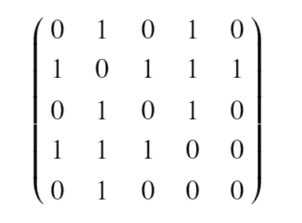

# Python 图形完全指南

> 原文：<https://towardsdatascience.com/a-complete-guide-to-graphs-in-python-845a0a3381a1>

## 在 Python 中构造和使用图形数据结构


照片由 [JJ 英](https://unsplash.com/@jjying?utm_source=medium&utm_medium=referral)在 [Unsplash](https://unsplash.com?utm_source=medium&utm_medium=referral)

## 介绍

用编程术语来说，图是一种抽象数据类型，它充当数据元素的非线性集合，包含关于元素及其相互连接的信息。这可以用 *G* 来表示，其中 *G = (V，E)* 和 *V* 表示一组顶点， *E* 是连接这些顶点的一组边。这些边可以简单地以[1，0]的形式表示顶点之间的关系，无论是否存在连接，或者可以表示诸如距离、关系强度或它们交互次数之类的值的给定权重。当我们想要映射对象之间的关系时，特别是当有多个关系时，以及当我们想要搜索完成任务流的最佳方式时，这可能是有用的。

在 Python 中实现这种抽象数据类型有两种常见的方法。第一个是邻接矩阵，第二个是邻接表。出于我们的目的，我们将实现邻接表形式，但有必要理解为什么会这样。

**邻接矩阵**

二维数组形式的邻接矩阵是将图实现为数据结构的最简单方法之一。这将表示为:



作者图片

其中每一行和每一列代表图中的一个顶点。存储在代表行 *v* 和列 *w* 的交叉点的单元中的值指示是否存在从顶点 *v* 到顶点 *w* 的边，并且大小代表“重量”。当这些顶点中的两个由一条边连接时，我们可以说它们是相邻的。

邻接矩阵实现的优点是简单，对于小图易于可视化。然而，如果许多单元格是空的，那么我们有一个“稀疏”的矩阵，所以我们使用大量的存储来显示很少的信息。因此，这种实现的问题是所使用的内存存储量。

**邻接表**

实现稀疏连通图的一个更节省空间的方法是使用邻接表。在这个实现中，我们保存一个图形对象中所有顶点的主列表，然后每个顶点对象维护一个它所连接的其他顶点的列表。

这种实现的优点是，我们可以紧凑地表示稀疏图，以便我们只显示图中包含的顶点以及它们的实际连接，而不是也表示没有连接。使用这种方法还可以让我们轻松地找到所有直接连接到单个顶点的链接。

## 履行

记住这一点，知道我们希望数据结构如何包含以及我们可能希望如何与它交互，我们可以考虑我们希望如何在实际的数据结构中实现这一点。通常与此相关的主要方法包括:

*   `addVertex(vert)`:在 id 等于 key 的图形中添加一个`vertex`
*   `addEdge(fromVert, toVert)`:向连接两个顶点的图形添加新的有向边
*   `getVertex(vertKey)`:在名为`vertKey`的图中找到顶点
*   `getVertices()`:返回图形中所有顶点的列表
*   如果顶点在图中，则`in`返回形式为`vertex in graph`的语句的`True`，否则返回`False`

在 Python 中实现这种抽象数据类型有两种常见的方法。第一个是邻接矩阵，第二个是邻接表。出于我们的目的，我们将实现邻接表的形式，但它是值得理解为什么是这样的情况。

**顶点类**

在创建包含所有顶点的图之前，我们需要创建一个顶点类来表示图中的每个顶点。在这个实现中，每个顶点使用一个字典来跟踪它以`connectedTo`属性的形式连接到的顶点。当我们创建一个新的顶点时，我们用键的`id`初始化这个顶点，键通常是一个代表这个顶点的字符串，还有一个空的`connectedTo`字典。我们还必须向这个`Vertex`类添加功能，这样我们就可以向我们的字典添加邻居，

```
Class Vertex: def __init__(self, key):
        self.id = key
        self.connectedTo = {} def addNeighbor(self, nbr, weight = 0):
        self.connectedTo[nbr] = weight def __str__(self):
        return f"{str(self.id)} connected to: {str([x.id for x in
                  self.connectedTo])}" def getConnections(self):
        retun self.connectedTo.keys() def getId(self):
        return self.id def getWeight(self, nbr):
        return self.connectedTo.get(nbr)
```

**图形类**

在这种情况下，我们实现图形的方式是，图形包含一个将顶点名称映射到顶点对象的字典。这意味着在构造时，我们只需要创建一个空字典，当它们被添加到图中时，可以用来存储`Vertex`对象。我们还可以添加一个`numVertices`属性，它将存储图中顶点的数量，以便在以后需要时可以很容易地提取出来。

```
class Graph: def __init__(self):
        self.vertList = {}
        self.numVertices = 0
```

现在我们有了我们的图，我们要添加的第一件事是给我们的图添加一个顶点。在这个简单的实现中，我们将只关注添加一个具有给定 id 的顶点。为此，我们需要使用键的 id 创建一个新的顶点类，使用键作为`vertList`字典中的键，并将创建的顶点作为值添加到字典中。然后我们可以返回它，这样用户就可以看到他们创建的顶点:

```
 def addVertex(self, key):
        """
        Add a vertex to the Graph network with the id of key Time complexity is O(1) as we are only adding a single
        new vertex which does not affect any other vertex
        """ #add 1 to the number of vertices attribute
        self.numVertices += 1 #instantiate a new Vertex class
        newVertex = Vertex(key) #add the vertex with the key to the vertList dictionary
        self.vertList[key] = newVertex #return the NewVertex created
        return newVertex
```

如果你想看一个顶点本身呢？

然后我们可以创建一个方法，如果有匹配的键，它将返回实际的顶点。我们可以使用字典的`get()`方法来实现，因为如果关键字不在字典中，它将返回`None`，否则将返回实际的顶点。这将允许用户查看顶点包含的内容，然后查看图形中其他顶点的链接。

```
 def getVertex(self, key):
        """
        If vertex with key is in Graph then return the Vertex Time complexity is O(1) as we are simply checking whether
        the key exists or not in a dictionary and returning it
        """ #use the get method to return the Vertex if it exists
        #otherwise it will return None
        return self.vertList.get(key)
```

作为补充，我们可以使用关键字`in`来检查一个顶点是否在图中。为此，我们使用了`__contains__`邓德方法，该方法允许用户使用`vertex in graph`符号检查一个顶点是否在字典中。因为每个键代表一个顶点，那么我们可以简单地返回`key`是否在`vertList`中，这将返回`True`或`False`。

```
 def __contains__(self, key):
        """
        Check whether vertex with key is in the Graph Time complexity is O(1) as we are simply checking whether 
        the key is in in the dictrionary or not """ #returns True or False depending if in list
        return key in self.vertList
```

图的一个重要属性是顶点之间的连接或边，它包含了顶点如何连接的信息，无论是它们的距离还是另一种度量。为此，我们可以创建`addEdge`函数来添加一条连接两个顶点的边，默认权重为 0。

下面我们实现它的方式是建议一个有向图，因为连接只从顶点`f`到顶点`t`进行，然而这可以容易地扩展到包括两个方向的连接。我们需要确保的是顶点`f`和`t`实际上都在图中，所以如果它们还不存在，那么我们可以调用已经创建的`addVertex()`方法来创建这些顶点。然后我们可以从每个顶点使用`addNeighbor()`方法来添加从`f`到`t`的邻居。

```
 def addEdge(self, f, t, weight = 0):
        """
        Add an edge to connect two vertices of t and f with weight
        assuming directed graph Time complexity of O(1) as adding vertices if they don't 
        exist and then add neighbor
        """ #add vertices if they do not exist
        if f not in self.vertList:
            nv = self.addVertex(f)
        if t not in self.vertList:
            nv = self.addVertex(t) #then add Neighbor from f to t with weight
        self.vertList[f].addNeighbor(self.vertList[t], weight)
```

我们现在有了图的主要功能，而不是能够添加顶点，检查它们是否存在，以及能够添加顶点之间的连接。因此，我们可以开始添加额外的功能来帮助使用数据结构。

第一个是能够返回图中顶点的完整列表。这将简单地打印出所有的顶点名称，但是当我们想要快速浏览当前结构的图形时，这是很有用的。

```
 def getVertices(self):
        """
        Return all the vertices in the graph Time complexity is O(1) as we simply return all the keys
        in the vertList dictionary
        """

        return self.vertList.keys()
```

第二是能够返回图中顶点的数量。这很简单，因为我们在构造函数方法中创建了`numVertices`属性，然后每当我们调用`addVertex`方法时，我们就给它加 1。因此，我们简单地返回这个属性来显示图中有多少个顶点。

```
 def getCount(self):
        """
        Return a count of all vertices in the Graph

        Time complexity O(1) because we just return the count
        attribute
        """ return self.numVertices
```

然后，我们可以将所有这些放在一起，得到最终产品:

当然，还有其他方法可以扩展这种实现，包括:

*   能够迭代每个顶点
*   能够从网络中移除顶点
*   能够移除或改变网络中的边

但是这个简单的实现可以为这些添加奠定基础。

## 结论

图是一种非常通用的数据结构，可以用各种方式来表示各种问题。这可以包括一个道路网络，一个友谊网络或者一个棋子在棋盘上的移动。它可用于搜索算法，如广度优先搜索或深度优先搜索，或提取不同图形的共同属性，如最短路径、网络直径或某些节点的中心性。上面的实现经过一些调整就可以用在这些例子中，所以您现在已经有了更详细地研究这些的基础！

这是探索数据结构及其在 Python 中的使用和实现系列的第 8 篇文章。如果您错过了前三篇关于 Python 中的队列、链表和堆栈的文章，您可以在以下链接中找到它们:

[](/a-complete-guide-to-queues-in-python-cd2baf310ad4)  [](/a-complete-guide-to-linked-lists-in-python-c52b6cb005)  [](/a-complete-guide-to-stacks-in-python-ee4e2045a704)  

本系列的后续文章将涉及链表、队列和图形。为了确保您不会错过任何内容，请注册以便在发布时收到电子邮件通知:

[](https://philip-wilkinson.medium.com/subscribe)  

如果你喜欢你所读的，但还不是一个中等会员，那么考虑使用我下面的推荐代码注册，在这个平台上支持我自己和其他了不起的作者:

[](https://philip-wilkinson.medium.com/membership)  

感谢您的阅读！