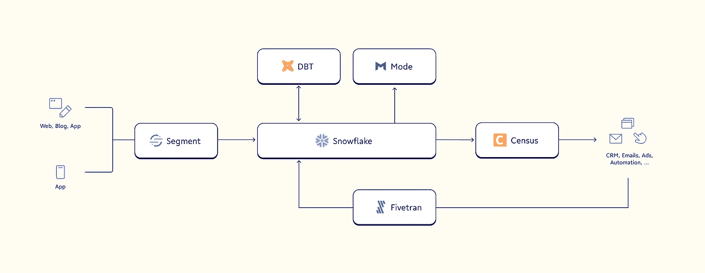
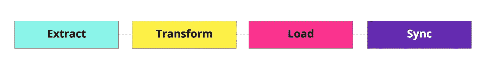

# 理解数据编排的完整指南

> 原文：<https://towardsdatascience.com/a-complete-guide-to-understanding-data-orchestration-87a20b46297c>

## *关于数据编排和 2022 年流行框架，你应该知道的一切*

由[拉丽莎·伯塔](https://unsplash.com/@larisabirta?utm_source=unsplash&utm_medium=referral&utm_content=creditCopyText)在 [Unsplash](https://unsplash.com/s/photos/symphony?utm_source=unsplash&utm_medium=referral&utm_content=creditCopyText) 上拍摄的照片

> **请务必点击** [**订阅此处**](https://terenceshin.medium.com/membership) **千万不要错过另一篇关于数据科学指南、技巧和提示、生活经验等的文章！**

现代公司中的数据世界在不断扩大。令人兴奋的是，有比以往更多的数据需要挖掘，但随着更多的数据而来的是更多的治理、同步计划和处理问题。

公司需要打破数据源和存储之间的孤岛，以真正[运营他们正在收集的所有信息](https://blog.getcensus.com/what-is-operational-analytics/)。然而，仅仅添加新的工具并不能解决问题(实际上会使问题变得更糟)。为了打破数据源之间的孤岛并克服系统蔓延，他们需要更好的数据治理和数据编排。

数据编排使组织能够自动化和简化其数据，实现数据的可操作性，以便利用这些有价值的信息来推动实时业务决策。据估计，[数据分析中涉及到的 80%的工作](https://hbr.org/2016/12/breaking-down-data-silos)归结为获取和准备数据，这意味着数据编排可以减少数据处理和调度时间的负载。

# 但是首先…什么是数据编排？

数据流程编排在数据管道的每个阶段看起来都有所不同，因此在本文中，我们将重点关注一个 20，000 英尺长的通用定义，该定义从端到端捕捉数据流程编排:

> 数据编排是利用软件打破源和存储位置之间的数据孤岛，通过自动化提高现代数据堆栈中的数据可访问性。它改进了数据收集、数据准备和转换、数据统一以及交付和激活。

当一家公司投资购买必要的软件来支持其堆栈中每一层的数据编排时，他们能够更好地连接他们的系统，并确保他们能够相对实时地访问所有信息。

作者创造的形象

> **请务必点击** [**订阅此处**](https://terenceshin.medium.com/membership) **千万不要错过另一篇关于数据科学指南、技巧和提示、生活经验等的文章！**

# 数据编排的重要性

正如我们在上面的定义中提到的，数据编排有助于您的整个体系中的四个主要流程:

1.  **数据收集**:端到端数据编排服务处理数据接收，从您的客户接触点收集重要数据，通常通过可直接与您的应用集成的 SDK 和 API。
2.  **数据准备和转换**:收集完数据后，编排服务会帮助标准化和检查收集点的属性和值。这些值——比如名称、时间和事件——可以进行变异以匹配标准模式。
3.  **数据统一**:数据编排服务可以帮助组织将其数据统一到一个池中，这个池比单个输入流本身更有价值。通过将从网站、销售点设备和应用程序收集的数据拼接在一起，这可用于创建单一、统一的客户视图，以帮助您了解个人用户随时间推移的行为。
4.  **交付和激活**:一旦创建了统一的客户档案，数据编排服务就可以将这些有价值的信息发送到您的团队每天使用的工具中，包括 BI 平台、数据分析工具和客户管理解决方案。

您可以将您的数据管道想象成一条河流，有一些支流(数据源)流入其中。假设您试图在河口附近创建一个带有大坝的水库(数据仓库)，该水库将产生足够的电力(洞察力/价值)为附近的城镇(客户)提供电力。

如果没有数据协调，修建大坝和控制水库水位的人必须手动运行上游，并在每个源头上放水门。这需要几个小时(和大量的工作)。有了数据编排，管理大坝的工作人员可以通过编程运行操作来自动化水流，而无需文字工作。这意味着他们可以花更多的时间来监控产生的能量并将其输送到城镇。

从技术上讲，数据编排解决方案由 Dag(有向无环图形)归档，dag 是您想要运行的任务的集合。这些任务是根据它们的依赖关系来组织和运行的。

作者创造的形象

DAG 的每个节点代表流程中任务的一个步骤。它通常由 Python 脚本定义，这使得数据科学家易于使用。

例如，将提取、加载、转换和同步流程的四个步骤作为 DAG。为了执行转换步骤，必须加载数据，并且为了加载数据，首先必须提取数据。然后，一旦所有这些都发生了，像 Census 这样的[反向 ETL](https://blog.getcensus.com/what-is-reverse-etl/) 工具就可以通过 API 使用触发器同步来处理下游工作。

更准确地说，数据编排流中的 Dag 可以帮助:

*   仓库中的数据组织、清理和发布
*   业务度量计算
*   通过电子邮件活动对活动目标和用户参与度实施规则
*   数据基础设施维护
*   训练机器学习模型

# 数据编排工具是如何发展的

像所有技术一样，数据编排工具经常变化，以跟上不断发展的组织的数据管理需求。每一代新的数据编排服务都强调越来越具体的用例。

像**[**air flow**](https://airflow.apache.org/)**这样的第一代数据编排工具主要致力于通过引入 Python 支持来提高数据科学家的可用性(而以前的工具需要用 JSON 和 YAML 编写查询)。这种改进的 UI 使数据团队更容易管理他们的管道流，而不会陷入流程中。****

****像[**Dagster**](https://dagster.io/)**和**这样的第二代数据编排工具更侧重于数据驱动。他们能够检测 Dag 中的数据类型，并通过预测每种数据类型触发的操作来提高数据意识。********

******这些数据驱动的功能可以分为两类:******

1.  ******在步骤和系统之间传递数据的主动方法。******
2.  ******被动方法在触发任务之前等待 DAG 之外的事件(提示)发生(对于连续的模型训练特别有用)。******

******对于大多数用例来说，主动数据编排方法将会工作得很好。然而，随着堆栈和数据流变得越来越复杂，可以利用被动方法来编排这些堆栈。******

> ******请**务必** [**订阅此处**](https://terenceshin.medium.com/membership) **千万不要错过另一篇关于数据科学指南、技巧和提示、生活经验等的文章！********

# ****编排和未编排的数据有什么区别？****

****编排的数据堆栈和未编排的数据堆栈之间的区别在于，操作数据以推动未来决策，还是对过去的数据做出反应并进行故障排除。****

****不幸的是，许多老牌公司和初创公司仍在纠结于他们未经整理的数据。根据 Gartner 的数据，超过 87%的企业商业智能和分析成熟度较低。****

****这是因为仍处于向云迁移过程中的遗留系统和堆栈往往会产生比其分解的更多的数据孤岛。需要深思熟虑的治理和设计决策来改造这些遗留堆栈，以克服技术债务并在您的数据生态系统中利用数据编排工具。****

# ****为什么您应该关注数据编排？****

****数据编排打破了分隔数据堆栈的孤岛，使您的数据在黑暗的数据漩涡中变得陈旧。许多公司可能会让他们的工程师走上构建 DIY 编排解决方案的道路，但随着堆栈的变化，这些将很快变得无关紧要(此外，它需要大量昂贵的返工，让您的工程师很恼火)。除了节省数据工程时间，流程编排还可以帮助您:****

*   ****改善数据治理和可见性****
*   ****利用更新的客户数据****
*   ****确保数据隐私合规****

****流程编排为许多公司提供了一种可扩展的方式来保持堆栈的连接，同时保持数据顺畅流动，从而避免了他们所经历的成长烦恼。对于公司来说，这是一件好事:****

*   ****拥有大量需要整合的数据系统。****
*   ****已经开始集成现代数据堆栈，并希望从中获得更多的用途。****
*   ****刚刚开始构建他们的第一个堆栈，并希望建立一个强大的基础来应对未来的规模。****

****数据编排可确保您和您的团队拥有尽可能最新的数据，而无需您的工程师连夜手动运行作业来为您提供服务。这些服务允许您自动执行同步计划，并使用触发器 API 来更新下游依赖项。****

## ****1.改进了工程师和分析师的工作流程****

****使用手动 cron 作业和 Python 脚本是一种获取所需数据的缓慢方法。在当今的数据世界中，数据收集的速度和数量增长如此之快，以至于数据团队和工程师不可能跟上手动组织的步伐。****

****与其依赖一个超负荷工作的工程师从多个仓库和存储系统中获取您需要的数据，不如使用数据编排平台自动转换并交付给您。****

****这减少了工程师和数据科学家在数据收集和转换上花费的时间，并使数据团队能够实时做出更好的决策。****

## ****2.改善数据治理和可见性****

****孤立且分散的数据源很难管理和了解。为了有效地使用编排工具，公司必须审核和组织他们的堆栈，在流程中创建更多的可见性。这使您更容易管理您的数据，并提高数据的整体信心和质量。****

****从本质上讲，数据编排就是让您的数据和系统对使用它们的系统和人员更有用。****

## ****3.利用更新的客户数据****

****RevOps 的人知道，更好地洞察客户的关键在于数据。端到端的数据流程自动化使数据消费者比以往任何时候都更容易操作他们的数据使用。****

****借助与您的渠道集成的数据编排功能，来自营销活动、网络广播、网络应用和其他客户数据源的数据可以轻松收集、转换、加载到您的数据仓库，然后通过反向 ETL 工具发送回 Salesforce 和 Marketo 等平台。****

****这种信息可用性有助于 RevOps 团队对销售线索和客户进行评分，创建每个客户的单一视图，建立受众关联，等等。****

## ****4.确保数据隐私合规****

****巨大的数据带来巨大的责任。 [GDPR](https://gdpr-info.eu/) 、 [CCPA](https://oag.ca.gov/privacy/ccpa) 和其他数据隐私法要求组织通过提供证明数据收集正确且符合道德规范的文档，成为客户数据的好管家。****

****如果您在一个混乱的、不同的堆栈中工作，这种文档记录很难维护和显示。然而，有了配备了数据编排的现代数据堆栈，您可以轻松地详细了解您收集的每个数据点的时间、位置和原因。****

****这也使得组织更容易根据请求删除信息[，如果由于数据流不畅，部分有问题的数据被无限期地保留在上游，这是很难完全做到的。](https://blog.getcensus.com/cascading-deletes-in-rails/)****

# ****感谢阅读！****

> ******请务必点击** [**订阅此处**](https://terenceshin.medium.com/membership) **千万不要错过另一篇关于数据科学指南、技巧和提示、生活经验等的文章！******

****不确定接下来要读什么？我为你挑选了另一篇文章:****

**** [## 2022 年你应该阅读的 5 本最佳数据科学书籍

### 以下是我喜欢的最好的数据科学书籍

towardsdatascience.com](/the-5-best-data-science-books-you-should-read-in-2022-9209616c203f) 

**还有一个:**

 [## 编写优秀 SQL 代码的最佳实践

### 介绍

towardsdatascience.com](/8-best-practices-for-writing-top-tier-sql-code-e1023996e459) 

## -特伦斯·申

*   ***如果您喜欢这个，*** [***订阅我的中***](https://terenceshin.medium.com/membership) ***为独家内容！***
*   ***同样，你也可以*** [***跟我上媒***](https://medium.com/@terenceshin)
*   [***报名参加我的个人简讯***](https://terenceshin.substack.com/embed)
*   ***关注我上***[***LinkedIn***](https://www.linkedin.com/in/terenceshin/)***其他内容***

> 这最初由 Allie Beazell 发布在[人口普查博客](https://blog.getcensus.com/) *上。如果您有兴趣阅读更多类似的文章并了解更多关于运营分析的知识，请随时查看！*

 [## 关于数据和运营|普查的博客

### 来了解创业行业最佳运营团队的技巧和最佳实践。等待可操作的…

blog.getcensus.com](https://blog.getcensus.com/)****