# 完整的 SHAP 教程:如何用 Python 解释任何黑盒 ML 模型

> 原文：<https://towardsdatascience.com/a-complete-shap-tutorial-how-to-explain-any-black-box-ml-model-in-python-7538d11fae94>

## 向非技术人员解释任何黑盒模型


亚历山大·格雷摄影

# 动机

今天，你不能只是走到你的老板面前说，“这是我最好的模型。投入生产吧，开心点！”。不，现在不是那样了。公司和企业对采用人工智能解决方案非常挑剔，因为它们具有“黑箱”性质。他们**要求**模型的可解释性。

如果 ML 专家正在开发工具来理解和解释他们创造的*模型，那么非技术人员的担心和怀疑是完全有道理的。几年前引入的工具之一是 SHAP。它可以分解任何机器学习模型和神经网络的机制，使它们可以被任何人理解。*

今天，我们将学习 SHAP 是如何工作的，以及如何在实践中使用它来完成经典的 ML 任务。

[](https://ibexorigin.medium.com/membership)  

获得由强大的 AI-Alpha 信号选择和总结的最佳和最新的 ML 和 AI 论文:

[](https://alphasignal.ai/?referrer=Bex)  

# 什么是 SHAP 和沙普利值？

SHAP(SHapley Additive exPlanations)是一个 Python 包，基于 2016 年 NIPS 关于 SHAP 值的论文。本文的前提和 Shapley 值来源于博弈论的方法。

游戏中经常提出的一个问题是，在一群拥有不同技能的玩家中，我们如何分配奖金，以便每个人都能根据他们的技能得到公平的份额？根据玩家的数量，他们加入游戏的时间，以及他们对结果的不同贡献，这种类型的计算会变得非常复杂。

但是博弈论和机器学习有什么关系呢？那么，我们可以重新定义上面的问题，这样它就变成“给定一个预测，我们如何最准确地测量每个特征的贡献？”是的，这就像询问模型的特性重要性，但是 Shapley 值给出的答案要复杂得多。

具体来说，Shapley 价值观可以帮助您:

1.  *全局模型可解释性* —假设你为一家银行工作，为贷款申请建立一个分类模型。你的经理希望你解释什么(以及如何)不同的因素影响你的模型的决策。使用 SHAP 值，您可以给出一个具体的答案，详细说明哪些功能会导致更多的贷款，哪些功能会导致更多的拒绝。你让你的经理很高兴，因为现在，他可以为未来的银行客户起草基本准则，以增加他们获得贷款的机会。更多的贷款意味着更多的钱，更快乐的经理意味着你更高的薪水。

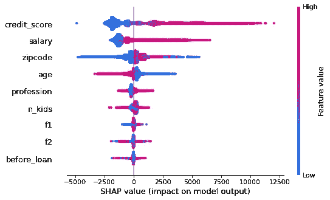

作者图片

1.  *本地可解释性* —您的模型拒绝了几天前提交给银行的一份申请。客户声称他遵循了所有的指导方针，并且肯定能从您的银行获得贷款。现在，你有法律义务解释为什么你的模型拒绝了那个特定的候选人。使用 Shapley 值，可以独立分析每个案例，而不用担心它与数据中其他样本的联系。换句话说，你有本地可解释性。您提取投诉客户的 Shapley 值，并向他们展示应用程序的哪些部分导致了拒绝。你用这样的情节证明他们错了:

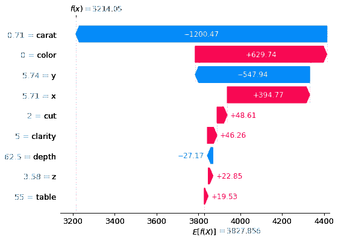

作者图片

那么，如何计算强大的 Shapley 值呢？这就是我们开始使用 SHAP 软件包的地方。

# 如何用 SHAP 计算沙普利值？

计算 Shapley 值的精确数学细节值得单独写一篇文章。因此，现在，我将站在巨人的肩膀上，向你推荐他们的帖子。它们保证巩固你对这些概念的理解( [1](/shap-explained-the-way-i-wish-someone-explained-it-to-me-ab81cc69ef30) 、[2](/explain-your-model-with-the-shap-values-bc36aac4de3d)——作者[苦仁陈](https://medium.com/u/84a02493194a?source=post_page-----7538d11fae94--------------------------------))。

然而，在实践中，你很少会提到 Shapley 值背后的数学。原因是所有神奇的细节都很好地包装在 SHAP 内部。让我们看看第一个例子。

使用 Seaborn 中内置的钻石数据集，我们将使用几种物理测量来预测钻石价格。我预先处理了数据集，并将其分为训练集和验证集。以下是训练集:

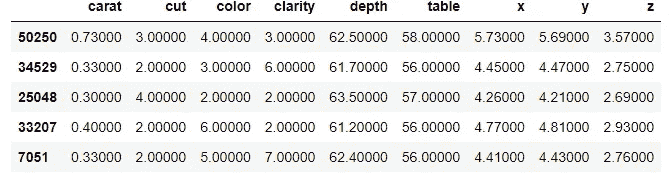

作者图片

```
>>> X_train.shape, X_valid.shape((45849, 9), (8091, 9))
```

切割、颜色和清晰度是分类特征。它们按顺序编码，因为它们的顺序对上下文和最终的模型决策有意义。

作为基线，我们拟合了 XGBRegressor 模型，并使用均方根误差评估了性能:

现在，让我们最后看一眼幕后，并计算训练集的 Shapley 值。

我们首先为我们的模型创建一个解释器对象:

`TreeExplainer`是 SHAP 的一个特殊类，优化后可用于 Sklearn、XGBoost、LightGBM、CatBoost 等中任何基于树的模型。您可以将`KernelExplainer`用于任何其他类型的模型，尽管它比树解释器慢。

这个树解释器有很多方法，其中一个是`shap_values`:

正如我说过的，计算 Shapley 值是一个复杂的过程，这就是为什么在 CPU 上仅 45k 次观测就花费了大约 22 分钟。对于具有数百个要素和数百万个样本的大型现代数据集，计算可能需要数天时间。因此，我们转向 GPU 来计算 SHAP 值。

到目前为止，GPU 支持在 SHAP 还不稳定，但是我们有一个解决办法。核心 XGBoost 模型的`predict`方法有`pred_contribs`参数，当设置为 True 时，计算 GPU 上的 SHAP 值:

> 注意，LightGBM 在其`*predict*`方法中也有对 SHAP 值的 GPU 支持。在 CatBoost 中，通过在`*type*`设置为`*ShapValues*`的模型上调用`*get_feature_importances*`方法来实现。

在提取 XGBoost 的核心助推器模型后，计算 45k 个样本的 Shapley 值只需要大约一秒钟:

```
>>> shap_values_xgb.shape(45849, 10)
```

但是等等——来自树解释器的 Shap 值有九列；这个有 10 个！不用担心；我们现在可以放心地忽略最后一列，因为它只包含 XGBoost 默认添加的偏差项:

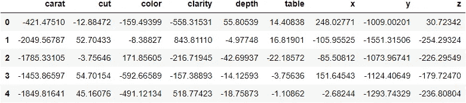

作者图片

我们得到了 Shapley 值。现在怎么办？现在，我们开始策划。

# SHAP 的全球特征重要性

让我们看看在决定价格时，钻石的哪些物理尺寸最重要:

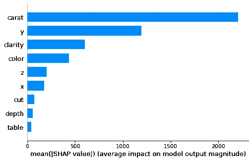

作者图片

克拉是钻石价格的主要驱动因素。阅读下面的轴标题，我们看到重要性只是一个特征的平均绝对 Shapley 值。我们可以查看以下内容:

但是这与从 XGBoost 中得到的特性重要性图没有太大的不同:

```
>>> xgb.plot_importance(booster_xgb);
```

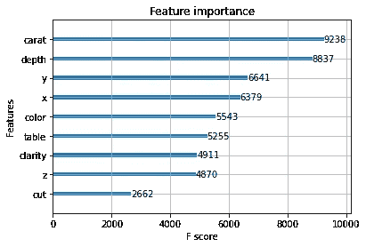

作者图片

这就是我们错的地方。您不能相信 XGBoost 中的特性重要性，因为它们在不同的计算中是不一致的。观察要素重要性如何随计算类型而变化:

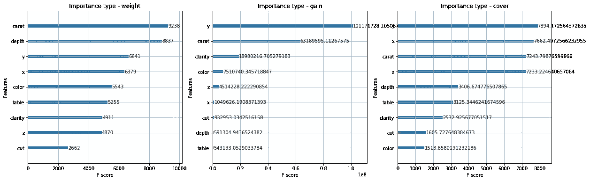

作者图片

相比之下，从 Shapley 值获得的特征重要性是一致的和可信的。

我们不会就此止步。在上面的图中，我们只看了重要性的绝对值。我们不知道哪个特性会对模型产生积极或消极的影响。让我们以 SHAP 为例:

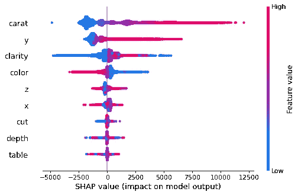

作者图片

下面是如何解读上述情节:

1.  左侧纵轴表示功能名称，根据重要性从上到下排序。
2.  横轴表示预测的 SHAP 值的大小。
3.  垂直右轴表示要素在数据集中出现时的实际大小，并对点进行着色。

我们看到，随着克拉的增加，它对模型的影响越来越积极。对于`y`特性也是如此。`x`和`z`的特征有点复杂，中心周围有一簇混合的点。

[](https://ibexorigin.medium.com/membership)  

# 用依赖图探索每个特性

通过依赖图，我们可以更深入地了解每个特性对整个数据集的影响。我们来看一个例子，稍后再解释:

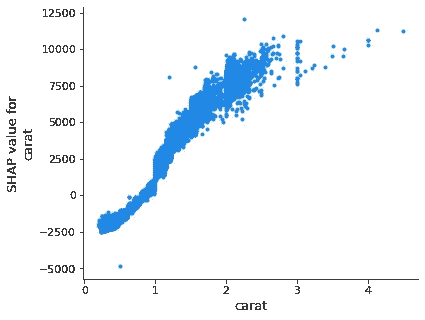

作者图片

该图与我们之前在摘要图中看到的一致。随着克拉的增加，其 SHAP 值增加。通过将`interaction_index`参数更改为`auto`，我们可以用与克拉交互作用最强的特征为点着色:

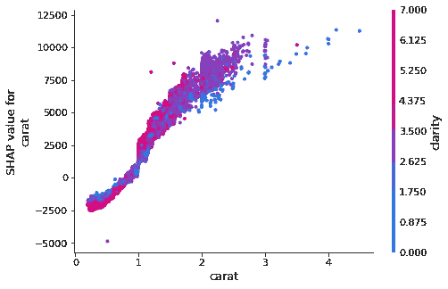

作者图片

似乎克拉与钻石净度的相互作用比其他特征更强。

现在，让我们为分类特征创建一个相关性图:

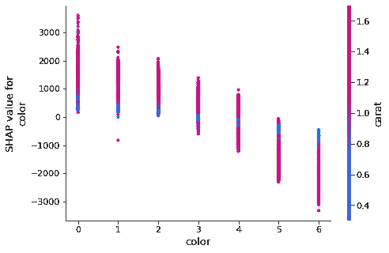

作者图片

这一情节也与摘要情节密切相关。最新的颜色类别在与 carat 互动时会对价格产生负面影响。

我将让您探索以下其他特性的依赖关系图:

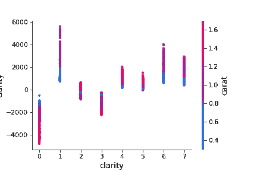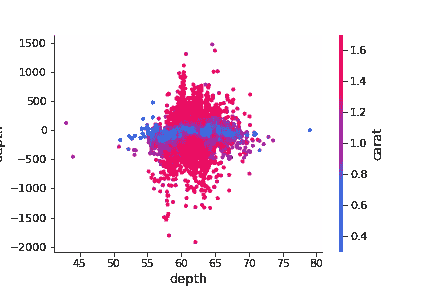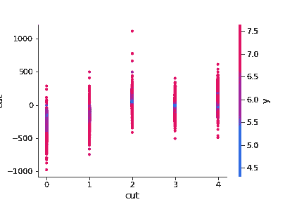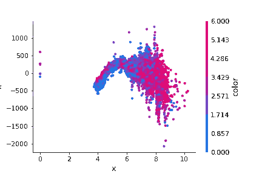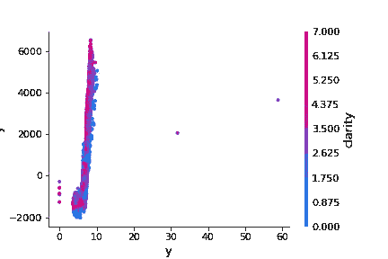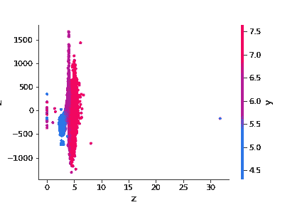

作者提供的图片

# 具有 Shapley 值的特征交互

SHAP 值和沙普利值最奇妙的属性之一是它们能够准确地找到特征之间的关系。在上一节中，当 SHAP 在依赖图中发现最强健的交互特征时，我们已经尝到了这种滋味。

我们可以更进一步，找到按交互强度排序的所有特征交互。为此，我们需要一套不同的价值观——SHAP 互动价值观。

可以使用树解释器对象的`shap_interaction_values`来计算它们，如下所示:

但是这比常规的 SHAP 值更耗时。因此，我们将使用 XGBoost 再次转向 GPU:

通过设置`pred_interactions`为真，我们只需要 15 秒就可以得到 SHAP 交互值。这是一个 3D 数组，最后一列轴是偏差项:

现在我们有了互动。我们该怎么办？坦率地说，即使 SHAP 的文档也没有为交互勾勒出一个合理的用例，但是我们从其他人那里得到了帮助。具体来说，我们将使用我从 [4x Kaggle 特级大师 Bojan Tunguz](https://www.kaggle.com/tunguz) 那里学到的一个函数，在我们的数据集中找到最重要的特征交互，并绘制它们:

现在，`top_10_inter_feats`包含所有可能的特征对之间的 10 个最强的相互作用:

我们可以创建另一个函数，根据它们的相互作用强度绘制这些对:

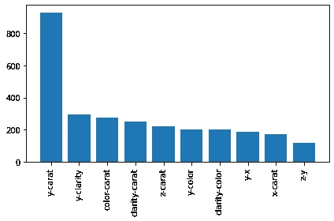

作者图片

正如我们所见，`y`和`carat`之间的相互作用比其他人强得多。即使这个图对我们来说没有任何意义，领域专家也有可能破译这种关系，并使用它来更好地诊断模型。

例如，如果您的模型试图对分子对不同化学刺激的反应进行分类，这样的图会很有帮助，因为它可能会显示分子的哪些化学属性与刺激相互作用。这将告诉运行实验的领域专家很多东西，因为他们知道什么类型的化学物质相互作用，以及该模型是否可以捕捉它们的行为。

# 局部可解释性

最后，我们到达局部可解释性部分。它是关于解释为什么模型对一个样本做出了一个特定的决定。

让我们随机选择一颗钻石及其预测价格来解释:

好的，看起来我们将会看到训练数据中的第 6559 个菱形。让我们开始:

我们首先使用 explainer 对象重新计算 SHAP 值。这不同于`shap_values`函数，因为这一次，Shapley 值返回了我们局部可解释性所需的更多属性:

```
>>> type(shap_explainer_values)shap._explanation.Explanation
```

现在，让我们解释一下我们用瀑布图挑选的随机钻石:

```
>>> shap.waterfall_plot(shap_explainer_values[6559])
```


作者图片

`E[f(x)] = 3287.856`是列车组钻石价格的平均预测，例如`preds.mean()`。`f(x) = 3214.05`是钻石的预测价格。

中间的细线表示平均预测值。纵轴显示第 6559 颗钻石的特征值。条形表示每个要素属性如何使价格偏离平均预测值。红色条代表积极的转变；蓝条代表负向移动。

为了完整起见，让我们看另一个钻石:

```
>>> shap.waterfall_plot(shap_explainer_values[4652])
```

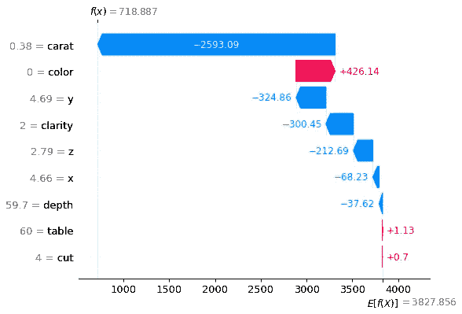

作者图片

这颗钻石比上一颗便宜很多，主要是因为它的克拉低很多，从上面可以看出来。

还有一个情节可以解释局部的可解释性。SHAP 称之为武力阴谋，它看起来是这样的:

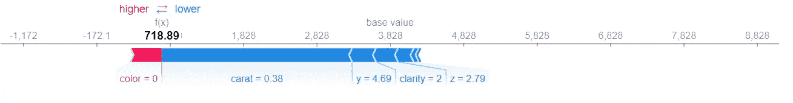

作者图片

这只是一个有序的，有组织的瀑布图。所有正负棒线都被分组到预测价格的两侧。同样，基值显示的是平均价格，条形显示的是每个要素属性移动该值的程度。

```
>>> shap.force_plot(shap_explainer_values[6559])
```

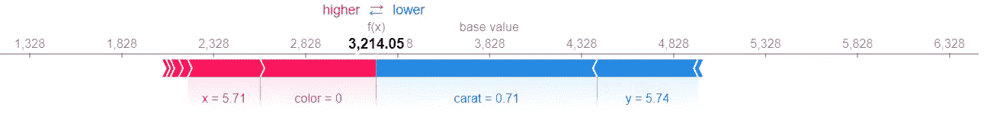

作者图片

# 摘要

现在，你可以走到你的老板面前说:“这是我最好的模型，这是为什么它是最好的以及它是如何工作的解释！”希望你得到的回应会积极得多。感谢您的阅读！

[](https://ibexorigin.medium.com/membership)  [](https://ibexorigin.medium.com/subscribe)  

# 您可能也会对…感兴趣

[](/3-step-feature-selection-guide-in-sklearn-to-superchage-your-models-e994aa50c6d2)  [](/how-to-use-umap-for-much-faster-and-effective-outlier-detection-e4608f336915)  [](/comprehensive-guide-to-deploying-any-ml-model-as-apis-with-python-and-aws-lambda-b441d257f1ec) [## 使用 Python 和 AWS Lambda 将任何 ML 模型部署为 API 的综合指南

towardsdatascience.com](/comprehensive-guide-to-deploying-any-ml-model-as-apis-with-python-and-aws-lambda-b441d257f1ec) [](/25-advanced-pandas-functions-people-are-using-without-telling-you-b65fa442f0f4) 