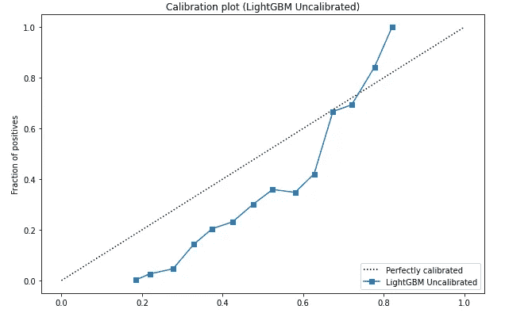

# 模型校准综合指南:什么，何时，如何

> 原文：<https://towardsdatascience.com/a-comprehensive-guide-on-model-calibration-part-1-of-4-73466eb5e09a>

## *第 1 部分:了解如何校准机器学习模型，以获得合理且可解释的概率作为输出*

由[阿迪·戈尔茨坦](https://unsplash.com/@adigold1?utm_source=medium&utm_medium=referral)在 [Unsplash](https://unsplash.com?utm_source=medium&utm_medium=referral) 上拍摄的照片

尽管今天人们可以找到太多的博客谈论奇特的机器学习和深度学习模型，但我找不到多少关于模型校准及其重要性的资源。我发现更令人惊讶的是，模型校准对于某些用例来说可能是至关重要的，但却没有得到足够的重视。因此，我将写一个 4 部分的系列来深入研究校准模型。一旦你完成了这个系列，你将会学到一些东西。

## 学习成果

*   **什么是模型校准，为什么它很重要**
*   **何时校准模型，何时不校准模型**
*   **如何评估模型是否校准(可靠性曲线)**
*   **校准机器学习模型的不同技术**
*   低数据设置中的模型校准
*   校准多类分类器
*   在 PyTorch 中校准现代深度学习网络
*   校准回归变量

在今天的博客中，我们将关注前四个重点。

# 什么是模型校准？

让我们考虑一个二元分类任务和一个在这个任务上训练的模型。没有任何校准，模型的输出不能被解释为真实的概率。例如，对于猫/狗分类器，如果模型输出对于作为狗的例子的预测值是 0.4，则该值不能被解释为概率。为了用概率来解释这种模型的输出，我们需要校准模型。

令人惊讶的是，大多数开箱即用的模型都没有经过校准，它们的预测值往往过于自信或过于自信。这意味着，在很多情况下，他们预测的值接近 0 和 1，而他们不应该这样做。

## 解释未校准和校准模型的输出

为了更好地理解为什么我们需要模型校准，让我们看看前面的输出值为 0.4 的例子。**理想情况下，我们希望该值代表的是这样一个事实，即如果我们拍摄 10 张这样的照片，并且模型以大约 0.4 的概率将它们分类为狗，那么在现实中，这 10 张照片中的 4 张实际上是狗的照片。这正是我们应该如何解释来自 ***校准*** 模型的输出。**

然而，如果模型没有被校准，那么我们不应该期望这个分数将意味着 10 张图片中的 4 张将实际上是狗图片。

# 何时不校准模型

我们校准模型的全部原因是，我们希望输出在解释为独立概率时有意义。然而，对于某些情况，例如根据质量对新闻文章标题进行排序的模型，如果我们的策略是选择最佳标题，我们只需要知道哪个标题得分最高。在这种情况下，校准模型没有多大意义。

# 何时校准模型以及为什么校准至关重要

假设我们想要对火警是否正确触发进行分类。(我们今天将通过代码来讨论这一点。)这样的任务是至关重要的，因为我们希望彻底了解我们的模型的预测，并改进模型，使其对真实的火灾敏感。假设我们对两个例子进行测试，将火灾的可能性分为 0.3 和 0.9。**对于一个未校准的模型，这并不意味着第二个例子可能导致实际火灾的次数是第一个例子的三倍。**

此外，在部署该模型并收到一些反馈后，我们现在考虑改进我们的烟雾探测器和传感器。使用我们的新模型运行一些模拟，我们看到以前的示例现在得分为 0.35 和 0.7。

比方说，改进我们的系统需要 20 万美元。我们想知道我们是否应该为每个示例分别 0.05 和 0.2 的得分变化投资这笔钱。**对于一个未校准的模型，比较这些数字没有任何意义，因此我们无法正确估计一项投资是否会带来实实在在的收益。但是如果我们的模型被校准，我们可以通过专家指导的基于概率的调查来解决这个难题。**

***通常，模型校准对于生产中的模型至关重要，这些模型通过不断的学习和反馈得到改进。***

# 评估模型校准

现在我们知道了为什么我们应该校准我们的模型(如果需要的话),让我们看看如何识别我们的模型是否被校准。

那些想直接跳到代码的人可以在这里访问它。

## 数据集

今天，我们将看看来自 [Kaggle](https://www.kaggle.com/datasets/rjmanoj/telecom-customer-churn-prediction) 的电信客户流失预测数据集。你可以阅读更多关于协变量和烟雾探测器类型的信息，查看 Kaggle 数据集的描述页面。**我们将尝试在此数据上校准 LightGBM 模型，因为 XGBoost 通常是未校准的。**

**数据集官方来自 IBM，可以在这里** **免费下载** [**。它是在 Apache License 2.0 下授权的，如这里的**](https://community.ibm.com/accelerators/catalog/content/Telco-customer-churn) **中的** [**。**](https://github.com/IBM/telco-customer-churn-on-icp4d/blob/master/LICENSE)

## 可靠性曲线

可靠性曲线是一种很好的可视化方法，可以用来识别我们的模型是否经过校准。首先，我们创建从 0 到 1 的容器。然后，我们根据预测的输出划分数据，并将它们放入这些箱中。例如，如果我们以 0.1 的间隔收集数据，我们将有 10 个介于 0 和 1 之间的箱。假设我们在第一箱中有 5 个数据点，即我们有 5 个点 **(0.05，0.05，0.02，0.01，0.02)** ，其模型预测范围位于 0 和 0.1 之间。现在，我们在 X 轴上绘制了这些预测的平均值，即 **0.03，在 Y 轴上绘制了经验概率，即基本事实等于 1 的数据点的分数。说出来我们的 5 分，1 分有地面真值 1。在这种情况下，我们的 y 值将是 1/5 = 0.2。因此，我们的第一个点的坐标是[0.03，0.2]。**我们对所有的箱都这样做，并将这些点连接起来形成一条线。然后我们将这条线与这条线进行比较

**y = x** 并评估校准。**当圆点在这条线以上时，模型低估了真实概率，如果圆点在这条线以下，模型高估了真实概率。**

我们可以使用 Sklearn 构建这个图，它看起来像下面的图。

Sklearn 的校准曲线(图片由作者提供)

如你所见，该模型在 0.6 之前过于自信，然后在 0.8 左右低估

然而，Sklearn 的情节有一些缺陷，因此**我更喜欢使用布莱恩·卢切纳博士的 ML-insights** [**包**](https://ml-insights.readthedocs.io/en/latest/#) 中的情节。

该软件包显示了数据点周围的置信区间，还显示了每个区间(每个 bin 中)有多少数据点，因此您可以相应地创建自定义 bin 区间。正如我们还将看到的，有时模型过于自信，预测值非常接近 0 或 1，在这种情况下，软件包有一个方便的 logit-scaling 功能来显示在非常接近 0 或 1 的概率周围发生的事情。

这是与上面使用 Ml-insights 创建的图相同的图。

Ml-insight 的可靠性曲线(图片由作者提供)

如您所见，我们还可以看到每个条柱中数据点的直方图分布以及置信区间。

## 定量评估模型校准

根据我在阅读该领域的一些文献时收集的信息，捕捉模型校准误差没有完美的方法。文献中经常使用预期校准误差等指标，但我发现(正如你在我的笔记本和代码中看到的)，ECE 会随着你选择的频段数量而大幅变化，因此并不总是可靠的。我将在以后更高级的校准博客中更详细地讨论这一指标。**你可以在这个博客** [***这里***](https://medium.com/@wolframalphav1.0/evaluate-the-performance-of-a-model-in-high-risk-applications-using-expected-calibration-error-and-dbc392c68318) **阅读更多关于 ECE 的内容。我强烈建议你通过它。**

我在这里使用的一个基于卢切纳博士博客的指标是传统的对数损失。这里简单的直觉是，对数损失(或交叉熵)惩罚了在做出错误预测或做出与其真实概率显著不同的预测时过于自信的模型。你可以在这本 [n](https://github.com/numeristical/resources/blob/master/CalibrationWorkshop/Calibration_Workshop_1.ipynb) 笔记本中了解更多关于定量模型校准的信息。

****

# 校准模型的方法

## 拆分数据

在我们进行任何校准之前，重要的是理解我们不能校准我们的模型，然后在相同的数据集上测试校准。因此，为了避免数据泄露，我们首先将数据分成三组——训练、验证和测试。

## 未校准性能

首先，这是我们的未校准 LightGBM 模型在我们的数据上的表现。

## 普拉特标度

普拉特标度假设模型预测和真实概率之间存在逻辑关系。

**剧透——这在很多情况下并不成立。**

我们简单地使用逻辑回归来拟合验证集的模型预测，并将验证集的真实概率作为输出。

下面是它的表现。

如我们所见，我们的原木损失在这里明显减少了。由于我们有许多模型预测接近 0 的数据点，我们可以在这里看到使用 Ml-insights 包(及其 logit 缩放功能)的好处。

## 保序回归

这种方法结合了贝叶斯分类器和决策树来校准模型，当我们有足够的数据来拟合时，它比 Platt scaling 更好。详细算法可以在这里找到[。](https://cseweb.ucsd.edu/~elkan/calibrated.pdf)

我使用 ml-insights 包来实现保序回归。

对于我们的数据，这似乎比普拉特缩放更有效。**尽管在对不同数据分割和随机种子的实验结果进行平均或使用交叉验证(我们将在未来的博客中看到)后得出这样的结论会更明智。**

## 样条校准

这个算法是由 Ml-insights 软件包的作者(布莱恩·卢切纳)给出的，可以在这篇[论文](https://arxiv.org/pdf/1809.07751.pdf)中找到。

本质上，该算法使用平滑的三次多项式(选择该多项式是为了最小化某个损失，如本文中为那些对技术细节感兴趣的人所详述的那样),并且适合验证集及其真实概率上的模型预测。

样条线校准在我们的数据中表现最好(至少对于这种分割来说)。

这是他们在一个情节中的表现

# 预期校准误差及其缺陷

许多当代文献都提到 ECE 是衡量模型校准程度的一个指标。

以下是 ECE 的正式计算方法。

1.  像我们之前做的那样选择 n 个箱
2.  对于每个条柱，计算属于该条柱的数据点的模型预测的平均值，并根据该条柱中的数据点数对其进行归一化。
3.  对于每个箱，还要计算真阳性的比例。
4.  现在，对于每个箱，计算步骤 3 和步骤 4 中计算的值之间的绝对差，并将该绝对差乘以该箱中的数据点数。
5.  将步骤 4 中计算的所有箱的结果相加，并通过所有箱中的样本总数对该相加和进行归一化。

计算 ECE 的代码可以在这个[博客](https://medium.com/@wolframalphav1.0/evaluate-the-performance-of-a-model-in-high-risk-applications-using-expected-calibration-error-and-dbc392c68318)中找到，并且已经在我的实验中使用。

然而，在我的案例中，数据点在所有箱中的分布并不均匀(因为大多数数据点属于第一个箱)，因此必须相应地为 ECE 选择箱。我们可以看到仓的数量如何直接影响算法中的 ECE。

例如，仅对于 5 个箱，未校准的模型似乎比所有其他方法具有更小的校准误差。

然而，当我们增加仓的数量时，我们可以看到模型校准实际上对我们的情况有所帮助。

在下面的代码片段中，可以验证这种效果。请忽略 OE(过度自信误差度量),因为它在文献中没有广泛使用。

**对于 5 个箱子，我们有**

**对于 50 个箱子，我们有**

**对于 500 个箱子，我们有**

**对于 5000 个箱子，我们有**

# 结论

在今天的博客中，我们看到了什么是模型校准，如何评估模型的校准以及这样做的一些指标，探讨了 ml-insights 包以及校准模型的一些方法，最后探讨了 ECE 的谬误。

下一次，我们将研究低数据设置的稳健校准，校准深度学习模型，并最终校准回归变量。

查看我的 [**GitHub**](https://github.com/rajlm10) 的其他一些项目。可以联系我 [***这里***](https://rajsangani.me/) ***。*** 感谢您的宝贵时间！

如果你喜欢这个，这里还有一些！

      

# 承认

我感谢布莱恩·卢切纳博士对与本博客相关的各种话题的帮助和建议。我还发现他在 YouTube 上关于模型校准的播放列表非常详细和有用，我的大部分实验都是基于他的视频。

# 参考

1.  [https://www.youtube.com/playlist?list = plevfk 5 xtwhybw 22d 52 etymvcpxe 4 qfik](https://www.youtube.com/playlist?list=PLeVfk5xTWHYBw22D52etymvcpxey4QFIk)
2.  [https://cseweb.ucsd.edu/~elkan/calibrated.pdf](https://cseweb.ucsd.edu/~elkan/calibrated.pdf)
3.  [https://www . unofficialgogledatascience . com/2021/04/why-model-calibration-matters-and-how . html](https://www.unofficialgoogledatascience.com/2021/04/why-model-calibration-matters-and-how.html)
4.  [https://towards data science . com/classifier-calibration-7d 0 be 1e 05452](/classifier-calibration-7d0be1e05452)
5.  [https://medium . com/@ wolfram alpha 1.0/evaluate-the-performance-of-a-model-in-high-risk-applications-using-expected-calibration-error-and-DBC 392 c 68318](https://medium.com/@wolframalphav1.0/evaluate-the-performance-of-a-model-in-high-risk-applications-using-expected-calibration-error-and-dbc392c68318)
6.  https://arxiv.org/pdf/1809.07751.pdf