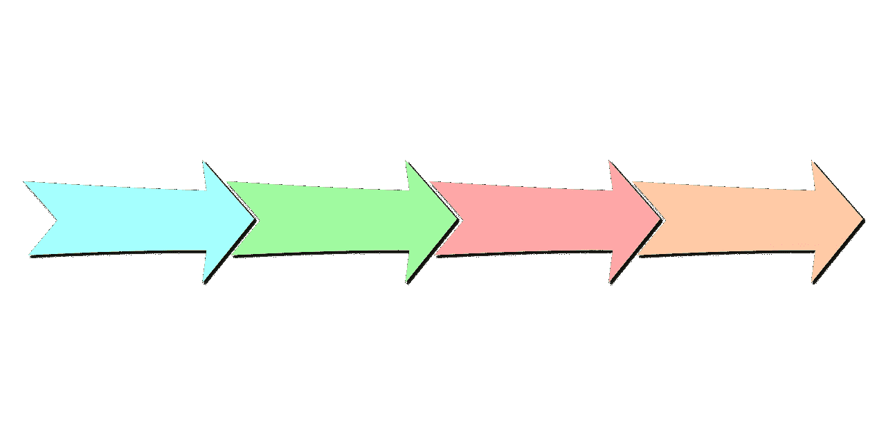
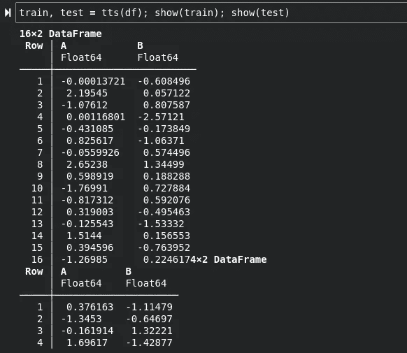
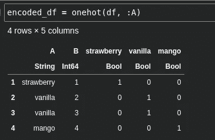

# 通用机器学习预处理技术综合指南

> 原文：<https://towardsdatascience.com/a-comprehensive-guide-to-common-machine-learning-preprocessing-techniques-a7739f0ab2b5>

## 各种不同预处理技术的概述和故事，以及它们在机器学习中的应用



(图片由 [pixabay](https://pixabay.com/) 上的 [padrefilar](https://pixabay.com/users/padrefilar-2305081/) 拍摄)

一个非常普遍的误解是，新的和有抱负的数据科学家在进入该领域时经常会有一个误解，即大多数数据科学都围绕着人工智能、机器学习和其他流行和晦涩的术语。虽然这些术语中有许多肯定是数据科学的不同方面，而且我们确实在编写机器学习模型，但大多数工作通常都是致力于其他任务。与许多其他技术领域相比，数据科学的一个独特之处在于，数据科学是一个工作领域中不同领域和主题的集合。此外，数据科学可以更加多样化，一些数据科学家可能专门从事数据管道方面的工作，而其他人可能专门从事神经网络方面的工作。一些数据科学家甚至过度专注于可视化、仪表板和统计测试——针对商业、医学、生物学和其他领域。

虽然作为数据科学家只做一件事可能并不常见，但有一件事是所有数据科学家都做的；

> 处理数据。

处理数据通常涉及几个关键步骤，包括数据争论、清理、格式化、探索和预处理。当开始处理数据并创建某种数据分析时，通常会争论、清理、格式化和探索这些数据。然而，预处理更有趣，因为预处理方法将我们的数据技术带入了一个全新的方向。而对于其他操作，清理、格式化、探索，我们试图将数据解释为人类，在预处理的情况下，我们已经将数据解释为人类，现在正试图使数据更容易被统计算法解释。也就是说，预处理的数量及其有效性会对机器学习模型的性能产生严重影响。鉴于这一点的重要性，今天我们将介绍最流行的预处理技术，解释它们是如何工作的，然后我们将自己编写一些技术，以便更好地演示它们是如何工作的。

[](https://github.com/emmettgb/Emmetts-DS-NoteBooks/blob/master/Julia/comprehensive%20machine-learning%20techniques.ipynb)  

## 特征类型—简要回顾

为了真正理解不同的预处理技术，我们首先需要对我们实际使用这些技术的数据有一个起码的了解。在数据世界中，有几种主要包括连续、标注和分类要素的要素类型。连续特征被描述为每个观察值都包含数值的特征。也就是说，连续特征几乎总是实数、虚数或复数，当它们不是实数、虚数或复数时，它们是一个数字的表示。另一方面，分类特征可以包含各种类型，包括不同的数字和字符串。标签也可以是任何类型，但通常是`String`或`Date`。

连续特征的一个例子是从冰淇淋车观察每天的冰淇淋销售。如果我们也记录最受欢迎的日常口味的冰淇淋，这将是一个分类特征。最后，日期将被视为该数据的标签。当涉及到使用预处理方法时，理解这些不同类型的特性将会非常重要。这对于理解数据也非常重要，因为有些情况下，要素类型乍一看并不明显。

## 列车测试分离

第一种预处理技术不一定是典型的预处理器。训练测试分割是一种通过创建两个独立样本来测试模型性能的技术。第一个样本是训练集，用于告诉模型您的特征如何与您的目标或您预测的事物相关联。测试集评估模型与特征和目标的关联程度。

训练测试分割相对简单。Python 程序员可能会发现`sklearn.model_selection`中的`train_test_split`是用 Python 做这件事的有用方法。就自己编程而言，过程相对简单。我们正在寻找的输入是一个数据帧，我们正在寻找的输出是两个按一定比例分割的数据帧。

```
using DataFrames
using Random
```

我的函数将通过抓取一个随机子序列，然后根据该随机子序列分离数据帧值来实现这一点。

```
function tts(df::DataFrame; at = .75)
    sample = randsubseq(1:size(df,1), at)
    trainingset = df[sample, :]
    notsample = [i for i in 1:size(df,1) if   isempty(searchsorted(sample, i))]
    testset = df[notsample, :]
    return(trainingset,testset)
end
```

这可以通过简单的理解很容易地实现。现在让我们试试这个函数，看看我们的分割数据:

```
df = DataFrame(:A => randn(20), :B => randn(20))train, test = tts(df); show(train); show(test)
```



作者图片

## 缩放器

我想讨论的下一个预处理技术是定标器。缩放器用于连续要素，将数据形成以某种方式改变数值距离的量。有各种不同的缩放器示例，如统一缩放器和任意重新缩放器，但机器学习中最常用的缩放器类型肯定是标准缩放器。此缩放器使用正态分布来调整要素的数值距离。

在正态分布中，每个值都是与平均值的关系。这种关系是用平均值的标准偏差来衡量的，所以在大多数情况下，数字会变成某种小于 5 的浮点数。抛物线的中心，也就是我们大部分数据所在的地方，被设为 0。具有数值距离的每个值由该值相对于平均值的标准偏差的数量来缩放。这个距离也不是绝对的，但距离的统计显著性是绝对的，因此该值可以是-2 或 2，但-2 和 2 都是统计显著性的。

正态分布对于机器学习的缩放特征非常有用，因为它减少了数值距离，并使用人口中心作为新的参考点。我喜欢把它想象成我们正在创造一个新的零，我们的新零是我们人口的平均值。假设一个标准的定标器只是一个正态分布，那么创建一个定标器的公式非常简单，而且完全相同。首先，我们需要均值和标准差。对于 x 内的每个样本，我们要减去平均值，然后用标准差除差值。

```
function standardscale(x::Vector{<:Real})
    N::Int64 = length(x)
    σ::Number = std(x)
    μ::Number = mean(x)
    Vector{Real}([i = (i-μ) / σ for i in x])
end
```

结果与我前面讨论的非常相似，在这个例子中，大多数值都小于 2。所有这些值都低于 2 的原因是因为数据分布非常均匀，因为它只是计数:

```
x = [1, 2, 3, 4, 5, 6, 7, 8, 9, 10]
standardscale(x)
10-element Vector{Real}:
 -1.9188064472004938
 -1.4924050144892729
 -1.066003581778052
 -0.6396021490668312
 -0.21320071635561041
  0.21320071635561041
  0.6396021490668312
  1.066003581778052
  1.4924050144892729
  1.9188064472004938
```

进一步展示这个分布，如果我们的第一个数字与人口的平均值相比是完全荒谬的，我们会看到这个值会惊人地增长。这也将成为一个离群值，这将使我们的其余数据偏离均值。这是因为每当增加一个较大的数字时，平均值从零开始增加:

```
10-element Vector{Real}:
 17.290069740400327
 -3.0348109528238902
 -2.756387929629038
 -2.4779649064341855
 -2.199541883239333
 -1.9211188600444808
 -1.6426958368496287
 -1.3642728136547764
 -1.085849790459924
 -0.8074267672650718
```

## 编码器

接下来，我们将讨论编码器。编码器用于将计算机无法量化的数据转换成计算机可以量化的数据。编码通常用于分类特征，但是您也可以对标签进行编码以便由计算机进行解释，这对于日期字符串之类的东西非常有用。可能机器学习中使用的最流行的编码器形式是一键编码器。该编码器将分类观察值转换为二进制特征。考虑以下特性:

```
greeting = ["hello", "hello", "hi"]
age = [34, 17, 21]
```

这两个特征的分类是`greeting`特征。一个热编码将为每个类别创建一个新的二进制特征。在这种情况下，有两个类别，`"hello"`和`"hi"`，因此该特征的一个热编码版本将是以下两个特征:

```
hello = [1, 1, 0]
hi = [0, 0, 1]
```

我们正在做的是检查每个值是否属于该类别，并根据该信息构造一个 BitArray。为此构建一个函数，就像典型的过滤或屏蔽一样简单。我们只需要为特性集中的每个值创建一组 BitArrays:

```
function onehot(df::DataFrame, symb::Symbol)
    dfcopy = copy(df)
    [dfcopy[!, Symbol(c)] = dfcopy[!,symb] .== c for c in unique(dfcopy[!,symb])]
    dfcopy
end
```

我在 Julia 中通过传播==操作符来快速创建一个`Vector`来实现这一点。

```
df = DataFrame(:A => ["strawberry", "vanilla", "vanilla", "mango"], 
               :B => [1, 2, 3, 4])
encoded_df = onehot(df, :A)show(encoded_df)
```



作者图片

稍微容易理解的是顺序编码器。该编码器使用集合的`order`,以数字方式将每个值作为一个类别。一般来说，顺序编码器是我在分类应用中的第一选择，在这些应用中，需要考虑的类别较少。这种类型的编码通常是这样完成的:为特性集中的每个类别创建一个元素索引引用，然后每当我们遇到那个值时就通过键调用那个引用，检索索引来替换它。

```
function ordinal(df::DataFrame, symb::Symbol)
    lookup = Dict(v => i for (i,v) in df[!, symb] |> unique |> enumerate)
    map(x->lookup[x], df[!, symb])
endordinal(df, :A)4-element Vector{Int64}:
 1
 2
 2
 3
```

另一个非常容易理解的编码器是浮点编码器。有时也被称为标签编码器，这个编码器将一个`String`的每个`Char`变成一个`Float`。这样做的过程非常简单，在大多数情况下会留下一种类似于序数编码的编码，但是数字不是索引，而是随机的数字组合。不用说，这对于检查标签更有用，因为在要读取的字符之间可能存在微小的可检测的差异。

```
function float_encode(df::DataFrame, symb::Symbol)
    floatencoded = Vector{Float64}()
    for observation in df[!, symb]
        s = ""
        [s = s * string(float(c)) for c in observation]
        s = replace(s, "." => "")
        push!(floatencoded, parse(Float64, s))
    end
    floatencoded
end
```

关于编码器的更多信息，以及解决这些问题的更传统的面向对象方法，您可以在我写的另一篇文章中读到更多关于编码器的信息:

[](/encoders-how-to-write-them-how-to-use-them-d8dd70f45e39)  

## 估算者

估算器是一种简单且自动化的方法，可以消除数据中的缺失值。估算者通常用分类问题中的多数类或连续问题中的平均值替换这些缺失值。估算者所做的是获取有问题的值，并将它们转换成某种统计显著性较低的值，这通常是数据的中心。我们可以构建一个简单的均值估算器来替换缺失的连续值，如果缺失，只需用均值替换该值即可。唯一的问题是，每当我们试图得到一个既有缺失值又有缺失数的向量的平均值时，我们都会得到一个错误，因为我们不能得到一个缺失值和一个整数的和。因此，我们需要创建一个奇怪的函数，它给出平均值，但如果数字丢失，则跳过该函数:

```
missing_mean(x::Vector) = begin
    summation = 0
    len = 0
    for number in x
        if ismissing(number)
            continue
        end
        summation += number
        len += 1
    end
    summation / len
end
```

然后，我们将通过使用此函数计算平均值来创建估算值，然后用该平均值替换每个缺失值。

```
function impute_mean(x::AbstractVector)
    μ::Number = missing_mean(x)
    [if ismissing(v) μ else v end for v in x]
endx = [5, 10, missing, 20, missing, 82, missing, missing, 40] impute_mean(x)9-element Vector{Real}:
  5
 10
 31.4
 20
 31.4
 82
 31.4
 31.4
 40
```

## 分解

数据处理领域的下一个主要概念是分解。分解允许人们获取具有多个维度的特征，并将这些维度压缩成单个一致的值。这是很有用的，因为它可以用于为模型提供较少的单个特征，同时仍然让这些特征产生统计效果。这对于性能来说也是非常有价值的，并且在机器学习中非常普遍。最流行的分解技术是奇异值分解。还有一种非常酷的技术叫做随机投影。我在这里不打算详细介绍这两种技术，但是我已经写了一些关于这两种技术的文章，可以从中获得更多信息:

[](/deep-in-singular-value-decomposition-98cfd9532241) [## 深入奇异值分解

towardsdatascience.com](/deep-in-singular-value-decomposition-98cfd9532241) [](/random-projection-and-its-role-in-data-science-f253dd66485b)  

## 结论

预处理是数据科学过程中不可或缺的一部分，对于正确处理非常重要。理解不同的预处理技术和它们的应用可以给给定模型的准确性带来真正的性能提升。大多数预处理技术相对简单，但是，它们对于创建更精确的模型仍然非常有效。下次你建模时，如果你想用最少的努力显著提高你的准确性，这些预处理技术真的可以帮上忙！感谢您的阅读！