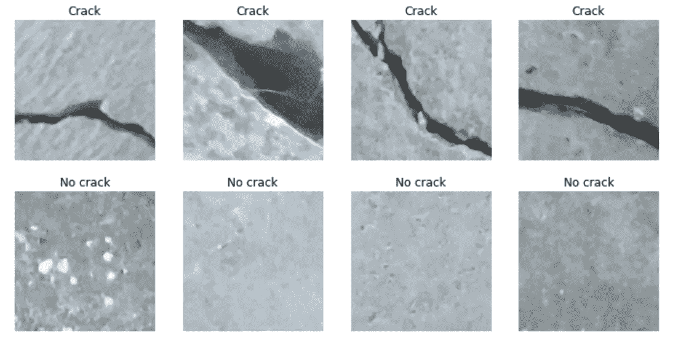
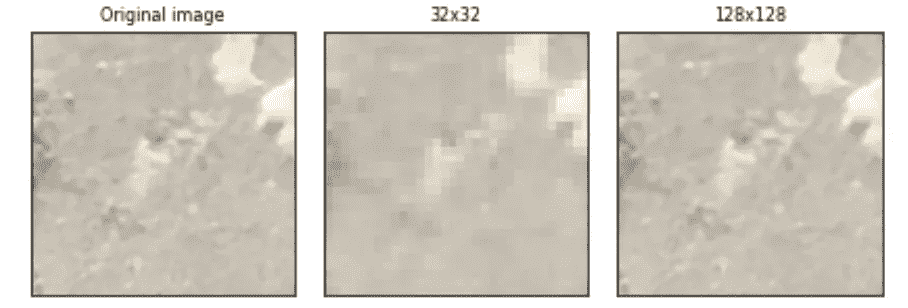
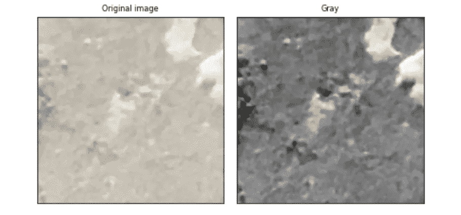
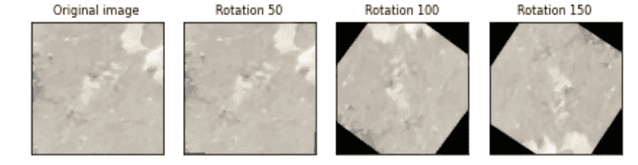
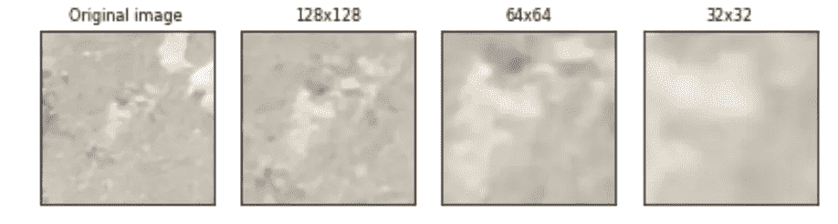
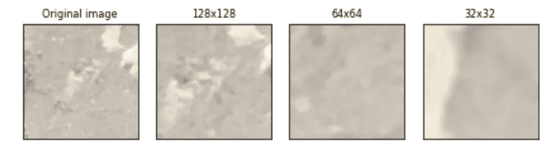
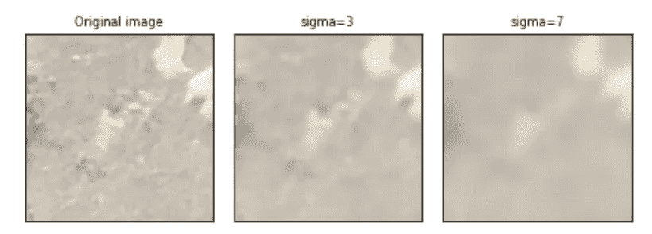
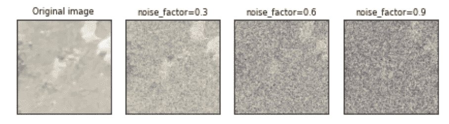
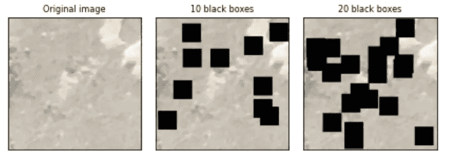
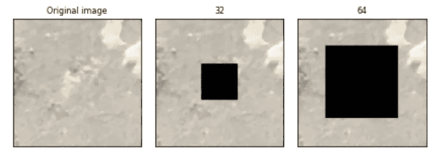

# 使用 Pytorch 进行图像增强的综合指南

> 原文：<https://towardsdatascience.com/a-comprehensive-guide-to-image-augmentation-using-pytorch-fb162f2444be>

## 一种增加数据量并使模型更加稳健的方法


照片由[丹金](https://unsplash.com/@danielcgold)在 [Unsplash](https://unsplash.com/photos/mgaS4FlsYxQ) 上拍摄

最近，在从事我的研究项目时，我开始理解图像增强技术的重要性。这个项目的目的是训练一个健壮的生成模型，能够重建原始图像。

所解决的问题是异常检测，这是一个非常具有挑战性的问题，因为数据量很小，而且模型不足以单独完成所有工作。常见的情况是使用可用于训练的正常图像来训练双网络模型，并在包含正常和异常图像的测试集上评估其性能。

最初的假设是，生成模型应该很好地捕捉正态分布，但同时，它应该不能重构异常样本。怎么可能验证这个假设？我们可以查看重建误差，对于异常图像，该误差应该较高，而对于正常样本，该误差应该较低。

在这篇文章中，我将列出增加数据集中图像大小和多样性的最佳数据扩充技术。主要目标是提高模型的性能和通用性。我们将探索简单的变换，如旋转、裁剪和高斯模糊，以及更复杂的技术，如高斯噪声和随机块。

## 图像分析技术；

## 1.简单的转换

*   调整大小
*   灰度
*   使标准化
*   随机旋转
*   中间作物
*   随机作物
*   高斯模糊

## 2.更先进的技术

*   高斯噪声
*   随机块
*   中部

# 1.表面裂纹数据集简介



表面裂纹数据集。作者插图。

在本教程中，我们将使用表面裂纹检测数据集。你可以在这里或者在 [Kaggle](https://www.kaggle.com/datasets/arunrk7/surface-crack-detection) 上下载数据集[。正如您可以从名称中推断的那样，它提供了有裂缝和没有裂缝的表面的图像。因此，它可以用作异常检测任务的数据集，其中异常类由有裂缝的图像表示，而正常类由没有裂缝的表面表示。它包含 4000 张有缺陷和无缺陷表面的彩色图像。这两个类在训练集和测试集中都可用。此外，每个数据集图像以 227×227 像素的分辨率采集。](https://data.mendeley.com/datasets/5y9wdsg2zt/2)

# 2.简单的转换

本节包括`torchvision.transforms`模块中可用的不同转换。在深入之前，我们从训练数据集中导入模块和一个没有缺陷的图像。

让我们显示图像的尺寸:

```
np.asarray(orig_img).shape  #(227, 227, 3)
```

这意味着我们有一个 227x227 的图像，有 3 个通道。

## 调整大小

由于图像具有非常高的高度和宽度，因此需要在将其传递给神经网络之前降低维度。例如，我们可以将 227x227 图像调整为 32x32 和 128x128 图像。

```
resized_imgs **=** [T**.**Resize(size**=**size)(orig_img) **for** size **in** [32,128]]
plot(resized_imgs,col_title**=**["32x32","128x128"])
```



已调整大小的图像。作者插图

值得注意的是，当我们获得 32x32 的图像时，分辨率会降低，而 128x128 的尺寸似乎可以保持样本的高分辨率。

## 灰度

RGB 图像可能很难管理。因此，将图像转换为灰度是很有用的:

```
gray_img **=** T**.**Grayscale()(orig_img)
plot([gray_img], cmap**=**'gray', col_title**=**["Gray"])
```



原始图像与灰度图像。作者插图

## 使标准化

归一化可以构成加速基于神经网络架构的模型中的计算和更快学习的有效方式。标准化图像有两个步骤:

*   我们从每个输入通道中减去通道平均值
*   后来，我们用它除以信道标准差。

我们可以显示原始图像及其归一化版本:


原始图像与标准化图像。作者插图

## 随机旋转

`T.RandomRotation`方法以随机角度旋转图像。



不同的旋转图像。作者插图

## 中间作物

我们使用`T.CenterCrop`方法裁剪图像的中心部分，这里需要指定裁剪的尺寸。



中间作物。作者插图

当图像的边界中有一个大的背景，而这对于分类任务来说是完全不必要的时，这种变换会很有用。

## 随机作物

我们没有裁剪图像的中心部分，而是通过`T.RandomCrop`方法随机裁剪图像的一部分，该方法将裁剪的输出大小作为参数。



随机作物。作者插图

## 高斯模糊

我们使用高斯核对图像应用高斯模糊变换。这种方法有助于使图像变得不太清晰和明显，然后，将得到的图像输入神经网络，神经网络在学习样本模式时变得更加稳健。



高斯模糊。作者插图

# 3.更先进的技术

前面展示了 PyTorch 提供的简单转换的例子。现在，我们将重点关注从头实现的更复杂的技术。

## 高斯噪声

高斯噪声是向整个数据集添加噪声的一种常见方式，它迫使模型学习数据中包含的最重要的信息。它包括注入高斯噪声矩阵，该矩阵是从高斯分布中抽取的随机值的矩阵。稍后，我们在 0 和 1 之间剪切样本。噪声系数越高，图像的噪声越大。



高斯噪声。作者插图

## 随机块

正方形面片作为蒙版随机应用在图像中。这些小块的数量越多，神经网络就会发现解决这个问题越有挑战性。



随机块。作者插图。

## 中部

这是一个非常简单的技术，可以使模型更加一般化。它包括在图像的中心区域添加一个修补块。



中部地区。作者插图。

# 最终想法:

我希望这篇教程对你有用。目的是综述图像增强方法，以解决基于神经网络的模型的泛化问题。如果你知道其他有效的技术，请随时评论。我将在下一篇文章中解释如何利用自动编码器来开发这些技术。代码在 [Kaggle](https://www.kaggle.com/code/eugeniaanello/image-augmentation-using-pytorch-on-crack-images) 上。感谢阅读。祝您愉快！

## 其他相关文章:

[](https://medium.com/mlearning-ai/albumentations-a-python-library-for-advanced-image-augmentation-strategies-752bff3a3da0)  [](https://medium.com/mlearning-ai/how-to-quickly-build-your-own-dataset-of-images-for-deep-learning-1cf79073f1bd)  

*免责声明:该数据集由恰拉尔·弗拉特·兹内尔根据* [*知识共享署名 4.0 国际*](https://creativecommons.org/licenses/by/4.0/) *(CC BY 4.0)授权。*

你喜欢我的文章吗？ [*成为会员*](https://eugenia-anello.medium.com/membership) *每天无限获取数据科学新帖！这是一种间接的支持我的方式，不会给你带来任何额外的费用。如果您已经是会员，* [*订阅*](https://eugenia-anello.medium.com/subscribe) *每当我发布新的数据科学和 python 指南时，您都会收到电子邮件！*