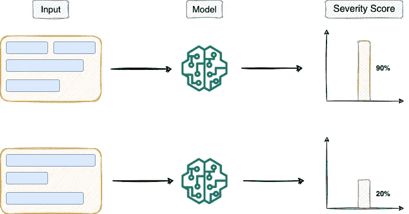
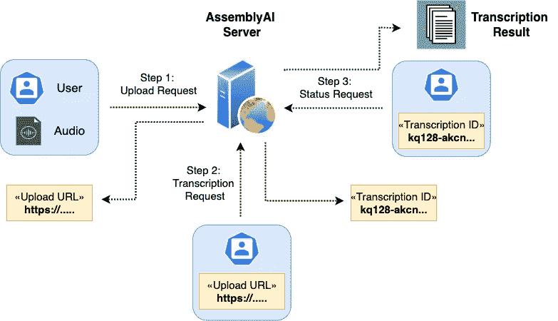

# 调节敏感音频内容的综合指南

> 原文：<https://towardsdatascience.com/a-comprehensive-guide-to-moderating-sensitive-audio-content-d9e1f882fd06>

## 内容调节变得简单


照片由[奥斯曼·埃克斯帕特尔拍摄。](https://unsplash.com/@sabazioccivanza?utm_source=medium&utm_medium=referral)开启[防溅](https://unsplash.com?utm_source=medium&utm_medium=referral)

```
**·** [**Motivation**](#ea23) **·** [**Content Moderation in Audio Files**](#3c09) **·** [**Results**](#6727) **·** [**Conclusion**](#4a15)
```

# 动机

用户生成的内容由在线平台根据与该平台相关的规则和政策进行筛选和监控。

换句话说，当用户向网站提交内容时，它通常会经过一个筛选过程(也称为审核过程)，以确保它符合网站的规则，并且不是不适当的、骚扰性的、非法的等。

当在线或社交媒体上交换文本时，可以使用通常由人工智能驱动的内容审核模型来检测敏感内容。



严重性预测模型的高级概述(图片由作者提供)

除了从音频或视频来源转录信息之外，一些最好的语音到文本 API 还包括内容审核。

与毒品、酒精、暴力、微妙的社会问题、仇恨言论等相关的主题经常是内容审核 API 要解决的敏感内容。

因此，在这篇文章中，我将演示如何使用 AssemblyAI API 来检测音频文件中的敏感内容。

我们开始吧🚀！

# 音频文件中的内容审核

在 AssemblyAI 的帮助下，您可以在给定的音频/视频文件中调节和预测任何严重性、药物滥用、仇恨言论等的提及。

下图描述了 AssemblyAI 的转录工作流程。



使用 AssemblyAI API 的转录工作流(图片由作者提供)

下面是使用 AssemblyAI 对音频文件进行内容审核的分步教程。

转录 API 将执行语音到文本的转换，并检测给定文件中的敏感内容(如果有)。其中包括提及事故、灾难、仇恨言论、赌博等。

## **第一步:获取令牌**

首先，我们需要获得 AssemblyAI 的 [API 令牌](https://app.assemblyai.com/signup)来访问服务。

现在我们已经准备好了 API 令牌，让我们来定义头部。

## 步骤 2:上传文件

接下来，我们将输入音频文件上传到 AssemblyAI 的托管服务，它将返回一个 URL，用于进一步的请求。

## 第三步:转录

一旦我们收到来自 AssemblyAI 的 URL，我们就可以继续转录，这也将检测敏感内容。

这里，我们将把`content_safety`参数指定为`True`。这将调用内容审核模型。

## 步骤 4:获取结果

最后一步需要使用 POST 请求中返回的`id`的 GET 请求。我们将重复发出 GET 请求，直到响应的状态被标记为'`completed`'或'`error`'。

## 步骤 5:存储输出

来自转录服务的响应然后被存储在文本文件中。

# 结果

现在，我们来解读一下内容审核输出。

内容审核的结果可以在从 AssemblyAI 接收的 JSON 响应的`content_safety_labels`键下获得。

外部的`text`字段包含音频文件的文本转录。

此外，如上面的输出所示，内容安全检测的结果将被添加到`content_safety_labels`键。

带`content_safety_labels`键的按键说明如下:

*   `results`:这表示被模型分类为敏感内容的音频转录片段的列表。
*   `results.text`:该字段包含触发内容审核模型的文本转录。
*   `results.labels`:该字段包含与被检测为敏感内容的句子相对应的所有标签。这个列表中的每个 JSON 对象还包含置信度和严重性度量。
*   `summary`:该字段包含整个音频文件中每个标签预测结果的置信度得分。
*   `severity_score_summary`:描述每个结果预测标签对整个音频文件的总影响。

每个投影标签将包括其`confidence`和`severity`值，这两个值是不同的。

`severity`值描述了标记内容在`0–1`范围内的严重程度。另一方面，`confidence`分数揭示了模型在预测输出标签时的置信度。

# **结论**

总之，在本文中，我们讨论了使用 AssemblyAI API 的音频文件的内容审核过程。

API 端点提供了帮助您识别音频和视频文件中的敏感材料的功能。

此外，我演示了如何解释内容审核结果，并识别音频输入中是否检测到任何敏感内容。

**感谢阅读！**

[🚀**订阅数据科学每日剂量。在这里，我分享关于数据科学的优雅技巧和诀窍，一天一个技巧。每天在你的收件箱里收到这些提示。**](https://avichawla.substack.com/)

[🧑‍💻**成为数据科学专家！获取包含 450 多个熊猫、NumPy 和 SQL 问题的免费数据科学掌握工具包。**](https://subscribepage.io/450q)

✉️ [**注册我的电子邮件列表**](https://medium.com/subscribe/@avi_chawla) 永远不要错过关于数据科学指南、技巧和提示、机器学习、SQL、Python 等的另一篇文章。Medium 会将我的下一篇文章直接发送到你的收件箱。