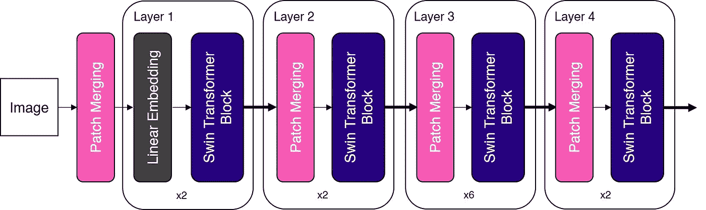
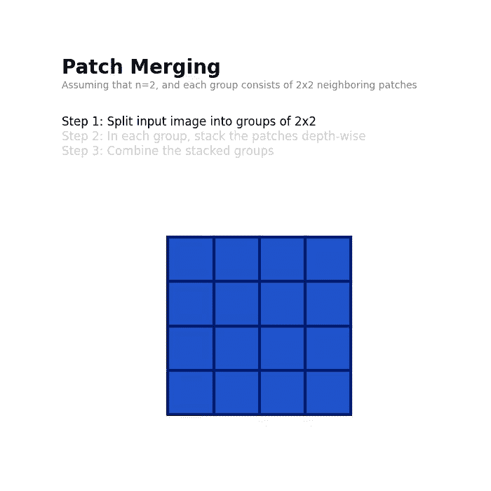
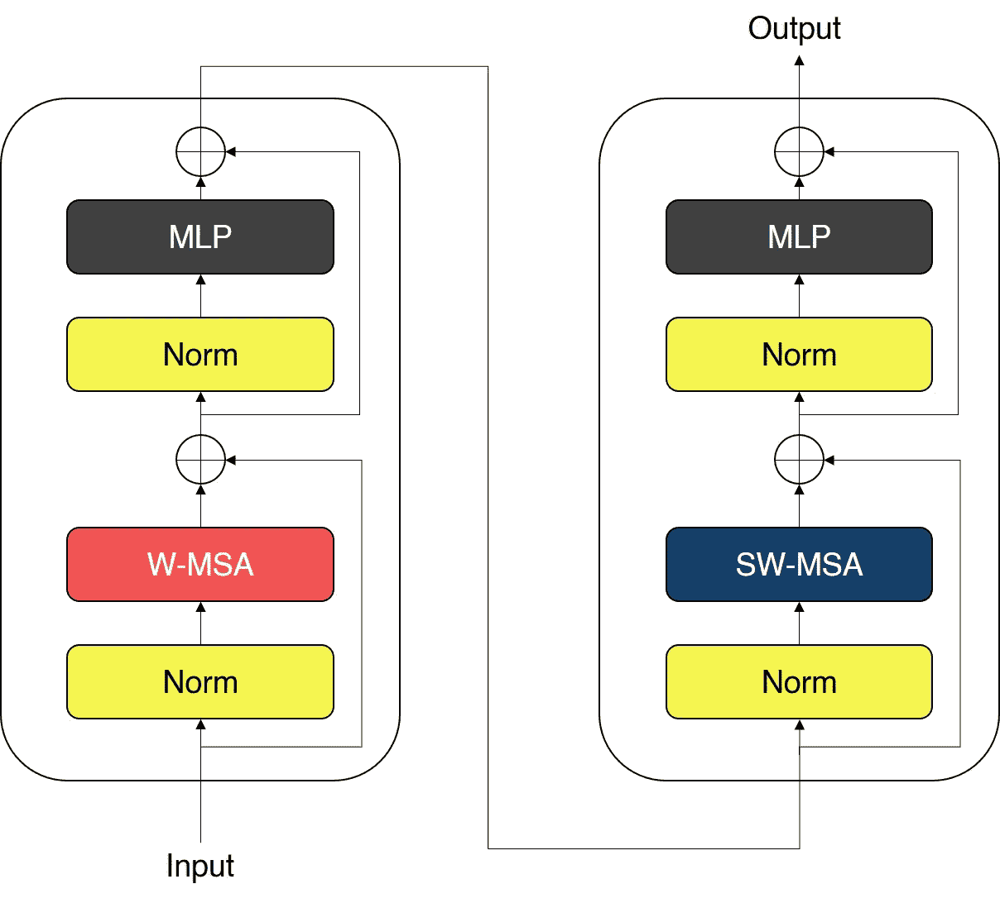
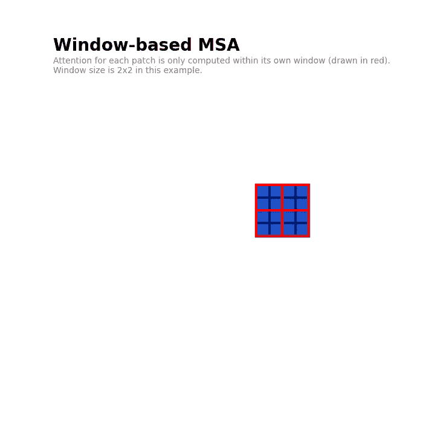
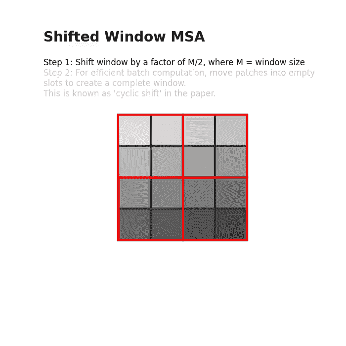
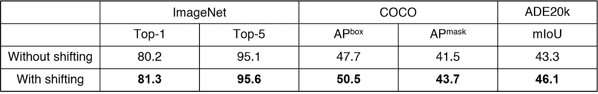

# 微软 Swin Transformer 综合指南

> 原文：<https://towardsdatascience.com/a-comprehensive-guide-to-swin-transformer-64965f89d14c>

## 深入的解释和动画

免费使用来自[像素](https://www.pexels.com/photo/a-woman-using-virtual-goggles-8728379/)的图像。

# 介绍

Swin Transformer(【刘】等，2021 )是一个基于 Transformer 的深度学习模型，在视觉任务中具有最先进的性能。与之前的视觉转换器(ViT) ( [Dosovitskiy 等人，2020](https://arxiv.org/abs/2010.11929) )不同，Swin Transformer 效率高，精度更高。由于这些理想的特性，Swin 变压器被用作当今许多基于视觉的模型架构的主干。

尽管它被广泛采用，但我发现在这个主题中缺乏详细解释的文章。因此，本文旨在使用插图和动画为 Swin 变压器提供全面的指南，以帮助您更好地理解概念。

让我们开始吧！

# Swin 变压器:改进 ViT

近年来，变形金刚 [(Vaswani et al .，2017)](https://arxiv.org/abs/1706.03762) 在自然语言处理(NLP)任务中主导了深度学习架构。《变形金刚》在 NLP 中的巨大成功激发了将《变形金刚》用于视觉任务的研究努力。

2020 年，视觉变压器(ViT)获得了人工智能社区的大量关注，以其在视觉任务中具有良好结果的纯变压器架构而闻名。尽管 vit 很有前途，但仍有几个缺点。最值得注意的是，vit 难以处理高分辨率图像，因为它的计算复杂度是图像大小的二次方。此外，ViTs 中的固定标度标记不适用于视觉元素具有可变标度的视觉任务。

ViT 之后出现了一系列研究工作，其中大部分都对标准变压器架构进行了改进，以解决上述缺点。2021 年，微软研究人员发表了 Swin Transformer ( [刘等人，2021](https://arxiv.org/abs/2103.14030) )，可以说是继最初的 ViT 之后最令人兴奋的研究之一。

# Swin 变压器架构和关键概念

Swin Transformer 引入了两个关键概念来解决原始 ViT 面临的问题— **分层特征映射**和**转移窗口注意力。**其实 Swin 变压器的名字来源于“**S**hifted**win**Dow**Transformer**”。Swin 变压器的整体架构如下所示。

整体 Swin 变压器架构。图片作者。改编自[刘等，2021](https://arxiv.org/abs/2103.14030) 。请注意，在本文中，“补丁分区”被用作第一块。为简单起见，我使用“补丁合并”作为此图中的第一个模块，因为它们的操作是相似的。

正如我们所见,“补丁合并”模块和“Swin 转换器模块”是 Swin 转换器中的两个关键构建模块。在接下来的部分中，我们将详细介绍这两个模块。

# 分级特征地图

与 ViT 的第一个显著偏差是 Swin Transformer 构建了' ***【层次特征地图'*** 。让我们把它分成两部分，以便更好地理解这意味着什么。

首先，‘**特征图’**只是从每个连续层生成的中间张量。至于**‘分层’，**在这个上下文中，是指特征图逐层合并(更多细节在下一节)，有效地减少了特征图从一层到另一层的空间维度(即下采样)。

*Swin Transformer 中的层次特征图。在每个图层后，要素地图会逐步合并和缩减采样，从而创建具有分层结构的要素地图。注意，为了简单起见，省略了特征图的深度。图片作者。*

您可能会注意到，这些等级要素地图的空间分辨率与 ResNet 中的相同。这样做是有意的，以便 Swin 变压器可以方便地取代现有视觉任务方法中的 ResNet 主干网络。

更重要的是，这些分层特征图允许 Swin 转换器应用于需要精细预测的领域，例如语义分割。相比之下，ViT 在其整个架构中使用单一、低分辨率的特征地图。

# 补丁合并

在上一节中，我们已经了解了如何通过逐步合并和缩减要素地图的空间分辨率来构建等级要素地图。在诸如 ResNet 的卷积神经网络中，使用卷积运算来完成特征图的下采样。那么，我们如何在不使用卷积的情况下，在纯变压器网络中对特征图进行下采样呢？

Swin Transformer 中使用的无卷积下采样技术被称为**面片合并**。在这种情况下,“面片”是指特征图中的最小单元。换句话说，在 14x14 特征地图中，有 14x14=196 个补丁。

为了通过因子 *n* 对特征图进行缩减采样，面片合并将每组 *n* x *n* 个相邻面片的特征连接起来。我知道这可能很难理解，所以我制作了一个动画来更好地说明这一点。

补片合并操作通过将 n×n 个补片分组并在深度方向上连接补片，以因子 *n* 对输入进行下采样。图片作者。

正如我们从上面的动画中看到的，面片合并将每个 *n* x *n* 相邻的面片分组，并在深度方向上连接它们。这实际上以系数 *n 对输入进行了下采样，*将输入从形状为*H*x*W*x*C*转换为(*H/n*)x(*W/n*)x(*n * C*)，其中 *H* 、 *W* 和 *C* 表示

# Swin 变压器组

Swin Transformer 中使用的变压器模块用一个 ***窗口 MSA (W-MSA)*** 和一个 ***移位窗口 MSA (SW-MSA)*** 模块取代了 ViT 中使用的标准多头自关注(MSA)模块。Swin 变压器模块如下图所示。

Swin 变压器模块，有两个子单元。第一个子单元应用 W-MSA，第二个子单元应用 s W-MSA。图片作者，改编自[刘等，2021](https://arxiv.org/abs/2103.14030) 。

Swin 变压器模块由两个子单元组成。每个子单元由一个标准化层、一个注意力模块、另一个标准化层和一个 MLP 层组成。第一个子单元使用**窗口 MSA (W-MSA)** 模块，而第二个子单元使用**移位窗口 MSA (SW-MSA)** 模块。

## 基于窗口的自我关注

ViT 中使用的标准 MSA 执行全局自我关注，并且每个补丁之间的关系是针对所有其他补丁计算的。这导致相对于补片数量的二次复杂度，使其不适用于高分辨率图像。

ViT 中使用的标准 MSA 计算每个补丁相对于所有补丁的注意力。图片作者。

为了解决这个问题，Swin Transformer 使用了一种基于窗口的 MSA 方法。一个窗口只是一个补丁的集合，注意力只在每个窗口内计算。例如，下图使用大小为 2 x 2 的窗口，基于窗口的 MSA 仅在每个窗口内计算注意力。

Swin Transformer 中使用的窗口 MSA 仅在每个窗口中计算注意力。图片作者。

由于窗口大小在整个网络中是固定的，所以基于窗口的 MSA 的复杂度相对于小块的数量(即图像的大小)是线性的，这是对标准 MSA 的二次复杂度的巨大改进。

## 转移窗口自我注意

然而，基于窗口的 MSA 的一个明显的缺点是将自己的注意力限制在每个窗口限制了网络的建模能力。为了解决这个问题，Swin Transformer 在 W-MSA 模块之后使用了移位窗口 MSA (SW-MSA)模块。

移位窗口 MSA。图片作者。

为了引入跨窗口连接，移动窗口 MSA 将窗口向右下角移动一个因子 *M* /2，其中 *M* 是窗口大小(上面动画中的步骤 1)。

然而，这种转变导致不属于任何窗口的“孤立”补丁，以及具有不完整补丁的窗口。Swin Transformer 应用“循环移位”技术(上面动画中的步骤 2)，将“孤立”补丁移动到带有不完整补丁的窗口中。注意，在这种移位之后，窗口可能由在原始特征图中不相邻的面片组成，因此在计算期间应用掩码以将自我关注限制到相邻的面片。

这种移动窗口方法在窗口之间引入了重要的交叉连接，并且被发现改善了网络的性能。

[刘等，2021](https://arxiv.org/abs/2103.14030) 。

# **结论**

Swin Transformer 可能是继最初的 Vision Transformer 之后最令人兴奋的研究成果。使用分层特征映射和移位窗口 MSA，Swin 变压器解决了困扰原始 ViT 的问题。如今，Swin 变压器通常用作各种视觉任务的主干架构，包括图像分类和物体检测。

我很期待看到基于变压器的架构在计算机视觉领域的未来！

# **喜欢这篇文章？**

感谢您的阅读！我希望这篇文章对你有用。如果您想订阅中级会员，请考虑使用[我的链接](https://medium.com/@jamesloyys/membership)。这有助于我继续创建对社区有用的内容！😄