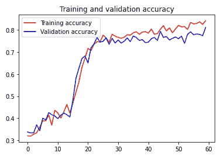

# CNNs 培训综合指南

> 原文：<https://towardsdatascience.com/a-comprehensive-guide-to-training-cnns-on-tpu-1beac4b0eb1c>

## 机器学习

## 让您的 TensorFlow 代码可在 TPU 上训练


Enric Moreu 在 [Unsplash](https://unsplash.com?utm_source=medium&utm_medium=referral) 上的照片

# 前故事

我最近在 Kaggle 上了解到 TPU 的可用性，我想在 TPU 上运行我的一个旧笔记本。我原以为这只是一个切换加速器和应用几个微小变化的问题，但结果证明这是一个完整的旅程，在这里我学到了很多。我想分享它来帮助其他人利用 TPUs 来惊人地加快他们的训练，从而提高重复实验的能力。

# 观众

⚠️ **警告！**本文假设您熟悉 ML、CNN 的基础知识，并使用 Tensorflow 和 Keras 对其进行培训，并且刚刚开始使用 TPU 或有一些疑问。

📝**注**。实际的示例笔记本是在 Kaggle 上完成的，但是绝大多数讨论的要点也适用于其他环境。

我希望这篇文章集中在实际应用上，而不要太长，所以让我们简单地谈谈“理论”。

# 一些 TPUs 背景

使用 TPUs ( [张量处理单元](https://en.wikipedia.org/wiki/Tensor_Processing_Unit))——在硬件上实现矩阵乘法的深度学习加速器，可以显著提高神经网络训练速度，因此大大减少了计算时间。

要了解更多的背景知识，我建议浏览谷歌的 TPUs 简介，也可以参考 YouTube 的视频

# Kaggle 环境

以下是该环境的一些详细信息，供您检查与您自己的环境的相关性:

1.  TPU v3–8
2.  Tensorflow 版本 2.4.1(带 TPU)
3.  在撰写本文时，Kaggle 上每周有 20 小时的 TPUs 时间(一次最多 9 小时)是免费的

# 完整 Jupyter 笔记本的链接

*   [卡格尔](https://www.kaggle.com/code/aaalexlit/from-simple-cnn-to-transfer-learning-on-tpu/notebook)
*   Github

# 大意

让我们先过一遍要点，然后用一些细节和代码片段来回顾它们。

> TPU 是游戏规则的改变者，如果他们可用，你需要使用他们

我再怎么强调也不为过，TPU 会疯狂地提高你的训练时间(当然前提是这对你手头的任务有用)。下面是一个表格，比较了我所经历的实验的每个时期的时间。

使用不同硬件的近似运行时间比较

但是任何好的东西都是有代价的，为了能够利用 TPU 的优势，人们需要调整他们的代码和数据管道。有时这意味着数据预处理的完全重写。

## **能够使用 TPU**

*   TPUs 专门从 Google 云存储(GCS)中读取数据**。因此，您需要将您的数据放在那里和/或从 GCS 中读取它(如果它已经可用的话)(就像 Kaggle 的情况一样)。**
*   需要使用`tf.data.Dataset`API**作为`model.fit()`的输入**
*   **型号**必须在`TPUStrategy`范围内定义****
*   **数据扩充**必须在数据准备期间**完成(即在 CPU 上)，它不能成为训练代码的一部分，因为[TPU](https://cloud.google.com/tpu/docs/tensorflow-ops)不支持某些张量流操作。**
*   **不能使用改变输入的宽度和高度的数据增强层(例如，`RandomWidth`、`RandomHeight`和方形图像，或在非方形图像的情况下翻转高度和宽度的数据增强方法)**。****
*   **来自 TensorFlow Hub **的模型需要读取未压缩的**或**直接加载到 TPU** ，因为云 TPU 无法访问 TFHub 所依赖的本地文件系统**
*   **等等。**

## ****优化 TPU 的使用****

**有很多事情可以做，以优化 TPU 上的训练，下面的列表并不详尽。主要是，由于 TPU 的速度很快，数据管道很容易成为瓶颈:**

*   **根据可用的硬件调整批量大小，并相应地调整学习速率**
*   **编译模型时使用`steps_per_execution`参数**
*   **使用数据集缓存、预取和[其他数据加载优化](https://www.tensorflow.org/guide/data_performance)来最大化 TPU 负载。**
*   **确保您的[特征尺寸](https://cloud.google.com/tpu/docs/performance-guide#tensor_dimensions)是 8 或 128 的倍数(取决于选择的批量大小)**
*   **以某种方式组织你在 GCS 上的数据**
*   **等等。**

# **数据集**

**本教程中使用的器械包来自 Kaggle 上的[植物病理学 2020](https://www.kaggle.com/competitions/plant-pathology-2020-fgvc7/overview/cvpr-2020) 竞赛。比赛的目标是将苹果叶子的图片分为 4 个不同的类别——健康、锈病、黑星病或多种疾病。数据集相对较小，在训练集中有 1821 幅 jpg 图像，在测试集中有相同的数量。**

# **好了，该动手了**

## **⚠️重要提示**

**下面我将主要省略与 TPU 用法不相关的代码。您可以通过提供的链接在笔记本中看到完整版本。**

## **在网络上找到 TPU**

**首先，我们需要在网络上定位 TPU，并实例化一个负责分布式计算的`TPUStrategy`。在 TPU 不可用的情况下，代码会退回到 GPU 或 CPU**

## **数据加载**

**最佳实践是:**

> ***📝*对于 TPU 培训，将 GCS 中的数据组织成合理数量(10 到 100 个)的合理大文件(10 到 100 个 MB)。如果文件太少，GCS 将没有足够的流来获得最大吞吐量。如果文件太多，访问每个单独的文件会浪费时间。**

**要实现这一点，需要使用`TFRecord`文件格式。我不会在这里这样做，因为数据集很小，我们可以将它缓存在 RAM 中。但是我建议你按照这个详细的教程去做。**

**这里我们将从 GCS 上的文件名中创建一个`**tf.data.Dataset**` ，而不是使用`TFRecord`。**

## **我们为什么要使用这种方法**

**在当前的目录结构下(即所有的图片都在一个目录下)，我们本可以使用`ImageDataGenerator.flow_from_dataframe`方法
，但是**似乎不支持 GCS** 给出和错误(不像`pd.read_csv()`至少在 Kaggle 上支持 GCS)。**

**`UserWarning: Found 1821 invalid image filename(s) in x_col=”filename”. These filename(s) will be ignored.`**

**当使用本地输入的路径调用时，即`../input/plant-pathology-2020-fgvc7/images`，它没有任何问题，但是 TPUs 不能访问本地驱动器。**

**此外，`ImageDataGenerator`已被弃用，建议使用`tf.keras.utils.image_dataset_from_directory`,这在我们的情况下不方便，因为所有的图像文件都在一个目录中。**

## **要遵循的步骤**

****1。设置和帮助功能
批量大小。**最理想的是批量大小为 128* `strategy.num_replicas_in_sync`但是由于我们的数据集非常小，我们将使用一个通用的经验法则:*一般来说，您的批量大小应该能被 8 或 128 整除。*使用小批量的另一个好处是我们不需要调整学习率，默认的学习率就可以了(看起来确实如此)。**

****每次执行的步骤。**此外，我们将通过使用下面描述的`model.compile()`的`steps_per_execution`参数来减少小批量:**

> ***📝* `steps_per_execution`指示 Keras 一次发送多个批次到 TPU。有了这个选项，就不再需要为了优化 TPU 性能而将批量设置得很高。**

****定位训练数据。**此外，我们需要获得 Google 云存储中当前数据集的路径。注意，下面代码片段中的第二行是特定于 Kaggle 的。**

****2。准备分层列车验证分割**结合标签和文件名**

****3。对标签**进行一次性编码，以符合竞赛要求的提交格式**

****4。通过压缩文件名和标签创建训练和验证** `**tf.data.Dataset**`**

****5。映射文件名数据集以获得图像数据集****

**6。为训练优化数据集**

**我使用上面的代码来提高数据输入的性能。我强烈建议您使用 tf.data API 来检查[更好的性能，以使您自己的输入管道高效，从而尽可能减少数据加载瓶颈。](https://www.tensorflow.org/guide/data_performance)**

**⚠️ **缓存和数据扩充。**值得强调的一个**重要提示****。**确保在数据扩充之前`cache()`数据集，否则扩充将不会在每个时期重新应用，并且在扩充步骤中几乎没有意义。这种情况的一个症状是训练与验证的过度拟合，当然过度拟合也可能由于其他原因而发生。**

**在这一步的最后，我们得到了分层的、高性能的训练和验证数据集。**

## **模型创建**

****每次执行的步骤。**现在是使用我们之前谈到的`steps_per_execution` 参数的时候了。在这种情况下，32 似乎很管用。**

****学习率。**同样，如果你决定使用更大的批量，你很可能需要调整学习率，而不是使用默认的学习率。**

****特征尺寸。**在 TPU 上创建训练模型时，另一个需要注意的重要事项是**特征尺寸。****

> ***📝* **注:** *特征尺寸*是指一个全连通层的隐藏尺寸或一个卷积中输出通道的数量。不是所有的层都能符合这个规则，尤其是网络的第一层和最后一层。这很好，大多数模型需要一些填充量。**

**您可以在云 TPU 性能指南中详细阅读关于[设置特征尺寸的信息，以确定最适合您的模型和数据的方式。](https://cloud.google.com/tpu/docs/performance-guide#tensor_dimensions)**

**除此之外，你可以像往常一样使用你喜欢的 API 创建你的模型(比如顺序的或者功能的)并在`TPUStrategy`的范围内实例化它:**

**在 TPUStrategy 范围内实例化模型**

## **模特培训**

**像往常一样训练你的模型。**

**如果您在数据准备管道中使用了`ds.repeat()`，那么您需要为`model.fit()`方法提供`steps_per_epoch`和`validation_steps`。这适用于任何训练，不仅仅是 TPU。**

**第一个模型经过 60 个历元的训练，准确率约为 80%(在 TPU 上训练大约需要 2 分钟！！！)但是我们可以注意到一些过度拟合的发生。**

****

**培训与验证学习曲线**

**对抗过度拟合的方法之一是使用数据扩充。让我们开始吧。**

## **数据扩充**

**TensorFlow 有两种应用数据扩充(以及一般的预处理)的方式([更多细节请见](https://www.tensorflow.org/guide/keras/preprocessing_layers#preprocessing_data_before_the_model_or_inside_the_model)):**

1.  **将数据增强图层添加到模型中**
2.  **将数据扩充纳入数据集准备管道**

> ***当在****GPU****上运行时，你会想要使用* ***第一选项*** *来从 GPU 加速中获益。*
> *当运行在****TPU****上时* ***不得不*** *使用* ***第二选项*** *因为不支持数据增强图层(除了* `*Normalization*` *和* `*Rescaling*` *)***

**最初我使用了第一个选项，当然它不起作用。不要像我一样:**

****💔故障排除。**如果您尝试`.fit()`一个在 TPU 上包含数据扩充层的模型，您将会得到一条`TPU compilation failed`消息，显示如下所示的错误:**

```
NotFoundError: 9 root error(s) found.
  (0) Not found: {{function_node __inference_train_function_183323}} No proto found for key <<NO PROGRAM AS COMPILATION FAILED>>
     [[{{node TPUVariableReshard/reshard/_5957770828868222171/_22}}]]
  (1) Invalid argument: {{function_node __inference_train_function_183323}} Compilation failure: Detected unsupported operations when trying to compile graph while/cluster_while_body_181553_10451082903516086736[] on XLA_TPU_JIT: ImageProjectiveTransformV3 (No registered 'ImageProjectiveTransformV3' OpKernel for XLA_TPU_JIT devices compatible with node {{node while/body/_1/while/sequential_28/sequential_27/random_rotation_8/transform/ImageProjectiveTransformV3}}){{node while/body/_1/while/sequential_28/sequential_27/random_rotation_8/transform/ImageProjectiveTransformV3}}One approach is to outside compile the unsupported ops to run on CPUs by enabling soft placement `tf.config.set_soft_device_placement(True)`. This has a potential performance penalty.
    TPU compilation failed 
    etc....
```

**我还试着用*在没有任何效果的情况下`[tf.config.set_soft_device_placement(True)](https://www.tensorflow.org/versions/r2.4/api_docs/python/tf/config/set_soft_device_placement)`将增强层保留在主模型中。*看起来这个选项只对 GPU 有效。**

**⚠️出于上述原因，如果你想让你的模型使用数据增强在任何加速器上有效训练，你需要有两个版本。一个用于 GPU，另一个用于 TPU。**

## **数据扩充转换**

**不应使用改变输出张量重量或高度的数据增强图层(如`RandomWidth`、`RandomHeight`)**

****💔故障排除。**否则，您将再次得到`NotFoundError`和`TPU compilation failed`消息，并显示类似如下的错误:**

```
(6) Invalid argument: {{function_node __inference_train_function_248407}} Compilation failure: Dynamic Spatial Convolution is not supported: lhs shape is f32[<=8,<=274,<=286,3] 
     [[{{node conv2d/Conv2D}}]]
    TPU compilation failed
     [[tpu_compile_succeeded_assert/_3495234026254819081/_5]]
     [[TPUVariableReshard/default_shard_state/_4480269216609879393/_8/_123]]
  (7) Not found: {{function_node __inference_train_function_248407}} No proto found for key <<NO PROGRAM AS COMPILATION FAILED>>
     [[{{node TPUVariableReshard/reshard/_11705470937593059017/_16}}]]
  (8) Invalid argument: {{function_node __inference_train_function_248407}} Compilation failure: Dynamic Spatial Convolution is not supported: lhs shape is f32[<=8,<=274,<=286,3] 
     [[{{node conv2d/Conv2D}}]]
    TPU compilation failed
     [[tpu_compile_succeeded_assert/_3495234026254819081/_5]]
```

**最后(重要且与任何硬件相关):**

> ***⚠️* *仅对训练集应用数据扩充***

**将其应用于验证集是没有意义的。除非你打算使用[测试时间增强(TTA)](/test-time-augmentation-tta-and-how-to-perform-it-with-keras-4ac19b67fb4d) 集成方法，否则将它应用到测试集是没有意义的(但是那样你会做得不同)。**

**我是这样实现的:**

**使用具有早期停止的数据扩充(耐心设置为 20 个时期)导致大约 10%的提高的准确性，在大约 120 个时期内跳跃到大约 90%的验证集，而没有任何明显的过度拟合迹象**

****

## **迁移学习**

**使用 TensorFlow 和 Keras 进行迁移学习有两种方式:**

1.  **使用 TensorFlow Hub 提供的图层。**
2.  **使用`tf.keras.applications` API**

**就我所知，后者在 TPU 上训练时可以照常使用。但是有一个警告。TPU 自带的 Kaggle Tensorflow 版本是 2.4.1。最新型号(如 Efficientnet v2 系列)不可用。**

**要使用 TensorFlow Hub，需要做一些调整。**

**能够在 TPU 上训练使用 TensorFlow Hub 层的模型的最简单方法是[指示 TensorFlow 从 GCS](https://github.com/tensorflow/hub/issues/604) 读取未压缩的模型。默认情况下，TensorFlow Hub 会下载压缩模型，并将其缓存到 TPU 无法访问的本地文件系统中。然后可以创建一个层并照常使用**

**另一种方法是使用`tf.saved_model.LoadOptions`并将模型直接加载到 TPU:**

# **结论**

**TPUs 可以惊人地减少执行一个训练步骤所需的时间。但是，使用它们需要一些设置。此外，需要记住的是，由于 TPU 非常快，I/O 操作很容易成为一个限制因素。因此，在 TPU 上实现最高性能需要高效的输入管道。本文主要集中在 CNN 上，但是大部分讨论点也适用于其他类型的深度神经网络。**

**今天就到这里，希望对你加速训练有所帮助。**

**不要犹豫留下评论或提出问题。**

# **进一步阅读**

**显然，我没有涵盖你需要知道的在 TPU 上成功训练你的 ML 模型的一切。以下是一些资源列表，它们将帮助您深化知识，并进一步调整和优化您自己的管道和模型。**

*   **[**Keras and modern convnets，on TPUs**](https://codelabs.developers.google.com/codelabs/keras-flowers-tpu)**codelab by*Martin g rner****(我一般会推荐它，不只是在 TPU 培训的背景下)***
*   ***[**如何使用 ka ggle/张量处理单元(TPUs)**](https://www.kaggle.com/docs/tpu) **关于 *Kaggle*** (一个不错的起点)***
*   ***[**云 TPU**](https://cloud.google.com/tpu/docs/performance-guide)**由*谷歌*** (在我看来相当简短)***
*   ***[**使用 tf.data API**](https://www.tensorflow.org/guide/data_performance) 可以获得更好的性能(必须阅读性能输入管道)***
*   ***[**在 Keras 中使用预处理层**](https://www.tensorflow.org/guide/keras/preprocessing_layers)***