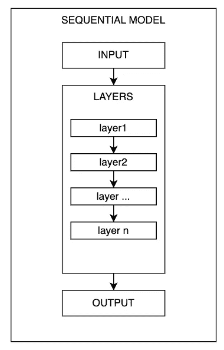
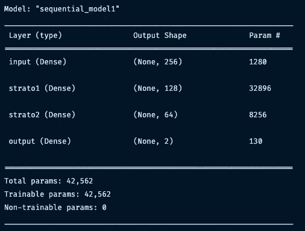
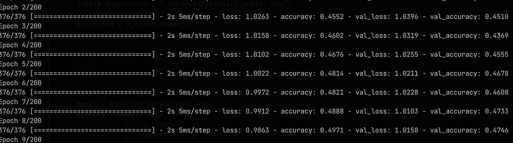
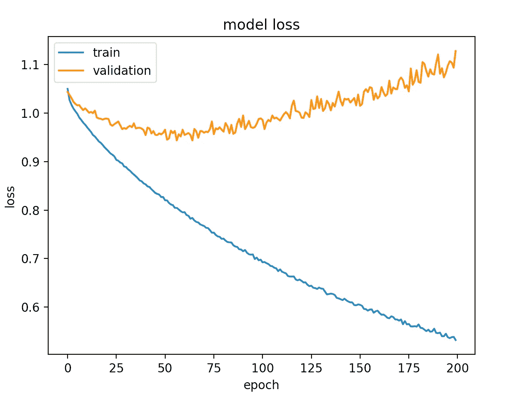
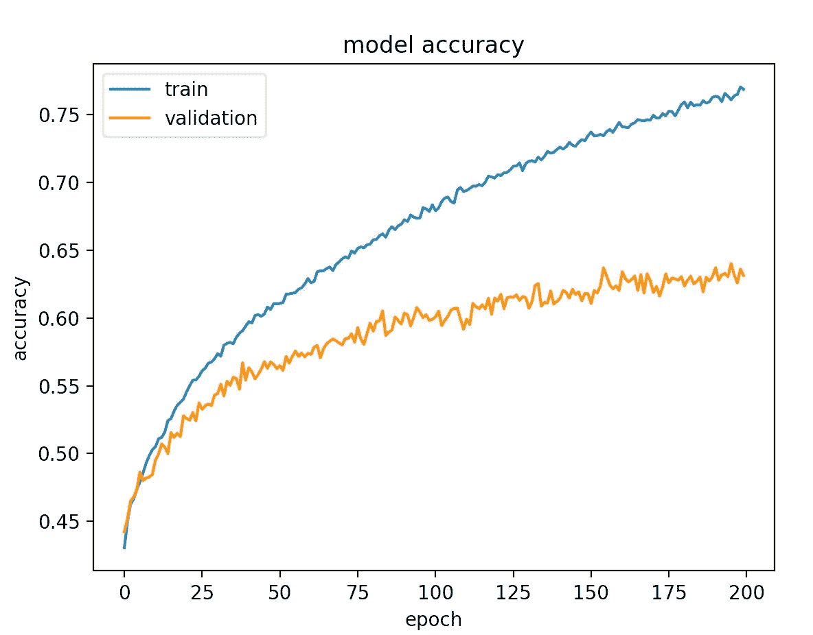

# TensorFlow 2.0 入门—深度学习简介

> 原文：<https://towardsdatascience.com/a-comprehensive-introduction-to-tensorflows-sequential-api-and-model-for-deep-learning-c5e31aee49fa>

## *了解 TensorFlow 最强大的深度学习工具之一*


作者图片

TensorFlow 是谷歌创建的框架，允许机器学习从业者创建深度学习模型，通常是向首次接触深度学习的分析师提出的第一个解决方案。

原因在于**tensor flow 顺序 API** 的简单性和直观性——它**允许分析师创建非常复杂和强大的神经网络，同时保持用户友好。**

API 代表*应用编程接口*，是用户和我们想要使用的应用之间的媒介。

TensorFlow 界面简单、直接，即使是没有做过实际深度学习，只懂理论的人也很容易理解。

> TensorFlow 的顺序 API 非常适合初学者，建议作为您深度学习之旅的起点。

在这篇文章中，我提出了一个利用顺序 API 的深度学习介绍，展示了一些例子和代码来帮助读者理解这些概念，并作为一个 In。

# 深度学习和神经网络背后的直觉

在进入 TensorFlow 及其序列模型如何工作之前，最好了解一下什么是深度学习以及神经网络如何工作的背景。

**神经网络是用于深度学习的主要工具。**现象的学习是通过网络中存在的神经元的激活和去激活来进行的——这种活动允许网络通过权重和偏差来创建我们想要解决的问题的表示**。**

在每层神经元之间有一个激活函数。这将一个输出转换为下一个输出，对网络概括问题的能力产生各种影响。最常见的激活函数称为 ReLU。

神经网络能够通过比较其预测值与实际值的接近程度来了解其性能是否有所提高。这种行为由损失函数描述**。作为机器学习的从业者，我们的目标是想办法把损失降到最低。**

> 作为分析师，我们的目标是尽可能减少损失，同时避免过度拟合

我就不赘述了，因为我在文章 [*神经网络简介——权重、偏置和激活*](https://medium.com/mlearning-ai/introduction-to-neural-networks-weights-biases-and-activation-270ebf2545aa) 中已经涉及到这个话题了。我推荐想扩展对深度学习基础知识理解的读者阅读这篇文章。

然而，这一点上下文将足以帮助理解下面的部分。

# 什么是 TensorFlow 顺序 API，它是如何工作的？

由于 Keras，TensorFlow 提供了过多的功能。TensorFlow APIs 基于 Keras 的 API，用于定义和训练神经网络。

顺序模型允许我们指定一个神经网络，准确地说，顺序的:**从输入到输出，通过一系列的神经层，一个接一个。**

TensorFlow 还允许我们使用**功能 API** 来构建深度学习模型。这种方法被更多的专家用户所使用，并且不如顺序 API 那样用户友好。根本的区别在于，函数式 API 允许我们创建非顺序的神经网络(因此是多输出的，并与其他组件集成)。

在 Python 中，顺序模型以这种方式编码

```
import tensorflow as tf
from tensorflow import keras
from tensorflow.keras import layers

model = keras.Sequential(
 [...] 
)
```

`keras.Sequential`接受包含定义神经网络架构的层的列表。数据按顺序流经每一层，直到到达最终输出层。



数据如何通过顺序模型流动。图片作者。

我们可以通过`keras.layers`指定神经层。

# 输入层

放入神经网络的第一层是输入层。通过`keras`这件事很简单。

我们创建了一个 256 个神经元的层，ReLU 激活，输入大小为 4。

```
# input layer
layers.Dense(256, input_dim=4, activation="relu", name="input")
```

这一层与其他层不同，因为其他层不需要`input_dim`参数。

> 初学者在深度学习中最常见的一个问题就是理解输入的形状是什么。

找到`input_dim`的值并不简单，因为它取决于我们正在处理的数据集的性质。由于在深度学习**中，我们使用张量**(包含多维数据的结构)，有时很难猜测我们输入到神经网络的数据的形式。

在表格数据集中，我们的输入形状将等于数据集中的列数。对于 Pandas 和 Numpy，只需在对象上使用`.shape[-1`即可获得该信息。

相反，在图像的情况下，我们需要传递图像的像素总数。例如，在 28 * 28 图像的情况下，输入尺寸将是 784。

对于时间序列，我们需要传递批量大小、时间窗口和特征大小。

假设我们的数据集是表格式的，有 4 列，我们只需要指定 4 作为输入维度。

至于神经元的数量，256 **的值是任意的**。您必须试验这些参数，并评估哪种架构性能最佳。

## 输入后的图层

让我们给顺序模型添加层。

```
model = keras.Sequential(
    [
        layers.Dense(256, input_dim=4, activation="relu", name="input")
        layers.Dense(128, activation="relu", name="layer1"),
        layers.Dense(64, activation="relu", name="layer2"),
        # ...
    ]
)
```

第一层之后的层不需要指定输入维度，因为在输入层之后，它将是从一层传递到另一层的权重和偏差方面的输入的*表示*。

## 输出层

输出层不同于其他层，因为它必须反映我们希望从神经网络的输出中接收的值的数量。

例如，如果我们想做一个回归，从而预测一个单一的数字，在最后一层的单位数必须是一。

```
# output layer
layers.Dense(1, name="output")
```

在这种情况下，我们不需要指定激活函数，因为没有它，数据的最终表示将是线性的(不受 ReLU 的影响)，未经变换。

相反，如果我们想要预测类别，例如对图像中的猫和狗进行分类，我们需要在最后一层使用一个激活函数 *Softmax* 。Softmax 将神经网络的表示形式映射到数据集中存在的类，为每个类的预测分配一个概率。

对于上面提到的例子，我们的输出层应该是

```
# output layer
layers.Dense(1, activation="softmax", name="output")
```

结果将类似于[[0.98，0.02]]，其中第一个数字指示神经网络在预测类 0(可能是狗或猫)时的置信度。

# 打印模型的摘要

让我们把到目前为止看到的代码片段放在一起，给模型添加一个名字，并用`.summary()`打印出我们架构的概要。

```
model = keras.Sequential(
    layers=[
        layers.Dense(256, input_dim=4, activation="relu", name="input"),
        layers.Dense(128, activation="relu", name="layer1"),
        layers.Dense(64, activation="relu", name="layer2"),
        layers.Dense(2, activation="softmax", name="output")
    ],
    name="sequential_model1"
)
model.summary()
```

结果呢



的电话。我们模型上的 summary()。作者图片

这个总结显示了**理解我们的神经网络**的架构以及数据如何在层间移动的重要信息。

最重要的列是*输出形状*。在这样一个简单的例子中，它可能看起来不相关，但这个列显示了我们的数据如何在神经网络的各个层中改变形状。

当我们使用**卷积神经网络或 LSTMs** 时，这个总结变得特别有用。这是因为数据的形状以不容易理解的方式变化。如果出现错误和 bug，这些信息可以帮助我们调试代码。

*Param #* 栏显示可由神经网络调节的参数数量。用数学术语来说，就是我们优化问题的维数。回想一下，每个神经元都有一个权重和一个偏差参数，因此`n_parameters = n_neurons * (n_inputs + 1)`。

在第一层中，输出和输入是相同的，因此应该是 256 x 5。

## 增量添加层

还有一种替代方法，完全基于样式，因此可以任意地向顺序模型添加层。

逐渐地，你可以使用`model.add()`添加一个对象到模型中。

```
model = keras.Sequential()
model.add(layers.Dense(256, input_dim=4, activation="relu", name="input"))
model.add(layers.Dense(128, activation="relu", name="layer1"))
model.add(layers.Dense(64, activation="relu", name="layer2"))
model.add(layers.Dense(2, activation="softmax", name="output"))
```

最终结果与之前通过层列表看到的一样，因此您可以使用您喜欢的方法。

# 编译一个序列模型

现在让我们编译这个模型，这是训练神经网络的必要步骤。

**编译模型意味着建立损失函数、优化器和性能评估指标。**

一旦建立了网络架构，编译只需要一小段代码。继续狗和猫之间的分类示例，我们将使用分类交叉熵作为损失函数， *Adam* 作为优化器，准确度作为评估度量。

要了解更多关于这些参数的信息，我邀请您阅读 TensorFlow 中关于[二值图像分类的文章。](https://medium.com/towards-artificial-intelligence/binary-image-classification-with-tensorflow-2cc6555e55e8)

```
model.compile(
        loss="categorical_crossentropy", 
        optimizer="adam",
        metrics=["accuracy"]
    )
```

# 训练序列模型

要训练顺序模型，只需在编译后使用`model.fit()`。只需传递 X 和 y，其中 X 是我们的特性集，y 是我们的目标变量。

在`.fit()`中还有其他可通过的参数。以下是一些最重要的:

*   `batch_size`:允许您在更新模型权重和偏差之前，设置每次训练迭代要评估的样本数量
*   `epochs`:建立模型处理整个数据集的次数。当数据集中的所有示例都已用于更新模型权重时，处理一个时期
*   `validation_data`:这里我们传递测试数据集，在其上进行训练评估。

```
model = keras.Sequential(
    layers=[
        layers.Dense(256, input_dim=4, activation="relu", name="input"),
        layers.Dense(128, activation="relu", name="layer1"),
        layers.Dense(64, activation="relu", name="layer2"),
        layers.Dense(2, activation="softmax", name="output")
    ],
    name="sequential_model1"
)
model.compile(
        loss="categorical_crossentropy", 
        optimizer="adam",
        metrics=["accuracy"]
    )
history = model.fit(X_train, y_train, batch_size=32, epochs=200, validation_data=(X_test, y_test))
```

从这里开始训练过程，该过程将在终端中显示损耗和性能指标的进度。



张量流中神经网络的训练。图片作者。

我写过一篇关于[用 TensorFlow](https://medium.com/towards-data-science/control-the-training-of-your-neural-network-in-tensorflow-with-callbacks-ba2cc0c2fbe8) 提前停止的文章，TensorFlow 是一种回调，可以帮助神经网络提高训练性能。

# 序贯模型的评估

细心的读者会注意到上面代码片段中的一个小细节。我指的是`history = model.fit(...)`。为什么一定要把培训过程赋给一个变量？**原因是因为** `**model.fit(...)**` **返回一个包含训练表演的对象。**

> 在 TensorFlow 中，使用`*.fit(...)*`返回具有模型训练性能的对象。该对象可用于可视化这些性能并对其进行详细分析。

我们可以通过探索变量中的*历史*属性来访问字典中的值。

使用这些数据，我们可以在训练和验证集上可视化训练性能。

```
def plot_model(metric):
 plt.plot(history.history[metric])
 plt.plot(history.history[f"val_{metric}"])
 plt.title(f"model {metric}")
 plt.ylabel(f"{metric}")
 plt.xlabel("epoch")
 plt.legend(["train", "validation"], loc="upper left")
 plt.show()

plot_model("loss")
plot_model("accuracy")
```

让我们检查一下损失



损失曲线。图片作者。

这同样适用于所选择的评估指标，在这种情况下是准确性



精确度曲线。图片作者。

给读者🥸:的问题

> 为什么验证集中的准确度增加了，但是同一组的损失也增加了？这不是一个简单的问题——在下面的评论中分享你的想法

如果我们有验证和测试集，我们可以使用`model.evaluate(X_test, y_test)*.*`来评估模型

# 使用序列模型进行预测

一旦训练完毕，就该使用模型进行预测了。

```
train_predictions = model.predict(X_train)
```

在这种情况下，API 类似于 Sklearn，神经网络预测被分配给`train_predictions`。

# 保存和加载张量流模型

最后一步通常是保存我们已经训练好的模型。TensorFlow 的 API 允许您简单地使用

```
model.save("./path/to/file")
```

将在指定的磁盘位置创建一个文件夹，其中包含我们的神经网络文件。

要稍后加载模型，只需

```
model = keras.models.load_model("./path/to/file")
```

从这里开始，我们可以像前面看到的那样，使用模型进行预测。

# 何时不使用顺序模型？

如前所述，TensorFlow 允许您通过使用函数式 API 来创建非顺序神经网络。

特别是，在下列情况下，功能方法值得考虑:

*   我们需要多个输出，所以多输出神经网络
*   一层需要来自前几层的更多输入
*   两个神经网络需要相互通信
*   我们需要一个定制的神经网络，一个不寻常的架构

在所有这些和更多这些情况下，我们需要一个非顺序模型。顺序方法通常非常灵活，因为它允许我们解决许多问题，例如二进制图像分类，但是对于更复杂的问题，这样的架构可能被证明过于简单。

# 结论

对于深度学习实践者来说，TensorFlow API 和顺序模型是强大且易于使用的工具。

本指南希望让深度学习初学者能够在他/她的个人项目中尝试这些工具，避免迷失并求助于官方文档。

# 推荐阅读

对于感兴趣的人来说，这里有一个我为每个与 ML 相关的主题推荐的书籍列表。在我看来，有一些必不可少的书籍对我的职业生涯产生了巨大影响。

*   **ML 简介** : [*自信的数据技能:掌握数据工作的基本原理，为你的职业生涯增压*](https://amzn.to/3WZ51cE) 作者:基里尔·叶列缅科
*   **sk Learn/tensor flow**:[*使用 Scikit-Learn、Keras 和 TensorFlow*](https://amzn.to/3jseVGb) 进行动手机器学习
*   **NLP** : [*文本即数据:机器学习和社会科学的新框架*](https://amzn.to/3l9FO22) 作者贾斯汀·格里默
*   **sk Learn/PyTorch**:[*用 py torch 和 Scikit 进行机器学习——Learn:用 Python 开发机器学习和深度学习模型*](https://amzn.to/3wYZf0e)Sebastian Raschka
*   **数据即** : [*用数据讲故事:商务人士数据可视化指南*](https://amzn.to/3HUtGtB) 科尔·克纳弗利克著

# 有用的链接(我写的)

*   **了解如何在 Python 中执行顶层探索性数据分析**:[*Python 中的探索性数据分析——一步一步的过程*](/exploratory-data-analysis-in-python-a-step-by-step-process-d0dfa6bf94ee)
*   **学习 TensorFlow 的基础知识**:[*tensor flow 2.0 入门—深度学习入门*](https://medium.com/towards-data-science/a-comprehensive-introduction-to-tensorflows-sequential-api-and-model-for-deep-learning-c5e31aee49fa)
*   **用 Python 中的 TF-IDF 进行文本聚类** : [*用 Python 中的 TF-IDF 进行文本聚类*](https://medium.com/mlearning-ai/text-clustering-with-tf-idf-in-python-c94cd26a31e7)

**如果你想支持我的内容创作活动，请随时关注我下面的推荐链接，并加入 Medium 的会员计划**。我将收到你投资的一部分，你将能够以无缝的方式访问 Medium 的大量数据科学文章。

[](https://medium.com/@theDrewDag/membership) [## 通过我的推荐链接加入 Medium-Andrew D # data science

### 阅读 Andrew D #datascience(以及媒体上成千上万的其他作者)的每一个故事。您的会员费直接…

medium.com](https://medium.com/@theDrewDag/membership) 

我希望我对你的教育有所贡献。下次见！👋