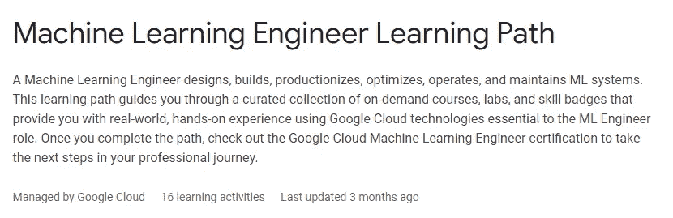
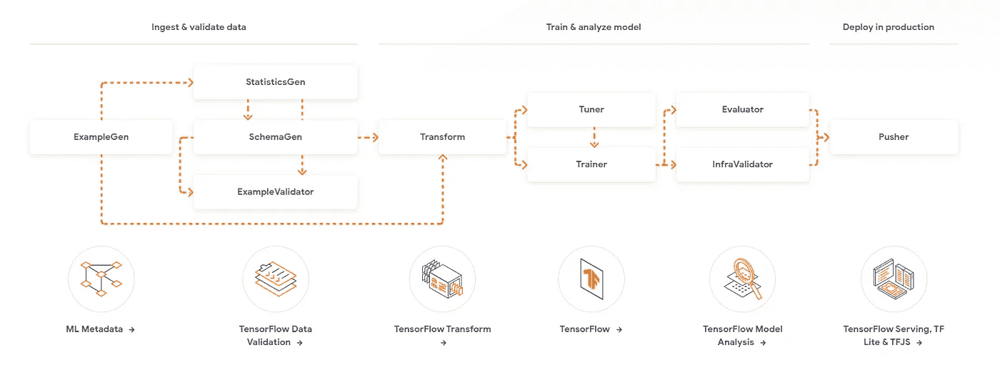
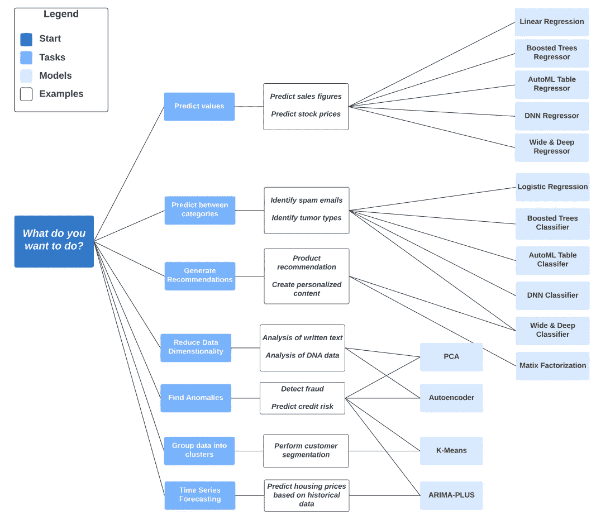
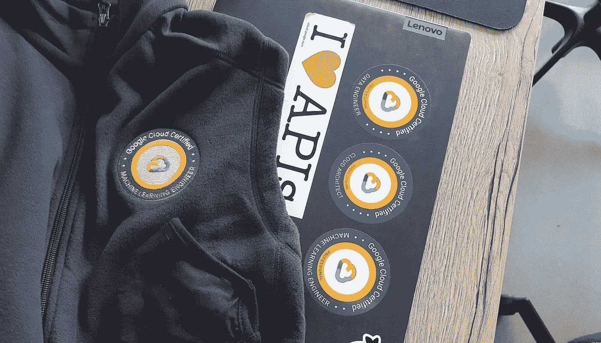

# 谷歌专业机器学习工程师认证综合学习指南

> 原文：<https://towardsdatascience.com/a-comprehensive-study-guide-for-the-google-professional-machine-learning-engineer-certification-1e411db4d2cf>

## 学习指南

# 谷歌专业机器学习工程师认证综合学习指南

## 如何准备机器学习工程师的顶级认证之一

GCP 机器学习工程师徽章。由作者获得。

*注:本文遵循谷歌认证团队发布的* [*考试指南*](https://cloud.google.com/certification/guides/machine-learning-engineer) *作为其地面真理。虽然我最初是在 2021 年 1 月初获得认证的，但随着学习指南的变化，我将继续更新我的认证，当前版本反映了 2022 年 2 月 22 日之后参加考试的学习指南。新旧版本的主要区别在于，新的考试包括 Vertex AI，而旧的考试是基于 AI 平台——它的前身。由于两者之间的差异很小，任何在 GCP 工作的 MLE 都应该对 AI 平台足够熟悉才能通过，所以我只支持新版本。*

*本帖最后更新于 2022 年 1 月 1 日。*

## 这个认证是关于什么的？

谷歌最近发布了一项针对机器学习工程师的认证考试。简而言之，机器学习工程专注于构建和改进模型，将它们转移到生产环境中，并在可能的情况下自动化这一过程。考试持续两个小时，测试您生产中 ML 的许多方面，包括最佳实践、流程编排、日志记录和监控、故障排除、测试、MLOps 和各种模型架构。

## **为什么会得？**

*   你已经是一名 ML 工程师，你想要一些正式的证明你的能力。
*   你希望从数据科学或数据工程转到 ML 工程，并且已经有了一些 GCP 的经验。
*   你想学习更多的关于 ML 工程和 MLOps 的知识，GCP 看起来不错。

## 如何阅读这个帖子

下面我添加了学习指南中每个主题的笔记和资源。**子引号是从指南**一字不差的抄来的，我的评论一般都在它们下面。我还添加了来自 GCP、TensorFlow、TFX 和 Kubeflow 文档的各种资源的链接，这将有助于您查看这些资源。

> 从学习指南中复制的任何内容都以这种方式列出

我的想法不是提供一个非常长的教程列表，而是一个资源的集合，你可以从中挑选，以解决你知识中的任何差距。假设你不知道 MLOps 是什么——幸运的是，我有一个链接。该考试涵盖的内容很多，甚至可能超过云架构师和数据工程考试。如果你发现自己对某个话题还一无所知，也不要惊慌。**在学习指南部分之后，我还将简要介绍书籍和其他资源。**

*等等！我只想要一个从零开始学习的指南！你不能给我推荐一个吗？*

如果你正在寻找一套课程，我可以推荐[官方学习途径](https://www.cloudskillsboost.google/paths/17)。课程经常更新，但会让你损失学分。如果您是合作伙伴公司的一员，您可能能够从您的组织获得这些以及额外的支持。

截图来自谷歌提供的官方 ML 工程师学习路径。来源[这里](https://www.cloudskillsboost.google/paths/17)。

让我们看看指南。总共有六个部分。

# 第一部分:ML 问题框架

不要为了使用 ML 而使用 ML

第一部分是关于机器学习的用例。不要把这当作简单的通行证和对 ML 的介绍，因为(重新)构建一个问题需要创造性思维和商业理解。你会惊讶于一个公司经常把 ML 看作一个解决方案，而事实上，一个不使用 ML 的聪明的解决方案也可以为他们服务。本节将详细介绍如何处理这个问题。

在学习材料方面，谷歌的机器学习速成班也涵盖了第 1 部分的大部分内容。

## **1.1 将业务挑战转化为 ML 用例。考虑因素包括:**

> 基于业务需求选择最佳解决方案(ML 与非 ML、定制与预打包[例如 AutoML、Vision API])

这包括两个部分——首先从非 ml 中确定 ML，其次确定哪个 ML 选项是最好的。

如果你试图预测的事情可以不用最大似然法来计算，那么坚持计算可能比用最大似然法更好。为了快速回顾这一点，请查看 Google 的 ML 规则[。](https://developers.google.com/machine-learning/guides/rules-of-ml)

如果你对此感到困惑，或者只是想要一个好的介绍，请查看来自的文章/迷你课程[为 ML](https://developers.google.com/machine-learning/problem-framing) 识别好的问题，以及[速成课程关于问题框架](https://developers.google.com/machine-learning/crash-course/framing/video-lecture)的部分，以获得一些一般信息。

您应该了解的 ML 解决方案分为两类:

**定制** 基本上是自带模型选项:通常你可以在任何你喜欢的框架(PyTorch，TensorFlow，Sklearn 等等)中构建一个定制模型，它比开箱即用的方法性能稍高。对于已经拥有大量专业知识的企业来说，这是一个不错的主意，在这些企业中，分类性能很重要，或者错误有其相关的价格标签。

代价是，与使用预打包的解决方案相比，您几乎总是要在开发上花费更多的时间。

**【预包装】** 这里的“预包装”只是指你几乎可以直接开箱使用的型号。至少，考虑一下:

*   [BigQuery ML](https://cloud.google.com/bigquery-ml/docs/introduction)
*   [对话流程](https://cloud.google.com/dialogflow)
*   [建议 AI](https://cloud.google.com/recommendations)
*   [云自然语言 API](https://cloud.google.com/natural-language)
*   [翻译 API](https://cloud.google.com/translate)
*   [语音转文字](https://cloud.google.com/speech-to-text)
*   [视频 AI](https://cloud.google.com/video-intelligence)
*   [AutoML](https://cloud.google.com/automl) (注:[现在是顶点 AI](https://cloud.google.com/vertex-ai/docs/beginner/beginners-guide/) 的一部分)

> 定义应该如何使用模型输出来解决业务问题

简而言之:系统或解决方案的用途是什么，应该采取什么步骤使其对业务问题有用？

> 管理不正确的结果

错误结果的影响是什么，如何减轻后果？你如何向利益相关者解释错误分类？

> 识别数据源(可用与理想)

要记住的要点是，ML 需要数据。如果您还没有数据，那么最好是构建一个基本的解决方案，并开始收集数据，以便稍后训练模型。如果你有数据，但只是没有标记，你也许可以投资标记它。

## **1.2 定义 ML 问题。考虑因素包括:**

> 定义问题类型(分类、回归、聚类等。)

除了这些主要类别，还要确保你理解以下任务/方法/想法的要点:对象检测、情感分类、流失预测、语音识别、意图分类、对象跟踪(视频中)、语义分割、协同过滤、命名实体识别、时间序列预测、推荐系统、联合学习和迁移学习。了解这些意味着你已经熟悉了你将会遇到的 80%的人工智能用例。

> 定义模型预测的结果

在模型层面上，输出应该是什么？用户信息的预期意图，或者播放列表中的下一首歌？它应该预测整个购物篮，还是只预测下一件商品？

> 定义输入(特征)和预测输出格式

定义什么样的特性进入一个模型并不是一项简单的任务。思考如何组合或转换某些特征，例如通过单词嵌入或稀疏向量。模型的输出可能还需要一点点的转换，例如，通过将一个热点编码转换回一个有用的标签。根据我的经验，实际上没有任何业务应用程序会按照模型提供的精确格式来使用预测。

## **1.3 定义商业成功的标准。考虑因素包括:**

> ML 成功指标与业务问题的一致性

我喜欢反过来想。从商业角度来看，什么是成功？案件完全自动化？你能像企业衡量他们的成功一样衡量模型做了什么吗？

> 主要结果
> 
> 确定模型何时被视为不成功

这是一个棘手的问题，因为它还涉及到管理来自企业的期望。理想情况下，您可以坐下来，预先确定何时认为模型成功的“通过/不通过”阈值。这并不总是可能的。

## **1.4 识别洗钱解决方案的可行性和实施风险。考虑因素包括:**

> 评估和传达业务影响

一旦你有了一个合适的系统，你必须能够告诉你的利益相关者它是做什么的，以及你的模型对他们的业务有什么作用。理想情况下，你可以用节省的欧元或美元，或者转化率的增加来衡量成功。

> 评估 ML 解决方案准备情况

简而言之:能够确定企业在多大程度上适应了 ML，ML 解决方案在多大程度上对企业有用——以及需要采取什么步骤来缩小这些差距。

> 评估数据准备情况和潜在限制

数据是不是已经有了，可以训练了，可以用了(合法！)又有多正确呢？数据里有没有 bot 流量，量是多少？是否缺少数据条目？

> 与谷歌负责任的人工智能实践保持一致(例如，不同的偏见)

权力越大，责任越大。你可以在这里找到负责任的人工智能实践。我还想提一下 [BBC 的《负责任的人工智能指南》](https://www.bbc.co.uk/rd/publications/responsible-ai-at-the-bbc-our-machine-learning-engine-principles)类似但更广泛的内容。

# 第 2 部分:ML 解决方案架构

## **2.1 设计可靠、可扩展、高度可用的 ML 解决方案。考虑因素包括:**

> 为用例选择合适的 ML 服务(例如，云构建、Kubeflow)

这是考试中最难的部分，原因很简单，你通常不经常实验你设置的基础，因为新的服务经常发布。幸运的是，Google 有大量的文档可以帮助你学习。主要是:

*   [GCP 洗钱最佳实践指南](https://cloud.google.com/architecture/ml-on-gcp-best-practices)
*   [Tensorflow 扩展版(TFX)](https://www.tensorflow.org/tfx)
*   [Kubeflow 文档](https://www.kubeflow.org/docs/started/introduction/)
*   [在 Vertex AI 上构建和部署 ML 解决方案(8 小时)](https://www.cloudskillsboost.google/quests/183)

> 组件类型(例如，数据收集、数据管理)

看看 Google 在人工智能和人工智能类别下推广的一些示例架构。并不是所有的架构都足够成熟，以至于我可以放心地说它会完全以这种方式部署，但是它们可以用来说明现实生活中的用例。

> 探索/分析

[Dataprep](https://cloud.google.com/dataprep) 是一个可视化工具，你可能会在考试中遇到，但根据我的经验，大多数数据科学家都希望直接在笔记本上处理数据。为此，你可以完全依赖于 [Vertex AI Workbench 中的笔记本实例(管理的或用户管理的)。](https://cloud.google.com/vertex-ai/docs/workbench)

> 特征工程

除了数据科学流程中的逻辑步骤之外，笔记本电脑之外还有一些产品值得一提。

*   顶点人工智能特征库
*   [Vertex AI 的数据集](https://cloud.google.com/vertex-ai/docs/datasets/create-dataset-api)管理训练和标注集。
*   你应该知道[数据流](https://cloud.google.com/dataflow/docs)和[数据链](https://cloud.google.com/dataproc/docs)以及它们之间的区别
*   [BigQuery](https://cloud.google.com/bigquery/docs/introduction)

值得一提的是，谷歌提供了为期两天的功能工程课程[作为他们学习路径的一部分。](https://www.cloudskillsboost.google/course_templates/11)

> 记录/管理

*   [云日志](https://cloud.google.com/logging)
*   [顶点 AI 实验](https://cloud.google.com/vertex-ai/docs/experiments)包括[张量板](https://www.tensorflow.org/tensorboard)
*   [Kubeflow](https://www.kubeflow.org/docs/components/central-dash/overview/)
*   额外奖励: [Mlflow](https://mlflow.org/) 展示了一套跟踪和管理模型和实验的工具。请注意，现在有许多开源工具。

> 自动化

*   当然还有[顶点 AI 管道](https://cloud.google.com/vertex-ai/docs/pipelines/introduction)，但是不要忘记[云构建](https://cloud.google.com/cloud-build)和[云调度器](https://cloud.google.com/scheduler)。

> 管弦乐编曲

*   [云作曲](https://cloud.google.com/composer)(气流)
*   [顶点 AI 管道](https://cloud.google.com/vertex-ai/docs/pipelines/introduction)
*   [Kubeflow 管道](https://www.kubeflow.org/docs/components/pipelines/)

> 监视

[顶点 AI 模型监控](https://cloud.google.com/vertex-ai/docs/model-monitoring/overview)和在较小程度上[顶点可解释 AI](https://cloud.google.com/vertex-ai/docs/explainable-ai/overview) 。还可以查看*记录和管理*部分的工具。

你也可以通过 Google Data Studio 使用云日志来构建一个定制的仪表盘来跟踪你的模型。

> 服务

现在，你的反应应该是用[顶点预测](https://cloud.google.com/vertex-ai/docs/predictions/getting-predictions)来回答。

除此之外，这将取决于解决方案的需求。期待(至少)在[计算引擎](https://cloud.google.com/compute/)上提供服务，可能带有[深度学习虚拟机映像](https://cloud.google.com/deep-learning-vm)供您选择 API 框架，以便您可以访问 GPU，在云函数、应用引擎、云运行、GKE 上提供服务，并作为默认的顶点 AI 预测服务。考虑因素包括预测需要多长时间，你是需要批量预测还是单独预测，你是否需要 GPU，它需要如何扩展等等。查阅每个选项的文档将有助于您在遇到的大多数情况下确定哪一个是最好的。

## **2.2 选择合适的谷歌云硬件组件。考虑因素包括:**

> 计算和加速器选项评估(例如，CPU、GPU、TPU、边缘设备)

GPU 可以加速模型训练和某些类型的数据处理，是的，但即使在深度学习中，也不是所有的模型都适合利用 GPU。

你可以在这里查找[GPU 上的文档。在没有真正*定制的情况下，*知道在一个 GCP 实例上可以使用的 GPU 数量通常是有限的，例如 1、2、4 或 8 个，这可能也是一件好事。GPU 和 TPU 的使用成本要高得多。](https://cloud.google.com/gpu)

TPU 基本上是一个专门为张量数学开发的高度专业化的 ASIC。

[这里的](https://cloud.google.com/ai-platform/training/docs/using-gpus)是关于 GPU 使用的“官方”指导，以及[如何为谷歌的笔记本电脑启用它们](https://cloud.google.com/ai-platform/training/docs/using-gpus)。TPU 也有类似的文件。

谷歌还提供 [Edge TPUs](https://cloud.google.com/edge-tpu) 、[，你可以以多种形式](https://coral.ai/products/)购买。最常见的是开发板或 PCI 设备。

最后，还有一个可爱的节日礼物大小的 TPU 加速器，名为 [USB 加速器](https://coral.ai/products/accelerator)，可以与您的本地机器一起工作。与其他 Edge TPUs 一样，它只能进行推理，而不能进行训练。

## 2.3 设计符合跨部门/行业安全考虑的架构。

> 构建安全的 ML 系统(例如，防止数据/模型被无意利用、黑客攻击)

永远不要相信用户的输入。保护模型 api 的方式与保护 web 应用程序 api 的方式相同。即使对于机器学习来说，处理你收到的数据并验证它与你期望收到的输入相对应也是一个好主意。注意[对抗性输入](https://en.wikipedia.org/wiki/Adversarial_machine_learning)的概念。

> 数据使用和/或收集的隐私影响(例如，处理个人身份信息[PII]和受保护健康信息[PHI]等敏感数据)

这些指的是有关处理个人或其他敏感数据的立法。这些是否适用于您取决于您正在处理的数据类型、您所在的位置以及您使用的服务所在的位置。您可以在[这里](https://cloud.google.com/security/compliance)找到按地区细分的合规文件的完整列表。一些主要的:

*   [GDPR](https://en.wikipedia.org/wiki/General_Data_Protection_Regulation) 欧洲
*   [美国医疗保健数据的 HIPAA](https://cloud.google.com/security/compliance/hipaa)

谷歌提供 [DLP](https://cloud.google.com/dlp/docs/deidentify-sensitive-data) 去识别个人数据。

# 第 3 节:数据准备和处理

总的来说，这一部分的结构很大程度上基于 TFX 目前的情况和谷歌自己的[机器学习速成班](https://developers.google.com/machine-learning/crash-course)的内容。

## 3.1 探索数据(EDA)。考虑因素包括:

> 形象化
> 
> 大规模统计基础
> 
> 数据质量和可行性评估
> 
> 建立数据约束(如 TFDV)

这些项目对于任何来自数据科学的人来说都不太可能是陌生的——如果你想获得 MLE 认证，你可能知道什么是 EDA 以及这些统计基础是什么。这里推荐的数据约束工具是 TFX 的[数据验证库](https://www.tensorflow.org/tfx/data_validation/get_started)。

## 3.2 构建数据管道。考虑因素包括:

> 组织和优化训练数据集
> 
> 数据有效性
> 
> 处理缺失数据
> 
> 处理异常值

对于这些话题，你可以从[速成班](https://developers.google.com/machine-learning/data-prep)中获得基本知识。我在第 2 节中列出了一些最有可能的候选工具。请记住，顶点人工智能和张量流/TFX 都实现了你可能会被问到的某种形式的数据流水线。

> 数据泄露

维基百科有一篇关于数据泄露的[优秀文章](https://en.wikipedia.org/wiki/Leakage_(machine_learning))。

## 3.3 创建输入特征(特征工程)。考虑因素包括:

> 确保培训和服务之间一致的数据预处理
> 
> 编码结构化数据类型

同样，这里的答案是 TFX——具体来看一下 [tf.data](https://www.tensorflow.org/guide/data) API 和 [TFRecords](https://www.tensorflow.org/tutorials/load_data/tfrecord) 背后的概念。另请注意，TFX 可以让您轻松保持训练和发球之间的预处理完全相同。

TFX 管道的例子。请注意，中间的转换节点执行实际的“特征工程”。摘自 https://www.tensorflow.org/tfx 的[上的互动示意图](https://www.tensorflow.org/tfx)

> 特征选择

如果你想复习一下，可以看看速成班的这一部分。

本文(以及附带的[白皮书](http://services.google.com/fh/files/misc/exploratory_data_analysis_for_feature_selection_in_machine_learning.pdf))还荣誉提及了谷歌云 MLE [罗世新](https://cloud.google.com/blog/products/ai-machine-learning/building-ml-models-with-eda-feature-selection)，他讨论了特性选择的方式和原因。

> 阶级不平衡

查看一下这个教程，再次(我相信)来自速成班。

> 特征交叉

在这个 5 分钟的视频中[详细解释了特征交叉。](https://developers.google.com/machine-learning/crash-course/feature-crosses/video-lecture)

> 变换(张量流变换)

[Lak Lakshmanan 的这篇博文](https://medium.com/swlh/ml-design-pattern-1-transform-9e82ccbc3209)提供了一些 BQML 和 TF 2.0 中转换的基本例子。

稍微高级一点也更难理解的是[张量流变换](https://www.tensorflow.org/tfx/transform/get_started)文档。

# **第 4 部分:开发 ML 模型**

最后，一些简单的阅读。

## 4.1 建筑模型。考虑因素包括:

> 框架和模型的选择

模型类型需要与您需要处理的问题保持一致。我已经在**第 1.2 节**中列举了一堆。

至于框架，除了 Sklearn、PyTorch、[hugging face Transformers](https://huggingface.co/)和 TensorFlow 等常见的疑点外，看看 [BigQuery ML](https://cloud.google.com/bigquery-ml/docs/introduction) 和 [Vertex AI AutoML](https://cloud.google.com/vertex-ai/docs/beginner/beginners-guide/) 。考试可能会包括围绕成本/工作/数据权衡的问题:有时你可能会受限于哪些 ML 选项可用。

BigQuery ML 模型备忘单有助于将模型链接到任务。来源:官方 BQML [文件](https://cloud.google.com/bigquery-ml/docs/introduction)。PDF 版本[此处](https://cloud.google.com/bigquery-ml/images/ml-model-cheatsheet.pdf)。

> 给定可解释性需求的建模技术

这是一个完整的领域。有一些关于可解释 ML 的非常好的书。然而对于考试，我怀疑这些技巧就是这里[列出的方法](https://cloud.google.com/vertex-ai/docs/explainable-ai/overview)。也可查看 TensorFlow 的[综合梯度](https://www.tensorflow.org/tutorials/interpretability/integrated_gradients)。

> 迁移学习

[本文](https://keras.io/guides/transfer_learning/) (Keras！)有关于迁移学习的基本介绍。

> 数据扩充

[文件](https://www.tensorflow.org/tutorials/images/data_augmentation)在这里。请注意，虽然这在计算机视觉中很常见，但在其他领域进行任何有意义的增强都要困难得多。

> 半监督学习

维基百科在解释方面比我做得好得多。

> 模型泛化和处理过拟合和欠拟合的策略

有几个资源我可以推荐:看看速成班的这个视频，然后继续看维基百科上关于[偏差-方差权衡的文章](https://en.wikipedia.org/wiki/Bias%E2%80%93variance_tradeoff)。对于肥胖/肥胖不足，维基百科上也有一篇[文章](https://en.wikipedia.org/wiki/Overfitting)，加上[速成班的一些简单读物](https://developers.google.com/machine-learning/crash-course/generalization/peril-of-overfitting)和[另一篇关于用](https://cloud.google.com/bigquery-ml/docs/preventing-overfitting) [BQML](https://cloud.google.com/bigquery-ml/docs/preventing-overfitting) 预防肥胖的文章。

## 4.2 培训模式。考虑因素包括:

> 将各种文件类型吸收到培训中(例如，CSV、JSON、IMG、拼花或数据库、Hadoop/Spark)

目前推荐的做法显然是[将表格数据存储在 BQ](https://cloud.google.com/architecture/ml-on-gcp-best-practices#prepare-training-data) 中。对于其他所有事情，正常的工作流程是对数据集使用云存储。

> 在不同的环境中将模型训练成一项工作

[Vertex](https://cloud.google.com/vertex-ai/docs/training/create-custom-job) 支持它，以及调度笔记本执行(目前在测试中，不会期望在考试中已经有)。你可以将你的代码容器化，并以不同的方式运行它，例如在 Kubernetes 引擎上。此外，您只需提交您的训练代码，并在存储桶上为您的训练数据集指向一个位置。

> 超参数调谐

[使用超参数调优](https://cloud.google.com/vertex-ai/docs/training/using-hyperparameter-tuning) / [概述【顶点文档上的 。](https://cloud.google.com/vertex-ai/docs/training/hyperparameter-tuning-overview)

> 培训期间跟踪指标

在训练期间，你可以检查[Tensorboard](https://cloud.google.com/vertex-ai/docs/experiments/tensorboard-overview)——假设你使用 TensorFlow 和 tensor board。如果你正在使用培训工作，你也可以在[云监控](https://cloud.google.com/vertex-ai/docs/general/monitoring-metrics)中找到日志。它还内置在 MLFlow 和 Kubeflow 中。

> 再培训/调动评估

从开发模型的角度来看，这可能涉及到决定何时重新培训或重新部署。如果你有一个对人类行为(包括书面语言)进行分类的系统，你可能需要经常重新训练以对抗漂移。自然，重新训练是没有意义的，除非你的数据发生了变化(无论是新的数据，还是正在衰退的旧数据)。

## 4.3 测试模型。考虑因素包括:

> 模型训练和服务的单元测试

速成班中有[的一些材料(5 分钟阅读)](https://developers.google.com/machine-learning/testing-debugging/pipeline/deploying)，但也可以看看 KDnuggets 上的[这篇博客文章。如果你不熟悉单元测试，看看这个视频](https://www.kdnuggets.com/2017/11/unit-test-machine-learning-code.html)。

> 根据基线、更简单的模型以及时间维度对性能建模

这篇文档有一些非常好的例子。

ML 中的一般概念是从快速简单的基线模型开始，如果性能成为问题，则向更重的模型发展。通过巧妙地划分时间维度，你可以很好地估计现实生活中的表现，同时也意识到旧数据代表了你的问题。对此没有一个包罗万象的解决方案，但是[这个 stackexchange](https://stats.stackexchange.com/questions/117350/how-to-split-dataset-for-time-series-prediction) 讨论很好地解释了这个问题。我愿意接受关于这个话题的任何建议。

> 顶点人工智能的模型可解释性

参见[文档](https://cloud.google.com/vertex-ai/docs/explainable-ai/overview)。

## 4.4 缩放模型训练和服务。考虑因素包括:

> 分布式培训

查看顶点 AI 上[分布式训练的文档，](https://cloud.google.com/vertex-ai/docs/training/distributed-training)[tensor flow 上](https://www.tensorflow.org/guide/distributed_training)分布式训练指南。还有这个 [qwiklab](https://www.qwiklabs.com/focuses/3389?parent=catalog) 但是它已经相当过时了(它提到了 Cloud ML Engine，它或多或少是 AI 平台的前身，也就是我们心爱的 Vertex AI 的前身)。

> 缩放预测服务(例如，顶点 AI 预测、容器化服务)

我将在 Kubernetes 上推荐这个 1 小时 30 分钟长的 qwiklab。你可以在这里找到[。](https://www.cloudskillsboost.google/focuses/17649?parent=catalog)

也可以在这里查看关于部署[的一般说明，在这里](https://cloud.google.com/architecture/ml-on-gcp-best-practices#model-deployment-and-serving)查看关于顶点[的具体说明。](https://cloud.google.com/vertex-ai/docs/general/deployment)

# **第 5 节:自动化和编排 ML 管道**

👉这一整节的必读内容是[这篇文章](https://cloud.google.com/architecture/mlops-continuous-delivery-and-automation-pipelines-in-machine-learning)关于谷歌对 MLOps 的看法。这将花费你 10 分钟的时间，但是它将提供更多一点的关于在 ML 管道中自动化什么的上下文。

## 5.1 设计和实施培训管道。考虑因素包括:

> 确定组件、参数、触发器和计算需求(例如，云构建、云运行)

从本质上来说，对于这一部分，你需要知道是什么启动了培训信号，以及在启动培训工作时需要考虑什么。您还需要能够判断计算资源中可能需要什么，以及模型将如何部署到一定程度。我将列出我在这方面使用的一些服务，但是*也要知道，如果你使用 Vertex 或 KubeFlow，很多服务都可以在平台内部进行排序。*

[云调度器](https://cloud.google.com/scheduler)可以帮你建立一个 [cron](https://en.wikipedia.org/wiki/Cron) 作业调度。

[云构建](https://cloud.google.com/build)是 GCP 上的 CI/CD 产品。如果你想在合并中重新训练一个模型，你可以使用云构建来启动它。[这里的](https://cloud.google.com/run/docs/continuous-deployment-with-cloud-build)是关于如何使用云构建和[云运行](https://cloud.google.com/run)的教程。Cloud run 是一个部署容器的产品。假设您正在部署的容器是一个 flask 或 [FastAPI](https://fastapi.tiangolo.com/) 应用程序，其中包含您的模型。

我还想插[云函数](https://cloud.google.com/functions)和[云 Pub/Sub](https://cloud.google.com/pubsub) 。他们做的正如他们的名字所暗示的:云功能是作为服务的无服务器和无状态的功能，而发布/订阅实现了发布者-订阅者模式。您可以为云函数使用一个存储触发器，这样，如果一个模型被添加到一个存储桶中，您就可以激活一个云函数，用它来做一些很酷的事情。

> 编排框架(例如，Kubeflow 管道/Vertex AI 管道、Cloud Composer/Apache 气流)

对于这一部分，您需要决定使用什么框架来协调您的培训工作。如果气流已经在使用，并且要求不偏离组织的其他部分，这可能是一个很好的选择——这是我现在在许多项目中使用的。(也是？)简而言之，如果你在关注 Kubernetes，你可以选择 Kubeflow，而 [Vertex](https://cloud.google.com/vertex-ai/docs/training/create-training-pipeline) 则支持使用托管服务。

> 混合或多云策略

有人说了 [Anthos](https://cloud.google.com/blog/topics/google-cloud-next/latest-anthos-release-adds-hybrid-ai-and-other-features) 吗？

> 采用 TFX 组件/Kubeflow DSL 的系统设计

TFX 的流水线由不同的组件组成，代表不同的 ML 任务。你可以在这里找到更多信息[。](https://www.tensorflow.org/tfx/guide/understanding_tfx_pipelines#component)

[Kubeflow DSL](https://kubeflow-pipelines.readthedocs.io/en/stable/source/kfp.dsl.html) 是用于带有 Kubeflow pipelines SDK 的管道的包。你可以在这里找到更多[的背景](https://www.kubeflow.org/docs/components/pipelines/sdk/sdk-overview/)。

## 5.2 实现服务管道。考虑因素包括:

> 服务(在线、批处理、缓存)

这些涉及三种不同的部署模式。在网上，您只是想部署一个模型，以便随需应变。通常这是一个 API。如果你想做批量预测，你只需要每天或每小时运行一次。这里的缓存是指部署在边缘设备上。

> 谷歌云服务选项

不完全列表:

*   计算引擎
*   库伯内特发动机
*   云函数
*   云运行
*   顶点人工智能发球

> 目标性能测试

标准(而且显而易见？)实践是使用[测试/保持设置](https://en.wikipedia.org/wiki/Training,_validation,_and_test_sets)来验证性能是否得到满足。

> 配置触发器和管道计划

和以前一样，我是[云调度器](https://cloud.google.com/scheduler/docs/configuring/cron-job-schedules) — [的忠实粉丝，它也可以和你的顶点管道一起工作。](https://cloud.google.com/vertex-ai/docs/pipelines/schedule-cloud-scheduler)你也可以[使用这些触发器](https://cloud.google.com/functions/docs/concepts/events-triggers)。[气流](https://airflow.apache.org/docs/apache-airflow/stable/concepts/scheduler.html)和 [Kubeflow](https://www.kubeflow.org/docs/components/training/job-scheduling/) 有各自的调度选项。

## 5.3 跟踪和审计元数据。考虑因素包括:

> 组织和跟踪实验和管道运行
> 
> 挂钩模型和数据集版本
> 
> 模型/数据集沿袭

这就是 [MLFlow](https://mlflow.org/) 的用武之地。 [Kubeflow](https://www.kubeflow.org/docs/pipelines/overview/pipelines-overview/) 和 Vertex 也有自己内置的跟踪支持。TensorFlow 拥有[广泛的元数据支持](https://blog.tensorflow.org/2021/01/ml-metadata-version-control-for-ml.html)和 MLMD。

一般来说，由 ML 训练管道*生成的所有工件都应该*存储在云存储中——包括用于生成那些模型的数据集。虽然 Vertex 确实有[数据集支持](https://cloud.google.com/vertex-ai/docs/datasets/create-dataset-console)，但在撰写本文时，GCP 缺少像或[厚皮动物](https://www.pachyderm.com/)那样完整的东西。

# **第 6 部分:监控、优化和维护 ML 解决方案**

## 6.1 监测和排除 ML 解决方案故障。

> ML 模型预测的性能和业务质量

当我学习的时候，我把这理解为在 KPI 中表达预测结果。圣杯是能够准确地向企业报价您为他们节省了多少钱。

> 日志记录策略

这可能是个人偏好，但是我倾向于这样一种观点，您需要尽可能多地记录日志，以便完全跟踪您部署的模型的执行情况。通常，数据科学家只在模型意外失败时才对日志记录感兴趣，他们不得不在不完全知道问题是什么的情况下进行故障排除。

我知道这一点，因为我曾多次担任数据科学家。我在第 2.1 节中提到了几种记录来自 ML 系统的数据的方法。

> 建立连续的评估指标(例如，漂移或偏差的评估)

[漂移](https://en.wikipedia.org/wiki/Concept_drift)是指你试图预测的事物的性质会随着时间而变化。偏见也是一种有害的力量

> 了解 Google 云权限模型

关于 IAM 如何工作的文档可以在[这里](https://cloud.google.com/iam)找到，[这里是 vertex/AI 平台相关权限的列表](https://cloud.google.com/vertex-ai/docs/general/access-control)。

> 确定适当的再培训政策

一位智者曾经说过，过多的再培训会杀了你——或者至少是你的预算。同样的道理也适用于从不接受再培训的情况。您需要检查您的模型如何受到数据漂移的影响，并确定何时重新训练是有意义的。

> 常见训练和发球错误(TensorFlow)

Tensorflow 中有一个页面专门讨论[常见问题](https://www.tensorflow.org/hub/common_issues)。

> ML 模型失败和由此产生的偏差

我们都看到了模型失败的灾难性后果。想想歧视性的信用卡欺诈模式，种族主义聊天机器人，亚马逊 Alexa 告诉一个孩子用电刑处死自己。在开发模型时，我们有责任关注坏预测的潜在影响。

## 6.2 调整生产中培训和服务的 ML 解决方案的性能。

> 训练输入管道的优化与简化
> 
> 简化技术

谷歌为 GCP 的人工智能推荐了许多[最佳实践](https://cloud.google.com/solutions/machine-learning/best-practices-for-ml-performance-cost)(注意，仍然使用人工智能平台)。这里的简化也意味着依赖托管服务(Vertex！)并且尽可能多地不使用服务器。

# 还可以用什么来备考？

*   [Valliappa Lakshmanan 的《谷歌云平台上的数据科学》可以作为 ML 在 GCP 所有相关内容的通用入门读物。即使你对 GCP 没有丰富的经验，这也是一本好书。](https://www.oreilly.com/library/view/data-science-on/9781491974551/)
*   [机器学习设计模式](https://learning.oreilly.com/library/view/machine-learning-design/9781098115777/)，也是 Laks 的，更深入一点，可以给你一点额外的背景信息。它深入探讨了在数据和 ML 上设计模式的方法和原因。
*   加入 [mlops 社区](https://mlops.community/)，查看他们的[松弛度](https://go.mlops.community/slack)。
*   查看用 ML 材料制作的[作为 ML 工程的入门，特别是 mlops 部分——但是要知道他们的材料大多是云不可知的，并不特定于 GCP。](https://madewithml.com/)

# 最后

如果你正在读这篇文章，恭喜你！你坚持到了最后。本来这是我刚开始备考的时候为了自己学习做的。不知何故，它设法成长为一份超过 4700 字的文件。

我希望这篇文章也能帮助你准备。请不要把这个学习指南当成待办事项，只是用它来补充你的学习——在你需要的地方借用。祝你好运！

我乐于讨论和添加更多的学习材料，所以如果你觉得我遗漏了什么，请随时留下评论！

为了通过考试，你可以免费订购一些礼品。作者配图。