# 关于使用 Python 进行立体几何和立体校正的综合教程

> 原文：<https://towardsdatascience.com/a-comprehensive-tutorial-on-stereo-geometry-and-stereo-rectification-with-python-7f368b09924a>

## 关于立体几何你需要知道的一切

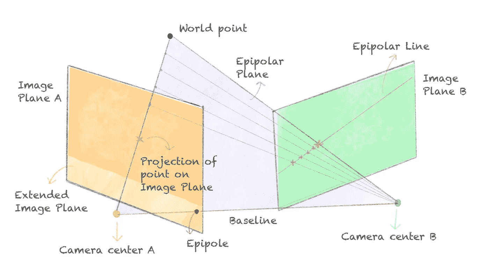

# 对多视图的需求

在相机的针孔模型中，光线从物体上反射并撞击胶片形成图像。因此，位于同一条射线上的所有点将对应于图像中的单个点。

因此，给定图像中的一个点，不可能确定它在世界上的确切位置，也就是说，我们无法从一张图像中恢复深度。

我们也不能从图像中恢复结构。这方面的一个例子是阴影艺术，艺术家使用手势制作美丽的阴影。只看影子，我们无法对这个姿势做出任何评价。

在本文中，我们将学习使用两种观点来处理这种歧义。

# 极线约束

假设我给你两张从不同角度拍摄的图像。我在其中一幅图像中显示一个点，并要求您在另一幅图像中找到它。你会怎么做？这里有一个想法:你可以在图像中的点周围取一小块，并将其滑过另一幅图像，看看哪里最匹配。

然而，一旦你看了几何图形，你会意识到你不需要扫描整个图像，因为点必然位于一条线上，如下图所示。


直觉告诉我们，在现实世界中，该点可以位于连接其投影和相机中心的线上的任何位置。因此，我们可以推断，这个点在另一幅图像中的投影可以位于投影线上的任何位置。这条投影线叫做核线。所以现在我们的搜索空间减少到这一行。这被称为极线约束。

在本文中，我们将讨论如何用代数方法求解核线。在此之前，让我们熟悉核几何中的关键定义。

## 关键术语

*   **基线**:连接两个摄像机中心的线。
*   **核线**:投影点所在的线。核线成对出现，每条线代表一幅图像。
*   **极线平面:**包含基线和世界上一个点的平面。核平面在图像平面的核线处与图像平面相交。
*   **极线**:基线与图像平面相交的点。对应于不同点的所有极线在极线上相交。为什么？我们看到核平面在核线处与像平面相交。现在，对应于不同点的每个核平面将具有共同的基线。由于核线是基线与图像平面相交的地方，这意味着所有的核线都将核线作为公共点。换句话说，所有的核线都在核线上相交。此外，核不必位于图像内，它可以位于扩展的图像平面上。

# 相机矩阵

在这一部分，我们将回顾齐次坐标和相机矩阵，我们将继续使用。如果你已经熟悉它们或者你已经读过我以前关于相机校准的文章，你可以跳过这一节。

## 齐次坐标

考虑一点`(u, v)`。为了用它的同质形式来表示它，我们简单地添加另一个维度，就像这样:`(u, v, 1)`。之所以这样表示，是因为平移和透视投影在齐次空间中变成了线性操作；也就是说，它们可以通过矩阵乘法一次性计算出来。我们将在本文的后面部分详细讨论齐次变换矩阵。

齐次坐标的一个关键特性是它们是尺度不变的；含义，`(kx, ky, k)`和`(x, y, 1)`代表 k≠0 和 k ∈ **R** 的同一点。要从齐次表示转换为欧几里得表示，我们只需除以最后一个坐标，如下所示:

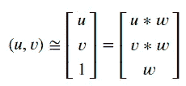

齐次的欧几里得表示

如果你想一想，从原点穿过点`[x, y, 1]`的直线也有`k[x, y, 1]`的形式。所以我们可以说图像空间中的一个点被表示为均匀空间中的一条射线。

**一条线的齐次表示:**考虑熟悉的方程`ax + by + c = 0`。我们知道它代表一条通过点`(x, y)`的直线的方程。现在，这个等式也可以表示为`l⊺p=0`其中`l`是`(a, b, c)` , `l⊺`是`l`的转置，`p`是`(x, y, 1)`。`p`本质上是点`(x, y)`的齐次表示。

现在，`l`是比例不变的，因为如果你乘以一个常数，等式`l⊺p=0`不会改变。因此我们可以说`l`是直线的齐次表示。

总而言之，给定一个齐次点`p`，等式`l⊺p=0`(或`p⊺l=0`)表示`p`位于直线`l`上。请记住这一点，因为我们将在讨论基本矩阵时再次讨论它。

## 相机外部矩阵

相机外部矩阵是将点的坐标从世界坐标系转换到相机坐标系的基矩阵的变化。它让我们从摄像机的角度来看这个世界。它是旋转矩阵和平移矩阵的组合，旋转矩阵确定摄像机的方向，平移矩阵移动摄像机。该等式可以表示为:

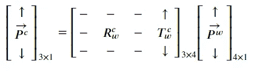

这里的符号如下:

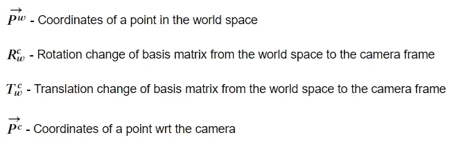

关于相机外部矩阵的更多细节，请查看我的另一篇文章。

## 相机固有矩阵

一旦我们使用相机外部矩阵得到相机上的点的坐标，下一步就是将它们投影到相机的图像平面上以形成图像。这是相机固有矩阵的工作。在我的另一篇文章中[已经深入讨论了相机固有矩阵，但是概括来说，相机固有矩阵将相机给出坐标的点投影到相机的图像平面上。它本质上编码了相机胶片的属性。该等式如下所示:](/camera-intrinsic-matrix-with-example-in-python-d79bf2478c12)

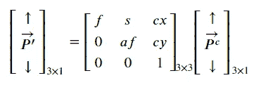

这些符号是:

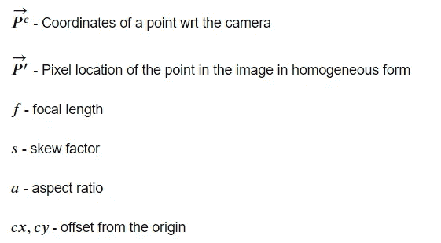

## 图像形成流水线

因此，给定世界上的一个点和一个相机，我们以齐次形式表示该点，并乘以外部矩阵来获得它在相机框架中的坐标。然后我们乘以固有矩阵，得到它在摄像机像面上的投影。最后，我们转换回欧几里得坐标，以获得该点在图像中的像素位置。这是图像形成管道，如下所示:

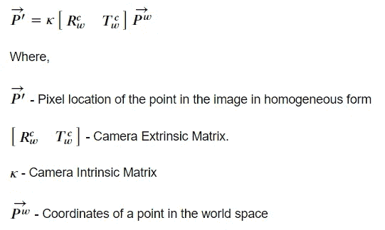

# 本质矩阵

好的，我们现在将讨论立体几何的基础——本质矩阵。让我们推导一下，看看它有什么作用。

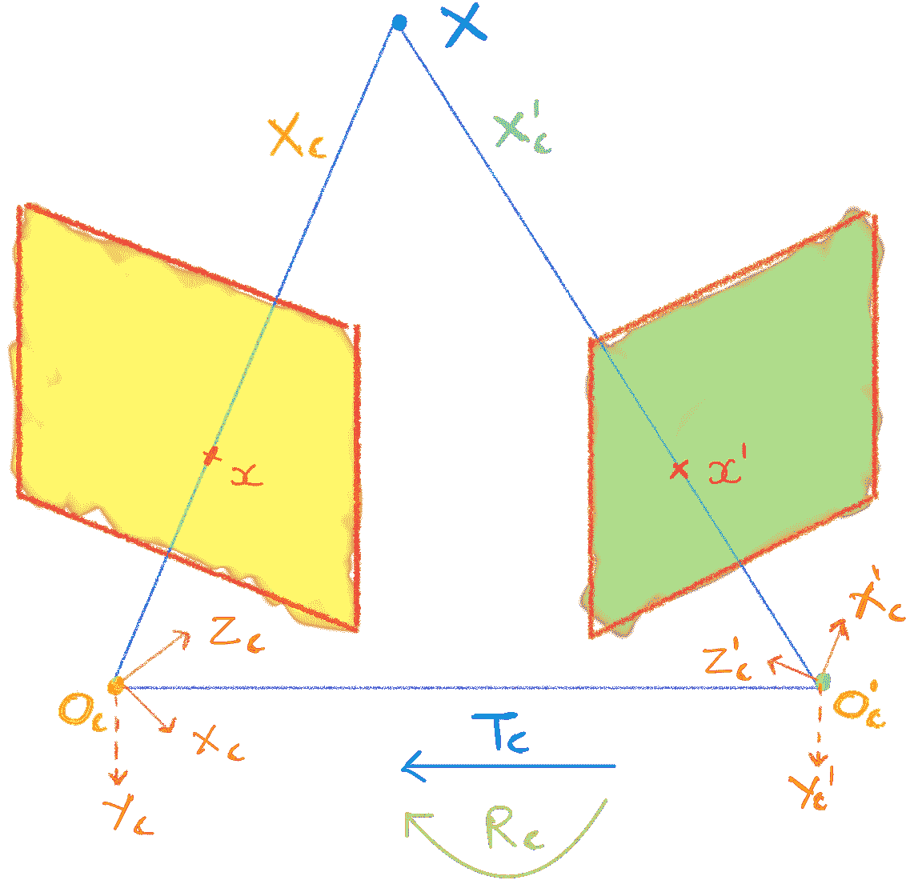

相对位置和方向已知的两台摄像机的校准系统

考虑一个校准系统，其中我们知道两个摄像机的*相对*位置和方向。让摄像机中心表示为 *Oc* 和*Oc*’。设 *X* 为世界上的一点。让我们把 *X* wrt 摄像机框 *Oc* 的坐标表示为 *Xc* ，wrt *Oc* 表示为*Xc*’。设 *Rc* 和 *Tc* 为基矩阵从 *Oc* 到*Oc*’的旋转和平移变化。意思是给定坐标 *X* wrt *Oc* ，我们可以找到它们 wrt*Oc*′*为:*

**

## *叉积矩阵*

*先绕个小弯子，说说向量叉积。两个矢量 *a，b* 的叉积将是一个与它们都垂直的矢量，用`a×b = [-a3b2 + a2b3, a3b1-a1b3, -a2b1 + a1b2]`表示，其中`a = [a1, a2, a3] and b=[b1, b2, b3]`。*

*我们可以用矩阵形式来表示:*

**

*作为矩阵表示的叉积*

*这种矩阵形式的叉积表示为`[a×]b`，其中`[a×]`是一个 3 × 3 矩阵，`b`是一个 3 × 1 向量。*

****

*叉积矩阵*

*现在，一个向量和它自身的叉积是零。即`a×*a* = [a×]a = 0`。所以我们可以说`[a×]`是一个秩为 2 的反对称矩阵。*

*回到我们的等式:*

**

*用向量 *Tc* 取两边的叉积，我们得到:*

**

*`Tc × Tc = 0`。接下来，我们用向量*Xc*’在两边取点积:*

**

*现在，矢量𝑇 × *Xc* 与 *Xc* 垂直。因此，*Xc*’。(𝑇×*xc*’)= 0。*

**

*现在， *Tc* 和 *RcXc* 都是三维向量。因此，我们可以用矩阵形式表示它们的叉积:*

**

*最后，我们可以将等式表示为:*

****

*矩阵 *E* 被称为本质矩阵，它涉及两个不同摄像机帧中一个点的坐标。*

## *寻找极线*

*现在，我们如何使用本质矩阵找到核线？让我们更深入地看看这个等式。*

**

*本质矩阵方程*

*这里 *Xc* 是点 *X* wrt 摄像机画面 *Oc 的坐标。*这意味着我们可以将连接 *X* 和 *Oc* wrt *Oc* 的直线上的任意一点表示为𝛼 *Xc* 其中𝛼是某个常数。现在，如果我们在等式中用*𝛼*xc**替换 *Xc* ，它仍然满足。***

****

**类似地，我们可以用𝛽代替 Xc，其中𝛽是某个常数，等式保持不变。**

**因此，我们可以说本质矩阵方程由位于连接该点和它们各自相机中心的投影射线上的任意两点满足，其中点的坐标用它们的相机框架表示。**

**设 *x* 𝑐和*xc*’为点 *X* 在摄像机 *Oc* 和 o𝑐′.图像平面上的投影它们必须满足基本矩阵方程，因为它们沿着射影射线。所以我们可以写:**

****

**现在 *xc* 是一个 3 × 1 向量，而 *E* 是一个 3 × 3 矩阵，所以它们的乘积将是一个 3 × 1 向量。我们用 *l* 来表示吧:**

****

**这个等式对你来说应该很熟悉。正如上一节所讨论的，这个等式表示齐性点*xc*′*位于直线 *l 上*我们可以说 *l* 是对应于点 *xc、*和*xc*′*位于这条直线上的核线。这是极线约束的数学形式。****

******

***同样，如上式所示，*l*’*是点*xc*’**xc*所在的极线。*****

**因此，给定一个点在一个视图中的投影，我们将其乘以本质矩阵，以获得该点在另一个视图中的投影所在的核线。**

**这在实践中实现起来有点棘手，但我已经帮你搞定了。**

# **Python 示例**

**本文的所有代码都可以在这个[资源库](https://github.com/wingedrasengan927/Stereo-Geometry)中找到。设置环境的说明也可以在那里找到。这是本节的[笔记本](https://github.com/wingedrasengan927/Stereo-Geometry/blob/master/Essential%20Matrix.ipynb)。现在浏览一下，我将在下面提供一步一步的分解。**

## **设置环境**

**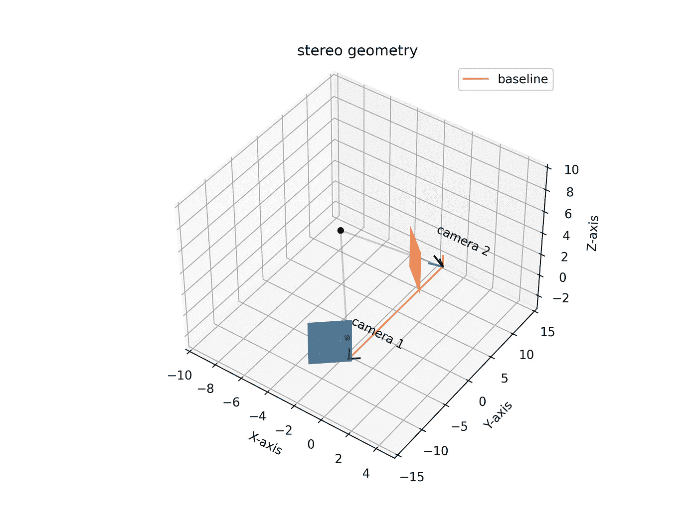**

**首先，我们为两个摄像机定义外部参数，使它们以一定角度相隔一定距离放置。外部参数包括摄像机的位置和方向。**

**接下来，我们定义决定图像形成的内在参数。这里我们已经定义了图像平面的大小和焦距，焦距本质上是图像平面离相机中心有多远的度量。**

**我们还定义了世界上的一个点，使它被两个摄像机捕捉。在本例中，我们将找到该点投影的核线。**

**在两个视图中捕获的图像如下所示:**

**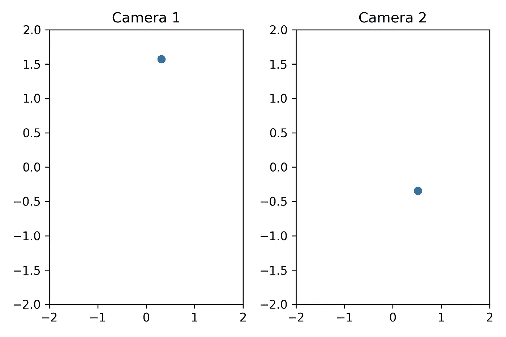**

## **计算本质矩阵**

**为了找到本质矩阵，我们需要找到两个相机之间的相对几何关系，这样，给定一个点在相机 1 上的坐标，我们应该能够找到它在相机 2 上的坐标。**

**现在，我们知道摄像机外部矩阵是从世界坐标系到摄像机坐标系的基矩阵的变换。使用该信息，从摄像机 1 到摄像机 2 的基矩阵的变化可以计算如下:**

```
**change of basis matrix from camera 1 to camera 2 = (change of basis matrix from world to camera 2) × (change of basis matrix from camera 1 to world)⟹ change of basis matrix from camera 1 to camera 2 = (change of basis matrix from world to camera 2) × (inverse of change of basis matrix from world to camera 1)⟹ change of basis matrix from camera 1 to camera 2 = (Extrinsic Matrix of camera 2) × (inverse of Extrinsic matrix of camera 1)**
```

**一旦我们获得这个基矩阵的变化，我们就可以提取相机的相对方位和偏移。这个 3 × 4 矩阵的前 3 列将给出方向 *Rc* ，最后一列将给出偏移 *Tc* 。**

**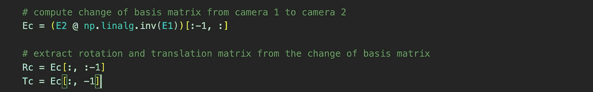**

**然后我们计算 *Tc* 的叉积矩阵，并将其乘以 *Rc* 以获得本质矩阵。**

**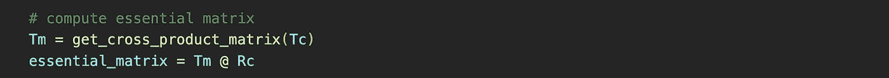**

**作为健全性检查，我们可以验证基本矩阵方程。**

**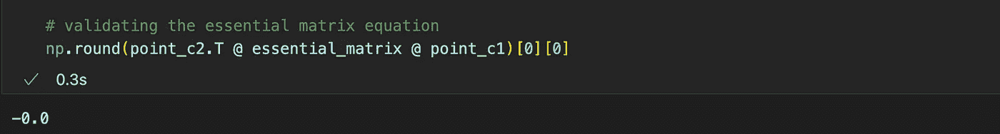**

## **绘制核线**

**为了找到核线，我们首先需要找到该点在相机图像平面上的投影。在这个例子中，我通过反复试验手工绘制了这些点，但是我们将在后面的部分中看到找到它们的更好的方法。**

**一旦我们找到这些点，我们将它们与各自的外部矩阵相乘，以获得相机帧的坐标。然后我们把它们代入本质矩阵方程，找到对应的极线。**

**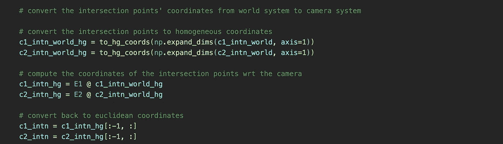**

**例如，如果我们知道相机 1 中的投影点，我们将它乘以本质矩阵以获得相机 2 中的核线。然后我们在 2D 图像空间中绘制这条线。为了验证相机 2 中的投影点位于这条线上，我们将其转换为欧几里德坐标，并在相同的空间中绘制。我们对另一台摄像机重复同样的过程。**

**图像空间中的投影点及其对应的极线如下所示:**

**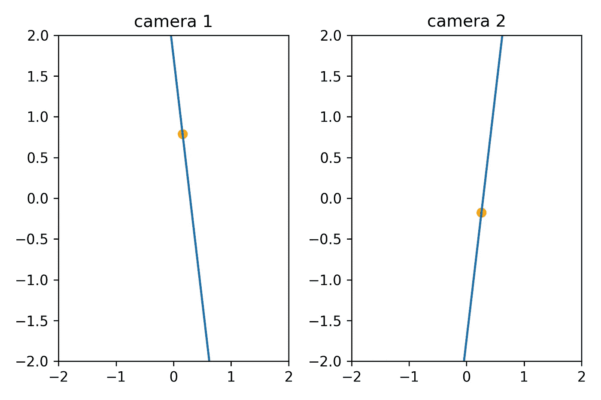**

**图像中的核线**

# **平行图像平面**

**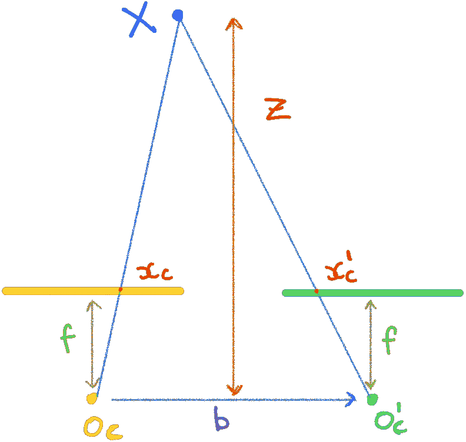**

**两台平行摄像机的俯视图**

**如果图像平面相互平行会发生什么？在上面的系统中，我们有两个相机，它们的光轴沿着 Y 轴彼此平行。让我们假设摄像机中心在 X 轴上，并且相距 *b* 距离。**

**由于相机是平行的，它们之间没有相对旋转。因此 *Rc* 将是一个单位矩阵，并且 *Tc* 将等于`[-b, 0, 0]` (-ve 符号，因为 *Tc* 表示基运算的变化，它是变换运算的逆运算)。因此，我们可以将本质矩阵计算为:**

********

**平行像平面中的本质矩阵**

**设 *x* 𝑐和*xc*’为点 *X* 在摄像机 *Oc* 和 o𝑐′.图像平面上的投影如果我们假设两台相机的焦距都是 *f，*我们可以写成*`xc = [x, y, f]`**`xc′ = [x′, y′, f]`。我们可以将它们代入基本矩阵方程，如下所示:*****

************************************

***平行像平面的极线方程***

***我们可以看到核线具有相同的 Y 坐标，这意味着它们沿着 X 轴平行。因此，我们可以说，如果两个相机彼此平行，它们的极线在图像空间中也将是平行的。***

***下图说明了这一点:***

***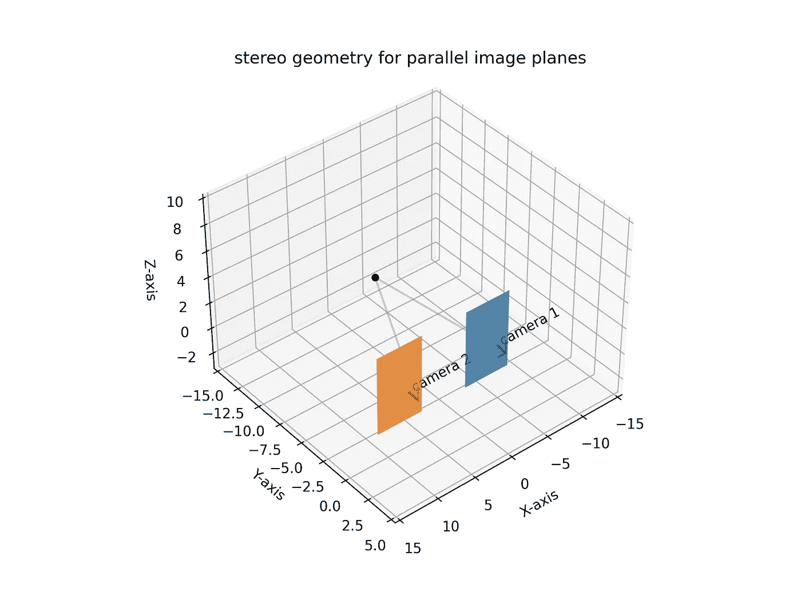******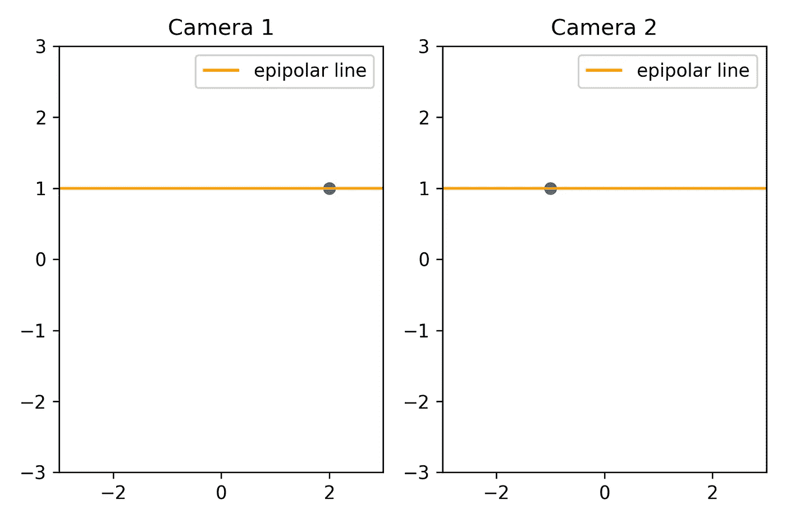***

***这部分的代码可以在这里找到[。](https://github.com/wingedrasengan927/Stereo-Geometry/blob/master/Parallel%20Image%20Planes.ipynb)***

***如果相机沿 Y 轴平行，图像中的核线将是水平的；如果它们沿着 X 轴平行，核线将是垂直的。***

# ***基础矩阵***

***在现实生活中，我们很少有关于世界上点的位置的信息。但是，我们可以在图像中找到它们的位置。因此，我们需要修改本质矩阵方程，以说明点的图像位置。***

***现在，给定相机框架上的一个点，固有矩阵负责将其投影到相机的图像平面上。***

******

***我们可以把κ送到另一边，把等式改写成:***

******

***因此，给定图像中的一个点，我们以齐次形式表示它，并乘以固有矩阵的逆矩阵，以获得该点在世界上的齐次表示。***

***现在，我们不能从图像中精确定位世界上该点的确切位置，因为齐次坐标是比例不变的，并且该点可以位于射线上的任何位置。***

***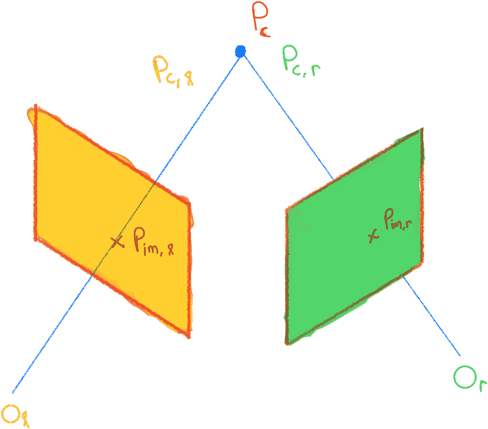***

***考虑两个摄像机帧 *l* 和 *r* ，以及投影在两个图像平面上的点 *Pc* 。这里的基本矩阵方程是:***

****

**在这个等式中，我们可以像这样替换齐次图像坐标:**

************

**基本矩阵方程**

**这被称为基本矩阵方程。**

**本质矩阵在两个不同的*视图*中关联同一点的坐标，而基础矩阵在两个不同的*图像*中关联它们。**

**在前面的例子中，我们可以计算基本矩阵并绘制核线，如下所示:**

******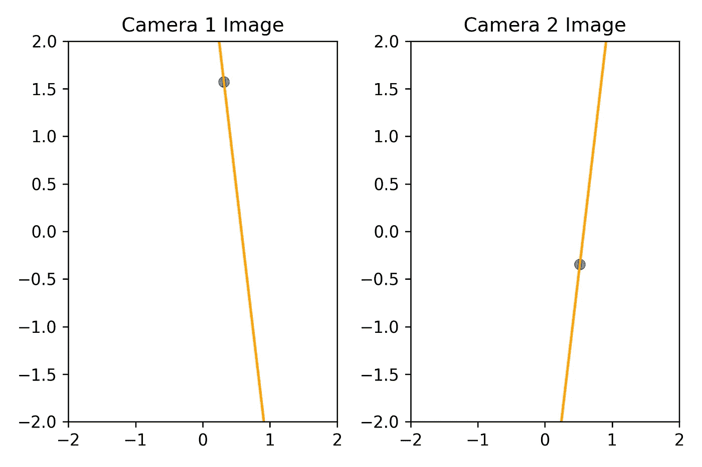**

**如果你观察，核线看起来和以前完全一样，但是，这一次它们是使用基本矩阵方程从图像坐标直接计算出来的。**

# **从点对应关系计算基本矩阵**

**在现实世界中，我们很少使用经过校准的系统。然而，由于基本矩阵直接与图像点相关，我们仍然可以在没有任何世界和相机知识的情况下找到它。以下是方法。**

**设`(u, v)`和`(u′, v′)`代表两幅不同图像中的同一点。我们可以用齐次形式表示它们，并代入基本矩阵方程:**

****

**这里 *f1，f2，…* 表示基本矩阵的未知参数。上面的等式代表了一个同质系统，我已经在我的另一篇文章[这里](https://medium.com/p/5147e945cdeb)中深入讨论了它们。然而，我将在这里再次讨论直觉。**

**第一步是将等式改写为:**

**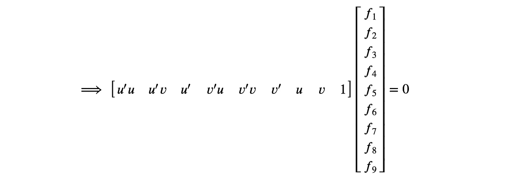**

**以这种方式重写的原因是，我们可以在同一个等式中堆叠许多点对应，如下所示:**

**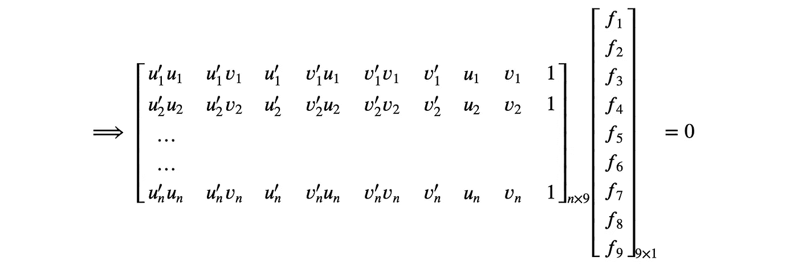**

**这个等式可以用矩阵符号表示为 *Af* ⃗ *= 0，*其中 *A* 是点对应矩阵，而向量 *f* ⃗ 是平坦化的基本矩阵。现在， *f* ⃗可以用它的大小 *|f* ⃗ *|* 将方程两边分开做成单位矢量。**

**通过计算*| ax*|⃗*|*的最小值，可以找到受约束*| x*|⃗*| =*1 的类型为 *Ax* ⃗ *= 0* 的方程的解。**

**在我的另一篇文章中，我已经讨论过，如果单位向量𝑥⃗沿着𝐴⊺𝐴.的最小特征向量，那么|𝐴𝑥⃗|将是最小的**

**这被称为线性最小二乘估计。**

## **八点算法**

**想法是找到图像和计算矩阵𝐴 *之间的点对应关系。*然后通过计算𝐴⊺𝐴的最小特征向量，将其整形为 3×3 矩阵，就可以找到基础矩阵。**

**计算 *f* 至少需要多少个点？现在， *f* 有 9 个未知数，所以你会说我们需要 9 个方程或 9 个点来求解它。但是如果你观察， *f* 是比例不变的，这意味着我们可以将 *f* 乘以任何常数，等式 *Af* ⃗ *= 0* 仍然成立*。*所以我们可以用 f 的一个值来除 f，如下所示:**

**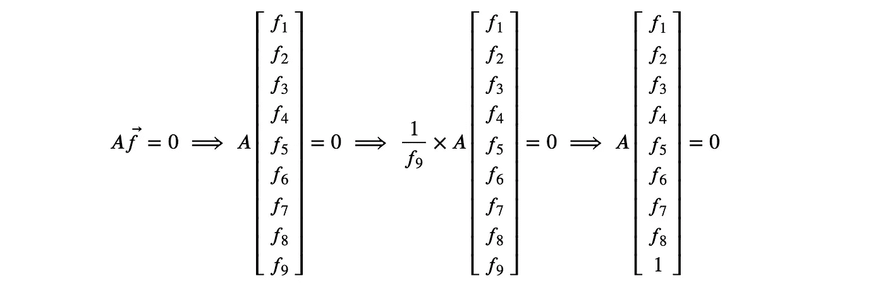**

**现在看到有 8 个未知数要解，我们最少只需要 8 个点。**

**我们还需要考虑另一件事。你看，3 ×3 基本矩阵 F 的秩= 2。我们不会在这里讨论证明，但这与叉积矩阵的秩为 2 的事实有关。**

**因此，考虑到这一点，我们对矩阵 F 执行奇异值分解，使其最后的奇异值为零，并再次重新组合。**

**八点算法的代码如下所示:**

## **标准化八点算法**

**现代图像的分辨率高达 4000-6000 像素。这导致点对应中的大量变化，这可能会破坏算法。因此，为了说明这一点，我们在将这些点插入八点算法之前对它们进行归一化。**

**这个想法是，对于每幅图像，我们计算对应点的质心(平均值),并从每幅图像中减去它。接下来，我们对它们进行缩放，使其与质心的距离(方差)为√2，如下所示:**

****

**归一化点对应**

**接下来，我们创建一个执行上述转换的矩阵，并使用它来转换点，如下面的代码所示:**

## **寻找极点**

**我们知道核线是图像中所有核线相交的点。数学上它可以表示为:**

****

**其中 *l1、l2、…* 为极线， *e* 为极线。这可以用矩阵形式表示为:**

**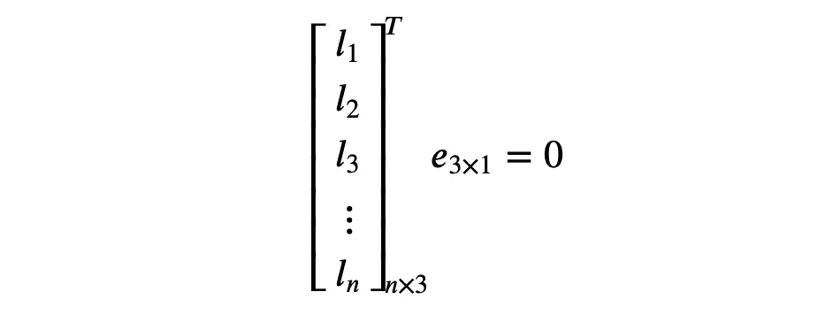**

**现在这看起来像一个齐次方程组。因此，为了找到极点，我们可以使用上一节*中讨论的线性最小二乘估计来找到 *Le* ⃗ *= 0* 的解决方案。***

*但是等等，核线可以从基本矩阵中计算出来。因此，我们可以将等式改写为:*

*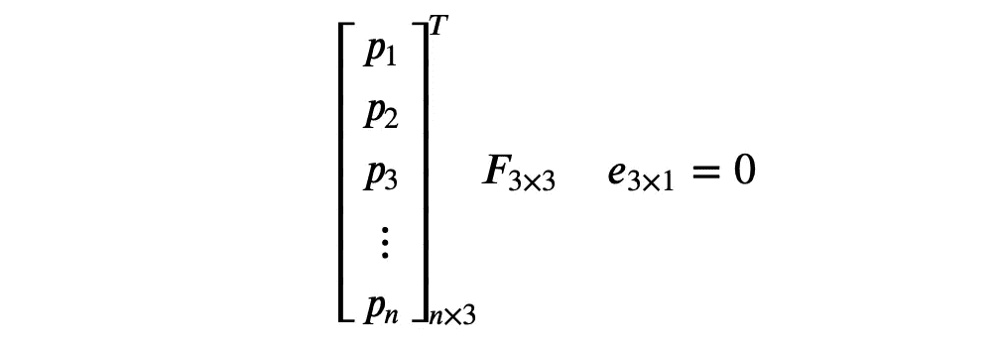*

*现在，为了找到这个方程的解，我们简单地计算 F 的线性最小二乘估计，这是它的最后一个奇异值。*

*计算核线的代码如下所示:*

*为了找到另一幅图像的极点，我们找到了 F 转置的线性最小二乘估计。*

# *Python 示例*

*好的，让我们看看基本矩阵的运行情况。*

*笔记本可以在这里找到[。让我们走一遍。](https://github.com/wingedrasengan927/Stereo-Geometry/blob/master/Fundamental%20Matrix%20and%20Stereo%20Rectification.ipynb)*

*首先，我们需要同一物体的两幅图像。所以我打开我的虚幻编辑器，放置两个摄像头看着同一个物体，然后截图。*

*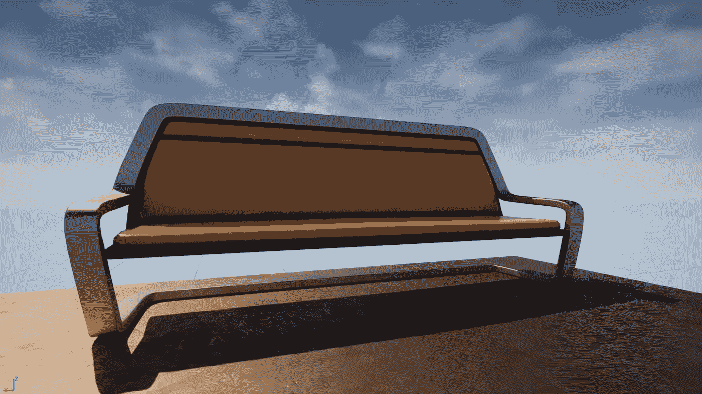*

*来自左侧摄像机的图像*

**

*来自右侧摄像机的图像*

*接下来，我们需要两幅图像之间的点对应或匹配。在这里，我已经手动标记了它们，但在现实世界中，我们可以使用像 SIFT 这样的算法来自动计算它们。*

*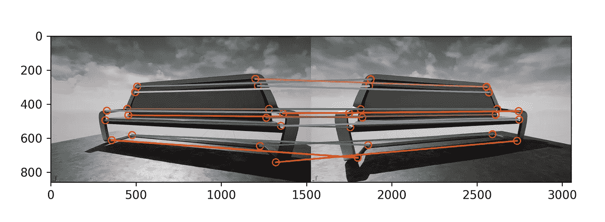*

*点对应*

*好了，现在我们可以用归一化的八点算法从这些点计算基础矩阵。*

*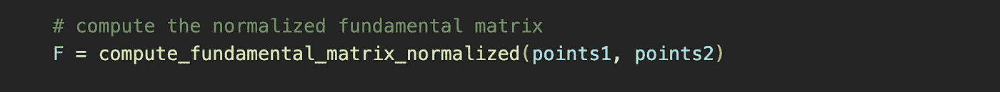*

*我们还可以使用计算出的矩阵来验证基本矩阵方程。*

*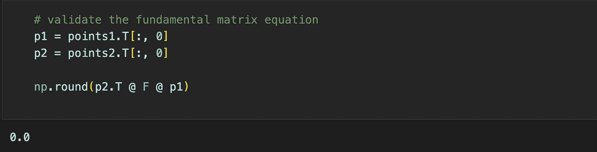*

*让我们为两幅图像绘制核线。*

*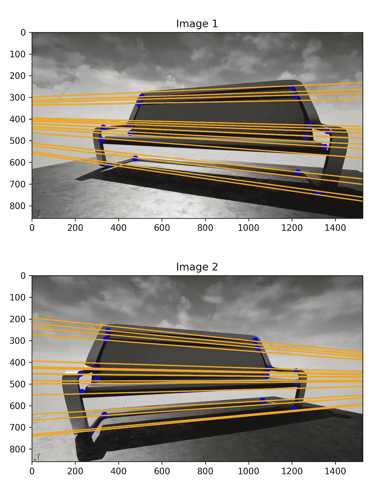*

*核线*

*我们可以看到对应于一幅图像的核线穿过另一幅图像中的点。*

*接下来，让我们找到并绘制极点。*

*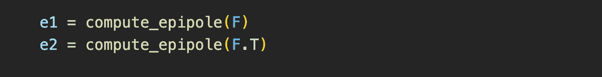*

*基本矩阵方程也适用于极点，因为它们也是图像平面中的点。*

*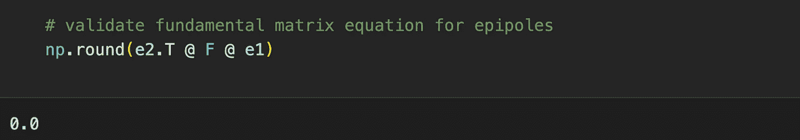**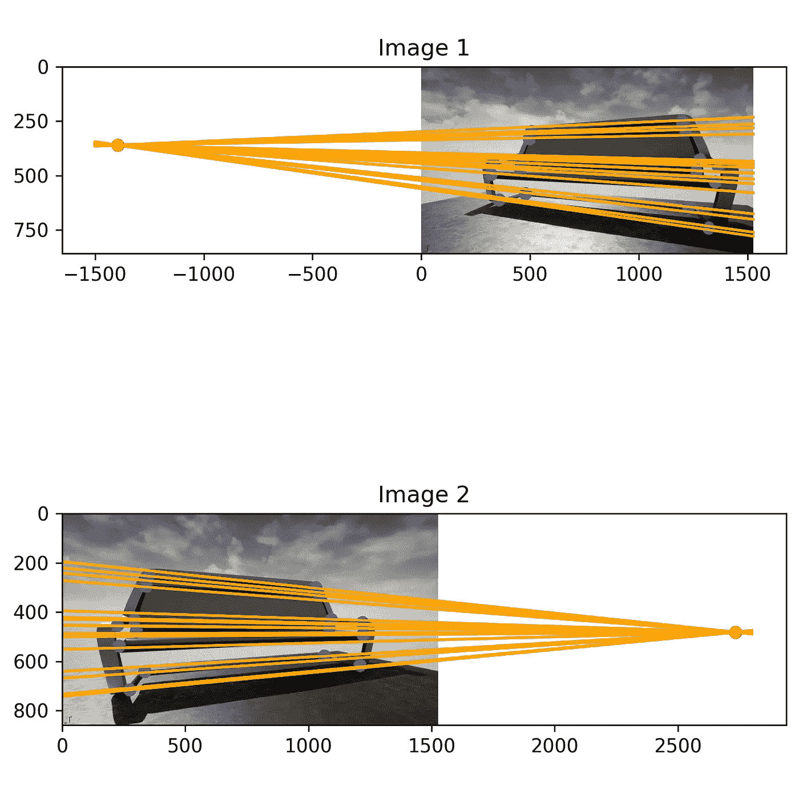*

*极点*

*我们可以在这里看到核线位于图像之外，所有的核线都在那里相交。*

# *立体校正*

*因为核线是平行的，所以很容易处理具有平行图像平面的图像。然而，有可能通过战略性地扭曲*使*它们平行。这个过程叫做立体矫正。我们来看看怎么做。*

*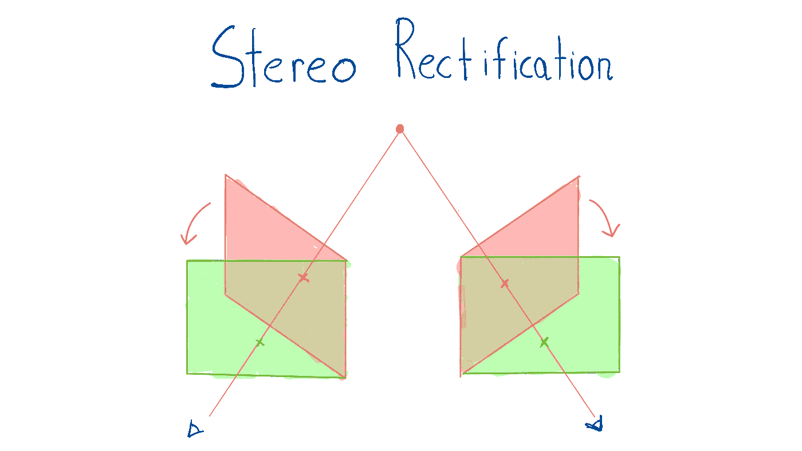*

*对于平行图像，极线位于水平轴的无穷远处。所以第一步是创建变换矩阵，将一个点移动到无穷远。*

*我们需要三个变换矩阵:一个将点旋转到水平轴，一个将点移动到无穷远，一个将原点平移到中心。让我们来看看每一个。*

## *将点旋转到水平轴*

*给定一个与 X 轴成θ角的点，我们创建一个旋转矩阵，将它旋转-θ，并使它回到 X 轴，如下所示:*

*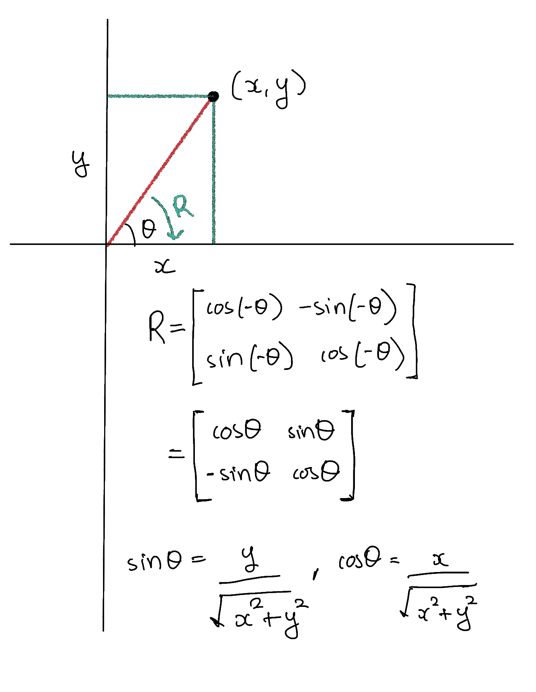*

*将点旋转回 X 轴的旋转矩阵*

***注意:**如果点位于 X 轴的另一侧，符号将会反转。*

*因为我们在处理齐次坐标，我们需要考虑额外的维度。*

*齐次坐标的通用变换矩阵，也称为单应矩阵，如下所示:*

*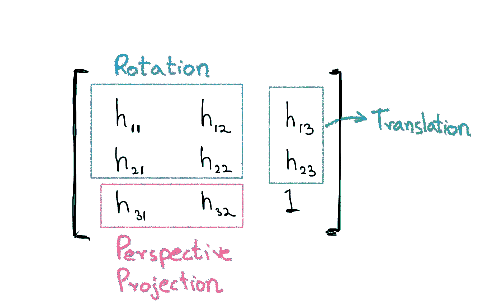*

*单应矩阵*

*因此，将齐次坐标旋转回 X 轴所需的矩阵为:*

**

## *将点移动到无限远*

*接下来我们需要将点移动到无穷远处。无穷远处的一点被表示为`(∞, 0) or (-∞, 0)`。同样可以在齐次坐标中表示为`(x, 0, 0)`，如下所示:*

**

*因此，给定 X 轴上的一个点，以齐次形式表示为`(x, 0, 1)`，我们需要一个矩阵将其转换为`(x, 0, 0)`。*

*下面的矩阵完成了这项工作:*

*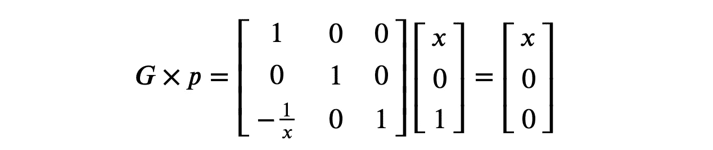*

*这里的 y 坐标是零，因为我们已经把这个点旋转回 X 轴了*

## *将原点移动到中心*

*默认情况下，Python 假设图像的原点位于左上角，因此我们需要创建一个平移矩阵来将原点移动到中心。*

**

*向中心移动的平移矩阵*

*在应用转换后，我们可以将它移回原来的位置。*

## *扭曲图像*

*因此，组合上述矩阵的总变换矩阵由下式给出:*

**

*想法是我们用上面的矩阵变换点，然后为了“撤销”效果，我们用矩阵的逆矩阵扭曲整个图像。*

*使用这种技术，我们可以扭曲一个图像。现在，如何扭曲另一个图像？理查德·哈特利在他的[论文](https://users.cecs.anu.edu.au/~hartley/Papers/joint-epipolar/journal/joint3.pdf)中认为，为了获得最好的结果，两幅立体图像需要对齐，这意味着变换后的点对应之间的距离应该最小。*

*因此，匹配的单应矩阵 H1 可以通过最小化变换后的点对应之间的平方距离的和来找到:*

**

*我们不会在这里讨论计算 H1 的证明，但是我在最后的参考文献部分为感兴趣的读者提供了链接。*

*计算 H1 和 H2 的代码片段如下所示:*

*好吧，让我们纠正我们的例子中的图像。*

*一旦我们计算出单应矩阵，就可以使用它们的逆来扭曲图像，如下所示:*

*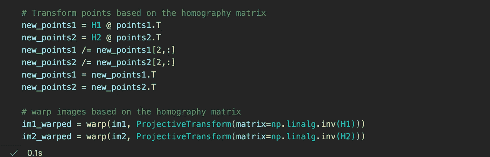*

*使用单应矩阵的扭曲图像*

*我们现在已经校正了具有平行图像平面的图像，所以核线仅仅是通过这些点的水平线。*

*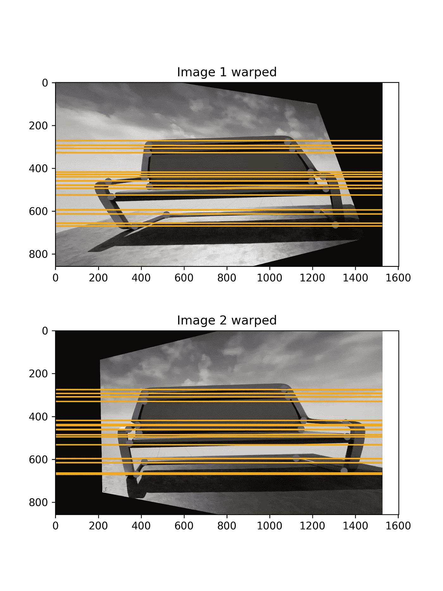*

*扭曲图像的平行核线*

## *经验观察*

*如果我使用归一化八点算法计算扭曲图像的基本矩阵和核线，结果并不准确，如下所示:*

*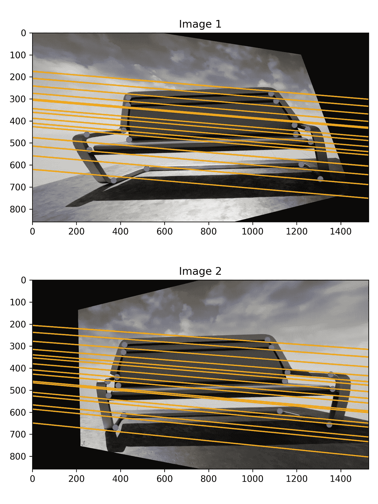*

*不准确的极线*

*我不知道确切的原因，但我认为算法被破坏了，因为极点在无穷远处。让我知道你的想法。*

*校正后的图像现在可以用于各种下游任务，如视差估计、模板匹配等。*

*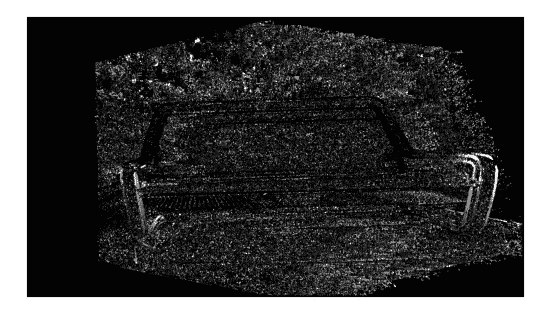*

*使用校正图像计算的视差图*

# *结论*

*好了，我们到了终点。在本文中，我们研究了处理从两个视图捕捉的图像的技术。我们还看到了如何使用立体校正从两幅图像中估计出某些模糊度，如深度。如果我们有多个视图，我们也可以使用一种叫做*的技术从运动中估计场景的结构*。*

*此外，随着深度学习的最新进展，所有这些模糊性都可以从单个图像中估计出来。我们可能会在以后的文章中讨论它们。*

*我希望你喜欢这篇文章。*

*我们来连线。你也可以通过 [LinkedIn](https://www.linkedin.com/in/neerajkrishnadev/) 和 [Twitter](https://twitter.com/WingedRasengan) 联系我。如果你有任何疑问或建议，请告诉我。*

# *参考*

1.  *[cs231a 注释](https://web.stanford.edu/class/cs231a/course_notes/03-epipolar-geometry_2022.pdf)*
2.  *[https://github.com/chizhang529/cs231a](https://github.com/chizhang529/cs231a)*
3.  *[理查德·哈特利立体纠正的理论与实践](https://users.cecs.anu.edu.au/~hartley/Papers/joint-epipolar/journal/joint3.pdf)*

# *图像制作者名单*

*本文展示的图片均为作者。*