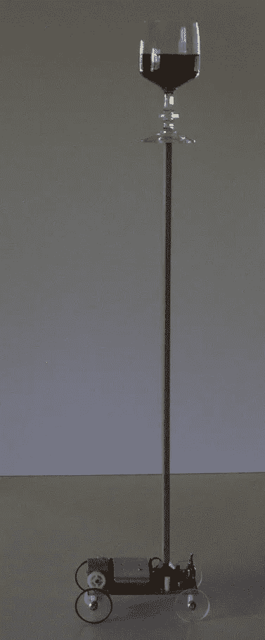
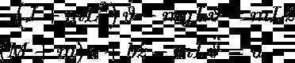
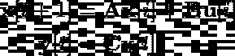

# 强化学习的控制理论介绍

> 原文：<https://towardsdatascience.com/a-control-theoretic-introduction-to-reinforcement-learning-3c2972498c17>

## 第 1 部分:搭建舞台

带有芯片的人工神经网络，由利亚姆挂在[闪烁的](https://www.flickr.com/photos/chen-meng/49203125457)上。许可证 CC-BY 2.0

[强化学习](https://en.wikipedia.org/wiki/Reinforcement_learning)是三种基本的机器学习范式之一，与[监督](https://en.wikipedia.org/wiki/Supervised_learning)和[非监督](https://en.wikipedia.org/wiki/Unsupervised_learning)学习并列。在过去的十年中，它已经成为解决复杂工程任务的最成功的方法之一。DeepMind 通过 [AlphaGo](https://en.wikipedia.org/wiki/AlphaGo) 或 [AlphaFold](https://en.wikipedia.org/wiki/AlphaFold) 取得的成功就是最好的例证。但是，尽管它越来越受欢迎，强化学习依赖于数学技术和 vocab，与监督或无监督学习的常规实践者可能习惯的完全不同。这是从熟悉线性最优控制理论的人的角度看强化学习的系列文章的第一篇。通过这样做，我希望揭开几个概念的神秘面纱，澄清关于强化学习的常见误解，并强调它与经典控制理论的紧密联系。

## 搭建舞台

在深入研究强化学习的数学之前，让我们先来看看将伴随我们整个旅程的机械系统。如下图所示。

平衡车，1976 年左右的简单机器人系统。推车包含一个伺服系统，监控杆的角度，并来回移动推车以保持直立。来自[维基百科](https://en.wikipedia.org/wiki/Inverted_pendulum)。

俗称*小车倒立摆*或简称**小车**。这是控制理论中一个相当普遍的问题。实际上它是如此受欢迎，以至于它进入了 OpenAI [体育馆](https://www.gymlibrary.dev/)图书馆的[经典控制环境](https://www.gymlibrary.dev/environments/classic_control/)。

你们中有物理学背景的人应该对推导这个机械系统的控制方程没有问题。在小角度极限下，这些等式表示为

其中上标点表示时间导数。我们的系统因此具有四个自由度: *z* (t)是小车的水平位置， *ϑ* (t)是摆锤相对于垂直方向的角度位置， *ϑ=0* 是直立位置。另外两个自由度是小车的水平速度和摆的角速度。参数如下: *m* 为杆的质量， *M* 为大车的质量， *L* 为杆的长度， *J* 为其惯性， *b* 为大车与地面的摩擦常数。小角度限制的原因是它导致**线性**运动方程。这样做的主要好处是使我们的问题易于分析，这在试图理解事物时是非常可取的。

为了进一步简化问题，我们还将*根据时间离散化*这些方程。这将允许我们用和或差来代替积分和微分学，公认更容易操作。这导致下面的*线性移位不变*(或*离散时间*)动力系统

使用哪种技术来离散方程并不重要，无论是隐式还是显式欧拉法，一阶还是二阶格式等等。数学仍然是一样的。此外，在你的离散时间步长δt 趋于零的限度内，你应该得到相同的解！

在这个模型中，**x**[*I***是系统在 *tᵢ* 时刻的四维状态向量，而 **u** [ *i* 是当时对系统的输入，也就是当前作用在推车上的力。矩阵 **A** 是一个 4×4 矩阵，描述了小车的*自然动态*，即在没有外部驱动的情况下它将如何演变。矩阵 **B** 是一个 4×1 矩阵。描述输入 **u** [ *i* 如何影响下一个状态 **x** [ *i+1* ]。最后， **C** 是描述我们正在进行的测量的 q×4 矩阵，其中 q 是测量的次数，而 **y** [ *i* ]是我们在时间 *tᵢ* 进行的测量的实际向量。这些测量可以简单到观察系统的单个状态变量，或者它们的线性组合。如果 q <为 4，那么我们就面临一个*部分观测到的*控制问题。另一方面，如果 **C** 是例如 4×4 单位矩阵，那么我们就处于全状态信息设置中。这些情况中的每一种都需要稍微不同的过程，我们将在本系列的剩余部分中探讨这些过程。**

## **游戏的名字是什么？**

**控制理论和强化学习都与设计输入序列{ **u** [ *0* ]， **u** [ *1* ]，…， **u** [ *n* ]}有关，以使我们的系统做我们想让它做的任何事情。在我们的例子中，这决定了施加到推车上的脉冲的顺序，使得钟摆稳定在直立位置。在温和的条件下，控制理论和强化学习实际上会给你完全相同的输入序列。它们本质上不同于它们如何到达那里。当控制理论自然地试图最小化操作系统的成本时，强化学习试图最大化回报的概念。然而，在这两种情况下，我们将不得不制定一个优化问题，并找出如何有效地解决它。**

**如果你想了解更多关于这个问题的控制观点，我强烈建议你看看史蒂夫·布伦顿的 YouTube 频道。史蒂夫现在有 20 多万订户，从我看来，他的频道真的随着他神奇的[控制训练营系列](https://www.youtube.com/watch?v=Pi7l8mMjYVE&list=PLMrJAkhIeNNR20Mz-VpzgfQs5zrYi085m&ab_channel=SteveBrunton)而起飞。就我们而言，我们将从强化学习的角度来看待这个问题。然而，为了让那些对控制理论有所了解的人更清楚，我们仍然使用控制词汇。**

## **接下来是什么？**

**我知道简单的搭建舞台可能会让你们中的很多人感到沮丧，但是请耐心听我说！在学术界，我的时间分为研究、教学和公共宣传。保持这些帖子相对较短(即 5 分钟阅读)有两个主要好处:**

1.  **我可以每周抽时间写一两篇，定期给你更多的内容来满足你学习的欲望。**
2.  **根据我的教学经验，我发现较短但重点突出的帖子更容易消化内容，最终更好地理解内容。**

**那么，接下来会发生什么？嗯，我们将逐步引入新的概念，如状态值函数 *V* ，或质量函数 *Q* 。我们还将研究价值迭代和策略迭代之间的差异，以及在基于模型和无模型的上下文中讨论 Q-learning 的优缺点。在整个系列中，我们将尝试与控制理论中的重要概念建立联系，如系统的可观测性和可控性，其马尔可夫参数，李亚普诺夫和里卡提方程，或线性二次调节器(LQR)和估计器(LQE)，等等。所以系好安全带，下周见！**

> **想看更多这方面的内容？查看我关于[低秩结构和数据驱动建模](https://loiseau-jc.medium.com/list/lowrank-structure-and-datadriven-modeling-8f39635a90ea)的其他文章或者我的[机器学习基础](https://loiseau-jc.medium.com/list/machine-learning-basics-0baf10d8f8b5)！**

**</rosenblatts-perceptron-the-very-first-neural-network-37a3ec09038a> **