# 对数据集的批判性分析

> 原文：<https://towardsdatascience.com/a-critical-analysis-of-your-dataset-2b388e7ca01e>

## 停止微调你的模型:你的模型已经很好了，但不是你的数据

布兰登·洛佩兹在 [Unsplash](https://unsplash.com/s/photos/decision?utm_source=unsplash&utm_medium=referral&utm_content=creditCopyText) 上的照片

人工智能的应用越来越多，模型越来越复杂。与此同时，AI 对数据的渴求，数据的收集和清理仍然是手工方式。

本文汇集了关于为什么适当的数据集收集、清理和评估至关重要的考虑和建议。

**数据是新的石油。但是像石油一样，数据也需要提炼**

图片来自 [Zbynek Burival](https://unsplash.com/@zburival)

近年来，人工智能在医学和商业领域的应用呈爆炸式增长。总的来说，越来越多的公司正在投资人工智能或使用机器学习模型来分析他们的数据。另一方面，整合或训练人工智能模型变得越来越容易。虽然有诸如 [PyTorch](https://pytorch.org/) 、 [TensorFlow](https://www.tensorflow.org/) 和 [scikit-learn](https://scikit-learn.org/stable/) 等标准库，但一些 autoML 解决方案正在涌现。

然而，[90%的公司认为数据是在其业务中发展人工智能战略的最大障碍。事实上，公司往往无法提前确定所需的数据量，如何整合多个来源，如何照顾数据质量，以及对法规的无知。结果是，这会导致成本增加、错过最后期限以及监管机构的问题。此外，](https://www.ibm.com/downloads/cas/VBMPEQLN)[Anaconda](https://www.anaconda.com/state-of-data-science-2020)进行的一项调查显示，超过 60%的时间花在与数据管理相关的操作上(数据加载、清理和可视化)。

在有些领域，获取和管理数据是非常昂贵的。例如，在生物医学领域，查找患者数据(知情同意、许可、样本成本)和给样本贴标签(需要专家和临床医生)都很昂贵。

> “拷问数据，它什么都会坦白。”罗纳德·科斯

一般来说，在数据采集和处理过程中做出的选择会影响模型的最终结果(在可靠性和概化层面)。[举个例子](https://arxiv.org/abs/2111.08006)，在深色皮肤上测试黑色素瘤识别模型时，曲线下的[面积](https://developers.google.com/machine-learning/crash-course/classification/roc-and-auc) (AUC)下降了 10–15%。事实上，在训练集中很少有暗色调皮肤图像的例子，皮肤科医生自己在注释中犯了更多的错误。

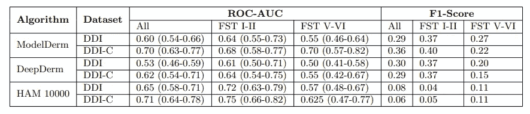

三种皮肤病学算法应用于不同肤色(all、FST I-II 和 FST V-VI)和罕见疾病(all — DDI 和仅常见疾病— DDI-C)的不同皮肤病学图像数据集时的 F1 评分和 ROC-AUC 性能。图片来自原文章:[此处](https://arxiv.org/pdf/2111.08006.pdf)

作者指出，通过改进注释和添加更多例子，他们能够实现对深色肤色图像的更好分类。

**以数据为中心与以模型为中心的视图**

从以模型为中心到以数据为中心的平衡。图片由 [Artem Kniaz](https://unsplash.com/@artem_kniaz) 在[Unsplash.com](https://unsplash.com/)拍摄

[Andrew NG 在 youtube 上说](https://www.youtube.com/watch?v=06-AZXmwHjo&ab_channel=DeepLearningAI)99%的文章是以模型为中心的，只有剩下的 1%的文章是以数据为中心的。但是什么是以模型为中心和以数据为中心呢？

*   **以模型为中心的人工智能**。数据集被认为是固定的，研究人员的重点是优化模型架构，以便在准确性方面获得最佳结果
*   **以数据为中心的人工智能**。相反，目的是关注改进数据管道的方法(选择、注释、清理等等)。

> “人吃什么就是什么。”——[路德维希费尔巴哈](https://en.wikiquote.org/wiki/Ludwig_Andreas_Feuerbach)。AI 模型也是这样吗？他们是他们吞噬的数据吗？

大部分文章关注于改进一个模型(架构或训练的变化)并在[标准基准数据集](https://arxiv.org/pdf/2112.01716.pdf)上评估它。这些数据集不是没有错误的，不应该在没有关键分析的情况下使用。在以数据为中心的方法中，数据集也在研究人员的眼皮底下，可以修改。

此外，以模型为中心的方法已经实现了人工智能模型的指数级改进，但今天精度的提高往往微乎其微。因此，我们需要新的数据集，但同时需要一种重新评估和改进现有数据集的方法。

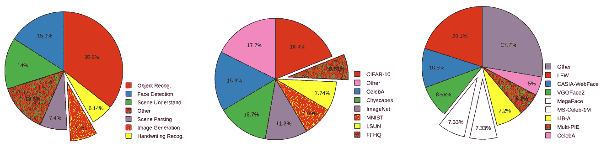

大多数文章几乎总是使用相同的标准数据集。图中显示的是主要数据集及其在文章中的使用百分比。图片来源:[此处](https://arxiv.org/abs/2112.01716)

例如，在收集过程中应更加注意数据质量，但也要用元数据丰富数据集。事实上，[皮肤科 90%关于人工智能的文章](https://jamanetwork.com/journals/jamadermatology/article-abstract/2784295)都没有呈现肤色的信息。因此，在接下来的部分中，我们将讨论如何改进给定数据集的临界点。

**数据采集的智能化设计**

如何创建智能数据管道？亚当的创作来自米开朗基罗(图片来源:[此处](https://it.wikipedia.org/wiki/Cappella_Sistina))

> “数据就像垃圾。在你收集它之前，你最好知道你打算用它做什么。”——马克·吐温

当你想设计一个新的人工智能应用时，你必须清楚任务是什么。虽然选择模型很重要，但是选择数据源也很重要。最常见的情况是，数据集被下载，并且一旦被处理就保持不变。相反，我们应该遵循一种动态的方法，即收集一个初始数据集并进行初始分析以检查偏差。

此外，我们需要确保我们的样本能够代表总体。一个经典的例子是[辛普森悖论](https://en.wikipedia.org/wiki/Simpson%27s_paradox)(当使用整个数据集的可见结果或趋势在将数据分组时消失或逆转)。

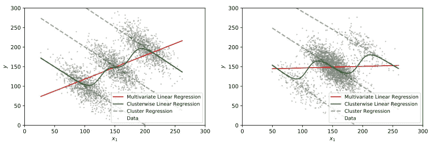

辛普森悖论的可视化表示。使用所有数据的回归模型，似乎有一个明显的趋势消失了，但是，单独使用组。图片来源:[此处](https://arxiv.org/pdf/1908.09635.pdf)

在收集数据集以允许模型进行概化时，这一点至关重要。不幸的是，大多数数据集有偏见，只在少数几个国家收集(没有充分代表少数群体和其他国家)。这在为[医疗应用](https://jamanetwork.com/journals/jama/fullarticle/2770833)开发算法时是有问题的。

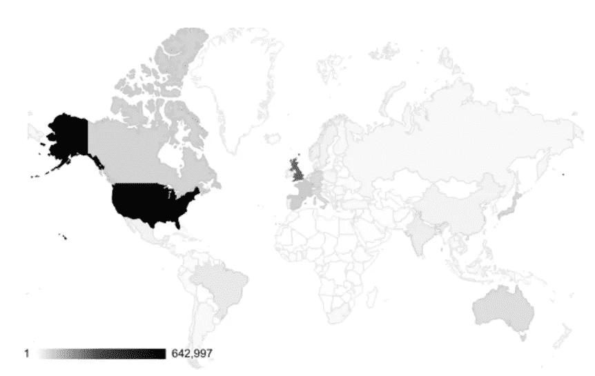

开放图像数据集中国家的地理分布。图片来源:[此处](https://arxiv.org/abs/1908.09635)

已经设计了一些方法来补救这种情况:

*   **提高数据覆盖率。**让社区参与进来，注重包容性。例如，从设计开始，[大科学项目](https://pub.towardsai.net/a-new-bloom-in-ai-why-the-bloom-model-can-be-a-gamechanger-380a15b1fba7)就将包容作为其原则之一。或者还有像[共同声音项目](https://commonvoice.mozilla.org/fr)这样的项目，它从超过 100，000 名参与者那里收集 76 种语言的语音转录，允许包含通常被忽略的语言。
*   **合成数据。**虽然收集医学数据或人脸图像成本高昂，并可能危及隐私，但使用合成数据既能降低成本，又能保护隐私。合成数据的使用似乎在医学、[机器人学、](https://arxiv.org/abs/2012.03806)计算机视觉等领域大有可为。

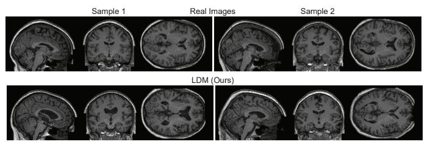

头部核磁共振成像的真实和合成样本。图片来源:[此处](https://arxiv.org/pdf/2209.07162.pdf)

好消息是，几家公司也在努力提高包容性(一个示例 Meta 与 [No Language Left Behind](https://pub.towardsai.net/no-language-left-behind-579afea29e52) )。尽管如此，这些努力仍处于早期阶段。许多项目一次又一次地使用相同的基准数据集，并且合成数据的使用仍然是次优的(性能是次优的，合成数据本身可能是有偏差的)。

因此，在收集数据集时，关联必须呈现关于性别、种族和地理位置的统计数据的元数据至关重要。类似地，科学期刊和会议都需要这些元数据。

**在杰作中雕刻数据**

米开朗基罗的大卫。图片来源([此处](https://it.wikipedia.org/wiki/David_(Michelangelo)))

> “受到喜爱的数据往往会保留下来。”—库尔特·博拉克

人工智能模型在几个领域表现出色，但它们可能会过度适应训练集偏差和标签噪声。在数据收集过程中，注释和标记被认为是一个瓶颈。事实上，它不仅昂贵而且错误百出。为了降低成本，公司依赖亚马逊 Mechanical Turk 等众包平台，但结果并不总是高质量的。另一方面，医学或[激光雷达图像](https://en.wikipedia.org/wiki/Lidar)将需要由专家完成注释(甚至更昂贵)。

正在研究几种解决方案来加速注释过程。例如，用户可以提供函数(或通用规则)来注释数据，算法有助于聚合这些初始标签。或者，算法选择最重要的数据点(更大的信息增益，更大的不确定性)，然后由人对它们进行注释(人在回路中)。

在其他情况下，问题在于数据稀缺。在计算机视觉中，[图像增强](https://albumentations.ai/docs/introduction/image_augmentation/)技术(旋转、缩放、翻转等等)经常被用来增加数据集中样本的数量。今天也存在库来扩充表格甚至文本数据。

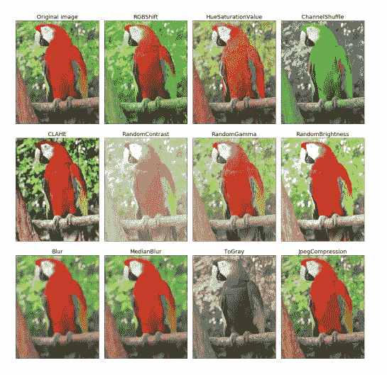

图像增强。图片来源:[此处](https://arxiv.org/abs/1809.06839)

另一方面，没有一个基准数据集是干净的，没有错误的。事实上，几项研究表明存在几个错误(错误的发音，不正确的标签，等等)。例如， [ImageNet](https://www.image-net.org/) (最流行的图像分类数据集之一)的验证集包含[至少 6%的错误标签](https://arxiv.org/pdf/2103.14749.pdf)。因此，即使收集了数据集，工作也没有完成，而是应该进行动态检查。

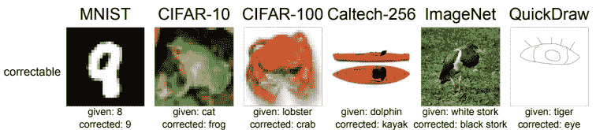

标准基准数据集中的错误示例。图片来源:[此处](https://arxiv.org/pdf/2103.14749.pdf)

人们可以尝试不同的正则化技术或使用[重新加权技术](https://arxiv.org/pdf/1803.09050.pdf)。不幸的是，这些通常是昂贵的解决方案。另一种方法是使用数据 Shapley 评分，过滤掉质量差的数据，并在清理后的数据集上重新训练模型。这种方法还有一个优点，它允许我们在存在/不存在某些数据的情况下分析模型的行为(从而也评估某些偏差)。

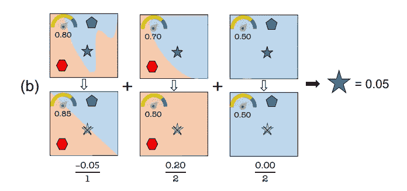

Data Shapley 量化了每个数据点的重要性，以及如果删除该数据点，它对模型性能的影响程度。图片来源:[此处](https://arxiv.org/pdf/1904.02868.pdf)

**没有简单的考试**

图片来自 unsplash.com[绿色变色龙](https://unsplash.com/@craftedbygc)

> “我们被数据包围，但却渴望洞察。”—杰伊·贝尔

在对模型进行了几次调整，尝试了不同的架构等之后，终于到了梦寐以求的评估时间。范例是将数据集划分为训练集、验证集和测试集。必须将[测试设置](https://en.wikipedia.org/wiki/Training,_validation,_and_test_data_sets)放在一边，以避免潜在的数据泄漏。我们需要知道这些吗？

实际上，首先需要检查测试集是否具有代表性(例如，包含足够多的各种类的例子)。即使这样有时也不够。

测试集的目的是测试模型的概括能力。例如，研究表明，在一家医院的 x 射线上训练的模型在从其他医院收集的图像上进行测试时无法推广。因此，应该仔细设计一个测试集:图像不应该来自同一个来源，理想情况下，它们应该由不同的专家进行注释。

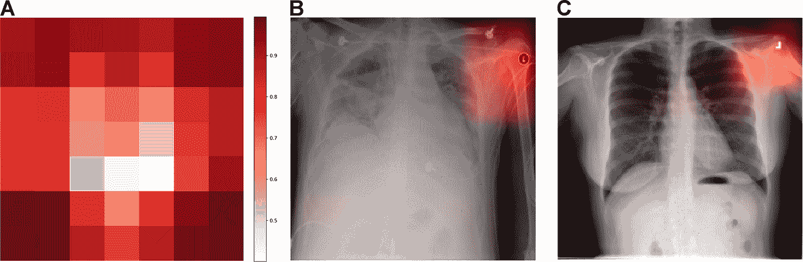

人工智能模型未能概括，该模型正在寻找图像和它注册的医院之间的相关性。图片来源:[此处](https://journals.plos.org/plosmedicine/article?id=10.1371/journal.pmed.1002683)。许可证:[此处](https://creativecommons.org/licenses/by/4.0/)

例如，有人指出，看似非常准确的模型可能会因微小变化(背景变化、同一物体的不同背景)而完全错过预测。事实上，据观察，许多人工智能模型实现了所谓的“捷径”或启发式策略。一个典型的例子是，如果在训练集中所有猫的例子都在沙发上，则模型可能将沙发与标签“猫”相关联，并且不能识别在不同上下文中的猫。

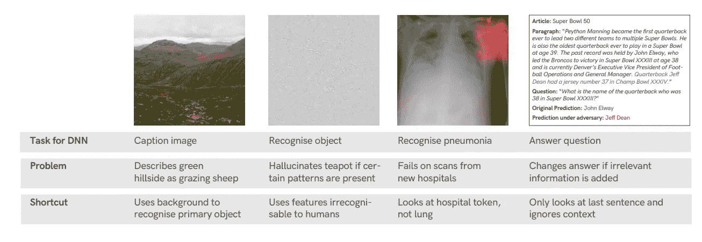

神经网络使用的快捷方式示例。图片来源:[此处](https://arxiv.org/pdf/2004.07780.pdf)

这些虚假的相关性也可能存在于医学应用中(该模型可能识别与特定医院相关联的事物，然后对来自其他医院的患者图像失效)。此外，这种现象并不局限于计算机视觉，这些捷径也可以在使用自然语言处理(NLP)模型时出现。事实上，该模型经常学习句子的第一部分和第二部分之间的一些关联，这些关联实际上只是虚假的关联。

数据消融研究被认为是一种潜在的补救措施，以了解模型使用什么快捷方式并纠正这种行为。

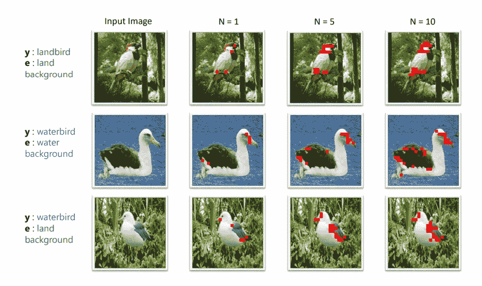

视觉转换器的数据消融研究示例。在这个例子中，在训练集中，有海鸥(水鸟和背景总是水)和具有森林背景的陆地鸟，如果在测试集中有一只海鸥在森林中，它可能被分类为陆地鸟。这里，为了研究模型的鲁棒性，去除了一些小块。图片来源:[此处](https://arxiv.org/pdf/2203.09125.pdf)

此外，通常模型的评估减少到一个数字(一个评估指标，如准确性、AUC 等)。这通常会产生误导:一个典型的例子是[不平衡数据集](https://developers.google.com/machine-learning/data-prep/construct/sampling-splitting/imbalanced-data)，其中模型可以通过预测最丰富的类来实现高精度。此外，尽管总体准确性可能非常好，但该模型在特定的数据子组中可能存在系统误差。这些错误可能是危险的，例如少数民族、性别和地理来源。

例如，面部识别算法已被证明对少数民族的分类不太准确，存在有害偏见的风险。几项研究已经解决了我们如何减轻偏见和增加算法的公平性。 [Multiaccuracy](https://arxiv.org/pdf/1805.12317.pdf) 是一个框架，旨在确保可识别子群之间的准确预测。然而，元数据并不总是可用的，因此开发了一种算法，该算法在模型有出错风险的地方单独识别测试集中的聚类( [DOMINO](https://arxiv.org/pdf/2203.14960.pdf) )

此外，还存在数据收集是动态的情况。甚至 AI 任务本身也可以改变(域转移)。例如，自动驾驶车辆需要识别新类型的车辆或新类型的交通信号。重新训练模型的成本相当高，但是进行模型更新也提出了如何评估模型的新问题。因此，今天 MLOps 正在成为发展最快的领域之一。像 TFX 和 MLflow 这样的库包含了针对这些案例的功能，并且能够灵活地分析数据集。

**离别的思念**

在 unsplash.com，布雷特·乔丹摄于

数据质量是一个好的人工智能应用成功的关键。选择如何收集和操作数据至关重要，尽管在以模型为中心的人工智能数据中，科学家通常专注于如何改进模型。

收集数据或其他操作的方式也引发了道德问题，并可能导致潜在的偏见。此外，这些选择不仅重要，而且在今天越来越相关(正如我在之前的文章中讨论的[，机构正在监管人工智能)。事实上，研究表明，即使是标准数据集也不能避免错误和偏见(ImageNet 也包含潜在的攻击性标签)。](/machine-unlearning-the-duty-of-forgetting-3666e5b9f6e5)

此外，模型的评估可能会出现关键问题。正如我们所看到的，该模型可能会因某些团体或利用捷径而不太准确。虽然我们已经看到了几种可能的技术解决方案，但这些问题中的许多都可以通过更好的数据收集和管理来解决。

由于特定群体和类别(少数民族、英语以外的语言、其他国家)的代表性往往不足，因此出现了许多有针对性的项目。例如，COCO 数据集是最著名的数据集之一，用于分割任务，但它呈现典型的西方物体和场景。几年前成立了 COCO Africa，展示在非洲可以遇到的场景和物品。类似地，还有许多其他项目致力于数据集中很少出现的语言。

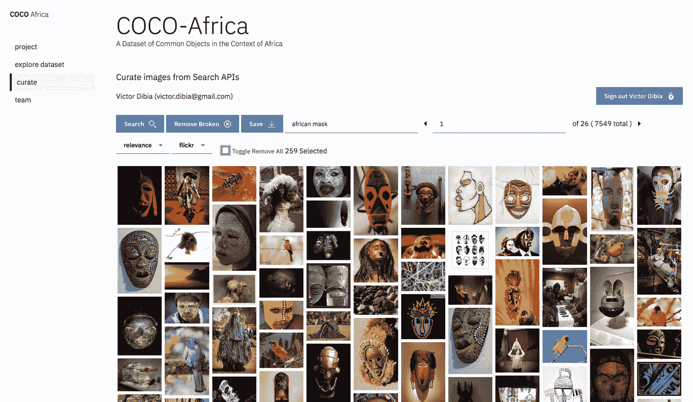

COCO Africa(图片来源:GitHub 官方[资源库](https://github.com/victordibia/cocoafrica))

以模型为中心的方法在过去十年中主导了人工智能，但以数据为中心的方法现在正在增长。事实上，可解释的人工智能越来越重要，以数据为中心是其中的一部分。此外，一个人必须始终对自己的数据(无论是我们自己收集的还是基准数据集)保持批判的态度，因为潜在的错误和偏见可能会被忽略。

# 如果你觉得有趣:

你可以寻找我的其他文章，你也可以 [**订阅**](https://salvatore-raieli.medium.com/subscribe) 在我发表文章时得到通知，你也可以在**[**LinkedIn**](https://www.linkedin.com/in/salvatore-raieli/)**上连接或联系我。**感谢您的支持！**

**这是我的 GitHub 知识库的链接，我计划在这里收集代码和许多与机器学习、人工智能等相关的资源。**

**<https://github.com/SalvatoreRa/tutorial>  

或者随意查看我在 Medium 上的其他文章:

</machine-unlearning-the-duty-of-forgetting-3666e5b9f6e5>  </machine-learning-to-tackle-climate-change-7911e004c3a2>  </how-science-contribution-has-become-a-toxic-environment-6beb382cebcd>  <https://pub.towardsai.net/a-new-bloom-in-ai-why-the-bloom-model-can-be-a-gamechanger-380a15b1fba7> **