# 一种用 Python 识别非标准字符模式的数据质量测试方法

> 原文：<https://towardsdatascience.com/a-data-quality-test-approach-with-python-to-identify-non-standard-character-patterns-864affcb9195>

# 一种用 Python 识别非标准字符模式的数据质量测试方法

## **用 Python 高效执行数据质量测试的用户友好方法**

**在你的数据中有一些标准是必要的吗？除了标准测试之外，是否要进行全面的数据质量测试？在本帖中，我们将创建一个程序来学习数据中的常见字符模式，并将非标准字符模式报告为数据质量问题。另外，您不会因为额外的配置而浪费时间，因为它与不同的数据集兼容。**

照片由艾尔丹姆·卡普奇(作者)拍摄

一拿到数据，我们就直接投入探索。数据探索是任何数据相关项目的重要组成部分，它直接影响模型的效率和结果的准确性。检查数据质量有多种方法，如缺失值插补。对于需要预定义标准的字符字段，还有各种数据质量测试。例如，检查每个单元格的长度以识别过长或过短的单元格，或者搜索非字母字符。

让我们说得更清楚些。您有一个带有国家 ISO 代码和税号的客户数据集。您希望通过分别评估每个国家/地区的税号标准的符合性来确认每个客户的税号的正确性。考虑到您正在处理一个包含多个国家的数据集，第一种可能的方法是找到每个国家的税号标准，将信息嵌入到脚本中，并报告不符合这些标准的记录。如果您想对商店号、客户 id 或其他一些希望以标准格式存储在数据库中的列进行额外的测试，该怎么办呢？为数据的每个附加列定义模式可能会浪费时间。我们试图在这篇文章中提出一个解决这个具体挑战的方案。

下面是我们将要经历的步骤:

1.  目标
2.  探索数据
3.  清除数据(仅针对缺失值)
4.  拆分记录
5.  将记录转换为模式关键字
6.  计算每个国家的模式频率
7.  识别税号模式频率低于阈值的客户
8.  报告

# **1。目标**

在大多数情况下，id 号长度相似，由字母和数字组成。在一些罕见的情况下，它们也可以有一些特殊字符，如“-”(破折号)或“*”(星号)。更重要的是，字母、数字和特殊字符在每个 id 中的位置通常是相同的。例如，假设有一个雇员 id 标准，在两个字母字符后有五个数字字符。在这种情况下，我们期望雇员数类似于 AB-12345。这就是为什么我们将每条记录转换成一个模式键，这样 AB-12345 就被编码为 L-L-S-N-N-N-N-N，在这一步之后，我们将计算模式频率。

我们使用:

*   l 代表字母
*   n 代表数字
*   s 代表特殊字符

在这篇文章中，我们将首先识别数据集中的常见模式(如果有的话)，然后找出不符合这些模式的记录。

# **2。探索数据**

为了简单起见，我们将只使用一列(税号)来检查是否有非标准格式的记录。由于数据隐私，不可能使用真实税号的数据集，所以我建了一个假的。你可以使用 [CSV 文件](https://github.com/erdemcapci/Data_Quality/blob/main/Datasets/VAT_Dataset.csv)的副本，在 [GitHub](https://github.com/erdemcapci/Data_Quality/blob/main/Scripts/Data_Quality_Standards.ipynb) 上到达`Jupyter`笔记本。

我们的数据集包含三列:

*   **客户 Id:** 客户的唯一标识符
*   **国家 ISO 代码:**两个字母的国家代码
*   **税号:**任意字符类型的客户税号

我们将使用`pandas`库来处理数据。让我们导入数据，重命名列，并快速查看前 5 行。

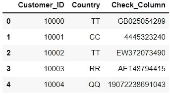

df 的前 5 行(图片由作者提供)

我们有一个 18060 行 3 列的数据框。

# 3.清理数据

由于我们已经在致力于数据质量，详细的数据清理是不必要的。这就是为什么我们只删除 *Check_Column 中缺少值的行。(潜在的额外清理是删除前导和尾随空格。)*

总共有八个值缺失。删除这些行后，我们还剩 18052 行。由于没有税号信息，此八行列表需要在项目结束时作为非标准 id 记录单独报告。

现在，让我们用每个国家的客户数量来研究我们的数据。

客户数量(图片由作者提供)

# 4.拆分记录

以下是翻译的步骤:

1.  让我们通过使用`map`函数来确保 *Check_Column* 值都是字符串。
2.  定义一个`split`函数，我们将使用该函数将每个 VAT 号拆分成其字符。
3.  拆分*校验 _ 列*并将字符保存到**校验 _ 列 _ 拆分*列*。**

*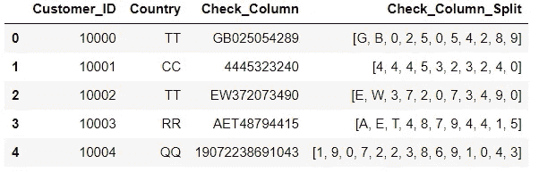*

*前 5 行(作者图片)*

*我们的列表包含了来自 *Check_Column 的每个字符。**

# *5.将记录转换为模式关键字*

*在翻译阶段，我们受益于 ASCII(美国信息交换标准代码)代码。每个字符都有一个 ASCII 码。幸运的是，ASCII 码是根据字符类型排序的。你可以在[ascii-code.com](http://ascii-code.com)网站上找到字符的 ASCII 表示列表。在 Python 中，我们将使用`ord`函数来查找字符的 ASCII 表示。*

*首先，我们需要使用 DEC(十进制)表示法对 ASCII 码进行分类:*

*   ***特殊字符:**32–47/58–64/91–96/123+*
*   ***字母:**65–90/97–122*
*   ***数字:**48–57*

***注:**根据您正在使用的语言，您可能需要添加更多的字母。在这种情况下，我们需要添加一个条件。例如，如果要将(( C 带分音符)和(( A 带分音符)翻译成字母，我们需要大写和小写字母 ASCII 表示。*

*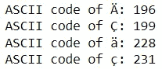*

*让我们为附加字母创建一个列表，并将它们的 ASCII 表示存储在另一个列表中，而不是一个接一个地翻译附加字母。在脚本的前面部分将附加字母分配给列表会更有效。在本文中，为了清楚起见，我将它添加到了本节中。*

*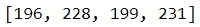*

*有了额外的 ASCII 表示后，让我们创建我们的 ASCII 翻译函数。该函数遍历每个记录的字符，将它们转换成 ASCII 码，并将转换后的字符作为字符串输出。*

*然后我们使用`apply`对每条记录运行该函数，并将翻译后的字符保存到*Check _ Column _ Translated*列中。*

*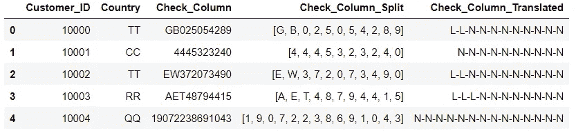*

*前 5 行(作者图片)*

*此时，我们可以猜测 TT 国家的标准模式，似乎是 L-L-N-N-N-N-N-N-N-N-N，但是当然，现在说什么都为时过早。首先，我们需要计算每个国家的模式频率。*

# *6.计算每个国家的模式频率*

*要查找每个国家的模式频率:*

1.  *`groupby`在国家和模式级别上的 df，这将给我们按国家的模式的数量。*
2.  *`groupby`按国家的 df，这将为我们提供客户总数。*
3.  *`merge`两个分组的表格都能够计算出频率。*
4.  *通过将模式数除以该国家的客户总数来计算模式百分比。*

**

*前 5 行(作者图片)*

*现在我们有了频率，让我们看看每个国家的最高模式频率。*

*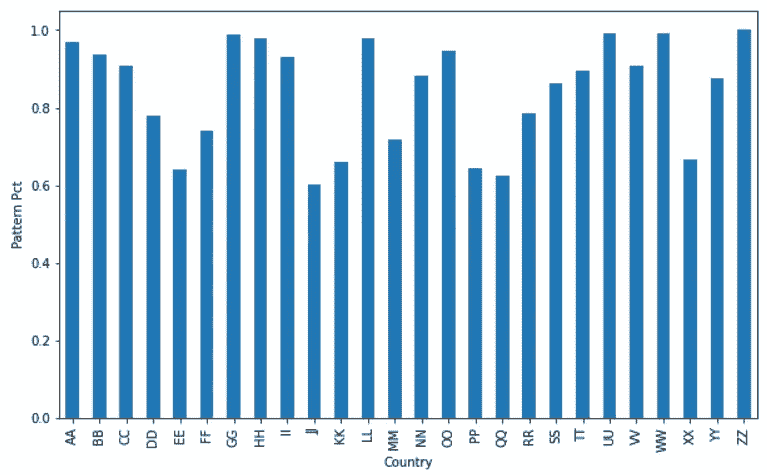*

*按国家/地区列出的顶级模式频率(按作者列出的图片)*

*很高兴看到 26 个国家中有 18 个国家的通用模式百分比高于%75。最不常见的百分比是 JJ 国家的%60。可能有几个原因会导致这种情况。要么是有另一种模式也和顶模式一样常见，要么是数据质量根本不高。不过，我们现在不需要担心最常见的模式。我们的重点是识别不常见的模式，以突出数据质量问题。*

*现在让我们以国家“AA”为例来观察所有的模式。*

*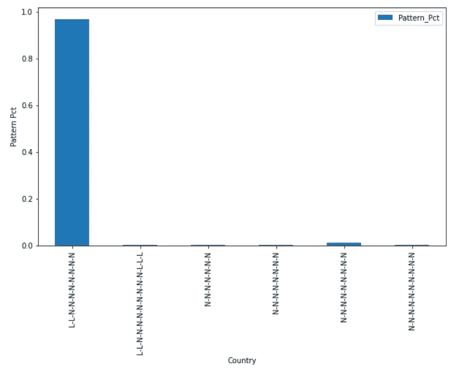*

*县“AA”模式频率(图片由作者提供)*

*似乎在国家“AA”中最常用的模式是 L-L-N-N-N-N-N-N-N-N，大约有%97，还有五种模式很少使用。我们对这些作为潜在数据错误的非常见模式感兴趣。*

# *7.识别模式频率低于阈值的客户*

*让我们记住我们的两个主表:*

***1。df** :客户级数据*

**

*前 5 排 **df** (图片由作者提供)*

***2。grp_tbl:** 国家/地区和模式级别的数据，以及按国家/地区列出的模式百分比和客户总数信息*

**

***grp_tbl** 前 5 排(图片由作者提供)*

*我们合并 *Country* 和*Check _ Column _ Translated*列上的 **df** 和 **grp_tbl** 表，以获得带有模式百分比的客户级别结果。*

*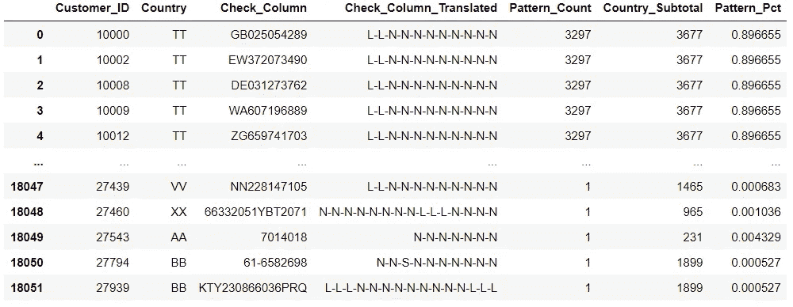*

***df_all_temp** 表(图片由作者提供)*

*我们选择一个低阈值，然后过滤掉比该阈值高的 *Pattern_Pct* 行。这样，我们可以列出具有非通用税务模式的客户。在脚本的早期将阈值分配给变量会更有效。在本文中，为了清楚起见，我将它添加到了本节中。在下面的例子中，我使用 1%作为阈值。*

***注意:**你需要小心阈值。如果您的组项目之一(在我们的示例中，对应于国家)的记录少于 100 条，您将不会有任何 1%阈值的结果。例如，假设国家 AB 有 95 个客户，最常见的模式用于 94 个客户。这意味着只有一个客户有不同的模式。那么，1%阈值将不会突出显示该结果，因为该特定客户的模式百分比将高于%1。*

*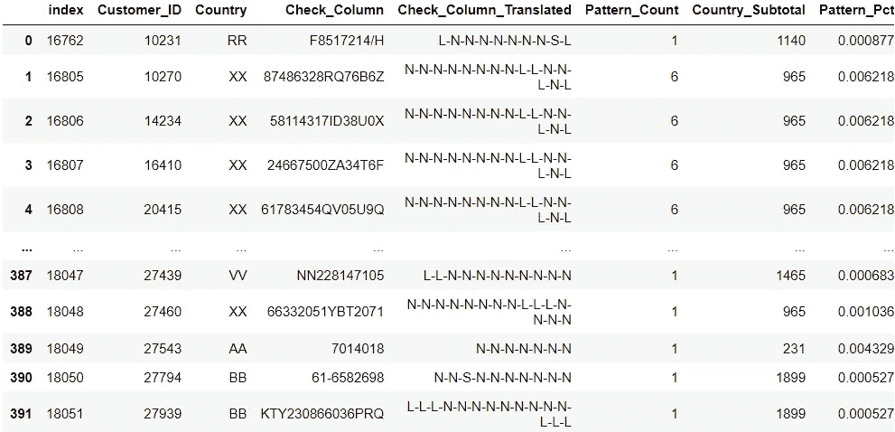*

***df_all** 表格(图片由作者提供)*

*因此，在 18052 个客户中，有 392 个在我们的数据集中有不常见的税号模式。*

# *8.报告*

*我们有我们的结果，我们可以称之为**异常**。现在，让我们准备演示数据。*

*我们列出了具有非通用税号模式的客户，但是我们的利益相关者可能希望将这些模式与每个客户所在国家最常见的模式进行比较。让我们快速浏览一下我们在第 6 部分创建的 **grp_cntry_max** 表。*

***grp_cntry_max:** 具有最常见模式和模式百分比信息的国家级数据(此表也是 **grp_tbl** 的子集)*

*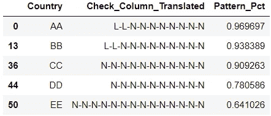*

***grp_cntry_max** 的前 5 行(图片由作者提供)*

*现在，我们将 **grp_cntry_max** 与 **df_all_temp** 合并。在合并之前，我们将重命名这些列，以防止名称冲突并增加清晰度。*

*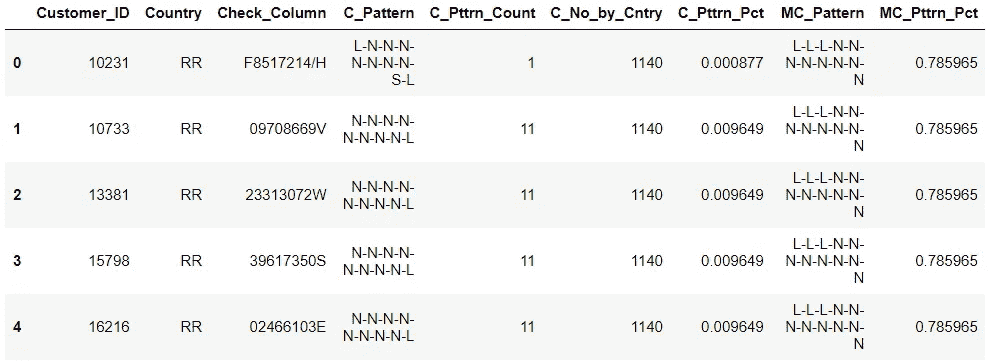*

***df_report** 的前 5 行(图片由作者提供)*

*在这部分之后，还有各种潜在的可视化机会。下面我分享两个不同可视化方法的场景。*

***注意:**许多不同的 Python 包提供了更多的格式化选项。我建议探索它们以获得更吸引人的视觉效果。*

***场景 1:** 我们的利益相关方将审查并修正例外数量最多的前 10 个国家的数据。他们希望了解前 10 个国家中哪个国家的例外比例较高，以便进行有效的计划。*

*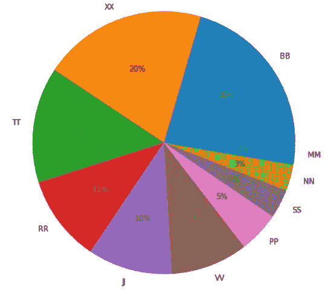*

*前 10 个国家例外数字饼图(图片由作者提供)*

***情景 2:** 我们的利益相关者希望了解哪些国家的例外情况与其客户总数相比比例更高。*

*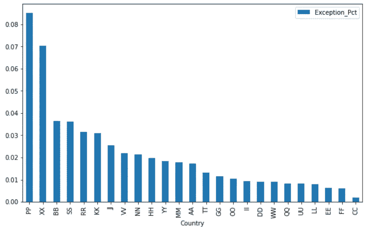*

*例外百分比条形图(按作者分类的图片)*

***结论:**现在，我们熟悉了我们的数据集，知道了它的弱点。我们准备继续我们的分析，或者将我们的异常作为数据治理项目的结果提出来。*

***备注 1:** 您可以对每个数据集使用这种方法。只需更新列名、定义阈值、创建附加字母列表并运行脚本。您也可以在没有分组的整个数据集上运行此操作(例如按国家分组)。您可以通过用任何静态值(如“A”)创建一个新列来实现。*

***备注 2:** 即使这是一个全面的测试，也可能仍然不够。例如，您可能会遗漏所有 id 都相同的数据集，如“00000000”或“AAAAAA”。*

***备注 3:** 翻译特殊字符是一种保守的做法。如果您的数据没有特殊字符，您可以保留它们的原始值。*