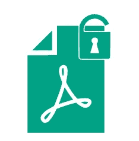
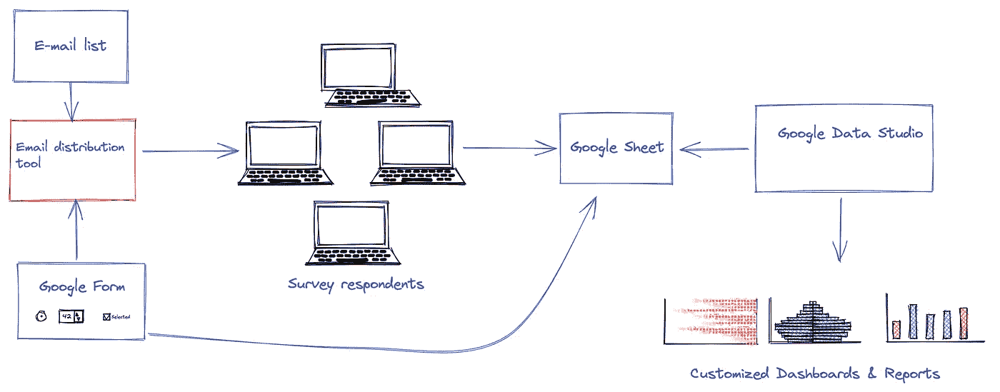
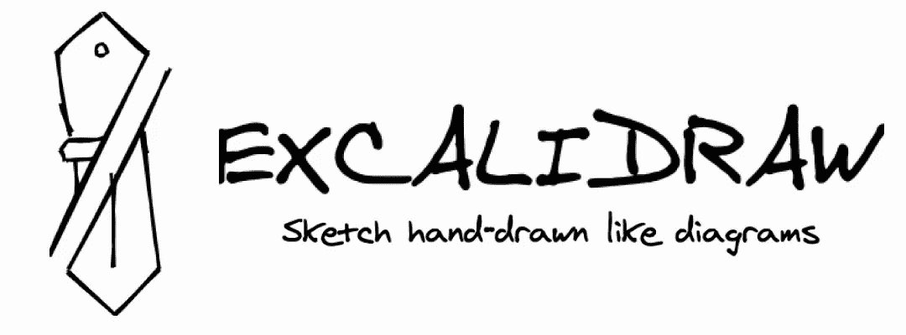
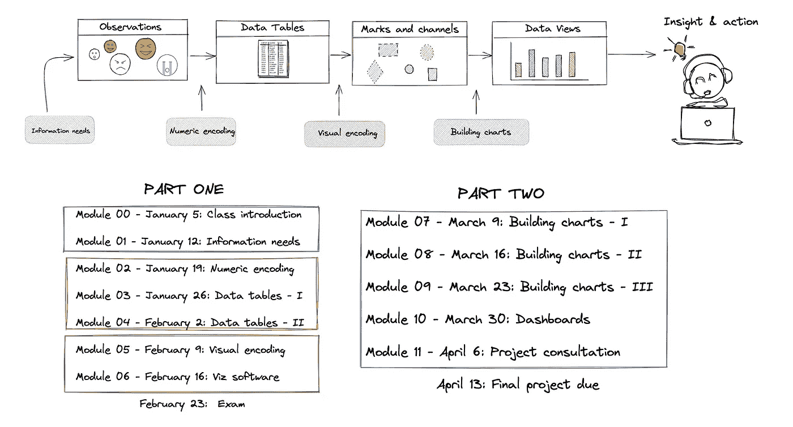
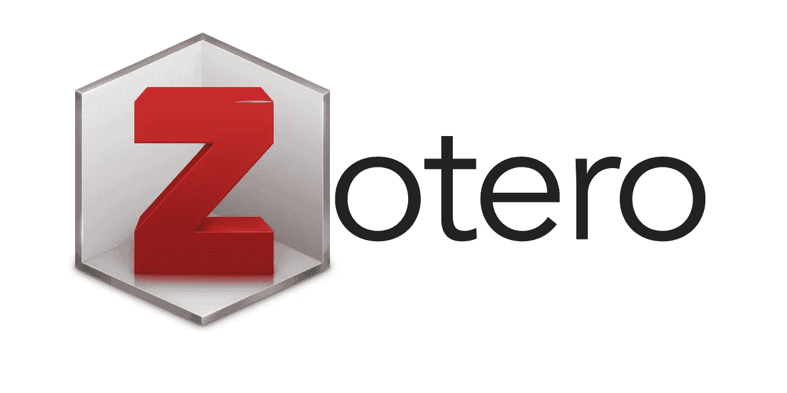

# 非营利咨询的数据科学工具箱

> 原文：<https://towardsdatascience.com/a-data-science-toolbox-for-non-profit-consulting-66a2910c48ea>

## 用于规划和实施可持续解决方案和工作流程的免费工具


车间。图片作者。

解决非营利部门的数据问题不同于企业界和科技行业。非营利组织面临的最常见挑战是捕获、存储和使用管理数据。非营利组织倾向于很少或没有技术预算。你很少会遇到需要机器学习或高级统计的情况。在我与非营利组织的合作中，一些免费工具已经成为原型和数据解决方案的首选。这些工具不是用来分析数据的。相反，我依靠这些工具来规划和实施经济高效且可持续的工作流程。这是我的一套基本咨询工具。

# 黑曜石(和 Pandoc)

黑曜石对我的咨询、学术研究和个人生活产生了革命性的影响。Obsidian 是一个 markdown 编辑器，具有优秀的链接和搜索笔记的功能。我在非营利组织的工作需要很多会议——并且，黑曜石对于保持一切有序、集中和易于访问是必不可少的。使用黑曜石，我可以使用 [Pandoc](https://pandoc.org/) 轻松地将笔记转换成优雅的幻灯片或其他文件格式。Pandoc 是一个运行在命令行上的“通用文档转换器”。如果我想把一个笔记从 Markdown 转换成 Word 文档，我抓取下面的代码片段(保存在 Obsidian！)使用下面的命令。

```
pandoc -o output.docx -f markdown -t docx filename.md
```

黑曜石最好的部分是，该软件集中了我的大部分工作。黑曜石在本地运行，可以跨设备同步，这使得该软件比其他基于云的笔记系统快得多。使用黑曜石作为“第二大脑”的人花了很多时间来创建他们的工作流程——很多时间。不要指望你可以复制别人的工作流程，并希望它开箱即用。相反，使用现有的工作流程作为构建您自己的工作流程的指南。从简单开始，避免安装太多插件。


黑曜石标志。作者截图。

# 白板

[Tabula](https://tabula.technology/) 是一个基本的生产力工具，用于提取锁定在 PDF 中的数据表。我可以快速抓取一个 PDF 格式的大表格，然后点击几下，将其转换为 CSV 文件进行进一步处理。该软件简单明了，可以在 Mac、Windows 和 Linux 上运行。虽然 Tabula 界面是一个网络浏览器，但你的数据仍然在本地。在处理敏感的组织数据时，将数据保存在本地非常重要。



Tabula 标志。作者截图。

# 织布机

[Loom](https://www.loom.com/) 是一款基于云的投屏软件，拥有出色的免费增值计划。我使用 Loom 来管理软件演示，并提供不同过程的反馈。我可以通过视频而不是冗长的信息更快地交流复杂的问题。

一个很小但很重要的功能是，当您完成录制和编辑选项时，会为您提供一个可共享的链接。如果您喜欢在其他位置共享或存档视频文件，也可以下载它们。Loom 是一款简单易用的软件，我强烈推荐。


织机标志。作者截图。

# 谷歌工作空间

我在非营利组织的工作中广泛依赖谷歌。这些软件工具免费提供，易于使用，而且非常强大。我相信每个人都已经熟悉了 Google 表单、表格和文档。非营利组织经常使用调查方法作为监测服务过程和结果的一部分。借助 Google Workspace 免费提供的工具，我可以快速为调查数据构建一个端到端的数据管道。以下是不收集敏感数据的调查的工作流程:



管道示例。图片由作者提供。

假设调查结构遵循最佳实践，Google Forms 是管理调查的一种很好的方式。尽管 Forms 没有自定义调查的跳过逻辑，但它有基本的验证规则来帮助确保您在前端获得干净的数据。Google Forms 可以生成 Google Sheets 来保存调查回复。然后，使用 Google Data Studio，我可以构建一组直接从 Google 工作表读取的定制报告和仪表板。将数据从一个系统转移到另一个系统不需要人工干预。

这条数据管道可能看起来像是技术世界中的一个基本问题和解决方案。但是，在非营利领域，这种类型的数据管道是一项重要的创新，可以为组织节省大量的时间和金钱。

# Excalidraw

我已经爱上了 [Excalidraw](https://excalidraw.com/) ，一个手绘外观的虚拟白板。



Excalidraw 徽标。作者截图。

Excalidraw 的手绘外观是我最喜欢的功能。许多非营利组织的服务专业人员缺乏软件和技术背景。一个复杂的工作流程可以少一些手绘的样子。Excalidraw 与黑曜石融为一体。您可以对图像进行截图或创建 SVG 文件进行额外的后期处理。



示例图。作者图片

# 佐特罗

非营利组织面临着提供基于证据的服务的压力。学术文献是信息的主要来源。我经常帮助组织建立 Zotero 来帮助管理期刊文章。 [Zotero](https://www.zotero.org/) 是免费的，在组织和分享学术文献和相关数字资产方面非常强大。



Zotero 标志。图片由作者提供。

# 充气台

我已经成为了 [AirTable](https://airtable.com/) 的忠实粉丝，这是一个创建定制应用的低代码平台。AirTable 有一个强大的免费增值计划，而高级计划的成本并不高昂。当您开发节约成本的工作流程时，收回成本很容易。我一直在使用 AirTable 帮助组织管理项目、工作流、数据和各种数字资产。


Airtable 徽标。作者截图。

# 结论和告诫

这篇文章描述了如何使用各种软件工具来支持非营利组织。软件是工具，不是解决方案。有效的咨询需要对问题进行透彻的分析，以及如何建立简单明了且可持续的工作流程。如果你有其他免费或低价的工具建议，请添加到下面的评论中。