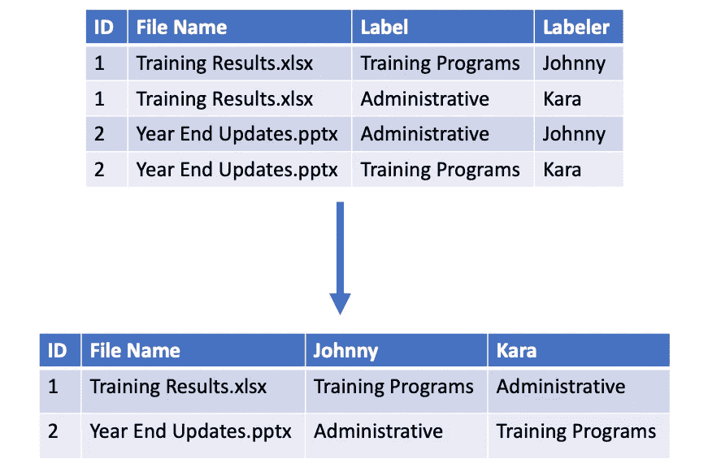

# 数据科学家的一天

> 原文：<https://towardsdatascience.com/a-day-in-the-life-of-a-data-scientist-938d917370b9>

## 剧透一下——我没有创造任何奇特的机器学习模型

安妮·斯普拉特在 [Unsplash](https://unsplash.com?utm_source=medium&utm_medium=referral) 上的照片

最近，我遇到了很多对将职业转向数据科学感兴趣的人。他们总是问我的第一件事是，“典型的一天是什么样子的？”。我看到了很多文章概述了科学家使用的技能和工具，但我没有看到多少文章提供了日常任务的真实例子。

虽然每天都不一样，但这些任务代表了我作为一家大型金融机构的高级数据科学家的典型一天。

# **天一瞥**

*   8:30–9:00——开始我的一天
*   9:00–10:00—结对编程
*   10:00–10:30—Scrum
*   10:30–11:00—准备演示
*   11:30–12:00—与经理一对一会谈
*   12:00–1:00—从首席数据科学家那里获得反馈
*   1:00–4:30—代码！

# **开始我的一天**

我通常在 8 点 20 分起床后，在早上 8 点 30 分左右开始工作。自 2020 年 3 月以来，我一直在远程工作，这对我来说已经改变了游戏规则。我喜欢我的家庭办公室的和平和安静，能够穿着睡衣工作，在等待一些代码运行的时候洗几堆衣服。

我要做的第一件事是查看前一天我可能错过的电子邮件和团队聊天。我每天收到的一封电子邮件包括我团队的一个生产机器学习模型的状态。我检查以确保模型本身或提取数据并将数据加载到我们的数据仓库的相关过程中没有错误。

如果没有错误，我会检查并回复各种消息/请求，然后打开一个名为吉拉的项目/任务跟踪工具，更新我在接下来三周工作的状态——在敏捷软件开发领域，这被称为冲刺。从这里开始，我会优先处理一天的任务。

# **结对编程**

在我过去五年的数据科学家生涯中，我注意到我的工作方式发生了转变。虽然最初几年我专注于自己做这项工作，但现在我花了大量时间帮助和教育经验不足的团队成员。

每周一次，我会与团队中的一名初级数据科学家会面，进行结对编程。在敏捷中，结对编程由两个开发人员组成，他们坐在同一台计算机前，或者共享他们的屏幕，一起进行动态编程。

[KOBU 机构](https://unsplash.com/es/@kobuagency?utm_source=medium&utm_medium=referral)在 [Unsplash](https://unsplash.com?utm_source=medium&utm_medium=referral) 上拍摄的照片

我承认，几年前，当一位高级数据科学家向我提出结对编程的想法时，我持怀疑态度。我认为让两个人做完全相同的任务是浪费时间，我害怕当我不知道如何编码时，我会看起来很傻。但是我发现结对编程是向其他开发者学习的好方法。事实上，当我与初级开发人员一起工作时，我几乎总能从他们那里学到一些新东西。

在上午 9:00-10:00 的结对编程会议中，我们从我遇到的一个问题开始。我们俩都在学习一个新的图形数据库工具，初级数据科学家提到了他安装的一个插件，可以帮助他更容易地加载数据。不幸的是，我无法安装它。

通过我们的结对编程会议，我们发现我们的 IT 部门在无法访问互联网的情况下安装了我的工具版本。在初级数据科学家向我展示了他的设置后，我可以安装插件了！

接下来，我们回顾了我编写的在我的图中创建节点和关系的脚本。这位初级数据科学家给了我一些遵循最佳实践的建议，比如全部使用大写字母来标识关系。我太专注于让我的脚本发挥作用，以至于忽略了让它对其他人更具可读性。

在帮助我摆脱困境之后，我们接着转向他面临的挑战。他需要编写一个 SQL 查询来计算几个业务线的当前和以前的指标。

他向我展示了 Excel 最终输出的模型，以帮助我更好地理解这个问题。从那里，我们转移到 SQL Server，我建议通过编写一个简单的查询来返回单个指标和单个业务线的当前结果，从而解决这个问题。在成功检索到该片段后，我们讨论了他如何编写多个小查询并将结果联合在一起以更接近最终输出。

# **Scrum**

当上午 10:00 到来的时候，是我的团队进行每日混战的时候了。

杰森·古德曼在 [Unsplash](https://unsplash.com?utm_source=medium&utm_medium=referral) 上的照片

传统上，主持会议的人，scrum master，会问每个人三个问题。

1.  你昨天做了什么？
2.  你今天要做什么？
3.  你有阻滞药吗？

我没有发现状态更新有多大价值，所以我已经推动我的团队采取不同的方法，强调学习。与其说*说*我们昨天做了什么，不如说*展示*它。

假设昨天我正在处理一些 Python 代码，以确定我的数据集中某个日期的前一天是否是假日。我将分享我的屏幕并浏览代码，而不是口头给出更新。

我们发现这样做有几个好处。很多时候，当我分享时，团队中的其他人会想到更好、更快或更简单的方法来解决问题。虽然这样的事情可能在代码审查中被发现，但是当你写了五行代码而不是 100 行代码时，发现它们通常要容易得多。其他时候，我发现我的团队中有人正在做一些非常相似的事情，并且可以通过重用我的代码而不用重新发明轮子来节省时间。最后，说实话，看到每天的进步而不仅仅是最终产品真的很酷。

# **准备演讲**

在 scrum 之后，我有大约 30 分钟的时间去参加下一次会议。我发现通常没有足够的时间投入到任何真正的“数据科学”任务中，如清理数据或建模，所以我会用这样的少量时间来回复一天中收到的更多电子邮件或为任何即将到来的演示做准备。

照片由 [Nghia Nguyen](https://unsplash.com/@nghiaagent?utm_source=medium&utm_medium=referral) 在 [Unsplash](https://unsplash.com?utm_source=medium&utm_medium=referral)

作为一名数据科学家，我的大部分工作包括创建演示文稿，向他人介绍数据科学是什么，不是什么。许多高管听到人工智能和机器学习这些时髦词汇后会说，“我们应该这么做！”但事实是，机器学习并不总是答案。通常，基本的报告或简单的自动化将解决大多数团队的问题，我们不应该仅仅说我们正在做，就用机器学习使它过于复杂。

除了教育演示之外，我还可能向我的业务利益相关者演示初始模型的结果。在我作为数据科学家的第一年，我痴迷于在这些演示中尽可能多地包含术语，因为我想听起来聪明。这是一个巨大的错误！

我的利益相关者没有一个有数学学位，也不理解或关心我的模型的 F1 分数是多少。久而久之，我明白了了解你的听众，用通俗的语言说话的重要性。现在，当我讨论模型性能时，即使我在谈论 F1 分数，我也会称之为准确性。技术上精确吗？但是商业利益相关者比精确度和召回率之间的调和平均值更了解精确度。

> 如果你不能简单地解释它，你就理解得不够好——阿尔伯特·爱因斯坦

# **1-1 与经理**

完成演示文稿编辑后，我会去和我的经理进行一对一的谈话。如果你是商界新人，这些会议是你与你的经理会面并讨论你的职业目标、最近的成功和/或你可能面临的任何挑战的机会。

照片由 [LinkedIn 销售解决方案](https://unsplash.com/@linkedinsalesnavigator?utm_source=medium&utm_medium=referral)在 [Unsplash](https://unsplash.com?utm_source=medium&utm_medium=referral) 上拍摄

今天会议的议程上有一个挑战，我在团队的开发环境中设置了一个工具。在花了几周时间与另一个团队一起导航权限后，我们到达了一个点，我们都不知道如何正确地配置工具的安全设置。

因为我的经理在我的组织中比我有更广的关系网，所以当我认为我别无选择的时候，他能够给出一些可能会帮助我的人的建议。

# **从首席数据科学家那里获得反馈**

接下来，我将会见我团队中的首席数据科学家，以获得一些关于我正在进行的概念验证的反馈。在过去的一个月里，我一直在使用我在结对编程一节中提到的图形数据库工具探索一个业务领域的数据集。

照片由 [Alina Grubnyak](https://unsplash.com/@alinnnaaaa?utm_source=medium&utm_medium=referral) 在 [Unsplash](https://unsplash.com?utm_source=medium&utm_medium=referral) 上拍摄

在这个项目之前，我作为数据科学家的大部分经验都是在自然语言处理方面，所以我必须对图形数据库进行大量研究，并学习一种新工具。作为一名数据科学家，学习新的工具和技术是我最喜欢的事情之一，所以这是一个有趣的项目。

由于我自己已经做了大约一个月，我需要从头开始，向首席数据科学家展示一个数据样本以及它在网络图中的样子。接下来，我讲述了我编写的一些基本查询，比如确定哪个节点具有最多的关系。之后，我讨论了一些我尝试过的内置算法，比如确定网络中两个节点之间的相似性。

在讨论一些内置算法时，我注意到我无法尝试很多算法，因为我的图在两种类型的节点(二分图)之间有关系，并且算法只适用于具有一种节点类型的图。他建议我重新构建我的图，这样我就可以测试一些其他的算法，然后我们一起看新的数据模型可能是什么样子。

虽然我有点尴尬，因为我自己没有想到这一点，但这是从他人那里获得反馈的最大好处之一！有时候，你在解决一个问题时陷入困境，获得一个新的视角会非常有帮助。会议结束时，我们就我即将进行的业务领域演示集思广益。

# **代码！**

最后，为了结束我的一天，我真的开始写代码了——耶！我最终从网络图转向了另一个业务领域的文档分类项目。我的团队有点像承包商，在多个业务领域的各种项目上工作。我喜欢的一点是工作的多样性。如果我对一个项目感到疲倦或沮丧，我可以换到另一个项目，让我的大脑放松。然而，最大的挑战之一是我需要不断学习新的业务领域和流程。

对于这个项目，我们没有标记的数据，正在尝试一种新的技术，称为主动学习，它本质上允许你用更少的标记数据点创建更好的机器学习模型。我们为公司内部的五个人选择了一个文档样本进行标记，我今天的任务是检查我们所有标记者的注释并确定一致意见。

在查看注释之前，我需要将五个单独的 excel 文件中的数据加载到一个数据框中，并对其进行转换，以便每个标签的结果都有一列。

作者图片

在获得正确格式的数据后(这总是比我预期的要长)，我开始思考如何确定标签员之间的一致性。对于一些文档，所有五个注释者都同意这个标签，这使我的决定变得容易，但是对于其他文档，五个注释者中只有三个或更少的人同意。甚至有几次，五个贴标签的人都选择了不同的答案！

我决定从简单开始，采取多数决定的方法。如果三个或更多的标注者选择了同一个答案，它将被用作最终答案，并最终用于训练我们的模型。这让我花了一段时间编写代码，因为我也很想看看是否有这样的场景:三个人彼此同意，但另外两个人都同意不同的答案。我把我的决定做了一些笔记，并记下了明天的一些任务，以此结束了我的一天。

# **结论**

你可能会感到惊讶，作为一名数据科学家，我一天中的大部分时间并没有花在编码上。甚至在我编码的时候，我也不是在制作机器学习模型——我是在清理和分析数据。当我得到第一份数据科学家的工作时，我以为我会花一整天来编写算法和创建复杂的机器学习模型。在实践中，我发现我的大部分时间实际上都花在了为建模准备/清理数据，以及理解生成这些数据的人/过程上。数据科学家通常被认为是一份超级酷和令人兴奋的工作，但事实是它并不像看起来那么迷人。这不一定是件坏事，我只是发现新数据科学家没有意识到他们正在让自己陷入什么。

如果你喜欢这篇文章，并且是一名新的数据科学家，想要了解在学术环境之外从事数据科学是什么样的，请查看我的[研讨会](https://www.datasciencerebalanced.com/the-data-science-workshop)，在那里我会教你在学校里学不到的技能。