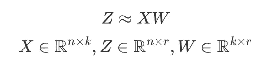
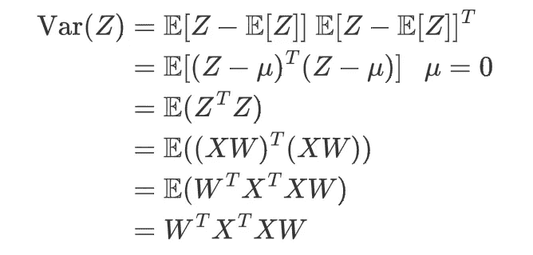
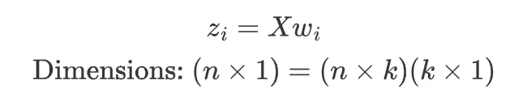
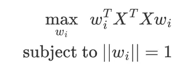
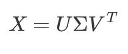
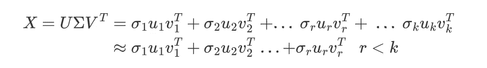
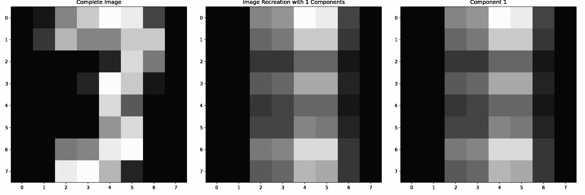
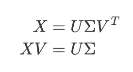

# 深入探讨使用主成分分析进行降维

> 原文：<https://towardsdatascience.com/a-deep-dive-into-dimensionality-reduction-with-pca-bc6f026ba95e>

## 一个简单而强大的降维算法的数学深度挖掘

美国地质勘探局在 [Unsplash](https://unsplash.com?utm_source=medium&utm_medium=referral) 上拍摄的照片

如果你不熟悉 PCA，它本质上是一种将高维数据集转换为低维数据集的算法。主成分分析(PCA)是一个非常强大的工具，尤其是在处理大型高维数据集时。在这篇博文中，我试图解释 PCA 算法是如何工作的，并说明它与奇异值分解(SVD)的联系，奇异值分解是线性代数中一种重要的矩阵分解。

在深入数学直觉之前，我们先来看看算法有多简单！

**PCA 算法**

1.  将数据矩阵 X 居中，使所有列的平均值为 0
2.  计算 XᵀX
3.  获得 XᵀX 的特征值，并按降序排列
4.  找出 XᵀX.的特征向量，特征向量代表变换向量的权重/负载
5.  将原始数据 X 转换成 PCA 形式 Z

第一次学这个的时候(没有任何证明)，好像太神奇了。通过获取看似任意的矩阵 XᵀX 的特征值和特征向量，我们可以找到数据的有效的低维表示。让我们看看为什么这个简单的算法有效。

# **方差最大化**

罗伯特·斯汤普在 [Unsplash](https://unsplash.com?utm_source=medium&utm_medium=referral) 上拍摄的照片

在执行降维时，我们希望保留尽可能多的信息。这个目标可以通过最大化变换数据集的方差来优化。

> 一个令人困惑的问题是为什么我们要最大化方差。高方差可能会让你联想到高方差模型，这通常是不好的，是过度拟合的迹象。在这种情况下，PCA 不进行任何类型的预测或估计。当我们说模型(回归或分类)具有高方差时，这意味着它对坏的训练数据过度敏感。在我们执行降维的情况下，所讨论的“方差”是该数据集中特征的方差。

这里的差异表示数据集中存在的有用信息。如果某个特征的方差为 0(该特征的所有值都相同)，那么它对我们的分析就没有用了。

由于 PCA 是用线性变换来表示的，所以我们要做的是找到一个权重 W 的矩阵，它可以变换我们的原始数据集。

对于由 *n* 行和 *k* 特征组成的数据集 *X* ，我们希望将其转换为具有精简的 *r* 特征集的转换数据集 *Z* 。

使用权重矩阵 W 将 X 转换为 Z

利用这一点，权重矩阵 W 自然将具有维度 *k × r* 。既然我们已经公式化了我们的问题，让我们看看优化标准。

如前所述，我们希望最大化转换数据集 z 的方差。

给定均值= 0 时变换数据集方差的数学表达式

使用上面的方差定义，我们可以导出优化标准。因为我们的原始数据集位于中心，所以特征μ的平均值将为 0。这导致了 WᵀXᵀXW.的优化目标

为了简化优化，我们可以将权重矩阵 W 分成单独的权重向量。

*z_i* 是指第 I 个特征，是一个大小为 *n* 的行向量。对于原始数据集中的 *k* 要素，第 I 个权重向量 *w_i* 的大小为 *k* 。为了优化整个矩阵 *W* ，我们可以对从 1 到 r 的每个向量 *w_i* 重复优化过程。

“欺骗”优化的一种方式是让 *w_i* 变得非常大。使用这种方法将导致转换数据集的方差大于原始数据集。因为这不是我们想要的，我们限制 w_i 的值，使得向量|| *w_i* ||的范数为 1。这使得转换数据集的上限不大于原始数据集。

第 I 个向量的优化目标

这个最优的 *w_i* 就是 XᵀX [(这里证明比较复杂)](https://en.wikipedia.org/wiki/Rayleigh_quotient)的特征向量。有趣的是，w_iᵀXᵀXw_i 值取决于与特征向量相关的特征值。如果我们把最大特征值关联的特征向量作为第一特征 *w_1* ，它会给我们最好的可能结果。

通过按降序取特征值，对随后的权重向量重复这一过程。

这是因为 *XᵀX* 是*t39】的对称矩阵。对称矩阵是特殊的，因为它的特征向量构成了标准正交基。这导致我们的新特征彼此正交，这具有新特征 z_i 不相关且独立的优点。*

对于每个秩为 n 的矩阵，我们可以将其分解成 n 个独立的正交向量，但这将给我们与原始问题完全相同的维数。这里 PCA 所做的是丢弃具有较低方差(低特征值)的特征。这些复合要素在整个数据集内变化不大，因此它们被确定为不太重要，可以丢弃，对其余数据的影响最小。

**奇异值分解**

理解 PCA 的另一种方法是线性代数。利用线性代数，我们可以从“矩阵分解透镜”来观察 PCA。在这种情况下，正在进行的矩阵分解是奇异值分解(SVD)。

**什么是奇异值分解？**

SVD 是一种通用的矩阵分解算法，它将一个矩阵分解为 3 个独立的矩阵。SVD 的妙处在于它既可以用于正方形矩阵，也可以用于矩形矩阵。

这三个矩阵是

*   u:aaᵀ的特征向量
*   σ:奇异值矩阵。这些是 AᵀA 和 AAᵀ特征值的平方根
*   转置后 AᵀA 的 Vᵀ:特征向量。

奇异值分解的工作方式是利用对称矩阵 AᵀA 和 AAᵀ的某些性质来获得分解的特征向量。通过这种因式分解，我们可以将矩阵 X 表示为多个外积/秩 1 矩阵的和。这里，秩 1 矩阵的重要性由奇异值σ_i 表示。

作为外积和的奇异值分解。σ_1 对应于最大奇异值

让我们来看看这个方法的实际应用！我们可以使用奇异值分解来分解 MNIST 数据集中的样本。因为数据来自 8×8 矩阵，所以总共有 8 个分量组成图像。

作者用 SVD — GIF 压缩图像

我们观察到图像中的大多数重要细节可以在 3 个分量之后观察到。这些分量具有最大的奇异值，并且是最重要的。因此，我们可以安全地丢弃具有低奇异值的矩阵，以减少 x 中的信息。这样的一个应用是图像压缩。我们可以选择存储第一个 *r* 矩阵，而不是存储一个巨大的 n × n 图像。因为每个矩阵由 2 个 n 大小的向量组成，所以空间的大小将是 *2nr* 而不是 *n* 。

这与 PCA 非常相似，我们采用第一个 *r* 最重要的特征。关键区别在于，在 SVD 的这种应用中，矩阵乘法**的结果具有相同的维数，但它被压缩成更易于存储的向量。**

# **把所有的东西放在一起**

现在我们对 SVD 做什么有了一些直觉，让我们更仔细地看看 SVD 公式，并做一些重新排列。

因为 v 是对称矩阵 AᵀA 的特征向量矩阵，所以它将是正交基，并且 VᵀV= *I* 。后乘以 V 将得到第二行。这里我们看到左手边非常熟悉。

根据我们的 SVD 分解，v 由 XᵀX 的特征向量表示，该特征向量恰好是先前在 PCA 中导出的权重向量。矩阵乘法 XV 是与来自 PCA 的 XW 完全相同的结果。

这允许我们减少 V 的维数，如果我们减少矩阵 V 中的列数，我们就减少了 x V(转换后的数据集)中的特征数。

这说明 PCA 可以解释为矩阵分解的中间步骤！

**代码实现**

让我们使用相同的 MNIST 数据集来比较不同的主成分分析方法！

我们从预处理步骤开始，使数据集居中，并确保所有特征的平均值为 0。

数据预处理

对于第二个实现，我们将使用博客文章开头的原始算法。首先，我们通过矩阵乘法计算协方差矩阵。然后用`np.linalg.eigh`函数求出特征向量和特征值。

对于第三个实施方案，我们使用`np.linalg.svd`函数直接计算特征向量矩阵 v。与之前的实施方案相比，这为我们节省了几行排序和矩阵乘法代码。

现在你知道了！以 3 种不同方式执行 PCA 的数学直觉和代码实现。检查代码并运行它，让自己相信它是可行的！

 [## 中型笔记本电脑/PCA-SVD . ipynb at master reoneo 97/中型笔记本电脑

### 关于规范化的媒体文章库。为 reoneo 97/中型笔记本电脑的发展做出贡献

github.com](https://github.com/reoneo97/medium-notebooks/blob/master/pca-svd.ipynb) 

如果你喜欢这篇文章，请在 Medium 上关注我！
在 LinkedIn 上连接:[https://www.linkedin.com/in/reo-neo/](https://www.linkedin.com/in/reo-neo/)

**参考文献**

[1] G. Strang，*线性代数导论*，第四。马萨诸塞州韦尔斯利学院:韦尔斯利-剑桥出版社，2009 年。