# 深入研究广义最小二乘估计

> 原文：<https://towardsdatascience.com/a-deep-dive-into-generalized-least-squares-estimation-8bf5319edd7d>

图片由 [Clker-Free-Vector-Images](https://pixabay.com/users/clker-free-vector-images-3736/) 来自 [Pixabay](https://pixabay.com/) ( [Pixabay 许可](https://pixabay.com/service/license/))

## 详细介绍如何在异方差、自相关数据集上拟合稳健的 GLS 模型

**广义最小二乘** ( **GLS** )估计是普通最小二乘(OLS)估计技术的推广。GLS 特别适用于拟合呈现异方差(即非恒定方差)和/或自相关的数据集的线性模型。真实世界的数据集通常表现出这些特征，这使得 GLS 成为 OLS 估计的非常有用的替代方法。

# GLS 估计量的动机

当我们使用**普通最小二乘** ( **OLS** )估计技术来拟合数据集的线性模型时，我们做出两个关键假设:

1.  回归模型的误差方差是恒定的，即误差为**同伦方差**，并且
2.  这些误差彼此之间或它们自身之间没有关联。

但在现实世界的数据集中，这些假设中的一个或两个通常都不成立。例如，考虑以下美国县级贫困模型:

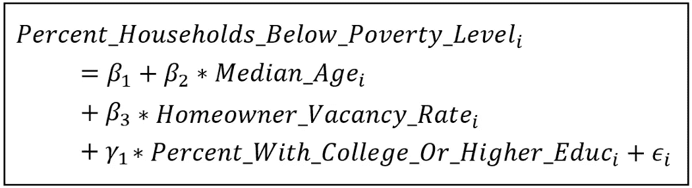

估算县级贫困的线性模型(图片由作者提供)

对于一个给定的数据集，一个统计包，如 [statsmodels](https://www.statsmodels.org/stable/index.html) 可以用来估计这个模型。使用 statsmodels 对来自美国人口普查局的 2015–2019 年[美国社区调查(ACS)](https://www.census.gov/programs-surveys/acs/data.html) 5 年估计数据(参见文章底部的使用条款)进行的线性模型的 OLS 估计产生了以下拟合模型:

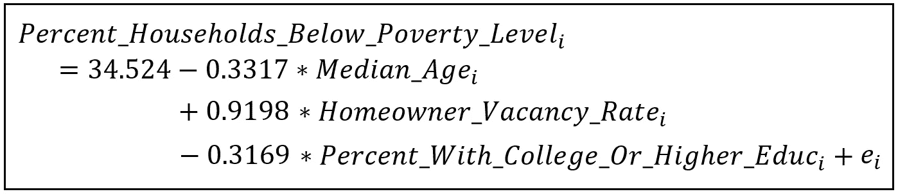

利用 OLS 估算县级贫困程度(图片由作者提供)

这里， *e_i* 是回归的残差。

以下是 Statsmodels 生成的模型训练摘要，其中显示了所有系数在 p < .001:

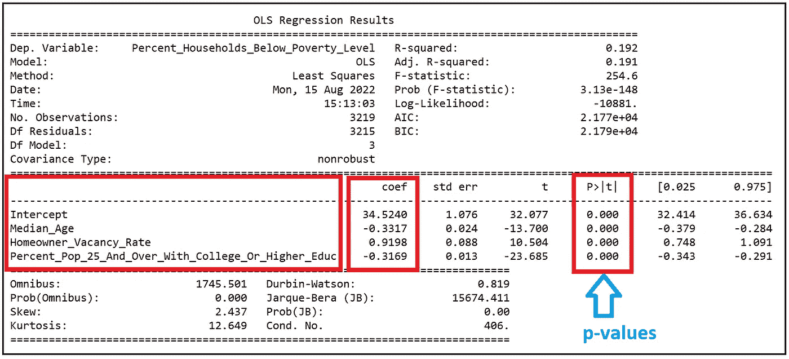

Training summary of the linear model (Image by Author)

At face-value, this fitted model seems sound. But a plot of the residual errors *e_i* 处相对于相应的*预测值*Percent _ Households _ Below _ Level 具有统计显著性，这揭示了一个严重的问题:

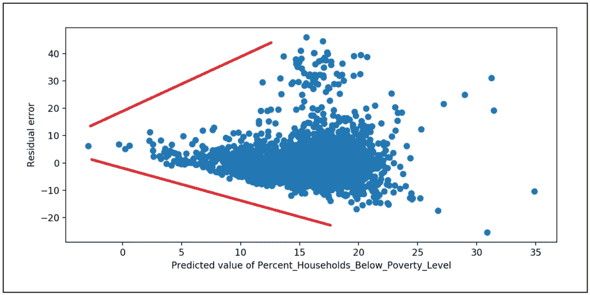

拟合模型的残差与响应变量的估计值的关系图。显示红线只是为了说明模型残差中方差的增加模式(图片由作者提供)

模型的误差(由拟合模型的残差估计)明显是异方差的。在这种情况下，误差方差作为 ***y*** *_cap* 的函数增加。

这应该让我们怀疑评估软件报告的标准误差、p 值和置信区间。

下面是潜在的问题。

## OLS 估计量的问题是

在使用 OLS 估计量时，我们倾向于假设模型的误差是同方差和不相关的。因此，我们用于估计估计系数方差的公式也做了相同的假设。但是正如我们在上面的例子中看到的，如果误差是异方差的和/或相关的，方差公式输出的估计系数的方差值是不正确的。方差的不正确估计会导致以下度量估计的下游误差:

*   系数的不正确标准误差(标准误差是方差的平方根)。
*   系数估计值的 z 分数不正确(系数的 z 分数与标准误差成反比)。
*   系数估计值的 p 值不正确。错误计算的 p 值可能会导致某些系数被错误地报告为具有统计显著性(反之亦然)。
*   最后，系数估计的置信区间不正确。

总的来说，推理过程产生了不正确的结果，尽管从表面上看，拟合的模型似乎完全没有问题。

> 可以看出，当模型的误差是异方差的和/或相关的时，OLS 估计器虽然仍然是[一致的](/the-consistent-estimator-913fab06f4f3)和[无偏的](/understanding-estimation-bias-and-the-bias-variance-tradeoff-79ba42ab79c)，但不再产生模型系数的最低可能方差估计。至少理论上有可能设计另一种估计器，它将产生具有更低方差的系数估计，从而具有更高的[精度](https://en.wikipedia.org/wiki/Accuracy_and_precision)。
> 
> 简而言之，OLS 估计器不再有效。

## 补救措施

处理异方差误差的一种常见方法(尽管对于相关误差来说不那么常见)是使用所谓的 **White 的异方差一致性估计量**。我在我的文章“[介绍 White 的异方差一致性估计量](/introducing-the-whites-heteroskedasticity-consistent-estimator-821beee28516)”中详细介绍了这个估计量。

但是 White 的 HC 估计量有一些缺点，其中主要的是它只考虑了异方差，而没有考虑误差之间的相关性。第二个问题是，在样本大小的样本中，白色 HC 估计器会低估系数估计中的方差，从而导致与 OLS 估计器相同的问题。

## 获得 GLS 估计量

处理异方差和/或相关误差的更直接的方法是遵循以下两点计划:

1.  使用 OLS 拟合数据集的线性模型。使用拟合模型的残差作为线性模型误差的代理，创建一个使用拟合模型残差观察到的异方差性和/或相关性的模型。
2.  设计一个估计器，在其估计技术中使用这些*模型化的*方差和相关值。

这种估计量对于模型误差项中的异方差性和相关性都是稳健的。这正是**广义最小二乘(GLS)** 估计器采用的方法。

# GLS 技术的发展

在这一节中，我们将从基本原理出发开发 GLS 估计量，并了解如何使用它。

让我们从下面的线性模型开始:

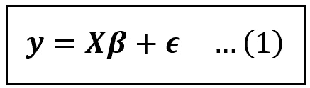

线性模型(图片由作者提供)

***y*** 是响应变量。对于大小为 *n* 的数据集， ***y*** 是大小为*【n×1】*的列向量。假设模型有 *k 个*回归变量，包括截距。 ***β*** 为回归系数*【β_ 1，β_2，…，β_ k】*的列向量，其中 *β_1* 为截距。 ***X*** 是回归变量的矩阵，包括矩阵第 1 列截距的占位符。 ***X*** 大小为*【n X k】*。

数据集中第*个*样本为元组: *(y_i，****x****_ I)*其中 *y_i* 为标量(纯数)***x****_ I*为大小为*【1 x k】*的行向量。

通常，回归模型帮助我们“解释”响应变量***【y】***中的一些方差。模型无法解释的东西“漏”进了模型的误差项*。就像***y******ϵ***是大小为*【n×1】*的列向量。*

*下面是等式(1)的矩阵形式:*

**

*线性模型(图片由作者提供)*

*可以看出， 的系数向量 ***β的普通最小二乘(OLS)估计产生以下估计量:****

**

*估计系数的向量，使用普通最小二乘法进行估计(图片由作者提供)*

*上式中， ***X*** *'* 是 ***X*** 的[转置](https://en.wikipedia.org/wiki/Transpose)。矩阵转置操作实质上是沿着矩阵的主对角线翻转矩阵，即从左上延伸到右下的对角线。转置操作在概念上翻转矩阵。由于*的大小为*【n X k】*，其转置 ***X*** *'* 的大小为*【k X n】*。**

**我们在等式(2)中看到的另一种矩阵运算是上标中的 *(-1)* ，它表示[矩阵的逆](https://en.wikipedia.org/wiki/Invertible_matrix)。矩阵求逆相当于对一个数做 1 的运算。**

**将等式(1)代入等式(2)，我们得到以下结果:**

****

**将等式(1)代入等式(2)(图片由作者提供)**

**在简化了上面的结果位之后(我已经在本文的[中详述了简化)，我们得到了下面的系数估计的有用公式。以下结果显示了误差项 ***ϵ*** 对 OLS 估计的系数值的影响:](/a-deep-dive-into-the-variance-covariance-matrices-of-classical-linear-regression-models-4322b2cdc8e6)**

**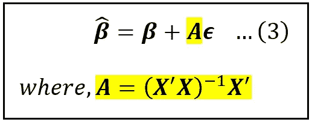**

****的 OLS 估计量作为* ***X*** *和* ***ϵ*** *(图片由作者提供)****

***由于 ***β*** *_cap* 是 ***β*** 的估计值，***β****_ cap*是一个随机变量，它有均值和方差。***

***可以看出，**_ cap*的均值(也叫期望值)就是总体水平的值 ***β。*** 具体来说，***β****_ cap*[以](/understanding-conditional-variance-and-conditional-covariance-8b661067fc18) ***X*** 为条件的期望是 ***β。*******

*****_ cap*以 ***X*** 为条件的方差用*Var(***_ cap****| X****)*表示。为了计算*Var(****β****_ cap****| X****)*)，我们采用以下公式计算(条件)方差:*****

***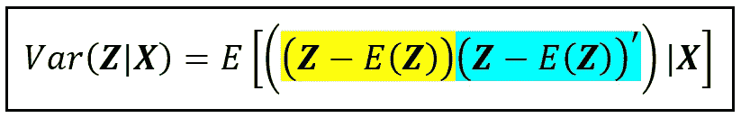***

***一个**矩阵**随机变量 **Z** 的条件方差公式，用 **Z** 表示，其均值(期望值)E( **Z** )和退化的 **Z** 的转置(图片由作者提供)***

***代入***Z****=****β****_ cap*，和*E(****)Z****)*=***β***，我们得到:***

***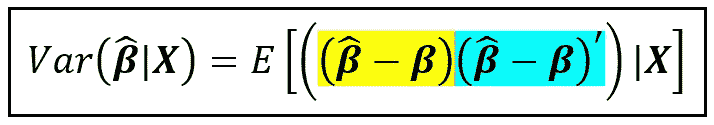***

***系数估计值的条件方差(图片由作者提供)***

***在上述等式的 R.H.S .中，我们将等式(3)中的 ***β_cap*** 替换为 ***β + Aϵ*** ，经过大量的简化(细节在此[和](/a-deep-dive-into-the-variance-covariance-matrices-of-classical-linear-regression-models-4322b2cdc8e6))后，我们得到估计系数方差的以下公式:***

***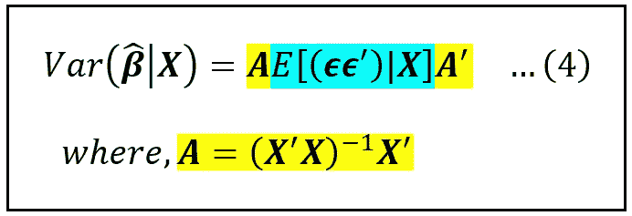***

***线性回归模型的 OLS 估计系数的方差公式(图片由作者提供)***

***中间的术语(蓝色)值得注意。***

***回想一下 ***ϵ*** 是模型的误差项。因此，根据定义，*是一个随机变量。 ***ϵ*** 是一个大小为*【n×1】**的矩阵，大小为*【1×n】。*由此可见，按[矩阵乘法的规则](https://en.wikipedia.org/wiki/Matrix_multiplication)、**、*、*、**是一个大小为*、【n×n】的矩阵。* ***ϵϵ'*** 也是一个随机变量。*****

****e[(****【ϵϵ'】****)****| x****】*是随机变量的期望*(****【ϵϵ'****)*条件制约于**e[(*******

******

***模型误差项的条件方差-协方差矩阵(图片由作者提供)***

***由于假设误差项的平均值为零(线性模型的中心假设)，沿主对角线的元素，即从上述矩阵的左上延伸到右下的元素，包含*e[(ϵ_i*ϵ_i)****| x****]*，实际上是误差项 *ϵ_i、*和所有非对角线元素 *E[(ϵ_i*ϵ_j)的**条件方差******

***由此可见，*e[(***)****| x****]*是方差-协方差矩阵；简而言之，**误差项的协方差矩阵**。****

****在统计文献中，误差的协方差矩阵通常表示如下:****

****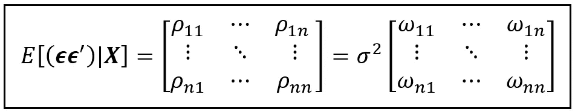****

****回归误差的协方差矩阵(图片来自作者)****

****σ是一个比例因子，一个常数，我们从矩阵中提取出来，使得 *ω_ij=ρ_ij/σ* 。得到的“omegas”的*【n×n】*矩阵用大写希腊字母***ω***表示。****

****因此，****

*****e[(***)****| x****]=σ****ω********

********ω***的主对角线元素包含误差的(缩放)方差，而***ω***的所有其他元素包含误差的(缩放)协方差。*****

*****如果模型的误差是同方差的(恒方差)，那么*的所有主对角线元素都是 *1* ，即对于所有 *i* 来说 *ω_ii = 1* 。******

*****如果误差不相关，则***ω***的所有非对角线元素均为 0。*****

*****因此，对于同分布、不相关的误差，协方差矩阵采用以下形式:*****

*****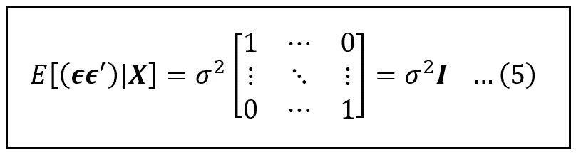*****

*****当误差为同方差且非自相关时，回归模型误差的协方差矩阵(图片由作者提供)*****

*****在等式(5)中， ***I*** 为大小*【n×n】*的单位矩阵。将等式(5)代入等式(4)并稍微简化，我们得到这个漂亮的小结果:*****

*****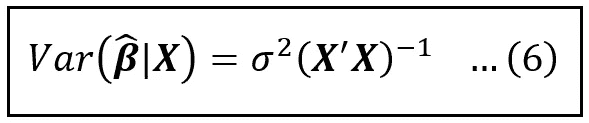*****

*****当模型误差为**同方差**和**非自相关**时，拟合回归系数的协方差矩阵公式(图片由作者提供)*****

*****但是，如果模型的误差是异方差的和/或相关的，误差的协方差矩阵就不再是*σ*I了，上面的方差公式会产生不正确的结果，导致我们在文章开始时讨论的所有问题。*****

## *****广义最小二乘法*****

*****解决这个问题的直接方法是 **GLS** 。我们首先定义一个大小为*【n x n】*的方阵 ***C*** 和一个大小为*【n x n】*的对角矩阵 ***D*** ，使得协方差矩阵*可以表示为***C*的乘积**********

****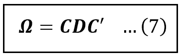****

****(图片由作者提供)****

****在某些条件下(除了说***【C】***是所谓的[正交矩阵](https://en.wikipedia.org/wiki/Orthogonal_matrix)，我们不会在这里深入讨论)，总是有可能找到两个这样的矩阵 ***C*** 和 ***D*** 。顺便说一下，对角矩阵是指不沿着主对角线的所有元素都为零的矩阵。下面是 ***D*** 的样子:****

****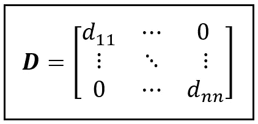****

******D** 矩阵(图片作者提供)****

****主对角线元素 *d_ii* 可能或可能不都具有相同的值。单位矩阵 ***I*** 是所有对角元素都为 1 的对角矩阵的例子。****

****接下来，我们定义一个矩阵 ***G*** 使得它的转置是矩阵 ***C*** 和 ***D*** 的以下乘法:****

****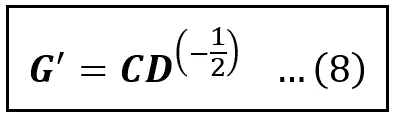****

****矩阵 G(作者图片)****

*******D*** 的指数版值得解释一下。如果 ***D*** 的对角元素是 *d_ii* ，那么 ***D*** 的幂(-1/2)本质上是矩阵的“平方根”的逆，它包含对角元素 *1/√d_ii* ，如下:****

****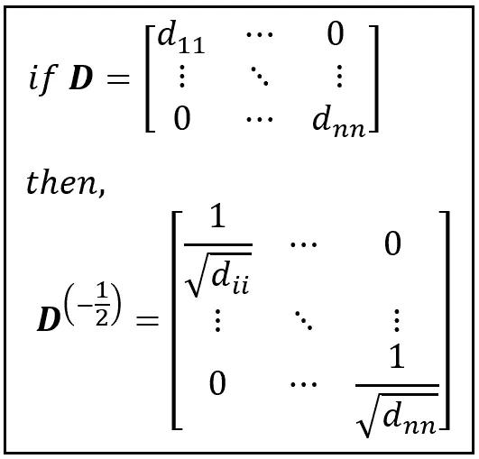****

****对角矩阵 ***D*** ， ***D*** 的逆“平方根”(图片由作者提供)****

****我们很快就会明白为什么要进行这些神秘的转变。****

****让我们回忆一下我们在文章开头一直提到的线性模型的等式，在等式(1)中:****

********

****线性模型(图片由作者提供)****

****我们将等式(1)的两边左乘 ***G*** 如下:****

****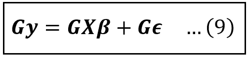****

****转换后的线性模型(图片由作者提供)****

****让我们说服自己，方程(9)中的模型仍然是线性模型。 ***G*** 是大小为*【n×n】*的方阵。由于 ***y*** 是一个大小为*【n×1】****Gy***只是大小为*【n×1】*的 ***y*** 的缩小版。同样，*的大小为*【n X k】*，因此*(****【GX】****)*是大小为*【n X k】*的*的缩小版。而*(****)gϵ****)*是尺寸*【n×1】*的ϵ*的缩小版。因此，等式(1)是*的缩放(有些人可能会说是变换)版本对**的相应缩放(变换)版本的回归。*原始线性模型的系数 ***β*** 将同样适用于等式(9)的缩放模型。*********

*****为了方便起见，我们将 ***Gy*** 替换为 ***y*** *， ***GX*** 替换为***【x****和*替换为**:*******

******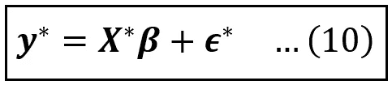******

******转换(缩放)的线性模型(图片由作者提供)******

******因为等式(10)是有效的线性模型，所以适用于线性模型的所有结果对它都成立。首先，误差项 ***ϵ*** *的方差可表述如下:******

*****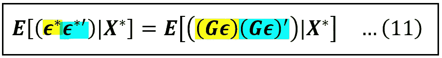*****

*****缩放线性模型的误差项 ***ϵ*** *的方差(图片由作者提供)*****

*****在等式(1)中，我们已经用右侧的 ***Gϵ*** 替换了 ***ϵ*** *。我们将上述等式的右侧简化如下:*****

*****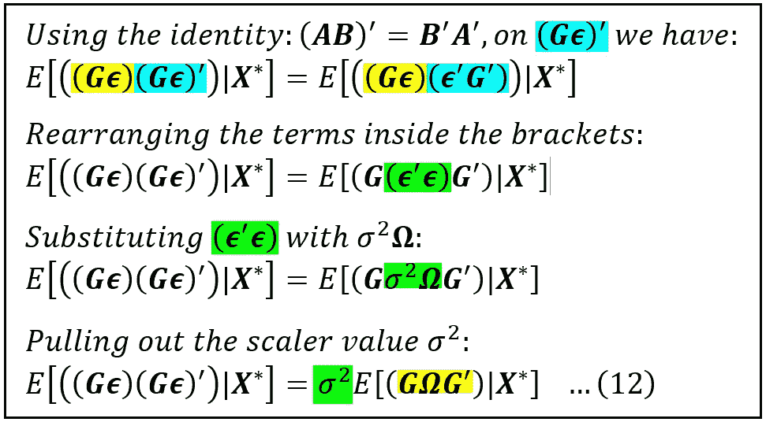*****

*****研究比例模型误差协方差矩阵的公式(图片由作者提供)*****

*****我们现在将处理等式(12)中的黄色位。为此，我们将使用等式(7)和(8)计算***ω***和 ***G*** ，我们将在下面复制这些等式:*****

**********

*****(图片由作者提供)*****

**********

*****矩阵 G(作者图片)*****

*****我们将在等式(12)中使用这些替换，如下所示:*****

*****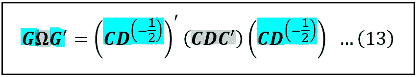*****

*****(图片由作者提供)*****

*****在等式(13)中，我们使用了恒等式(G')' = G，即转置的转置返回给我们原始矩阵。*****

*****让我们简化等式(13)的均方根:*****

*****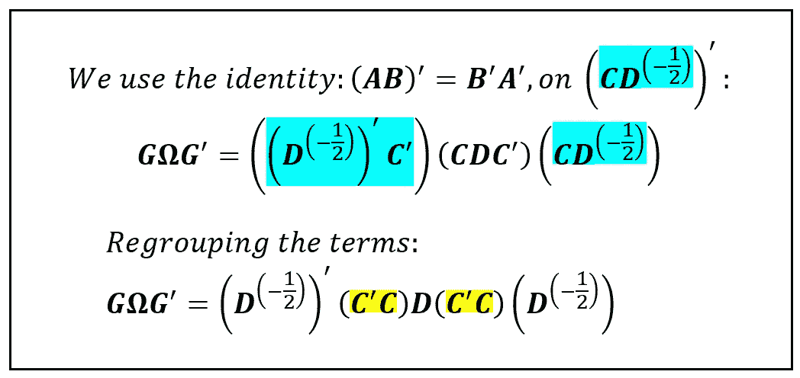*****

*****术语的简化***GωG '****(图片由作者提供)******

*****我们之前提到过 ***C*** 是一个正交矩阵。正交矩阵的一个特性是它的转置等于它的逆矩阵:*****

*****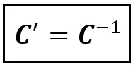*****

*****正交矩阵的转置与其逆矩阵相同(图片由作者提供)*****

*****这意味着 ***C*** 和 ***C*** 的乘积与 ***C*** 及其逆的乘积相同。 ***C*** 与其逆的乘积就是单位矩阵 ***I*** 。这个结果就是 *N* 乘以 *(1/N)* 等于 *1* 的矩阵等效值。*****

*****这暗示着***C***’***C***=***I***。让我们继续简化***GωG’***:*****

**********

*****术语***GωG’****(图片由作者提供)******

*****为了进一步简化方程(14)的 R.H.S .，我们必须回忆对角矩阵***【D】***， ***D*** 的幂的性质:*****

**********

*****对角矩阵 ***D*** ， ***D*** 的逆“平方根”(图片由作者提供)*****

*****此外，对角矩阵的转置是相同的矩阵，因为转置操作简单地围绕主对角线翻转矩阵，并且在对角矩阵中，所有非对角元素都是 0。*****

*****理解了这个设置后，可以看出下面的乘积等同于一个大小为*【n×n】:*的单位矩阵*****

*****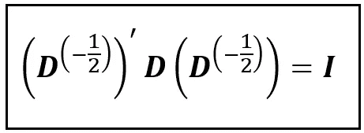*****

*****(图片由作者提供)*****

*****将这个结果代入等式(14)，我们得到:*****

*****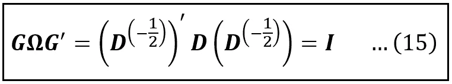*****

*******GωG '***解析为*【n×n】*单位矩阵(图片由作者提供)******

*****将等式(15)代入等式(12)，然后代入等式(11)，我们得到缩放回归模型***y***** =****x*********β****+****【ϵ******其中 ***y* ***x***** =****GX***和***ϵ***** =****gϵ.*** 我们把这个结果总结如下:*******

*****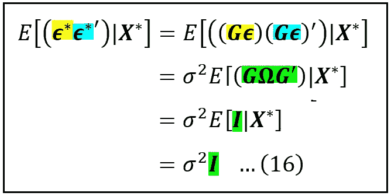*****

*****缩放线性模型的误差协方差矩阵***y***** =****x*********β****+****ϵ*****(图片由作者提供)******

*****方程式(16)是 GLS 技术发展中的一个重要结果。它陈述了比例线性模型的误差是同伦的(即，恒定方差)和不相关的。因此，该线性模型*的 ***β*** 的最小二乘估计器必然是有效的，即具有最低可能的方差(除了一致和无偏之外)。******

****这使我们得出一个重要的结果:****

> ****即使数据表现出异方差性和/或自相关性，我们开发的缩放(转换)线性回归模型也可以使用高效、一致和无偏的最小二乘估计器进行拟合，换句话说，它将是该模型的**B**est**L**linear**U**n biased**E**估计器。****

****我们如何为缩尺模型开发这样一个最小二乘估计器？我们的做法如下:****

****回忆等式(2)，等式(2)说明线性模型***y****=****xβ****+****ϵ***的最小二乘估计量由以下公式给出:****

********

****估计系数的向量，使用普通最小二乘法进行估计(图片由作者提供)****

****在等式(2)中，如果我们将 ***y*** 替换为 ***y*** *** 以及将 ***X*** 替换为 ***X*** *，我们得到缩放线性模型的以下估计量:****

****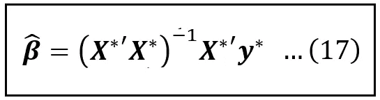****

******β**T20【GLS 估计量】(图片由作者提供)****

****为了简化 Eq (17)，我们用***y***** =****gy****，****x***** =****GX***和***ϵ***** =****gϵ.*** 我们还利用了*(****【GX】****)’=****X****’****G****’。*我们还利用了***ω***矩阵的逆是 ***G'G*** 的结果。后一个结果由等式(7)和(8)得出。这些替换如下所示:****

****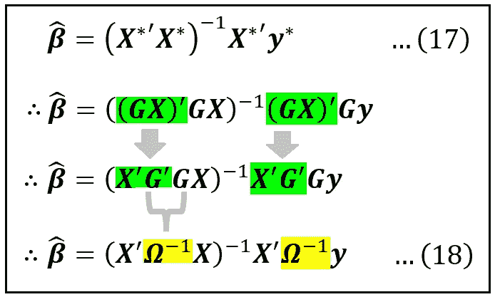****

****GLS 估计量为**(图片由作者提供)******

*****等式(18)是 GLS 估计量(也称为艾特肯广义最小二乘估计量)。无论数据集是否表现出异方差性和/或自相关性，它都是一个有效的、一致的、无偏的估计量。换句话说，保证是系数向量*β的**B**est**L**linear**U**n biased**E**estimator。******

******只有一个问题。******

******它依赖于我们知道误差的协方差矩阵***ω***。但是***ω***本质上是不可观测的，因为它包含了实验者无法直接观测到的模型误差项的协方差。******

******解决方法是建立一个***ω***的模型，并进行估算。然后使用 GLS 估计器 ***使用该估计来估计 ***β*** 。*** 这种使用***ω***的估计版本的策略有时被称为**可行广义最小二乘** ( **FGLS** )技术。******

*****估算***ω有几种策略。*** 其中一个这样的手法型号***ω***为:*****

*****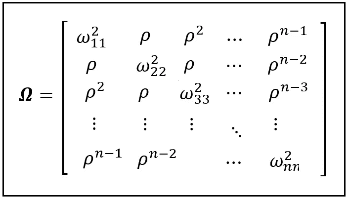*****

*****一模一样的***ω****(图片由作者提供)******

*****在上面的模型中， *ω_ii* 是数据集中第*与第*行对应的第*与第*误差 *ϵ_i* 的方差。我们估计 *n* 方差*ωII*，方法是回归拟合数据集的 OLS 模型中**yy**预测值的残差(我们将在下周的本文第二部分中看到如何做)。*****

******ρ* 是第*个*和第 *(i+1)个*误差项之间的相关性，即 *ϵ_i* 和*ϵ_(i+1*。我们通过拟合数据集的 OLS 模型残差的自相关图来估计 *ρ* 。*****

*****在上述矩阵中，我们假设误差项之间的相关性按照幂律衰减，即*、 *ρ* 、…等。随着相应数据集行之间的间隔增加。******

*****在本文的第二部分(将于下周发表)，我们将通过一个教程来学习如何使用广义最小二乘估计量来拟合 ACS 数据集的线性模型，以估计美国的县级贫困率。*****

*****敬请期待！*****

# *****参考文献、引文和版权*****

## *****数据集*****

*****本文使用的[美国社区调查数据集](https://www.census.gov/programs-surveys/acs/data.html)可以从这里 [**下载**](https://gist.github.com/sachinsdate/0b8ebc2b26afb67a1e83e752c69e1a25) 。使用公开可用的[API](https://www.census.gov/data/developers.html)(参见[服务条款](https://www.census.gov/data/developers/about/terms-of-service.html)和[此链接](https://ask.census.gov/prweb/PRServletCustom?pyActivity=pyMobileSnapStart&ArticleID=KCP-4928))可以从美国人口普查局的网站获取完整的 ACS 数据集，或者直接从人口普查局的 [**社区资源管理器**](https://experience.arcgis.com/experience/13a111e06ad242fba0fb62f25199c7dd/page/Page-1/) 网站获取。*****

## *****纸*****

*****艾特肯(1936)。四。—关于最小二乘法和观测值的线性组合。*爱丁堡皇家学会会议录，* *55* ，42–48。土井:10.1017037686687*****

## *****形象*****

*****本文中所有图片的版权归 [CC-BY-NC-SA](https://creativecommons.org/licenses/by-nc-sa/4.0/) 所有，除非图片下面提到了不同的来源和版权。*****

******如果你喜欢这篇文章，请关注我的*[***Sachin Date***](https://timeseriesreasoning.medium.com)*获取关于回归、时间序列分析和预测主题的提示、操作方法和编程建议。******