# 深入了解 Power BI 增量更新功能

> 原文：<https://towardsdatascience.com/a-deep-dive-into-power-bi-incremental-refresh-feature-a5fc8af781ee>

## 它是什么，它是如何工作的，它到底是如何工作的？

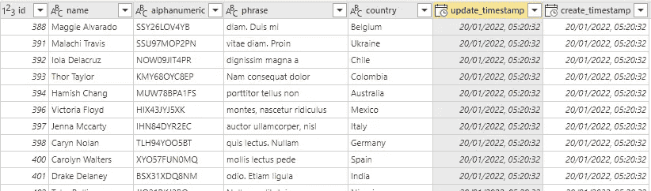

图片由作者提供。这张图片中的名字是虚构的，由电脑生成。

如果你正在读这篇文章，你很可能知道什么是力量比(PBI)和它的用途。在本文中，我想更深入地探讨一下他们的增量更新，这无疑给社区和我认识的人带来了很多困惑。

在 PBI，有一个叫做[增量刷新](https://docs.microsoft.com/en-us/power-bi/connect-data/incremental-refresh-overview)的特性，它允许你的数据集被增量刷新。微软也谈到了增量更新的好处，所以[在这里继续之前先读一下](https://docs.microsoft.com/en-us/power-bi/connect-data/incremental-refresh-overview)。与传统的 ETL/ELT 不同，PBI 有一种相当独特的增量刷新数据的方式，这将在后面讨论。

*我只想强调，此增量刷新仅适用于发布到 PBI web 服务的数据集。

# 入口

*   [ETL/ELT 基础知识](#133d)
*   [微软增量刷新理论基础](#e3ab)
*   [最佳情况和最坏情况场景](#ecbb)
*   [真实世界测试— Power BI 数据集](#9de4)
*   [真实世界测试— Power BI 数据集市(预览)服务](#14f9)
*   [与数据集市的问题](#e20b)
*   [结论](#d5b5)

# ETL/ELT 基础

Stitchdata 写了一篇关于 ETL 过程基础的详细文章，可以在这里找到。

总而言之，ETL 工具通常会使用[变更数据捕获](https://docs.microsoft.com/en-us/sql/relational-databases/track-changes/about-change-data-capture-sql-server?view=sql-server-ver16) (CDC)来检查新数据。但是，由于各种原因，并非所有数据库都启用了 CDC，在这种情况下，将使用最新的行更新时间戳。然后，新的和更改的数据将被追加到数据仓库中，或者根据业务案例覆盖旧的数据。

# 微软增量更新理论基础

回头看看微软提供的文档[，增量刷新被分解为](https://docs.microsoft.com/en-us/power-bi/connect-data/incremental-refresh-overview)[几个组件](https://docs.microsoft.com/en-us/power-bi/connect-data/incremental-refresh-overview#define-policy)，它们是:

1.  存档数据
2.  增量数据范围
3.  检测数据更改

而且文档中也写明了微软基于分区刷新数据。

为了帮助你，我在 Excel 中创建了一个简单的表格来演示理论上的工作方法。让我们假设今天是 2022 年 8 月 2 日。

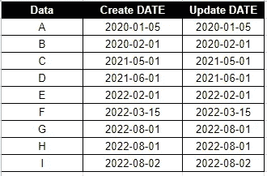

由作者提供的图像数据集

上面是我们第一次将数据加载到 PBI 服务时，初始数据集的一个小样本集。将自动创建几个分区，如下所示:

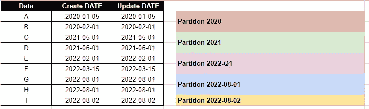

初始分区数据集:图片由作者提供

## 1.存档数据

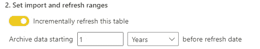

图片由作者提供:Power BI 增量弹出存档选项截图

在不更新任何数据并将存档数据范围设置为 1 年的情况下，PBI 服务将在 1 年前的今天(2022 年 8 月 2 日)删除所有数据分区。在上面的例子中，分区 2020 将被删除。

## 2.增量数据范围

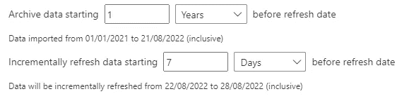

图片由作者提供:Power BI 增量弹出增量选项截图

如果我们将增量数据设置为刷新日期前 7 天的范围，实质上 PBI 服务将删除今天之前 7 天的数据，并重新加载所有 7 天的数据。在我们上面的样本数据集中，“Partition 2022–08-xx”中的所有内容都将被删除，并从源中重新加载。

## 3.检测数据更改

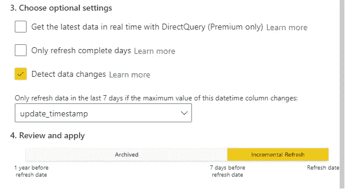

图片由作者提供:Power BI 增量弹出检测数据更改选项截图

现在，当我们选择 detect data changes 时，PBI 服务将只刷新增量范围(在我们的示例中是最后 7 天)的**分区，其中最大*更新日期*被更改。**

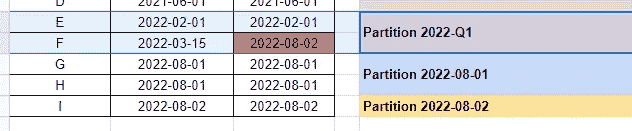

图片由作者提供

在我们的数据集示例中，如果 F 数据被更改，**不会发生刷新**，因为分区 2022-Q1 不在我们过去 7 天的增量范围内。

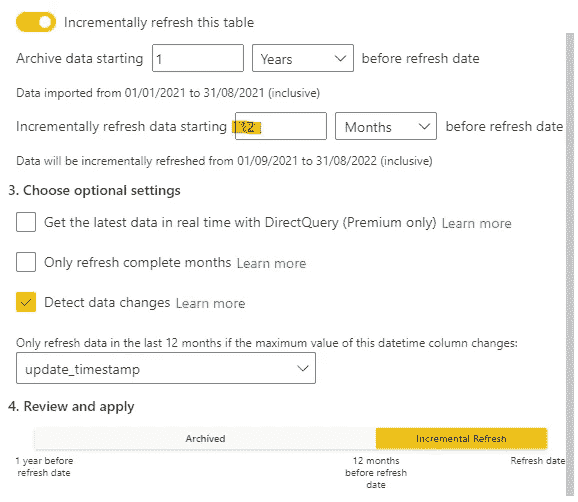

更新的增量刷新范围:图片由作者提供

但是，如果我们在刷新日期之前将增量范围从 7 天更改为 12 个月，分区 2022-Q1 数据(E 和 F)将被删除并重新加载。

# 最好和最坏的情况

最好的情况看起来像一个事务表，其中添加了新行，旧行没有更新。

正常的情况是，通常添加新行，更新的行在一个分区内。这可能是一个简单的音乐会事件表，其中在很短的时间内发生门票购买和取消。事件发生 1 个月后，数据将不再更新。

最坏的情况是每个分区至少有一次更新。这将导致几乎整个表被重新加载，因为 PBI 增量刷新将重新加载整个分区，可能会重新加载整个表。一个用例可能是一个库存系统，其中项目在几个月或几年前被检入，并且每天被检出。

# 真实世界测试— Power BI 数据集

现在我们知道了 PBI 服务是如何增量刷新数据集的，那么它在部署时实际上也是这样吗？

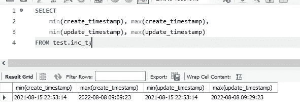

作者图片

为了测试这一点，我建立了一个包含 500 行虚拟数据的 MySQL 数据库。*创建日期和更新日期*，范围从*2021–08–15*到*2022–08–08*。

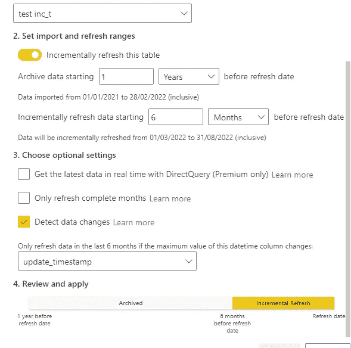

作者图片:增量刷新配置

PBI 增量刷新配置如上截图。

我在 MySQL 上启用了查询日志来记录运行的查询。

```
SET global general_log = 1;
SET global log_output = 'table';
```

然后，我将包含该数据集的数据集/Power BI 报告发布到高级工作区，并通过安装在我电脑上的 Power BI Gateway 刷新数据集。

## 测试用例 PBI01:刷新而不更新任何数据

对于第一个测试用例，我只是再次刷新了数据，而没有更新数据库中的任何数据。

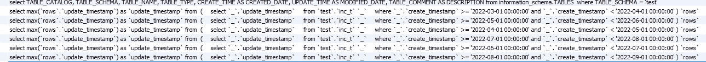

图片由作者提供

```
select max(`rows`.`update_timestamp`) as `update_timestamp`
from 
(
    select `_`.`update_timestamp`
    from `test`.`inc_t` `_`
    where `_`.`create_timestamp` >= '2022-05-01 00:00:00' and `_`.`create_timestamp` < '2022-06-01 00:00:00'
) `rows`
```

从日志中，PBI 服务检查每个分区的最大更新，在我们的例子中:

*   2022–03–01 > 2022–04–01
*   2022–04–01 > 2022–05–01
*   2022–05–01 > 2022–06–01
*   2022–06–01 > 2022–07–01
*   2022–07–01 > 2022–08–01
*   2022–08–01 > 2022–09–01

在我们的例子中，因为没有更新数据，所以没有发生刷新，也没有运行额外的查询。第一个测试用例通过了。

## 测试用例 PBI02:在增量范围内更新行

在第二个测试案例中，我将在 MySQL 源数据库上从创建日期*2022–06–01*更新 2 行到*2022–08–28*(需要更新 2 行)。

```
UPDATE INC_t
SET UPDATE_TIMESTAMP = '2022-08-08 09:29:23'
WHERE DATE(CREATE_TIMESTAMP) = '2022-06-01';-- 2 row(s) affected Rows matched: 2  Changed: 2  Warnings: 0 0.015 sec
```

然后，当然，手动触发计划的刷新。

```
select `$Ordered`.`id`,
    `$Ordered`.`name`,
    `$Ordered`.`alphanumeric`,
    `$Ordered`.`phrase`,
    `$Ordered`.`country`,
    `$Ordered`.`update_timestamp`,
    `$Ordered`.`create_timestamp`
from 
(
    select `_`.`id`,
        `_`.`name`,
        `_`.`alphanumeric`,
        `_`.`phrase`,
        `_`.`country`,
        `_`.`update_timestamp`,
        `_`.`create_timestamp`
    from `test`.`inc_t` `_`
    where `_`.`create_timestamp` >= '2022-06-01 00:00:00' and `_`.`create_timestamp` < '2022-07-01 00:00:00'
) `$Ordered`
order by `$Ordered`.`id`
```

对每个分区运行最大更新的初始检查，然后如上所述运行新的查询。该查询将重新加载从*2022–06–01*到*2022–07–01*的所有数据。

这表明增量刷新符合文档，并且没有加载整个数据集。

# 真实世界测试— Power BI 数据集市(预览)服务

就在最近，微软推出了数据集市，你可以在这里阅读更多的信息。在数据集市内部，有一个增量刷新选项。为了进行测试，我通过设置的同一个 Power BI 网关将数据集市连接到同一个 MySQL 数据库。

这是在初始数据加载时运行的查询。如图所示，加载所有数据时没有任何 *WHERE* 子句。

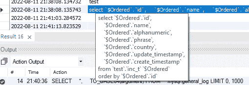

作者图片

在装载了初始数据之后，就该在 datamart 中对该表设置增量刷新了。

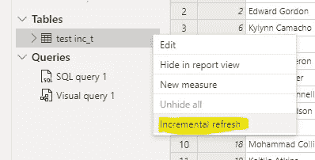

作者图片

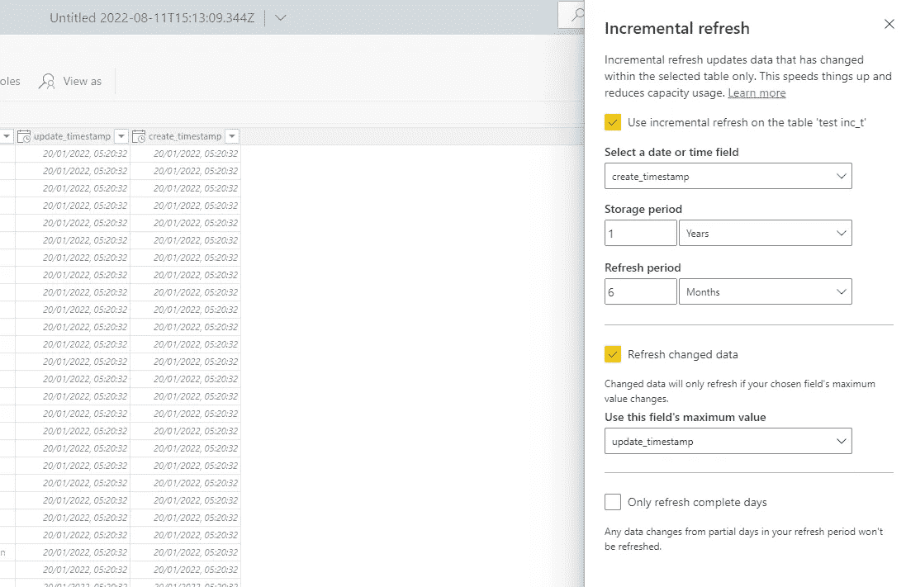

图片作者:增量刷新配置

配置设置类似于我在 Power BI Desktop 中做的第一个测试用例。然而，使用数据集市，**不需要**创建 RangeStart 和 RangeEnd 参数，因为它们是自动创建的。

当然，手动触发数据集市的计划刷新。

## 测试用例 D01:刷新而不更新任何数据

从运行的查询来看，它们是用于检查 MAX update 的 **no** 查询。相反，**查询并加载了过去 6 个月的所有分区。**

```
select `_`.`id`,
    `_`.`name`,
    `_`.`alphanumeric`,
    `_`.`phrase`,
    `_`.`country`,
    `_`.`update_timestamp`,
    `_`.`create_timestamp`
from 
(
    select `_`.`id`,
        `_`.`name`,
        `_`.`alphanumeric`,
        `_`.`phrase`,
        `_`.`country`,
        `_`.`update_timestamp`,
        `_`.`create_timestamp`
    from `test`.`inc_t` `_`
    where `_`.`create_timestamp` >= '2022-05-01 00:00:00' and `_`.`create_timestamp` < '2022-06-01 00:00:00'
) `_`
order by `_`.`update_timestamp` desc
limit 4096
```

这表明数据集市中刷新更改的数据的行为与 PBI 增量刷新中检测数据更改的行为不同。

为了进一步测试，我将更新我的配置以刷新最近 1 个月的数据，并跳转到第二个测试用例。

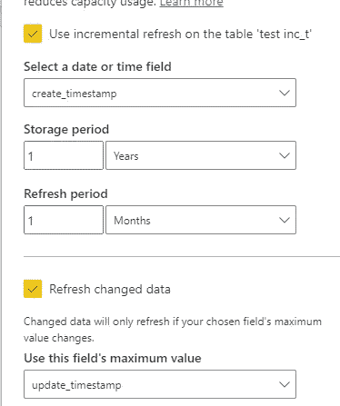

作者图片

和预期的一样，1 个月的数据被查询和刷新。

```
select `_`.`id`,
    `_`.`name`,
    `_`.`alphanumeric`,
    `_`.`phrase`,
    `_`.`country`,
    `_`.`update_timestamp`,
    `_`.`create_timestamp`
from 
(
    select `_`.`id`,
        `_`.`name`,
        `_`.`alphanumeric`,
        `_`.`phrase`,
        `_`.`country`,
        `_`.`update_timestamp`,
        `_`.`create_timestamp`
    from `test`.`inc_t` `_`
    where `_`.`create_timestamp` >= '2022-08-01 00:00:00' and `_`.`create_timestamp` < '2022-09-01 00:00:00'
) `_`
order by `_`.`update_timestamp` desc
limit 4096
```

## 测试案例 D02:更新 2022–06–05 的行

鉴于刷新更改的数据与 PBI 服务检测数据更改的行为不同，我将更新*创建日期*落在*2022–06–05*的行。

```
UPDATE INC_t
SET UPDATE_TIMESTAMP = '2022-08-28 23:00:00'
WHERE DATE(CREATE_TIMESTAMP) = '2022-06-05';
-- 4 row(s) affected Rows matched: 4  Changed: 4  Warnings: 0 0.000 sec
```

运行刷新后，只运行了 1 个查询，即只刷新本月的数据。

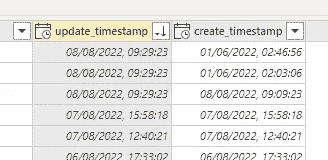

作者图片

检查 update timestamp 列，很明显最新的更新没有被刷新到数据集市中。因此，数据集市增量刷新的第二个测试用例被认为是失败的。

## 数据集市的问题

我用其他变量和数据源(如 Oracle DB)在数据集市上重复了这个测试，但是，结果总是相同的，刷新更改的数据**从不**考虑。所有增量范围分区的完全刷新总是在发生。

# 结论

增量刷新对于优化源数据库的数据加载至关重要，可以减少源数据库的开销，同时确保报告数据是最新的。随着 Microsoft datamart 的引入，在不久的将来，一旦超出预览范围，统一各种来源的数据将变得更加容易。希望这篇文章能澄清一些关于增量刷新如何工作的困惑。

Power BI 桌面增量刷新按预期工作，但不幸的是，datamart 增量刷新没有。由于数据集市仍在预览中，我确信微软将很快修复它，这只是数据集市可能暂时影响你的生产数据库的一个 PSA。一旦我再次测试并确认它被修复，或者如果我遗漏了什么，这篇文章也会被更新。我还将测试[微软数据流](https://docs.microsoft.com/en-us/power-bi/transform-model/dataflows/dataflows-introduction-self-service)，它应该很快就会被弃用。但是，如果它确实是到数据集市的更好的连接器，我将写另一篇关于设置的文章！