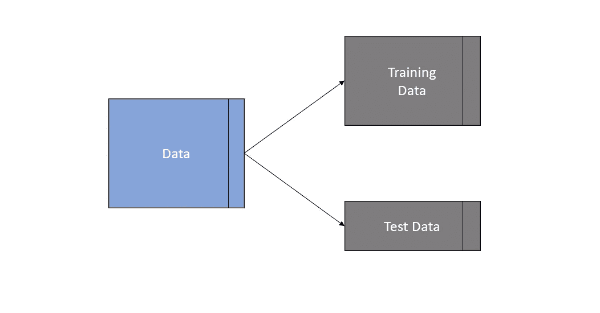
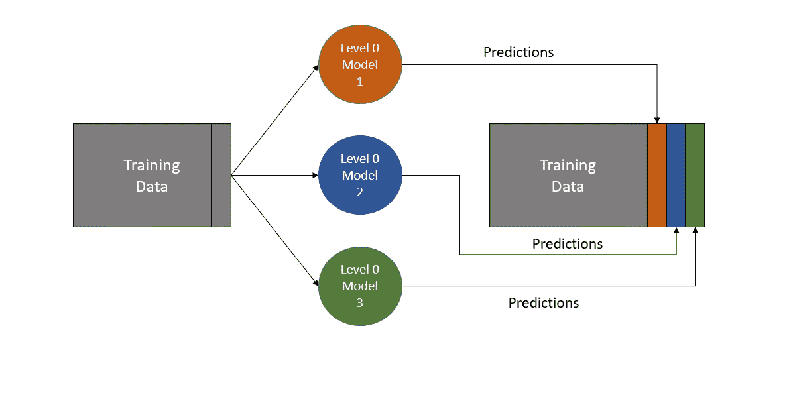
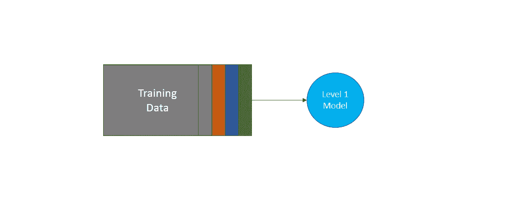
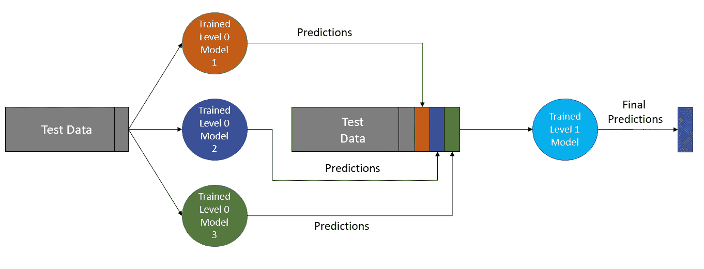

# 深入研究堆叠集成机器学习—第一部分

> 原文：<https://towardsdatascience.com/a-deep-dive-into-stacking-ensemble-machine-learning-part-i-10476b2ade3>

## 如何通过充分理解堆叠是什么以及如何工作，在机器学习中有效地使用堆叠

由[蒂姆·怀尔德史密斯](https://unsplash.com/@timwildsmith?utm_source=unsplash&utm_medium=referral&utm_content=creditCopyText)在 [Unsplash](https://unsplash.com/s/photos/stack-of-books?utm_source=unsplash&utm_medium=referral&utm_content=creditCopyText) 拍摄的照片

## 背景

我在几本书里读到过关于堆叠的内容，也在 Kaggle 和其他网上搜索过堆叠的例子。

从阅读和研究中可以清楚地看到，堆叠有可能提高预测算法的准确性，改善 Kaggle 上的排行榜结果，以及现实世界中机器学习算法的准确性和影响。

主要的问题是我没有读到足够的解释什么是堆叠或者它是如何工作的。另一个问题是，文章、博客、书籍和文档在详细解释和实现堆叠时相互矛盾。

这让我想知道更多，以满足我自己的好奇心，也让我知道什么时候堆叠作为一种技术是合适的，什么时候应该避免。

由此开始了一段时间的阅读和研究，以及使用 Python 和 Jupyter 笔记本的实际实验。这些是我在调查中发现的一些最有用的来源-

*   卡格尔([https://www.kaggle.com/](https://www.kaggle.com/))。
*   `sci-kit learn`文档([https://sci kit-learn . org/stable/modules/generated/sk learn . ensemble . stacking classifier . html](https://scikit-learn.org/stable/modules/generated/sklearn.ensemble.StackingClassifier.html))。
*   “机器学习掌握”中的各种教程([https://machinelearningmastery.com/](https://machinelearningmastery.com/))。
*   《逼近(几乎)任何机器学习问题》一书，作者 Abhisek tha kur([https://www . Amazon . co . uk/approximating-Almost-Machine-Learning-Problem-ebook/DP/b 089 p 13 qht](https://www.amazon.co.uk/Approaching-Almost-Machine-Learning-Problem-ebook/dp/B089P13QHT))。

## 概观

以下一组步骤是我从我研究过的关于堆叠的各种来源中找到的最接近一致意见的直观表示

***第一步:将数据拆分成训练和测试/验证数据集***

作者图片

第一步是直观的，复制机器学习中常见的第一步。训练数据将用于构建堆叠模型，测试/验证数据将被保留并用于评估性能。

在上图中，代表数据的矩形沿垂直轴一分为二。较大的部分代表特征，而末端较小的部分/列代表目标。

***步骤 2a:训练 0 级模型***

堆叠是一个两层模型。这张图直观地展示了第一阶段“0 级”的情况

作者图片

本质上，这里正在进行的是一个巧妙的特征工程。

特征工程的一个传统例子是通过将两个预先存在的列“速度”和“时间”相乘来创建一个名为“行驶距离”的新列。设计这种新特征可能会提供提高预测性能的相关信息。

在堆叠的 0 级阶段，在给定训练数据集原始特征的情况下，使用预测模型的集合来独立预测目标的值。然后，这些预测将作为新特征添加到训练数据中。

不同的消息来源对这一阶段的详细工作方式有矛盾。Abhishek Thakur 指出，训练数据应该折叠起来，以生成新功能的预测，而`scikit-learn`文档则相反

*"注意估值器是装在全 X 上的"*([https://sci kit-learn . org/stable/modules/generated/sk learn . ensemble . stacking classifier . html](https://scikit-learn.org/stable/modules/generated/sklearn.ensemble.StackingClassifier.html))

在实践中，我尝试了两种方法，采用 scikit-learn 方法显著提高了我所使用的数据集的预测性能。我也喜欢 scikit-learn 方法，因为它使阶段 4 更加直观。

***步骤 2b:微调步骤 2a***

要考虑的最后一个问题是，到底使用 0 级模型中的什么来转换训练数据，有几种选择。

第一个决定是完全替换现有特征，以便训练数据仅包含 0 级模型预测，还是将新特征附加到训练数据上。

上图显示了追加到数据中的预测，实际上，我发现保留原始要素可以显著提高完整叠加模型的性能。

第二个决定是在预测列中使用什么数据。

在回归中直接使用连续的预测值，但是在分类中有更多的选择

第一种选择是简单地使用预测的类。在上述每一列的二进制分类中(显示为橙色、蓝色和绿色)，根据 0 级模型预测，每行将包含 1 或 0。

然而，事实证明，如果使用预测概率而不是预测，叠加模型的性能会显著提高。对于二元分类器，可以使用零类或一类的预测概率；它们完全共线，因此选择哪一个对结果没有影响。

总之，根据我的实验，如果机器学习算法正在解决一个二进制分类，那么微调如下-

1.  保留原始要素并将预测作为附加要素追加。
2.  使用 class=1 的预测概率作为数据，不要使用直接预测。

***第三步:训练一级模型***

现在，第 1 步和第 2 步已经添加了新功能，是时候训练“1 级模型”了，在某些来源中也被称为“最终评估者”

作者图片

与前面的步骤相比，这个阶段非常简单，我们现在可以做预测了。

水平 1 模型简单地适合于转换的训练数据，并且我们有我们训练的叠加模型。

***第四步:对测试/验证数据进行预测***

作者图片

好吧，这看起来有点吓人，但实际上很简单。

用作训练的“1 级模型”的输入的测试/验证数据必须具有与用于拟合它的训练数据相同的形状(就特征的数量和顺序而言),但是碰巧这很容易做到。

将训练/拟合的“0 级模型”顺序应用于测试/验证数据，以添加模型预测作为新特征，这样，训练和测试/验证数据的形状将匹配。

然后将经过训练的“1 级模型”应用于转换后的测试数据，以提供由叠加模型产生的最终一组预测。

## 结论

堆叠在概念上很难把握，至少那是我在花大量时间阅读、研究和实验之前的体验。

然而，一旦理解了堆叠，在实践中应用起来就相对简单了，这将是本系列文章的第二部分和第三部分的主题。

在本系列文章的第二部分中，我们将使用`scikit-learn`库实现一个堆栈模型，以提高我们的理解并评估整体性能

 [## 深入研究堆叠集成机器学习—第二部分

### 如何通过在 Python、Jupyter 和 Scikit-Learn 中实现堆栈来有效地在机器学习中使用堆栈

towardsdatascience.com](/a-deep-dive-into-stacking-ensemble-machine-learning-part-ii-69bfc0d6e53d) 

第三部分将从零开始完整地构建一个堆叠算法，以完成对堆叠及其详细工作原理的全面而深刻的理解。

## 一锤定音

我最初当然很难完全理解堆栈，直到我研究了`scikit-learn`实现，然后从头开始构建我自己的堆栈算法，我才获得了很好的理解。

希望这篇文章以及第二和第三部分将帮助其他人实现这种理解，而不必进行所有的研究，这将使人们能够就在哪里以及如何实现堆叠做出明智的选择，以实现预测机器学习算法的优化性能。

# 感谢您的阅读！

如果你喜欢读这篇文章，为什么不看看我在[https://grahamharrison-86487.medium.com/](https://grahamharrison-86487.medium.com/)的其他文章呢？此外，我很乐意听到您对这篇文章、我的任何其他文章或任何与数据科学和数据分析相关的内容的看法。

如果你想联系我讨论这些话题，请在 LinkedIn 上找我—[https://www.linkedin.com/in/grahamharrison1](https://www.linkedin.com/in/grahamharrison1)或者发邮件给我[ghar rison @ Lincoln college . AC . uk](mailto:GHarrison@lincolncollege.ac.uk)。

如果你想通过订阅来支持作者和全世界 1000 个为文章写作做出贡献的人，请使用下面的链接(注意:如果你使用这个链接免费注册，作者将收到一定比例的费用)。

 [## 通过我的推荐链接加入媒体-格雷厄姆哈里森

### 作为一个媒体会员，你的会员费的一部分会给你阅读的作家，你可以完全接触到每一个故事…

grahamharrison-86487.medium.com](https://grahamharrison-86487.medium.com/membership)