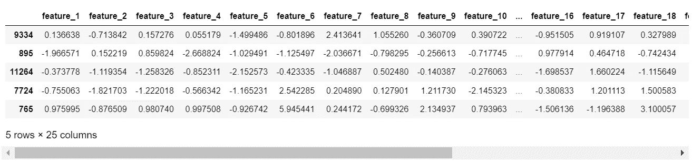
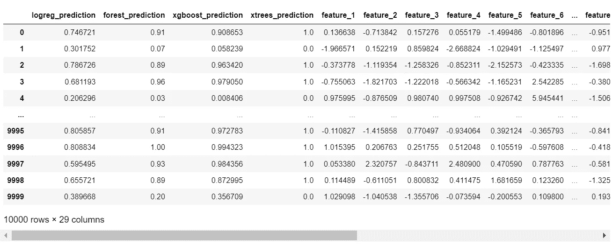
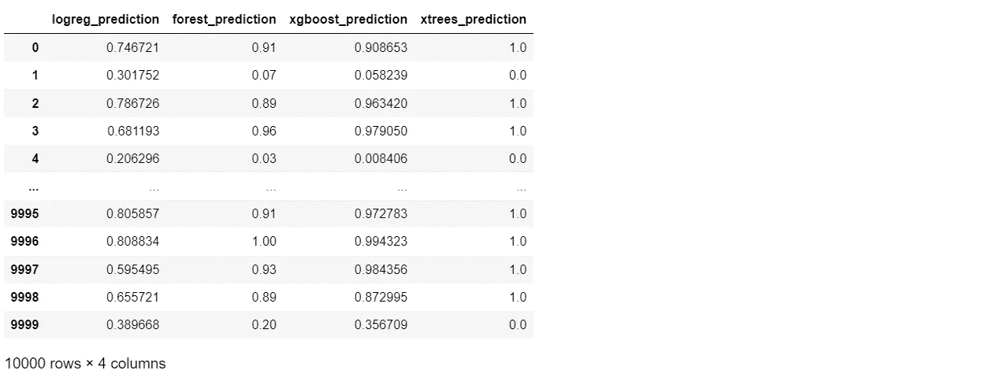
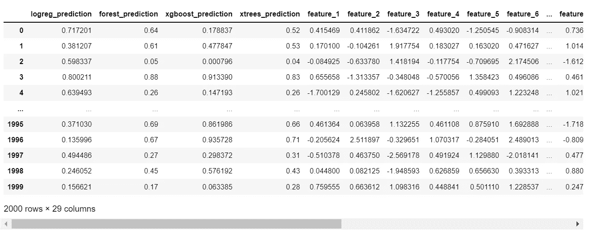
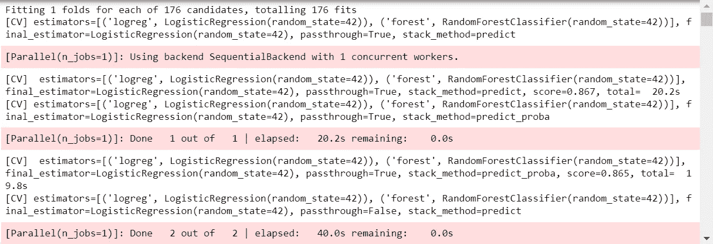

# 深入研究堆叠集成机器学习—第二部分

> 原文：<https://towardsdatascience.com/a-deep-dive-into-stacking-ensemble-machine-learning-part-ii-69bfc0d6e53d>

## 如何通过在 Python、Jupyter 和 Scikit-Learn 中实现堆叠分类器，在机器学习中有效地使用堆叠


由[蒂姆·怀尔德史密斯](https://unsplash.com/@timwildsmith?utm_source=unsplash&utm_medium=referral&utm_content=creditCopyText)在 [Unsplash](https://unsplash.com/s/photos/stack-of-books?utm_source=unsplash&utm_medium=referral&utm_content=creditCopyText) 拍摄的照片

## 背景

在我最近的一篇关于堆叠的文章中，我通过建立一个可视化的工作流程，探索了什么是堆叠以及它是如何工作的，这个工作流程包含了创建堆叠模型的 4 个主要步骤。

[](/a-deep-dive-into-stacking-ensemble-machine-learning-part-i-10476b2ade3)  

然而，要真正理解堆叠模型内部发生了什么(从而理解何时以及如何在机器学习中采用这种方法)，通过编写一些代码来了解算法是必不可少的。

本文使用`scikit-learn`库构建了一个堆栈模型，然后本系列的第三部分将通过从头开始开发代码来实现堆栈，从而进入最后的细节层次。

# 入门指南

要开始，需要导入所需的库，并创建一些将在代码主体中使用的常数…

# 获取一些数据

我们还需要一些数据来处理，为此，我们将使用一个助手函数来轻松地将数据创建为带有标签列的单个数据帧。

请注意，堆叠可以应用于回归和，也可以应用于二元和非二元分类。创建此数据集是为了构建一个对二元分类进行建模的示例，即目标可以正好有两个值…



作者图片

数据被分割如下-

*   X _ train 训练数据集特征
*   y _ train 训练数据集标签/类
*   X _ val 验证数据集要素
*   y _ val 验证数据集标签/类

X_train，y_train 数据集将用于构建叠加模型，而 X_val，y_val 将被保留并仅用于模型评估。

# 准备堆叠

本系列文章的第一部分展示了堆叠是一个两级模型，其中“0 级”用于生成成为数据中新要素的分类标签，而“1 级”模型用于生成最终标签预测。

以下代码对此进行了设置…

Level 0 已经实现为分类机器学习算法的字典。选择了四种不同类型的模型——逻辑回归、随机森林、XG boost 和额外随机树。

后 3 个都是高性能分类器，逻辑回归提供了一些变化。我们特意选择了高性能算法，以观察叠加模型是否能成功地超越它们。

为“1 级”算法(或“最终估计值”)选择了一个随机森林。实验表明，它是该数据集上性能最高的单个算法，因此被选为 1 级模型，以提高堆叠模型的性能。

## 使用 Scikit-Learn 创建堆叠模型

`scikit-learn`提供易于使用的堆栈实现；我们将详细研究输出和数据，以准确理解它在做什么。

因为`scikit-learn`在 1 级模型/最终估计器中使用折叠来生成最终预测，所以`StratifiedKFold`作为参数传递

*"请注意，估计量是在全 X 上拟合的，而 final_estimator_ 是使用 cross_val_predict 使用基本估计量的交叉验证预测来训练的。"*([https://sci kit-learn . org/stable/modules/generated/sk learn . ensemble . stacking classifier . html](https://scikit-learn.org/stable/modules/generated/sklearn.ensemble.StackingClassifier.html))

本文的第一部分详细探讨和解释了这种方法。

## 生成 0 级预测作为工程特征


作者图片

堆叠的下一阶段是使用 0 级模型生成分类预测，并将它们作为特征附加到训练数据。

下面是在`scikit-learn`实现中是如何做到的...



作者图片

从输出中可以看出，`scikit-learn` `StackingClassifier.fit_transform()`方法将特性附加到了`passthrough=True`处的预测中。如果`passthrough`被设置为`False`，输出将只包含预测。

## 那么 Scikit-Learn 是怎么做到的呢？

一点点实验显示了图书馆到底在做什么。`logreg_prediction`、`forest_prediction`、`xgboost_prediction`和`xtrees_prediction`栏中的值生成如下-



作者图片

这就是它的全部！`scikit-learn`堆叠分类器只是简单地按顺序训练每个 0 级分类器，然后使用每个分类器的第二列`predict_proba`函数来填充新特征

请注意，`predict_proba`的第二列(使用`[:, 1]`切片)只是 class=1 的概率(在二进制分类的情况下，可能值为 0 和 1)。

还要注意的是，如果`StackingClassifier`设置 passthrough=True，分类预测将被附加到数据中，而如果 passthrough=False，则原始特征将被移除，只留下新生成的特征/分类预测。

我的实验表明，通过将原始要素保留在数据集中，下一个代码块将重新训练堆叠分类器以重新训练所有原始要素，性能会得到显著提高…

## 为测试数据生成 1 级/最终预测


作者图片

这个下一阶段看起来很复杂，但是在`scikit-learn.`中执行这个操作非常容易

这第一行代码并不是真正必要的，我们可以直接跳到`stacking_model.predict(X_val)`，但是我在上面的图表中加入了它来显示转换后的数据，用灰色的测试数据矩形表示，橙色、蓝色和绿色的预测作为新的特性附加在上面。



作者图片

这行代码当然是必要的；它对包含 0 级预测作为特征的转换后的测试数据执行 1 级模型预测。

`y_val_pred`在上图中表示为最终的紫色矩形。

```
array([0, 1, 0, ..., 0, 0, 0])
```

## 那么这一切值得吗？

现在是时候通过比较完整的 0 级和 1 级堆叠模型的准确性与我们选择其中一个 0 级模型来预测`y_val`时看到的性能来评估性能了…

```
Accuracy of scikit-learn stacking classifier: 0.8825
Accuracy of standalone logreg classifier: 0.737
Accuracy of standalone forest classifier: 0.8675
Accuracy of standalone xgboost classifier: 0.8645
Accuracy of standalone xtrees classifier: 0.8635
```

全堆积模型的准确率为 88.25%，而性能最高的独立分类器的准确率为 86.75%，提高了 1.5%。

1.5%的精度提升可能看起来并不巨大，但请考虑以下情况-

1.  在 Kaggle 竞争中，1.5%的改进可能代表在排行榜上的位置发生重大变化。
2.  如果正在解决的业务问题在操作上至关重要(股票市场预测、预测岩石与矿山等)。)那么百分之几都算数。
3.  其他压缩改进选项，如超参数调整，可能会实现较小的改进。
4.  每个 0 级模型和 1 级模型/最终估计值可以单独进行超参数调整，这在与叠加结合时可以产生更多的改进。

## 我们能做得更好吗？

嗯，我想我们可以。在我的调查过程中，我遇到了一位数据科学家编写的一些非常聪明的代码，这些代码执行了大量计算，以选择 0 级和 1 级分类器的最佳组合。

我真的很喜欢这个想法，但我不禁认为它过于复杂，必须有一种方法来用更少的代码实现相同的结果，这导致了一个使用网格搜索来找到最佳组合的实验。

我们需要的第一件事是一个小函数来帮助生成将在网格搜索中使用的各种参数排列-

这个想法是使用`power_set`函数生成所有有用的 0 级模型组合，用作网格搜索参数...

```
[['logreg', 'forest'],
 ['logreg', 'xgboost'],
 ['logreg', 'xtrees'],
 ['forest', 'xgboost'],
 ['forest', 'xtrees'],
 ['xgboost', 'xtrees'],
 ['logreg', 'forest', 'xgboost'],
 ['logreg', 'forest', 'xtrees'],
 ['logreg', 'xgboost', 'xtrees'],
 ['forest', 'xgboost', 'xtrees'],
 ['logreg', 'forest', 'xgboost', 'xtrees']]
```

级别 1 由单个模型组成，因此网格搜索参数将是单个对象的简单列表…

```
['logreg', 'forest', 'xgboost', 'xtrees']
```

有了这些构件，在定义了网格搜索参数后，只需 3 行代码就可以实现堆叠模型的整体优化。

请注意，`PredefinedSplit`强制网格搜索以与独立叠加模型相同的方式使用训练和测试数据，以便结果可以直接比较…



作者图片

```
Best accuracy score:  0.8895
Best estimators:  ['logreg', 'forest', 'xgboost', 'xtrees']
Best final estimator:  RandomForestClassifier(random_state=42)
Best passthrough:  True
Best stack method:  predict_proba
```

结果出来了！

最佳配置是包括所有 4 个分类器作为第 0 级模型，但是如果我们使用一个`RandomForestClassifer`而不是一个`ExtraTreesClassifier`作为第 1 级模型，我们可以获得更高的性能。这种组合实现了 88.95%的准确率，比最高性能的单个算法高出整整 2.2%。

非常有趣的是，0 级模型的最佳选择包括`LogisticRegression`分类器，其性能(73.7%的准确率)比其他分类器低得多。这只是表明，包括较低表现者在内的各种模型可以推动整体表现的提高。

# 结论

总之，当涉及到提高分类和回归机器学习算法的准确性时，堆叠确实有效。

这不太可能在 5%-10%的范围内产生准确性改进，但根据所解决的业务或竞争问题的背景，这种改进仍然可能是显著的。

使用堆垛时应适当考虑；这将花费更多的时间，并且会增加复杂性。如果额外的复杂性和解释算法如何计算其答案的相关难度是准确度提高< 5%的良好折衷，那么使用堆叠是值得的。

本文提供了一个使用`scikit-learn`堆栈实现的简单、低代码的工作示例，并详细解释了它的工作原理，这可以帮助数据科学家决定在他们的解决方案中何时使用堆栈，何时不使用堆栈。

# 感谢您的阅读！

如果你喜欢读这篇文章，为什么不看看我在 https://grahamharrison-86487.medium.com/的其他文章呢？此外，我很乐意听到您对这篇文章、我的任何其他文章或任何与数据科学和数据分析相关的内容的看法。

如果你想联系我讨论这些话题，请在 LinkedIn 上找我—【https://www.linkedin.com/in/grahamharrison1 或者发电子邮件到[ghar rison @ Lincoln college . AC . uk](mailto:GHarrison@lincolncollege.ac.uk)。

如果你想通过订阅来支持作者和全世界 1000 个为文章写作做出贡献的人，请使用下面的链接(注意:如果你使用这个链接免费注册，作者将收到一定比例的费用)。

[](https://grahamharrison-86487.medium.com/membership) 