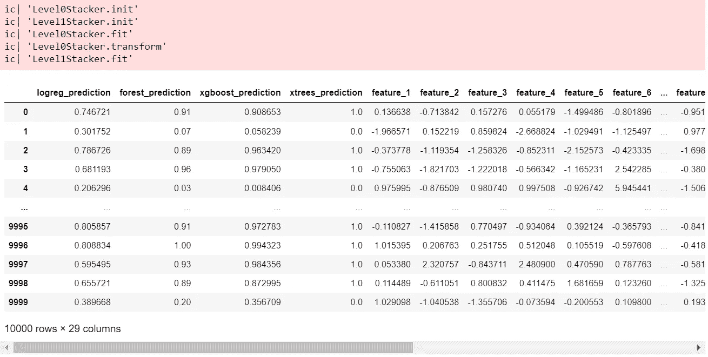
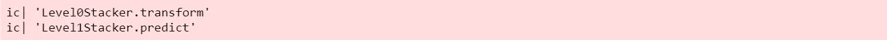

# 深入探讨堆叠集成机器学习—第三部分

> 原文：<https://towardsdatascience.com/a-deep-dive-into-stacking-ensemble-machine-learning-part-iii-1ebd6bedc442>

## 如何通过在 Python 和 Jupyter 中实现一个从零开始的堆叠模型来充分理解堆叠并在机器学习中有效地使用它


蒂姆·怀尔德史密斯在 [Unsplash](https://unsplash.com/s/photos/stack-of-books?utm_source=unsplash&utm_medium=referral&utm_content=creditCopyText) 上的照片

## 背景

在我最近的两篇关于使用堆栈实现集成机器学习算法的文章中，我探讨了堆栈是如何工作的，以及如何在`scikit-learn`中构建和理解堆栈算法。

</a-deep-dive-into-stacking-ensemble-machine-learning-part-i-10476b2ade3>  </a-deep-dive-into-stacking-ensemble-machine-learning-part-ii-69bfc0d6e53d>  

本系列的最后一篇文章将通过从头构建一个堆叠算法，并使用流水线来链接 0 级和 1 级模型，进一步加深对这个问题的理解。

## 入门指南

与本系列的其他文章一样，我们需要导入一组将在代码中使用的库，并创建一些常量…

## 获取一些数据

我们还将坚持使用其他文章中使用过的相同数据集…


作者图片

## 第二部分的快速提醒

如果你想知道所有的细节，请回头看看第二部分(或者在进行任何编码之前，回头看看第一部分的原则指南)。

总之,`scikit-learn`在第二部分中被用于实现堆叠部分，其中 0 级和 1 级模型被组合以产生一个分类器，该分类器通过添加分类预测作为工程特征来提高性能


作者图片


作者图片

下一步是使用经过训练的堆积模型来生成一组预测…


作者图片

```
array([0, 1, 0, ..., 0, 0, 0])
```

## 从头开始构建堆叠分类器

临时构建的分类器的设计如下-

1.  使用`Transformer`模式构建一组 0 级模型。
2.  将级别 1 模型实现为一个简单的分类器。
3.  使用管道将两者连接在一起。

## 1.使用 Python 中的面向对象技术构建 0 级和 1 级模型

使用`Transformer`模式构建 0 级模型，使用`Estimator`模式构建 1 级模型，如下所示-

## 2.使用管道训练堆叠模型



作者图片

首先要注意的是，临时构建堆栈模型在训练阶段产生与`scikit-learn`相同的输出，这是对实现的良好验证。

第二件要注意的事情是,`icecream`调试输出告诉我们管道是如何工作的(注意:我可以使用`print`语句，但是当代码被移入外部库时`icecream`仍然工作，而`print`只在本地工作)

*   管道必须由一个或多个`Transformer`对象组成，后跟一个`Estimator`对象。
*   在任何事情发生之前，对每个对象调用`init`方法。
*   当在管道上调用`fit()`方法 id 时...
*   对于每个`Transformer`，调用`fit()`方法，然后调用`transform()`方法。这是调用训练数据的正确方法顺序。
*   对于管道中的最后一个对象(`Estimator`)，只调用了`fit`方法。

我构建`Level1Stacker`类而不是直接添加`Estimator`的原因是，我可以向`icecream`添加调试语句，以准确演示正在调用的方法。

`Level0Stacker`类不是很复杂。`fit()`方法只是将 0 级模型中的每个分类器与整个训练数据相匹配。我已经查看了一些代码样本，其中使用了出折叠预测，但是`scikit-learn`在整个 X 上训练，所以对我来说已经足够好了。

也值得考虑一下`copy_data`helper 函数的情况。我发现，当`DataFrame`对象通过管道传递时，管道会崩溃，除非每一步都严格地处理已经重置了索引的深层副本。

`transform()`方法简单地在 0 级模型周围迭代，根据`stack_method`参数的设置调用`predict`或`predict_proba`，然后将预测作为新特征添加到数据中。

非常重要的是，用`fit()`方法拟合 0 级模型，然后用`transform()`方法进行预测，我们将在下面看到...

## 3.根据测试数据进行预测



作者图片

```
array([1, 1, 0, ..., 0, 0, 0])
```

再次，`icecream`调试使我们能够看到到底发生了什么。调用管道上的`predict()`方法依次调用每个`Transformer`的`transform()`方法，然后调用`Estimator`对象的`predict()`方法。

## 有效果吗？

嗯，我们已经成功地从零开始建立了一个堆叠模型。训练模型并生成作为新数据特征的 0 级预测的步骤肯定有效，因为临时构建的模型的输出与`scikit-learn`相同。

然而，最终的预测是不一样的…

```
Accuracy of scikit-learn stacking classifier: 0.8825
Accuracy of scratch built stacking classifier: 0.8735
```

`scikit-learn` `StackingClassifier`的文档说明-

"`estimators_`在全 X 上拟合，而`final_estimator_`通过使用`cross_val_predict`的基础估计器的交叉验证预测进行训练"

然而，当我试图在临时构建堆栈器中复制时，精确度远低于`scikit-learn`堆栈模型或在最后一步没有交叉折叠验证的临时构建模型


作者图片

```
Accuracy of scratch built stacking classifier using level 1 cross-validation: 0.8195
```

这有点令人不满意，但我永远也不会知道`scikit-learn`堆叠模型的 1 级部分是如何实现的，除非我能看到代码或与其中一名开发人员交谈，而不是能够做到这一点，我对调查和研究实现了其目标感到满意。

# 结论

这组文章的第一部分旨在提供一个简单易懂的解释，解释什么是堆叠以及它是如何工作的。第二部分通过提供一个使用`scikit-learn`库的完整工作示例和更详细的解释对此进行了扩展。第三部分通过使用 Python 面向对象和`Transformer`和`Estimator`编码模式从头构建一个完整的堆栈模型来完成探索。

从零开始构建一个堆叠模型已经证明是一个练习，它完善了我对堆叠如何工作的理解。我能够精确地复制`scikit-learn`模型的训练阶段，但是我不能完全复制库为最终 1 级预测工作的方式。尽管如此，这项研究让我了解了如何使用堆叠，何时使用以及何时不使用。

将来，只要我认为堆叠在一起的多个模型的复杂性增加以及解释最终模型如何达到其预测的相关困难被驱动更高准确性和改进性能的更大需求所抵消，我就会使用堆叠的`scikit-learn`实现。

我希望这一系列文章能够帮助其他数据科学家充分理解这种有效而迷人的技术，并消除一些关于堆叠内部究竟发生了什么以及如何工作的神秘。

# 感谢您的阅读！

如果你喜欢读这篇文章，为什么不去 https://grahamharrison-86487.medium.com/的[看看我的其他文章呢？此外，我很乐意听到您对这篇文章、我的任何其他文章或任何与数据科学和数据分析相关的内容的看法。](https://grahamharrison-86487.medium.com/)

如果你想联系我讨论这些话题，请在 LinkedIn 上找我—【https://www.linkedin.com/in/grahamharrison1 或者发电子邮件给我[ghar rison @ Lincoln college . AC . uk](mailto:GHarrison@lincolncollege.ac.uk)。

如果你想通过订阅来支持作者和全世界 1000 个为文章写作做出贡献的人，请使用下面的链接(注意:如果你使用这个链接免费注册，作者将收到一定比例的费用)。

<https://grahamharrison-86487.medium.com/membership> 