# 深入探究经典线性回归模型的方差-协方差矩阵

> 原文：<https://towardsdatascience.com/a-deep-dive-into-the-variance-covariance-matrices-of-classical-linear-regression-models-4322b2cdc8e6>

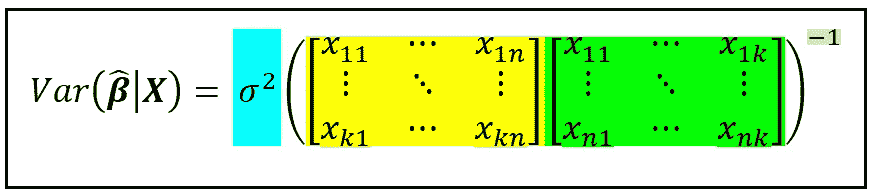

拟合系数的方差-协方差矩阵(图片由作者提供)

## 关于如何构造方差-协方差矩阵以及何时对报告的数据持怀疑态度的教程

我写这篇文章是基于一个主题，我希望对于那些有数学倾向的人，以及那些想知道什么是标准误差或者它们来自哪里的人来说，阅读这篇文章是一种享受。

作为概念的快速复习:**方差**是随机变量围绕其均值(也称为其期望值)的“扩散”或变化的度量，而**协方差**度量两个随机变量之间的相关性。

**标准误差**就是误差的标准偏差，其中“误差”有不同的含义，这取决于它是用于回归变量系数的上下文中，还是用于模型整体预测的上下文中。我们很快就会谈到这一点。

**方差-协方差矩阵**是一个方阵，即它具有相同数量的行和列。沿着矩阵主对角线的元素，即从左上到右下的元素，包含方差，而所有其他元素包含协方差。因此，回归模型的拟合系数的**方差-协方差矩阵包含拟合模型的系数估计沿其主对角线的方差，并且包含非对角线元素中的系数估计之间的成对协方差。**

类似地，回归模型的误差项的**方差-协方差矩阵包含每个误差项沿其主对角线的方差以及其他地方所有误差项对之间的协方差。**

[在我之前的文章](/an-illustrated-guide-to-the-variance-covariance-matrices-used-in-regression-analysis-3eb5a5dd2cff)中，我们直观地感受到了为什么拟合模型的系数或误差项表现出方差，以及这些矩阵在回归建模中扮演的角色。

在本文中，我们将使用 **C** 经典 **L** 线性 **R** 回归 **M** 模型(CLSR)作为工具，展示系数估计的方差-协方差矩阵和误差的方差-协方差矩阵的公式是如何从 CLSR 模型及其解的基本假设中自然出现的。尽管我介绍的材料是针对线性模型的，但总体概念方法贯穿于许多其他普遍使用的回归模型。

本文是关于方差-协方差矩阵的两个系列文章的第 2 部分:

第 1 部分:[回归分析中使用的方差-协方差矩阵图解指南](/an-illustrated-guide-to-the-variance-covariance-matrices-used-in-regression-analysis-3eb5a5dd2cff)
**第 2 部分:深入探究经典线性回归模型的方差-协方差矩阵**

我们将在本文中遇到一些非常简单的线性代数(阅读:矩阵和矩阵上的运算)。

首先，我们将快速(重新)熟悉一些基本的线性代数概念。

# 线性代数简明入门

**矩阵乘法:**如果 ***A*** 的列数等于 ***B*** 的行数，则两个矩阵 ***A*** 和 ***B*** 可以相乘。得到的矩阵的维数是 ***A*** 的行数乘以 ***B*** 的列数。下图说明了该产品的操作。为了简单起见，我们去掉了矩阵*的列下标。*

*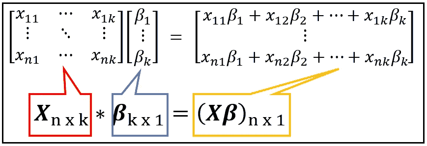*

***X** 和 ***β*** 的矩阵乘法(图片由作者提供)*

***矩阵的转置:**矩阵的转置产生于矩阵的行和列的互换。就好像矩阵被翻转过来了。这里是回归矩阵 ***X*** 和它的转置***X’***(读作 ***X*** *质数*):*

*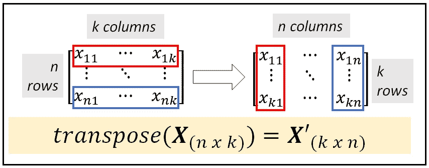*

*回归矩阵 X 的转置 X’(图片由作者提供)*

****X '*和 *X* :** 大小为 *(k x n)* 的 ***X'*** 与大小为 *(n x k)* 的*相乘得到大小为 *(k x 正如我们将很快看到的，矩阵***X’X***在回归分析中随处可见。***

*让我们重温一下我在上一篇关于方差-协方差矩阵的文章中看到的汽车数据集:*

*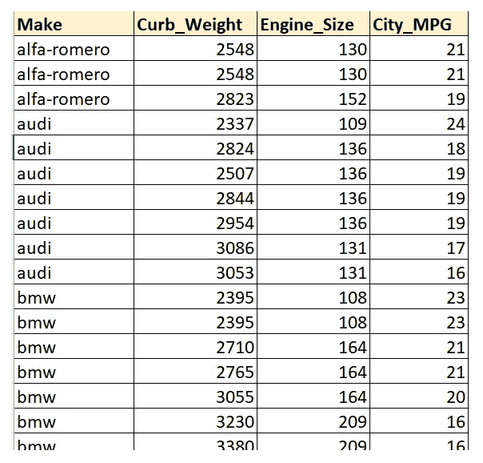*

*汽车数据集的子集(来源:[加州大学欧文分校](https://archive.ics.uci.edu/ml/datasets/automobile))*

*我们将创建一个回归矩阵 ***X*** ，包含以下 3 个回归变量:*

*城市 _MPG
发动机 _ 尺寸
整备质量*

*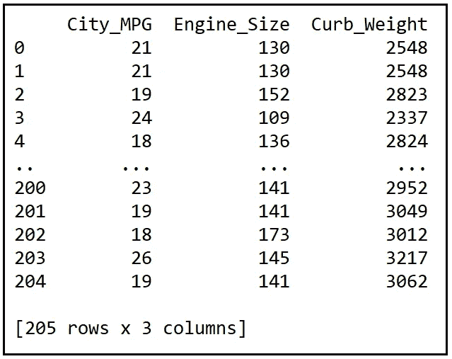*

*回归矩阵 ***X*** (图片作者提供)*

*下面是***X****’*的样子:*

*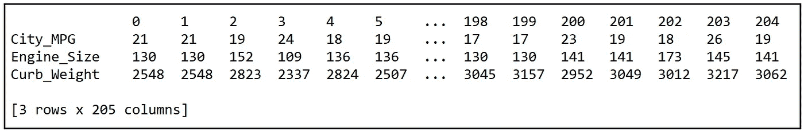*

*回归矩阵 X 的转置(图片来自作者)*

*这是我们汽车数据集中 205 号样本的 ***X'X*** 矩阵。可以看到，***X****'****X***是一个*(3×3)*矩阵:*

*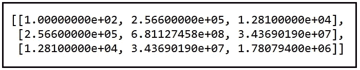*

****X'X*** 用于自动数据集中大小为 20 的样本(图片由作者提供)*

*以下是一些与转置操作相关的有用恒等式:*

*   *两个矩阵乘积的**转置**是单个矩阵按*逆序*:
    (**AB**)' =***B****'****A****'**
*   *转置矩阵的**转置返回原始矩阵:(***X***')' =***X******

***单位矩阵:**单位矩阵沿主对角线(从左上到右下)包含 1，在所有其他元素中包含 0。通常表示为***I****_ n*(***I***下标 *n* 或简称为 ***I*** ，是一个维数为*(n×n)*的方阵。单位矩阵在概念上是数字 *1* 的多维版本。***I****_ n*具有以下属性:*

*   ****I****_ n*的任意次方等于***I****_ n .例如对于****I****=****I****
*   *任意矩阵的 ***Z*** 的大小*(m×n)*乘以***I****_ n*返回*Z .***子*** *=***
*   *******的逆 I*** *_n* 是 ***I*** *_n* 。这在概念上类似于知道 *1* 除以 *1* 等于 *1。*****
*   ****任何大小为*(n×n)*的可逆方阵 ***Z*** 乘以其逆矩阵的乘积***I****_ n*。最后一个性质将我们带到下一个概念——矩阵的逆。****

******矩阵的逆:**矩阵的逆在概念上是标量数的逆的多维等价形式 *N.* 矩阵的逆是用一个有点复杂的公式计算的，我们现在跳过这个公式。在回归分析中，关于矩阵的逆矩阵，需要记住以下几点:****

*   *******X*** 的倒数用上标-1 表示为***x****【^(-1】*即 ***X*** 。****
*   ****只有“可逆”矩阵才有逆。在标量世界中，零没有有意义的倒数。1/0 = ?？。矩阵也是同样的概念。****
*   ****方阵的逆矩阵***x****^(-1)*乘以 ***X*** 等于***I****_ n*。即***x****【^(-1】****x****=****I .***正如在标量世界里， *1/n* 乘以 *n* 就是 *1* 。****

****现在让我们将这些概念应用于手头的主题，即线性回归模型的协方差矩阵的推导。****

# ****回归模型的方差-协方差矩阵的公式****

****我们将从线性回归模型的方程开始，如下所示:****

****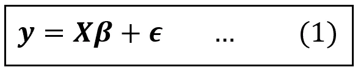****

****线性回归模型(图片来自作者)****

****上式中， ***y*** 为因变量， ***X*** 为回归变量的矩阵， ***β*** 为回归系数的向量 *β_1，β_2，β_3，…，β_k* 包含各系数的*种群水平*值(包括截距 *β_1* **)** *是 ***y*** 的观测值与 ***y*** 的建模值之差。误差项反映了所有未建模或无法建模的影响。*****

****我们假设 ***X*** 的第一列是为回归的截距 *β_1* 保留位置的 1 的列。****

****这是矩阵形式:****

********

****线性回归模型的矩阵形式(图片由作者提供)****

****在大小为 *n* 的样本上求解(也称为“拟合”)该模型，产生了**β*β*β**的估计值，我们将其表示为**β_ cap。** 因此，拟合后的模型看起来是这样的:****

********

****拟合线性模型(图片由作者提供)****

****上式中， ***e*** 是**残差**(又名**残差**)的向量。残差 ***e*** 是 ***y*** 的观测值与拟合模型预测的值 ***y_cap*** 之差。****

****如果使用最小平方最小化技术拟合模型，即所谓的**O**rdinary**L**east**S**quares(OLS ),我们寻求最小化以下残差平方和，也称为**R**ESI dual**S**um of**S**quares(RSS):****

****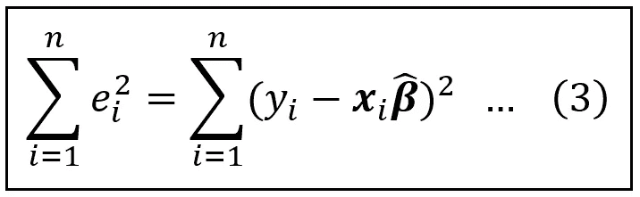****

****残差平方和(图片由作者提供)****

****上式中，***X****_ I*是回归矩阵 ***X*** 的第*行。*****

****现在，我们将推导出一个基于矩阵的公式，用于表示 **S** 方的 **R** esidual **S** um。****

****让我们重新检查等式(1)中的误差项 ***、ϵ*** 的向量。对于大小为 *n* ， ***的样本，ϵ*** 是大小为*(n×1)*的列向量:****

****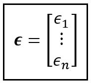****

****回归误差向量(图片由作者提供)****

****每个 *ϵ_i* 都是一个随机变量，它有一个取决于*的特定均值(也称为**期望**),以及一个取决于*的围绕该均值的特定方差。******

********ϵ*** 的条件期望的列向量表示为*e(****ϵ****|****x****)*:*****

********

****回归误差的条件期望(图片由作者提供)****

****从*****中减去*e(*****|****x****)**【ϵ***得出以下结果:****

***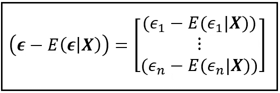***

***平均居中误差项(图片由作者提供)***

***转置这个以平均值为中心的列向量会产生下面的行向量:***

***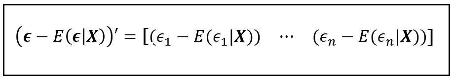***

***平均居中误差项的转置(图片由作者提供)***

***接下来，让我们乘(**—e(****【ϵ】****|****x****)*)‘同(**—e(***|****x 注意，(***【ϵ】****—e(****【ϵ】****|****x****)*'是大小为*(1x n)****【ϵ****—e(***)遂积(***【ϵ】****—e(****【ϵ】****|****x****)’(**—e(****)下图举例说明了(**—e(****ϵ****|****x****)*)'与(***【ϵ****—e(******************

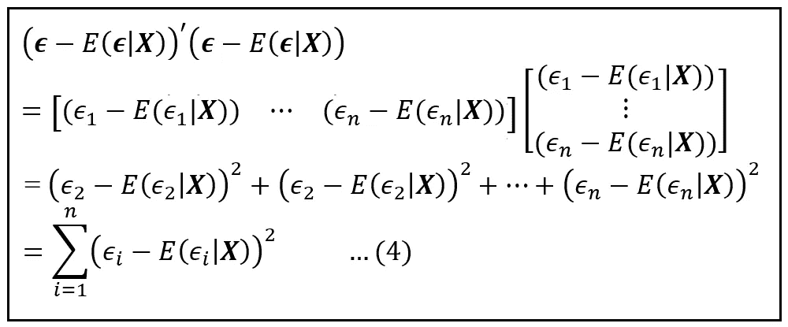

求解程序为(**—e(****ϵ****|****x****)’(**—e(****

*上述过程的第三步是我们取第二步中所示的两个矩阵的乘积。*

*这里我们得到一个重要的洞察:最后一步的求和是( *n-k)* 乘以随机变量 ***ϵ*** *的条件方差。*由此，我们得出了以下重要结果:*

*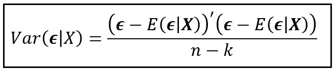*

*回归误差的条件方差(图片由作者提供)*

*现在，线性回归中的一个主要假设如下:*

> *对于回归变量向量 **x** _i 的任何给定值，误差项的平均值与 **x** _i 不相关*

*这种假设被称为回归模型的**均值独立性** 属性。它暗示以 ***X*** 为条件，*的均值为零。均值独立意味着在上述方差公式中，术语*e(****【ϵ|x】****)*是 ***0*** 其中 ***0*** 是一个大小为*【n×1】*的列矩阵，只包含零*。*因此，上述 ***ϵ*** 的误差方差公式简化为:**

**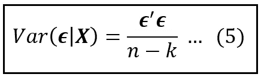**

**误差项的条件方差(图片由作者提供)**

**让我们重新看看等式(4)中所示的推导。在第一步中，我们将通过用***0****【ϵ|x**】替换****来应用我们的均值独立性假设。同样，在最后一步中，我们将*e(ϵ_i****| x****)*用 *0* 代替求和中的所有 *i* 。做这两个替换得到了另一个重要的回归模型****误差项平方和的**公式:*******

*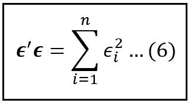*

*回归误差平方和的公式(图片由作者提供)*

*注意，在这些推导中，我们没有假设模型是线性的。到目前为止，我们只做了一个假设，即**意味着独立**。*

*我们现在要做第二个假设:*

> *拟合模型的残差 **e** 是误差项 **ϵ** 的无偏估计量。*

*这个假设允许我们使用**残差平方和**来**估计误差平方和**。换句话说:*

*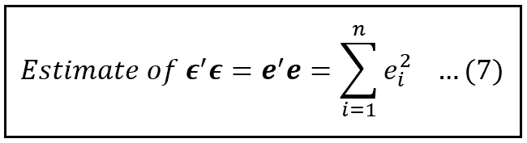*

****e'e*** 作为回归误差平方和的无偏估计量(图片由作者提供)*

*让我们再次回顾一下线性回归模型。为了使用**O**d**L**东 **S** 平方(OLS)估计技术在大小为 *n* 的样本上拟合模型，我们需要最小化等式(3)给出的残差平方和。我们还表明，等式(3)的 L.H.S .上的求和可以使用残差转置乘以自身的矩阵乘积来估计，即 ***e'e。****

*我们还知道拟合模型的方程可以写成:***y****=****xβ_ cap****+****e***，或者，就 ***e 而言，e =****(****y****———* 因此，我们需要最小化以下内容，以便使用最小二乘法拟合线性模型:*

*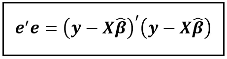*

*(图片由作者提供)*

*为此，我们将采用上述方程的偏导数，并将其设置为零矩阵 ***0*** ，如下所示:*

*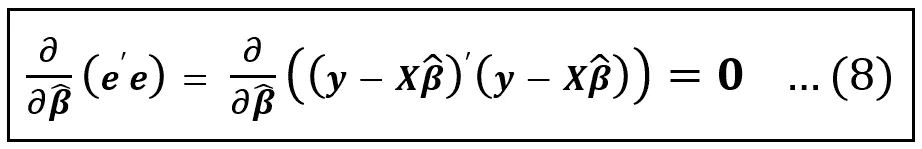*

*残差平方和的偏导数 w . r . t .***β_ cap****(图片由作者提供)**

*由于 ***β_cap*** 是一个大小为*【k×1】*的向量，上述矩阵方程分解为 *k* 变量中的 *k* 个方程，很容易求解得到***β_ cap***=*【β_ 1 _ cap，β_ 2 _ cap…β_ k _ 1 我们实际上不会求解这个 k 方程系统。相反，我们将直接陈述最终结果，即最小化残差平方和的 ***β_cap*** 的值:**

*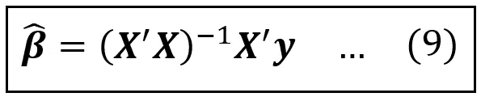*

***【图片由作者提供】*的最小二乘估计量**

**上述简洁的封闭形式的方程在单线中给出了使用 OLS 技术拟合的线性回归模型的最小二乘估计量。**

**让我们回忆一下，我们的目标是得出回归系数 ***β*** *的方差-协方差矩阵的公式。*为此，我们将遵循格林(2018)建议的方法，并将等式(9)中的 ***y*** 替换为***xβ****+****ϵ***，如下所示:**

**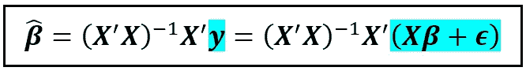**

**用***xβ****+****ϵ****(图片由作者提供)***

**让我们在右侧蓝色括号内分配术语:**

**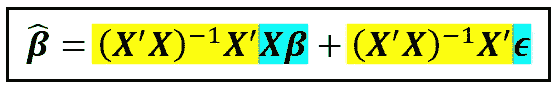**

**分发术语(图片由作者提供)**

**让我们将这两个术语重新着色如下:**

**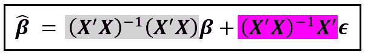**

**(图片由作者提供)**

**上式第一项中的灰色位是一个矩阵与其自身的乘积，它等于单位矩阵 ***I*** 。而我们知道***Iβ****=****β***。我们将用占位符矩阵 ***A*** 替换第二项中的品红色位。**

**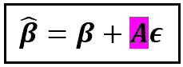**

**(图片由作者提供)**

**让我们记住这个结果。**

**让我们回忆一下 ***β*** 的最小二乘估计的方差，即 ***β_cap*** 就是我们所追求的。**

**在本文的前面部分，我们已经看到 ***β_cap*** 是一个随机变量。任何随机变量 ***Z*** 的方差都可以表示为其均值减去后的值的平方的期望值。**

***由此，Var(****Z****)= E[(****Z****——****Z _ bar****)]*。**

**我们知道 ***β_cap*** 的均值就是系数 ***β的总体水平值。*** 由于*和 ***β_cap*** 是*(k×1)*列向量，我们可以通过取 ***(β — β_cap)*** 与其转置 ***(β和β_ cap)’*相乘的期望来简洁地表达方差公式*****

***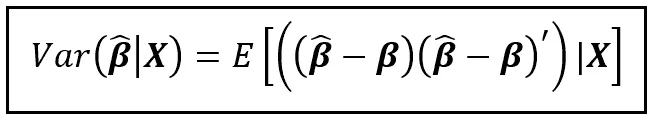***

******β_cap*** *(图片由作者提供)****

***矩阵***(β-β_ cap)***的大小为 *(k x 1)* ，它的转置矩阵***(β-β_ cap)’***的大小为 *(1 x k)* ，因此它们的乘积是一个大小为 *(k x k)* 的方阵，这正是我们想要的协方差矩阵。***

***在上面的方差方程中，让我们用*(****【β】****+****【aϵ****)*替换 ***β_cap*** ，并将结果表达式简化如下:***

***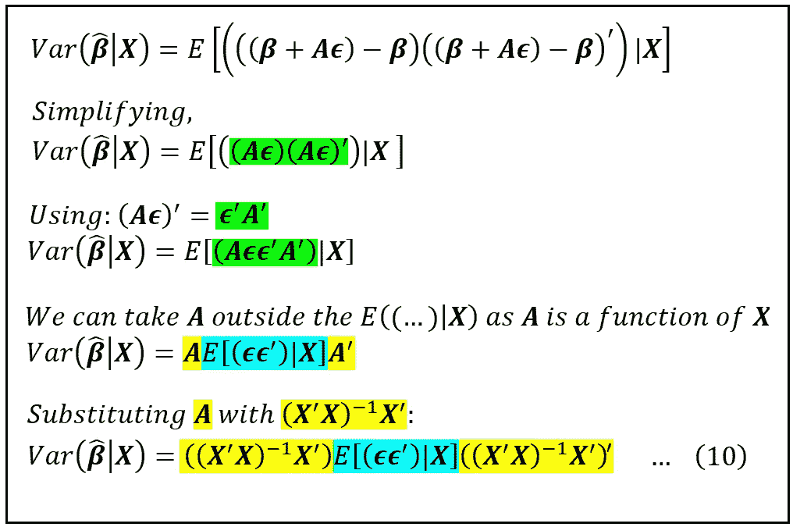***

***(图片由作者提供)***

***让我们检查最后一行。中心术语*e(***)****| x****值得做一些解释。*****

*****e(****【ϵϵ'】****)****| x****是 ***的条件期望ϵϵ'*** 给定 ***X*** 。我们知道*是一个大小为*(n×1)*的列向量，因此它的转置是一个大小为*(1×n)*的行向量。因此，他们的乘积 ***ϵϵ'*** 是一个大小为*(n×n)*的方阵，如下:******

***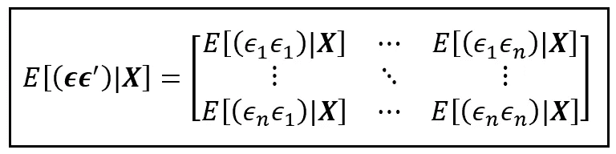***

***模型误差项的条件方差-协方差矩阵(图片由作者提供)***

***由于假设误差项的均值为零，包含*e(ϵ_i*ϵ_i)****| x****】*的对角元素实际上是误差项 *ϵ_i* 和*t81】的* ***|X*** *的条件方差非对角元素****

***我们现在将做出两个重要的假设:***

> *****同方误差*****
> 
> ***线性回归模型的误差项是同伦齐次的，即它们具有恒定的条件方差。于是，E(ϵ_i*ϵ_j) **|X** ]是某个常数 *σ* 当 i = j 时***
> 
> ***这个假设使得沿着误差的方差-协方差矩阵的主对角线的所有期望项具有某个恒定值 *σ* 。***
> 
> *****非相关误差*****
> 
> ***线性回归模型的误差项彼此不相关。因此，当 I 不等于 j 时，E(ϵ_i*ϵ_j) **|X** ] = 0***
> 
> ***这种假设使得不沿着误差方差-协方差矩阵的主对角线的所有期望项的值为零。***

***根据这两个假设，误差的方差-协方差矩阵如下:***

***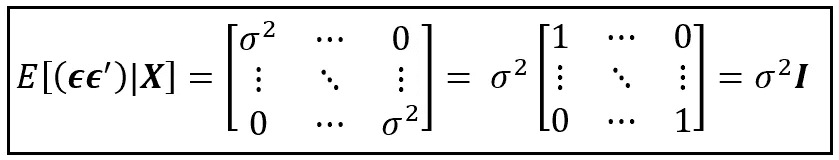***

***同方差和不相关假设下回归模型误差项的方差-协方差矩阵(图片由作者提供)***

***我们现在将等式(10)中的*e(***)****| x****】*替换为****I***，以获得最小二乘估计量的方差的以下等式:*****

***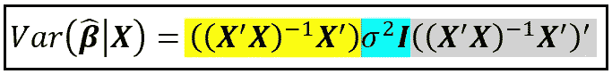***

***(图片由作者提供)***

***为了简化上面的等式，我们将使用标识*(****AB****)' =****B****'****A****'*来简化 R.H.S .上的灰色位。我们将使用标识***a****【^(-1】****a****=****I***和***ia****=****ai****=****

*****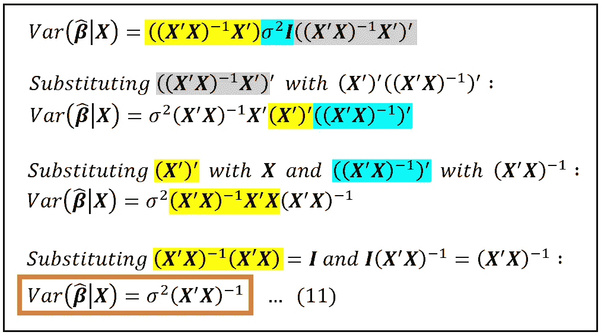*****

*****OLS 估计量的方差-协方差矩阵的推导(图片由作者提供)*****

*****等式(11)是统计建模领域的基本结果之一。*****

*****正如我们所看到的，拟合回归系数的方差-协方差矩阵是数据样本中所有回归变量的值和假设为常数的回归误差项的方差的函数。*****

*****在等式(11)中，虽然我们知道 ***X*** ，但是总体水平方差 *σ* 不是一个已知量。然而，样本方差 *s* ，即拟合模型的残差的**方差，形成了 *σ的无偏估计。*根据我们之前计算残差方差的工作，特别是等式 *(5)* 和 *(7)* ，我们有:*******

*****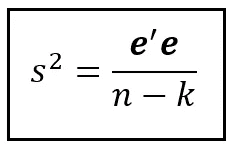*****

*****残差的方差公式(图片由作者提供)*****

*****其中，通常， ***e'e*** 是拟合模型的残差向量与其自身的转置的乘积， *n* 是样本大小， *k* 是包括截距在内的回归变量的数量。你可能想验证一下在 R.H.S .上的方程是否产生一个标量。残差向量 ***e*** 是大小为*(n×1)****e****'*的大小为*(1×n)*，因此，***e****'****e***的大小为 *(1)******

*****因此，我们得到了拟合的 OLS 回归模型的系数的方差-协方差矩阵的以下无偏估计值*:******

*****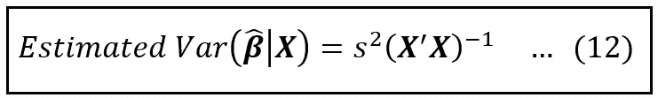*****

*****对拟合的 OLS 回归模型系数的方差-协方差矩阵的估计(图片由作者提供)*****

*****如果模型有 *k* 个包含截距的回归变量，那么方差-协方差矩阵就是大小为*(k×k)*的方阵。这可以通过注意到***×T43【是大小为*(n×k)*的矩阵来确认，因此***×***的大小为*(k×n)*，因此乘积**×××T55’**×是大小为*(k×k)的方阵 s* 作为该矩阵的比例因子。************

**与任何方差-协方差矩阵一样，位于该矩阵主对角线上的元素包含*中的 *k* 回归变量在*中各自总体均值周围的方差，而非对角线元素包含***β_ cap****_ I*****

# ***回归系数估计的置信区间***

***方差-协方差矩阵的每个对角元素的平方根是标准偏差，即 ***β_cap*** 中各个回归系数估计值的**标准误差**。***

***这些标准误差可以直接插入回归系数估计值周围的(1-α)100%置信区间的公式中，如下所示:***

***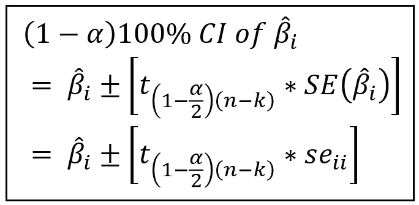***

***回归系数置信区间公式(图片由作者提供)***

***上式中， *β_cap_i* 为拟合模型的第*与第*回归系数的估计值(亦称平均值)。方括号内的 *t* 值是从具有 *(n-k)* 自由度的双边*学生 t* 分布返回的临界值，其中 *n* 是样本大小， *k* 是包括截距在内的回归系数的数量。 *se_i_i* 是等式(12)中 ***β_cap*** 的方差-协方差矩阵中第*个*对角元素的平方根。***

# ***回归系数方差-协方差矩阵公式的基本假设***

***等式(12)中呈现的方差-协方差矩阵的公式来自我们在推导过程中逐步做出的以下 5 组假设:***

1.  *****误差的均值独立**:模型的误差项是均值独立的:*e(****ϵ****|****x****)= 0****
2.  *****线性形式**:回归模型有一个线性形式:y =***xβ****+****ϵ******
3.  ***拟合模型的残差 ***e*** 是误差项 ***ϵ*** 的无偏估计。***
4.  *****同方误差**:模型的误差是同方误差:*e(ϵ_i*ϵ_j|****x****)=σ*(一个常数)当 *i = j，*并且，***
5.  *****不相关误差**:模型的误差彼此不相关:*e(ϵ_i*ϵ_j|****x****)= 0*当 *i！= j****

## ***何时对方差-协方差矩阵持怀疑态度***

***如果违反了上述一组假设，则前面的一组推导不再成立，并且等式(12)不能用于计算模型的方差-协方差矩阵。如果我们选择仍然使用等式(12)来计算方差-协方差矩阵，则矩阵中的方差和协方差值将是不准确的。因此，从矩阵计算的系数的**标准误差将是不正确的**，并且**我们将最终报告错误的回归系数置信区间**。***

***对于给定的数据集，前三个假设(均值独立性、线性形式和残差作为误差项的无偏估计)决定了线性回归模型的可行性。假设(4)和(5)仅描述了模型误差方差的行为。虽然，假设(1)到(5)一起导致线性 OLS 回归模型的方差-协方差矩阵的公式，如果(1)到(3)被满足，但是(4)和/或(5)不被满足，线性回归模型仍然是手边数据集的可行模型。但是在这种情况下，不应该报告使用等式(12)的系数估计的标准误差和置信区间。***

***当您使用统计建模软件包(如 statsmodels)构建和拟合线性 OLS 模型时，软件通常会使用等式(12)中给出的公式报告标准误差，因此它还会使用这些标准误差报告回归系数估计值的(1-α)100%置信区间。如果使用 OLS 技术拟合模型，假设(2)和(3)-线性形式和残差作为误差项的无偏估计-将被纳入 OLS 技术。***

***重要的是验证拟合模型满足假设(1)、(4)和(5)——误差项的均值独立性、同方差性和不相关性。但是，如果他们不满意，那么我们就不应该依赖统计软件包报告的标准误差和置信区间。***

***作为等式(12)的示例，让我们使用它来计算拟合在机动车辆数据集上的线性 OLS 模型的方差-协方差矩阵。***

***首先，我们将从整个数据集中随机选择 50 个样本来拟合模型。我们将使用 **statsmodels** 包来构建和拟合模型，如下所示:***

```
*****import** pandas **as** pd
**from** patsy **import** dmatrices
**import** numpy **as** np
**import** scipy.stats
**import** statsmodels.api **as** sm
**import** matplotlib.pyplot **as** plt*#Read the automobiles dataset into a Pandas DataFrame* df = pd.read_csv(**'automobile_uciml_3vars.csv'**, header=0)SAMPLE_SIZE = 50***#Select a random sample of size SAMPLE_SIZE***df_sample = df.**sample**(**n**=SAMPLE_SIZE)***#Setup the model expression in Patsy syntax***model_expr = 'City_MPG ~ Curb_Weight + Engine_Size'***#Carve out the X and y matrices using Patsy*** y_train, X_train = **dmatrices**(model_expr, df_sample, **return_type**=**'**dataframe**'**)***#Build an OLS regression model using Statsmodels*** olsr_model = sm.**OLS**(**endog**=y_train, **exog**=X_train)***#Fit the model on (y, X)*** olsr_results = olsr_model.**fit**()***#Print the training summary of the fitted model* print**(olsr_results.**summary**())***
```

***我们看到以下培训输出:***

***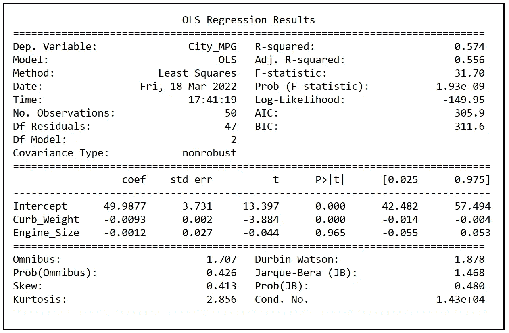***

***OLSR 模式的培训总结(图片由作者提供)***

***可以看出，statsmodels 报告的系数的标准误差如下:***

***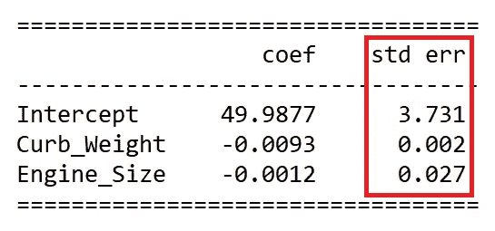***

***Statsmodels 报告的标准误差(图片由作者提供)***

***它们的(1–0.05)100%置信区间如下:***

***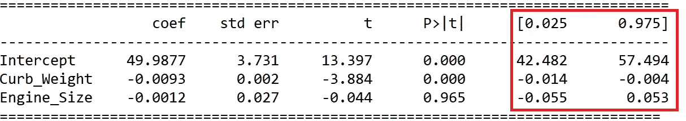***

***statsmodels 报告的 95%置信区间(图片由作者提供)***

***让我们使用等式(12)手动计算拟合系数的方差-协方差矩阵。***

***为了使用等式(12)，我们需要计算 *s* ，这是残差的方差。使用公式*(****e****'****e****)/(n-k)*计算如下:***

```
***e=np.**array**(olsr_results.**resid**)#reshape it to (50 x 1)
e=e.**reshape**(e.**shape**[0],1)e_prime = np.**transpose**(e)resid_variance = np.matmul(e_prime,e)/(50-3)[0]print('Variance of residuals='+str(resid_variance[0][0]))***
```

***我们得到以下输出:***

```
***Variance of residuals=**25.074639949635987*****
```

***方差-协方差矩阵使用等式(12)计算如下:***

```
***X=np.**array**(X_train)X_prime = np.**array**(np.**transpose**(X))coeff_covs_matrix = np.**linalg**.**inv**(np.**matmul**(X_prime, X))*resid_variance**print**('Variance-Covariance Matrix of coefficient estimates=\n'+**str**(coeff_covs_matrix))***
```

***我们得到以下输出:***

```
***Variance-Covariance Matrix of coefficient estimates=
[[ 1.39215336e+01 -7.68038461e-03  5.11395679e-02]
 [-7.68038461e-03  5.77116102e-06 -5.62371161e-05]
 [ 5.11395679e-02 -5.62371161e-05  7.23625275e-04]]***
```

***主对角线元素的平方根是拟合系数的标准误差:***

```
***coeff_std_errors = np.**sqrt**(coeff_covs_matrix)**print**('Standard errors of coefficient estimates=\n'+**str**(coeff_std_errors))***
```

***我们看到以下输出:***

```
***Standard errors of coefficient estimates=
[[**3.73115714e+00**            nan 2.26140593e-01]
 [           nan **2.40232409e-03**            nan]
 [2.26140593e-01            nan **2.69002839e-02**]]***
```

***主要的对角线元素是:***

*******3.731****15714、****0.002****40232409、****0.0269****【002839】*****

***这些值与训练摘要中 Statsmodels 报告的标准误差相匹配:***

******

***Statsmodels 报告的标准误差(图片由作者提供)***

# ***参考文献、引文和版权***

## ***数据集***

***[**汽车数据集**](https://archive.ics.uci.edu/ml/datasets/automobile) **引用:** Dua，d .和 Graff，C. (2019)。UCI 机器学习知识库[http://archive . ics . UCI . edu/ml]。加州欧文:加州大学信息与计算机科学学院。 [**下载链接**](https://gist.github.com/sachinsdate/fd97d74979c4febf6746c153ea1b7668)***

## ***纸质和图书链接***

***威廉·h·格林， [*计量经济分析*](https://www.pearson.com/us/higher-education/program/Greene-Econometric-Analysis-8th-Edition/PGM334862.html) ，第 8 版*，* 2018，*培生****

****如果你喜欢这篇文章，请关注我的*[***Sachin Date***](https://timeseriesreasoning.medium.com)*获取关于回归、时间序列分析和预测主题的提示、操作方法和编程建议。****