# 在 SageMaker 中构建硬件加速 MLOps 流水线的详细指南

> 原文：<https://towardsdatascience.com/a-detailed-guide-for-building-hardware-accelerated-mlops-pipelines-in-sagemaker-5d32459665b3>

## 了解如何在 SageMaker 中实施英特尔人工智能分析工具包硬件加速库


[图像来源](https://www.freepik.com/free-vector/magic-school-composition-with-outdoor-scenery-silhouette-ancient-castle-teacher-growing-plant-with-spell_14657754.htm#query=wizard&position=14&from_view=search&track=sph)

SageMaker 是 AWS 云上的一个完全托管的机器学习服务。这个平台背后的动机是为了方便在托管 AWS 云服务的基础上构建强大的机器学习管道。不幸的是，导致它简单的抽象使得它很难定制。本文将解释如何将定制的训练和推理代码注入到预先构建的 SageMaker 管道中。

我们的主要目标是在 SageMaker 管道中启用[英特尔人工智能分析工具包](https://www.intel.com/content/www/us/en/developer/tools/oneapi/ai-analytics-toolkit.html#gs.kjcg0z)加速软件。AWS 可能会为这些加速包构建公开可用的映像，但同时也欢迎您使用这些模板。

## 为什么要用 Daal4py 优化 XGBoost？

虽然基准测试超出了本教程的范围，但是其他应用程序已经看到了将 XGBoost 模型转换为 daal4py 格式的明显好处。[预测性资产维护 AI 参考套件](https://github.com/oneapi-src/predictive-asset-health-analytics)显示，daal4py 中可用的英特尔优化提供了额外的预测时间加速，与使用案例研究数据集上经过调整的超参数训练的 XGBoost 模型的股票 XGBoost 0.81 相比，总体速度提高了 2.94 倍至 3.75 倍。

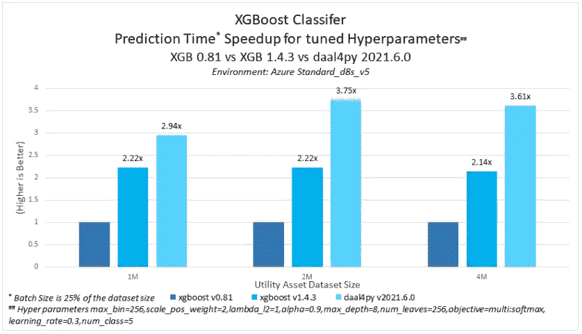

图一。XGBoost 和 Daal4py 模型在推理过程中的基准— [图片来源](https://github.com/oneapi-src/predictive-asset-health-analytics/tree/main/src)

同样值得注意的是，使用 daal4py 预测没有观察到准确性下降。

*本教程是关于使用英特尔人工智能分析工具包构建硬件优化的 SageMaker 端点系列的一部分。你可以在这里* *找到整个系列* [***的代码。***](https://github.com/eduand-alvarez/ai-kit-sagemaker-templates)

## 创建 SageMaker 项目

启动 SageMaker 项目非常简单。

1.  首先在 AWS 中导航到 SageMaker 服务，并从导航面板中选择**入门**。

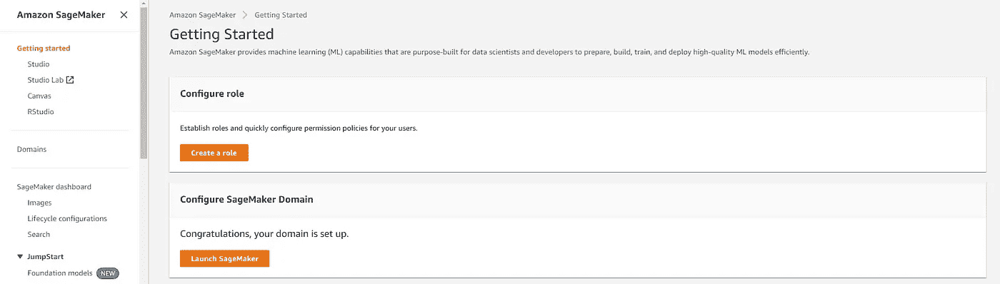

图二。SageMaker 入门页面—作者图片

2.您需要**配置一个 SageMaker 域**来启动 Studio。我们将在本教程中使用**快速设置**选项。

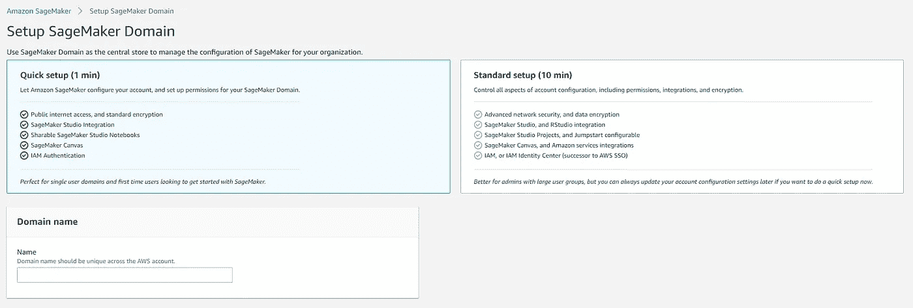

图二。SageMaker 域配置—作者图片

3.从导航面板中选择**工作室**，打开**工作室**会话。

4.在 **SageMaker Resources** 选项卡中，点击 **Create project** 并选择 *MLOps 模板用于模型构建、培训和部署。*该模板提供了配置和启动 ML 生命周期管理服务所需的所有代码。我们将编辑该模板的各个方面，以适应我们的自定义训练和推理代码。

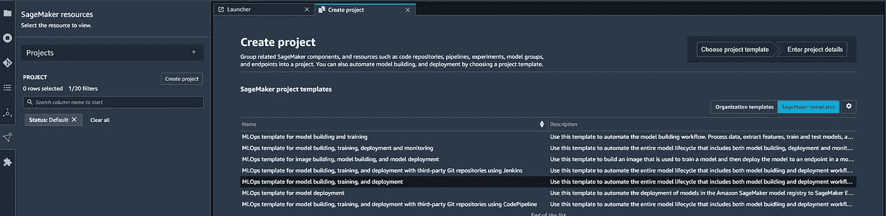

图 4。SageMaker 项目创建—作者图片

4.您需要克隆这两个项目存储库。一个对应模型建立，一个是模型部署。CodeCommit 将管理存储库，一个类似于 GitHub 的版本控制服务。

5.我们将把我们的客户流失数据集下载到 AWS S3 存储桶中。我们将在脚本中指向这个桶。要下载数据，在 SageMaker 项目的任何目录下创建一个笔记本，并在 Jupyter 单元格中执行以下代码。

```
!aws s3 cp s3://sagemaker-sample-files/datasets/tabular/synthetic/churn.txt ./
import os
import boto3
import sagemaker
prefix = 'sagemaker/DEMO-xgboost-churn'
region = boto3.Session().region_name
default_bucket = sagemaker.session.Session().default_bucket()
role = sagemaker.get_execution_role()
RawData = boto3.Session().resource('s3')\
.Bucket(default_bucket).Object(os.path.join(prefix, 'data/RawData.csv'))\
.upload_file('./churn.txt')
print(os.path.join("s3://",default_bucket, prefix, 'data/RawData.csv'))
```

6.我们需要做一些修改来使 SageMaker 模板适应我们的客户流失解决方案。我们这个客户流失模型的目标是预测用户将来是否会退订某项服务。

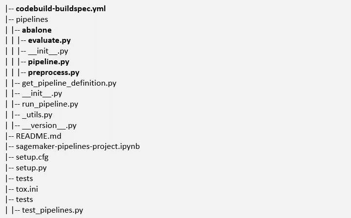

图 5。模型构建存储库的文件结构—按作者分类的图像

让我们回顾一下我们将使用的主要文件夹和文件。这些脚本的改编版本可以在 [GitHub Repo](https://github.com/eduand-alvarez/ai-kit-sagemaker-templates/tree/main/xgboost-daal4py) 中找到。出于时间考虑，您可以随意复制回购中的代码来更新 **pipeline.py、preprocess.py、evaluate.py、**和**code build-spec build . yml .**

*   **pipelines** 文件夹包含编排和执行我们的模型构建管道的各种组件的 python 脚本。您需要将该目录中的“鲍鱼”文件夹重命名为“customer_churn”
*   **evaluate.py** 脚本根据验证数据集评估我们的模型。在这个例子中，我们使用 MSE，但是您可以将它修改为其他合适的度量。
*   **preprocess.py** 脚本执行各种数据处理和特征工程步骤，如一键编码和标准化。您可以通过注入额外的处理步骤来适应您的解决方案。
*   **pipeline.py** 脚本协调您的整个 SageMaker 模型构建管道。它加载机器映像，指定计算实例，并从适当的数据源中提取数据。理解这个脚本的来龙去脉可能需要一些时间，但是一旦掌握了窍门，就相对简单了。首先编辑以下内容:
    - S3 位置(第 95 行)
    -自定义映像 URI(第 121 行)—构建自定义映像的步骤在本文中有详细讨论: [**使用 oneAPI 和 Docker**](https://medium.com/@eduand-alvarez/guide-to-implementing-custom-accelerated-ai-libraries-in-sagemaker-with-oneapi-and-docker-97547692cb6e) **在 SageMaker 中实现自定义加速 AI 库的指南。**
    -你的管道名称(第 70 行)
*   **code build-spec build . yml**在将变更推送到 **CodeCommit** Repo 时配置您的构建。

7.一旦我们完成了对这四个文件的编辑并配置了我们的定制培训/服务映像，我们就可以将我们的更改推送到我们的 repo 中。由于我们的模板预先配置了 CI/CD，这将自动执行管道并训练一个模型。

*   从侧面导航面板中选择 **GIT** 选项卡，选择您已修改的文件以添加到暂存区并提交，然后将更改推送到远程存储库。

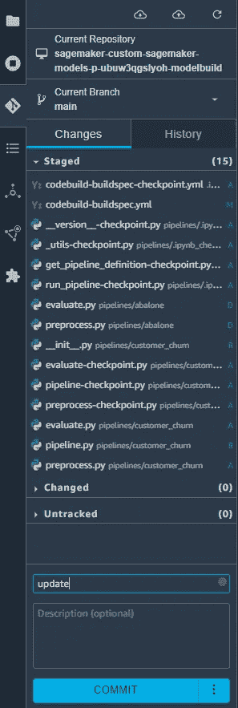

图 6。提交和推送 Git 面板—作者图片

*   要检查您的 CI/CD 自动化是否正确触发了构建，您可以转到 **AWS CodeCommit** 并从导航面板中选择 build history。您应该看到一个带有“进行中”状态的构建运行。

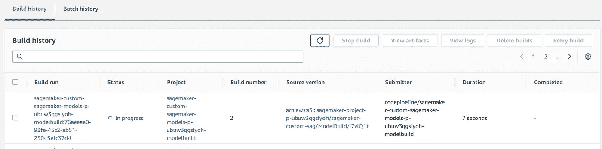

图 6。代码提交构建历史

*   转到 **SageMaker 资源**并选择您的项目。从**管道**页签，可以查看管道执行的状态；您将发现一个成功的作业，它是在我们克隆模板 repos 时自动执行的。您还应该看到一个处于执行状态的管道，您可以双击它来查看关于您的执行的更多细节。

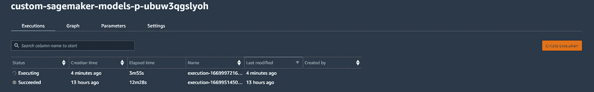

图 7。管道执行仪表板—按作者分类的图像

*   您可以使用可视化图形表示来监控管线的进度。单击节点将打开一个执行元数据面板，其中包括输入、输出和执行日志。

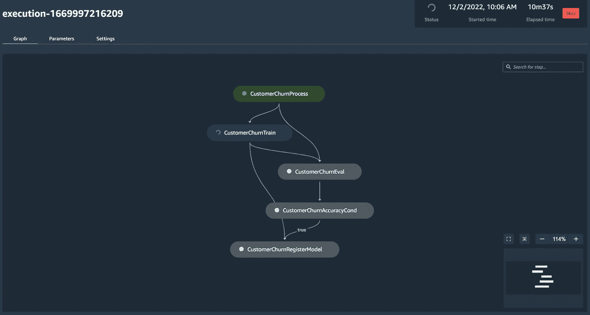

图 8。管道图界面—作者图片

成功完成管道后，将创建一个模型。您可以在模型组项目选项卡中访问您的模型。

## **端点和推理作业**

SageMaker 端点由您的管道自动创建，负责处理推理组件。

1.  由于我们的模型批准条件被设置为“手动”，我们将不得不手动批准我们的模型。当一个模型被批准时，这将调用一个**云生成栈**，它创建一个 **SageMaker 模型**、 **SageMaker 端点配置**和 **SageMaker 推理端点**。所有这些组件都可以在中央 SageMaker AWS 控制台中进行跟踪。负责这种自动化的代码可以在我们在本教程开始时克隆的模型部署 repo 中找到。

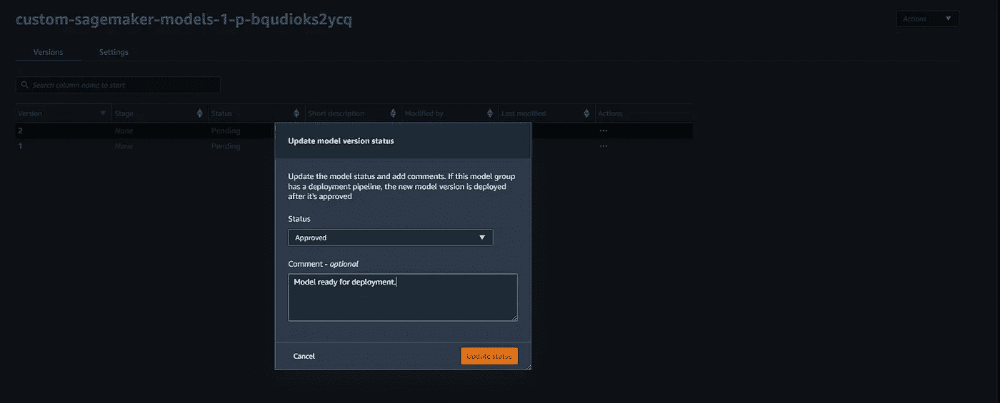

图 9。模型批准控制台—作者图片

2.在 sagemaker 中检查端点构建的状态。导航至 SageMaker **推理**并选择**端点**。您可以在 **CloudWatch** 上选择 View Logs 来查看来自您的端点的事件数据(图 11)。

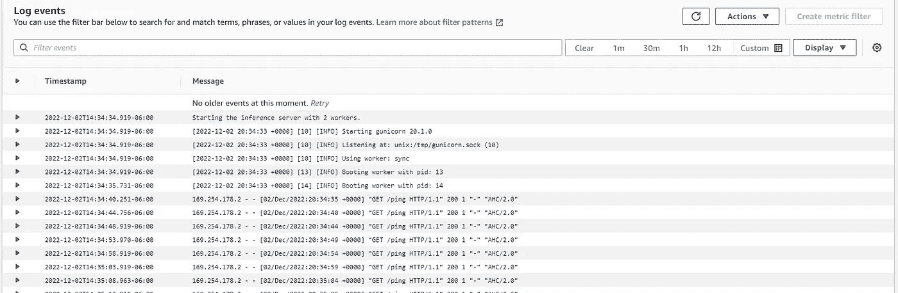

图 10。使用 CloudWatch 来诊断问题，并检查端点 ping 测试是否成功。作为端点 ping 测试的一部分，我们正在加载我们的模型。成功的 ping 指示一个健康的端点。—作者图片

另一个很好的 QC 点是检查您的端点是否在端点仪表板中标记为“运行中”(图 12)。

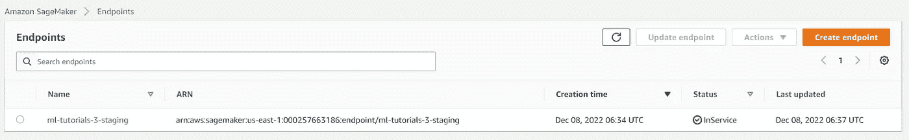

图 11。SageMaker 终端管理仪表板—作者图片

## 设置 Lambda 函数来处理 API 请求

AWS Lambda 函数阻止我们设置专用服务器来监控请求和执行像格式化和端点调用这样的小段代码。这有很大的好处，比如只在功能被触发时为计算机付费，而不是专用服务器，后者将向我们收取预留或按需费用。

为这个特定教程构建 lambda 函数的步骤将在本文中详细讨论: [**从 ECR 图像构建 AWS Lambda 函数以管理 SageMaker 推理端点的指南。**](https://medium.com/@eduand-alvarez/guide-to-building-aws-lambda-functions-from-ecr-images-to-manage-sagemaker-inference-endpoints-4980a9b92290)

## 使用 API 网关构建 REST API

配置 REST API 将允许我们向 SageMaker 端点发送 HTTP 协议请求。以下步骤概述了如何使用 **AWS API 网关**实现这一点。


图 12。REST API 架构图——作者图片

1.  导航到 **API 网关**，并从 **REST API 部分选择**“构建”**。**

2.选择 **REST** 、 **New API** ，在 **API 设置**部分填写您的姓名和端点类型。完成后，点击**创建**。

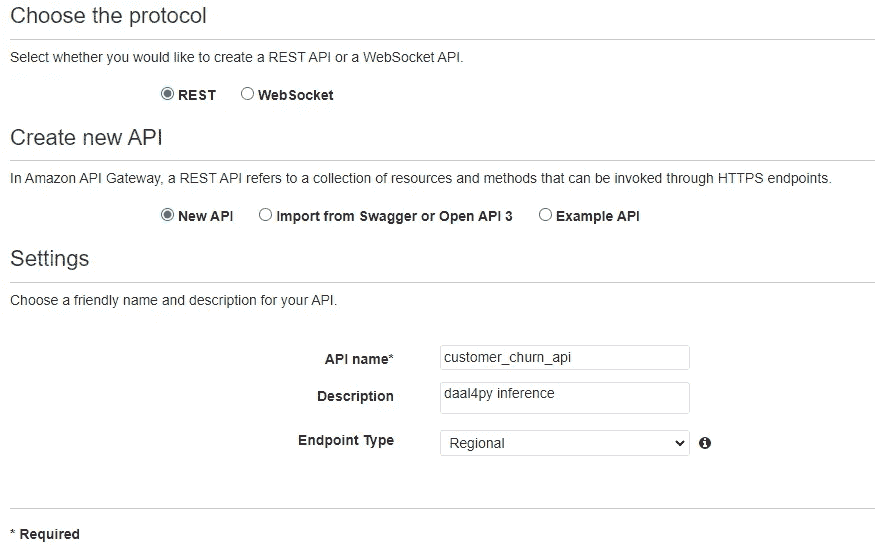

图 13。REST API 配置设置—按作者分类的图像

3.转到**动作**下拉菜单并选择**创建资源。**完成后，点击**创建资源。**

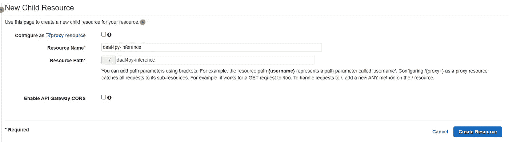

图 14。资源创建配置-按作者分类的图像

4.转到**动作**下拉菜单，选择**创建方法**。选择发布。检索您在上一节中配置的 lambda 函数的名称，并提供与其余资源相同的区域。

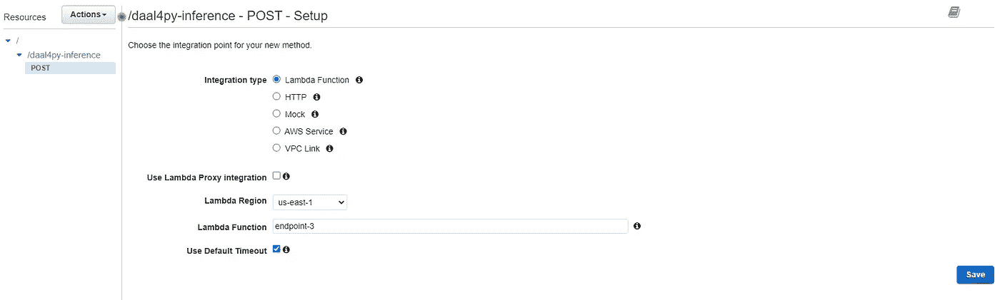

图 15。发布请求配置-按作者分类的图像

在创建网关时，会提示您一个 API 架构图。

5.您可以通过点击**动作**选项卡并选择**部署 API** 选项来部署 API。这将为您提供一个链接，您可以使用它向您的模型端点发送 **Post** 请求。

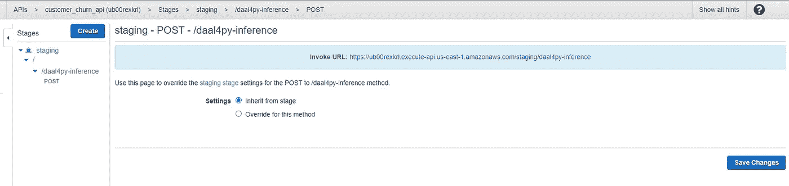

图 16。调用用于向您的 API 发送请求的 URL 按作者排序的图像

## 测试您的新 API

在 https://web.postman.co/[创建一个免费的邮递员账户](https://web.postman.co/)

我们可以使用 Postman 创建 REST API 请求来测试我们的新 API。

在 Postman 中创建新的测试，粘贴您从 REST API 创建的链接，选择 **Body** 作为输入类型，选择 **POST** 作为请求类型，并提供输入数据。


图 17。邮递员测试仪表板-作者图片

如果您已经完成了本教程中的所有步骤，您应该会从您的 API 得到一个“真实”的响应。

## 结论和讨论

恭喜你！您已经使用 oneAPI 硬件加速库在 SageMaker 上构建了一个定制的 MLOps 管道。使用本教程中的信息，您可以在 SageMaker 中构建端到端的机器学习管道，并利用 daal4py 等硬件优化的机器学习库。

在未来的文章中，我们打算发布计算机视觉和自然语言处理硬件优化的 SageMaker 管道的代码和演练。

## **来源:**

*   从 ECR 图像构建 AWS Lambda 函数以管理 SageMaker 推断端点的指南|[https://medium . com/@ edu and-Alvarez/guide-to-Building-AWS-Lambda-Functions-from-ECR-Images-to-Manage-sage maker-Inference-Endpoints-4980 a9b 92290](https://medium.com/@eduand-alvarez/guide-to-building-aws-lambda-functions-from-ecr-images-to-manage-sagemaker-inference-endpoints-4980a9b92290)
*   使用 oneAPI 和 Docker 在 SageMaker 中实现自定义加速 AI 库的指南|[https://medium . com/@ edu and-Alvarez/guide-to-Implementing-Custom-Accelerated-AI-Libraries-in-SageMaker-with-oneAPI-and-Docker-97547692 CB 6 e](https://medium.com/@eduand-alvarez/guide-to-implementing-custom-accelerated-ai-libraries-in-sagemaker-with-oneapi-and-docker-97547692cb6e)
*   [https://docs . AWS . Amazon . com/sage maker/latest/DG/your-algorithms-inference-code . html](https://docs.aws.amazon.com/sagemaker/latest/dg/your-algorithms-inference-code.html)
*   [https://docs . AWS . Amazon . com/sage maker/latest/DG/how-it-works-training . html](https://docs.aws.amazon.com/sagemaker/latest/dg/how-it-works-training.html)