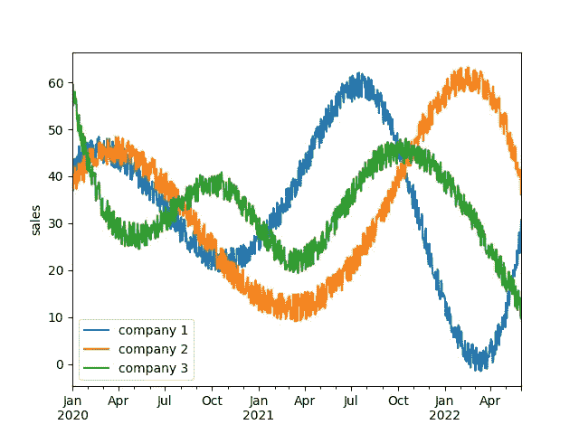
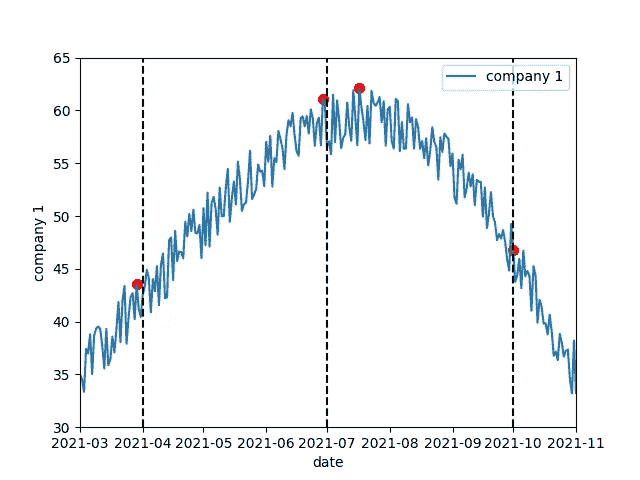
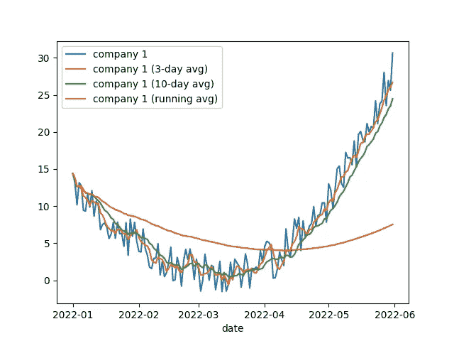

# PySpark 窗口函数入门

> 原文：<https://towardsdatascience.com/a-dive-into-pyspark-window-functions-a090aee4ff23>

## 许多有待发现的能力

皮特·赖特在 [Unsplash](https://unsplash.com?utm_source=medium&utm_medium=referral) 上的照片

在早先的[文章](https://medium.com/p/a60bcb28cc3b)中，我提供了 PySpark 窗口函数的快速介绍。这篇早期文章的目的是说明与不太熟悉窗口函数的数据分析师通常使用的复杂变通方法相比，使用窗口函数的好处。本文的目的是更深入一点，说明 PySpark 窗口函数提供的各种可能性。同样，我们在整个示例中使用合成数据集。这使得喜欢边阅读边练习的感兴趣的读者可以很容易地进行实验。本文中包含的代码是使用 Spark 3.2.1 测试的。

**导入并启动数据集**

我们从必要的进口开始

然后，我们创建一个包含三家虚构公司销售额的合成数据集。为了方便起见，数据集是使用 pandas、numpy 和 scipy 创建的，这些工具通常可供所有使用 Python 的数据从业者使用。考虑到更大的尺寸，起始数据帧可以专门在 PySpark 中构建。然而，本文的目的是说明窗口函数的可能性，而不是将计算扩大到熊猫友好的大小之外。

起始数据框包含三家公司在大约 2.5 年期间的每日销售数据。生成宽格式数据帧的代码是

数据框可通过以下方式显示

产生了

图 1:开始数据集

如何构建起始数据帧的细节并不重要。对于感兴趣的读者，我们创建了两个短列表，分别是 x 点和 y 点，第二个列表被随机排列，以产生三家公司的不同曲线。我们在 x 点之间使用了 scipy 中实现的样条插值，并使用 numpy 添加了一些噪声。为了再现性，我们通过指定种子构建了一个随机数生成器。其中一列是有意为日期类型的，因为时间序列是窗口函数显示的数据类型。剩下的唯一一件事就是使用

方便的是，PySpark 数据帧具有所需的模式，无需显式指定模式。

接下来的四个部分是聚合、排序和分析 PySpark 窗口函数的例子。有了这个，我们就可以出发了！

**聚合窗口函数**

集合窗口函数通常处理整个窗口。如果目的是处理整个窗口，则不需要在窗口内排序，这是最典型的用例。例如，让我们计算公司 1 每季度销售额最大的日期

为了确认一切正常，我们绘制了结果图

产生了

图 2:公司 1 的季度最高销售额

红点表示最大销售额，垂直虚线表示季度界限。我们可以看到，window 函数正确地计算出了公司 1 在每个季度销售额最高的日期。通过设置轴限制，图表已被放大，这样我们可以更容易地检查结果。在 Spark 和 pandas 数据框之间来回切换在实践中通常不会发生，但是在本教程中，如果所使用的数据框完全在 pandas 的能力范围内，那么这对于绘制需求是很方便的。

一个烦恼是，上面的计算只涉及公司 1。还有两家公司，实际上我们可能有更多公司的更多列。我们可以创建一个循环，或者(更好地)我们可以用长格式而不是宽格式创建起始数据帧。解除 Spark 数据帧的透视也是可能的，尽管这需要更多的努力

其工作方式是创建一个包含结构数组的列(PySpark 中的“dictionary”包含公司名称和销售额)，分解数组以创建多行，然后从结构中提取我们需要的列。这有点复杂，但是对于本文的目的来说，细节并不重要。重要的是数据框现在有一行是每个公司和日期的销售数据。

现在，可以一次计算出所有公司每季度最高销售额的日期

公司 1 的结果与之前相同。

可以使用的聚合函数有 min、max、count、sum 等。原则上，我们可以使用一些记录而不是整个窗口，如下所示。这在聚合窗口函数中并不常见，除非我们需要运行求和。例如，如果我们想计算每个公司和季度到给定日期的最大销售额，我们可以使用

我们可以看到，每当遇到更高的销售额时，就会出现新的一行，直到我们到达下一个季度，然后我们再次开始。

**排名窗口功能**

排序窗口函数很容易概念化。如果不对窗口中的行进行排序，排序函数就没有意义，所以我们需要引入更多的语法。我们将使用一个较小的数据集，特别是在删除一些列后，公司 1 每个季度销售额最高的数据集(名为 res_company1)

如果我们希望对每年的季度进行排名，我们可以使用以下内容

默认的排序是升序，所以并不严格要求显式地指定它，但是它使代码更清晰。函数`F.rank()`不接受任何参数，并在出现平局时产生非连续整数。如果不希望这样，可以使用`F.dense_rank()`。还有更多排名功能，如[文档](https://spark.apache.org/docs/latest/api/python/reference/pyspark.sql.html)中描述的`F.percent_rank()`、`F.ntile()`、`F.row_number()`等。还有一个[函数](https://spark.apache.org/docs/latest/api/python/reference/api/pyspark.sql.functions.cume_dist.html) `F.cume_dist()`与`F.percent_rank()`相关，它返回累积密度函数而不是百分比排名，因此严格来说它不是排名函数，而是统计函数，但这主要是语义上的，除非你是面向统计的。如果您有兴趣，可以用一个小的数据框进行实验，并比较这两个函数。

**分析窗口功能**

最后一组窗口函数允许查看感兴趣的记录。典型地，这种函数与时间序列一起使用，例如，将记录与最近的记录进行比较。

作为第一个例子，我们将计算公司 1 的销售额与前一个日期相比增长最多的日期。用例并不表示需要在变量上创建窗口，因此整个数据框将是唯一的窗口。这是通过不带任何参数调用`Window.partitionBy()`函数来实现的。尽管如此，我们还是要避免这种情况，因为它会将所有数据移动到同一个分区，从性能的角度来看这是不明智的(尽管我们在本教程中的数据帧太小了，不值得担心)。相反，我们将按年进行分区，这仅意味着第 n+1 年 1 月 1 日的记录不能与第 n 年 12 月 31 日的记录进行比较，因为窗口中没有以前的记录。对于我们的例子来说，这不是一个大问题

这个例子的有趣之处在于，我们在另一个窗口函数中使用了一个窗口函数的结果。你想知道为什么我们创造了另一个窗口吗？我们不能用之前的吗？答案是否定的，原因是排序意味着我们不会使用整个窗口，而只会使用给定记录之前的部分窗口。这是违反直觉的，因为排序通常不会影响计算的范围，但在这种情况下它会影响！我们稍后将回到这一点。

与排序窗口函数相比，`F.lag()`函数可以在与排序列不同的列上操作。对于`F.lead()`函数来说也是如此，它向前看而不是向后看。两个函数都使用参数`n`来控制我们向前或向后移动多少记录，使用参数`default`来替换接近窗口边界时的空值。

**从窗户到窗框**

文章开头的图像显示了一个由几个窗口框架组成的窗口。选择该图像与 PySpark 窗口函数进行类比。我们不需要在计算中使用整个窗口，实际上我们可能只需要使用它的一部分。在本文前面计算每个公司和每个季度的最大销售额时，我们第一次看到了这一点。在 PySpark 窗口语言中，我们在运行最大值示例中使用的窗口框架是增长的。它从窗口开始(`unboundedPreceding`)开始，覆盖订单变量的整个范围，直到当前记录(`currentRow`)。现在，我们将概括窗口框架的概念，以涵盖所有窗口框架的大小和类型。

如果我们想使用 10 天或 3 天的静态窗口和年度窗口来计算公司 1 每年的运行平均销售额，会怎么样？为了实现这一点，我们将依赖于 Unix 纪元时间，因为该时间用可在范围中使用的数值表示(pandas 在日期范围方面提供了更多功能，但不适合大数据分析；我们不能拥有一切！).Unix 纪元时间以秒表示，因此我们的 3 天窗口对应于 24*3600*3 = 259 200 秒的范围，而 10 天窗口对应于 864 000 秒的范围。为了便于比较，我们还将计算每年销售的移动平均值。

如果我们把结果想象成

我们获得

图 3: 3 天、10 天和运行平均值

如果你对如何在像[这种](https://www.worldometers.info/coronavirus/)带有新冠肺炎更新的页面中计算运行平均值感到好奇，现在你知道了！除了`.rangeBetween()`之外，我们也可以使用`.rowsBetween()`，但是我们把它作为一个练习。

**最终想法**

PySpark 中的窗口函数可以成为数据分析和特征工程不可或缺的工具。有一个学习曲线，但是一旦掌握了窗口函数，就可以避免难以维护且效率可能较低的变通代码技巧。当你处理一个新问题时，你可以首先考虑目的是汇总、排序还是向前/向后看。其次，你可以考虑你的窗口是否应该全部被使用(无界的)或者你只需要它的一个框架(有界的)，在这种情况下，排序几乎肯定也是需要的。回答完这些问题后，使用这篇文章和 PySpark [文档](https://spark.apache.org/docs/latest/api/python/)应该可以让你开始了！