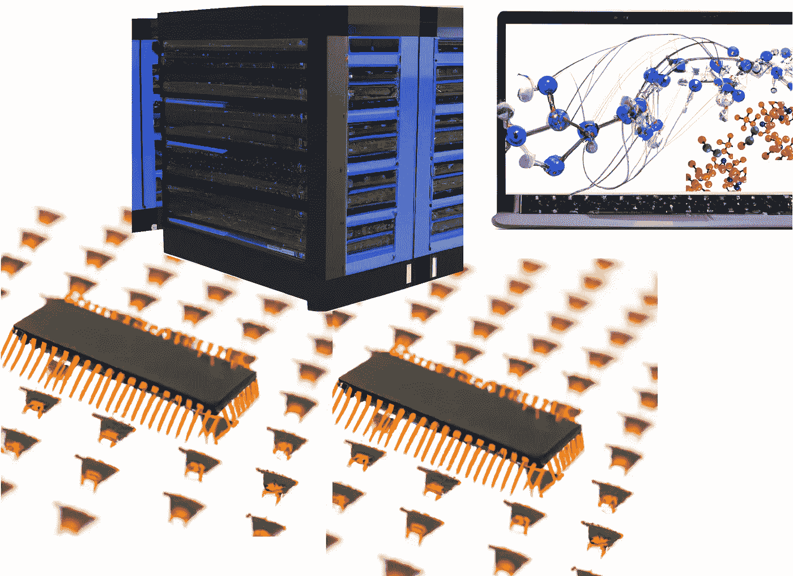

# 一系列专门的超级计算机，模拟分子力学，独一无二

> 原文：<https://towardsdatascience.com/a-family-of-specialized-supercomputers-that-simulates-molecular-mechanics-like-no-other-38a6e59f96ef>

## D. E .肖研究所的安东电脑公司

## 作为机器学习方法海洋的纯粹基于物理学的替代方法，这项无与伦比的技术能够实现与基础生物学和制药相关的其他不可能的研究

这些超级计算机已经存在了十多年，拥有一个专门的架构，使它们能够非常有效地运行多原子系统的分子动力学模拟。图片由达尔-E-2 世代的作者创作(截至 2022 年 7 月 23 日，可用于包括商业用途在内的所有合法目的，详见[https://labs.openai.com/policies/terms](https://labs.openai.com/policies/terms))。

**分子动力学模拟包括将一种物质描述为数学模型，通常是一个原子一个原子地描述，然后以物理现实的方式计算系统如何随时间演变。与基于最大似然的方法和其他需要大量数据进行训练的方法相反，分子模拟试图从纯粹的物理原理中再现现实，因此允许探索用基于数据的方法很难甚至不可能探索的问题。这里是分子动力学模拟领域的一瞥，重点是只能运行这种计算的超级计算机家族，但速度无与伦比。**

为了运行分子动力学模拟，并将这种解释仅限于所谓的“经典原子分子动力学模拟”，科学家为系统中的每个原子指定半径、质量、电荷以及与所有其他原子的物理一致性联系。这些连接包括模拟共价键和角度限制的“键合”连接，将原子保持在分子中，还包括“非键合”相互作用，记录原子如何相互碰撞，被相反或相同符号的电荷吸引或排斥，等等。随着时间的推移，所有这些数学描述的整合产生了一种关于系统中所有原子如何运动的电影。利用这种工具，科学家可以从简单的概念(如分子如何移动或扩散)探索复杂的问题，如药物如何与目标蛋白质结合，蛋白质如何发挥其功能，以及与基础和应用化学和生物学相关的无数其他问题。

# 分子模拟对计算要求很高

事实证明，在模拟过程中随着时间传播运动并不是一件容易的事情。给定数学模型中原子的初始配置，一个名为“分子动力学引擎”的计算机程序计算出作用在所有原子上的力，然后计算出它们的速度和位置的变化。根据新的位置，程序可以再次计算力，并对速度和位置进行新的更新。然后一次又一次，每一次都创造出一帧描述系统原子如何运动的“电影”。此外，通过确保原子以一致的方式运动，模拟模拟了模拟系统的温度和压力。模拟温度包括产生随机数来影响所有原子的速度；因此，每次运行 MD 模拟时，您都会观察到不同的时间演变。关键(也是希望)在于，在足够长的时间之后，和/或如果一个人可以并行运行给定的模拟多次，那么从模拟中得出的总体结论原则上是相同的。这就是为什么进行长时间模拟很重要，尤其是当你想对一个需要时间才能发生的事件进行采样的时候。

不幸的是，物理学使得“电影”的连续“帧”之间的时间步长非常短。通常只有 2 fs(飞秒),即千分之一秒的百万分之二。当我们回忆起最有趣的化学事件发生在微秒到毫秒的时间尺度时，这个数字就有了一些意义。

> 为了达到这些时间尺度，MD 程序需要计算数十亿到数万亿步！

更糟糕的是，如果我们考虑到为了收集统计数据，人们理想地想要观察被调查事件的多次发生。

# 用于分子模拟的专用超级计算机

典型的计算机，包括那些拥有最强大的 GPU 的计算机，在最好的情况下，今天可以模拟几十微秒的小系统。虽然有专门的方法可以通过“强迫”系统经历事件(一系列“增强采样”的“把戏”)来规避这个问题，但十多年前，亿万富翁、前计算机科学教授[大卫·艾略特·肖](https://en.wikipedia.org/wiki/David_E._Shaw)创建了一家私人公司[德肖研究](https://en.wikipedia.org/wiki/D._E._Shaw_Research)，其目标是开发一系列新的超级计算机，专门用于多维模拟，将摆脱当前的限制。

这家新公司的长期目标是通过应用模拟以原子细节理解蛋白质和其他生物系统，加速药物相关化合物的开发研究。作为中间目标，他们从事分子力学力场的优化，即用于描述系统模拟的参数集合。在此之前，他们解决了与优化分子动力学模拟计算相关的工程问题。

第一台计算机由德肖研究所开发，名为[安东](https://en.wikipedia.org/wiki/Anton_(computer))(我们更愿意称之为“安东 1”，因为随后的型号被称为安东 2、3 等。)，2008 年投入工作。它可以模拟原子细节的分子系统，比当时的普通计算机快 100 倍左右。这意味着在该公司使用安东的科学家可以在 2010 年代初模拟即使在今天也没有人可以模拟的分子事件，而无需应用任何增强的采样技巧。不知何故，他们打破了应用于分子模拟的“摩尔定律”。

[安东 2](https://ieeexplore.ieee.org/document/7012191) 甚至更快，它可以适应更大的系统，并且它比它的前身更具可编程性(因此更通用)(回想一下，这些计算机是硬连线来运行模拟的，所以即使是常规模拟的变体也不会像在常规计算机中一样容易实现)。至少也有一台[安东 3](https://www.hpcwire.com/2021/09/01/anton-3-is-a-fire-breathing-molecular-simulation-beast/) 计算机，它更快，更可编程，并且可以很好地扩展到相当大的系统，与最接近的竞争对手 GPU 相反。如果你喜欢模拟并想看一些数字，据报道 Anton 3 每天以大约 200 微秒的速度运行 100k atoms 系统，这意味着你可以在仅仅一周的工作中获得 1 ms 的动态。目前最好的 GPU 运行速度比 Anton 3 慢 10 倍左右，但仅适用于小型系统，不适用于大型系统。因此，Anton 3 具有双重优势:它运行模拟的速度更快，每单位实时产生更多的采样，并且还能够研究更大、更完整和更复杂的系统。

# ***安东电脑如何工作***

为了在模拟分子系统时实现卓越的速度，安东计算机集成了专门为 DEShaw 研究项目开发的计算机工程新部件。总的来说，这些发展包括设计硬件来加速分子模拟中的典型计算。因此，安东计算机在整合运动方程时牺牲了效率和速度来换取灵活性。换句话说，它们在运行分子模拟方面非常强大，但它们不能做任何其他事情。它们是高度专业化的硬件。

无需深入细节，从维基百科和上面引用的 DEShaw Res 的文章(以及结尾的更多文章)中总结，Anton 完全在专用电路( [ASICs](https://en.wikipedia.org/wiki/Application-specific_integrated_circuit) )上运行其计算，而不是在通用主机处理器之间划分计算。特别是，具有专门用于特定计算的内核的强大 ASICs 是安东卓越速度和简化通信的核心。每个安东 ASIC 包含两个子系统，以及自己的 DRAM 库，支持大型仿真。其中一个子系统专门用于计算非结合力；这是一个高通量交互子系统，由几个深度流水线模块组成，排列方式很像一个[脉动阵列](https://en.wikipedia.org/wiki/Systolic_array)。其余的计算，包括结合力和各种数学运算，在另一个子系统中执行(该子系统更加灵活，可以容纳各种不同的计算，由专门但可编程的 [SIMD](https://en.wikipedia.org/wiki/SIMD) 内核组成)。

安东计算机的 ASICs 被排列成一个 3D 圆环，最大限度地提高了它们之间的连通性，并通过每秒传输数十到数百 GB 的高带宽链路实现了最大限度的连接，这些链路由不同方向的信息流组成。没有留下任何机会；如你所见，每个细节在设计时都考虑到了。

# 在一波前所未有的模拟来证明安东的潜力之后，生物学的应用出现了

2010 年，DEShaw Research 在《科学》的一篇论文中报告了首次使用 Anton(当时的 Anton 1)对蛋白质运动进行的全面研究:

[**蛋白质结构动力学的原子水平表征**](https://www.science.org/doi/10.1126/science.1187409) **(Shaw 等 *Science* 2010)**

这篇论文报道了原子级详细的分子动力学模拟，每个模拟达到大约 0.1 到 1 毫秒，对于从无序形式折叠成 3D 结构的蛋白质和在几十微秒内经历功能相关运动的折叠蛋白质，因此你需要毫秒模拟来多次采样它们。

> 安东 1 号在 2010 年已经达到了毫秒的时间尺度，但仍然比今天报道的使用非模拟设计的传统超级计算机进行的典型模拟长约 100 倍。

对于一些更详细的情况，然后请读者参考该论文，该工作提出的模拟为:

*   小蛋白质 FiP35 和 villin，已知折叠速度非常快(在微秒内)，从延伸的构象开始，并监测它们是否以及如何采用已知的 3D 结构。
*   牛胰腺胰蛋白酶抑制剂(在这种情况下，从实际的折叠 3D 结构开始)在不同构象状态之间相互转化的动力学发生得太慢，常规模拟无法捕捉它们。

蛋白质折叠成 3D 状态的模拟在原则上有可能取代(并且比)基于 ML 的结构预测方法，具有额外的优势，即它们可以解释蛋白质如何折叠。回想一下，即使是最好的 ML 方法，如 AlphaFold，也能预测折叠结构，但不能预测它们是如何实现的，也就是说，它们原则上对折叠途径一无所知。相反，在基于物理的模拟中，人们可以从字面上看到折叠是如何进行的，如果该过程再现了已知的实验数据，那么人们就可以根据模拟推断蛋白质是如何折叠的。

2011 年，DEShaw Res 发表了一篇新论文，研究了无序状态下几种小蛋白质的折叠路径，其中当然包括 Anton:

[**蛋白质如何快速折叠**](https://www.science.org/doi/full/10.1126/science.1208351) **(林道夫-拉森等人，*科学* 2011)**

在这之后，我们没有听到公司更多关于使用分子动力学模拟折叠蛋白质的消息。可能，这种方法没有进一步发展，因为即使中等大小的蛋白质也需要几毫秒才能折叠；也可能是因为力场还不够好。此外，基于最大似然法的预测的影响似乎掩盖了像分子模拟这样的基于物理学的方法的作用。事实上，计算化学家和生物学家团体的大部分努力现在主要致力于改进基于 ML 的方法。只要查一下最近这次大会的[会谈清单就知道了。](https://www.grc.org/computational-chemistry-conference/2022/)

## DEShaw Res 现在如何使用安东电脑

该集团将安东计算机的强大功能用于两个主要目标:

*   改进力场，即在整个模拟过程中更好地描述用于描述原子及其相互作用的参数。这对整个社区来说至关重要，尤其是对 DEShaw Res 来说，因为通过运行如此长时间的模拟，他们可以更好地暴露(遭受，并最终纠正)力场中的问题和偏差。
*   推进对生物相关性系统的原子级理解，这可能是该公司作为最终创造临床用新分子的手段的最终作用。

改进力场探索了几种途径，但最重要的是集中在两点:调整水的描述，更好地描述折叠蛋白质的无序区域，甚至完全(“内在”)无序的蛋白质。这两个问题其实是纠缠在一起的:

大量水具有非常复杂的特性，很难建模，调整它们有助于(正如 DEShaw Res 和许多其他人所表明的那样)纠正在多蛋白质系统和内在无序蛋白质(它们不采用可明确定义的 3D 结构，但具有很大的生物学相关性)中观察到的问题。我在下面的论文中对此做了全面的研究，包括当时由 DEShaw Res 提出的最新力场:

  

## 化学和生物学的应用

在生物系统的一般应用方面，DEShaw Res 发表了关于[药物如何结合其靶蛋白](https://pubs.acs.org/doi/full/10.1021/acs.jctc.7b00172)的论文，尤其有趣的是[无序蛋白](https://pubs.acs.org/doi/full/10.1021/jacs.1c07591)、在蛋白质表面发现可能成为新药靶标的口袋[、无序蛋白](https://journals.plos.org/ploscompbiol/article?id=10.1371/journal.pcbi.1009817)与其他蛋白的[结合，等等。](https://pubs.acs.org/doi/full/10.1021/jacs.0c03217)

当然，还有许多与生物学和医学相关蛋白质直接相关的工作。这里只是一小部分选择:

      

在生物问题的每一个应用中，分子模拟要么提出假设来设计实验，要么解释不能从静态结构中得出的实验结果。这是基于数据的预测工具甚至无法达到的，至少目前是这样。

# 参考

关于安东 1、2 和 3:

        

www.lucianoabriata.com*我写作并拍摄我广泛兴趣范围内的一切事物:自然、科学、技术、编程等等。* [***成为媒介会员***](https://lucianosphere.medium.com/membership) *访问其所有故事(我免费获得小额收入的平台的附属链接)和* [***订阅获取我的新故事***](https://lucianosphere.medium.com/subscribe) ***通过电子邮件*** *。到* ***咨询关于小职位*** *查看我的* [***服务页面这里***](https://lucianoabriata.altervista.org/services/index.html) *。你可以* [***这里联系我***](https://lucianoabriata.altervista.org/office/contact.html) ***。***