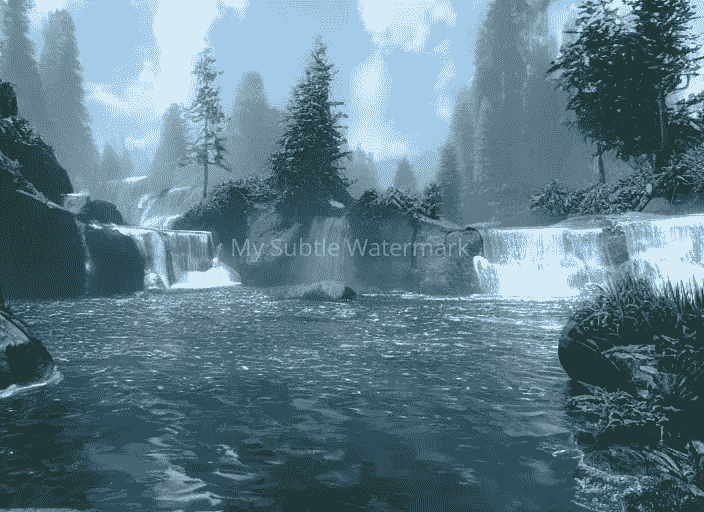
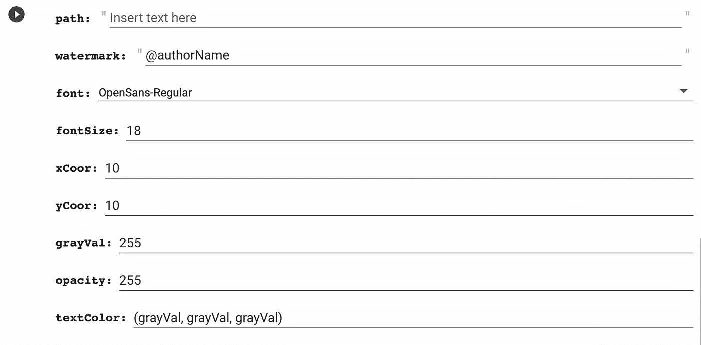
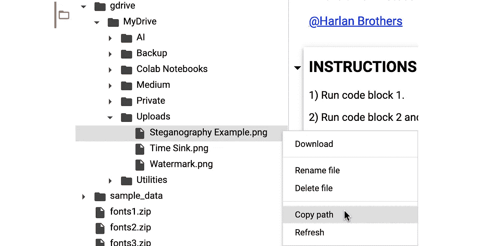
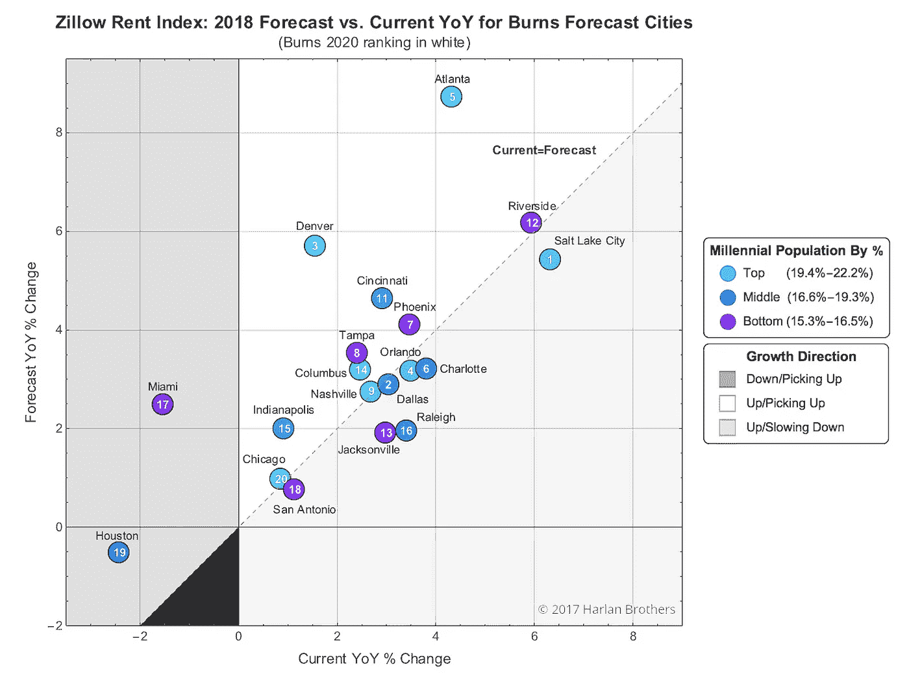
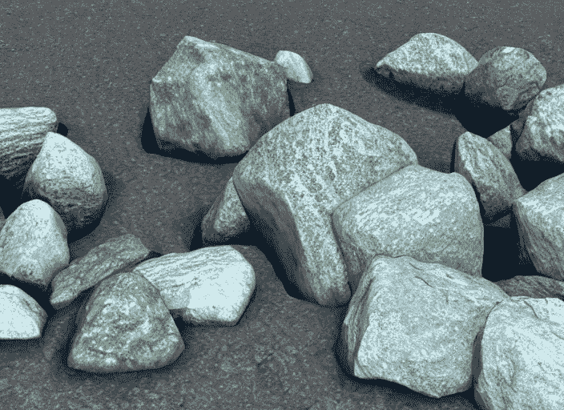
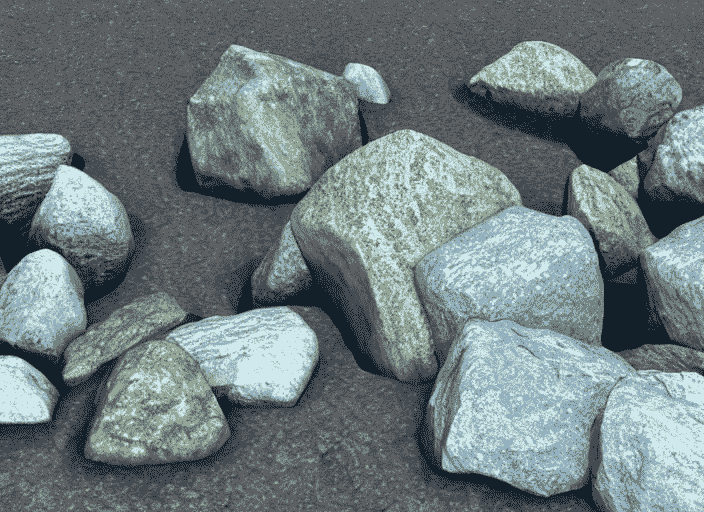
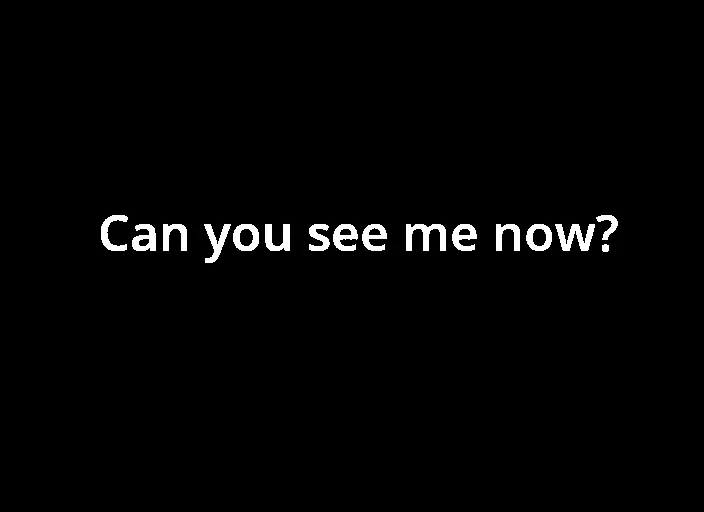

# 使用 Google Colab 为您的作品添加水印的快速简便的方法

> 原文：<https://towardsdatascience.com/a-fast-and-easy-way-to-watermark-your-creations-using-google-colab-d61409265989>

## 这款简单、多功能的笔记本可以帮助您维护图形和人工智能作品的归属。它甚至可以嵌入秘密数据。

“Watermark”带有一个故意可见的水印，由本文中引用的 Colab 笔记本生成。(图片由作者使用[稳定扩散](https://huggingface.co/CompVis/stable-diffusion))

T o 水印还是不水印，这是个问题。唉，没有简单的答案。你已经花了无数的时间来完善你的数据可视化或艺术作品，以便在网上分享。也许你想帮助建立版权所有权，阻止对你的作品的非授权重用，或者仅仅是为了获得知名度。另一方面，你可能不愿意用难看的文字来玷污你的杰作。

不管怎样，这个笔记本是给你的！这里有一个快速纲要。

前两个代码块将从[字体松鼠](https://www.fontsquirrel.com/)下载一系列字体，安装你的 Google Drive，并为你想要水印的图片创建目录。然后你会看到这样的形式:

水印笔记本的格式化参数。

1)使用“文件”窗格，将鼠标悬停在 MyDrive/Uploads 中已上传的文件上，然后按下 3 个垂直点。复制路径并将其粘贴到“路径”字段:

如何复制图像路径？

2)在“水印”字段中添加你的名字、化名或秘密信息(稍后会详细介绍)。

3)从下拉菜单中选择一种字体，并输入字体大小。

4)您可以使用“xCoor”和“yCoor”变量来定位水印。点(0，0)位于图像的左上角(不像通常的笛卡尔坐标，正 *y* 向下)。

5)文本的默认调色板是灰度，由变量“grayVal”决定对于彩色文本，将“textColor”字段中的“grayVal”条目替换为单独的 RGB 值(例如(42，70，99))。

6)设置“不透明度”范围从 0(透明)到 255(不透明)。

7)运行代码块。

就是这样。笔记本会自动下载带水印的图像并预览，这样你就可以在不打开下载图像的情况下进行修改。

使用这个工具，你可以随心所欲地大胆或含蓄。通过低不透明度和明智地使用字体大小和颜色，您的水印实际上是不可见的，但足以建立您的图像的所有权。

例如，假设我为一篇关于千禧一代未来可能租房的文章提供了一个很好的可视化效果(见图 1)。鉴于有关房地产市场趋势的帖子很受欢迎，我认为一旦这些帖子被发布到网上，一些博主(或汽车博主)很可能会“借用”我的见解，并以 50%的正确归因概率来使用这些图片。

所以，我把我的 1600 x 1200 的图片上传到 Google Drive 并运行 watermarker。在快速预览了几个不同的位置后，我决定(852，950)使用 20pt、OpenSans-Regular 字体和 192 的不透明度刚刚好——不显眼，但足以显示我的作者身份。

图一。带水印的图形代表了所选城市千禧年租赁市场的预测受欢迎程度。(图片由作者提供)

事实上，因为你可以像你喜欢的那样微妙，你甚至可以使用笔记本来探索图像隐写术领域——在众目睽睽之下隐藏信息的做法。例如，这里有两个看似相同的图像:

原图。(图片由作者提供)

水印图像。(图片由作者提供)

当我们从带水印的图像(下图)中减去原始图像(上图)并应用伽马校正和二值化时，会发生以下情况:

从上面的水印图像中检索的隐写数据。(图片由作者提供)

所以，继续吧——主张你的知识产权，推广你的品牌，或者只是享受隐写术的乐趣。你可以直接从 GitHub 下载或者打开 Colab 笔记本[。尽情享受吧！](https://github.com/HarlanBrothers/colab/blob/main/Customizable_Watermarker.ipynb)

*如果你喜欢这篇文章，你可以考虑成为 Medium 会员，这样就可以无限制地访问 Medium 上的所有文章。如果你* [*使用此链接*](https://medium.com/@harlan.j.brothers/membership) *注册，你也可以支持我成为作家、研究者、创作者。*

<https://medium.com/@harlan.j.brothers/membership> 