# 快速浏览 Spark 结构化流+卡夫卡

> 原文：<https://towardsdatascience.com/a-fast-look-at-spark-structured-streaming-kafka-f0ff64107325>

## 了解如何使用这款强大的 duo 执行流处理任务的基础知识


在 [Unsplash](https://unsplash.com?utm_source=medium&utm_medium=referral) 上由 [Nikhita Singhal](https://unsplash.com/@nikhita?utm_source=medium&utm_medium=referral) 拍摄的照片

# **简介**

最近，我开始大量研究 Apache Kafka 和 Apache Spark，这是数据工程领域的两项领先技术。

在过去的几个月里，我用它们做了几个项目；“ [**用 Kafka、Debezium、BentoML**](https://medium.com/p/c5f3996afe8f?source=post_stats_page-------------------------------------) 进行机器学习串流”就是一个例子。我的重点是学习如何使用这些现代著名工具创建强大的数据管道，并了解它们的优缺点。

在过去的几个月里，我已经讲述了如何使用这两种工具创建 ETL 管道，但是从来没有一起使用过，这就是我今天要填补的空白。

我们的目标是学习使用 Spark+Kafka 构建流应用程序背后的一般思想，并使用真实数据快速浏览其主要概念。

# **卡夫卡与《一言以蔽之的火花》**

这个想法很简单——Apache Kafka 是一个消息流工具，生产者在队列的一端编写消息(称为*主题*)，供另一端的消费者阅读。

但它是一个非常复杂的工具，旨在成为一个弹性的分布式消息服务，具有各种交付保证(一次、一次、任意)、消息存储和消息复制，同时还允许灵活性、可伸缩性和高吞吐量。它有更广泛的用例，如微服务通信、实时事件系统和流式 ETL 管道。

Apache Spark 是一个分布式的基于内存的数据转换引擎。

它也是一个非常复杂的工具，能够连接各种数据库、文件系统和云基础设施。它适合在分布式环境中运行，以在机器之间并行处理，通过使用其惰性评估理念和查询优化来实现高性能转换。

最酷的是，到最后，代码只是您通常的 SQL 查询或(几乎)您的 Python+pandas 脚本，所有的巫术都抽象在一个友好的高级 API 下。

将这两种技术结合起来，我们就可以完美地构建一个流 ETL 管道。

# **申请**

我们将使用来自巴西米纳斯吉拉斯州首府贝洛奥里藏特市交通传感器的数据。这是一个庞大的数据集，包含城市中几个地方的交通流量测量值。每个传感器定期检测在该位置行驶的车辆类型(汽车、摩托车、公共汽车/卡车)、速度和长度(以及其他我们不会使用的信息)。

该数据集精确地代表了流式系统的经典应用之一——一组从现场连续发送读数的传感器。

在这种情况下，Apache Kafka 可以用作传感器和使用其数据的应用程序之间的抽象层。

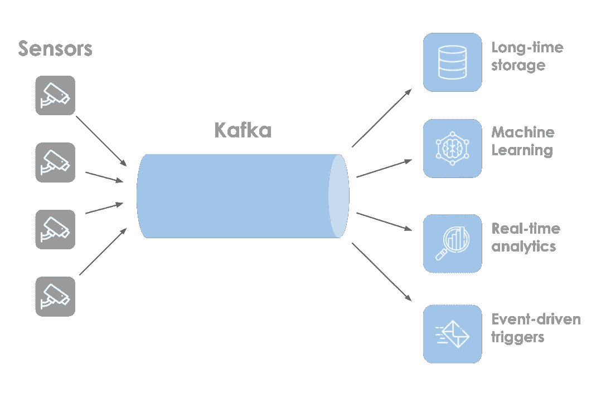

Kafka 用作源和服务之间的抽象层。图片作者。

有了这种基础设施，就有可能建立各种(所谓的)[实时事件驱动系统](https://www.kai-waehner.de/blog/2022/09/29/real-time-logistics-shipping-transportation-with-apache-kafka/)，就像一个程序，当车辆数量突然增加而平均速度下降时，它可以检测并警告交通堵塞。

这就是 Apache Spark 发挥作用的地方。

它有一个名为 *Spark 结构化流*的本地流处理模块，可以连接到 Kafka 并处理其消息。

## **设置环境**

你所需要的是 docker 和 docker-compose。

我们将使用基于以下存储库的 docker-compose 文件配置: [link spark](https://hub.docker.com/r/bitnami/spark) ， [link kafka](https://hub.docker.com/r/bitnami/kafka) 。

**。/src** 卷是我们放置脚本的地方。

要启动环境，只需运行

```
docker-compose up
```

所有代码都可以在这个 [GitHub 库](https://github.com/jaumpedro214/traffic-flow-spark-kafka)中找到。

# **实施**

开始研究 Spark 时，我最喜欢的一件事是它的编写代码和我通常使用的 python+pandas 脚本之间的相似性。迁移是非常容易的。

遵循同样的逻辑，spark 的流模块与常见的 Spark 代码非常相似，这使得从批处理应用程序迁移到流应用程序变得很容易。

也就是说，在接下来的几节中，我们将重点学习 Spark 结构化流的特性，即它有哪些新功能。

## **我们的第一份工作**

让我们慢慢开始，建立一个玩具的例子

首先要做的是创建一个 Kafka 主题，我们的 spark 作业将从这个主题中消费消息。

这是通过[访问 Kafka 容器终端](https://stackoverflow.com/questions/30172605/how-do-i-get-into-a-docker-containers-shell)并执行:

```
kafka-topics.sh --create --bootstrap-server localhost:9092 --topic test_topic
```

为了模拟一个制作人在这个主题上写消息，让我们使用*卡夫卡-控制台-制作人。*同样在集装箱内:

```
kafka-console-producer.sh --bootstrap-server localhost:9092 --topic test_topic --property "parse.key=true" --property "key.separator=:"
```

从现在开始，在终端中键入的每一行都将作为消息发送到测试主题。字符“:”用于分隔消息的键和值(键:值)。

让我们创造一个火花工作来消费这个话题。

代码需要放在 **/src/streaming** 文件夹中(没什么特别的，只是我选择的文件夹)。

需要注意的关键是，我们使用属性 *readStream* 和 *writeStream，*来代替普通的读写。这是 Spark 将我们的工作视为流媒体应用的主要原因。

要连接 Kafka，需要指定服务器和主题。选项*starting offsets = "*earliest "告诉 Spark 从头开始阅读主题。此外，因为 Kafka 以二进制形式存储它的消息，它们需要被解码成字符串。

将进一步探讨其他选择。

现在，让我们访问 Spark 容器并运行作业。

```
spark-submit --packages org.apache.spark:spark-sql-kafka-0-10_2.12:3.3.0 /src/streaming/read_test_stream.py
```

经过几秒钟的配置，它就开始消费话题了。

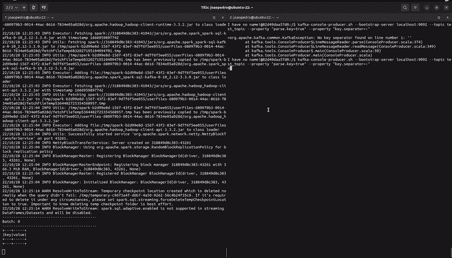

来自卡夫卡的火花消费信息。图片作者。

Spark Streaming 在*微批处理*模式下工作，这就是为什么当它使用消息时我们会看到“批处理”信息。

> 微批处理在某种程度上介于完全“真实”的流和普通的批处理之间，前者所有消息在到达时被单独处理，后者数据保持静态并按需使用。Spark 将等待一段时间，尝试累积消息来一起处理它们，从而减少开销并增加延迟。这可以根据你的需要进行调整。

我打字不是很快，所以 Spark 会先处理消息，然后才能在当前批处理中包含新消息。

这是我们的第一个流媒体工作！

我希望您有这样的感觉:编写一个流处理作业并不难，但是有一些问题。

## **向 Kafka 流写入数据**

现在是时候开始处理传感器数据了。

可以从 2022 年 8 月开始下载 *zip* 文件，解压到 **/data** 卷。数据最初是在 JSON 中，需要大约 23Gb 的空间。首先要做的是将其转换为 parquet，以优化磁盘空间和读取时间。

GitHub 资源库中详细介绍了完成这项工作的 spark 作业，您需要做的就是执行它们:

```
spark-submit /src/transform_json_to_parquet.pyspark-submit /src/join_parquet_files.py
```

根据您的机器，执行可能需要一些时间。但这是值得的，最终的 parquet 文件大小约为 1Gb(比原来小 20 倍以上),读取速度也快得多。

我们还需要创建 Kafka 主题来接收我们的消息:

```
kafka-topics.sh --create --replication-factor 1 --bootstrap-server localhost:9092 --topic traffic_sensor
```

或者，如果您想显示到达的消息，可以设置一个控制台消费者。

```
kafka-console-consumer.sh --topic traffic_sensor --bootstrap-server localhost:9092
```

以 Kafka 为主题写数据很容易，但是有一些细节。

在结构化流中，默认行为是不尝试推断数据模式(列及其类型)，所以我们需要传递一个。

Kafka 消息只是键值二进制字符串对，所以我们需要用这种格式表示我们的数据。这可以通过将所有行转换为 JSON 字符串、以二进制编码并将结果存储在“value”列中来轻松实现。

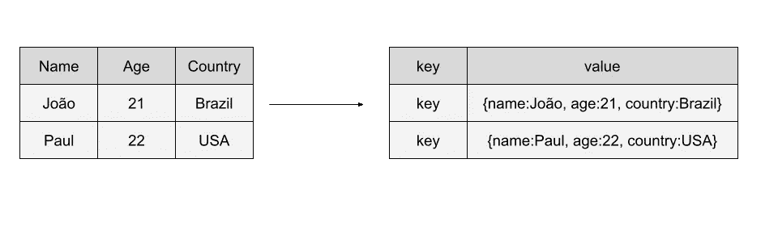

将列转换为 JSON 字符串。图片作者。

消息键在 Kafka 中非常重要，但是在我们的测试中没有用，所以所有的消息都有相同的键。

如前所述，这个数据集非常大，所以我将插入的消息数量限制为 500，000。

最后，我们传递 Kafka 服务器和主题以及一个“ *checkpointLocation* ”，spark 将在其中存储执行进度，这对从错误中恢复很有用。

执行作业:

```
spark-submit --packages org.apache.spark:spark-sql-kafka-0-10_2.12:3.3.0 /src/streaming/insert_traffic_topic.py
```

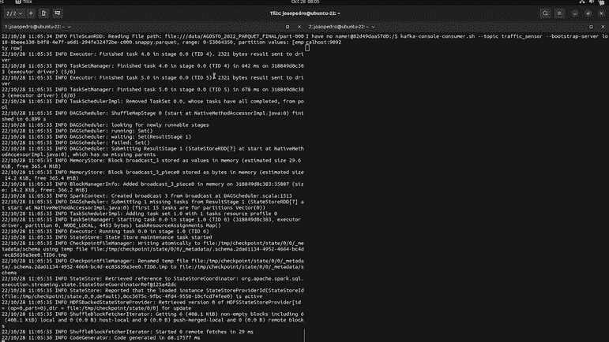

将数据插入卡夫卡。图片作者。

在左边，Spark 作业读取文件，在右边，一个*Kafka-控制台-消费者*显示到达的消息。

我们的流量主题已经填充完毕，几乎可以处理了。

重要的是要记住，我们使用 spark 作业来填充我们的主题只是出于学习目的。在真实场景中，传感器本身会直接向卡夫卡发送读数。

为了模拟这种动态行为，下面的脚本每 2.5 秒向主题中写入一行。

## **输出模式——按类型统计车辆数量**

接下来，让我们创建一个按类型统计车辆数量的作业。

“分类”栏包含检测到的车辆类型。

当我们阅读主题时，我们需要将 JSON 二进制字符串转换回列格式。

一旦完成，就可以照常构建查询了。有趣的是，查询心脏正好是*选择*()。*分组依据*()。*计数*()序列，其余都是相对于流式逻辑。

所以是时候解决*输出模式*()选项了。

流应用程序的输出模式指定了当新数据到达时，我们希望如何(重新)计算和写入结果。

它可以假设三个不同的值:

*   **追加**:仅向输出添加新记录。
*   **完成**:重新计算每个新记录的完整结果。
*   **更新**:更新变更记录。

这些模式可能有意义，也可能没有意义，这取决于编写的应用程序。例如，如果执行任何分组或排序，“完整”模式可能没有意义。

让我们在“完成”模式下执行作业，并查看结果。

```
spark-submit --packages org.apache.spark:spark-sql-kafka-0-10_2.12:3.3.0 /src/streaming/group_by_vehicle_type.py
```

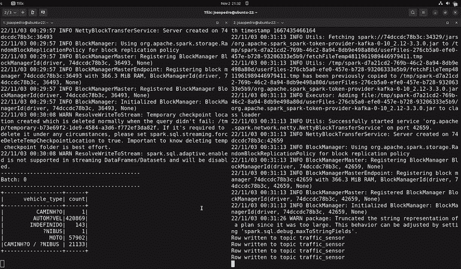

卡车、汽车、未定义的汽车、公共汽车、摩托车。图片作者。

随着新记录被插入到流中(见右边的终端)，作业重新计算完整的结果。这在行排序很重要的情况下很有用，比如排名或竞争。

然而，如果组的数量太大或者单个的改变不影响整体结果，这种方法可能不是最佳的。

因此，另一种选择是使用“更新”输出模式，它只为发生变化的组生成新消息。见下文:

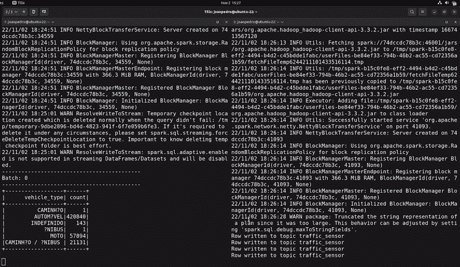

输出模式为“更新”的查询。图片作者。

“append”模式不适用于分组查询，因此我将无法使用相同的作业进行展示。但我认为这是最简单的模式，它总是向输出中添加一条新记录。

如果考虑将结果保存到表中，这些输出模式会更容易理解。在完整输出模式中，对于处理的每个新消息，表都将被重写；在更新模式中，只重写发生了某些更新的行，append 总是在末尾添加一个新行。

## **翻转时间窗口—使用时间间隔聚合**

在流系统中，消息有两个不同的相关时间戳:事件时间(创建消息的时间，在我们的示例中是传感器的读取时间)和处理时间(处理代理读取消息的时间，在我们的示例中是消息到达 Spark 的时间)。

流处理工具的一个重要特性是处理事件时间的能力。滚动窗口是不重叠的固定时间间隔，用于使用事件时间列进行聚合。更简单地说，他们将时间线分割成大小相等的片段，这样每个事件都属于一个时间间隔。

例如，每 5 分钟计算一次，在过去 5 分钟内检测到多少辆车。

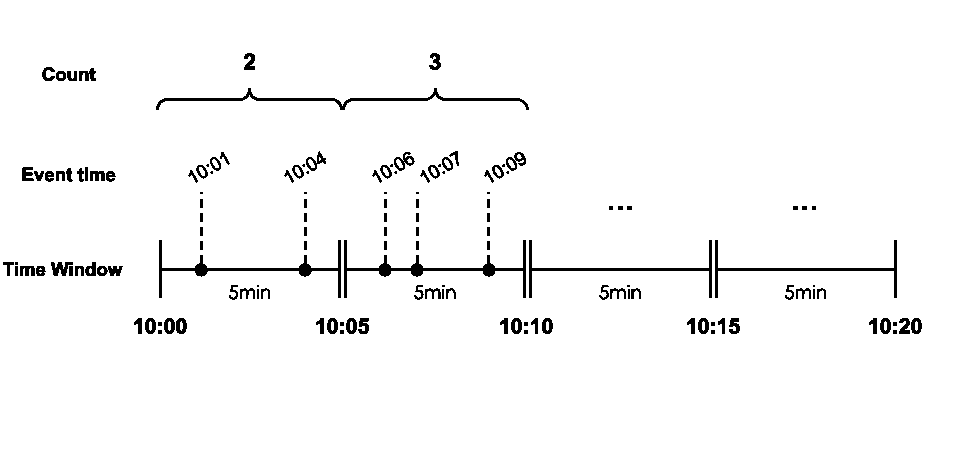

5 分钟翻滚窗口。图片作者。

下面的代码说明了这一点:

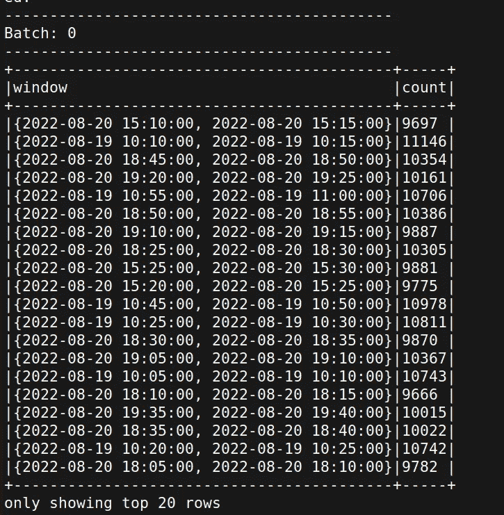

这种处理在许多情况下非常有用。回到之前提出的交通堵塞检测器，一种可能的方法是测量 10 分钟窗口内车辆的平均速度，并查看它是否低于某个阈值。

> 排气时间处理是一个复杂的话题。在处理它的时候，任何事情都可能发生，比如消息丢失、到达太晚或者顺序混乱。Spark 有几种机制来尝试缓解这些问题，比如[水印](https://www.databricks.com/blog/2022/08/22/feature-deep-dive-watermarking-apache-spark-structured-streaming.html)，我们不会重点讨论。

时间窗口也可以与 *groupBy()* 中的其他列结合使用。以下示例按类型统计了 5 分钟窗口内的车辆数量。

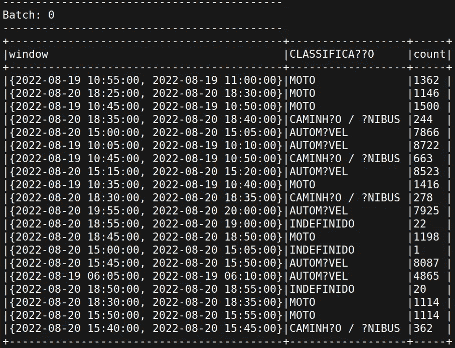

## **滑动时间窗——时间间隔的灵活性**

滑动时间窗口是滚动窗口的灵活化。它们允许定义创建每个间隔的频率，而不是创建不重叠的间隔。

例如，每隔 5 分钟，计算在过去 30 分钟内检测到多少车辆。

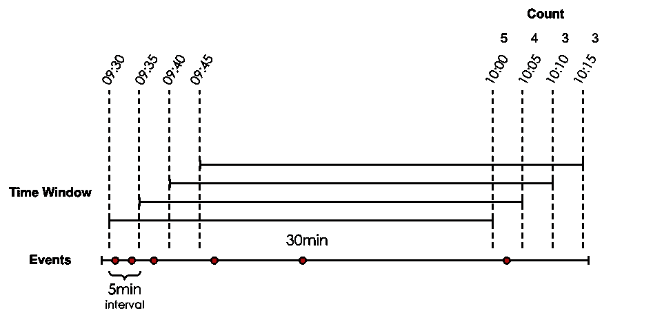

因此，事件可以属于多个时间间隔，并根据需要进行多次计数。

要定义滑动窗口，只需将更新间隔传递给*窗口*()函数。

让我们看看输出。

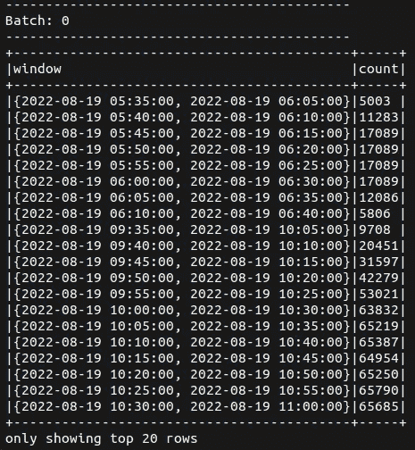

如我们所见，每 5 分钟就有 30 分钟的窗口被创建。

这种灵活性对于定义更具体的业务规则和更复杂的触发器非常有用。例如，我们的交通堵塞检测器可以在过去 10 分钟内每 5 秒钟发送一次响应，并在平均车速低于 20 公里/小时时发出警报

# 结论

这是对 Spark 结构化流的主要概念以及它们如何应用于 Kafka 的快速浏览。

Apache Kafka 和 Apache Spark 都是可靠和健壮的工具，许多公司使用它们来处理难以置信的大量数据，这使它们成为流处理任务中最强的一对。

我们已经学习了如何使用 Spark jobs 填充、消费和处理 Kafka 主题。这不是一个困难的任务，正如在帖子中提到的，流处理 API 几乎等同于通常的批处理 API，只是做了一些小的调整。

我们还讨论了不同的输出模式，特定于流应用程序的内容，以及每种模式的使用方法。最后但同样重要的是，我们探索了带时间窗的聚合，这是流处理的主要功能之一。

同样，这只是快速浏览，如果你想更深入地探索，我会在下面留下一些参考资料。

希望我有所帮助，感谢您的阅读！:)

# 参考

> *所有的代码都在这个* [*GitHub 资源库*](https://github.com/jaumpedro214/traffic-flow-spark-kafka) *中。
> 使用的数据—*[Contagens volumétricas de Radares](https://dados.gov.br/dataset/contagens-volumetricas-de-radares)，[公开数据](https://opendefinition.org/licenses/cc-by/)，巴西政府。

[1] [功能深度挖掘:Apache Spark 结构化流中的水印](https://www.databricks.com/blog/2022/08/22/feature-deep-dive-watermarking-apache-spark-structured-streaming.html) — Max Fisher 在 Databricks 博客上的文章
[2] Chambers，b .，& Zaharia，M. (2018)。Spark:权威指南:简化大数据处理。奥莱利媒体公司。
【3】[与阿帕奇·卡夫卡](https://www.kai-waehner.de/blog/2022/09/29/real-time-logistics-shipping-transportation-with-apache-kafka/) [](https://docs.ksqldb.io/en/latest/tutorials/etl/)实时物流、海运、运输——凯·沃纳
【4】[以阿帕奇·卡夫卡为特色的网飞工作室和金融世界](https://www.confluent.io/blog/how-kafka-is-used-by-netflix/)——汇流博客
【5】星火流媒体&卡夫卡——[https://sparkbyexamples.com/](https://sparkbyexamples.com/)