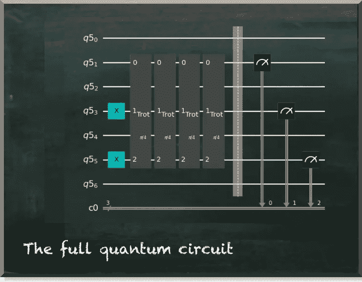

# IBM 量子开放科学价格挑战一瞥

> 原文：<https://towardsdatascience.com/a-first-glimpse-at-ibms-quantum-open-science-price-challenge-de4a2f41987e>

## 看到实际的问题是什么是令人惊讶的

量子机器学习要不要入门？看看 [**动手量子机器学习用 Python**](https://www.pyqml.com/page?ref=medium_firstglimpse&dest=/) **。**

IBM 刚刚公布了其第二届 [**量子开放科学奖**](https://research.ibm.com/blog/quantum-open-science-prize) **。**他们要求解答一个量子模拟问题。他们希望我们在 IBM Quantum 的 7 量子位 Jakarta 系统上使用 Trotterization 模拟一个三粒子系统的海森堡模型哈密顿量。

尽管 IBM 解释了什么是海森堡模型哈密顿量和量子化，但这一切都显得神秘，除非你是物理学家或量子计算资深人士。

幸运的是，他们还提供了他们所期望的[工作代码示例](https://github.com/qiskit-community/open-science-prize-2021/blob/main/ibmq-qsim-challenge.ipynb)。所以，让我们看看我们计算机科学家能从这个挑战中学到什么。

首先，你需要一个 Jupyter 工作环境(见我的[上一篇](https://pyqml.medium.com/how-to-set-up-jupyterlab-to-participate-in-ibms-quantum-open-science-prize-1a9d44b95bf6))。二、下载 Jupyter 笔记本([来源](https://github.com/qiskit-community/open-science-prize-2021/blob/main/ibmq-qsim-challenge.ipynb))。我们正在制作它的副本，因为我们将做一些修改。你可以在这里找到我的。

所以，让我们简单地看一下代码。首先，我去掉了任何不必要的东西，比如第一节中的经典解释。

所以，我们从一些进口开始。在第 7 行，我添加了`Aer`包。

原始代码试图在下一步连接到您的 IBM 帐户和 Jakarta 后端。我们跳过这一步，直接从下面几个定义自定义 tterization gate 的单元格开始。值得注意的是，这些单元格被注释“您的 the 化在此处开始—开始(示例的开始)”和“完成(示例的结束)”所包围

显然，IBM 希望我们用我们的解决方案替换这一部分。但是，现在，让我们坚持他们的例子。

我们还没有研究量子化的细节，但是我们继续讨论量子电路。在下面的代码中，我们定义了整个量子电路(`qc`)并生成了状态层析电路来评估模拟的保真度。保真度是我们旨在优化的绩效得分。保真度范围从 0.0 到 1.0，1.0 是我们能达到的最好结果。

最后，上面的代码显示了我们的电路图。



作者图片

我们的三重门在图中出现了四次。这就是我们在第 5 行中定义的——`trotter_steps`。评论上说可以大于四。让我们记住这一点，因为这是我们可以使用的一个参数。

我们几乎准备好执行电路。我们只需要弥补没有早点设置后端。所以，我们使用`Aer`包，让我们选择一个本地模拟后端。具体来说，我们使用`qasm_simulator`——一个无声的模拟后端。

当你运行这个单元时，你会得到这样的输出。

```
Job ID 58e33e7a-b539-4275-bd7c-f349f74635e1
Job ID 6fd2d9bc-a945-452b-8f14-233396574582
Job ID 3a09070b-b4e6-4441-b433-32ad7d1362ee
Job ID 6c548328-42e8-4821-8133-256ef596adb1
Job ID 74bad2f3-d821-4d55-bf12-efd884e3ec43
Job ID 577b6965-1dbd-4728-ae91-c4c88868ec53
Job ID 8f5bcc1a-df17-4ea0-952b-a936dce8b921
Job ID 260e575d-6be6-4b3a-81ca-195ab78bccd7
```

我们看到我们执行了八次作业，这是复制的次数。

最后，我们来评估一下电路。

```
state tomography fidelity = 0.0003 ± 0.0002
```

我们看到一个毁灭性的国家层析成像保真度几乎为 0。

那么，让我们看看我们能轻松地做些什么。因为我们将运行和执行代码几次，所以让我们编写一个包装器函数。函数`run_and_evaluate_with_steps`将遍历的次数`steps`和`backend`作为参数。

我们现在可以用不同数量的 trotter 步骤运行整个代码。我们用八步试试吧。

```
state tomography fidelity = 0.8543 ± 0.0013
```

保真度不算太差吧？所以，如果增加快步走的步数有如此显著的效果，为什么我们不尝试更多的步数呢？

```
state tomography fidelity = 0.9687 ± 0.0006
```

十二个小跑步，保真度差不多 0.97。那几乎是完美的。因此，示例代码似乎工作得很好。那么，问题出在哪里？

IBM 要求我们在他们的雅加达设备上运行电路。到目前为止，我们模拟了一台完美的量子计算机。但是我们知道实际的量子计算机噪音很大，容易出错。因此，我们来模拟一个实际设备。Qiskit 提供了`test.mock`包，该包提供了对应于真实设备行为的模拟器，比如`FakeJakarta`。

```
state tomography fidelity = 0.1442 ± 0.0021
```

当我们在 Jakarta 设备的噪声模拟上以 12 个快步运行代码时，保真度下降到 0.14。

你可能想玩快步数。但是，你不会得到比 0.2 更好的保真度。

# 结论

所以，实际的问题不是用 Trotterization 来模拟一个三粒子系统的海森堡模型哈密顿量。相反，问题是要在一个真正的 7 量子位设备上做这件事。

当我们观察示例性的 trotterization 门时，我们可以看到它只使用了三个量子位。其他四个量子位仍未使用。实际的挑战是使用这额外的四个量子位来使电路免受噪声和误差的影响。

量子机器学习要不要入门？看看 [**动手量子机器学习用 Python**](https://www.pyqml.com/page?ref=medium_firstglimpse&dest=/) **。**


在这里免费获得前三章。