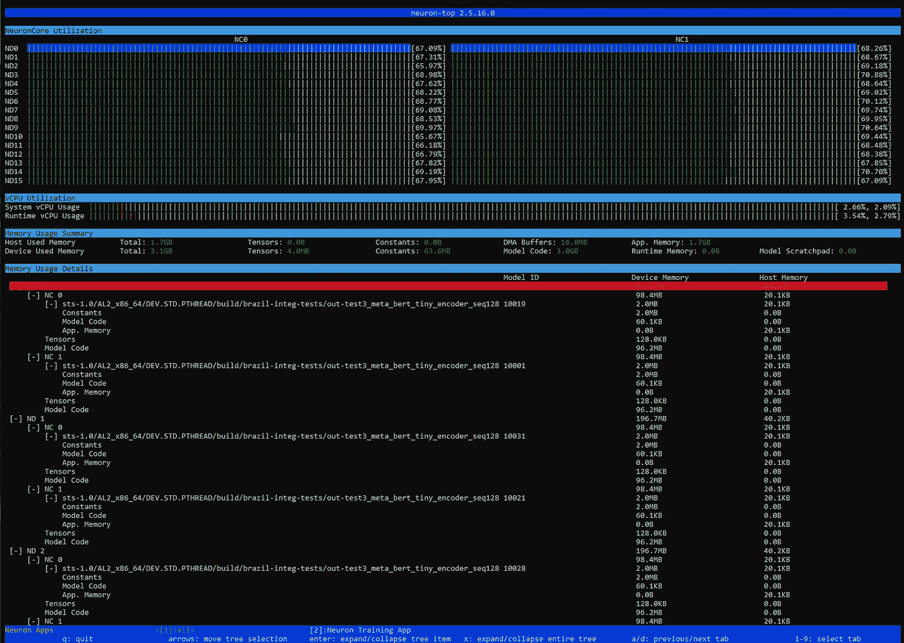
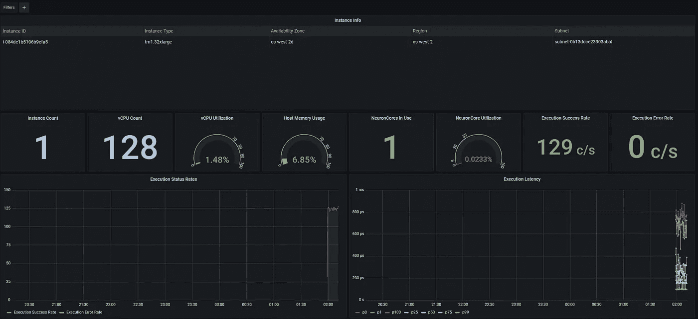
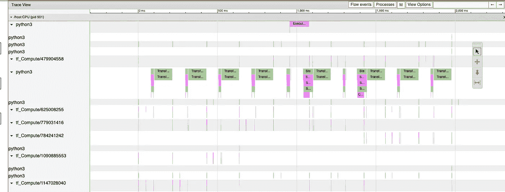
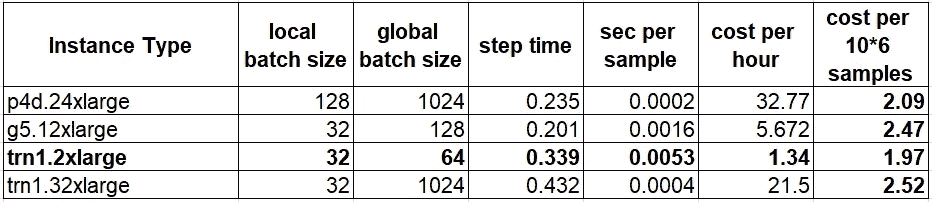

# AWS Trainium 初探

> 原文：<https://towardsdatascience.com/a-first-look-at-aws-trainium-1e0605071970>

## 利用专用 DNN 训练芯片的力量—第 3 部分


Balazs Busznyak 在 [Unsplash](https://unsplash.com?utm_source=medium&utm_medium=referral) 上的照片

在[万众期待](https://www.idexcel.com/blog/aws-2020-reinvent-recap-aws-trainium/)，[亚马逊 EC2 TRN1](https://aws.amazon.com/ec2/instance-types/trn1/) 实例[现已可供公众使用](https://aws.amazon.com/about-aws/whats-new/2022/10/ec2-trn1-instances-high-performance-cost-effective-deep-learning-training/)。基于 [AWS Trainium](https://aws.amazon.com/machine-learning/trainium/) 芯片，TRN1 实例类型是专门为加速深度学习训练而设计的。本文是在专用人工智能芯片上训练深度学习模型系列的第三部分。在我们之前的帖子中，我们报道了[谷歌的云 TPU](/tpu-training-6eb84100d138) 和[亚马逊的 EC2 DL1](/training-on-aws-with-habana-gaudi-3126e183048) (由 [Habana Gaudi](https://habana.ai/training/gaudi/) 加速器驱动)。与其他定制人工智能芯片一样，Trainium 提供了显著节约成本的潜力(根据文档[高达 50%)。然而，与其他定制的人工智能芯片类似，并不是所有的型号都适合 Trainium，有些型号可能需要调整以实现潜在的节省。在本帖中，我们将评估 TRN1 实例，展示其一些独特的属性，并讨论其使用带来的一些挑战。正如在我们以前的帖子中，我们将把修改 TRN1 用于模型训练的任务分成四个步骤。关于这些步骤的更多细节，见](https://aws.amazon.com/ec2/instance-types/trn1/)[这里](/tpu-training-6eb84100d138)。

1.  **高级兼容性分析**:尽早评估您的工作负载特性是否符合芯片规格和支持软件堆栈。
2.  **调整您的模型以在新芯片上运行**:您可能需要对您的模型进行一些调整，例如替换专用人工智能芯片不支持的操作。
3.  **优化新芯片上的运行时性能**:为了充分利用芯片，您将需要分析并最大化其利用率。
4.  **调整模型以在新芯片上收敛**:为了确保及时收敛，可能需要对模型超参数进行一些修改。

AWS Trainium 上的训练由 [AWS Neuron SDK](https://aws.amazon.com/machine-learning/neuron/) 启用。这篇博文和我们包含的代码片段是基于撰写本文时可用的最新软件栈，[版本 2.4](https://awsdocs-neuron.readthedocs-hosted.com/en/latest/release-notes/index.html#neuron-2-4-0-10-27-2022) 。

鉴于 Neuron SDK 产品的相对新颖性，新版本可能会包括重要的增强和优化。重要的是，您要使用可用软件栈的最新版本[并确保相应地重新评估我们所做的一些陈述。虽然我们会强调，我们所做的某些陈述是真实的*在撰写本文时，*同样的资格应该适用于本文中的所有内容。我们将重点介绍 Neuron SDK 的](https://awsdocs-neuron.readthedocs-hosted.com/en/latest/release-notes/index.html#latest-neuron-release) [PyTorch](https://www.tensorflow.org/) 产品(版本 1.11)。然而，我们写的大部分内容对于运行在 Trainium 上的其他机器学习框架来说都是相关的。

在进入正题之前，关于 TRN1 实例产品的类型，我们想强调一个重要的特性。

## TRN1 实例类型产品

AWS 提供了两种 TRN1 实例类型，带有单个 Trainium 芯片的 trn1.2xlarge 和带有 16 个 Trainium 芯片的 trn1.32xlarge。(每个 Trainium 芯片由两个内核组成，称为<https://awsdocs-neuron.readthedocs-hosted.com/en/latest/general/arch/neuron-hardware/neuroncores-arch.html>*。)这种双重提供并不是理所当然的，因为基于其他核心架构的实例类型有时仅提供单个多芯片选项。例如，在撰写本文时，[亚马逊 EC2 p4d](https://aws.amazon.com/ec2/instance-types/p4/) 家族只包括带有八个[NVIDIA A100](https://www.nvidia.com/en-us/data-center/a100/)GPU 的实例。单芯片 trn1.2xlarge 设计的可用性有两个主要影响。最明显的一点是它适用于较小的培训工作量，对于这些工作量，32 核解决方案是不必要或不可取的。第二，同样重要的含义与我们的讨论有关:较小的 trn1.2xlarge 实例是评估、调整和调整我们的 Trainium 芯片模型的完美环境。当我们调整我们的模型在 NVIDIA A100 GPUs 上运行时，我们别无选择，只能在一个昂贵的八 GPU 实例上这样做，即使单个 GPU 已经足够了。相比之下，使用 Trainium，我们可以在迁移到一个或多个更大的实例进行全面培训之前，在更便宜的单芯片实例上进行大量的分析、实验和探索。*

# *1.高级兼容性评估*

*第一步是收集尽可能多的公开信息，以评估 Trainium 产品是否满足了您的培训需求。在此评估过程中，区分 Trainium 硬件的功能和 Neuron SDK 支持的功能非常重要。正如我们将看到的，Trainium 支持许多功能、特性和操作，在撰写本文时，这些功能、特性和操作还没有被支持的软件栈公开。如果您的 ML 项目需要其中的一个，那么您可能希望推迟您的 Trainium 评估，并在公开的 [AWS Neuron Roadmap 页面](https://github.com/orgs/aws-neuron/projects/1/views/1)上跟踪软件堆栈的开发。*

*兼容性评估的主要资源应该是官方的 [AWS Neuron 文档](https://awsdocs-neuron.readthedocs-hosted.com/en/latest/index.html)。AWS Neuron SDK 及其附带的文档同时支持 AWS Trainium 和 [AWS Inferentia](https://aws.amazon.com/machine-learning/inferentia/) ，其中许多功能只支持一种，而不支持另一种(在撰写本文时)。文档的每一页都包含一个标签，说明它是否与 Trn1、Inf1 或两者相关。请仔细注意这些标签。*

## *模型兼容性*

*从[模型架构匹配](https://awsdocs-neuron.readthedocs-hosted.com/en/latest/general/arch/model-architecture-fit.html#model-architecture-fit)部分开始是一个不错的地方。在这里，您可以找到一个[表](https://awsdocs-neuron.readthedocs-hosted.com/en/latest/general/arch/model-architecture-fit.html#aws-trainium-neuroncore-v2)，总结了 Trainium 硬件和当前软件堆栈支持许多流行型号的程度。对于硬件更详细的回顾，请查看 [Trainium 架构](https://awsdocs-neuron.readthedocs-hosted.com/en/latest/general/arch/neuron-hardware/trn1-arch.html#trainium-architecture)和 [NeuronCore 架构](https://awsdocs-neuron.readthedocs-hosted.com/en/latest/general/arch/neuron-hardware/neuroncores-arch.html#neuroncore-v2-architecture)页面。这些应该让您了解硬件的训练能力，以及内存、计算和其他硬件资源是否满足您的硬件需求。接下来，查看软件文档，验证支持的框架、版本和操作是否满足您的软件需求。Neuron SDK [发行说明](https://awsdocs-neuron.readthedocs-hosted.com/en/latest/release-notes/)将为您提供当前软件支持的概述。SDK 支持几种流行的培训框架，尽管支持的程度有很大的不同(在撰写本文时)。在这篇文章中，我们将关注 [PyTorch 支持](https://awsdocs-neuron.readthedocs-hosted.com/en/latest/general/quick-start/torch-neuron.html)。请务必查看 [PyTorch 开发人员指南](https://awsdocs-neuron.readthedocs-hosted.com/en/latest/frameworks/torch/torch-neuronx/programming-guide/training/pytorch-neuron-programming-guide.html)以了解 PyTorch 使用模式的概述以及[支持的 PyTorch 操作员列表](https://awsdocs-neuron.readthedocs-hosted.com/en/latest/frameworks/torch/torch-neuronx/pytorch-neuron-supported-operators.html)。您可以在 [PyTorch Neuron 发行说明](https://awsdocs-neuron.readthedocs-hosted.com/en/latest/release-notes/torch/torch-neuronx/index.html)中跟踪 PyTorch 相关的 SDK 更新。另外，请务必查看 [Neuron github 资源库](https://github.com/aws-neuron/aws-neuron-samples/tree/master/torch-neuronx/training)中的示例。*

## *性能基准*

*[TRN1 性能](https://awsdocs-neuron.readthedocs-hosted.com/en/latest/general/benchmarks/trn1/trn1-performance.html#trn1-performance)页面为许多流行的深度学习模型提供了性能基准。这些可以与其他人工智能加速器(例如[英伟达 GPU](https://developer.nvidia.com/deep-learning-performance-training-inference) )的公开性能数据进行比较，以获得 Trainium 潜在节省机会的大致想法。公共基准列表仅限于 NLP 模型(在撰写本文时)。当试图根据这些结果预测其他模型的性能时，建议谨慎，因为即使模型或训练环境的微小变化也会对性能产生相当大的影响。我们建议在做出任何决定之前运行您自己的性能比较测试。*

*[MLPerf](https://mlcommons.org/en/) 是一个流行的人工智能训练基准套件，用于比较多个人工智能加速器的性能。然而，在撰写本文时，最新的[结果](https://mlcommons.org/en/training-normal-21/)不包括基于 Trainium 的提交。*

## *第一印象*

*在下面的要点中，我们将总结一些我们个人对当前 TRN1 产品的印象。该列表并不全面，也不应被视为官方文档的替代品。*

*   ***异构架构**:每个 NeuronCore 结合了四个计算引擎(张量/矢量/标量/GPSIMD)的能力，使其能够在各种工作负载上达到高效率。*
*   ***高规模数据分布式训练**:架构设计，包括用于节点间连接的 NeuronLink 和用于节点内连接的 [EFA](https://docs.aws.amazon.com/AWSEC2/latest/UserGuide/efa.html) 支持，允许 Trainium 在扩展到高度[分布式训练](https://awsdocs-neuron.readthedocs-hosted.com/en/latest/frameworks/torch/torch-neuronx/tutorials/training/mlp.html?highlight=torchrun#multi-worker-data-parallel-mlp-training-using-torchrun)时[展示](https://awsdocs-neuron.readthedocs-hosted.com/en/latest/general/benchmarks/trn1/trn1-performance.html#training-performance)接近线性的结果。*
*   ***框架支持**:Neuron SDK 的当前版本( [2.4](https://awsdocs-neuron.readthedocs-hosted.com/en/latest/release-notes/index.html#neuron-2-4-0-10-27-2022) )支持使用 [PyTorch](https://awsdocs-neuron.readthedocs-hosted.com/en/latest/frameworks/torch/index.html) 框架在 Trainium 上进行训练。TensorFlow 支持正在开发中。Neuron SDK PyTorch 支持通过 [PyTorch/XLA](https://github.com/pytorch/xla/) 库公开，其中每个 NeuronCore 都是一个 [XLA 设备](https://pytorch.org/xla/release/1.13/index.html#pytorch-on-xla-devices)。使用 [PyTorch/XLA](https://github.com/pytorch/xla/) 而不是标准 PyTorch 框架有许多含义；其中最值得注意的是使用[懒惰张量](https://pytorch.org/xla/release/1.13/index.html#xla-tensors-are-lazy)而不是渴望张量。在[之前的一篇文章](/how-to-accelerate-your-pytorch-training-with-xla-on-aws-3d599bc8f6a9)中，我们对 [PyTorch/XLA](https://github.com/pytorch/xla/) 的训练主题进行了扩展，并指出它的一些优点和局限性。PyTorch/XLA API 是由 [torch-neuronx](https://awsdocs-neuron.readthedocs-hosted.com/en/latest/general/quick-start/torch-neuron.html) PyThon 包实现的，在撰写本文时，该包与 PyTorch/XLA API 的 1.11 版本保持一致。*
*   ***操作员支持**:Neuron SDK 没有实现 py torch/XLA API 和使用流程的完整集合。事实上，有许多流行的操作符(如 conv 和排序)、优化器(如 [LAMB](https://github.com/aws-neuron/aws-neuron-sdk/issues/571) )、模型(如 [FP16](https://github.com/aws-neuron/aws-neuron-sdk/issues/573) )和基本类型(如[FP16](https://github.com/aws-neuron/aws-neuron-sdk/issues/573))正在等待支持。*
*   ***自定义内核创建**:train ium 芯片的优势之一是它支持创建[自定义 C++操作符](https://awsdocs-neuron.readthedocs-hosted.com/en/latest/general/arch/neuron-features/custom-c%2B%2B-operators.html)。与用于 GPU 内核开发的 [CUDA toolkit](https://developer.nvidia.com/cuda-toolkit) 类似，该特性使用户能够设计、开发和优化专门针对其工作负载需求的低级操作。然而，在撰写本文时，Neuron SW 栈还没有公开这项功能。*
*   ***内存池**:虽然每个 Trainium 芯片包含 32GB，但所有芯片的内存都被集中在一起(参见[这里的](https://awsdocs-neuron.readthedocs-hosted.com/en/latest/general/arch/neuron-hardware/trn1-arch.html#trainium-architecture))。特别是，这意味着您可以选择启用可用 Trainium 芯片的子集，但仍然利用所有芯片的内存。例如，在 trn1.32xlarge 上，您可以选择在 32 个每个 16GB 的工作线程、8 个每个 64GB 的工作线程、2 个 256GB 的工作线程或一个全部 512GB 的工作线程之间分配您的模型(参见此处的)。但是，您应该仔细权衡放弃使用任何芯片的选择，并尽可能选择其他替代方案(例如模型分片)。*
*   ***模型分布**:模型分布是一种常用的技术，用于训练一个非常大的模型，它不适合单个工人分配的内存。模型分布有许多不同的策略，包括张量并行、流水线并行和完全分片数据并行(FSDP)。Neuron SDK 使用 [Megatron-LM 库](https://awsdocs-neuron.readthedocs-hosted.com/en/latest/frameworks/torch/torch-neuronx/tutorials/training/megatron_lm_gpt.html)支持张量并行。然而，对其他策略的支持，尤其是 FSDP 的支持还未确定。(有关模型分布式培训策略的简要概述，请查看我们最近的[帖子](/smart-distributed-training-on-amazon-sagemaker-with-smd-part-1-cd296f87a0ee)。)*
*   ***托管培训支持**:tr n1 实例家族由亚马逊托管培训服务[亚马逊 SageMaker](https://aws.amazon.com/sagemaker/) 的[支持](https://sagemaker.readthedocs.io/en/stable/frameworks/pytorch/using_pytorch.html#launching-a-distributed-training-job-on-trainium)。Amazon SageMaker 为机器学习模型开发提供了许多便利，包括管理训练实例的设置和配置，以及训练完成时它们的自动终止。这在[多个节点](https://sagemaker.readthedocs.io/en/stable/frameworks/pytorch/using_pytorch.html#launching-a-distributed-training-job-on-trainium)上训练时特别有用，除了设置单个实例，还需要配置节点间连接。*

*虽然在线文档可以提供 Trainium 产品的一个很好的总体概念，但是除了开始使用它之外，没有更好的方法来获得对其价值的真实感受。*

# *2.调整您的模型以在 TRN1 上运行*

*在本节中，我们将回顾在 TRN1 实例上启动和运行 PyTorch 模型所需的一些步骤。更多详情请看官方 [Neuron SDK PyTorch 文档](https://awsdocs-neuron.readthedocs-hosted.com/en/latest/frameworks/torch/index.html)。*

## *TRN1 系统设置*

*设置 TRN1 PyTorch 环境有许多选项，包括， [Amazon EC2](https://aws.amazon.com/ec2/) ， [AWS ParallelCluster](https://github.com/aws-neuron/aws-neuron-parallelcluster-samples) 和 [Amazon SageMaker](https://aws.amazon.com/sagemaker/) 。最直接的方式，也是获得 TRN1 初步感觉的最佳方式，是用最新的 [AWS 深度学习 AMI](https://docs.aws.amazon.com/dlami/latest/devguide/what-is-dlami.html) 建立一个 Amazon EC2 trn1.2xlarge 训练实例，如这里所记录的[。](https://awsdocs-neuron.readthedocs-hosted.com/en/latest/frameworks/torch/torch-neuronx/setup/pytorch-install.html)*

## *适应培训流程*

*修改您的脚本以在 TRN1 上运行的第一步是使其适应 [PyTorch/XLA](https://pytorch.org/xla/release/1.13/index.html) 。所需的适配在 [SDK 文档](https://awsdocs-neuron.readthedocs-hosted.com/en/latest/frameworks/torch/torch-neuronx/programming-guide/training/pytorch-neuron-programming-guide.html)中有详细说明，并且与任何其他类型的 XLA 设备(如 TPU、GPU 或 CPU)相同。在某些情况下，这可能就是在 Trainium 上训练模型所需的全部内容。如果是这样，数一数你的幸运。如果你没有那么幸运，你的模型编译将会失败。请注意，与其他一些加速器(包括 GPU)相反，不受支持的操作将*而不是*自动卸载到 CPU。请参见 [PyTorch Neuron 故障排除指南](https://awsdocs-neuron.readthedocs-hosted.com/en/latest/frameworks/torch/torch-neuronx/training-troubleshooting.html?#)了解您可能会看到的错误类型。*

*以下是一些可能需要进行的更改的示例:*

***替换不支持的数据类型**:您的模型可能包含 Trainium 芯片或 Neuron 编译器不支持的数据类型(参见此处的)。在这种情况下，您可能需要调整模型以适应不同基类型的使用。*

***替换不支持的操作**:如果您的型号包含不支持[的操作](https://awsdocs-neuron.readthedocs-hosted.com/en/latest/frameworks/torch/torch-neuronx/pytorch-neuron-supported-operators.html)，您将需要进行调整以替换它们。下面，我们将分享一个模型示例，其中我们用逐位精确交替流替换了 conv 层的使用。当然，这并不总是可能的。将来你将能够为缺失的操作符创建[自定义内核](https://awsdocs-neuron.readthedocs-hosted.com/en/latest/general/arch/neuron-features/custom-c%2B%2B-operators.html#feature-custom-c-operators)，但是现在还不支持。*

***移除具有动态形状的张量**:在撰写本文时，对具有动态形状的张量的[的支持正在进行中。在](https://github.com/aws-neuron/aws-neuron-sdk/issues/564)[之前的帖子](/tpu-training-6eb84100d138)中，我们展示了一个如何用包含固定大小张量的位精确替换来替换[布尔掩码](https://www.tensorflow.org/api_docs/python/tf/boolean_mask)操作的例子。*

## *多核培训*

*无论你运行的是 trn1.2xlarge 还是 trn1.32xlarge，你都应该努力最大化的利用所有的神经元。这可以通过在单个内核上运行并行实验或者在多个内核上运行数据分布式训练来实现。参见 Neuron [文档](https://awsdocs-neuron.readthedocs-hosted.com/en/latest/frameworks/torch/torch-neuronx/programming-guide/training/pytorch-neuron-programming-guide.html#pytorch-neuron-multi-worker-data-parallel-training-using-torchrun)获取关于扩展您的脚本以支持数据分发的说明。*

## *示例 TRN1 上的视觉变压器*

*在下面的代码块中，我们使用 [timm](https://pypi.org/project/timm/) Python 包(版本 0.6.11)构建了一个基本的[视觉转换器](https://en.wikipedia.org/wiki/Vision_transformer) (ViT)模型。默认 ViT 的[补丁嵌入](https://github.com/rwightman/pytorch-image-models/blob/25ffac6880c2e9c441c070ffeff75d392b98f632/timm/models/layers/patch_embed.py#L15)部分包括一个 conv 层，它没有出现在列表[支持的操作符](https://awsdocs-neuron.readthedocs-hosted.com/en/latest/frameworks/torch/torch-neuronx/pytorch-neuron-supported-operators.html)中。幸运的是， [ViT 构造函数](https://github.com/rwightman/pytorch-image-models/blob/main/timm/models/vision_transformer.py#L365)包含了一个传递补丁嵌入逻辑的选项，使我们能够替换它，这是一个有点精确的*无 conv*的选择。(实际上，尽管不在支持的运营商列表中，conv 层*将*运行在 TRN1 上。然而，在撰写本文时，它的性能不如我们下面提出的无 conv 选项好。)*

```
*import torch

def build_model():
  from timm.models.vision_transformer import VisionTransformer
  from torch import nn as nn
  from collections.abc import Iterable

  class LinearEmbed(nn.Module):
    def __init__(self, img_size=224, patch_size=16, in_chans=3, 
                       embed_dim=768, norm_layer=None, bias=True):
      super().__init__()
      img_size = img_size if isinstance(img_size, Iterable)\
         else (img_size, img_size)
      patch_size = patch_size if isinstance(patch_size, Iterable)\
         else (patch_size, patch_size)
      self.img_size = img_size
      self.patch_size = patch_size
      self.grid_size = (img_size[0] // patch_size[0],
                        img_size[1] // patch_size[1])
      self.num_patches = self.grid_size[0] * self.grid_size[1]
      self.lin = nn.Linear(patch_size[0] * patch_size[1] * in_chans,
                           embed_dim, bias=bias)
      self.norm = norm_layer(embed_dim) if norm_layer else nn.Identity()

    def forward(self, x):
      B, C, H, W = x.shape
      NH = H // self.patch_size[0]
      NW = W // self.patch_size[1]
      x = x.view(B, C, NH, self.patch_size[0], NW, self.patch_size[1]). \
           transpose(3, 4). \
           reshape([B, C, NH * NW, 
                    self.patch_size[0] * self.patch_size[1]]). \
           transpose(1, 2). \
           reshape([B, NH * NW, 
                    self.patch_size[0] * self.patch_size[1] * C])
      x = self.lin(x)
      x = self.norm(x)
      return x

  model_args = {
      "embed_layer": LinearEmbed,
  }

  return VisionTransformer(**model_args)*
```

*在下面的代码块中，我们配置脚本来运行数据分布，将 ViT 模型加载到神经元 XLA 设备，并在一个假数据集上训练 500 步。*

```
*from torch.utils.data import Dataset
import time, os
import torch
import torch_xla.core.xla_model as xm
import torch_xla.distributed.parallel_loader as pl

# use a fake dataset (random data)
class FakeDataset(Dataset):
  def __len__(self):
    return 1000000

  def __getitem__(self, index):
    rand_image = torch.randn([3, 224, 224], dtype=torch.float32)
    label = torch.tensor(data=[index % 1000], dtype=torch.int64)
    return rand_image, label

def train():
  # Initialize XLA process group for torchrun
  import torch_xla.distributed.xla_backend
  torch.distributed.init_process_group('xla')

  # multi-processing: ensure each worker has same initial weights
  torch.manual_seed(0)

  dataset = FakeDataset()
  model = build_model()

  # load model to XLA device  
  device = xm.xla_device()
  model = model.to(device)

  batch_size = 32
  optimizer = torch.optim.Adam(model.parameters())
  data_loader = torch.utils.data.DataLoader(dataset,
                          batch_size=batch_size, num_workers=4)

  data_loader = pl.MpDeviceLoader(data_loader, device)
  loss_function = torch.nn.CrossEntropyLoss()
  t0 = time.perf_counter()
  summ = 0
  count = 0
  for idx, (inputs, target) in enumerate(data_loader, start=1):
    inputs = inputs.to(device)
    targets = torch.squeeze(target.to(device), -1)
    optimizer.zero_grad()
    outputs = model(inputs)
    loss = loss_function(outputs, targets)
    loss.backward()
    xm.optimizer_step(optimizer)
    batch_time = time.perf_counter() - t0
    print(f'step: {idx}: step time is {batch_time}')
    if idx > 10:  # skip first steps
      summ += batch_time
      count += 1
      t0 = time.perf_counter()
    if idx > 500:
      break

  print(f'average step time: {summ/count}')

if __name__ == '__main__':
  os.environ['XLA_USE_BF16'] = '1'
  train()

# Initialization command:
# torchrun --nproc_per_node=2 python train.py*
```

*另请参见神经元训练示例的[库中的拥抱脸](https://github.com/aws-neuron/aws-neuron-samples/tree/master/torch-neuronx/training) [ViT 模型](https://github.com/aws-neuron/aws-neuron-samples/blob/master/torch-neuronx/training/hf_image_classification/vit.ipynb)(T2 包含 conv 层)。*

# *3.优化 TRN1 上的运行时性能*

*如果您已经成功到达这里，这意味着您已经成功地在 TRN1 上运行了您的脚本。然而，可能需要额外的步骤来获得芯片的最佳性能。正如我们之前提到的，人工智能芯片的好坏取决于它提供的性能分析和优化工具。除非你能够分析和优化运行时性能，否则你将无法充分利用人工智能芯片。在这一节中，我们将回顾一些您可以使用的技巧和工具，用于监控 TRN1 资源利用、识别性能瓶颈以及优化培训工作量。有关性能分析重要性的更多信息，请参见此处的。*

## *监控资源利用*

*[neuron-top](https://awsdocs-neuron.readthedocs-hosted.com/en/latest/tools/neuron-sys-tools/neuron-top-user-guide.html#neuron-top-ug) 实用程序是一个很好的工具，可以初步了解系统资源的利用情况。该工具提供了有关内存利用率、NeuronCore 利用率和 vCPU 利用率的基本信息。这些可以用来识别基本的性能问题，例如:一个或多个空闲的神经元、CPU 瓶颈或未充分利用的系统内存。*

**

*neuron-top 命令的输出(来源: [AWS Neuron SDK 文档](https://awsdocs-neuron.readthedocs-hosted.com/en/latest/_images/nt-1.png)*

*使用[神经元监视器](https://awsdocs-neuron.readthedocs-hosted.com/en/latest/tools/neuron-sys-tools/neuron-monitor-user-guide.html)工具可以获得系统资源利用率(每个应用程序)的更详细报告。参见[本教程](https://awsdocs-neuron.readthedocs-hosted.com/en/latest/tools/tutorials/tutorial-neuron-monitor-mnist.html)中关于如何在培训课程中提取和监控系统指标的示例。*

**

*Graphana 仪表板上的 Trainium 资源利用情况(来源: [AWS Neuron SDK 文档](https://awsdocs-neuron.readthedocs-hosted.com/en/latest/_images/tutorial_grafana_dash_1.png)*

## *剖析性能*

*PyTorch/XLA [故障排除指南](https://github.com/pytorch/xla/blob/master/TROUBLESHOOTING.md)列出了测量应用性能的工具。这些包括[生成和分析系统指标](https://awsdocs-neuron.readthedocs-hosted.com/en/latest/frameworks/torch/torch-neuronx/programming-guide/training/pytorch-neuron-debug.html#printing-metrics)和[使用张量板](https://awsdocs-neuron.readthedocs-hosted.com/en/latest/frameworks/torch/torch-neuronx/programming-guide/training/pytorch-neuron-debug.html#profiling-model-run)进行剖析。TensorBoard profiler 是一个非常有用的工具，可以识别和解决应用程序中的瓶颈。在前一篇[文章](/tensorflow-performance-analysis-314b56dceb59)中，我们详细回顾了 profiler 报告的不同部分以及如何使用它们。*

**

*TensorBoard profiler 跟踪视图(来源: [AWS Neuron SDK 文档](https://awsdocs-neuron.readthedocs-hosted.com/en/latest/_images/profile_large.png)*

## *TRN1 培训的优化技巧*

*为了获得最佳性能，请确保遵循 SDK 定义的[最佳实践](https://awsdocs-neuron.readthedocs-hosted.com/en/latest/frameworks/torch/torch-neuronx/programming-guide/training/pytorch-neuron-programming-guide.html#tips-and-best-practices)。Neuron 支持 [bfloat16](https://awsdocs-neuron.readthedocs-hosted.com/en/latest/frameworks/torch/torch-neuronx/programming-guide/training/pytorch-neuron-programming-guide.html#cast-all-xla-float-tensors-to-bfloat16) 以及[自动混合精度](https://awsdocs-neuron.readthedocs-hosted.com/en/latest/frameworks/torch/torch-neuronx/programming-guide/training/pytorch-neuron-programming-guide.html#automatic-mixed-precision)。这种方法既可以减少模型的内存占用，又可以提高步长时间性能。但是，请确保验证这些方法不会影响您的模型收敛。参见[此处](https://awsdocs-neuron.readthedocs-hosted.com/en/latest/general/appnotes/neuronx-cc/neuronx-cc-training-mixed-precision.html#neuronx-cc-training-mixed-precision)了解不同神经元浮点类型及其性能权衡的更多细节。*

## *优化模型编译*

*当使用 PYTorch/XLA 进行训练时，机器学习模型被编译成针对底层 XLA 加速器进行优化的执行图。模型编译会给培训流程带来相当大的开销，最佳实践是[尽量减少所需的编译数量](https://awsdocs-neuron.readthedocs-hosted.com/en/latest/frameworks/torch/torch-neuronx/programming-guide/training/pytorch-neuron-programming-guide.html#minimize-the-number-of-compilation-and-executions)。编译开销的一个常见症状是最初的几个训练步骤花费了相对较长的时间(与后续的训练步骤和标准 PyTorch 训练相比)。这种开销随着模型的大小而增加。Neuron SDK 包括用于减少这种开销的[Neuron _ parallel _ compile](https://awsdocs-neuron.readthedocs-hosted.com/en/latest/frameworks/torch/torch-neuronx/api-reference-guide/training/pytorch-neuron-parallel-compile.html)。*

*另一项技术是预加载 Neuron [编译器缓存](https://awsdocs-neuron.readthedocs-hosted.com/en/latest/frameworks/torch/torch-neuronx/programming-guide/training/pytorch-neuron-programming-guide.html#persistent-cache-for-compiled-graphs)。如果您使用相同的模型架构和超参数在多个实例上运行多个实验，那么您可以只编译一次模型并简单地复制缓存，而不是为每个实验重新编译模型。下面的代码块演示了如何保存和加载编译器缓存，从而避免编译的开销。*

```
*import tarfile
import boto3
def save_cache():
  if xm.get_local_ordinal() == 0:
    # create tarball from cache
    tar = tarfile.open('/var/tmp/neuron-compile-cache.tar', "w")
    tar.add('/var/tmp/neuron-compile-cache', 'neuron-compile-cache')
    tar.close()
    s3_client = boto3.client("s3")
    s3_client.upload_file(Filename='/var/tmp/neuron-compile-cache.tar', 
                          Bucket=<s3 bucket>, 
                          Key=f'{<path-pref>}/neuron-compile-cache.tar')

def pull_cache(): # should be called after initializtion dist object
  if xm.get_local_ordinal() == 0:
    s3_client = boto3.client("s3")
    s3_client.download_file(Bucket=<s3 bucket>, 
                            Key=f'{<path-pref>}/neuron-compile-cache.tar')
                            Filename='/tmp/neuron-compile-cache.tar')
    with tarfile.open('/tmp/neuron-compile-cache.tar', 'r') as f:
      f.extractall('/var/tmp/')
  xm.rendezvous('sync after pulling cache')*
```

# *4.调整您的模型以收敛于 TRN1*

*至此，您的模型已经过调整和优化，达到了您的满意程度。你现在可以开始训练了。您可能需要对模型进行一些更改，这需要重新调整超参数以确保模型收敛。此类更改可能包括替换某些操作、更改控制流或更改底层数据类型。即使你没有对你的模型做任何改变，你也应该确保你的训练收敛在新的 AI ASIC 上。这是因为不同的硬件加速器以不同的方式实现，并且可能在它们的行为中表现出微小的数值差异。在一个 ASIC 上的收敛并不保证在另一个上的收敛。*

*有许多资源可供您调试和监控您的训练行为。SDK 提供了关于[打印张量](https://awsdocs-neuron.readthedocs-hosted.com/en/latest/frameworks/torch/torch-neuronx/programming-guide/training/pytorch-neuron-debug.html#printing-tensors)的指导，使您能够调试图形中的中间输出。或者，您可以在[急切调试模式](https://awsdocs-neuron.readthedocs-hosted.com/en/latest/frameworks/torch/torch-neuronx/programming-guide/training/pytorch-neuron-debug.html#using-eager-debug-mode)下运行，其中每个操作都被编译并立即执行，允许您在不同阶段检查模型，就像在标准 PyTorch 中一样。要监控训练进度，您可以按照 SDK 的说明[将指标记录到 TensorBoard](https://awsdocs-neuron.readthedocs-hosted.com/en/latest/tools/tutorials/tutorial-tensorboard-scalars-mnist.html) 。*

# *结果*

*在下表中，我们显示了我们的 ViT 模型在不同实例类型上的运行时性能。成本取自亚马逊 EC2 产品详情中的 [p4](https://aws.amazon.com/ec2/instance-types/p4/) 、 [g5](https://aws.amazon.com/ec2/instance-types/g5/) 和 [trn1](https://aws.amazon.com/ec2/instance-types/trn1/) 。同样的测试也可以在亚马逊 SageMaker 上进行。(参见[此处](https://aws.amazon.com/sagemaker/pricing/)了解 SageMaker 定价详情。)*

**

*ViT 型号的性能比较(越低越好)—作者*

*在 dual-NeuronCore trn1.2xlarge 实例类型上观察到了最佳的性价比。然而，该模型目前的形式并没有很好地扩展:当移动到 trn1.32xlarge 时，步进时间增加了大约 27%。请注意，这些比较结果非常依赖于模型细节，并且很可能在 ML 项目中有很大差异。此外，鉴于 SW 堆栈的不断改进，这些结果可能会因 Neuron SDK 版本而异。*

# *摘要*

*随着 Trainium 的发布，AWS 继续扩展其专用培训实例组合，为客户提供更多种类和成本优化机会。TRN1 实例家族特别有趣，因为它的设计是为深度学习量身定制的。同时，由于硬件体系结构和支持软件体系结构的新颖性，使用 Trainium 时应保持适当的心态。达到最佳结果可能需要耐心和韧性。但是，希望回报会超过努力。套用一句[流行语录](https://www.xydea.com/3091/top-train-travel-quotes-captions-sayings/) : *“最好的旅程始于乘坐 AWS 列车”*。*

*这篇文章仅仅介绍了 TRN1 实例系列培训的几个方面。请务必参考丰富的在线文档以了解更多详细信息。*