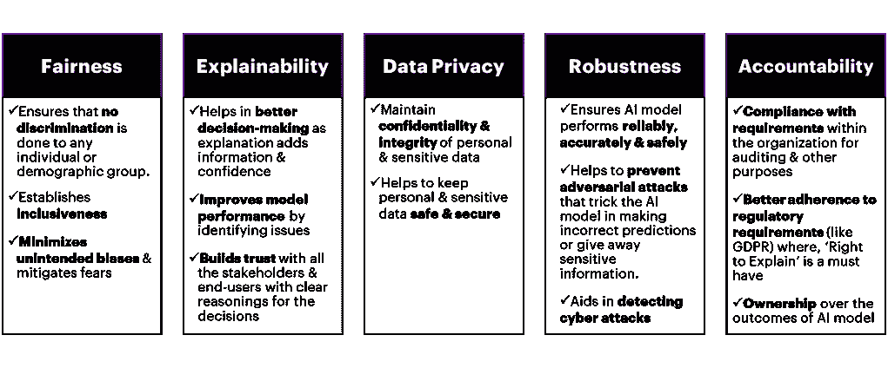
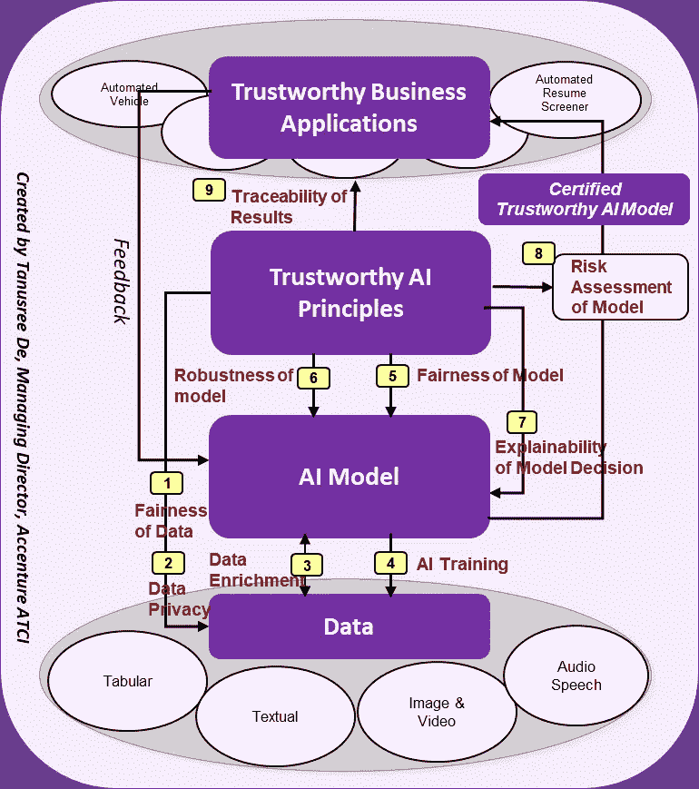
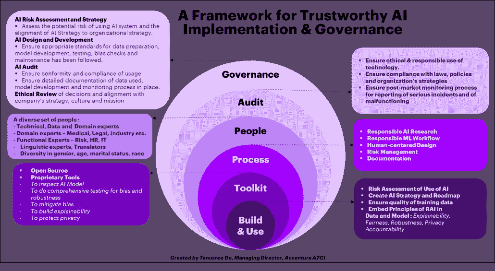

# 构建可信且可操作的人工智能的框架

> 原文：<https://towardsdatascience.com/a-framework-for-building-trustworthy-and-actionable-ai-f740b093cc17>

## *如何将人工智能的风险降至最低并加速其采用*

由[拍摄的罗布·威克斯](https://unsplash.com/@robwicks?utm_source=medium&utm_medium=referral)在 [Unsplash](https://unsplash.com?utm_source=medium&utm_medium=referral)

人工智能已经走过了漫长的道路！曾经是一些著名科幻作家想象中的幻想，如今已经无孔不入。AI 已经成为我们生活的一部分；它到处都在使用，它给我们带来了很多方便。在许多行业，人工智能驱动的认知自动化已经帮助自动化复杂的业务流程，这反过来大大提高了流程效率。人工智能系统也正在被纳入工业和政策领域的各种决策过程中。在医疗保健领域，人工智能带来了一些令人难以置信的突破。然而，在许多情况下，人工智能的使用也有潜在的风险，并且有人工智能被滥用的真实例子，无论是有意还是无意。人工智能可能存在道德问题，或安全性不足，或不安全或不保护个人隐私或敏感数据。此外，人工智能系统是一个黑匣子。它给了我们一个决定，但是它没有告诉我们这个决定背后的基本原理，它是如何做出这个决定的。由于缺乏透明度，人们很难信任人工智能系统的决策。总而言之，尽管人们意识到了人工智能不可思议的力量和好处，但他们同样担心与之相关的潜在风险。这自然要求对人工智能进行监管，并需要可信和可操作的人工智能。

**什么是 AI 监管？**

人工智能的监管是公共部门政策和法律的发展，以将道德标准纳入人工智能技术的设计和实施。

现在，如何定义 AI 的伦理标准？前提应该是什么？首要原则是确保负责任地使用人工智能。甚至在为一个用例开发一个人工智能系统之前，一个人应该分析与为那个特定用例使用人工智能相关的潜在风险和好处。根据潜在风险的程度及其产生的效益，人们应该决定在系统设计中整合一些严格的要求，以使其安全、可靠、合乎道德、透明和可靠。这正是欧盟委员会在 2021 年 4 月 21 日公布的管制人工智能的提案中提到的内容。来源:[https://eur-lex.europa.eu/legal-content/EN/TXT/?uri=CELEX%3A52021PC0206](https://eur-lex.europa.eu/legal-content/EN/TXT/?uri=CELEX%3A52021PC0206)

欧盟委员会提到，他们监管人工智能的主要目标是确保安全和遵守基本权利和联盟价值观。委员会建议采用风险为本的方法来规管认可机构，并提出三类风险，即。不可接受的风险、高风险和低或最低风险。当人工智能被用于不可接受的风险时，它应该被禁止，这是欧盟委员会的提议。

**不可接受的风险**是，如果 AI 系统对安全、生计和权利构成威胁，例如自主武器；或者如果人工智能系统操纵人类行为以规避用户的自由意志，例如，促进暴力、欢呼杀戮和鼓励未成年人危险行为的玩具，或者如果人工智能系统允许政府进行社会评分，这可能导致歧视性结果和某些群体的排斥[1]。

**高风险**是当 AI 系统用于以下情况时[1]:

1.关键基础设施(交通)->例如自动驾驶汽车。

2.教育培训->如考试评分。

3.员工的选拔、管理->简历筛选系统。

4.产品的安全组件->例如机器人辅助手术。

5.基本的私人和公共服务->如信用评分拒绝公民获得贷款的机会。

6.执法->例如评估证据的可靠性。

与上述各项相关的人工智能系统具有对健康、安全和基本权利造成有害影响的潜在风险。欧盟委员会提出了一个监管框架，对这些高风险 AI 提出了更严格的监管要求。

**低风险或最小风险**是指人工智能系统对公民权利或安全的风险最小或没有风险，例如网络搜索引擎或产品推荐引擎；或者当人工智能系统需要用户应该知道的特定透明义务时，他们正在与机器进行交互，例如聊天机器人。对于这些低风险或最小风险的人工智能，欧盟委员会已经提出了一个行为准则，由人工智能系统的个人提供商或代表他们的组织自愿制定[1]。

**高风险人工智能监管要求**

欧盟委员会对高风险人工授精提出了以下监管要求[1]:

1.**充分的风险评估和缓解系统**。

2.**数据集的高质量:**将风险和歧视性结果降至最低。

3.**透明度**:向用户提供清晰、充分的信息

4.**记录活动**以确保结果的可追溯性。

5.**高水平的健壮性、安全性和准确性**。

6.**适当的人为监督**将风险降至最低的措施。

7.**详细文件**供当局评估其合规性。

欧盟和美国开始在人工智能监管方面达成一致。国家标准与技术研究所(NIST)正在开发一个[人工智能风险管理框架](https://www.federalregister.gov/documents/2021/07/29/2021-16176/artificial-intelligence-risk-management-framework)。“该框架旨在促进创新方法的发展，以解决可信赖性的特征，包括准确性、可解释性和可解释性、可靠性、隐私性、稳健性、安全性、安全性(复原力)、减轻无意和/或有害偏见以及有害使用”。来源:[https://www.nist.gov/itl/ai-risk-management-framework](https://www.nist.gov/itl/ai-risk-management-framework)

欧盟委员会针对高风险人工智能制定的所有上述七项监管要求都符合五项**原则** **可信且可操作的人工智能**:

无论何时我们构建一个人工智能系统，它都应该具有内在的道德和可信赖性，换句话说，我们应该在人工智能系统的构建模块中嵌入公平性、可解释性、安全性、健壮性和可问责性。

**如何在商业应用中嵌入可信且可操作的 AI 原则？**

理想情况下，我们应该在人工智能生命周期的每个阶段嵌入可信和可操作人工智能的原则，如下所示。

图 1:嵌入可信商业应用生命周期的可信人工智能原理

**1。数据**是 AI 的核心。人工智能系统需要从数据中学习，以便能够履行其功能。因此，**在公平性、一致性和隐私保护方面确保培训数据的质量至关重要。**

公平是指在决策过程中，基于个人或群体的内在特征(性别、种族、肤色、宗教、残疾、民族血统、婚姻状况、年龄、经济地位等)，对其不偏不倚或没有任何偏见或偏袒。**公平性**原则对保证训练数据的质量起着至关重要的作用。

**答:训练数据的公平性**意味着数据应该代表模型将要应用到的人群。更明确地说，数据应该通过结果和敏感属性子组得到公平的表示。如果数据中存在关于敏感属性子组的偏差，人工智能模型将学习该偏差，并针对该组给出有偏差的决策，这是不可接受的。

因此，为了建立一个值得信赖的人工智能系统，在使用数据进行训练之前，检测并减轻数据中的偏差是极其重要的。有几种度量和测试用于检测数据偏差，如差异影响、Fisher 精确测试、独立性卡方测试、类别不平衡等。其需要被适当地应用以检测数据中的偏差。

类似地，存在各种偏差减轻或平衡数据的技术，例如过采样、欠采样、SMOTE 及其变体。

**b .训练数据的一致性**:训练数据质量的另一个维度是确保数据没有异常。**异常**指数据中不符合预期行为的模式。异常数据是与大多数数据显著不同的罕见或异常事件。如果训练数据中存在异常数据点，模型会学习异常行为，对数据进行过拟合；它将不能概括，并将对新数据做出不准确的预测。因此，为了建立一个值得信赖的人工智能系统，在使用数据训练机器学习模型之前，检测训练数据中的异常并将其删除或适当处理是极其重要的。有各种非监督、监督和半监督机器学习技术来检测异常，其中流行的是基于密度的技术，如 KNN、隔离森林，基于聚类的技术，如 K-Means、DBSCAN 一类 SVM、神经网络、自动编码器、隐马尔可夫模型，也可以是这些技术的组合。

**c .训练数据的隐私保护**:从可信数据& AI 的角度来看，这是数据质量的另一个重要维度。我们需要确保培训数据被适当地屏蔽、隐藏或加密，以便维护个人和敏感数据的机密性和完整性。

将可信数据和人工智能的原则应用于训练数据，一旦我们能够确认训练数据的高质量，就没有偏见、异常和保护个人或敏感信息的数据而言，它可以用于训练。

一旦我们确保了训练数据的质量，接下来最重要的事情就是在机器学习工作流的训练过程中融入**健壮性、公平性和可解释性**的原则

**2。鲁棒性**是指算法的稳定性。它意味着在新的独立(但相似)数据集上测试时，你的算法有多有效。换句话说，稳健算法是测试误差接近训练误差的算法。鲁棒性的另一个方面是“对噪声的鲁棒性”，它描述了在数据中添加一些噪声后算法性能的稳定性。这种模型稳定性是为了确保 AI 系统免受外部攻击。当有人输入错误的输入和参数，欺骗人工智能模型做出不正确的预测或泄露敏感信息时，它能够处理对抗性攻击。

**3。当人工智能用于具有影响某人的生命、健康、安全、自由、教育、职业、专业等风险的决策时，人工智能算法**的公平性至关重要。下面是一些真实的例子，人工智能系统对少数群体或历史上处于不利地位的群体做出了不公平或有偏见的决定。

a)有一种叫做 COMPAS(代表替代制裁的矫正罪犯管理概况)的商业工具，由机器学习算法提供动力，预测刑事被告重新犯罪(或累犯)的可能性。2016 年，一项将该工具的预测与实际情况进行比较的研究发现，该工具预测黑人被告的累犯风险比实际情况高，白人被告的累犯风险比实际情况低。[https://www . propublica . org/article/machine-bias-risk-assessments-in-criminal-pending](https://www.propublica.org/article/machine-bias-risk-assessments-in-criminal-sentencing)

b)微软、Face++和 IBM 分别提供了一些商业人脸识别在线服务，这些服务在确定浅色皮肤男性的性别方面显示出高得多的准确性，而在确定深色皮肤女性的性别方面显示出低得多的准确性。原因是，该算法是在高度不平衡的数据上训练的，这些数据中男性和浅色皮肤的人的图像比例过高。这些系统后来得到了改进。[https://news . MIT . edu/2018/study-finds-gender-skin-type-bias-artificial-intelligence-systems-0212](https://news.mit.edu/2018/study-finds-gender-skin-type-bias-artificial-intelligence-systems-0212)；[https://blogs . Microsoft . com/ai/gender-skin-tone-面部识别-改善/](https://blogs.microsoft.com/ai/gender-skin-tone-facial-recognition-improvement/)

c)“亚马逊用于给求职者打分的基于人工智能的实验性招聘工具并没有以性别中立的方式给软件开发人员和其他技术职位的求职者打分。原因是，该模型主要是根据男性在 10 年内提交给公司的简历进行训练的，因此该模型对简历中带有男性偏见的单词给予更多权重，并对包含“女性”一词的简历进行惩罚，如“女子象棋俱乐部队长”。[https://www . Reuters . com/article/us-Amazon-com-jobs-automation-insight-iduskcn 1 MK 08g](https://www.reuters.com/article/us-amazon-com-jobs-automation-insight-idUSKCN1MK08G)

必须确保模型中没有偏见，这样才能做出公平的决策。在模型开发的预处理、处理中或后处理阶段检测并减轻偏差。预处理意味着训练数据中的偏差，这已经在 1a 中讨论过了。处理中意味着算法偏差在训练过程中悄悄出现，这是由于在训练模型时做出的某些假设或由于应用了一些优化约束而发生的。有许多度量标准可以检测算法偏差，如均等的机会、均等的机会、人口统计上的均等等等。算法偏差可以通过各种技术来减轻，例如学习参数的正则化、调整类权重、平衡装袋、对抗性训练程序以及其他一些技术。后处理意味着在训练发生后偏差被减轻。有了模型结果的事后解释能力，就有可能查明偏差的确切原因，因此这对于伦理人工智能是至关重要的。

**4。人工智能模型决策的可解释性**是关于使“黑盒”机器学习模型的结果即使对一个天真的用户来说也是可解释和可解释的，而不管底层模型的复杂性。机器学习或深度学习模型是非常复杂的非线性模型，无法以可理解的方式解释预测背后的基本原理或如何做出决策。机器或深度学习模型的推理缺乏透明度，这被称为“黑箱”问题。有人可能会想，如果可理解性是机器学习模型的一个问题，那么为什么不使用传统的方法，如回归技术或决策树来产生更易于人类理解的模型呢？这个问题的答案是，今天，随着海量数据和高性能计算在 GPU 的帮助下变得可用，机器学习模型可以更好地利用数据来学习其中高度复杂的非线性模式和关系，并优化调整模型的参数，这减少了模型中的偏差，并显著改善了模型的性能。因此，由于它们的高性能，机器学习模型应该得到利用，但要有可解释性。引用 Pedro Domingos 教授的话，“当一项新技术像机器学习一样无处不在并改变游戏规则时，让它保持黑箱状态是不明智的。不透明为错误和误用打开了大门”。我们需要可解释性来建立对人工智能系统的信任，并在商业应用中指导下游行动。

让我们考虑一个例子。如果像神经网络预测的那样，客户的住房贷款被拒绝，贷方通常不会说这是因为你的贷款价值比、你的拖欠账户总值、你在过去六个月中的最差状态(两次或两次以上拖欠付款)、你在过去三个月中的总未偿余额、你在过去六个月中进行的贷款搜索次数、你的职业和你的信用历史长度的加权比例组合的 sigmoid 等于 0.57。即使这可能是模型决定拒绝客户的方式，贷方通常需要分解复杂的解释，并尝试用简单的术语向客户解释，使用最重要的原始输入变量-例如，声明您的贷款价值比大于 80%，这太高了，您的信用卡在过去三个月中的总未偿余额增加了，并且您是自营职业者。这种简单、易于理解的解释可以通过开发一个代理模型来实现，该代理模型近似于用于预测的经过训练的复杂机器学习模型。这个代理模型被称为可解释的 AI 模型，它是透明的，并为黑盒模型给出的预测结果提供人类可解释的解释。

对于可解释的 AI 有各种方法:全局对局部，模型不可知对模型特定的解释。所谓整体解释是指从整个模型的角度进行解释。它是关于分析特性的重要性，根据它们对模型输出的贡献。局部解释的意思是，解释理解每个单独预测背后的推理。实例级的解释通常比模型级的解释更具可操作性，因为它指导给定事务的解释和操作。例如，两个人可能有很高的贷款违约概率，但原因完全不同。

模型不可知论意味着解释者必须能够解释任何模型，也就是说，将原始模型视为黑盒。这为解释任何分类器提供了灵活性。而特定于模型的解释考虑模型的结构来导出对预测的解释。生成解释的方法并不是通用于所有种类的分类器，而是考虑到算法的内部工作过程而为每个分类器专门开发的。

实例级的解释通常比模型级的解释更具可操作性，因为它指导给定事务的解释和操作。以下是针对特定车型的本地解释的论文列表:

I)*[*可解释 AI:为深度学习预测生成人类可解释解释的混合方法*](https://www.sciencedirect.com/science/article/pii/S187705092030394X) *》，*由 ELSEVIER 在 Procedia Computer Science 发表。作者:Tanusree De、Prasenjit Giri、Ahmeduvesh Mevawala、Ramyasri Nemani 和 Arati Deo。*

*ii)*“*[*可解释的 NLP:一种为语义文本相似性生成人类可解释的解释的新方法学*](https://link.springer.com/chapter/10.1007/978-981-16-0425-6_3) *”，*由 Springer 在 Advances in Signal Processing and Intelligent Recognition Systems 中发表。作者:Tanusree De 和 Debapriya Mukherjee。*

*iii)*“*[*一个可解释的人工智能供电的早期预警系统，以解决患者再入院风险*](https://ieeexplore.ieee.org/document/9618766) *”，*由 IEEE 在 IEEE Xplore 中发表。作者:Tanusree De、Ahmeduvesh Mevawala 和 Ramyasri Nemani。*

*iv)*[*xAI 逐层算法与用于息肉分割和分类的归纳聚类的健壮推荐框架的比较研究*](https://ieeexplore.ieee.org/abstract/document/9743003) *”，*由 IEEE 在 IEEE Xplore 中发表。作者:Shiddalingeshwar Mallayya Javali、Raghavender Surya Upadhyayula 和 Tanusree De。**

****要实现可信且可操作的人工智能，需要什么？****

**在这里，我提出了我对可信人工智能实现和治理框架的观点。**

****

**图 2:实现可信人工智能的框架**

**如上所述，构建和运营可信数据和人工智能的五个关键因素是战略和路线图、工具包、流程、人员、审计和治理。**

****1。人工智能战略&路线图****

**这个旅程应该从评估使用人工智能的潜在风险开始；并根据评估创建人工智能战略和路线图，以收集正确的数据集，检查和提高训练数据的质量，并将可信数据和人工智能的原则嵌入数据和模型中，如数据偏差缓解、数据隐私保护、模型稳健性、公平性、可解释性和问责制。现在，为了实现这个策略，我们需要一套工具包。**

****2。工具包****

**基本上，这是一套资产和加速器，可以让你建立可解释性，也可以测试数据或算法中的任何偏差，并减轻它。组织正在构建各种开源工具和专有工具，这些工具基本上都是低代码/无代码平台。**

**这些工具包充当加速器，使研究人员和开发人员能够在给定的时间框架内做更多的实验；从而使他们能够更快、更好地构建值得信赖的数据和人工智能解决方案。除了工具，应该有一个定义良好的过程或工作流，开发人员应该遵循它来交付技术上合理和道德的人工智能系统。**

****3。流程:****

**有一个适当的过程和围绕它的最佳实践是非常重要的。**

****研究:**这一进程应从对现有的各种办法和方法的深入研究开始，从这些办法和方法中汲取思想，并创新和设计将产生更好结果的新办法和方法。**

**(ii) **设计:**应该采取以人为中心的方法来设计解决方案。以人类的需求、行为和目标为中心，将有助于构建更加可信、可靠、没有任何偏见的人工智能解决方案。**

**(iii)**ML 工作流的创建:**一旦设计了解决方案，就应该创建机器学习工作流，其结合了如图 1 所示的公平性、健壮性、可解释性的元素。**

**(iv) **开发:**在工作流程之后，应该使用工具包并应用最佳实践来执行解决方案开发流程。**

**(v) **模型风险评估:**一旦开发了模型，就偏差、准确性、稳健性、数据隐私、可解释性等而言，与模型相关的风险。应进行评估以最终确定模型。**

**(六)**文档:**在这整个过程中，一个非常重要的任务是详细记录设计、工作流程、数据以及所遵循的所有步骤，从数据预处理到模型训练、验证、集成、模型性能度量、性能跟踪机制、模型生命周期各阶段所做的假设、模型各种参数的阈值、模型的局限性以及相关风险等等。文件对于风险评估和人员监督措施非常重要，以便在出现潜在故障迹象时维护系统并解决任何问题。**

**开发一个健壮的、可解释的和道德的人工智能系统所需要的一切的中心是人。训练和建立人工智能系统的是人类。另一方面，AI 的最终用户也是人类。**

****4。人:****

**为了建立一个人工智能系统，我们需要不同的人，即技术、功能、数据和领域专家；我们还需要人工智能系统的潜在用户，或者至少是终端用户的代表。在设计和开发产品时，将最终用户的观点、他们的需求和要求以及他们对可用性的反馈结合起来，以使产品以人为中心并且高效，这是非常重要的。**

**例如，要建立一个人工智能驱动的疾病检测系统，你需要让医生或来自生命科学的人参与进来，他们可以提供疾病、症状、医疗参数等特定领域的知识。这需要结合到系统的训练中。医生将能够进行正确的基准测试，并提出特定领域的指标来衡量系统在培训和生产过程中的准确性和精确度。**

**同样，为法律领域建立人工智能系统，应该咨询律师；或者对于基于人工智能的考试复习，人类考官应该参与进来等等。这完全是用人类专家用来完成任务的特定知识来训练系统。**

**按照类似的逻辑，人力资源、IT、市场营销、风险和合规方面的职能专家应该参与构建人工智能系统，以解决这些职能领域的业务问题。**

**今天有许多人工智能应用程序纯粹是在海量文本数据上训练的，语言专家和翻译人员可以在为数据预处理、模型微调和验证提供有价值的输入方面发挥重要作用。**

**构建人工智能系统的团队应该在性别、种族、婚姻状况等方面具有多样性，以便不同人群的观点可以纳入人工智能系统的设计和开发中，这将减少偏见，使人工智能系统更具包容性。**

**该团队还应该有人扮演人工智能伦理学家的角色，他们可以提供人工智能道德使用的指导，帮助遵守监管规定，确保人工智能系统做出道德决策，并建立问责框架，以解决人工智能系统带来的任何意外风险。**

**一旦一个人工智能系统用正确的人员、过程和工具包建立起来，下一个最重要的任务就是审计。**

****5。审计****

**每个正在建立人工智能系统的组织都应该有一个人工智能审计实践。审计员的职责是审查和检查人工智能生命周期每个阶段遵循的标准和程序，以及对法律、政策和组织战略的遵守情况，以确保系统在技术上是稳健的、安全的、公平的、可解释的、保护隐私的，并且总体上是可靠和负责任的。**

**更具体地说，这意味着检查:**

****a .详细的文档:**人工智能生命周期的所有阶段，从数据的详细概述，到数据清理、数据过滤、应用的数据预处理，到随后的建模过程，模型信息和人工智能模型生产中涉及的工件，以及模型结果的分析。**

****b .用于设计和开发算法系统的方法:**使用了什么算法，算法是如何训练的，做了什么假设，使用了什么样的输入数据，输入数据中是否有敏感变量以及数据中是否有任何偏差被减轻以及如何减轻。**

****c .用于测试和验证算法系统的方法:**关于用于测试和验证的数据的信息。关于训练-测试差异的信息，以及模型在测试或新数据上的概括程度。在敏感属性方面是否存在过度拟合、欠拟合或偏差。**

****d .结果的可解释性:**黑箱 AI 模型的结果有可解释性吗？解释的直观性、逻辑性和可理解性如何？这些解释能在多大程度上用于决策？这对人工智能的高风险用例至关重要，如医学图像分析或疾病检测，在这些情况下，可解释性是信任模型结果并采取适当决策的必要条件。**

**审计人员还应审查数据治理和上市后监控的现有流程。**

****e .数据治理:**检查用于管理和保护公司数据资产的标准、流程和技术。遵循最佳实践以确保定期清理、更新和清除数据，从而保持数据的高质量。符合数据隐私法律法规。**

******上市后监控**:审计人员应检查，是否有一个稳健的流程来跟踪和报告严重事件和故障，以确保当 AI 系统中存在需要整改的问题时，不会不负责任地使用该系统。****

****并且，为了确保整体的一致性和法规遵从性，包括审计，必须有治理。****

******6。治理******

****人工智能治理是一个系统，用于监督组织实现如上所述的可信人工智能框架的每个元素的方式，以及它们如何确保问责制。基本上，人工智能治理需要涵盖人工智能系统的整个生命周期。应该对以下方面进行治理:****

****I)从最终用户的角度对 AI 使用进行伦理审查。****

****ii)确保符合法规要求和组织的战略、文化和愿景。****

****iii)审查模型设计和开发、模型集成、部署和维护的人工智能风险和方法。****

****iv)确保训练数据质量、数据准备方法、模型开发过程、测试模型性能和稳健性、偏差检查、模型结果的可解释性和模型维护的适当标准。****

****人工智能治理的另一个非常重要的方面是，人工智能治理不应该孤立地发生，而是应该成为组织的整体治理系统的一部分。对于有效的人工智能治理，它应该与企业、it 和数据治理相联系。例如，一个组织如何利用人工智能来促进公共利益是由公司治理决定的，与这一目标保持一致是人工智能治理的一个重要方面。同样，当 AI 算法集成到组织的信息系统中时，组织的 AI 治理和 IT 治理应该保持一致。同样，由于人工智能系统建立在数据基础上，另一方面，人工智能也被用来丰富数据，数据治理的某些方面对人工智能治理至关重要，反之亦然，两者应该协同工作。****

******结论******

****在数据和人工智能中嵌入透明度、可解释性以及道德标准和价值观是当前减轻风险、建立信任和使人工智能可操作的需要。所有这些最终都将增加人工智能在改造社会和商业方面的应用。****

****参考****

****[1]欧洲委员会，欧洲议会和理事会条例提案，制定人工智能协调规则(人工智能法案)并修正某些欧盟立法法案(2021)，EUR-Lex，****

****[https://eur-lex.europa.eu/legalcontent/EN/TXT/?uri=CELEX%3A52021PC0206](https://eur-lex.europa.eu/legalcontent/EN/TXT/?uri=CELEX%3A52021PC0206)****

****[2] E. Ntoutsia 等人，数据驱动的人工智能系统中的偏差——介绍性调查(2020 年)，arXiv，【https://arxiv.org/abs/2001.09762 ****

****[3] R. Guidotti 等人，黑盒模型解释方法综述(2018)，arXiv，【https://arxiv.org/abs/1802.01933 ****

****[4] Nicole Turner Lee 等人，算法偏差检测和缓解:减少消费者伤害的最佳实践和政策(2019 年)，布鲁金斯，[https://www . BROOKINGS . edu/research/Algorithmic-Bias-Detection-and-migration-Best-Practices-and-Policies-to-reduce-Consumer-harms/](https://www.brookings.edu/research/algorithmic-bias-detection-and-mitigation-best-practices-and-policies-to-reduce-consumer-harms/)****

****[5]大卫·J·汉德和沙克尔·汗，验证和检验人工智能系统(2020)，模式，[https://www.ncbi.nlm.nih.gov/pmc/articles/PMC7660449/#](https://www.ncbi.nlm.nih.gov/pmc/articles/PMC7660449/#)****