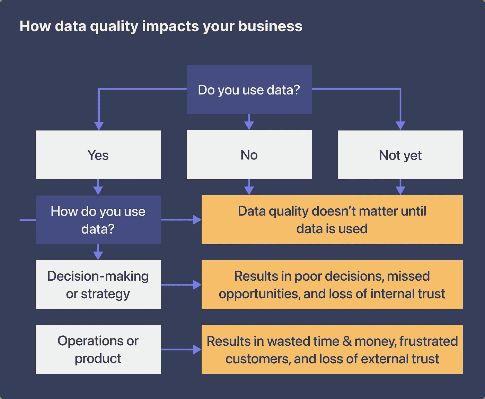

# 了解低质量数据如何损害业务绩效的框架

> 原文：<https://towardsdatascience.com/a-framework-to-understand-how-low-quality-data-hurts-business-performance-386c10c4fe1e>

图片由作者提供。

## 作为数据从业者，我们应该如何思考数据质量对我们所支持的业务的重要性和影响？

数据质量问题的具体成本因业务和垂直行业而异。但是，平均而言，[低质量的数据每年要花费组织大约 1300 万美元](https://www.gartner.com/smarterwithgartner/how-to-improve-your-data-quality) (Gartner，2021)。

这个数字应该让数据领导者(以及他们所支持的高管层领导者)刮目相看。

虽然数据质量差的负面影响可能会联合各垂直行业的数据领导者，但这些问题的原因与数据团队支持的每个产品或服务一样独特。

正如托尔斯泰所说，“每个幸福的家庭都是一样的，但每个不幸的家庭各有各的不幸。”我以同样的方式考虑数据质量。[每一个负面的商业结果都有其负面的一面。](https://www.metaplane.dev/blog/data-quality-metrics-for-data-warehouses)

作为一名数据领导者，你有责任在你的业务 KPI 和目标范围内，以一种对业务利益相关者有意义的方式将数据质量放在上下文中。毕竟，权力越大，责任越大，这包括确保低质量的数据不会损害你企业的声誉和底线。

*内在(独立于用例)和外在(依赖于用例)数据质量维度的例子。*图片由作者提供。

# 在考虑数据质量的影响时，需要考虑两件事

除了上面那个吓人的大数字，您应该如何看待数据质量对您业务的影响？答案取决于两件事:

1.  数据本身的质量:虽然完美的数据在现实世界中并不存在，但你应该能够确定什么样的数据对你的公司来说是“足够好”的。
2.  组织如何整体使用数据:没有单一的“正确方法”来使用数据。相反，您应该创建对您的独特用例有意义的数据管理最佳实践。

例如，B2B SaaS 公司中不正确的客户数据可能会导致错误，比如在错误的时间向某人发送不相关的产品推荐。这损害了你以客户为中心的声誉，从长远来看，还会损失你的收入。然而，医疗保健行业公司的不正确客户数据可能会导致开出引发致命反应的药物，严重伤害患者，引发诉讼和一系列负面宣传。

从这个例子中，我们可以看到，在一个上下文(B2B)中糟糕的数据质量是重要的，但不是致命的。换句话说，有更多的误差空间。另一方面，处理医疗数据的数据团队需要更加严格的数据质量防护。这就是说:并非所有的数据质量后果都是相同的。背景很重要。

下面，我来解释一下:

*   公司使用数据的四种主要方式
*   您可以使用三部分框架来确定数据质量如何影响您组织中的业务绩效
*   如何预防和解决数据质量问题(在它们影响您的业务之前)

# 公司使用数据的四种主要方式

大多数公司使用数据的方式有四种:忽略数据、将数据用于运营、利用数据制定战略，或者将数据作为产品出售。

除了忽略它(没有不使用数据的“好”方法)，数据质量影响所有这些方法。高质量的数据是一种竞争优势，而低质量的数据充其量是一种阻碍。让我们仔细看看这些数据的用途:

1.  **完全不使用数据。**尽管围绕“数据驱动型”组织大肆宣传(以及高质量数据提供的竞争优势)，但这种情况却出奇地普遍。根本没有不使用数据的好方法，所以这是列表中的异常值。
2.  **将数据用于作战目的。**这包括分配广告支出等内部运营和客户沟通等外部运营。高质量的数据有助于您的营销团队锁定最有可能购买的人群，有助于您的物流团队高效地运送产品，并有助于您的客户成功团队提供个性化服务，创造疯狂的粉丝。应用得好，高质量的数据可以最大化收入，同时最小化成本。
3.  **利用数据影响内部产品决策和市场策略。**拥有最佳数据的竞争对手首先获得机会。有了可靠、高质量的数据，产品团队可以跟踪趋势，并率先开发客户想要的功能。当风向改变，是时候改变航向时，他们也会有先见之明。好的数据有助于你的公司在最有利的时候采取市场行动。
4.  **将数据作为产品使用和销售。**如果你从事销售第三方数据的业务，数据质量的重要性显而易见。干净、安全、可靠的产品可提高客户满意度和忠诚度，减少法律责任，并让您站在监管机构的正确一边。

归结起来，每个垂直领域的每个业务都做三件事:花钱、赚钱、冒险。当您将数据绑定到这些活动之一时，数据的质量就变得至关重要。

如果您的企业使用数据做任何事情，数据质量会影响业务绩效。唯一的问题是怎么做。

# 一个由三部分组成的框架，用于确定数据质量如何影响您的业务

很容易看出糟糕的数据质量对其他公司的影响。

2021 年，Zillow 的机器学习算法出现问题导致[超过 3 亿美元的损失](https://edition.cnn.com/2021/11/09/tech/zillow-ibuying-home-zestimate/index.html)。大约一年前，表格行数的限制导致英国公共卫生局少报了 16000 例新冠肺炎感染病例。当然，还有火星气候轨道飞行器的经典警示故事，一艘[价值 1.25 亿美元的宇宙飞船在太空中失踪](https://www.latimes.com/archives/la-xpm-1999-oct-01-mn-17288-story.html)，原因是公制和英制测量单位之间的差异。

看到糟糕的数据质量如何影响你自己的公司可能会更具挑战性(特别是如果你试图在出现大的公共问题之前*提高数据质量)。我发现使用三部分框架来考虑数据质量很有帮助:*

1.**你根本不用数据，所以数据质量无所谓。在框架的这个层次上有两种公司——不使用数据的公司和(目前)不使用数据的公司。随着现代数据基础设施变得更加可行，以及使用数据的企业开始获得竞争优势，第一阵营的企业正在迅速减少。**

第二种方法至少有一个优点:您可以从一开始就将数据质量保证融入到您的业务数据策略中。虽然可以将数据质量保证延迟到问题发生之后，但最好开始收集相关信息以防止问题发生，并在问题(不可避免地)发生时最大化上下文。

2.**您使用数据来推动业务决策和战略，这意味着糟糕的数据质量的成本就是错误决策或失去信任的成本**。例如，低质量的市场数据可能会让你在一个中等收入不足以支撑他们的地区开设新的地点。或者，如果客户成功经理对其报告仪表板中的数据产生怀疑，那么他向高价值客户分享错误数据是合理的。

像时间一样，战略决策和信任很容易失去，也很难重新获得。如果失去了与业务利益相关者的信任，数据团队必须花费宝贵的精力来回答临时请求并建立额外的保证。如果没有重新获得信任，风险承担者开始构建他们自己的“影子”数据堆栈的情况并不罕见，这可能会完全破坏数据团队的目的。

3.您使用数据来通知业务运营或产品体验，这意味着不正确数据的成本是浪费时间和金钱或客户信任的成本。例如，不完整的客户数据会导致您的营销部门瞄准错误的买家，将广告预算花在无法转化的活动上。在最好的情况下，这会导致浪费花费和时间来纠正问题。在最坏的情况下，收到不相关或不正确信息的客户开始对公司的能力失去信任。

在最高层次上，企业的存在是为了增加收入、减轻风险和降低成本。如果您的公司使用数据来推动运营或产品，那么您就处于一个令人羡慕的位置，可以将数据直接与公司的成功联系起来。然而，权力越大，责任也越大，这意味着数据质量下降的成本现在可能与业务中的其他职能一样重要，甚至更重要。

数据质量如何影响您的业务取决于您是否使用数据以及如何使用数据。图片由作者提供。

值得注意的是，并不是所有的负面因素都有美元符号。低质量的客户数据也会损害你的声誉和关系。ParcelLab 在[进行的一项研究](https://parcellab.com/resources/2022-us-consumer-attitudes-to-online-shopping)中，近一半的受访者表示，当品牌糟糕的数据质量导致推荐他们已经购买的产品时，他们感到沮丧，近四分之一的人表示，他们永远不会再购买向他们发送不相关信息的品牌产品。

通过关注整个组织的数据质量，您降低了业务流程中错误决策的风险，这有助于您做出更明智的战略决策，取悦客户，并且[让利益相关者对基于数据的决策更有信心](https://www.metaplane.dev/blog/prioritizing-data-observability-why-now)。

***如果这篇文章引起你的共鸣，我们很乐意聊天！你可以把手伸向*** [***凯文***](https://www.linkedin.com/in/kevinzenghu/) ***，团队在*** [***元位面***](https://metaplane.dev/) ***，或者*** [***在这里预定一个时间***](https://calendly.com/metaplane/metaplane-demo) ***。***