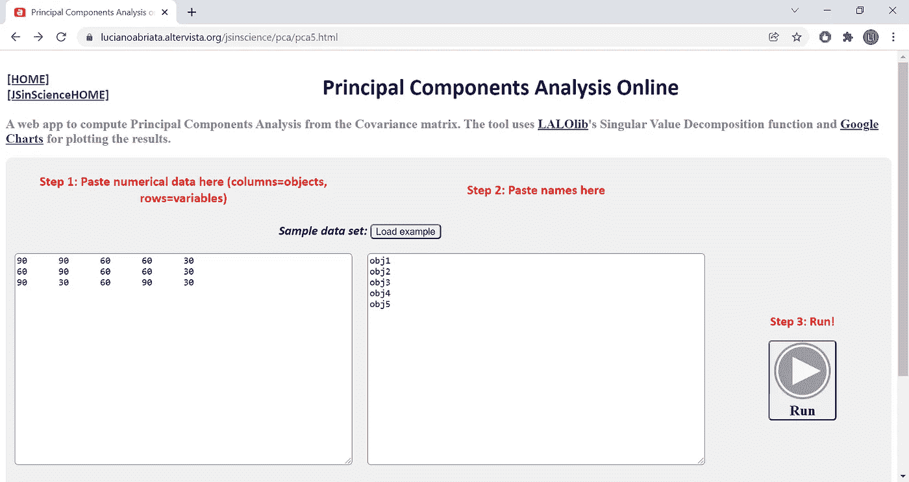
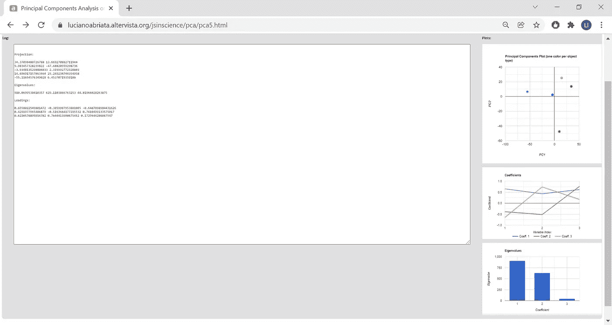
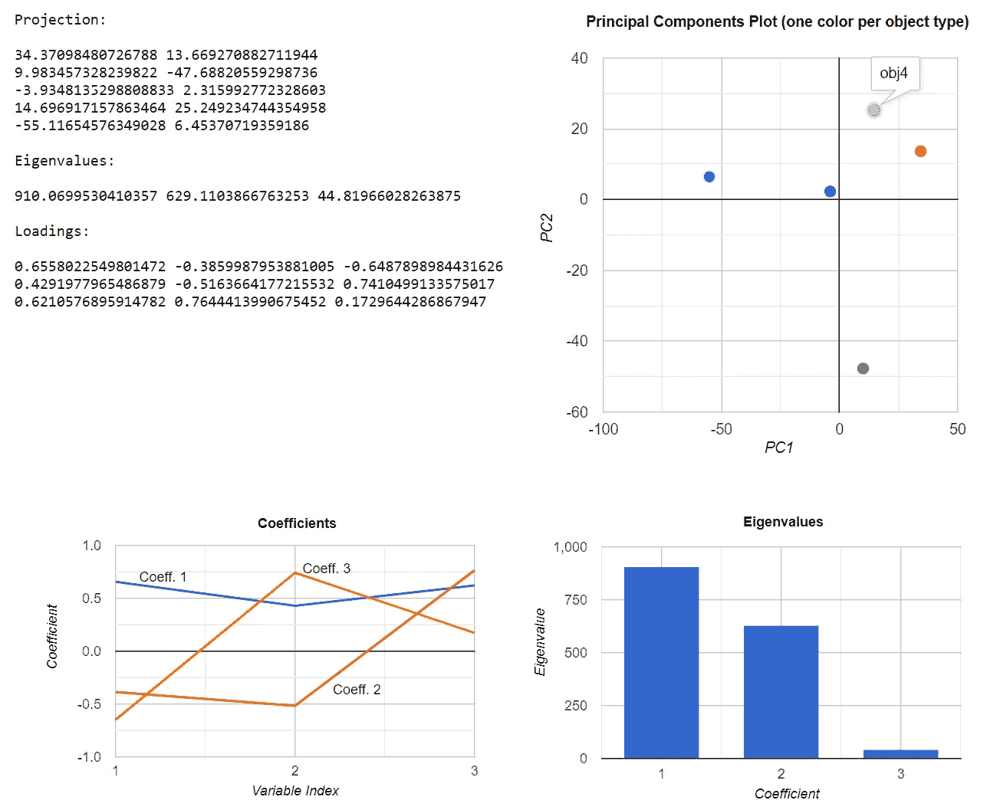
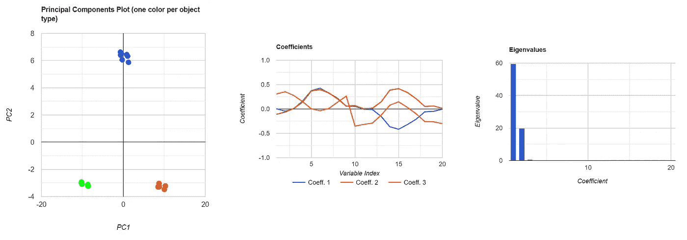
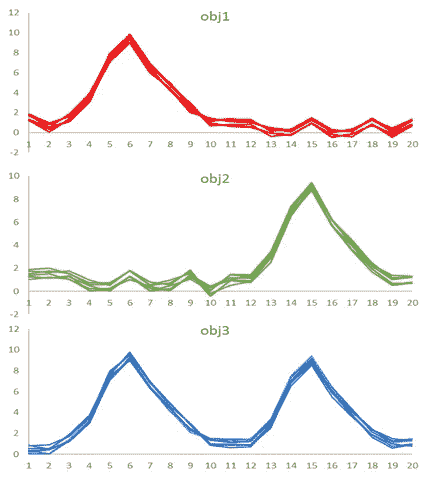

# 一个免费的在线主成分分析工具，提供完整的图形输出

> 原文：<https://towardsdatascience.com/a-free-online-tool-for-principal-components-analysis-with-full-graphical-output-c9b3725b4f98>

## 用它来理解 PCA 并应用到你的工作中

## 完全在你的浏览器上运行，你不需要下载或安装任何东西，你的数据会留在你的电脑上。该工具是完全免费的，包括两个预设的示例来帮助您了解该技术，并生成全文和图形输出。

**跳转到:** [**PCA 概括地说**](#5741) **|** [**为什么 web？**](#3861)**|**|[**web app**](#69a1)**|**[**例 1**](#b1b5)**|**[**例 2**](#2f40)**|**[**还有什么？**](#eaea) **|** [**读数**](#489c)

突然，上周有两个人对我很久以前在网上发布的一个运行主成分分析的网络应用感兴趣，并想了解更多关于这种计算是如何工作的。因此，这是对 web 应用程序进行一些更新的最佳时机，将其恢复原状，并撰写两篇文章:这篇文章介绍了该工具并展示了两个具体的示例，另一篇文章即将推出，以清晰简洁的方式解释数学和代码(有许多页面试图这样做，但没有一个让我满意，显然没有一个对联系我的人来说足够好！).

## 简单地说，主成分分析

*(向下滚动到最后以获得更多资源，或者在这里查看我的* [*描述 PCA 如何一步一步工作的新文章*](https://medium.com/p/84cd73640302) *)*

PCA 是一种用于减少数据集中的维数同时保留最重要信息的技术。为此，它将高维数据线性地投射到其变异的主要成分上，称为主成分(PC)。它可用于识别数据集的底层结构或降低其维度。

在实践中，您使用 PCA 来简化复杂数据的显示，方法是仅在 1、2 或 3 维(最常见的是在 2 维，以二维图的形式)上展开数据；找出哪些原始变量对数据集中的可变性贡献最大；还可以通过从其主 PC 重建数据集并忽略包含更多噪声的那些来去除噪声或压缩数据(例如图像);以及可能的一些其他相关应用。

我开发的 web 应用程序可以在下面的链接中免费使用，它采用一组由变量列表描述的对象，并计算这些变量的线性变换，以产生压缩信息的新变量(PCs)。PC1 将解释数据集中的大部分差异，PC2 将解释剩下的大部分差异，依此类推。web 应用程序在一个文本框中提供所有数字输出，您可以从中复制；它还产生大多数应用程序所需的三种主要图形:投影到两个主 PC 上的原始数据，显示每个原始变量对每个 PC(对于 3 个主 PC)的贡献大小的加载图形，以及测量每个 PC 解释的总方差的特征值。

## 为什么选择 web？

如果你关注我，你已经知道我是客户端 web 编程的强烈拥护者。从数字数据分析和模拟到数据废弃、文本分析和合成、加密、甚至增强和虚拟现实，我喜欢为网络浏览器编写所有这些代码。几个例子项目和阅读:

 [## 在每台设备上进行统计和数据分析的网站

### 我对网络浏览器中数据分析在线工具的选择。

towardsdatascience.com](/websites-for-statistics-and-data-analysis-on-every-device-ebf92bec3e53)  [## 交互式增强现实网络应用为科学教育带来身临其境的体验…

### 多媒体材料以独特的方式帮助教师更好地传递知识，帮助学生掌握概念。虚拟…

pub.towardsai.net](https://pub.towardsai.net/interactive-augmented-reality-web-apps-to-enable-immersive-experiences-for-science-education-dce51889473f)  [## 借助 MediaPipe 的机器学习模型，在网络浏览器中实现精致的手和手指跟踪

### 了解这个精通 JavaScript 风格的计算机视觉库，这里重点介绍它的手部跟踪工具…

towardsdatascience.com](/exquisite-hand-and-finger-tracking-in-web-browsers-with-mediapipes-machine-learning-models-2c4c2beee5df)  [## 元宇宙？不确定，但是 WebXR？太好了。

### 未来互联网的核心技术之一，我们已经将其应用于娱乐之外的领域。

medium.com](https://medium.com/age-of-awareness/metaverse-not-sure-but-webxr-hell-yes-12af5b302e08)  [## 网上虚拟现实环境中加密货币数据的实时显示

### 一种“虚拟股票交易中心”

towardsdatascience.com](/live-display-of-cryptocurrency-data-in-a-vr-environment-on-the-web-af476376d018) 

# 在线免费 PCA 的网络应用程序

**我开发的工具在**[**https://lucianabriata . alter vista . org/jsin science/PCA/PC a5 . html**](https://lucianoabriata.altervista.org/jsinscience/pca/pca5.html)

它的布局是为大屏幕设计的，但它也可能在大屏幕的平板电脑和智能手机上显示 ok。

要使用这个工具，只需进入[https://lucianabriata . alter vista . org/jsin science/PCA/PC a5 . html](https://lucianoabriata.altervista.org/jsinscience/pca/pca5.html)，然后在左边输入数据，在右边输入一些物体名称，点击 ***运行*** *。*

更准确地说，该工具执行协方差矩阵的 PCA，这是最标准的 PCA。我还有另一个对未处理的数据本身运行 PCA(实际上只是 SVD)的工具:[https://lucianabriata . alter vista . org/jsin science/PCA/PC a3 . html](https://lucianoabriata.altervista.org/jsinscience/pca/pca3.html)

**如何格式化输入的数据？**正如您在步骤 1 中看到的红色，数据是作为一个常规表格引入的，您可以从任何电子表格程序中复制粘贴。输入表的每一列是一个对象(或“观察值”，或样本)，每一行是一个变量(或“描述符”)。

例如，如果数据集包含从 400 到 800 纳米波长范围内每 1 纳米收集的 20 个样品的光谱(读取 401 个波长)，那么矩阵将有 20 列和 401 行。

**对象名是干什么用的？**当您将鼠标悬停在投影到 PC 空间的点上时，将在结果中显示对象名称。此外，名为 obj1、obj2、obj3、obj4 和 obj5 的对象被指定了特殊颜色，因此您可以使用此功能来查看不同对象在投影尺寸上的映射。例如，如果您预期有两类对象，您可以将它们称为 obj1 和 obj2，然后在投影图中分别以红色或绿色看到它们。

自然，对象名称的数量必须与数据集中对象的数量相匹配。因此，对于从 400 到 800 纳米测量的 20 个光谱的例子，你必须列出所有 20 个物体名称。(注意，如果您没有特殊的名称或标志要分配，您可以同样地调用它们，例如 obj3 以蓝色显示它们)。

## 运行和解释内置示例

当您访问该网页时，您会看到一个预加载的示例。通过点击*加载示例*可以加载更大的数据集。让我们来看看这个预加载的小例子。

预加载的示例与您可以在许多关于 PCA 的在线资源中找到的示例相同，包括我在下面留下的一些链接。它由 5 个对象组成，每个对象由 3 个变量描述。

这些对象没有先验关系或分类，因此它们被简单地标记为 obj1 到 obj5。我可以只标注相同的内容，例如 obj1 表示红色，obj3 表示蓝色。请注意，如何标记对象不会影响这里的任何计算，因为 PCA 是一种无监督的方法。

加载了此示例的应用程序如下所示:

带有预加载示例的 web 应用程序，当用户打开它时会显示该示例。这张图和所有其他图都是作者卢西亚诺·阿布利亚塔的。

当你点击 ***运行*** 时，你会得到如下结果(缩小一点以适合一个屏幕截图中的所有内容):

让我重新排列这张截图，以便更好地可视化。我现在还将鼠标悬停在 PC 图的一个数据点上，以查看那是什么对象(这里是 obj4)。

**我们如何解释这一点？**PC 图(PC1 对 PC2)将点从三维空间投影到二维空间。我们看到红色和粉红色的物体看起来最接近，这意味着它们可能是最相似的两个。接下来是蓝色；另外，我们看到它接近平均值(平均值为 0，0，因为程序将数据居中)。青色和绿色似乎是最不同的一对。

第二幅图(标题为“系数”)显示了每个变量对每个 PC 的贡献。例如，PC1(蓝色)由所有三个变量的正权重组成；PC2(红色)由来自变量 1 和 2 的一些负贡献和来自变量 3 的正权重组成。并且 PC3 包含来自变量 1 的负贡献、来自变量 2 的正贡献和来自变量 3 的小贡献。注意，积极和消极在这里并没有什么特别的意义。然而，当贡献为 0 或接近 0 时，这可能有意义；例如，变量主要贡献噪声。

第三个图显示了分解的特征值。较高的柱意味着 PC 解释了数据集中更多的总变化。通常，对于二维投影，您希望第一个和第二个组件尽可能多地解释变化(高杠),不给下游组件留下任何东西(可能是一些噪声)。这种情况在这里发生得很好，但并不总是如此，尤其是因为 PCA 受到其固有的线性性质的限制。

## 另一个例子

第二个例子包括由 20 个变量描述的 21 个对象。每个对象大概对应于 3 个类中的一个，因此命名为 obj1、obj2 和 obj3。

当你对数据集进行主成分分析时，你实际上获得了清晰的分离:

通过检查绘图中的原始数据集，其中每条曲线根据类别具有一种颜色，您可以更好地理解“系数”绘图的作用:它强调哪些变量导致对象不同，并抑制那些看起来相同的对象:

这是具有相当显著特征的合成数据:第一类对象在变量#6 附近具有单峰，第二类对象在变量#15 附近具有峰，第三类对象具有两个峰。

# 还有什么？

我们有哪些变化？像现在这样，我的程序只对数据进行均值居中。但是您可以根据输入数据表的性质，以各种方式对其进行预处理。例如，如果您正在处理跨越多个数量级的变量，那么对数变换可能会很有用。标准化(即减去每个变量的平均值，然后除以其标准偏差)也可以使输入数据更加平滑。

另一种变化是不像这里那样运行 PCA，而是按原样运行输入数据的 SVD(奇异值分解)。你可以在我做的另一个工具里做这个[。](https://lucianoabriata.altervista.org/jsinscience/pca/pca3.html)

**局限性？**与任何基于 SVD 的技术一样，计算涉及线性代数，因此 PCA 无法解析非线性关系。虽然输入数据的一些转换可能会对您有所帮助，但对于某些应用程序，您很可能需要一些其他的非线性方法。

另一个限制是我的程序的网络本质所固有的。它在处理大型数据集时效率不高，对于中等规模的数据集可能需要几秒到几分钟。对于更复杂的问题，你可能会发现使用专门的程序会更好。

# 阅读——直到我发表我的文章

我自己的逐步理解 PCA 的指南，包括低级代码，您可以在 web 浏览器中尝试、编辑和使用，以掌握 PCA 的最佳细节:

 [## 主成分分析权威指南

### 一个教程剥离低层次的代码，您可以编辑和运行在您的浏览器，以了解 PCA 一劳永逸…

towardsdatascience.com](/the-definitive-guide-to-principal-components-analysis-84cd73640302) 

这里有一些其他资源。对我来说，没有一个足够清楚地涵盖了整个事情，但是您至少可以获得一些步骤的编写良好的部分:

 [## 主成分分析-维基百科

### 实坐标空间中点集合的主成分是一系列单位向量，其中…

en.wikipedia.org](https://en.wikipedia.org/wiki/Principal_component_analysis#Computing_PCA_using_the_covariance_method)  [## 协方差矩阵

### 矩阵运算入门梯队矩阵矩阵性质矩阵逆矩阵应用附录本…

stattrek.com](https://stattrek.com/matrix-algebra/covariance-matrix.aspx)  [## 主成分分析背后的数学

### 从原始数据到主成分

towardsdatascience.com](/the-mathematics-behind-principal-component-analysis-fff2d7f4b643) 

www.lucianoabriata.com*我写作并拍摄我广泛兴趣范围内的一切事物:自然、科学、技术、编程等等。* [***成为中级会员***](https://lucianosphere.medium.com/membership) *访问其所有故事和* [***订阅获取我的新故事***](https://lucianosphere.medium.com/subscribe) ***通过电子邮件*** *(平台的附属链接，我可以免费获得小额收入)。到* ***咨询关于小职位*** *查看我的* [***服务页面这里***](https://lucianoabriata.altervista.org/services/index.html) *。或者* [***联系我这里***](https://lucianoabriata.altervista.org/office/contact.html) ***。***