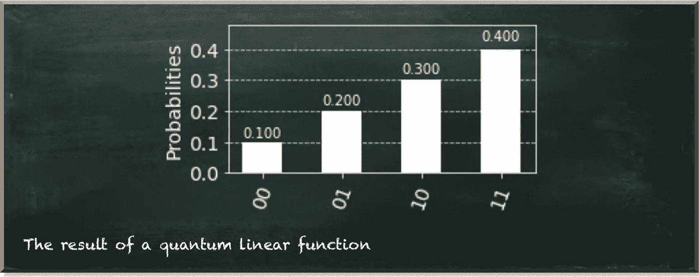
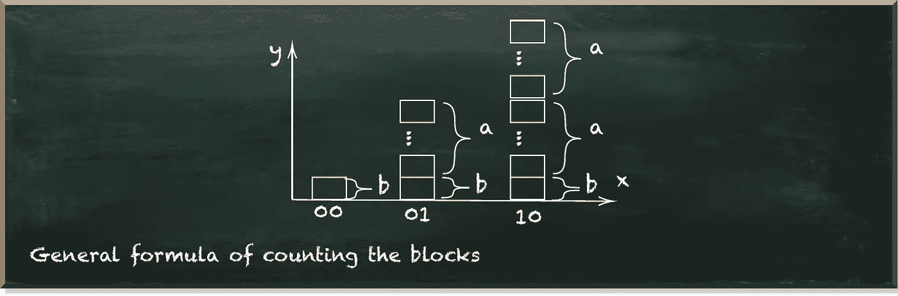
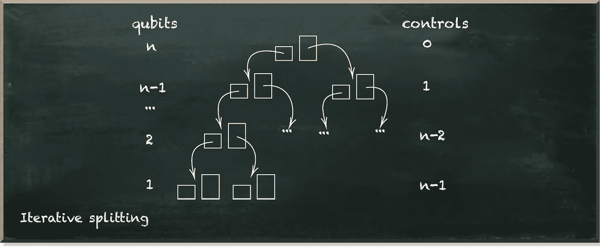
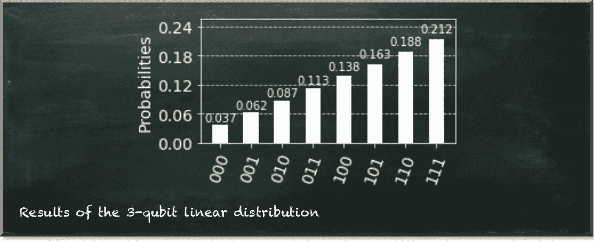

# 一个广义量子线性函数

> 原文：<https://towardsdatascience.com/a-generalized-quantum-linear-function-e73b6b7c3c80>

# 一个广义量子线性函数

## 了解量子数据科学的基本构建模块

量子机器学习要不要入门？看看 [**动手量子机器学习用 Python**](https://www.pyqml.com/page?ref=medium_genlin&dest=/) **。**

上周，[我们开发了我们的算法来创建一个量子线性函数](/towards-a-generalized-quantum-linear-function-f682d572ee19)。它获取斜率和截距，并相应地准备量子位测量概率。但是，目前的版本只适用于两个量子位。

**在今天的帖子中，我们将该函数推广到任何数量的量子位。**

但首先，让我们简单地看看算法如何对两个量子位产生以下结果。

作者图片

我们把所有的值分成相等的块。在最简单的情况下，块的大小代表斜率和截距(当斜率=截距时)。

然后，第一个状态(00)有一个块(因为我们把这个状态解释为值 0)，两个后续状态相差一个块。我们每走一步就增加一个模块。下图描述了这种方法。

作者图片

当然，我们不能假设斜率和截距相等。因此，我们可能需要使用更小的块。那么，斜率(即 a)和截距(即 b)可能由多个块组成。但是总的方法保持不变。在下图中，我们使用单个块作为截距(b)，多个块作为斜率(a)。状态 00 只有拦截块。然后，我们根据坡度添加相应数量的块。

作者图片

所以，我们的任务由两个要点组成:

*   计算一个州应该拥有的街区数量
*   准备量子位元，让状态的测量机率代表对应的数字

第一项任务相当容易。如果我们知道状态的位置，那么块的数量对应于这个位置乘以代表斜率的块加上代表截距的块。在 Python 代码中，该函数是一行程序。

第二个任务稍微复杂一点。但也没那么难。

当我们看状态数时，我们看到它们是位串。每个位置表示相应量子位的值。例如，右边的数字代表最低量子位的值(在电路的位置 0)。相应地，左边的数字代表最高量子位的值。在两个量子位的电路中，这些都是我们拥有的量子位。但是，同样的逻辑适用于具有任意数量量子位的电路。

因此，我们从最高量子位开始，根据总块数划分状态，如下图所示。

作者图片

我们通过使用 RY 门来实现这一点——围绕量子位的 Y 轴旋转。

由于这个门需要一个角度，我们需要将概率(上半部分的块数与下半部分和上半部分之和的总块数之比)转换成相应的角度。这就是`prob_to_angle`函数的作用。

接下来，我们只看这些上量子位为 1 的状态。然后，我们拆分这些状态，并计算块数。

作者图片

我们通过一个受控的 RY 门来实现这一点。这只适用于控制量子位为 1 的情况——因此只适用于上半部分。请注意，upper 和 lower 的值现在必须只代表子集。

我们对上量子位为 0 的这些状态做同样的事情，把它封装到 X 个门中。对于给定的量子位，X 门翻转 0 和 1。

对于两个量子位的电路，我们现在完成了。如果我们有更多的量子位，我们将需要进一步前进，直到我们遍历所有的量子位。下图描述了此过程。

作者图片

在最顶层，我们将量子位分成两块。在下一级，我们将这两个块中的每一个分成另外两个块。为了只考虑各自的部分，我们增加了上面的量子位作为控制量子位。随着每一层的深入，我们需要添加上层量子位作为控制。这意味着我们基本上使用多重控制的 RY 门。

所以，我们需要的是一个遍历所有层次的函数。当然，有无数种方法可以实现这一点。因为我喜欢递归(调用自己的函数)，这里是我的方法。

在我们程序的顶层，我们定义基本常数，创建一个`QuantumCircuit`和一个`QuantumRegister`，调用`split`函数，并执行电路。

所有神奇的事情都发生在 split 函数中，该函数有三个参数:

*   `current`量子位是量子位在电路中的位置，
*   `offsets`是所有为 1 的父量子位的列表，
*   `controls`是所有父量子位的列表。

通过`split(QUBITS-1, [], [])`调用函数让我们从最高量子位开始，没有父量子位。

那么，让我们来看看函数。

首先，我们计算一些我们需要的值。`middle`表示当前量子位所跨越的区间的中心位置。例如，我们从第三个量子位(位置 2)开始。因此，`middle`就是 2^{2+1}/2=8/2=4.这有助于我们决定在哪里分裂国家。

`offset`是`offsets`列表中所有位置的平方和。由于当前为空，因此`offset`为 0。

现在，我们计算放入下半部分的所有状态的块，我们计算放入上半部分的那些。如上所述，`middle`作为`lower`的结束和`upper`部分的开始。我们现在忽略偏移量，因为它是 0。因此，`lower`包含状态 0 到 3 的块，而`upper`包括状态 4 到 7。

下一步，我们添加量子门。在第一次迭代中，`controls`列表为空。因此，我们直接跳到 RY 门。然后，我们将`current`量子位旋转一个角度，该角度代表上部块除以总块的比率给出的概率。

最后，由于`current`大于 0，我们调用 split 函数两次。我们将`current`减 1，因为我们想处理下一个更低的量子位。在这两个调用中，我们将`current`添加到`controls`的列表中。这两个调用之间唯一的区别是，我们在第二个调用中将`current`添加到了`offsets`列表中。

所以，让我们看看第二次调用`split`时会发生什么。我们叫它像`split(1, [2], [2])`。

`middle`现在设定为 2^{1+1}/2=2.现在的偏移量是 2^2=4.这是我们的起点，因为在这个迭代中，我们只处理状态的上半部分(4-7)。当我们计算`lower`时，我们从位置 4 开始计算块数，并在位置 4+2=6 之前结束。鞋帮从位置 6 开始，刚好在位置 8 之前结束。

这一次，我们在`controls`中有了一个量子位。我们循环遍历这个列表。但是由于这个元素也在`offsets`列表中，我们不应用 X-gate。

此外，这一次，我们应用多控制 RY ( `mcry`)门，而不是 RY 门。`controls`列表中的所有位置都用作控制。因此，只有当这些位置的量子位是 1 时，我们才应用旋转。在我们的例子中，如果位置 1 的顶部量子位是 1，我们只应用旋转。这仅意味着第四至第七个州。

我们再次调用分裂函数，这次是针对位置 0 的量子位。这里第一个叫`split(0,[2], [2,1])`。我们将当前的量子位(位置 1)添加到控制中，但没有添加到偏移中。

因此，当我们研究这个迭代时，`offset`与之前的(=4)相同。但是由于`current`位置现在是 0，`middle`就不同了。现在，我们把状态 4 和状态 5 分开。

现在主要的区别是我们在`controls`列表中有一个条目不在`offsets`列表中。这是位置 1。因此，在应用多控制 RY 门之前和之后，我们在这个量子位上应用 X 门。这意味着我们只想对位置 1 的量子位为 0 的情况应用旋转。

最后，让我们来看看运行这条电路的结果。

作者图片

# 结论

线性函数可能是孩子们在高中遇到的第一个函数。然而，在量子电路中对付它们需要这样或那样的技巧。在你掌握量子机器学习的过程中，你会发现很大一部分工作实际上是经典的问题解决。

量子机器学习要不要入门？看看 [**动手量子机器学习用 Python**](https://www.pyqml.com/page?ref=medium_genlin&dest=/) **。**

在这里免费获得前三章。