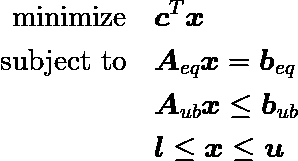
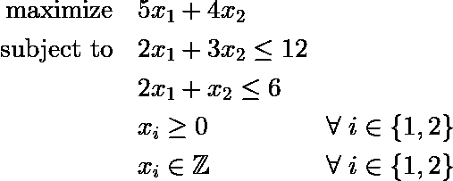
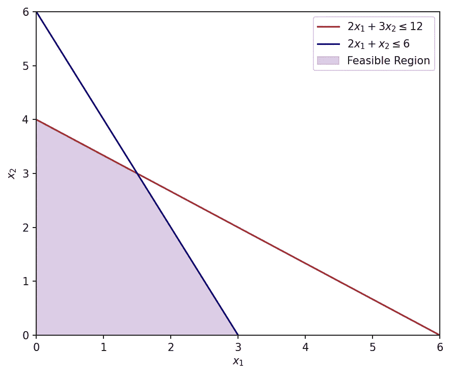
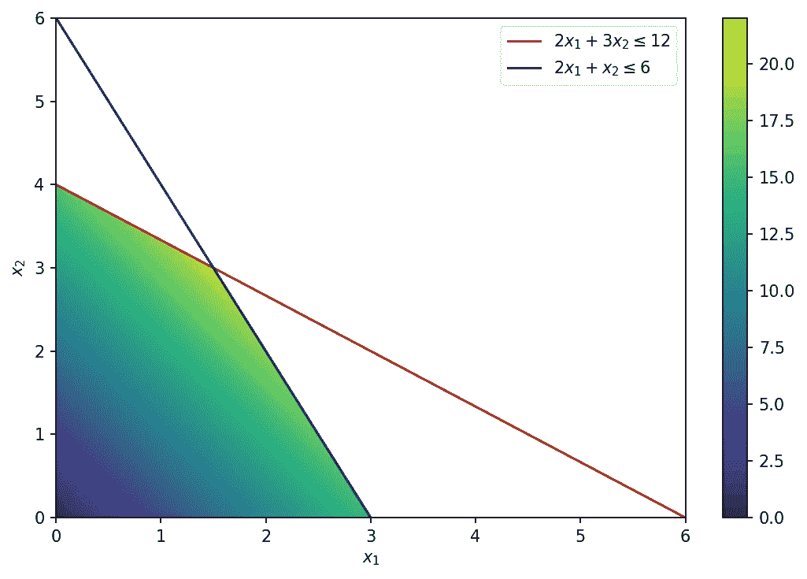
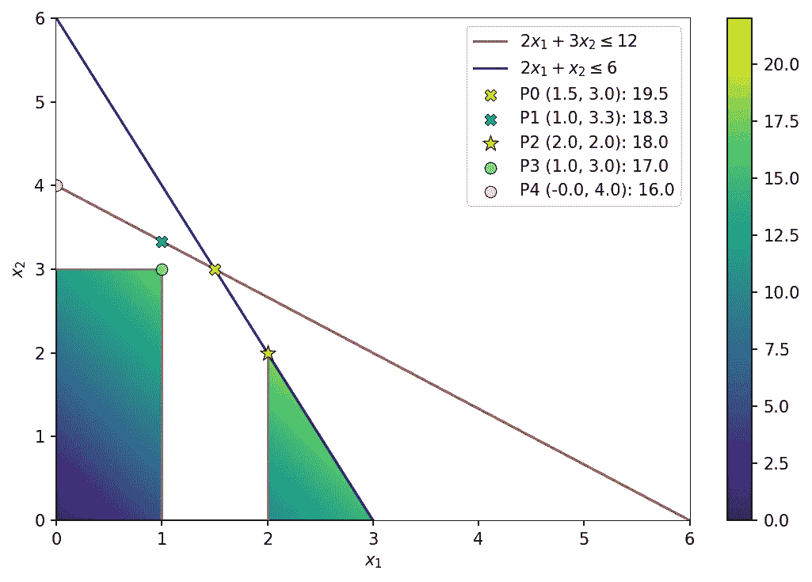
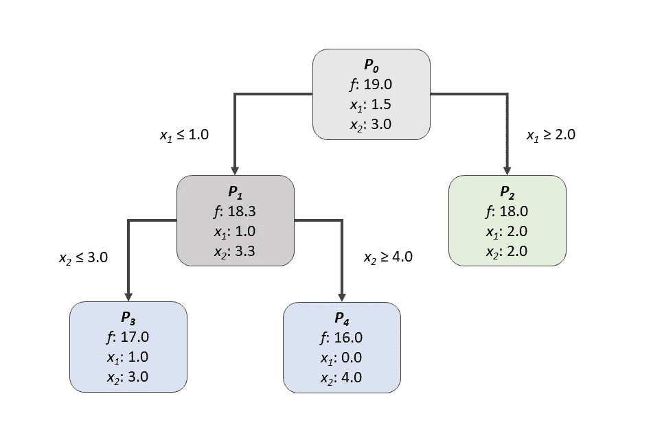

# 分支和绑定的简单介绍

> 原文：<https://towardsdatascience.com/a-gentle-introduction-to-branch-bound-d00a4ee1cad>

## 用 Python 解释的最基本的整数和混合整数编程算法


维克多·塔拉舒克在 [Unsplash](https://unsplash.com?utm_source=medium&utm_medium=referral) 上拍摄的照片

数值优化问题是定量决策过程中的一个基本工具。假设一个系统可以用一组数学方程来描述，这些方程充分包含了决策变量对目标和约束的影响。在这种情况下，可以使用优化算法来搜索那些产生最佳可能结果的决策变量的值。

描述决策变量如何影响目标和约束的非线性函数的存在与否被用来将优化问题分成两大类:*线性和非线性规划*。管理科学和运筹学广泛使用线性模型，而非线性规划问题往往在物理科学和工程中自然出现(Nocedal & Wright，2006)。在本文中，重点将放在线性模型上。

在某些问题中，决策变量只采用整数值是有意义的。例如，在人员调度问题中，将 2.57 名员工分配到一个班次是没有意义的；或者在车辆路径问题中，人们不能选择从 *a* 到 *b* 走半条路线。这些问题被称为整数或混合整数问题。

在实践中，这些问题中的大多数都是通过结合了实值算法和其他策略的分支定界算法来解决的，例如切割平面、定价和定制试探法。因此，理解 Branch & Bound 如何工作可能有助于我们深入了解如何将其与其他策略相结合，并在解决复杂问题时更好地制定问题。

在本文的第一部分，我们将看到如何用一个两变量问题的可视化例子来描述一个线性规划问题。在接下来的部分中，将对同一问题应用逐步分支定界算法来获得最优整数解。整篇文章中使用的所有代码都可以在这个 [*示例笔记本*](https://github.com/bruscalia/optimization-demo-files/blob/cd9cd8d84b44637e6f7a1b8473b4a2154da95dfd/mip/branch_and_bound/graphical_example.ipynb) 中找到。

# 线性规划问题的定义

当公式化优化问题时，必须定义一个目标，该目标是向量决策变量 ***x*** 的函数，并且可能受到一些等式和不等式约束，这些约束也是 ***x*** 的函数。该目标可以定义为*最小化*或*最大化*，尽管前者是最常见的。注意，通过简单地乘以一个*最大化*目标的系数 *cᵢ* ，它可以在一个*最小化*的意义上被重新公式化。

在线性问题中，决策变量空间必须以某种方式受到限制。否则，决策变量将根据目标函数收敛到正的或负的无穷大值。约束可以由平等或不平等关系来表述。它们通常在问题矩阵中被表示为行。请注意，通过添加非负的松弛变量，不等式约束可能被公式化为等式约束。然而，贯穿本文，让我们区分等式约束矩阵 *A_eq* 和不等式约束矩阵 *A_ub* 。

***x*** 的每个分量的上下边界在公式中可能是明确的，这减少了搜索空间。按照惯例，由于求解技术的原因，决策变量的下限通常默认等于零。这导致了如下的一般问题公式。



线性问题。(图片由作者提供)。

让我们考虑一个数字例子来说明这些概念。



例题。(图片由作者提供)。

可行空间是决策变量空间中所有约束都有效的区域。请注意，在某些情况下，约束之间可能是不一致的。假设我们有一个约束 *x₁* + *x₂* ≤ 2，另一个 *x₁* + *x₂* ≥ 3。在这种情况下，问题将被认为是不可行的。然而，在前面定义的数值例子中，我们可以如下直观地表示可行空间。



线性规划实例的可行空间。(图片由作者提供)。

当我们在考虑一个最大化问题时，我们期望在约束所建立的限制内出现最佳解决方案。让我们想象一下目标函数是如何在决策空间中通过等高线图来评估的。



可行空间中目标函数值的图形表示。(图片由作者提供)。

正如我们所看到的，目标的最大值预计出现在两个约束的交集处。在这种情况下，两者都被认为是活动约束。

为了在 Python 中解决这个问题，我们将使用来自 *scipy.optimize* 的 *linprog* 函数。注意，在 *scipy* 标准形式中，它将被描述为一个最小化问题，将目标系数乘以-1。

```
import numpy as np
from scipy.optimize import linprog

c = np.array([-5.0, -4.0])

A_ub = np.array(
    [[2.0, 3.0],
     [2.0, 1.0]]
)

b_ub = np.array([12.0, 6.0])

sol_relaxed = linprog(c, A_ub=A_ub, b_ub=b_ub)
```

这将返回一个具有以下属性的解决方案对象:

*   *x*:【1.5，3.0】
*   *乐趣* : -19.5

在这个解决方案中， *x₁* 有一个分数值，这在某些实际情况下是不可行的。如果我们需要所有变量都取整数值，我们可能已经在 *linprog* 函数中声明了这个条件(至少从 *scipy* 版本 1.9 开始)。

```
sol_int = linprog(c, A_ub=A_ub, b_ub=b_ub, integrality=np.ones(2))
```

这将返回一个具有以下属性的解决方案对象:

*   *x*:【2.0，2.0】
*   *乐趣* : -18.0

请注意，目标值现在比在宽松的公式中更差，因为由于完整性约束，可行空间已经减少。我们可以说，问题的松弛形式的解必然是整数解的最优性极限。为了理解下一节中的分支定界算法，让我们首先建立一个简单而有意义的规则。

> 如果求解一个纯 IP(整数规划)的 LP(线性规划)松弛，得到一个所有变量都是整数的解，那么 LP 松弛的最优解也是 IP *的最优解(Winston & Goldberg，2004)。*

现在让我们深入研究完整性约束。

# 完整性与分枝定界算法

如前所述，如果在松弛形式的线性问题的解决方案中，所有完整性约束都是有效的，则该解决方案对于整数或混合整数问题也是最优的。让我们考虑一下，在上一节的同一个例子中，x₁*和 x₂*都需要是整数。在这种情况下，我们可以应用分支&定界算法来寻找它的最优整数解。**

找到最优整数解的第一步是在前面的部分中执行的，因为我们找到了问题的松弛形式的解。为了应用分支定界算法，我们现在必须在松弛解 *x₁* 的分数变量中划分可行空间。

请注意，在大多数现实世界的问题中，很可能会遇到中间解决方案中有多个整数变量是分数的步骤。然后可以使用几种试探法来定义分支哪个变量。例如，对具有最大经济重要性的分数值变量进行分支通常是最佳策略(Winston & Goldberg，2004)。在我们的简单例子中，这个决定很简单，因为只有一个变量是分数。

然后从前面的问题中产生两个子问题，因此，在这两个子问题中，1 < *x₁* < 2 都不是有效解。

*   P1:新约束 *x₁* ≤ 1 的原问题。
*   P2:新约束 *x₁* ≥ 2 的原问题。

所有已经创建的子问题的显示被称为*树*。每个子问题被称为*树*的*节点*，连接树的两个节点的每条线被称为*弧*。与*树*的任何*节点*相关联的约束是 LP 松弛的约束加上与子问题 1(原始问题)到该节点的*弧*相关联的约束。(温斯顿&戈德堡，2004)。在这种结构中，没有完整性限制的原问题通常称为*根节点*。在这里，我采用了指数 0 来标识它。

在本例中，到目前为止我们已经:


分数决策变量分支产生的根节点和子问题的树表示。(图片由作者提供)。

在 Python 中，它可以用下面的公式表示。

```
# P1:
A_ub_p1 = np.vstack((A_ub, np.atleast_2d([1.0, 0.0])))
b_ub_p1 = np.append(b_ub, np.floor(sol_relaxed.x[0]))

# P2:
A_ub_p2 = np.vstack((A_ub, np.atleast_2d([-1.0, 0.0])))
b_ub_p2 = np.append(b_ub, -np.ceil(sol_relaxed.x[0]))
```

也有几种策略来选择先解决哪个子问题。一种替代方法是使用*后进先出*策略，该策略规定最近创建的子问题应该提前解决。然而，它仍然没有定义如何定义同时产生的两个子问题之间的优先级。在这个例子中，为了便于说明，我们将在 *P2* 之前任意求解 *P1* ，但是在从 *P1* 产生的子问题之前求解 *P2* 。

```
sol_p1 = linprog(c, A_ub=A_ub_p1, b_ub=b_ub_p1)
```

现在我们有了另一个分数解[1.0，3.3]，目标值为 18.33，这显然比松弛解更差。由于 *P2* 尚未求解，19.5 仍然是整数解可能呈现的最佳值。让我们将此表示为*“最佳约束”*。

接下来，让我们解决 *P2* 。

```
sol_p2 = linprog(c, A_ub=A_ub_p2, b_ub=b_ub_p2)
```

现在我们得到了目标值为 18.0 的第一个整数解[2.0，2.0]。从视觉上看，到目前为止的问题是这样的:


在根节点上分支后的部分结果。(图片由作者提供)。

注意，当在一些决策变量上分支时，产生的一个或两个子问题可能是不可行的。在这种情况下，对该节点不再感兴趣，必须选择另一个节点进行探索。如果节点的部分解决方案具有比先前找到的最佳整数解决方案更差的目标，也会发生同样的情况。

由于现在已经研究了从*根节点*导出的两个子问题，我们知道最佳整数解不会比 18.0(我们当前的最佳整数解)差，也不会比 18.33(最佳界限)好。然后让我们从对应于 *P1* 的节点创建子问题，看看我们是否可能克服 18.0。由于在 *P1、*的解中只有 *x₂* 假定为分数值，让我们分支在 *x₂* 上。

*   P3: *P1* ，新约束*x2*≤3。
*   P4: *P1* ，新约束*x2*≥4。

在 Python 中，

```
# P3:
A_ub_p3 = np.vstack((A_ub_p1, np.atleast_2d([0.0, 1.0])))
b_ub_p3 = np.append(b_ub_p1, np.floor(sol_p1.x[1]))

# P4:
A_ub_p4 = np.vstack((A_ub_p1, np.atleast_2d([0.0, -1.0])))
b_ub_p4 = np.append(b_ub_p1, -np.ceil(sol_p1.x[1]))
```

这两个问题都导致整数解，[1.0，3.0]和[0.0，4.0]，尽管它们都比从 *P2* 得到的结果差。因此，我们已经证明了它的最优性，因为树被完全探索并且没有找到更好的整数解(也不可能找到)。并且我们可以通过下图直观的表示出来。



子问题 P1 分支后的最终结果。(图片由作者提供)。



分支定界最终结果的树形表示。(图片由作者提供)。

# 进一步阅读

有几种类型的问题可以使用数学建模来解决，其中一些是更常见的公式。有兴趣了解更多关于如何用数学表达式描述一些常用规则的人可以参考 Winston & Goldberg (2004)。对于整数规划算法的深入理解，大概 Wolsey (2020)是最好的参考。

很可能，为了描述现实世界的问题，应该使用某种代数建模语言(AML)。Pyomo (Bynum et al .，2021)是一个有趣的 Python 替代品，因为它是开源的，并且与几个解算器兼容。你可以在我之前的一篇关于多维背包问题的文章中看到一个简单的例子。

</an-introduction-to-mixed-integer-linear-programming-the-knapsack-problem-1445452a9fe9>  

其他问题无法用线性表达式描述，比如工程设计、金融建模、曲线拟合等。与线性优化问题相比，它们导致非常不同的解决技术。解决它们最常用的替代方法是使用一些经典的凸非线性规划算法，我在另一篇文章中介绍过。

</nonlinear-programming-theory-and-applications-cfe127b6060c>  

然而，有时这是不够的，因为人们可能会追求多个目标，或者问题违反了一些凸算法的假设。然后，人们应该求助于其他的解决技术，其中元试探法非常有用。Pymoo (Blank & Deb，2020)是这样做的一个令人惊讶的替代方案，因为那里有几个这样的算法。

最近我发表了 Python 库 [*pymoode*](https://github.com/mooscaliaproject/pymoode) ，这是我在整个苯乙烯[反应器优化项目](https://doi.org/10.1016/j.ces.2022.118196) (Leite et al .，2022)中开发的 *pymoo、*的扩展。你可以在另一篇文章中找到完整的教程。

</pymoode-differential-evolution-in-python-78e4221e5cbe>  

我打算很快将 *pymoode* 算法完全整合到 *pymoo* 中，但是现在，它们是作为一个单独的包提供的。

# 结论

在整篇文章中，线性整数规划的基本概念是通过分支定界算法的概述来介绍的。一个简单的问题被用来一步一步地用图形说明解释算法。读者可以在[示例笔记本](https://github.com/bruscalia/optimization-demo-files/blob/cd9cd8d84b44637e6f7a1b8473b4a2154da95dfd/mip/branch_and_bound/graphical_example.ipynb)中获得所使用的完整 Python 代码。

# 参考

Blank，j .和 Deb，k .，2020 年。pymoo:Python 中的多目标优化。 *IEEE 访问，*第 8 卷，第 89497–89509 页。

拜纳姆，马丁等人，2021。*pyo mo-python 中的优化建模。*施普林格。

莱特，b，科斯塔，a，科斯塔少年，e，2022。基于广义差分进化算法 3 的绝热苯乙烯反应器多目标优化。化学。英语。Sci。 118196。doi:[10.1016/j . ces . 2022.118196](https://doi.org/10.1016/j.ces.2022.118196)。

Nocedal，j .和 Wright，S. J .，2006 年。*数值优化。第二版。纽约:斯普林格纽约。*

温斯顿，W. L .和戈德堡，J. B .，2004 年。运筹学:应用与算法。第 4 版。加州贝尔蒙特:汤姆森布鲁克斯/科尔贝尔蒙特。

2020 年洛杉矶沃尔西。*整数编程。第二版。约翰·威利的儿子们。*