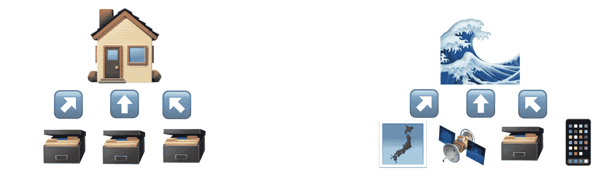
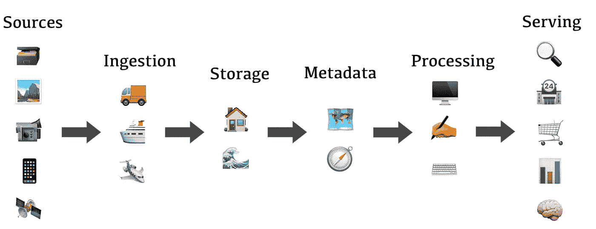

# 数据湖之家简介

> 原文：<https://towardsdatascience.com/a-gentle-introduction-to-data-lakehouse-fc0f131f90ff>

埃伯哈德·🖐·格罗斯加斯泰格在 [Unsplash](https://unsplash.com?utm_source=medium&utm_medium=referral) 上拍摄的照片

# 介绍

*数据湖库*是一种新的数据架构，在过去的几年中被提及了很多。它的提出是为了解决老的、成熟的数据架构，即数据仓库和数据湖所面临的难题。在本文中，我们将深入探讨这种新的架构，看看它背后的动机是什么，以及它的整体外观。

***免责声明*** *: Data Lakehouse 是一个相当新的概念(白皮书发布于 2021 年)。目前还没有一个被普遍接受的架构和定义。本文所写的内容都是基于作者的研究和解读。它可能与其他来源不同。*

# 背景

在讨论 Data Lakehouse 之前，了解数据架构的前景很重要，因为这将帮助我们理解我们面临的问题以及为什么需要新的架构。

# 数据仓库

数据仓库是一个系统，公司在其中保存他们的数据，以便创建报告和可视化来支持数据驱动的决策。来自相关关系数据库的数据在被放入单个位置之前被连接并转换成被称为[*星形模式*](https://en.wikipedia.org/wiki/Star_schema) 的明确定义的结构，以使读取尽可能高效和无缝。

# 数据湖

数据湖是一个存储库，组织在其中存储来自各种数据源的大量数据以备后用。与数据仓库不同，数据通常按原样存储在数据湖中，这意味着它还支持半结构化数据(XML 和 JSON)和非结构化数据(文件、图像、视频、时间序列等)。).数据湖的使用主要是高级分析，如研究、数据科学和机器学习，它们有能力处理杂乱和非结构化的数据。

数据仓库 vs 数据湖(图片作者提供)。

# 数据湖和数据仓库的问题

数据湖和数据仓库就像阴阳两极。一个擅长另一个不擅长的，反之亦然。数据湖可以处理大量的数据类型，包括图像和视频，数据仓库对这些格式一无所知。但是，当谈到服务，这是一场噩梦。性能非常差，因为数据不是结构化的，提取相关数据的流程过于复杂，因为数据没有经过预处理，等等。另一方面，数据仓库在服务方面是一头野兽，因为数据已经为此做好了准备。但是，它的用途非常有限，因为数据必须在预定义的模式中，而且它是预先转换和聚合的，所以如果需要，您无法更深入地研究它。

除了数据湖之外，公司通常通过构建数据仓库(或任何其他数据服务)来规避上述问题，然后定期在那里 ETL 相关数据以获得两者的最佳效果。然而，随着数据的不断增长和演变，这种方法由于成本、复杂性、可靠性和陈旧性而开始变得低效。因此，引入了 ***数据仓库*** 的概念。

# 数据仓库

数据湖库的关键概念是将数据湖与所有数据服务连接起来。湖边小屋建筑由以下 5 层组成:

数据湖房屋架构(图片由作者提供)。

*   ***数据源***任何可能是数据源的东西，如数据库、用户设备、物联网设备和应用程序日志。
*   ***摄取层***将数据摄取到系统中，并使其*可用*，例如将其放入有意义的目录结构中。
*   ***存储层***为海量数据提供持久、可靠、可访问、可扩展的存储。在 Lakehouse 体系结构中，数据仓库和数据湖共享存储以避免相同数据的副本。
*   ***元数据层***为存储中的结构化和非结构化数据提供元数据，使其易于被用户发现，并跟踪数据模式(如果存在)版本。
*   ***处理层***通过数据清洗、验证、规范化、反规范化、浓缩，将数据转换成可消费的格式。
*   **服务层**
    为所有使用数据目录的用户提供访问存储在湖边小屋中的所有数据的组件。

数据湖库与双层湖+仓库模型的主要区别在于，湖和仓库是集成的，这意味着不再需要移动数据。元数据层是架构的核心，因为它统一了处理层和服务层的数据(结构化和非结构化)消费。

数据仓库最大的挑战可能是查询性能优化。由于数据不是严格的和结构良好的，它如何能像数据仓库一样达到最先进的查询性能？造成这一挑战的因素有几个，例如是否应该转换数据，什么是可接受的延迟，以及有什么资源可用。所以，在这方面没有放之四海而皆准的解决方案。

# 结论

数据湖之家的想法非常吸引人。拥有一个像数据仓库一样快速有效的一体化数据平台，同时还拥有数据湖的灵活性，这将给任何组织带来巨大的竞争优势。然而，这个概念仍然是相当新的和不断发展的。因此，这可能需要一段时间来看看是否能成为主流。湖边小屋建筑的发展方向是我们都应该感兴趣的。

# 参考

[1] M .阿姆布鲁斯特，A .古德西，r .辛，m .扎哈利亚，[莱克豪斯:统一数据仓库和高级分析的新一代开放平台](http://cidrdb.org/cidr2021/papers/cidr2021_paper17.pdf) (2021)，创新数据系统研究会议(CIDR) 2021

[2] P. Kava 和 C. Gong，[在 AWS](https://aws.amazon.com/blogs/big-data/build-a-lake-house-architecture-on-aws/) (2021)上建立一个湖屋建筑，AWS 大数据博客

[3] A. Tavakoli-Shiraji，[发现数据湖屋](https://www.youtube.com/watch?v=JRW70f4CqG8&t=1264s) (2022)，数据+AI 世界巡回赛虚拟训练

[4] A. Ghosdi，[实现数据仓库的愿景](https://www.youtube.com/watch?v=g11y-kJHr3I) (2020)，Databricks

[5] Databricks，[什么是 Data Lakehouse？](https://databricks.com/glossary/data-lakehouse)、Databricks.com