# 通过模拟掷骰子来温和地介绍马尔可夫链

> 原文：<https://towardsdatascience.com/a-gentle-introduction-to-markov-chains-by-modelling-dice-rolls-ed26a249dd0d>

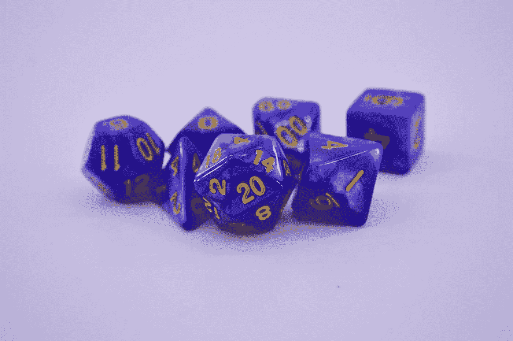

([像素](https://www.pexels.com/photo/luck-rolls-game-color-3649115/))

## 我为什么要关心马尔可夫链？

两件事:首先，它是隐马尔可夫模型(HMM)和强化学习等几个机器学习概念的关键基础。马尔可夫链也用于其他学科，如金融(股票价格运动)或工程物理(布朗运动)。一个著名的例子是 [PageRanks](https://en.wikipedia.org/wiki/PageRank) ，这是谷歌用来给页面排名打分的第一个算法，它是基于马尔可夫链的。

其次，我发现这个概念本身很有趣，因为它是一种与你将遇到的大多数数据科学概念完全不同的方法。在机器学习中，你试图根据过去的数据预测未来的事件。有了马尔可夫链，你只关心现在的状态来预测未来(我马上会解释为什么)。

# 你如何预测天气？

如果让你预测某个城市未来 365 天的天气，你会怎么做？

这个问题的一个解决方案可以是分配雨天的概率和晴天的概率。

例如，如果你住在伦敦，那里一年大约有 1/3 的时间下雨，你可以分配一个概率 **P(下雨)= 1/3** 和 **P(晴天)= 2/3** 。现在，您可以简单地在 Python 中运行快速模拟并获得预测。

我们将生成的示例如下所示:

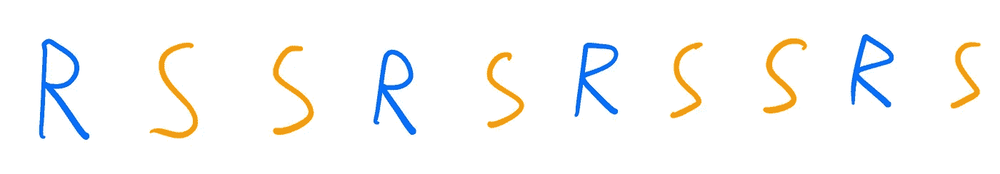

模拟伦敦天气的首次尝试(图片由作者提供)

这种方法有一个主要的警告。事实上，我们知道:

*   如果某一天下雨，第二天更有可能下雨。
*   如果某一天天气晴朗，第二天天气晴朗的可能性就大得多。

问题是我们目前的模型没有考虑到这一点。理想情况下，我们希望“告诉”我们的模型，如果某一天下雨，我们希望第二天下雨的概率更高，反之则是晴天。我们可以这样表述:“如果我们的模型处于下雨的状态，我们希望它有很高的概率保持在这种状态，即第二天还会下雨，反之亦然”。

那么，我们该怎么做呢？马尔可夫链。

## 模拟天气的马尔可夫链

让我们看看这个问题的马尔可夫链是什么样子的:

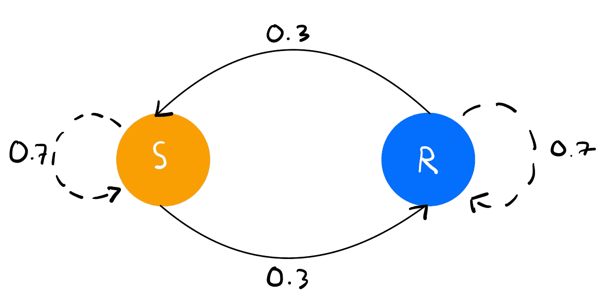

天气问题的马尔可夫链(图片由作者提供)

马尔可夫链由三部分组成:状态(这里是雨天或晴天)、事件(从晴天到雨天或雨天后的雨天)以及每个事件的概率(从晴天到雨天或雨天到雨天的概率为 0.3，晴天后的雨天或晴天后的晴天的概率为 0.7)。

现在，不是每天都有晴天或雨天的概率，而是有**保持**和**离开**的概率，即**晴天**或**雨天**的状态。

更正式地说，我们有两种状态，晴天和雨天，每种状态都有**离开**状态和**转换**到另一种状态的概率，以及**保持**同一状态的概率。

## 跃迁矩阵

对于模拟，我们不使用这个图，而是使用一个所谓的转换矩阵。我们的会是这样的:

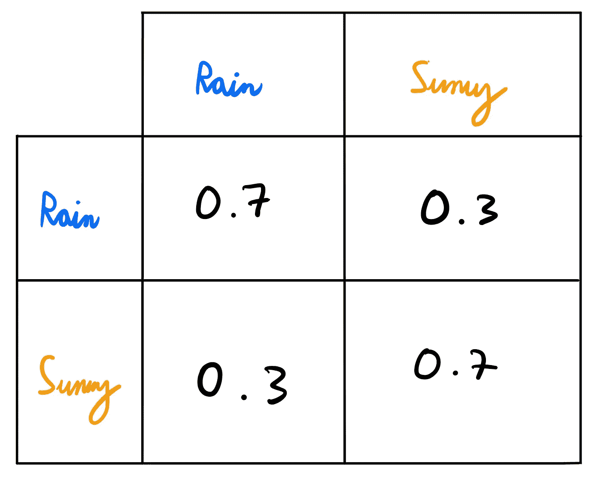

天气问题的转换矩阵(图片由作者提供)

那么，如何解读这个矩阵呢？让我们看看如何阅读左下角的条目。你先读这个矩阵的行，然后是列。因此，对于给定的元素，您将读到:

> 从(行)转换到(列)的概率是(值)。

在这里，对于左下方的元素，我们将读取:

> 从晴天转变为雨天的概率是 0.3。

# 骰子滚动

现在，让我们用掷骰子来处理一个更复杂的例子。假设你有两个玩家 A 和 b，一个有六个面的骰子被连续掷出。

玩家 A 下注，两次总和为 10 的连续掷骰将首先发生。玩家 B 打赌两个连续的 6 会先出现。玩家继续掷骰子，直到一个玩家赢。

A 赢的概率有多大？

我们如何建模？…你猜对了。

## 掷骰子的马尔可夫链

让我们看看应该如何处理这个问题。

对玩家 A 来说，总和为 10 的连续掷骰子是先掷 5 再掷 5，先掷 4 再掷 6，然后掷 6 再掷 4。

对于玩家 B 来说，唯一的选择就是连续出两个 6。

这意味着得到 1、2 或 3 与我们的问题“无关”:这些卷将构成我们的初始状态 s。其他状态 4、5 和 6 将是“相关”状态。

现在，让我们来看看马尔可夫链的初稿。

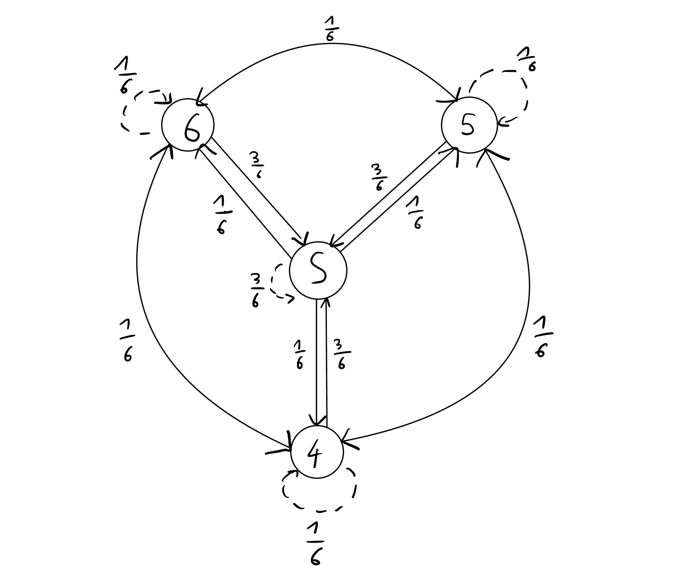

我们的马尔可夫链的初稿(图片由作者提供)

首先，我们有状态 S(滚动 1、2 或 3)。我们有 3/6=0.5 的概率停留在状态 S(即重掷 1、2 或 3)。其他状态 4、5 和 6 中的每一个都有 1/6 的概率保持在同一状态或转换到其他两个相关状态，并且有 0.5 的概率转换到状态 s。每个状态的所有概率总和总是 1。

这看起来不错，但是我们遗漏了关于我们感兴趣的骰子滚动组合的信息。让我们补充一下:

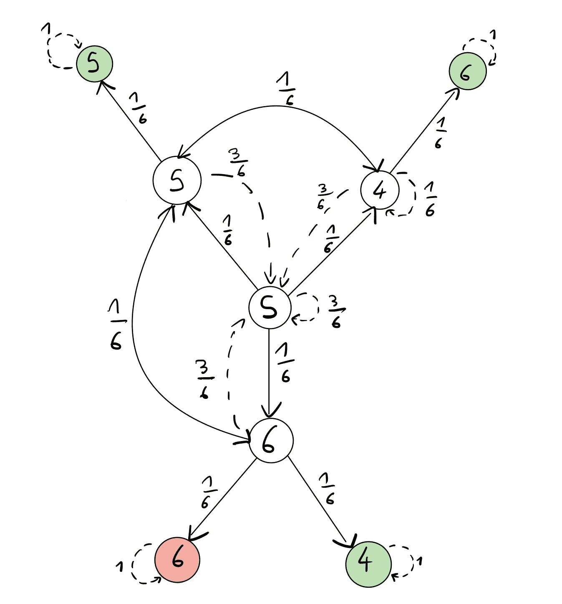

掷骰子问题的最终马尔可夫链(图片由作者提供)

这就像上面的一样，但是我添加了最终状态，它们是绿色的(当 A 赢的时候)和红色的(当 B 赢的时候)。这些状态保持同一状态的概率为 1，称为*吸收剂*。这是因为，一旦你进入这些状态，你就不能离开它们。在我们的例子中，它们是吸收性的，因为它们代表游戏结束的时间(当 A 或 B 赢了的时候)。

需要注意的一点是，你可以从 5 转换到 6 或者从 5 转换到 4，反之亦然，但是你不能从 6 转换到 4，反之亦然。这是因为，如果你掷了一个 6，然后掷了一个 4，你不会回到中间的状态:你到达一个吸收状态，游戏就结束了。这就是为什么这两者之间没有箭头。

这看起来不错，但是我们仍然没有回答我们最初的问题:玩家 A 赢的概率是多少？为此，我们需要使用这个马尔可夫链的转移矩阵进行一些模拟。

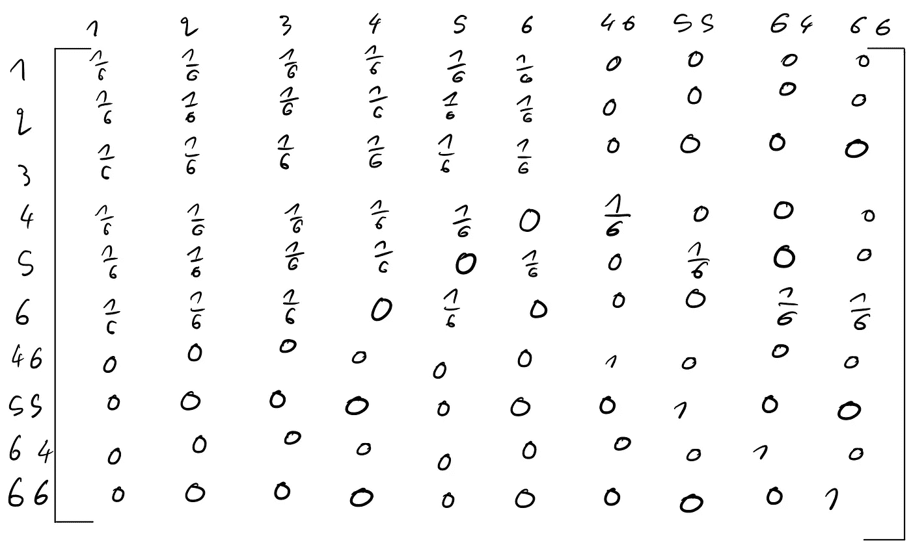

马尔可夫链的转移矩阵(图片由作者提供)

除了掷出 1、2、3、4、5 或 6 之外，我还创建了 4 种状态:掷出 4 然后掷出 6 (46)，连续掷出两个 5(55)，掷出 6 然后掷出 4 (64)，连续掷出两个 6(66)。

如果我们到达状态 46、55 和 64，玩家 A 赢，而如果我们到达状态 66，玩家 B 赢。

## 模拟

让我们看看如何使用 Python 来运行这个转换矩阵的模拟。你可以在我的 [GitHub](https://github.com/tlemenestrel/markov_chains_dice_rolls/blob/main/markov_chains_dice_rolls.ipynb) 上找到代码。

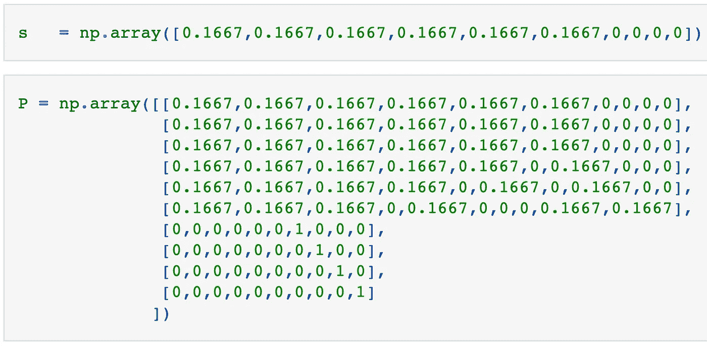

定义 s 和 P(图片由作者提供)

首先，我们定义 *s* ，这是一个向量，表示开始时到达其中一个状态的概率。它的排序方式与转移矩阵相同—第一个值 *s[0]* 对应于滚动 1，第二个值 *s[1]* 对应于滚动 2，最后一个值对应于 66，连续滚动两个 6。

前 6 个值的概率为 1/6≈0.1667，因为第一次掷骰子时，我们可以掷出 1、2、3、4、5 或 6。状态 46、55、64 和 66 都有概率为 0，因为我们在第一次掷骰子后无法到达这些状态。

然后，我们将上面的转移矩阵定义为 NumPy 数组。

运行模拟之前的一个快速步骤是检查所有的行的总和是否为 1(检查你是否理解转换矩阵的一个好方法是问你自己为什么我们要检查它)。

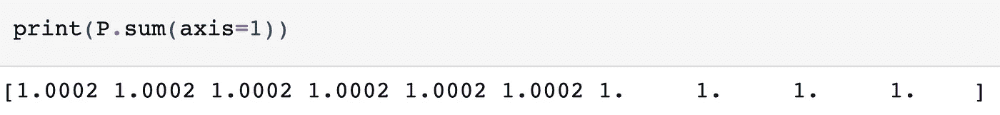

P 的行数总和(图片由作者提供)

在我们的例子中，所有的行加起来都是 1(对于前 6 个元素来说稍微高一点，因为我们使用的是 1/6 的近似值)。

现在，让我们运行我们的模拟。为此，我们简单地将 P 乘以自身，然后乘以初始状态向量*s*。你可以看到这是从初始状态 *s* 开始，然后乘以 *P* 很多次，以模拟大量的骰子滚动。

我们得到以下结果:

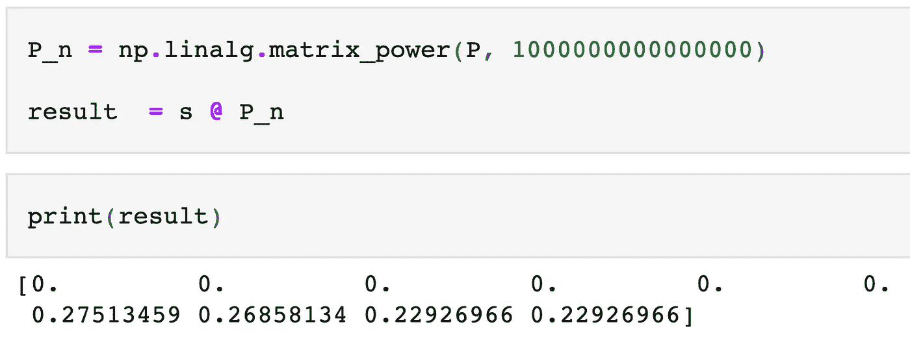

我们的模拟结果(图片由作者提供)

我们看到，在掷骰子很多次后，我们肯定不会停留在前 6 个状态，因为它们的概率为 0。这是有意义的，因为这意味着 A 或 B 将在某一点上获胜，游戏将停止。

向量中不为 0 的前三个数字对应于状态 46、55 和 64 的概率(玩家 A 获胜)。如果我们把这些概率相加，我们就得到玩家 A 赢得游戏的概率。

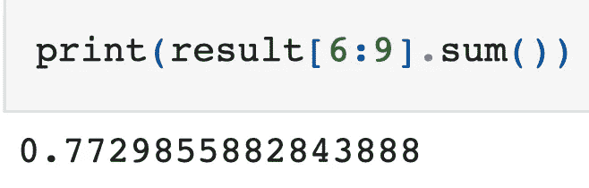

A 获胜的概率(图片由作者提供)

现在，我们有了答案:玩家 A 有 0.77 的概率赢得游戏，而 B 有 1–0.77 = 0.23 的概率赢得游戏。

# 更进一步

我希望你喜欢这第一次介绍马尔可夫链。

我建议尝试一个不同的掷骰子问题，并重复上面的所有步骤(不同的结果，例如 7 人或 3 人等)，以确保你完全理解这个概念。您还可以通过重用我的代码来尝试使用 NumPy 运行模拟。

我希望你喜欢这个教程！让我知道你对它的看法。

*随时连接上*[*LinkedIn*](https://www.linkedin.com/in/thomas-le-menestrel/)*和*[*GitHub*](https://github.com/tlemenestrel)*谈论更多关于数据科学和机器学习的内容并关注我上* [*中*](https://tlemenestrel.medium.com/) *！也可以用这个* [*链接*](https://tlemenestrel.medium.com/membership) *成为中等会员来支持我。*