# 蒙特卡罗方法简介

> 原文：<https://towardsdatascience.com/a-gentle-introduction-to-monte-carlo-methods-98451674018d>

## 带有 python 中的实际代码示例

**蒙特卡罗方法**是一种广泛的计算算法，依靠重复的[随机抽样](https://en.wikipedia.org/wiki/Random_sampling)来获得数值结果。这些方法背后的基本概念是使用[随机性](https://en.wikipedia.org/wiki/Randomness)来解决原则上可能是[确定性](https://en.wikipedia.org/wiki/Deterministic_system)的问题。蒙特卡罗方法经常用于物理问题和数学问题，正如我们将在本文中讨论的，在难以甚至不可能使用替代方法的情况下，蒙特卡罗方法有一些独特的优势。

蒙特卡罗方法主要用于三类问题:[优化](https://en.wikipedia.org/wiki/Optimization)、[数值积分](https://en.wikipedia.org/wiki/Numerical_integration)，以及我们需要从[概率分布](https://en.wikipedia.org/wiki/Probability_distribution)中产生抽奖的场景。一些例子包括对输入中具有显著[不确定性](https://en.wikipedia.org/wiki/Uncertainty)的现象进行建模，例如商业中[风险](https://en.wikipedia.org/wiki/Risk)的计算，以及数学中具有复杂[边界条件](https://en.wikipedia.org/wiki/Boundary_conditions)的多维[定积分](https://en.wikipedia.org/wiki/Integral)的评估。应用于[系统工程](https://en.wikipedia.org/wiki/Systems_engineering#:~:text=Systems%20engineering%20is%20an%20interdisciplinary,systems%20over%20their%20life%20cycles.&text=Systems%20engineering%20deals%20with%20work,management%20tools%20in%20such%20projects.)问题(太空、石油勘探、飞行器设计等。)、基于蒙特卡洛的失败预测、[成本/进度超支](https://en.wikipedia.org/wiki/Cost_overrun)通常比人类直觉或替代“软”方法更好。

这篇介绍性文章显然不会涵盖所有这些主题，而是通过几个直观的例子来展示如何使用随机抽样和蒙特卡罗方法来解决一些有趣的问题。到本文结束时，您将有望很好地掌握这些技术的基本假设和应用，以及对这些方法的有用性和优点的评价。

我还包含了复制结果所需的所有 python 代码，所以您也可以随意尝试这些示例！

# 使用随机数生成器估计圆周率的值

我将以一个相当基本但有趣的例子开始(旁注:这实际上是几年前我在一次求职面试中遇到的一个问题！).任务是找到圆周率的值，但是有一个限制，即我们只能使用一个能够执行基本[算术](https://en.wikipedia.org/wiki/Arithmetic)以及能够生成随机数的计算器。

当然，你可以试着画一个圆，测量直径和周长的比率等等。，但这可能不会导致对圆周率的非常精确的估计。也许我们可以用某种方式利用随机数字的能力来代替？

让我们从[单位圆](https://en.wikipedia.org/wiki/Unit_circle)(即半径为 1 的圆)的定义开始。如果( *x，y* )是单位圆圆周上的一点，那么| *x* |和| *y* |是斜边长为 1 的[直角三角形](https://en.wikipedia.org/wiki/Right_triangle)的边长。这样，由[勾股定理](https://en.wikipedia.org/wiki/Pythagorean_theorem)， *x* 和 *y* 满足等式: *x* + *y* = 1

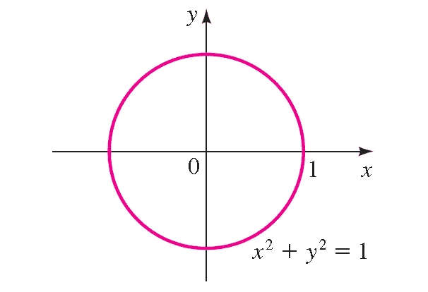

图 1:单位圆

这意味着，如果我们从范围[-1，1]中的两个随机数开始，代表 *x，y* 坐标，我们可以很容易地检查这个点是位于单位圆内部还是外部。幸运的是，这基本上是我们估算圆周率所需的所有信息！

如下图所示，如果我们比较单位圆的面积和正方形的面积，我们看到这个比值是由圆周率的值给出的。重要的是，作为这个比率的近似值，我们可以生成一个大的随机数序列“N_total”，然后检查其中有多少个位于单位圆“n_inside”内。

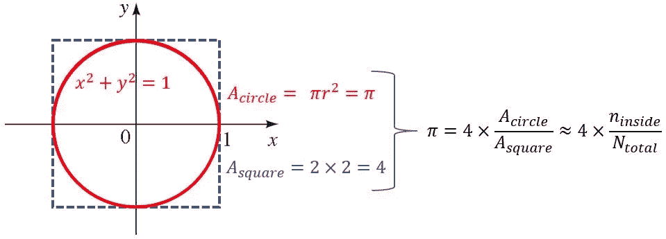

图 2:使用随机数估计圆周率

现在让我们生成一个大的随机数序列，并检查它！在下图中，我们看到了迭代次数不断增加的输出。单位圆内的所有点( *x* + *y* < 1)显示为红色，而单位圆外的点显示为蓝色。通过简单地计算 *N* 和 *n* 之间的比值，我们就可以得到一个越来越好的圆周率估计值。

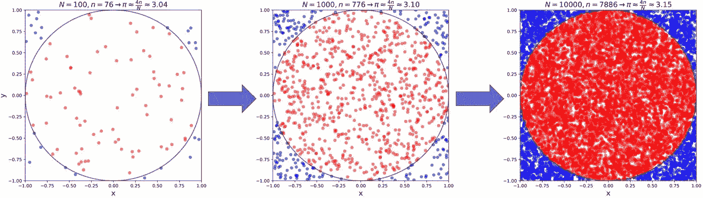

图 3:使用随机数估计圆周率

或者，由于系统的对称性，我们也可以只关注右上象限，如下图所示:

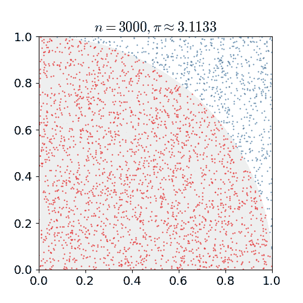

图 4: [来源](https://en.wikipedia.org/wiki/Monte_Carlo_method)

通过生成 N=100.000 对随机的 *x，y* 坐标，我们可以检查 PI 的近似值如何随着迭代次数的增加而提高(另外，请注意下图中的对数*x*-轴)。

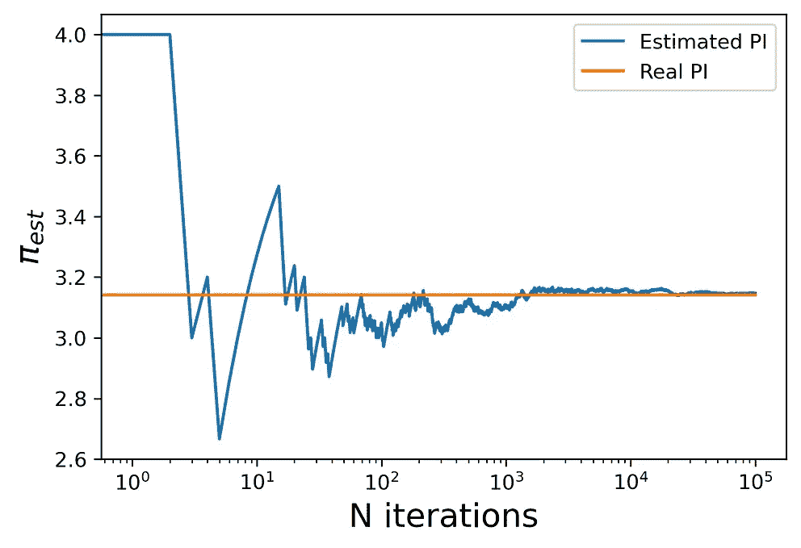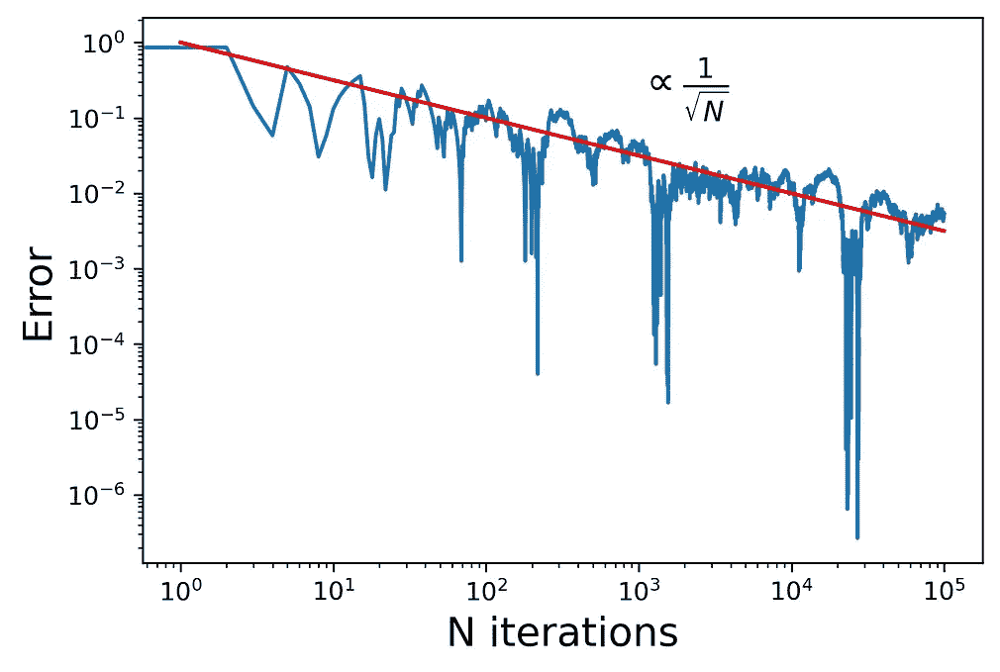

图 5:评估的准确性与迭代次数的关系

正如我们在左图中看到的，给定足够多的数据点，我们的 PI 近似值最终会接近正确值。您可能还会注意到右图中明显的比例定律，我们可以看到，我们估计的误差似乎与迭代次数的平方根成反比。这种缩放行为实际上是蒙特卡罗方法最显著和最重要的特征之一，这是我们稍后将更详细讨论的内容。

在使用[蒙特卡罗积分](https://en.wikipedia.org/wiki/Monte_Carlo_integration)来解决同样的问题之前，我包含了复制上述结果所需的代码。在下面的代码块中，我们从定义函数“PI_Approx”开始，它将迭代次数 *N* 作为输入。该函数生成一系列 *N* 个随机数对，然后检查它们是否位于定义的单位圆内。对于每个生成的随机数对，我们在列表“PI_approx”中添加 PI 的更新估计值。在经历了所有的 *N* 次迭代之后，最终结果作为数据帧返回，除了我们的估计之外，还包括 PI 的真实值以及我们估计的误差。(此外，在 *N* =100、1000 和 10.000 次迭代之后，下面的代码还会生成如图 3 所示的示例输出)。

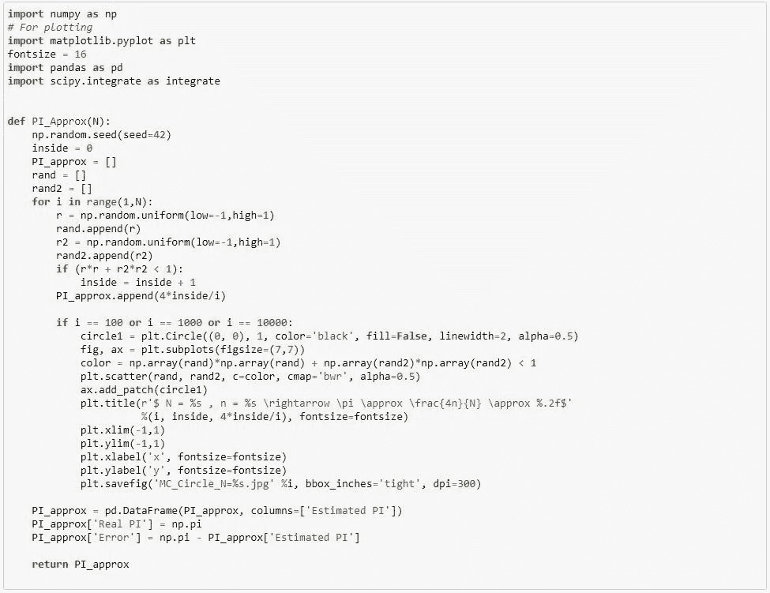

图 6:使用随机数估计圆周率

定义了近似 PI 的函数后，我们可以调用此函数进行 *N* =100.000 次迭代，如下所示。这个代码块还输出了显示我们的估计相对于迭代次数的改进的图形，以及估计误差的比例法则(图 5)。

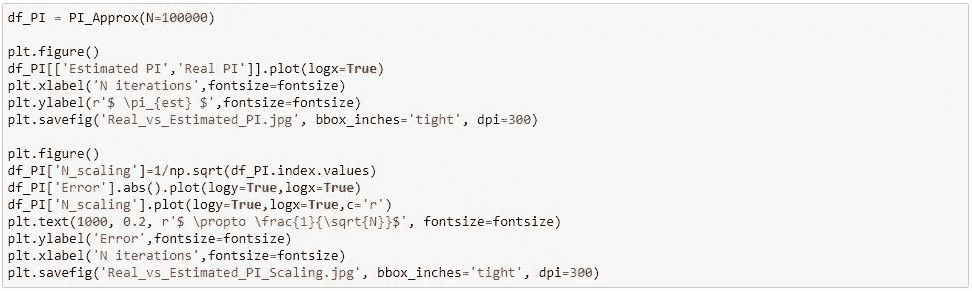

图 7:使用随机数估计圆周率

已经讨论了使用蒙特卡罗方法和随机抽样来估计圆周率的初始示例，现在让我们继续讨论使用[蒙特卡罗积分](https://en.wikipedia.org/wiki/Monte_Carlo_integration)来解决同一问题的替代方法。

# 从随机抽样到求解积分

对于那些有数学/科学/工程背景的人来说，解各种各样的积分可能是你非常熟悉的事情。然而，在许多(大多数)情况下，我们不能解析地求解积分，而需要求助于数值替代方案。

与通过寻找[反导数](https://en.wikipedia.org/wiki/Antiderivative)的解析积分相反，进行数值积分有几个原因:

1.  被积函数 *f* ( *x* )可能只有在某些点上是已知的，比如通过[采样](https://en.wikipedia.org/wiki/Sampling_(statistics))得到。
2.  被积函数的公式可能是已知的，但是可能很难或者不可能找到作为[初等函数](https://en.wikipedia.org/wiki/Elementary_function)的反导数。这种被积函数的一个例子是*f*(*x*)= exp(*x2*)，它的反导数(误差函数[乘以一个常数)不能写成](https://en.wikipedia.org/wiki/Error_function)[的初等形式](https://en.wikipedia.org/wiki/Elementary_form)。
3.  计算反导数是可能的，但计算数值近似值可能比计算反导数本身更容易。如果反导数作为一个[无穷级数](https://en.wikipedia.org/wiki/Series_(mathematics))或乘积给出，或者如果它的评估需要一个不可用的[特殊函数](https://en.wikipedia.org/wiki/Special_function)，就可能出现这种情况。

当然，我们估算圆的面积的简单例子并不需要我们计算非常复杂的积分，我们可以很容易地用[解析求解](https://socratic.org/questions/using-integrals-find-the-area-of-the-circle-x-2-y-2-1)。然而，基本的技术仍然是相同的，因此它是引入蒙特卡罗积分方法的一个很好的起点。这也使得直接评估我们的近似与精确解相比有多精确成为可能。

由于我们系统的对称性，让我们简化问题，只关注右上象限。我们对于单位圆的公式， *x* + *y* =1 可以改写如下图所示，这里我们要求解 *f(x)* 的定积分从 *x* =0 到 1。

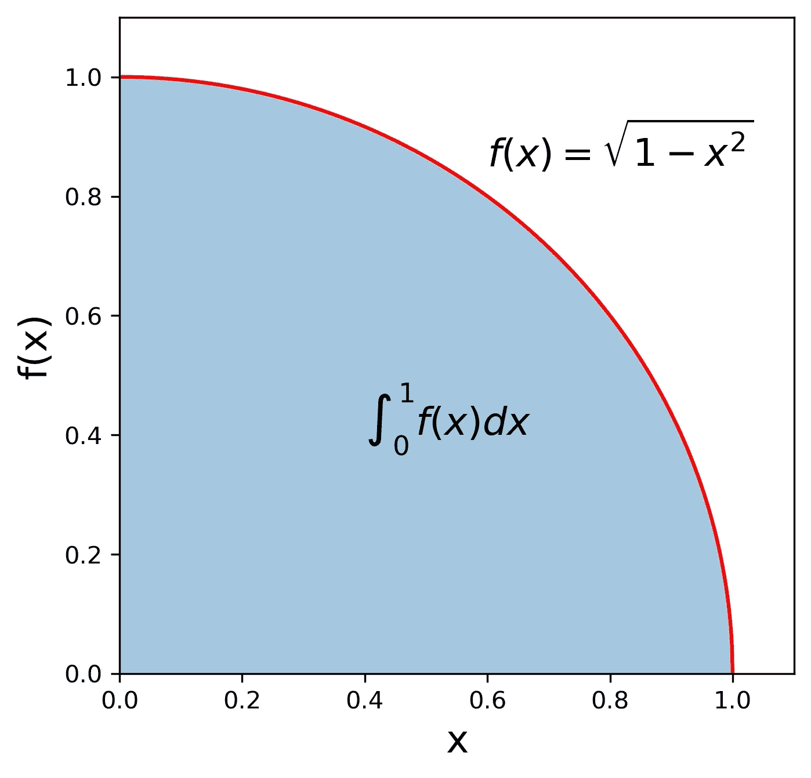

图 8:通过定积分计算圆的面积

在我们继续展示如何使用蒙特卡罗方法求解积分之前，我首先包括定义我们的函数的示例代码， *f* ( *x* )，以及绘制上图:

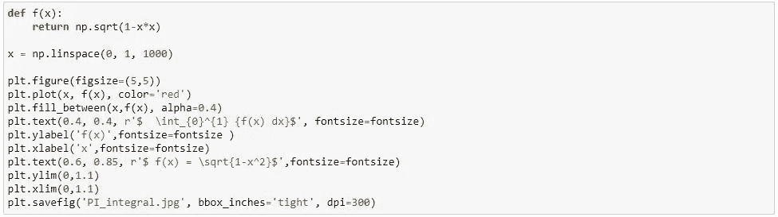

图 9:通过定积分计算圆的面积

## 怎么才能用随机数解积分？

那么问题是，我们如何用一个随机数序列来估计这个积分的值呢？

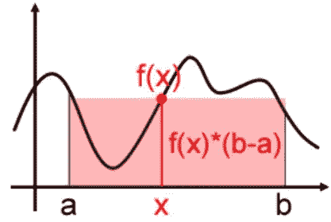

图 10:积分=曲线下面积

你可能还记得，函数 *f* ( *x* )的积分可以解释为计算函数曲线下方的面积。假设我们现在在[*a，b*]范围内为*x*选择一个随机数，如左图所示。然后，我们可以计算这个值的 *f* ( *x* )，然后将结果乘以( *b-a* )以获得积分值的粗略估计。这当然会是一个非常粗略的估计，但是如果我们继续在范围[*a，b*中的许多不同的随机点 T14 评估函数，然后将所有这些矩形的面积相加，并对总和取平均，我们实际上会越来越接近积分的精确结果。

这个过程如下图所示，这里我们展示了在[ *a，b* ]内的四个随机点对 *f* ( *x* )进行评估的结果。正如我们所看到的，一些结果矩形高估了积分的面积，而另一些则低估了面积。然而，当对所有矩形的总面积求平均值时，这些影响往往会相互抵消，随着样本数量的增加，我们实际上获得了对真实积分的相当好的估计。

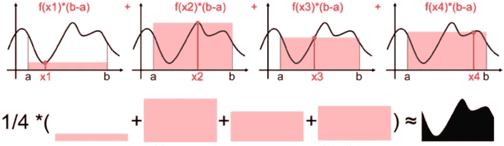

图 11:通过随机抽样近似积分。[来源](https://www.scratchapixel.com/lessons/mathematics-physics-for-computer-graphics/monte-carlo-methods-in-practice/monte-carlo-integration)

## 使得蒙特卡罗积分如此强大的标度律

利用蒙特卡罗积分的性质，我们还可以推导出一个比例定律，显示我们的近似解的误差如何随着迭代次数的增加而减少 *N.* 我们已经在图 5 中举例说明了估算 PI 的第一个例子中的这种比例行为，但是如果您对比例定律的推导感兴趣，您可以看看下面的内容(或者如果您想直接跳到结果，可以随意跳过它！)

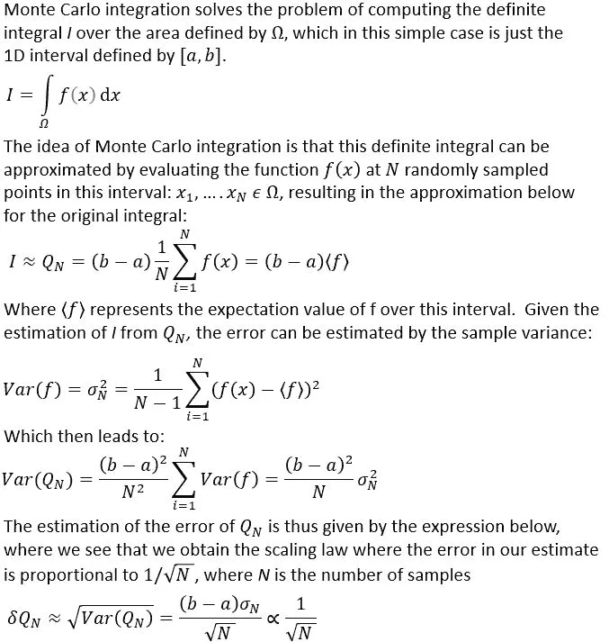

图 12:比例法则的推导

实际上，这个比例定律意味着需要四倍多的样本来将估计误差减半。但是蒙特卡罗积分最显著的特点是这个收敛速度**与积分维数**无关。这不是用于求解积分的其他数值方法的情况(例如[黎曼和](https://en.wikipedia.org/wiki/Riemann_sum))，其中收敛速度随着积分维数的增加而指数恶化。在许多情况下，我们不得不解决多变量函数的积分(或多重积分)，因此蒙特卡罗积分更适合。当然，对于固定数量的样本，逼近的质量会随着维数的增加而降低，但你仍然可以保证以固定的成本(样本数 *N* )得到一个解。

## 蒙特卡罗积分:实际例子

执行蒙特卡罗积分的函数在下面的代码块中定义。该函数将迭代次数 *N* 、要评估的函数以及由[ *a，b* 定义的积分间隔作为输入。在执行了以上各节中讨论的计算之后，该函数将返回积分的估计值 I_approx。

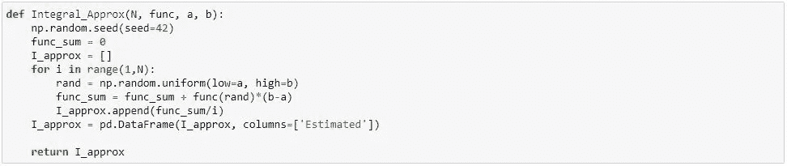

图 13:蒙特卡罗积分

与我们基于随机采样估计 PI 值的初始示例类似，我们现在可以使用蒙特卡罗积分对我们之前定义的函数 *f* ( *x* )执行相同的估计，然后在区间 *a* =0 到 *b* =1 上进行积分:

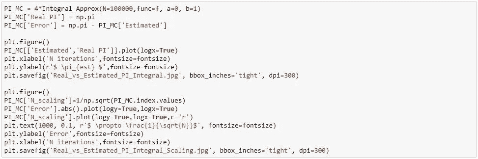

图 14:蒙特卡罗积分

此代码块还输出了下图，说明了随着迭代次数的增加，我们对 PI 的估计如何逐渐变得更好，并显示了与我们前面讨论的相同的误差比例定律。

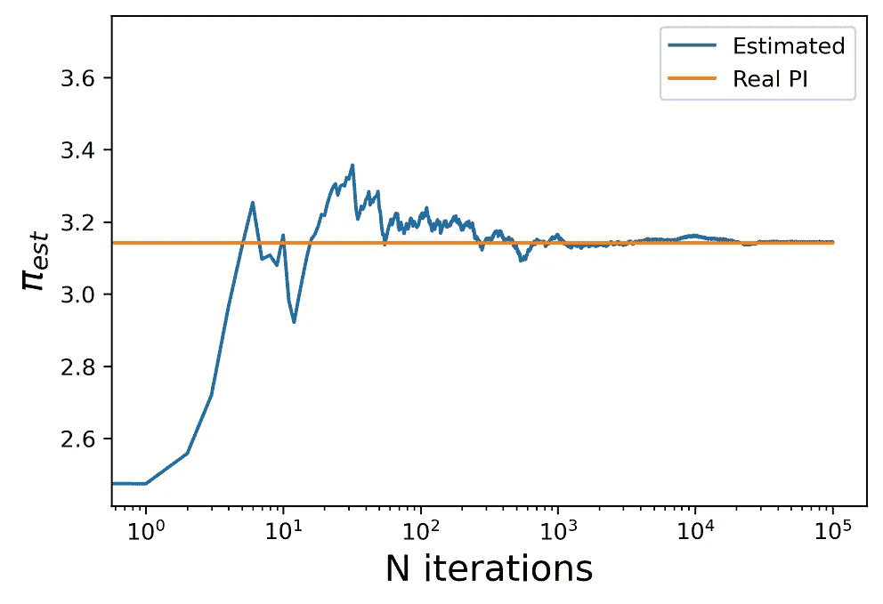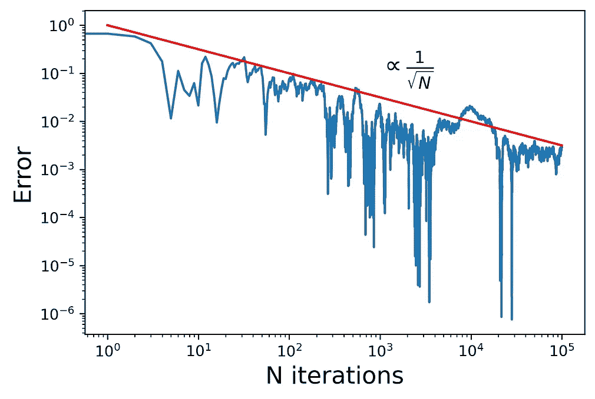

图 15:使用蒙特卡罗积分估算圆周率

## 蒙特卡罗积分:示例 2

上面的例子说明了蒙特卡罗积分的使用，但对于一个相当简单的情况，我们实际上可以解析地求解积分以获得精确的解。在这一节中，我们对稍微复杂一点的情况采用同样的程序，在这种情况下，不可能得到封闭形式的解，我们需要借助于积分的数值估计。

我们首先定义函数 *f* ( *x* )以及积分区间 *a，b*】*，*为，如下图所示:

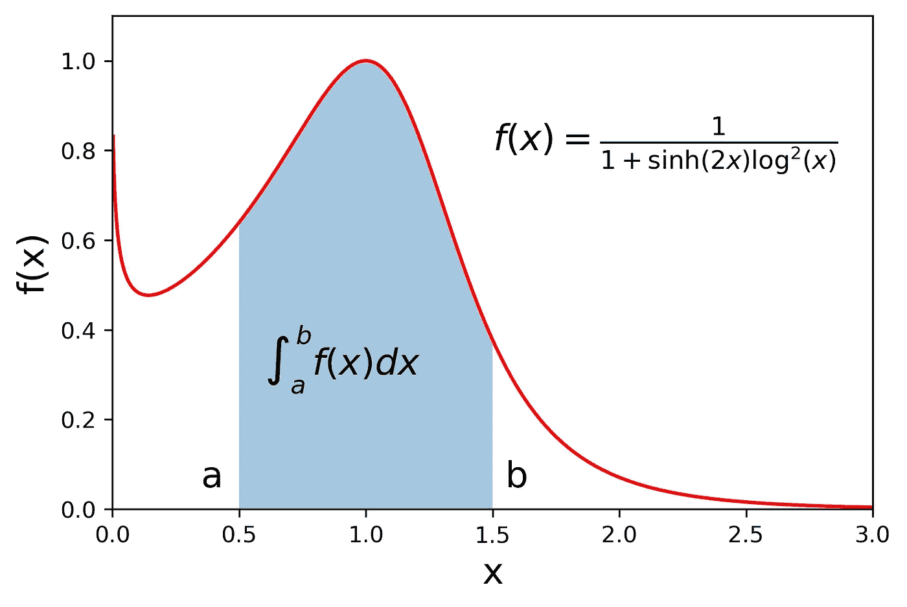

图 16:替代函数的蒙特卡罗积分

与前面的例子类似，我们执行相同的蒙特卡罗积分过程，但是这次使用新的函数作为输入。此外，在这种情况下，我们没有精确的解来比较我们的估计，而是使用*[*scipy . integrate . quad*](https://docs.scipy.org/doc/scipy/reference/reference/generated/scipy.integrate.quad.html)方法将我们的解与数值积分进行比较，如下面的代码块所示。*

*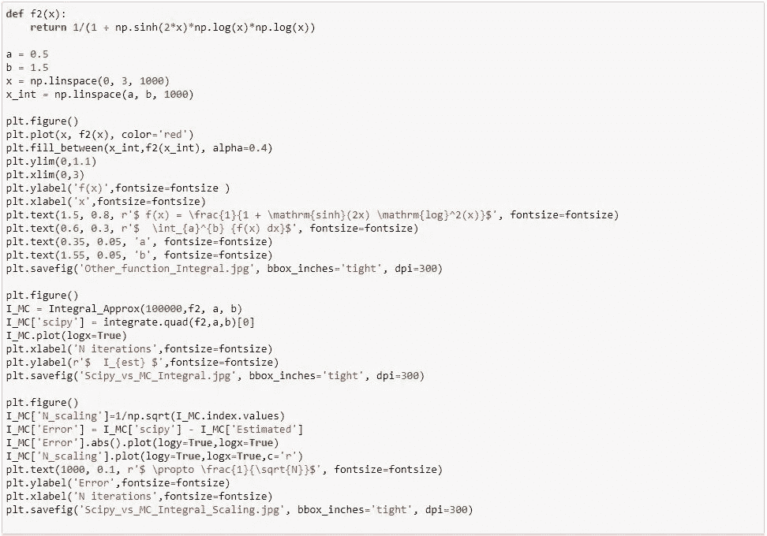*

*图 17:替代函数的蒙特卡罗积分*

*我们在这里还输出了一些图形，显示了随着迭代次数的增加，我们对积分的估计如何逐渐变得更好，并显示了与前面示例相同的误差比例定律。*

*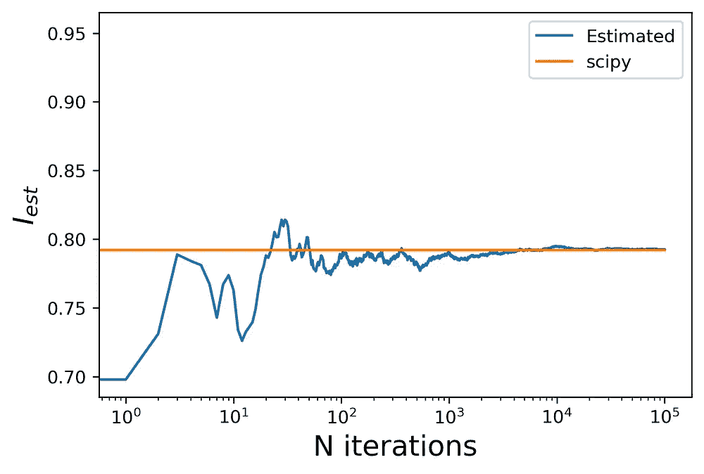**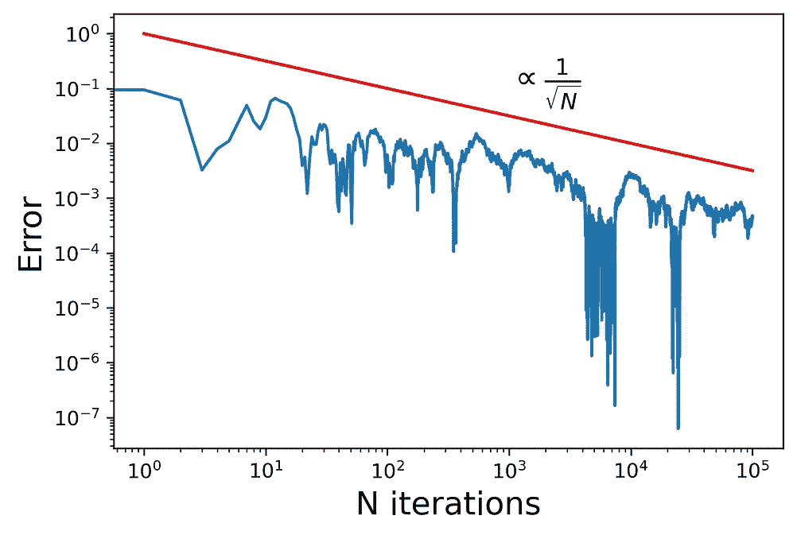*

*图 18:替代函数的蒙特卡罗积分*

## *推广到更高维的积分:*

*在前面的例子中，我们使用了蒙特卡罗积分来处理 1D 线积分，但是这如何推广到更高维度呢？让我们使用下图左图所示的 3D 函数作为起点，然后定义右图所示的积分间隔。*

*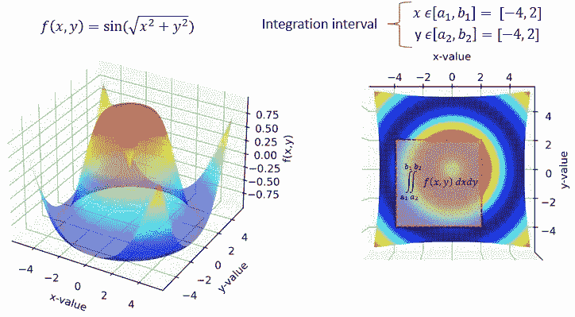*

*图 19: 3D 功能*

*以下代码块包括 3D 函数 *f* ( *x，y* )的定义，以及上面图 19 所示的可视化:*

*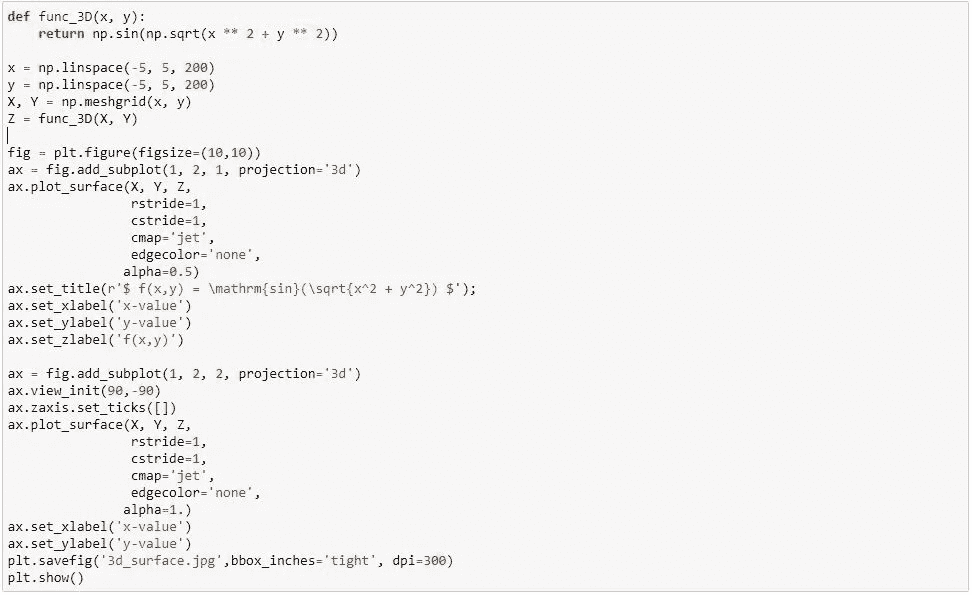*

*图 20:定义我们的 3D 形状并可视化它*

*然而，在我们能够执行这个蒙特卡罗积分之前，我们首先需要将我们的代码一般化，以处理作为输入的 3D 函数。正如您在下面的简短推导中所看到的，幸运的是，这非常简单。主要区别在于，我们现在对 *x* 和 *y* 都在随机点计算*f*(*x*)，然后乘以积分**区间** ( *b-a* )的长度，而不是在范围 *a，b* 中的随机点计算*f*(*x*)，然后乘以*

*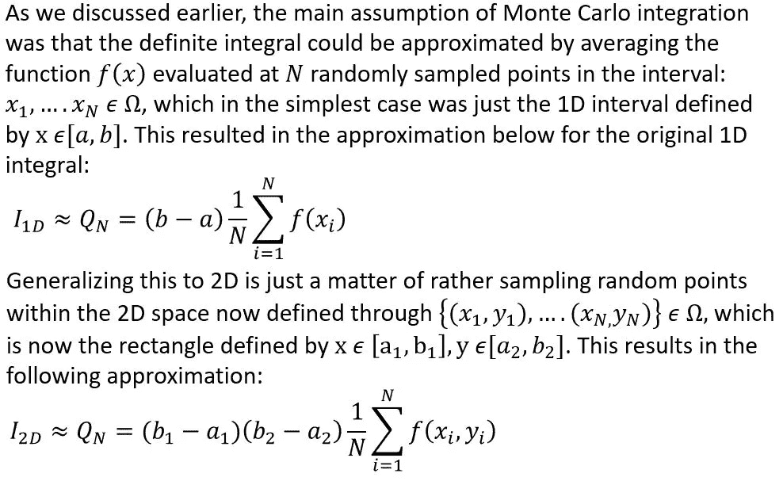*

*图 21:从 1D 积分推广到 2D 积分*

*根据这一概括，我们现在可以更新下面代码块中的“Integral_Approx”函数，以接受 3D 函数作为输入，并添加两个附加参数(a2 和 b2)来定义积分区域。由于在这种情况下我们也没有精确的解来比较我们的估计，我们使用*[*scipy . integrate . nquad*](https://docs.scipy.org/doc/scipy/reference/generated/scipy.integrate.nquad.html)方法将我们的蒙特卡罗解与同一方程的数值积分进行比较:**

****

**图 22: 2D 蒙特卡罗积分**

**然后，我们可以执行必要的计算并输出下图，显示随着迭代次数的增加，我们对积分的估计如何逐渐变得更好，以及在这种情况下，误差显示出与前面示例相同的比例定律。**

**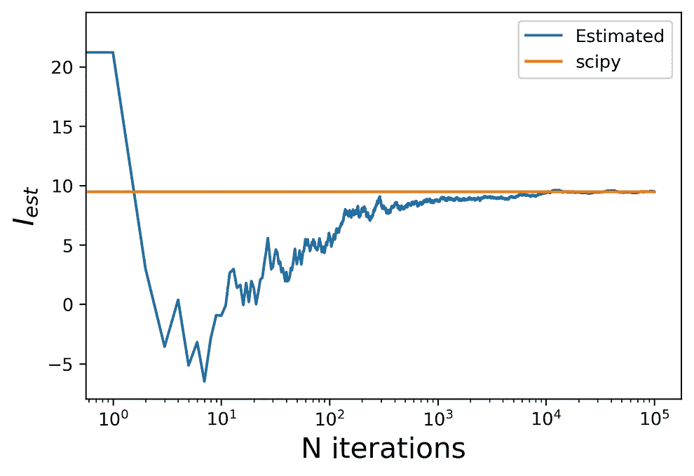****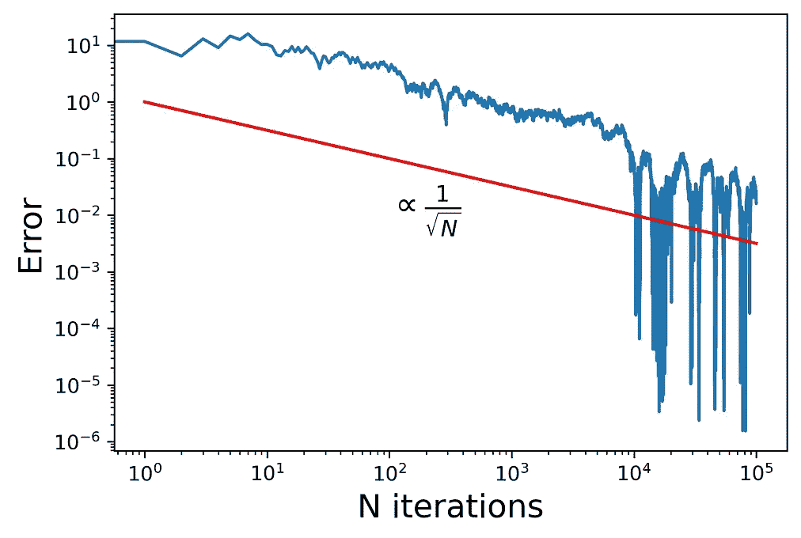**

**图 23: 2D 蒙特卡罗积分**

# **总结:**

**如前所述，本文的目标是通过几个直观的例子来展示随机抽样和蒙特卡罗方法如何用于解决一些有趣的问题。然而，尽管本文中介绍的方法对于这些相当简单的示例非常有效，但是对于更复杂的问题，还需要考虑一些重要的事项。**

**尽管其概念和算法简单，但与蒙特卡罗模拟相关的计算成本可能非常高，因为该方法通常需要许多样本来获得良好的近似。尽管对于非常复杂的问题来说，这可能是一个重大的限制，但幸运的是，算法的[令人尴尬的并行](https://en.wikipedia.org/wiki/Embarrassingly_parallel)性质允许通过本地处理器、集群、云计算、GPU、FPGA 等中的[并行计算](https://en.wikipedia.org/wiki/Parallel_computing)策略将这一巨大成本降低到一个可行的水平。**

**另一件要记住的事情是，本文中介绍的基本蒙特卡罗方法是基于随机抽样技术的。然而，通过利用特定于问题的采样分布，可以获得算法的显著改进。例如，通过适当选择样本分布，人们可以利用几乎所有高维被积函数都非常局部化并且只有小的子空间对积分有显著贡献的事实。因此，蒙特卡罗文献的很大一部分致力于开发策略，通过[巧妙的采样方法](https://www.sciencedirect.com/science/article/abs/pii/S0927050703100060)来改善误差估计。**

**这些更高级的主题没有包括在本文中，因为正如文章标题中所述，主要目的是提供“蒙特卡洛方法的简明介绍”。希望您已经对这些技术的假设和应用有了基本的了解，并对这些方法的有用性和优点有了评价。**

**我还希望您会发现实用的代码示例是有用的，我强烈鼓励您尝试不同的函数和采样策略等。毕竟，没有比亲自动手尝试更好的学习方法了！**

**祝你好运！**

**如果你有兴趣了解更多与人工智能/机器学习和数据科学相关的主题，你也可以看看我写的其他一些文章。你会发现他们都列在我的中型作者简介，[，你可以在这里找到。](https://medium.com/@vflovik)**

**如果你对我以前的文章感兴趣，并且想在新内容发表时得到通知，你也可以注册下面的邮件列表**

**  

而且，如果你想成为一个媒体会员，免费访问平台上的所有资料，你可以使用下面我的推荐链接。(注意:如果您使用此链接注册，我也会收到一部分会员费)

 **