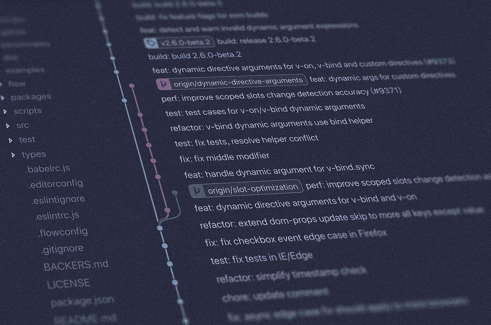
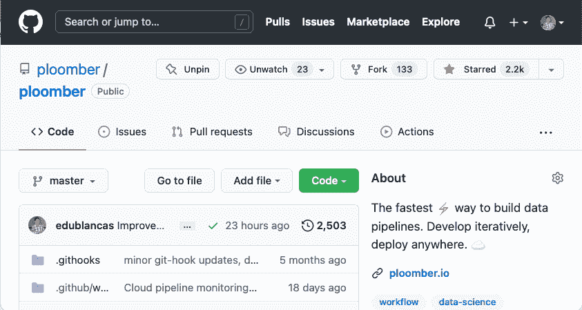
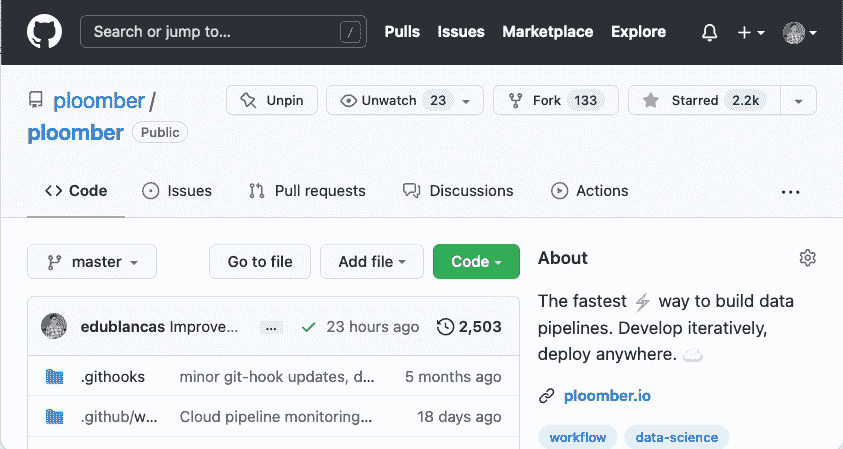
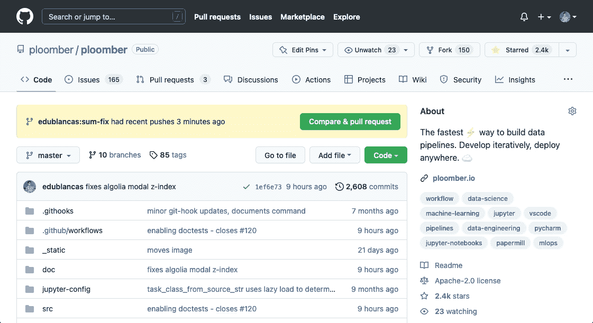
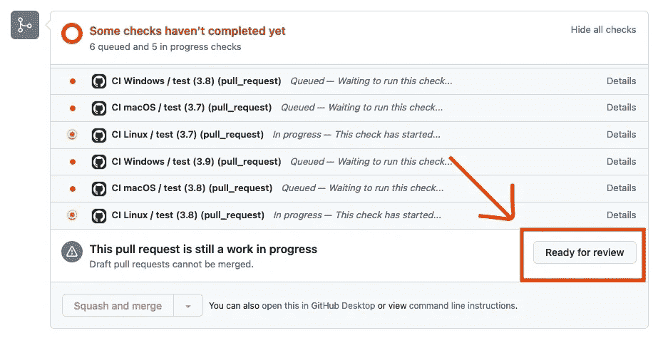

# 对开源贡献的温和介绍

> 原文：<https://towardsdatascience.com/a-gentle-introduction-to-open-source-contributions-4b2a8f1aa5cd>

## 开源 101

## 为开源项目做贡献的分步指南

照片由[扬西·敏](https://unsplash.com/@yancymin?utm_source=medium&utm_medium=referral)在 [Unsplash](https://unsplash.com?utm_source=medium&utm_medium=referral) 上拍摄

随着 [Ploomber](https://github.com/ploomber/ploomber) 成为建设 Jupyter 管道的首选工具，我们看到社区对该项目的贡献越来越大。我们非常荣幸有这样一个充满活力的社区愿意付出额外的努力，特别是因为我们的许多贡献者都是第一次开源贡献者。为了帮助新的开源贡献者，我们准备了这个深入的指南，涵盖了你第一次做出贡献所必须知道的一切。我们开始吧！

*请注意，本指南主要关注于 GitHub 上托管的 Python 项目，但是指南也广泛适用。*

# 查找 GitHub 问题

图片作者。

一旦你选择了要贡献的项目，就去问题区。例如，点击这里查看 [Ploomber 的问题](https://github.com/ploomber/ploomber/issues)。GitHub 问题是贡献者需要帮助的事情；复杂性和所涉及的工作各不相同，所以如果你是第一次为一个特定的项目做贡献，通过*好的第一期*进行筛选是一个好主意；这样的问题适合你的第一期投稿，点这里看 [Ploomber 的好的第一期。](https://github.com/ploomber/ploomber/issues?q=is%3Aissue+is%3Aopen+label%3A%22good+first+issue%22)

考虑花些时间解决这些问题；标签是一种快速识别它们所涉及内容的方法。然后，如果你对其中任何一个感兴趣，点击其中任何一个并查看描述。维护人员通常会提供一个简短的描述，但是如果你感兴趣的话，你可以询问更多的细节。

一旦你确定了一个你想要解决的问题，请维护人员把它分配给你。一旦维护人员回复并分配给你，你就可以开始工作了。在开始工作之前提出问题，以便与维护人员达成共识，这是非常必要的。请记住，他们将审查您的代码。

注意，不同的项目有不同的规则，所以检查存储库中的`CONTRIBUTING`文档以了解贡献指南。`CONTRIBUTING`文件在根文件夹中，但是扩展名可能不同(常见的扩展名是`.md`和`.rst`)。比如这是 Ploomber 的 [CONTRIBUTING.md](https://github.com/ploomber/ploomber/blob/master/CONTRIBUTING.md) 文件。

通常，项目需要文档方面的帮助；这比编写代码更容易，因为你可以从 GitHub 的在线编辑器中编辑文件。然而，文档对于任何项目都是至关重要的，所以不要低估它的重要性！例如，下面是 [Ploomber 的存储库](https://github.com/ploomber/ploomber/issues?q=is%3Aopen+is%3Aissue+label%3A%22good+first+issue%22+label%3Adocumentation)中的文档问题。

# **派生存储库**

图片作者。

现在是时候分叉存储库了。分叉意味着为您的帐户创建一个存储库副本。存储库由用户名(或组织名)和存储库名称标识。例如，Ploomber 的 URL 是`github.com/ploomber/ploomber`，这意味着它隶属于 Ploomber 组织，存储库名称也是 Ploomber。如果存储库属于个人帐户，它将具有相同的格式；例如，我的项目`sklearn-evaluation`在`github.com/edublancas/sklearn-evaluation`下，其中`edublancas`是我的帐户，`sklearn-evaluation`是存储库名称。

一旦你创建了一个库，GitHub 会在你的账户中创建一个副本。例如，如果您派生 Ploomber，它将在`github.com/{your-username}/ploomber`下创建一个存储库。派生存储库后，在本地克隆它:

请注意，我们正在克隆 fork，而不是原始存储库！这意味着对代码*的任何更改都不会*影响主存储库，所以请随意试验！

创建新的分支是一个很好的做法；您可以通过以下方式实现:

# **建立你的开发环境**

现在是时候开始编码了！`CONTRIBUTING`文档通常包含设置开发环境的指令。例如，在 Ploomber 中，一旦您克隆了存储库，您就可以设置开发环境:

`CONTRIBUTING`文档通常指定如何测试您的环境以确保成功安装。

# **编码！**

一般来说，代码贡献有两种类型:bug 修复和新特性。Bug 修复包括改进已经实现但没有按预期工作的东西，而新特性需要向项目添加独特的特征。在这两种情况下，我们推荐的过程是相同的:首先编写测试。

测试是一个简短的程序，在给定一些输入的情况下，它检查库是否如预期的那样运行。库有分布在许多文件中的测试。通常，它们位于项目根目录下的`tests/`目录中。例如，这是 Ploomber 的测试目录。组织测试的逻辑发生变化；例如，在 Ploomber 中，项目中的每个模块都有一个文件:这里是 [dag 模块](https://github.com/ploomber/ploomber/tree/master/src/ploomber/dag)，这里是用于测试 [dag 模块](https://github.com/ploomber/ploomber/tree/master/tests/dag)的测试文件夹。

首先编写一个测试将允许你有一个快速的方法来检查你的实现，另外向维护者展示你的测试将允许你在代码功能方面得到相同的页面。因此，作为第一步，找到在哪里添加测试。通常，您会修改一个现有的测试文件，但是如果有疑问，请询问维护者。

具体来说，假设您正在修复一个名为`sum`的函数中的一个 bug，这个问题有如下描述:

> sum 函数中有一个错误，当被调用为 sum(2，2)时，它应该输出 4，但是它输出 5

通常，你会遇到简短的描述，但你可以积极主动，开始收集所需信息。例如，你可以使用 GitHub 的搜索栏来定位`sum`函数定义。默认情况下，搜索栏将在现有存储库中查找查询。因此，在这种情况下，您可以搜索`sum`，或者更好的是，搜索`def sum`来找到函数的定义。

一旦您确定了您将在哪里进行代码更改，就找到合适的测试文件。所以查看一下`tests/`文件夹，看看是否能找到维护人员在哪里测试`sum`函数。如果您找不到它，可以提出来，但是如果您花时间理解代码库布局并识别相关文件，维护人员会非常感激。一旦您确定了测试文件，在本地编辑它并添加一个新的测试；本质上，你需要把问题描述翻译成程序；按照我们的例子，这里有一个简单的测试:

首先，我们添加了一个 import 语句来获取我们正在测试的函数；然后，我们通过定义一个以`test_`为前缀的函数来创建一个测试，注意我们有一个很长的名字，没关系；有一个描述性的名字是很重要的。

编写好测试的一个好方法是使用 [Given-When-Then](https://en.wikipedia.org/wiki/Given-When-Then) 模板(或 GWT)。GWT 将我们的测试逻辑分为三部分:给定(现有条件)、何时(要测试的代码)、然后(预期结果)。下面的代码片段显示了使用 GWT 模板显式组织的相同测试:

然而，为了减少冗长，我们经常折叠不同的部分，特别是在简单的情况下，所以您通常会这样写:

我建议您在更广泛的测试中明确地组织不同的 GWT 部分。注意，我们的测试本质上将问题描述转化为代码，因为它正式描述了事情*应该如何*工作。

关键字`assert`帮助我们建立测试将评估的规则。如果陈述是真的，什么都不会发生；如果它是假的，它将触发一个错误，导致我们的测试失败。在某些情况下，库提供测试工具来简化这些断言语句的编写。例如，`pandas`有一个`pandas.testing`模块，有价值的功能是[比较数据帧](https://pandas.pydata.org/docs/reference/api/pandas.testing.assert_frame_equal.html)。了解如何进行测试的一个很好的方法是查看现有的测试，因为同一文件中的测试往往彼此相似。

既然我们没有做出任何改变，测试失败是很自然的。大多数 Python 项目使用`pytest`来运行测试(这应该在`CONTRIBUTING`文档中指定)。要运行单个测试:

你会看到测试失败了，这是意料之中的，因为我们还没有修复这个错误！

在真实的场景中，提出样本测试需要更多的工作，所以不要害怕向维护者寻求指导。此外，现有的测试可以帮助您了解如何进行测试。

一旦你有了你的(当前失败的)测试，是时候进行修复了(或者一个新的特性，如果是这样的话)。所以继续下去，看看需要更改的模块/函数/类；假设您找到了以下实现:

检查完代码后，您注意到`+ 1`似乎不正确，所以您删除了它:

然后，重新运行测试:

这次考验会通过的！

当然，要让你的代码通过还需要做更多的工作。通过与它交互会更容易理解，作为一个建议，您可以通过添加以下内容在您的测试中开始一个交互会话:

或者，您可以使用`pdb`模块:

使用`IPython`和`pdb`的区别在于`IPython`的行为像一个常规的 Python 会话，而`pdb`具有调试代码的特定功能。要了解更多信息，请阅读 [pdb 文档](https://docs.python.org/3/library/pdb.html)。

在`IPython`和`pdb`的情况下，您需要将`-s`标志传递给`pytest`:

您将看到一个交互式会话开始。现在，您可以交互式地运行一些快速命令来帮助您理解代码。例如，您可以使用不同的参数运行函数:

完成实验后，键入`quit`并按 enter 键退出会话，并记住删除`from IPython import embed; embed()`行(如果使用`pdb`，则删除`from pdb import set_trace; set_trace()`)。

或者，您可能希望让测试运行，并在测试失败后启动调试会话，在这种情况下，不需要向测试源代码添加任何内容。保持这个样子:

然后用`--pdb`标志执行测试:

这一次，测试将运行，如果在执行过程中出现异常，它将启动一个交互式调试会话。注意，这类似于常规的 Python 会话，但是它有一些额外的东西。这里是您可以执行的命令的[列表。Python 调试器是一个方便的工具，可以交互式地探索代码并理解导致失败的条件:变量值、涉及的模块等。要退出调试会话，请键入`quit`并按回车键。](https://docs.python.org/3/library/pdb.html#debugger-commands)

# **起草拉取请求**

顾名思义，拉请求(或 PR)是一个*请求*到*把*你的代码拉进原来的库。当提交一个时，维护人员可以查看您的代码并决定接受您提议的更改。然而，拉请求不是一次性的过程；如果维护人员有观察，他们会提供反馈和建议，然后你可以对代码进行修改，并要求再次审查。

GitHub 引入了 [Draft Pull Requests](https://github.blog/2019-02-14-introducing-draft-pull-requests/) 作为贡献者获得早期反馈并确保你与维护者保持一致的方式。通过对 GitHub 问题的评论达成共识是很困难的，所以维护人员会非常感谢你起草一份 PR，这样他们就可以看到你的进展并提供反馈。将您的贡献合并到代码库中是一项集体工作，所以要期望有几次这样的来回反馈会议(或者更多，取决于您所做贡献的复杂性)。

如果进行更改，无需打开另一个拉请求；推送到你的 fork，Pull 请求会自动更新。在 Ploomber 的例子中，多次要求反馈是可以的，但是要努力提出具体的问题，这样维护人员就可以快速帮助你。如果有疑问，查看你正在参与的项目的贡献文档，因为它可能包含更具体的说明。

一旦您执行了分叉，打开拟定拉取请求的步骤如下:

1.  在您的浏览器上打开原始的(不是您的 fork)存储库
2.  单击导航栏中的“拉动请求”部分
3.  点击绿色的“新拉动请求”按钮
4.  点击“跨叉比较”
5.  在选择的右边，选择你的叉子(`{your-username}/repository-name`)
6.  选择您提交更改的分支
7.  点击绿色按钮“创建拉动式请求”
8.  添加评论
9.  单击“创建拉式请求”按钮旁边的绿色箭头，然后单击“创建拟定拉式请求”
10.  单击绿色的“创建拟定拉式请求”按钮进行确认

流程如下所示:

图片作者。

恭喜你。您提交了拉取请求！现在给维护人员一些时间来回顾您的更改并分享他们的反馈。

# **添加更多测试**

根据贡献的复杂程度，您很可能需要添加不止一个测试。随着您对代码的熟悉，考虑一下还有哪些相关的案例需要测试。按照我们的`sum`示例，您可能想要尝试负数:

当有疑问时，询问维护人员是否能想到其他相关的测试用例；因为他们对代码更熟悉，所以他们有很好的机会提出建议。

通常，测试用例非常相似，除了它们的输入和输出。为了简化您的代码(并假设您所贡献的库使用了`pytest`，您可以像这样参数化一个测试:

注意，我们重命名了测试用例，因为它现在嵌入了许多测试用例，我们可以选择添加`ids`参数来标识每个测试用例:

要运行这两个测试用例:

要运行特定的测试用例，请传递 ID，例如:

要了解更多关于`pytest`参数化的信息，[查看文档。](https://docs.pytest.org/en/6.2.x/parametrize.html)

# **测试异常**

在前面的例子中，我们测试了一个函数的输出，但这只是测试的一种类型。在某些情况下，您可能希望测试代码是否会向用户抛出有意义的错误。如果您参与的项目使用了`pytest`，那么您可以测试是否出现了特定的异常:

更好的是，您可以测试特定的错误消息如下所示:

注意，我们不需要导入`ValueError`，因为它是一个[内置异常](https://docs.python.org/3/library/exceptions.html#concrete-exceptions)；在某些情况下，项目可能会定义它的异常(通常在一个`exceptions.py`文件中)，所以您可能需要导入它:

# **提交拉取请求**

图片作者。

在几个审查周期之后，您将为最终的代码审查做好准备。理想情况下，这应该很快，因为你已经在起草过程中要求反馈。在将拉动请求标记为*准备审核*之前，请确保:

*1。测试在本地通过*

确保您添加的测试在本地通过:

*2。检查林挺和格式*

项目经常使用自动检查代码中特定规则的代码翻译器；确保您的代码符合规则。(贡献文档应该提到项目使用哪个 linter，以便您可以在本地检查它)。尽管为了简化事情，一些自动格式化程序会自动使您的代码与 linter 兼容(查看贡献文档以了解更多细节)。

如果测试和林挺通过，你可以`git push`并标记你的 PR 为准备审查！

# **持续集成**

您的`git push`将触发存储库的持续集成系统(或 CI)。CI 是“对每个 PR 运行所有测试”的一种奇特说法运行所有的测试可以确保你的代码没有任何意想不到的副作用。通常，测试套件相当全面，所以可能需要几分钟才能完成。如果测试失败，检查日志中的提示；也许有一些林挺问题或副作用，所以试着理解发生了什么；如果你不能，你可以问维护者。

耐心点。这个过程需要时间。通常，维护人员会自愿利用他们的业余时间来保持项目的活力，所以如果他们需要一点时间来回应，请耐心等待。

如果测试通过，维护人员将执行代码审查，如果一切顺利，他们将合并您的代码！另一方面，如果测试没有通过，您可以点击“详细信息”(见上面的截图)来检查测试。花一些时间来理解测试失败的原因——如果您积极主动地识别根本原因，修复测试，并推动您的更改(推动新的更改将再次触发测试)，维护人员将会非常感激。

# **闭幕词**

请继续关注我们的下一篇博文，在那里我们将讨论贡献新特性和一些高级测试技术的思维过程，例如使用 [unittest.mock](https://docs.python.org/3/library/unittest.mock.html) 模块和测试 CLI 应用程序。

如果你准备好迎接挑战，请将你今天学到的知识应用到 [Ploomber](https://github.com/ploomber/ploomber) 中！

*最初发布于*[*ploomber . io*](https://ploomber.io/blog/open-source/)