# 最优化的简明介绍

> 原文：<https://towardsdatascience.com/a-gentle-introduction-to-optimization-f95938ce475e>

## 什么是优化，它是如何在幕后工作的？

里卡多·戈麦斯·安吉尔在 [Unsplash](https://unsplash.com?utm_source=medium&utm_medium=referral) 上的照片

在本文中，您将学习优化的基础知识，并了解优化在幕后真正是如何工作的。通过两个示例问题，我将说明如何构建一个简单的优化问题，并向您展示问题组成部分的变化如何影响您的解决方案。

我将讨论以下主题:

*   什么是优化？
*   为什么重要？
*   优化用在哪里？
*   约束优化和无约束优化的区别是什么？
*   优化模型的三个核心要素是什么？
*   如何建立一个简单的优化问题(2 个例子)

本文将不涵盖复杂的数学方法或算法、优化软件或不同类型的优化问题。

# 什么是优化？

最简单地说，优化意味着在所有可用的解决方案中选择最佳的解决方案。

但是，最好是什么意思呢？最佳将取决于你手头的问题。对于你正在解决的问题，最好是否意味着最大的利润？还是最好意味着成本最低？它意味着节省的时间最多还是使用的资源最少？“最好”的定义取决于你试图解决的问题。

什么时候需要优化？只有当不止一个解决方案可用时，使用优化才有意义。

# 为什么重要？

为什么我们甚至关心优化？为什么重要？

为了理解它的重要性，让我们看看四个不同层次的分析。点击链接[此处](https://computd.nl/wp-content/uploads/2020/03/gartner-model.png)查看 Gartner 分析优势模型，该模型有助于说明组织的数据成熟度。

x 轴表示难度或复杂程度，y 轴表示价值或影响。四个不同层次的分析从事后到前瞻不等，其中前瞻最为复杂。

第一级分析是**描述性分析**。它告诉你发生了什么。例如，浏览网站的平均时间或年同比销售增长。

第二级分析是**诊断分析**。为什么会这样？其特点是深入研究数据，以确定您在数据中看到的潜在原因。

接下来，你有**预测分析。**会发生什么？为了进行预测，我们使用机器学习模型。也许你可能听说过聚类模型或回归模型。好吧，你猜怎么着，这些机器学习模型，它们依靠最优化来找到它们的答案。

在**规定性分析**下，优化也是它自己的领域。我们做什么决定才能让事情发生？例如，我们如何分配零售货架以实现利润最大化？要将多少产品运送到美国各地的仓库，才能将总成本降至最低，但仍能满足需求？

这种决定将会有巨大的价值，对吗？这将有助于我们提高效率，或者提供竞争优势。优化是非常强大的，因为您可以在战略、运营和战术层面指导组织。

从图表中可以看出，这是最复杂的分析级别，但它提供了如此多的价值。我们会在接下来的几个例子中看到。

# 优化用在哪里？

照片由 [Ravi Palwe](https://unsplash.com/@ravipalwe?utm_source=medium&utm_medium=referral) 在 [Unsplash](https://unsplash.com?utm_source=medium&utm_medium=referral) 拍摄

你可能没有想到这一点，但优化是在你身边工作。当你使用 GPS 时，无论是谷歌地图还是苹果地图，它都是在计算到达目的地的最短驾驶距离。这就是优化。

优化不仅在日常问题中发挥作用，而且已经被用于各种行业的各种类型的问题中。下面是两个著名的优化例子。

## 示例 1: UPS

运输行业使用优化的一个著名例子是 UPS。UPS 希望为他们的司机找到递送包裹的最有效路线，以便节省时间，同时减少燃料消耗。为了节省时间，公司决定司机应该尽可能避免左转。在美国，你需要等绿灯和车辆通过才能左转。因此，取消左转意味着更少的时间浪费和更少的燃料消耗。UPS 创建了一个名为 ORION 的专有优化软件，以帮助减少递送路线中的左转。

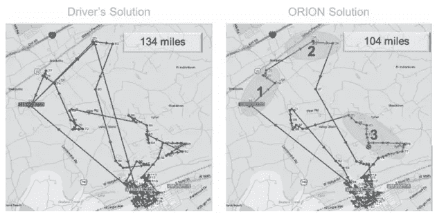

来源:[荷兰等:UPS 优化递送路线](https://courses.ie.bilkent.edu.tr/ie479/wp-content/uploads/sites/16/2020/03/UPS-Optimizes-Delivery-Routes.pdf)

在上图中，左边是司机对路线的解决方案，右边是猎户座的解决方案。在地图上可以看到，猎户座的解决方案比司机的解决方案效率高很多。使用 ORION 软件节省的 30 英里是有区别的。

说到价值，“自从 ORION 最初部署以来，它每年已经为 UPS 节省了大约 1 亿英里和 1000 万加仑的燃料。”— [UPS](https://about.ups.com/ae/en/newsroom/press-releases/innovation-driven/ups-to-enhance-orion-with-continuous-delivery-route-optimization.html)

这肯定会给他们带来超越竞争对手的竞争优势。正如您在这里看到的，优化为 UPS 提供了巨大的价值。

## 例子 2:美国陆军

我的下一个例子很经典。最早的优化问题之一可以追溯到 20 世纪 30 年代。在第二次世界大战期间，陆军想找出如何在满足健康饮食的营养需求的同时，最大限度地降低在战场上喂养美国大兵的成本。

由[马丁·亨德里克斯](https://unsplash.com/es/@m71?utm_source=medium&utm_medium=referral)在 [Unsplash](https://unsplash.com?utm_source=medium&utm_medium=referral) 上拍摄的照片

研究这个问题的经济学家乔治·斯蒂格勒发现，最佳饮食包括以下 5 种食物:370 磅。小麦粉，57 罐奶粉，111 磅。卷心菜，23 磅。菠菜和 285 磅。干海军豆。

这不是听起来最美味的饮食，但它每年只需花费 39.93 美元。有趣的是，按照今天的价格，大约是 831 美元。

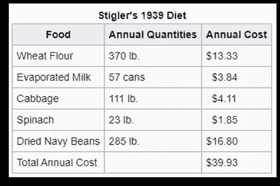

来源:[维基百科](https://en.wikipedia.org/wiki/Stigler_diet)

这种饮食最大限度地降低了成本，同时也满足了以下营养需求。

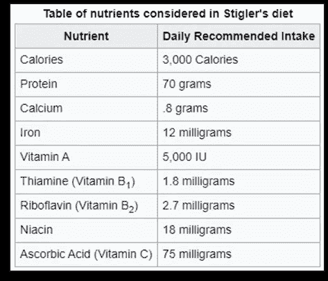

来源:[维基百科](https://en.wikipedia.org/wiki/Stigler_diet)

在战争时期，最小化成本是至关重要的，因此，这个优化问题对军队来说具有巨大的价值。

# 无约束与约束优化

形象地说，如果我们思考优化是什么，它只是寻找最大值点或最小值点。

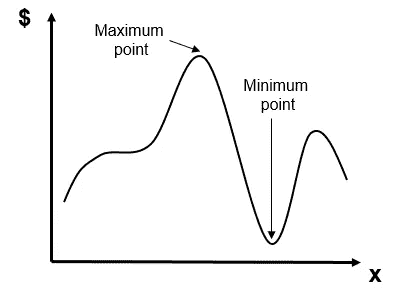

来源:作者

在上图中，我们有一个**无约束优化**的例子，其中最高峰是最大值点，最低点是最小值点。

然而在现实中，我们有约束，所以，图表看起来更像这样。

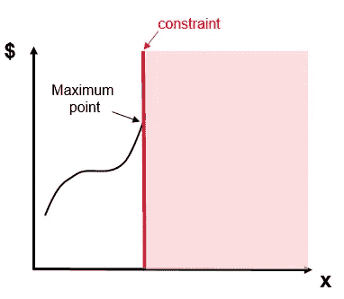

来源:作者

我们将受到限制，因为我们处在一个资源有限的世界。例如，一天只有 24 小时。我的银行账户里只有 X 美元。我们能利用的资源有限。

红线代表约束，由于约束，我们的最大点不再是最高峰，而是在峰的一半左右。上图展示了**约束优化**，这是我们在讨论优化问题时通常会遇到的优化类型。

# 优化问题的三个核心要素

现在让我们进入任何优化问题的三个核心要素。我将使用前面提到的斯蒂格勒饮食问题作为这些核心要素的例子。

> 1.目标函数
> 
> 2.决策变量
> 
> 3.限制

## 目标函数

前面我们讨论了“最好”这个词。谈到优化，我们试图找到最佳解决方案。目标函数将帮助我们衡量什么是最好的。

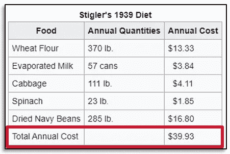

来源:[维基百科](https://en.wikipedia.org/wiki/Stigler_diet)

在饮食问题中，“最好”意味着年度总成本最小化。因此，年度总成本是我们衡量解决方案质量的标准。也就是说，年总成本越小，解决方案越好。

## 决策变量

决策变量是你必须做出决定的事情。这些事情是可以调整的，或者换句话说，这些事情是在你的控制之内的。您不知道最佳值是多少，但优化求解程序会为您选择最佳值。

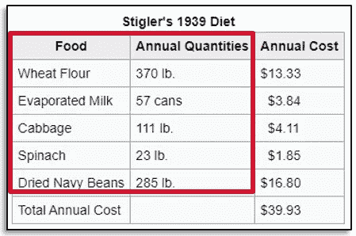

来源:[维基百科](https://en.wikipedia.org/wiki/Stigler_diet)

在饮食问题上，斯蒂格勒必须弄清楚给士兵喂什么食物，每种食物吃多少。食物的种类和数量是这个问题的决策变量。

## 限制

约束是对这些决策的限制。在饮食问题上，斯蒂格勒有以下营养限制。

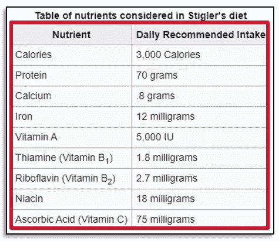

来源:[维基百科](https://en.wikipedia.org/wiki/Stigler_diet)

一个成年人每天需要 3000 卡路里，70 克蛋白质，等等。选择的饮食需要满足这些要求。这个元素非常重要，因为软件可以为你计算并找到最佳解决方案，但它不理解现实。你必须为机器翻译现实生活中的约束，否则，你可能会得到一个实际上没有意义的解决方案。

## 解决办法

我们一直在使用解决方案这个词，所以让我们明确定义一些与解决方案相关的术语。

*   **解**是每个决策变量的一组值。比如 5 斤菠菜。这可能是一个解决方案。20 磅菠菜。这可以是另一种解决方案。
*   一个**可行的解决方案**是一个实际可行的解决方案。也就是满足我们约束的解决方案。如果 20 磅菠菜足以满足营养需求，那么这是一个可行的解决方案。
*   为我们提供最佳价值的一个可行解决方案是我们的**最优解决方案**。在饮食问题上，那就是 23 斤菠菜。

# 最优化问题 1

既然我们已经了解了所有的术语，让我们来看看一个超级简单的玩具优化问题。它应该非常简单，以便帮助你轻松地建立一个优化问题的思维模式。这里的想法是学习使用我们所学的术语来构建一个优化问题，并理解优化是如何工作的，所以不要太担心解决方案。

照片由[June gathere cole](https://unsplash.com/@talkingslipper?utm_source=medium&utm_medium=referral)在 [Unsplash](https://unsplash.com?utm_source=medium&utm_medium=referral)

这是我们手头的问题。

*   所以毛毛有限责任公司希望利润最大化。
*   他们有两种产品:可爱的独角兽枕头和丰满的猫娃娃。
*   它是如此蓬松有限责任公司有足够的雪尼尔材料生产最多 2 个可爱的独角兽枕头。
*   它是如此蓬松有限责任公司有足够的面料生产最多 3 个丰满的猫娃娃。
*   可爱的独角兽获利 15 美元，胖猫获利 10 美元。

花一分钟思考一下这个优化问题的三个核心组成部分是什么。这里有一个提醒，如果你忘记了核心组件。

> 1.目标函数
> 
> 2.决策变量
> 
> 3.限制

**的目标函数是什么？我们想为公司获取最大利润。利润是独角兽枕头的价格乘以售出的独角兽枕头的数量，再加上猫娃娃的价格乘以售出的猫娃娃的数量。**

什么是**决策变量**？公司可以决定哪些事情？要制作的可爱独角兽枕头的数量和要制作的丰满猫娃娃的数量。

**面临的制约**有哪些？由于材料限制，最多只能有 2 个可爱的独角兽枕头和 3 个丰满的猫娃娃。

另一件值得注意的事情是，不可能生产少于 0 个独角兽枕头或 0 个猫娃娃。虽然这对我们来说是直观和符合逻辑的，但是将这些约束构建到问题中是一个很好的实践。您希望避免计算机可能输出不合逻辑的解的情况，例如在这种情况下输出负数。

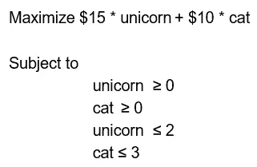

来源:作者

让我们把刚刚想到的组件转换成图形形式，以便可视化问题。

下图中的 X 轴和 Y 轴是我们的决策变量。现在让我们画出我们的约束。在你向下滚动之前，花一点时间考虑一下如何在这个图上画出约束条件。

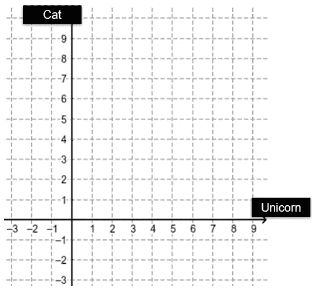

来源:作者

它应该看起来像下面这样。图上的红线代表我们应用于这个优化问题的约束。我们在 0 和 2 处有一条垂直线，在 0 和 3 处有一条水平线。我用绿色标出了可行解空间，用红色标出了不可行解空间。

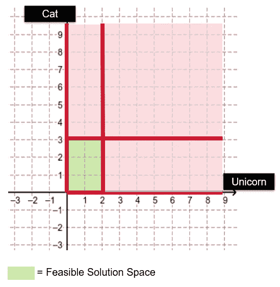

来源:作者

在绿色的可行解空间中，我们现在要找到独角兽和猫的最佳数量。记得之前，独角兽枕头的利润是 15 美元，猫娃娃的利润是 10 美元。如果该公司生产 1 个独角兽枕头和 0 个猫娃娃，它将赚 15 美元。如果该公司生产 2 个独角兽枕头和 1 个猫娃娃，它将赚 40 美元。诸如此类。

我已经计算了下图中每个可行方案的利润。那么哪一个是最优解呢？也就是说，哪一个会帮助我们实现利润最大化？

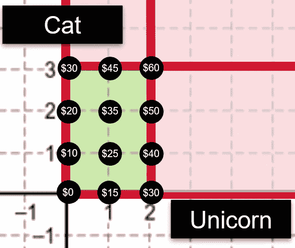

来源:作者

利润最高的是 60 美元，这里制作了 2 个毛绒绒的独角兽枕头和 3 个胖乎乎的猫娃娃。

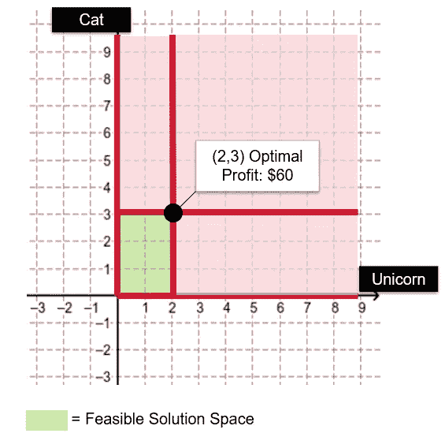

来源:作者

**最优解**:蓬松独角兽= 2，丰满猫= 3

解决方案是合乎逻辑的，不需要经过这些步骤，但这里的想法是建立对如何构建优化问题的理解，就像我们刚刚做的那样。这很重要，因为计算机执行计算来为你找到解决方案，但是你必须为计算机正确地建立问题。

# 最优化问题 2

在问题 1 的基础上，现在让我们给问题添加一个额外的约束。

*   这个小有限责任公司的人力一天最多只能生产 4 种产品。

这对现在的事情有什么影响？我们有一个额外的约束需要添加到问题中，但其他一切都保持不变。

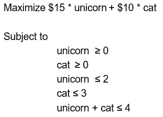

来源:作者

现在，让我们也将这个约束添加到图形形式中。下面的红色斜线是我们刚刚添加的新约束。由于这个附加约束，绿色矩形右上角的三角形区域不再是绿色的。

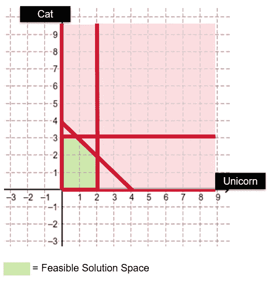

来源:作者

因此，在我们可行的解决方案范围内，这是每种解决方案的利润。

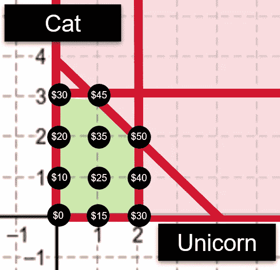

来源:作者

最高利润为 50 美元，其中制作了 2 个毛绒绒的独角兽枕头和 2 个丰满的猫娃娃。

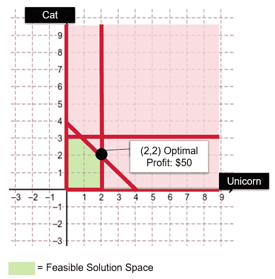

来源:作者

**最优解**:蓬松独角兽= 2，丰满猫= 2

# 问题 1 对问题 2

如果我们比较问题 1 的解决方案和问题 2 的解决方案，您会注意到什么？

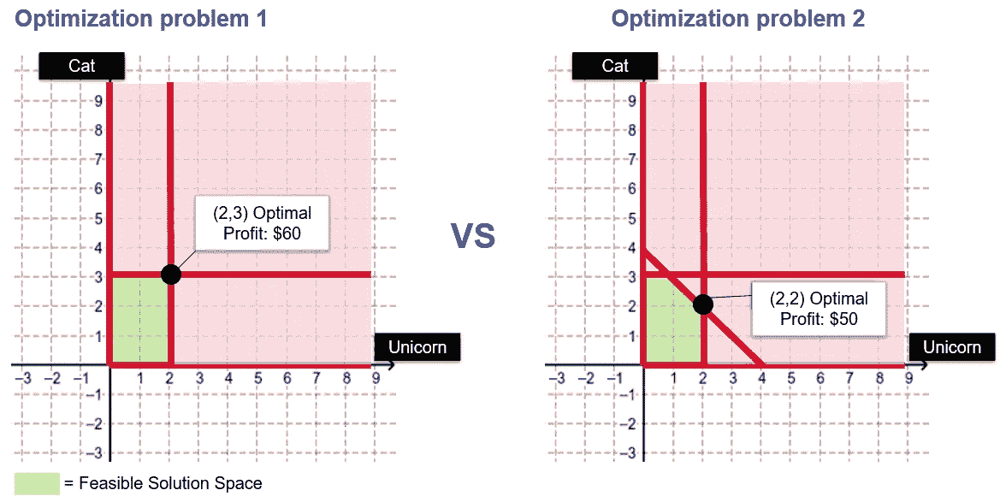

来源:作者

在问题 2 中，我们的可行解空间较小。问题 2 中的利润较低。

## 发生了什么事？

一个额外的约束减少了我们的可行解空间，使我们的解变得更糟。在设置问题时，记住这一点很重要。你想添加的约束是必须的吗？因为我们越放松约束，优化软件就有越多的空间去寻找更好的解决方案。

> 感谢您的阅读，希望您在学习优化的过程中获得乐趣。