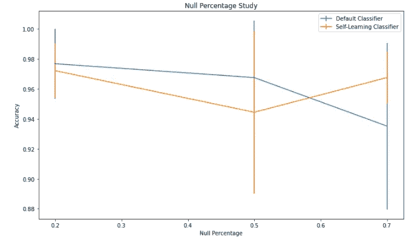
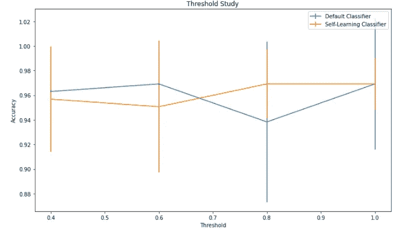
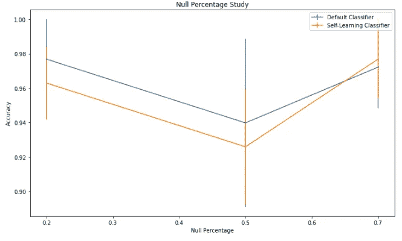
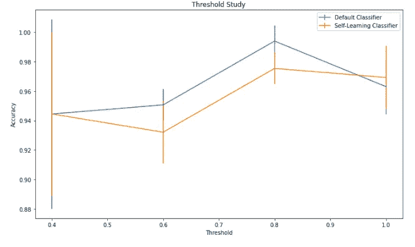

# 自学入门

> 原文：<https://towardsdatascience.com/a-gentle-introduction-to-self-learning-5d6d40349f7c>

## 使用 Python 实现


格伦·卡斯滕斯-彼得斯在 [Unsplash](https://unsplash.com?utm_source=medium&utm_medium=referral) 上拍摄的照片

在这篇文章中，我们将介绍自我学习的主题，然后从头开始实施两个简单的自我学习策略(几乎)来巩固我们的知识。

这个帖子是基于[1]和[2]的天方夜谭。

但首先，让我们谈谈什么是自我学习，以及作为一名数据科学家，为什么它是一个需要添加到您的工具箱中的相关工具。

我们现在都知道，可用数据的数量已经增长了很多，这导致了深度学习模型的重生，使机器学习领域作为一个整体达到了一个新的性能目标。

然而，即使有大量数据可用，标记的数据也很少。这是因为标注数据困难、昂贵且缓慢。因此，我们有大量未标记的数据，我们必须对它们有所了解。

另一方面，机器学习最成熟的领域是监督学习。正如我们许多人所知，处理无监督学习可能相当困难。正因为如此，什么是更好的，有一点点标记的数据还是去一个完全无监督的方法？

好吧，我没有能力回答这个问题，但因为它，半监督学习的领域已经到来。这个领域的重点是通过使用少量的已标记数据来理解大量的未标记数据。这种情况通常出现在图形问题中。

自我训练是进行半监督学习的一种方法。让我们深入研究一下。

这篇文章的代码可以在我的 [GitHub](https://github.com/TNanukem/paper_implementations/blob/main/Self-Training%20-%20Introduction.ipynb) 和 [Kaggle](https://www.kaggle.com/tiagotoledojr/an-introduction-to-self-training) 上找到。

# 谈论自我训练

自我训练背后的主要思想是使用标记和未标记的数据，让您的模型(或多个模型)从自身(或彼此)学习。

在这个过程中，你不仅要教会模型数据的模式，还要教会它如何使用未标记的数据来继续学习。

在这篇文章中，我们将探讨两种自我训练的方法:伪标记和双分类器自我训练。

# 伪标记

伪标记的思想是为未标记的数据生成标记，然后使用这个新的标记数据用比以前看到的更多的信息来重新训练模型。

当然，当您的模型出错时，这可能会有问题，这就是为什么我们不预测整个测试集，然后重新训练模型。我们将通过仅添加我们的模型更有信心的预测来迭代。我们通过选择最高的分类概率来做到这一点，因此，为了做到这一点，我们必须使用校准的分类器[2]。

让我们从定义要使用多少次伪标签迭代开始我们的代码。我们还将加载葡萄酒数据集，并定义一些参数供我们测试，以查看该方法如何改善或恶化结果:

```
pseudo_label_iters = 20
thresholds = [0.4, 0.6, 0.8, 1]
null_percs = [0.2, 0.5, 0.7]# Data Loading
df = datasets.load_wine()
```

我们将把结果与没有在伪标记数据上训练的分类器进行比较。我们将迭代空值的百分比和阈值，以定义哪个是高置信度预测。

我们还将校准我们的分类器，并用 GridSearch 超参数优化器对其进行优化。

```
rf = RandomForestClassifier(n_jobs=-1)parameters = {
    'n_estimators': [10, 50],
    'class_weight': [None, 'balanced'],
    'max_depth': [None, 5, 10]
}results = pd.DataFrame()for threshold in tqdm(thresholds):
    for null_perc in null_percs:

        # Creating a test set for us to validate our results (and compare to a non-self-learning classifier)
        X_train, X_test, y_train, y_test = train_test_split(
            df.data, df.target, test_size=0.3, shuffle=True)

        # Randomly removing null_perc % of labels from training set
        rng = np.random.RandomState()
        random_unlabeled_points = rng.rand(y_train.shape[0]) < null_percy_train[random_unlabeled_points] = -1
        new_y_train = y_train.copy()# Training loop
        for i in range(pseudo_label_iters):# Select the labeled set
            X = X_train[np.where(new_y_train != -1)]
            y = new_y_train[np.where(new_y_train != -1)]# Select the unlabeled set
            X_un = X_train[np.where(new_y_train == -1)]
            y_un = new_y_train[np.where(new_y_train == -1)]if len(y_un) == 0:
                break# Hyperparameter optimization
            rf_ = GridSearchCV(rf, parameters, cv=2).fit(X, y).best_estimator_# Probability Calibration    
            calibrated_clf = CalibratedClassifierCV(base_estimator=rf_,
                                                    cv=2,
                                                    ensemble=False)
            calibrated_clf.fit(X, y)
            preds = calibrated_clf.predict_proba(X_un)# Adding the high confidence labels
            classes = np.argmax(preds, axis=1)
            classes_probabilities = np.max(preds, axis=1)high_confidence_classes = classes[np.where(classes_probabilities >= threshold)]y_un[np.where(classes_probabilities >= threshold)] = high_confidence_classesnew_y_train[np.where(new_y_train == -1)] = y_un# Validation
        X = X_train[np.where(new_y_train != -1)]
        y = new_y_train[np.where(new_y_train != -1)]
        calibrated_clf.fit(X, y)y_pred_self_learning = calibrated_clf.predict(X_test)X = X_train[np.where(y_train != -1)]
        y = y_train[np.where(y_train != -1)]calibrated_clf.fit(X, y)
        y_pred = calibrated_clf.predict(X_test)

        results = pd.concat([results, pd.DataFrame([{
            'threshold': threshold, 'null_perc': null_perc,
            'normal_acc': accuracy_score(y_test, y_pred),
            'pseudo_acc': accuracy_score(y_test, y_pred_self_learning)
        }])])
```

在这里，我们可以看到改变数据中的空值百分比后的结果:



伪标签的零百分比变化。由作者开发

这里我们有阈值变化:



伪标记的置信阈值变化。由作者开发

正如我们所看到的，自我训练方法开始产生更好的平均结果，并且变化越少，空值越多，我们对预测越有信心。尽管如此，差异并不明显，主要是因为我们处理的是一个相当小的“简单”数据集。

# 两个分类器自训练

这种类型的自我训练看起来像伪标记，但我们不是每次都使用同一个分类器，而是使用两个分类器。在每一步，我们将在可用数据上训练一个分类器，然后我们将预测下一批新数据。然后，我们切换我们正在使用的分类器，这样做几次。

因此，我们试图使模型更加健壮，因为我们总是根据前一个分类器的输入来提供新的分类器。

对于这个实现，我们将依赖于我们为伪标签制作的概念。

```
from sklearn.neural_network import MLPClassifier
rf = RandomForestClassifier(n_jobs=-1)
mlp = MLPClassifier()rf_param = {
    'n_estimators': [10, 50],
    'class_weight': [None, 'balanced'],
    'max_depth': [None, 5, 10]
}mlp_param = {
    'hidden_layer_sizes': [(50,), (50, 50), (5, 50, 50)],
    'alpha': [0.0001, 0.001, 0.01]
}results = pd.DataFrame()for threshold in tqdm(thresholds):
    for null_perc in null_percs:

        # Creating a test set for us to validate our results (and compare to a non-self-learning classifier)
        X_train, X_test, y_train, y_test = train_test_split(
            df.data, df.target, test_size=0.3, shuffle=True)

        # Normalizing the data
        scaler = StandardScaler()
        X_train = scaler.fit_transform(X_train)
        X_test = scaler.transform(X_test)

        # Randomly removing null_perc % of labels from training set
        rng = np.random.RandomState()
        random_unlabeled_points = rng.rand(y_train.shape[0]) < null_percy_train[random_unlabeled_points] = -1
        new_y_train = y_train.copy()# Training loop
        for i in range(pseudo_label_iters):
            # Choose the classifier to use
            if i % 2 == 0:
                clf = rf
                parameters = rf_param
            else:
                clf = mlp
                parameters = mlp_param# Select the labeled set
            X = X_train[np.where(new_y_train != -1)]
            y = new_y_train[np.where(new_y_train != -1)]# Select the unlabeled set
            X_un = X_train[np.where(new_y_train == -1)]
            y_un = new_y_train[np.where(new_y_train == -1)]if len(y_un) == 0:
                break# Hyperparameter optimization
            clf_ = GridSearchCV(clf, parameters, cv=2).fit(X, y).best_estimator_# Probability Calibration    
            calibrated_clf = CalibratedClassifierCV(base_estimator=clf_,
                                                    cv=2,
                                                    ensemble=False)
            calibrated_clf.fit(X, y)
            preds = calibrated_clf.predict_proba(X_un)# Adding the high confidence labels
            classes = np.argmax(preds, axis=1)
            classes_probabilities = np.max(preds, axis=1)high_confidence_classes = classes[np.where(classes_probabilities >= threshold)]y_un[np.where(classes_probabilities >= threshold)] = high_confidence_classesnew_y_train[np.where(new_y_train == -1)] = y_un# Validation
        X = X_train[np.where(new_y_train != -1)]
        y = new_y_train[np.where(new_y_train != -1)]
        calibrated_clf.fit(X, y)y_pred_self_learning = calibrated_clf.predict(X_test)X = X_train[np.where(y_train != -1)]
        y = y_train[np.where(y_train != -1)]calibrated_clf.fit(X, y)
        y_pred = calibrated_clf.predict(X_test)

        results = pd.concat([results, pd.DataFrame([{
            'threshold': threshold, 'null_perc': null_perc,
            'normal_acc': accuracy_score(y_test, y_pred),
            'pseudo_acc': accuracy_score(y_test, y_pred_self_learning)
        }])])
```

至于结果，我们有零百分比变化:



两个分类器的百分比变化为零。由作者开发

阈值变化:



两个分类器的置信阈值变化。由作者开发

由于在这种情况下，我们使用了两个分类器，因此可以合理地预期数据量越大越好，即使它是未标记的。正如我们从结果中看到的，自我训练方法勉强能够克服默认分类器。

# 结论

正如我常说的，数据科学是关于使用正确的工具解决业务问题，而自我培训是你工具箱中应该有的另一种工具，可以帮助你处理一系列新问题。

关于它还有很多内容要讲，但是我希望这个初步的介绍可以帮助您入门。

[1]阿米尼，马西-雷扎&费奥法诺夫，瓦西里&保莱托，洛伊奇&德维杰夫，艾米莉&马克西莫夫，尤里。(2022).自我训练:一项调查。

[2][https://sci kit-learn . org/stable/modules/calibration . html # calibration](https://scikit-learn.org/stable/modules/calibration.html#calibration)