# 高级 SQL 窗口函数简易指南

> 原文：<https://towardsdatascience.com/a-guide-to-advanced-sql-window-functions-f63f2642cbf9>

## [小窍门](https://towardsdatascience.com/tagged/tips-and-tricks)

# 高级 SQL 窗口函数简易指南

## 数据科学家和分析师的必备知识


本·米歇尔在 [Unsplash](https://unsplash.com?utm_source=medium&utm_medium=referral) 上的照片

本文是关于 SQL 中数据分析的高级窗口函数的指南。这绝对是数据科学家和分析师必须知道的。我将首先介绍什么是窗口函数，为什么你应该使用它们，以及 3 种类型的窗口函数。接下来，我将通过现实生活中的例子来展示如何使用这些函数。

# 什么是窗口函数？

窗口函数于 2003 年首次引入标准 SQL。根据[PostgreSQL 文件](https://www.postgresql.org/docs/9.1/tutorial-window.html):

> “一个*窗口函数*对一组与当前行有某种关联的表行执行计算…在后台，窗口函数能够访问的不仅仅是查询结果的当前行。”

窗口函数类似于 GROUP BY 子句中完成的聚合。但是，行不会组合成一行，每一行都保留它们各自的标识。也就是说，窗口函数可以为每行返回一个值。这是我的意思的一个很好的形象化的例子。

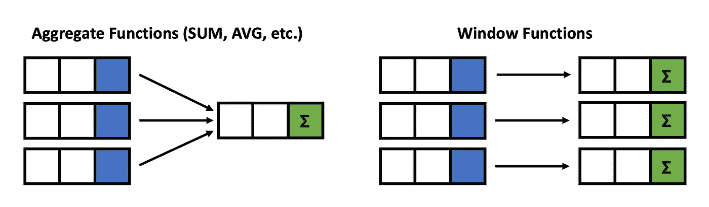

作者图片

请注意图片左侧的 GROUP BY 聚合是如何将三行组合成一行的。图片右侧的窗口函数能够输出每一行的聚合值。这可以使您不必在分组后进行连接。

## 示例:分组依据与窗口函数

这里有一个简单的例子，让你体会一下窗口函数的作用。

假设我们有一些工资数据，我们想创建一个列，给出每个职位的平均工资。


示例工资数据-按作者分类的图像

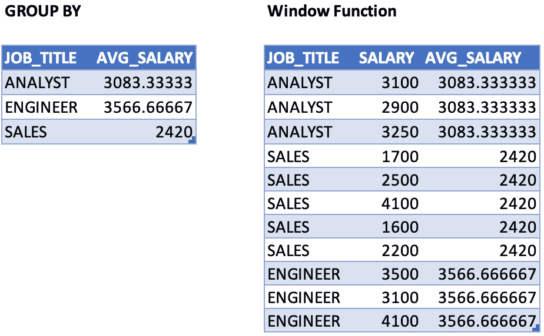

分组依据与窗口功能—按作者排序的图像

左边是`GROUP BY`聚合将返回的内容，右边是窗口函数将返回的内容。如您所见，group by 将我们的数据合并为三行。通过一个窗口函数，我们保留了原来的 11 行，并增加了一个名为 AVG 薪水的新列。如果需要，我们可以选择将每个人的工资与平均工资进行比较。

# 为什么要使用窗口函数？

窗口函数的一个主要优点是，它允许您同时处理聚合值和非聚合值，因为行不会折叠在一起。

窗口函数也很容易使用和阅读。也就是说，它们可以降低查询的复杂性，这使得以后的维护更加容易。

此外，它们还可以帮助解决性能问题。例如，您可以使用窗口函数，而不必进行自连接或交叉连接。

我保证，窗口函数真的很神奇，知道它真的很棒。


照片由[布雷特·乔丹](https://unsplash.com/@brett_jordan?utm_source=medium&utm_medium=referral)在 [Unsplash](https://unsplash.com?utm_source=medium&utm_medium=referral) 拍摄

# 重要提示:

在我们开始之前，需要注意的是，根据 SQL 中的操作顺序，窗口函数在列表中排在第六位。

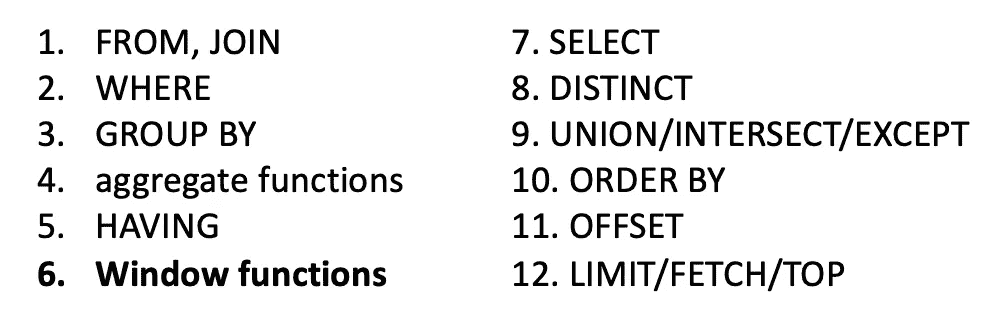

作者图片

这很重要，因为基于这种逻辑顺序，窗口函数在`SELECT`和`ORDER BY,`中是允许的，但在`FROM`、`WHERE`、`GROUP BY`或`HAVING`子句中是不允许的。

> *注意:如果您确实需要将它放在* `*WHERE*` *子句或* `*GROUP BY*` *子句中，您可以通过使用子查询或* `*WITH*` *查询来避开这个限制。*

# 窗口函数语法

下面是`SELECT`子句中窗口函数的一般语法。

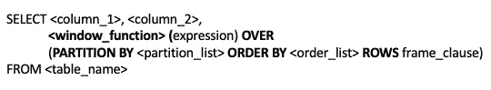

作者图片

这里有很多单词，所以让我们来看看一些定义:

*   **window_function** 是我们要使用的窗口函数的名称；例如，sum、avg 或 row_number(我们将在后面了解更多)
*   表达式是我们希望窗口函数操作的列的名称。根据所使用的 window_function，这可能不是必需的
*   **在**上只是表示这是一个窗口功能
*   **PARTITION BY** 将行划分为多个分区，这样我们可以指定使用哪些行来计算窗口函数
*   **partition_list** 是我们想要进行分区的列的名称
*   **ORDER BY** 用于对每个分区中的行进行排序。这是可选的，不必指定
*   **order_list** 是我们要排序的列的名称
*   如果我们想进一步限制分区中的行，可以使用行**。这是可选的，通常不使用**
*   **frame_clause** 定义从当前行偏移多少

不要担心记住定义和语法，甚至不要担心完全理解它的确切含义。一旦你看了文章中的例子，并对如何编写窗口函数有了直观的理解，一切都会变得更有意义。

## 快速示例

为了帮助你更好地理解语法的真正工作原理，下面是一个窗口函数在实践中的例子。

这是一个查询，它将生成我们前面看到的关于职位工资的输出。


这里， **AVG()** 是窗口函数的名称，**薪资**是表达式， **JOB_TITLE** 是我们的分区表。我们没有使用 ORDER BY，因为不需要它，我们也不想使用行，因为我们不想进一步限制我们的分区。

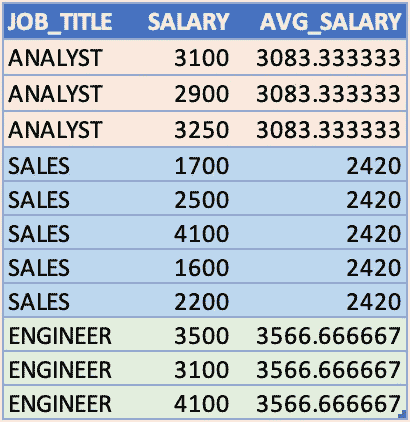

作者图片

同样，现在不需要记忆语法。在这个阶段，我希望您理解的一个概念是，窗口函数为“窗口”或“分区”中的每一行计算一个值。窗口可以是多行中的一行，由子句`PARTITION BY`指定。在我们的例子中，我们按照职位进行了划分。正如你在上面的片段中看到的，我用不同的颜色突出显示了每个职位。每种颜色代表不同的“窗口”或不同的“分区”。窗口函数为每个分区计算一个平均薪金值。

# **窗口功能列表**

现在你知道了语法，让我们看看不同种类的窗口函数，它们可以代替下面的红色字体。

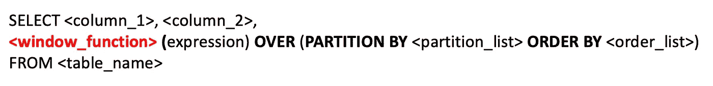

作者图片

有三种主要类型的窗口函数可供使用:聚合函数、排名函数和值函数。在下图中，您可以看到属于每个组的一些函数的名称。

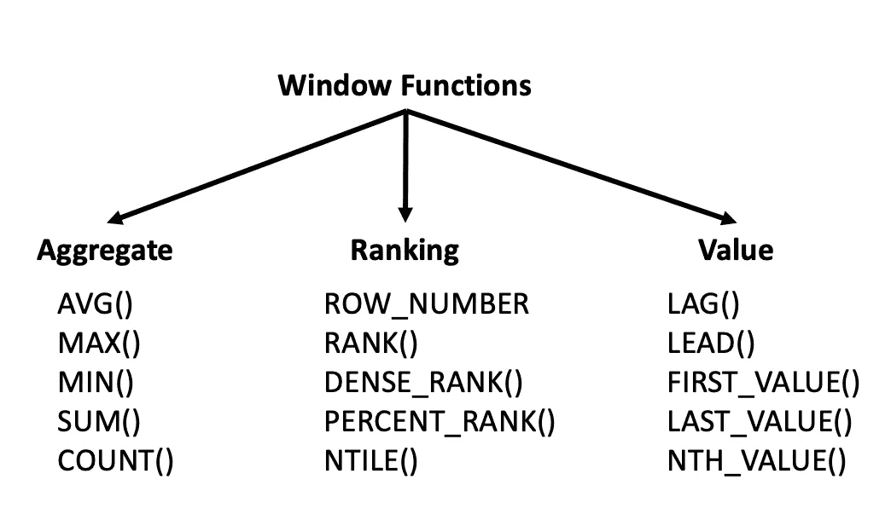

作者图片

下面是对每种窗口函数用途的一个快速概述。

**聚合函数:**我们可以使用这些函数来计算各种聚合，例如平均值、总行数、最大值或最小值，或者每个窗口或分区内的总和。

**排名函数:**这些函数对于在其分区内对行进行排名非常有用。

**值函数:**这些函数允许您比较分区内前一行或后一行的值，或者分区内的第一个或最后一个值。

# **窗口功能练习**

现在让我们开始做一些有趣的练习来帮助你真正掌握窗口函数是如何工作的。我们将对聚合函数、排名函数和价值函数进行各种练习。

## 数据

对于下面的示例问题，我使用的数据来自位于[这个网站](https://github.com/jpwhite3/northwind-SQLite3)上的 Northwind 数据库。参见 Northwind_small.sqlite，该文件也可以在我的 github repo 中找到。

> *根据下载源，“Northwind 示例数据库随 Microsoft Access 一起提供，作为管理小型企业客户、订单、库存、采购、供应商、运输和员工的教学模式。Northwind 是一个优秀的小型企业 ERP 教程模式，包括客户、订单、库存、采购、供应商、运输、员工和单一条目会计。*

数据库的完整模式显示在上面链接的网站上。对于本文中的示例，我将只使用[Order]和[OrderDetail]表。

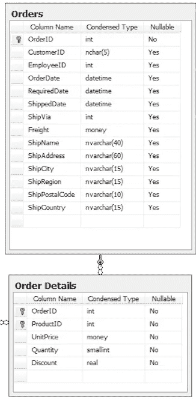

来源:[https://github.com/jpwhite3/northwind-SQLite3](https://github.com/jpwhite3/northwind-SQLite3)

# 聚合函数

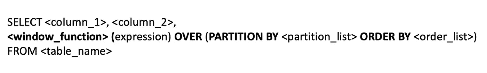

作者图片

## 练习 1:创建一个新列来计算每个 CustomerId 的平均单价

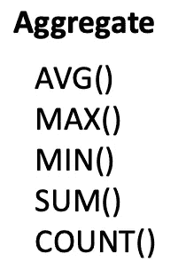

作者图片

从左边列出的聚合窗口函数列表中，我们可以看到 AVG()将是我们想要使用的窗口函数。我们的表达式将是单价列，因为我们要计算单价的平均值。

接下来，我们需要弄清楚我们想要如何分区。也就是说，为了创建我们的分区，应该如何将这些行组合在一起？练习语句告诉我们找到每个 CustomerId 的平均价格。这告诉我们，我们希望对具有相同 CustomerId 的行进行分组，因此这将是我们的分区列表的一部分。在本练习中，我们不使用 ORDER BY。下面是我们的查询看起来像什么。

```
SELECT CustomerId, 
       UnitPrice, 
       **AVG(UnitPrice) OVER (PARTITION BY CustomerId) AS “AvgUnitPrice”**
FROM [Order] 
INNER JOIN OrderDetail ON [Order].Id = OrderDetail.OrderId
```

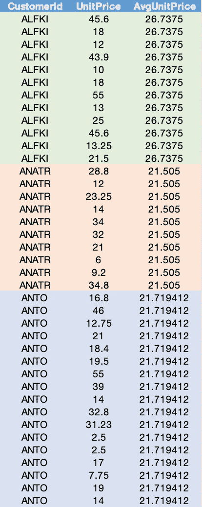

作者图片

正如您在上面的图像中看到的，计算了 CustomerId 的每个分区的平均单价。

以下是一些你可以自己尝试的练习:

1.  创建计算每个 CustomerId 的最大折扣的新列
2.  创建一个新列来计算每个产品 Id 的最小单价

## 练习 2:创建一个新列来计算每组 CustomerId 和 EmployeeId 的平均单价。

您可以选择按多列进行分区。之前，我们计算了每个 CustomerId 组的平均单价。这一次，我们将添加 EmployeeId。

```
SELECT CustomerId, 
       EmployeeId, 
       AVG(UnitPrice) OVER (**PARTITION BY CustomerId, EmployeeId**) AS       “AvgUnitPrice”
FROM [Order] 
INNER JOIN OrderDetail ON [Order].Id = OrderDetail.OrderId 
```

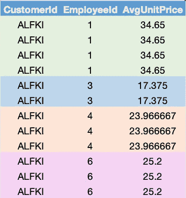

作者图片

请注意分区与之前相比有什么变化。这些计算是针对 CustomerId 和 EmployeeId 的每个唯一组进行的，在表中以不同的颜色直观地显示出来。

# 排名功能


作者图片

## 练习 3:创建一个新列，按降序排列每个 CustomerId 的单价。

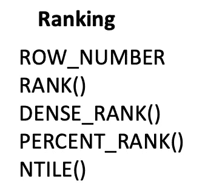

我们可以用三种不同的方法来完成这个练习。

我们将使用左边列表中的前三个排名函数:ROW_NUMBER、RANK 和 DENSE_RANK。

每一个都有稍微不同的数据排序方式。

## 行数

我们可以使用这个函数来显示给定行在其分区中的行号。请注意，对于排名函数，我们不需要像之前对聚合函数那样在括号内指定表达式。

另外，既然是做排名，这里顺序很重要。我们必须确保单价列排序正确，以便正确应用排名。为此，我们可以在`**PARTITION BY.**`之后添加`**ORDER BY UnitPrice DESC**`作为窗口函数的一部分

```
SELECT CustomerId, 
       OrderDate, 
       UnitPrice, 
       **ROW_NUMBER()** OVER (PARTITION BY CustomerId **ORDER BY UnitPrice DESC**) AS “UnitRank”
FROM [Order] 
INNER JOIN OrderDetail 
ON [Order].Id = OrderDetail.OrderId
```

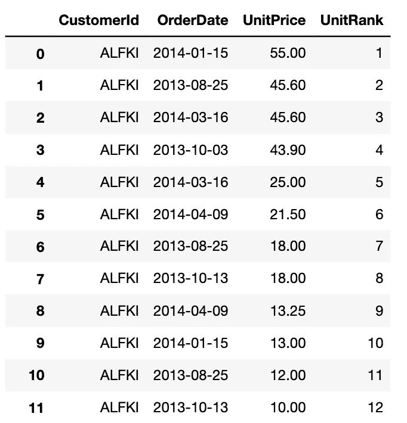

来源:作者

正如您在上面的输出中看到的，我们的 UnitPrice 列是降序排列的，在最后一列中显示了每个客户 id 的单位排名。客户 ALFK 有 12 行，因此等级从 1 到 12。

您可能想知道，如果我在 SQL 语句的末尾而不是在 windows 函数中使用 ORDER BY，会发生什么情况，我会得到相同的结果吗？

花一分钟考虑一下，然后回来。我的顺序是在窗口函数内部还是外部有关系吗？


马库斯·温克勒在 [Unsplash](https://unsplash.com?utm_source=medium&utm_medium=referral) 上拍摄的照片

我们来试试吧！将 ORDER BY 从 windows 函数中移除，并将其添加到末尾。

```
SELECT CustomerId, 
       OrderDate, 
       UnitPrice,    
       ROW_NUMBER() OVER (PARTITION BY CustomerId) AS “UnitRank”
FROM [Order]
INNER JOIN OrderDetail ON [Order].Id = OrderDetail.OrderId
**ORDER BY CustomerId, UnitPrice DESC** 
```

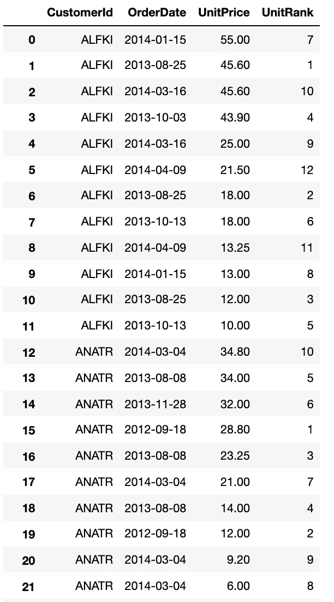

嗯，看起来我们没有得到和之前一样的结果。单价按降序排列正确，但单位的排名看起来不对。为什么不呢？

回想一下 SQL 的操作顺序。窗口函数第六次处理，而 ORDER BY 第十次处理。


作者图片

所以行号是在单价被订购之前创建的。这就是为什么我们得不到相同的结果！有道理。

## 排名()

现在，让我们用 RANK()代替 ROW_NUMBER()。

```
SELECT CustomerId, 
       OrderDate, 
       UnitPrice, 
       **RANK()** OVER (PARTITION BY CustomerId ORDER BY UnitPrice DESC) AS “UnitRank”
FROM [Order] 
INNER JOIN OrderDetail ON [Order].Id = OrderDetail.OrderId
```

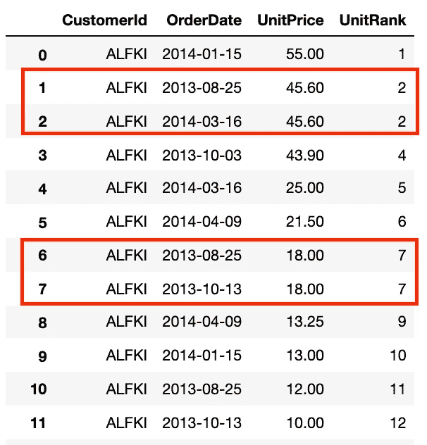

作者图片

现在有什么不同？对于行号，没有重复的数字。但是使用 rank()，如果有多个值具有完全相同的值，RANK 函数会给它们相同的排名。

请注意，在第 2 行和第 3 行中，单价是 45.60，因此这两行的等级都是 2。第 7 行和第 8 行也具有相同的单价，并被赋予相同的等级 7。

还要注意排名跳过了一个数字。例如，在行 3 中，等级跳到 4，因为有两行等级为 2。如果有三行的秩为 2，那么它将跳到秩 5，依此类推。'

如果你不想让它跳过数字呢？嗯，我们可以用 **DENSE_RANK()** 来代替。

## 密集等级()

同样，替换我们的窗口函数为 **DENSE_RANK()** ，其他保持不变。

```
SELECT CustomerId, 
       OrderDate, 
       UnitPrice, 
       **DENSE_RANK()** OVER (PARTITION BY CustomerId ORDER BY UnitPrice DESC) AS “UnitRank”
FROM [Order] 
INNER JOIN OrderDetail ON [Order].Id = OrderDetail.OrderId
```

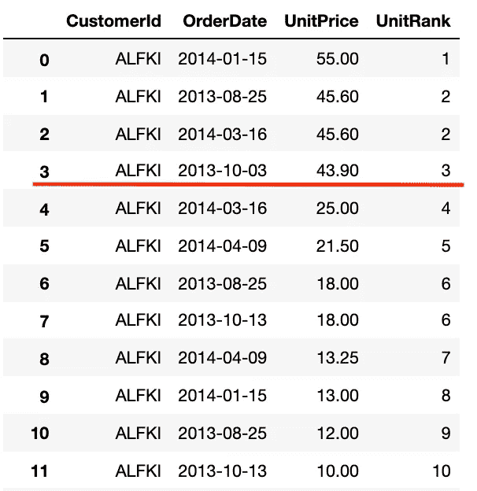

作者图片

它遵循与 RANK()相同的行为，因为如果值相同，那么这些行将被赋予相同的等级。参见第 2 行和第 3 行。请注意，在第 4 行中，等级现在没有跳过一个数字。它是排名 3 而不是 4。

你现在的作业是学习 PERCENT_RANK()和 NTILE()是如何工作的，并亲自尝试这些函数。

# 价值函数

对我来说，值函数可能是窗口函数如此神奇的首要原因。这些函数对于从其他行中提取可能对报表有用的值非常有用。

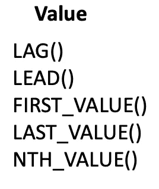

作者图片

我们可以使用 LAG 或 LEAD 函数来帮助我们创建一个能够从其他行提取值的列。LAG 可以从前面的行返回值，而 LEAD 可以从后面的行返回值。在处理时序数据和计算时间差异时，比较前一行或后一行非常有用。

## 练习 4:创建一个新列，为每个产品 Id 提供前一个订单日期的数量。

```
SELECT ProductId, 
       OrderDate, 
       Quantity, 
       **LAG(Quantity) OVER (PARTITION BY ProductId ORDER BY OrderDate) AS "LAG"**
FROM [Order] 
INNER JOIN OrderDetail ON [Order].Id = OrderDetail.OrderId 
```

我们在 Quantity 列上使用 LAG 来返回前一行的值。就像以前一样，我们需要确保我们的数据在我们的窗口函数中是有序的。我们将按订单日期排序。

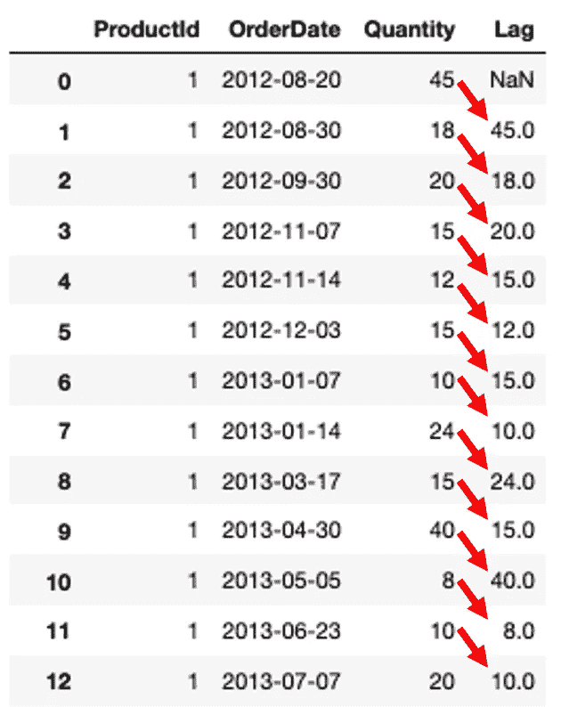

作者图片

正如您在上面的图像中看到的，我们得到了一个包含前一个订单日期数量的列。这非常有用，因为我们可以将当前订单日期与之前的订单日期进行比较，并计算两个时间段的差异。在第一行中，没有以前的订单日期，所以它是 NaN 或 null。

## 练习 5:创建一个新列，为每个产品 Id 提供以下订单日期的数量。

这看起来和我们之前的例子非常相似。但是，这一次，由于我们想要下面的行，我们将使用 LEAD()。

```
SELECT ProductId, 
       OrderDate, 
       Quantity, 
       **LEAD**(Quantity) OVER (PARTITION BY ProductId ORDER BY OrderDate) AS "LEAD"
FROM [Order] 
INNER JOIN OrderDetail ON [Order].Id = OrderDetail.OrderId
```

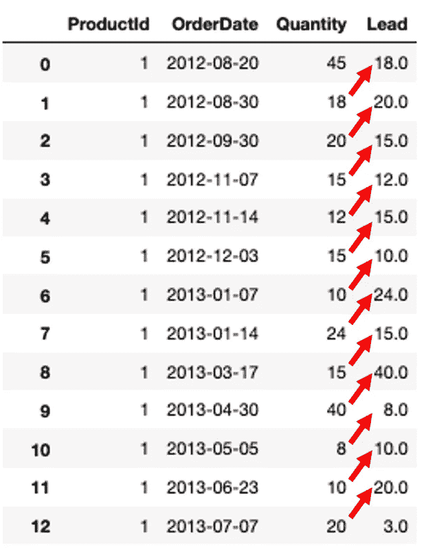

作者图片

如您所见，新的列前导包含下一行的值。

## 练习 6:创建一个新列，提供每个 ProductId 的首次订购数量。

为了获得第一个数量，我们可以使用 **FIRST_VALUE** 函数，它将给出一个分区中的第一个值。

```
SELECT ProductId, 
       OrderDate, 
       Quantity, 
       **FIRST_VALUE**(Quantity) OVER (PARTITION BY ProductId ORDER BY OrderDate) AS "FirstValue"
FROM [Order] 
INNER JOIN OrderDetail ON [Order].Id = OrderDetail.OrderId
```

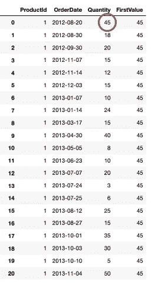

作者图片

如图所示，产品 ID 1 的第一个订单是在 2012 年 8 月 20 日，数量为 45，因此我们得到与产品 1 相关的所有行的值为 45。

这里有一个练习让你自己试试。

1.  创建一个新列，为每个 ProductId 提供第二个订购数量。(提示:使用第 n 个值函数)

## 使用 frame _ 子句

让我们从练习中稍作休息，学习一个还没有讨论过的新概念。


[路博尖塔](https://unsplash.com/@bubo?utm_source=medium&utm_medium=referral)在 [Unsplash](https://unsplash.com?utm_source=medium&utm_medium=referral) 上拍照

您可能还记得开头的定义，我们可以用 frame_clause 指定行来进一步限制我们的窗口大小。我把这个留到最后，因为人们可能会对此有点困惑。我将快速浏览一下语法及其用法，然后让我们看一个例子来真正理解发生了什么。

下面是通用语法的样子

**行之间** <起始 _ 行> **和** <结束 _ 行>

在<starting_row>和<ending row="">中，我们有以下选项可供选择:</ending></starting_row>

*   UNBOUNDED PRECEDING 分区中当前行之前的所有行，即分区的第一行
*   [some #] PRECEDING —当前行之前的行数
*   当前行—当前行
*   [some #] FOLLOWING —当前行之后的行数
*   UNBOUNDED FOLLOWING 分区中当前行之后的所有行，即分区的最后一行

这里有一些如何写的例子:

*   EN 3 前一行和当前行之间的行-这意味着回顾前 3 行直到当前行。
*   无界的前一行和后一行之间的行—这意味着从分区的第一行开始查找，直到当前行之后的第一行
*   EN 5 之前的行和 1 之前的行之间-这意味着回顾前 5 行，直到当前行之前的 1 行
*   无界在前和无界在后之间的行—这意味着从分区的第一行到分区的最后一行

值得注意的是，每当添加 ORDER BY 子句时，SQL 都会将默认窗口设置为未绑定的前一行和当前行之间的行。

## 练习 7:计算每个 CustomerId 的累积移动平均单价。

为了计算累积移动平均值，我们将利用 frame_clause。

```
SELECT CustomerId, 
       UnitPrice, 
       AVG(UnitPrice) OVER (PARTITION BY CustomerId 
       ORDER BY CustomerId 
       **ROWS BETWEEN UNBOUNDED PRECEDING AND CURRENT ROW**) AS “CumAvg”
FROM [Order]
INNER JOIN OrderDetail ON [Order].Id = OrderDetail.OrderId
```

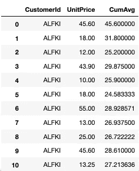

作者图片

在上面的输出中，您可以看到每行都重新计算了平均值。在第 1 行中，只有 1 个数字，因此平均值为 45.60。在第 2 行，累计平均值是 45.60 和 18 的平均值。在第 3 行中，累计值是 45.60、18 和 12 的平均值。诸如此类…

以下是一些你可以自己尝试的练习:

1.  计算每个 CustomerId 的前 5 行到前 3 行的平均数量。
2.  计算每个 CustomerId 的前 2 行到当前行的最小单价


[陈京达](https://unsplash.com/@jingdachen?utm_source=medium&utm_medium=referral)在 [Unsplash](https://unsplash.com?utm_source=medium&utm_medium=referral) 上的照片

如果你准备好参加**挑战**，试试这个奖励游戏。

**挑战练习:**创建一个新列，提供每个产品 Id 的最后订购数量。(提示:使用 LAST_VALUE()窗口函数并考虑分区)

完成这篇文章非常棒！窗口功能非常强大，非常有趣，所以我希望你喜欢这些练习。感谢您的阅读！如果您有反馈或问题，请在下面留言。

如果你正在寻找一份备忘单，点击这里的链接。


安德鲁·舒尔茨在 [Unsplash](https://unsplash.com?utm_source=medium&utm_medium=referral) 上拍摄的照片