# 构建图像重复查找器系统:指南

> 原文：<https://towardsdatascience.com/a-guide-to-building-an-image-duplicate-finder-system-4a46021410f1>

## 你的零英雄指南检测重复和近似重复的图像

图片由来自 [Pixabay](https://pixabay.com/illustrations/koi-fish-painting-japanese-dragon-4410009/) 的 Manu9899 提供

您想识别重复或近似重复的图像吗？或者计算数据集中每个图像的副本数？

**如果是的话，那么这篇文章就是给你的。**

本文的目标有五个方面:

1.  理解图像重复查找器和基于内容的图像检索系统之间的区别
2.  演练比较相似图像的 5 种不同方法的概念
3.  学习 python 中的每个方法实现
4.  确定图像变换对所述算法的整体性能的敏感度
5.  从速度和准确性(包括实验)方面为选择适合您应用需求的最佳方法铺平道路

# 基本架构

首先，我需要定义一个重要的术语。 ***查询图像*** 是用户输入以获取信息的图像。在相似性块的帮助下，系统在数据集中搜索相似的图像，该数据集计算图像彼此的接近程度。图 1 说明了这些步骤。

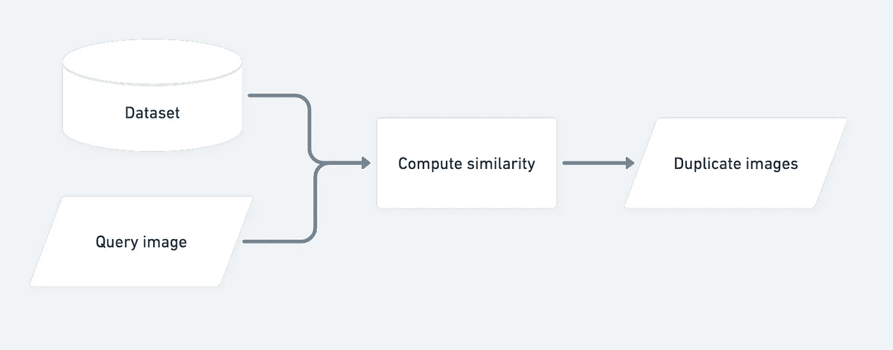

图像 1 —图像重复查找器系统的基本结构(作者提供的图像)

在第 3 节中，我们将研究这个相似性模块，并探索实现该功能的最常见方法。

# 图像重复查找器与基于内容的图像检索系统

这两种系统的主要区别在于，图像重复/近似重复探测器仅检测相同和近似相同的图像(图 2)。另一方面，[基于内容的图像检索(CBIR)](https://en.wikipedia.org/wiki/Content-based_image_retrieval#:~:text=Content%2Dbased%20image%20retrieval%2C%20also,this%20survey%20for%20a%20scientific) 系统搜索相似的感兴趣区域，并显示与这些区域最相似的图像(图像 3)。

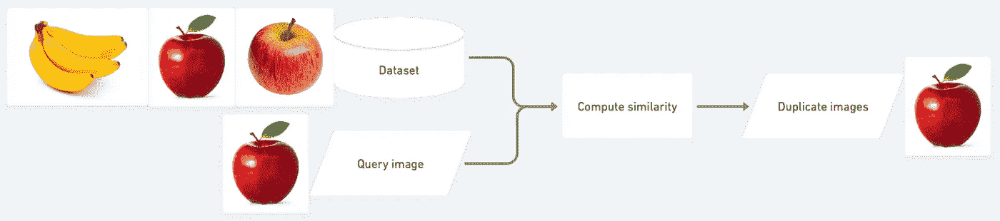

图片 2 —图片重复查找系统的详细示例(图片由作者提供)

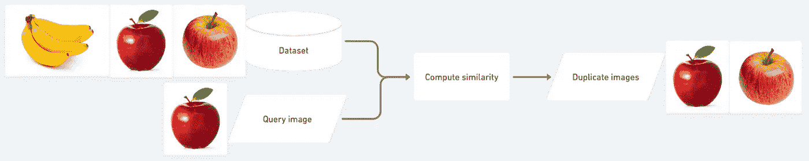

图 3 —基于内容的图像检索系统的详细示例(图片由作者提供)

请注意基于内容的图像检索系统是如何识别苹果并输出不同场景的图像的。

# 比较相似图像的五种常用方法

本文将考察五种主要方法:

1.  欧几里得距离
2.  结构相似性指数度量(SSIM)
3.  图像哈希
4.  余弦相似性
5.  特征的相似性(使用 CNN)

## 1.欧几里得距离

转到第一种方法，如图 4 所示，欧几里德距离是平面上两个数据点之间的直线距离[ [8](https://medium.com/@kunal_gohrani/different-types-of-distance-metrics-used-in-machine-learning-e9928c5e26c7) ]。它也被称为 L2 范数距离度量。

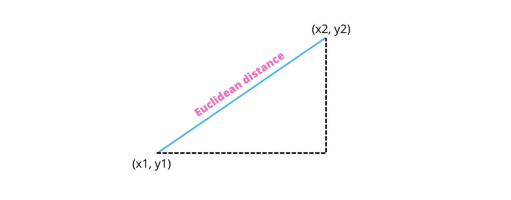

图片 4 —欧几里得距离(图片由作者提供)

我们可以用向量来表示图像。矢量是一个有一个起点和一个终点的量[ [4](https://math.libretexts.org/Bookshelves/Precalculus/Precalculus_(OpenStax)/08%3A_Further_Applications_of_Trigonometry/8.08%3A_Vectors) ]。这两点构成了矢量的两个特征:大小和方向。

在向量空间中，假设我们有两张图片来比较 x =[x1，x2，x3]和 y = [y1，y2，y3]。图 5 显示了通式[ [8](https://medium.com/@kunal_gohrani/different-types-of-distance-metrics-used-in-machine-learning-e9928c5e26c7) ]，而图 6 显示了一个使用示例。

图 5 —欧几里德距离的一般公式(图片由作者提供)

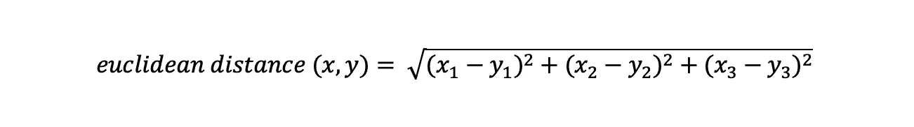

图 6-应用欧几里得距离公式的示例(图片由作者提供)

方法公式很简单。由于它类似于勾股定理公式，所以又称为勾股距离[ [8](https://medium.com/@kunal_gohrani/different-types-of-distance-metrics-used-in-machine-learning-e9928c5e26c7) ]。

在 python 中，实现非常简单:

*   **实现 1:** 使用 Scipy 库

*   **实现 2:** 使用 NumPy 的 linalg.norm ( [引用](https://bit.ly/3yfghJp))

## 2.S **结构相似指数测度** ( **SSIM**

论文 [*图像质量评估:从错误可见性到结构相似性*](https://www.cns.nyu.edu/pub/eero/wang03-reprint.pdf)*[*1*](https://www.cns.nyu.edu/pub/eero/wang03-reprint.pdf)*】介绍了 SSIM 在 2004 年。*它计算两个给定图像之间的相似度，得出一个介于 0 和 1 之间的值。*

*除了寻找副本，它的许多应用之一是测量压缩图像如何影响其质量。此外，它还估计数据传输损失如何严重降低质量[ [2](https://www.imatest.com/docs/ssim/) ]。*

*根据作者的说法，影响该指数的三个主要因素是亮度、对比度和结构。因此，如果这些因素中的一个发生变化，指数也会发生变化。*

*至于实现，它是如下:*

## *3.图像哈希*

*另一种计算两幅图像之间相似性的方法是图像哈希(也称为数字指纹)。这是为每个图像分配唯一哈希值的过程。但是，该方法会导致相同的值。平均散列是许多散列类型中的一种。它的工作方式如下[ [6](https://content-blockchain.org/research/testing-different-image-hash-functions/) ]。此外，请参考图 7 进行澄清。*

1.  *缩小图像尺寸(例如:8x8)*
2.  *将其转换为灰度*
3.  *取其平均值*
4.  *将每个像素与平均值进行比较。如果像素高于平均值，则为其赋值 1，否则为 0*
5.  *构造散列:将 64 位设置为 64 位整数*

*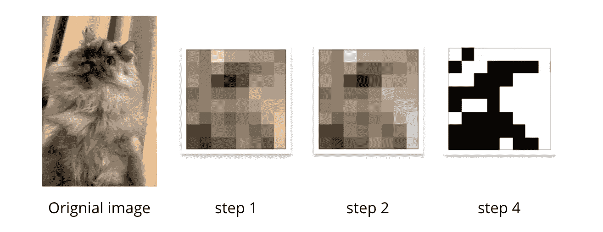*

*图 7 —平均哈希步骤(作者图片)*

*由此产生的 64 位整数 ***可能是*** 的样子:*

*1011111101100001110001110000111101101111100001110000001100001001*

***注*可能*可能**。我们可以用不同的方式来表现这个形象。从左上角开始列出 0 和 1 位(如上例所示)，从右上角开始，依此类推[ [6](https://content-blockchain.org/research/testing-different-image-hash-functions/) ]。*

*最重要的是，如果我们改变长宽比，增加或减少亮度或对比度，甚至改变图像的颜色，其哈希值将是相同的[ [7](https://www.hackerfactor.com/blog/index.php?/archives/432-Looks-Like-It.html) ]，这使其成为比较同一性的最佳方式之一。*

*比较两幅图像的过程如下[ [7](https://www.hackerfactor.com/blog/index.php?/archives/432-Looks-Like-It.html) ]:*

1.  *构建每个图像的散列(按照上面的 5 个步骤)*
2.  *计算[汉明距离](http://en.wikipedia.org/wiki/Hamming_distance)。(通过计算与每个散列不同的比特位置的数量)零距离表示相同的图像。(下面的代码块对此有更好的解释)*

## *4.余弦相似性*

*余弦相似度是一种计算两个向量(可以是图像)相似度的方法，通过取点积并除以每个向量的幅度[ [9](https://clay-atlas.com/us/blog/2020/03/27/cosine-similarity-text-calculate-python/) ]，如下图 8 所示。*

*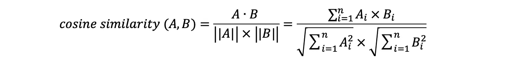*

*图片 8 —余弦相似性方程(图片由作者提供)*

*随着两个向量之间的角度变小，相似性变强[ [9](https://clay-atlas.com/us/blog/2020/03/27/cosine-similarity-text-calculate-python/) ]。如图 9 所示，与 A 和 B 相比，矢量 C 和 B 具有很高的相似性，因为它们的角度非常小。*

*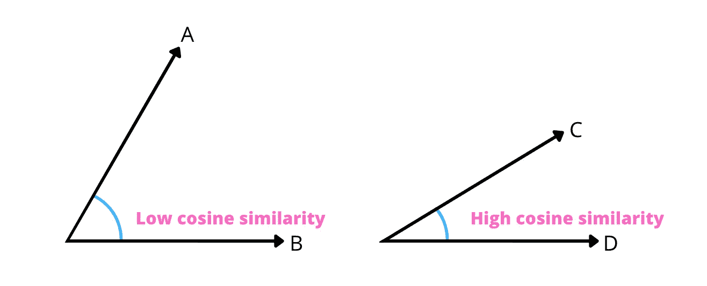*

*图片 9-余弦相似性插图(图片由作者提供)*

*下面是使用 torch 计算两幅 PIL 图像的度量的代码。*

## *5.特征的相似性(使用 CNN)*

*最后一种比较图像的方法是计算特征的相似性。众所周知，卷积神经网络 CNN 可以挑选图像的模式并理解它。卷积层有检测模式的过滤器。图像中的不同图案可以是边缘、形状或纹理。这些图案被称为**特征**。*

*我们可以从 CNN 的卷积层中提取这些特征。图 10 清楚地展示了一个示例架构。通常，我们指定网络的最后一个卷积层用于特征提取。*

*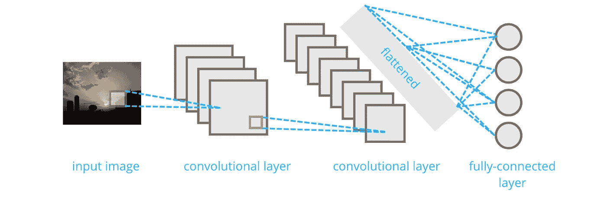*

*图 10——一个简单的 CNN 架构(图片由作者提供)*

*一个伟大的艺术级 CNN 架构是 [EfficientNet](https://arxiv.org/abs/1905.11946) 。这是一种使用复合系数统一缩放所有维度(深度/宽度/分辨率)的缩放方法。我不会深究它，因为它超出了本文的范围。但是，我将在下面的部分中使用它。*

> *通常，数据科学社区在[基于内容的图像检索(CBIR)](https://en.wikipedia.org/wiki/Content-based_image_retrieval#:~:text=Content%2Dbased%20image%20retrieval%2C%20also,this%20survey%20for%20a%20scientific) 系统中广泛使用特征的相似性。实验部分将解释原因。*

***5.1。EfficientNet-b0 和欧几里德距离***

*从 EfficientNet 中提取特征后，我应用欧几里德距离来度量查询和数据集图像的特征之间的相似性，以找到最相似的特征。*

***5.2。EfficientNet-b0 和余弦相似度***

*计算特征的余弦相似性与上一个非常相似。但是，应用余弦相似度而不是欧几里德距离。*

> *在结束这一部分之前，如果得到的相似度是 250、0.04 或 10809 呢？让一对图像相似的数字是多少？答案如下:您必须基于对您选择的数据集的研究或特殊测试来定义这个阈值。*

# *数据集*

*在整个实验中，我使用了两个不同的数据集进行评估:*

*   *[部分成果 360](https://www.kaggle.com/datasets/moltean/fruits?resource=download) 数据集(96 张多尺寸图片)*(license:*[*CC BY-SA 4.0*](https://creativecommons.org/licenses/by-sa/4.0/)*)**
*   *我收集的一个名为 [SFBench](https://www.kaggle.com/datasets/orjwanzaafarani/sfbench) 的数据集由 40 张图片组成(3024 x 4032 px)*(license:*[*CC0:Public Domain*](https://creativecommons.org/publicdomain/zero/1.0/)*)**

*我指定第一个数据集来评估重复/近似重复图像查找器，因为它由每个类别 360 度拍摄的不同水果的图像组成，如图 3 所示。这些框架略有不同；图 4 显示了棕色划痕是如何顺时针移动的。*

*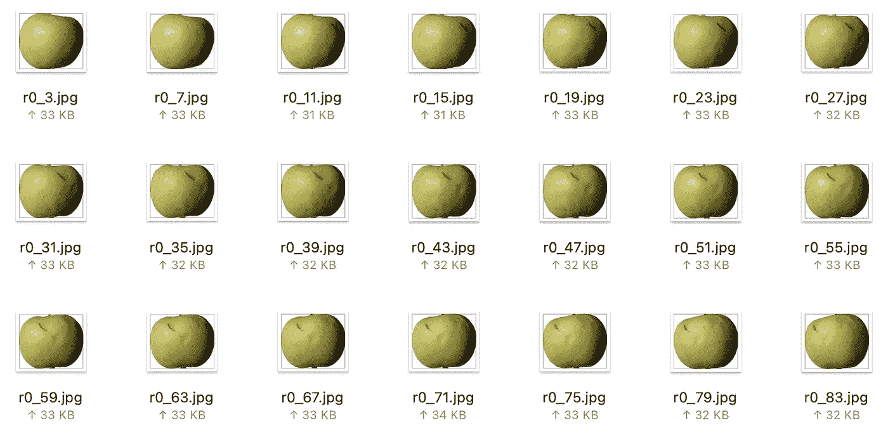*

*图 11 —一个[水果 360](https://www.kaggle.com/datasets/moltean/fruits?resource=download) 数据集的样本(图片由作者提供)*

*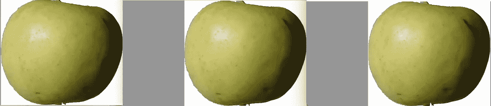*

*图 12——三帧[结果 360](https://www.kaggle.com/datasets/moltean/fruits?resource=download) 数据集之间的差异(图片由作者提供)*

*在这个数据集上的测试将为我们提供关于图像重复/近似重复查找器性能如何的很好的反馈，因为所有图像都是相邻的帧。这意味着每个独特类别的图片都非常相似。*

*其次， [SFBench](https://www.kaggle.com/datasets/orjwanzaafarani/sfbench) 是一个由 40 幅图像组成的数据集，用于评估[基于内容的图像检索(CBIR)](https://en.wikipedia.org/wiki/Content-based_image_retrieval#:~:text=Content%2Dbased%20image%20retrieval%2C%20also,this%20survey%20for%20a%20scientific) 系统。*

*请注意，本文的目的不是构建或评估 CBIR 系统。我们使用这个数据集只是为了测试图像变换(如 3D 投影和旋转)如何影响这些方法的性能。*

*下面的图 13 展示了数据集的一些样本图像。像第一个数据集一样，它由每个场景的 4 幅图像组成。*

*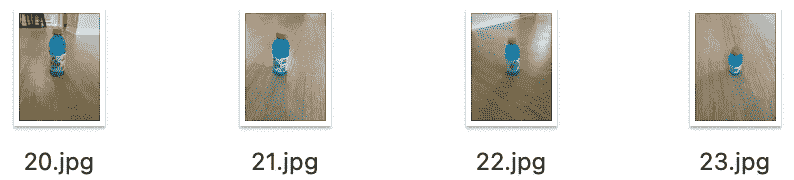*

*图 SFBench 数据集的示例(图片由作者提供)*

# *实验*

*我按照以下方式使用两个数据集测试了每种方法:*

*   *实验 1:速度和准确性*
*   *实验 2:对图像变换的弹性*
*   *实验 3:科学距离.欧几里得速度与数字线性速度.范数速度*

> *注:所有测试我用的都是 2019 款 MacBook Pro CPU。此外，您可以在 [Github 存储库](https://github.com/OrjwanZaafarani/image-duplicate-finder-guide)中找到所有的测试。*

## *实验 1:速度和准确性*

*该测试提出了图像重复查找器系统在速度和准确性方面的最佳方法。接下来的步骤如下:*

*   *读取[水果 360](https://www.kaggle.com/datasets/moltean/fruits?resource=download) 数据集的图像。*
*   *将它们转换为 RGB*
*   *将图像调整到固定大小*
*   *使用五种方法*
*   *获取与参考图片最相似的 3 个图片。*
*   *计算该方法比较一对图像所需的平均时间(秒)*
*   *计算准确度(对于每个参考图像，如果检测到 3 个副本/近似副本，则准确度为 100%)*

*结果(如表 1 所示)清楚地表明，余弦相似性占主导地位，而使用 CNN 计算特征的相似性被认为是寻找图像的副本/近似副本的过度工程化，因为它的运行时间比余弦相似性慢大约 250 倍，同时保持接近的精度。此外，如果速度是一个重要因素，图像哈希是一个很好的选择。*

> *访问这篇[文章【5】](https://medium.com/@sasi24/cosine-similarity-vs-euclidean-distance-e5d9a9375fc8#:~:text=Although%20the%20magnitude%20(length)%20of,to%20OB%20than%20to%20OC.&text=As%20can%20be%20seen%20from,better%20than%20the%20Euclidean%20distance.)了解更多关于欧几里德距离何时优于余弦相似度，反之亦然..*

*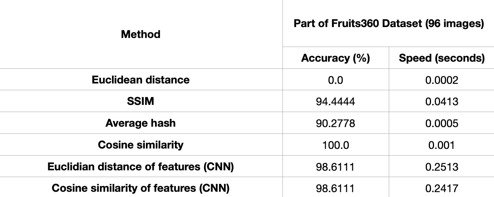*

*表 1 —实验 1 的结果*

## *实验 2:对图像变换的弹性*

*该测试遵循与实验 1 相同的步骤。唯一的区别是使用的数据集和调整大小的因素；我使用了 [SFBench](https://www.kaggle.com/datasets/orjwanzaafarani/sfbench) ，注意到图像重复查找器的目的不是检测和识别相似的转换图像。我只是在评估这些方法在 CBIR 系统中潜在用途的弹性。*

*从逻辑上讲，由于 CNN 在其图层中保存空间信息，因此特征相似度方法表现最佳。表 2 总结了如下结果:*

*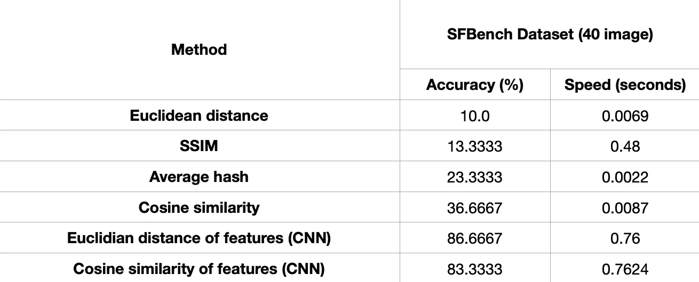*

*表 2 —实验 2 的结果*

## *实验 3: Scipy distance.euclidean 与 Numpy linalg.norm 速度(Extra)*

*最后一个实验通过重复大约 2300 次相同的操作来考察 Scipy 和 Numpy 实现之间的比较。这个测试是本文的一个额外步骤，不影响图像重复/近似重复查找器系统的功能。*

*结果显示，它们的性能相似(表 3)。*

*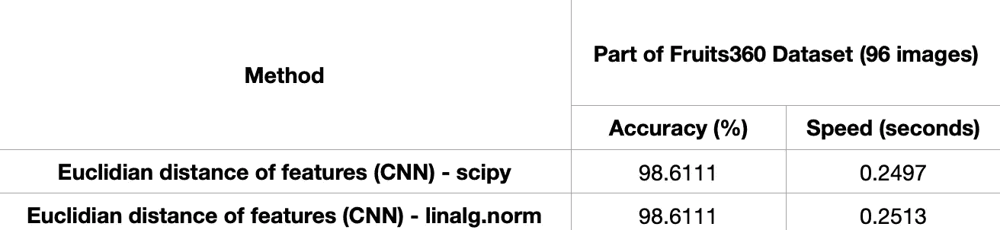*

*表 3-实验 3 的结果*

# *结论*

*总之，我们浏览了欧几里德距离、SSIM、图像散列、余弦相似性和特征相似性的概念和 Python 代码。此外，我们还确定了图像变换对这些算法性能的敏感性。最后，通过实验，我们根据要求总结出了最佳的方法:速度和精度。*

# *文章的材料*

*您可以在 [Github 资源库](https://github.com/OrjwanZaafarani/image-duplicate-finder-guide)中找到所有的数据集、实验和结果。此外，只要每个数据集遵循相同的命名约定，您就可以测试您选择的数据集。*

# *资源*

*[1]，，王，等.图像质量评价:从错误可见性到结构相似性，2004*

*[2][SSIM Imatest 有限责任公司:结构相似性指数，v.22.1](https://www.imatest.com/docs/ssim/)*

*[3] [达塔，关于结构相似指数的一切(SSIM):py torch 中的理论+代码，2020 年](https://medium.com/srm-mic/all-about-structural-similarity-index-ssim-theory-code-in-pytorch-6551b455541e)*

*【4】[数学书库，](https://math.libretexts.org/Bookshelves/Precalculus/Precalculus_(OpenStax)/08%3A_Further_Applications_of_Trigonometry/8.08%3A_Vectors) [三角学的进一步应用](https://math.libretexts.org/Bookshelves/Precalculus/Precalculus_(OpenStax)/08%3A_Further_Applications_of_Trigonometry/8.08%3A_Vectors) : [向量。2021 年](https://math.libretexts.org/Bookshelves/Precalculus/Precalculus_(OpenStax)/08%3A_Further_Applications_of_Trigonometry/8.08%3A_Vectors)*

*[5] [Nagella，余弦相似度 Vs 欧几里德距离，2019](https://medium.com/@sasi24/cosine-similarity-vs-euclidean-distance-e5d9a9375fc8#:~:text=Although%20the%20magnitude%20(length)%20of,to%20OB%20than%20to%20OC.&text=As%20can%20be%20seen%20from,better%20than%20the%20Euclidean%20distance.)*

*[6] [内容区块链项目，测试不同图像哈希函数，2019](https://content-blockchain.org/research/testing-different-image-hash-functions/)*

*[7] [Krawetz，黑客因素博客，看起来像它，2011 年](https://www.hackerfactor.com/blog/index.php?/archives/432-Looks-Like-It.html)*

*[8] [Gohrani，机器学习中使用的不同类型的距离度量，2019](https://medium.com/@kunal_gohrani/different-types-of-distance-metrics-used-in-machine-learning-e9928c5e26c7)*

*[9] [克雷，如何计算余弦相似度(附代码)，2020](https://clay-atlas.com/us/blog/2020/03/27/cosine-similarity-text-calculate-python/)*

## *其他有用的资源*

*   *[昆都，机器学习中的各类距离度量，2019](https://medium.com/analytics-vidhya/various-types-of-distance-metrics-machine-learning-cc9d4698c2da)*
*   *[雅图，如何用 NumPy 计算欧氏距离？，2020 年](https://stackoverflow.com/questions/1401712/how-can-the-euclidean-distance-be-calculated-with-numpy#:~:text=Use%20numpy.linalg.norm%3A)*